# Abonnements verwalten{#managing-subscriptions}

## Über Informationsdienste {#about-information-services}

Ein Informationsdienst zeichnet sich durch folgende Merkmale aus:

* erfordert eine Anmeldung oder ein Abonnement (Opt-in);
* bietet die Möglichkeit einer gewollten (Opt-out) oder automatischen Abmeldung (begrenzter Service, z. B. bei einem Testangebot);
* verfügt über Mechanismen zur Bestätigung von An- und/oder Abmeldung (einfache Bestätigung, Double-Opt-in usw.);
* protokolliert die Handlungen der angemeldeten Nutzer.

Diese Dienste bieten standardmäßig spezifische Berichte und Statistiken: Verfolgung der angemeldeten Nutzer, Treuegrad, Abmeldekurven usw.

In E-Mail-Sendungen werden die erforderlichen Abmelde-Links automatisch erzeugt. Der gesamte Opt-in- bzw. Opt-out-Prozess läuft vollautomatisch ab und wird dokumentiert, um im Einklang mit der herrschenden Rechtsprechung zu stehen.

Drei verschiedene Anmelde- bzw. Abmeldemodi stehen zur Auswahl:

1. manuell,
1. durch Import (nur Anmeldung),
1. über ein Webformular.

>[!NOTE]
>
>Ein Muster zum Erstellen eines Anmeldeformulars mit zweifacher Bestätigung finden Sie in [diesem Abschnitt](../../web/using/use-cases--web-forms.md#create-a-subscription--form-with-double-opt-in).

## Informationsdienste erstellen {#creating-an-information-service}

Sie haben die Möglichkeit, Abonnements für Informationsdienste zu erstellen und zu verwalten und ihnen Bestätigungsnachrichten oder andere automatische Mitteilungen zuzuordnen.

Um auf die Informationsdienstkarte zuzugreifen, gehen Sie zum **[!UICONTROL Profiles and Targets]** Universum und klicken Sie auf den **[!UICONTROL Services and Subscriptions]** Link.

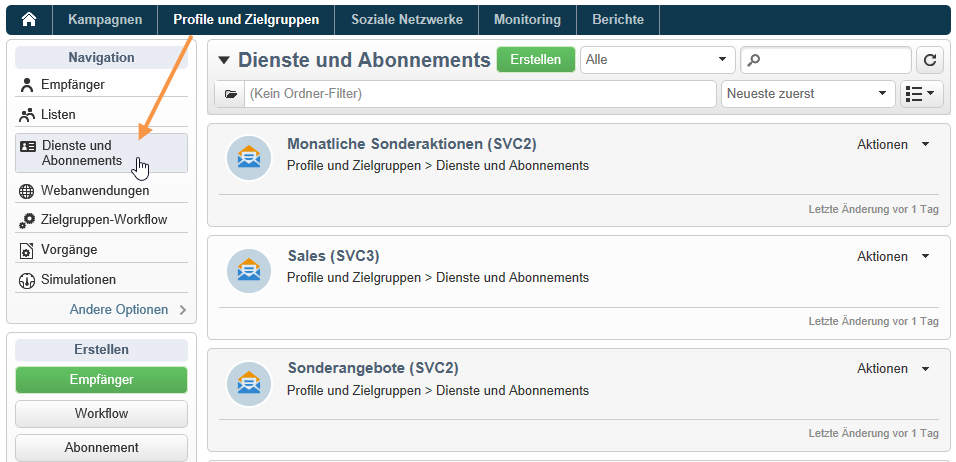

Um einen vorhandenen Dienst zu bearbeiten, klicken Sie auf dessen Namen. Um einen Dienst zu erstellen, klicken Sie auf die **[!UICONTROL Create]** Schaltfläche oberhalb der Liste.

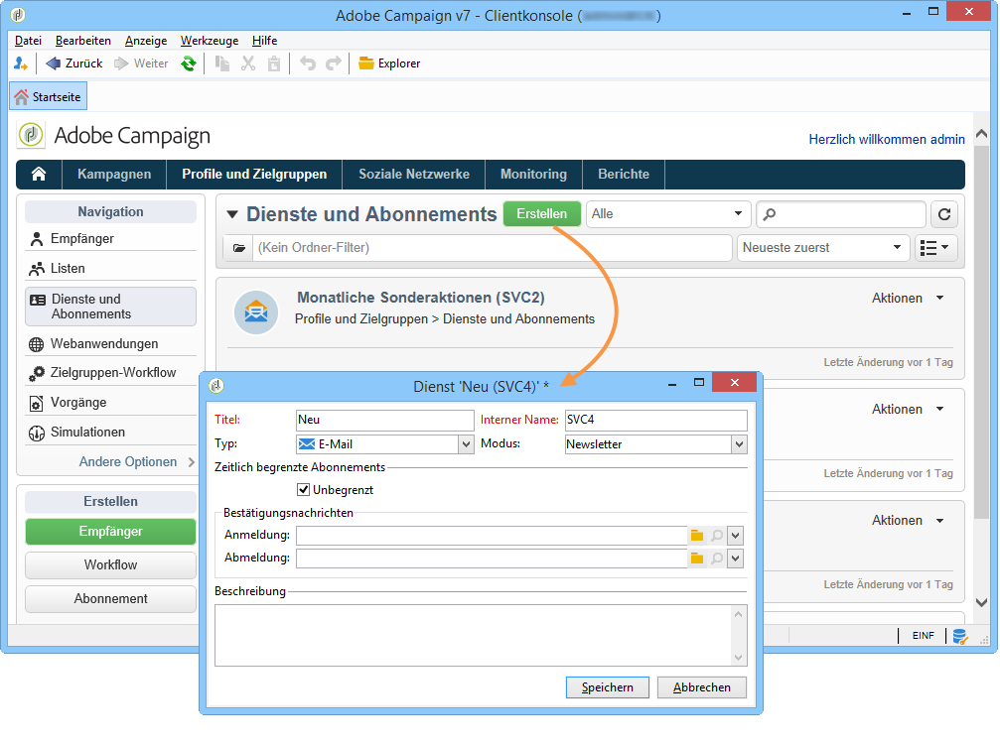

* Enter the name of the service in the **[!UICONTROL Label]** field and select the delivery channel: email, mobile, Facebook, Twitter, or mobile applications.

   >[!NOTE]
   >
   >Facebook- und Twitter-Abonnements sind in [diesem Abschnitt](../../social/using/about-social-marketing.md)ausführlich beschrieben. Abonnements für Mobilanwendungen finden Sie unter [Informationen zum Kanal](../../delivery/using/about-mobile-app-channel.md)für Mobilanwendungen.

* Wählen Sie für einen E-Mail-Typdienst den **Bereitstellungsmodus**. Folgende Modi sind möglich: **[!UICONTROL Newsletter]** oder **[!UICONTROL Viral]**.
* Sie können **Bestätigungsmeldungen** für ein Abonnement oder eine Kündigung senden. Wählen Sie dazu die Bereitstellungsvorlagen aus, die zum Erstellen der entsprechenden Auslieferungen aus den **[!UICONTROL Subscription]** Feldern und **[!UICONTROL Unsubscription]** Feldern verwendet werden sollen. Diese Vorlagen müssen mit einer **[!UICONTROL Subscription]** Typzielzuordnung ohne definiertes Ziel konfiguriert werden. Siehe Abschnitt [Informationen zum E-Mail-Kanal](../../delivery/using/about-email-channel.md).
* Abonnements sind standardmäßig unbegrenzt. Sie können die **[!UICONTROL Unlimited]** Option deaktivieren, um eine Gültigkeitsdauer für den Dienst festzulegen. Die Dauer kann in Tagen (**[!UICONTROL d]** ) oder Monaten (**[!UICONTROL m]** ) angegeben werden.

Nachdem der Dienst gespeichert wurde, wird er der Liste &quot;Dienste und Abonnements&quot;hinzugefügt: Klicken Sie auf den Namen, um ihn zu bearbeiten. Es stehen verschiedene Registerkarten zur Verfügung. Auf der **[!UICONTROL Subscriptions]** Registerkarte können Sie sich die Liste der Abonnenten des Informationsdienstes (**[!UICONTROL Active subscriptions]** Registerkarte) oder des Abonnement-/Abonnementverlaufs (**[!UICONTROL History]** Registerkarte) ansehen. Sie können auf dieser Registerkarte auch Abonnenten hinzufügen und löschen. See [Adding and deleting subscribers](#adding-and-deleting-subscribers).

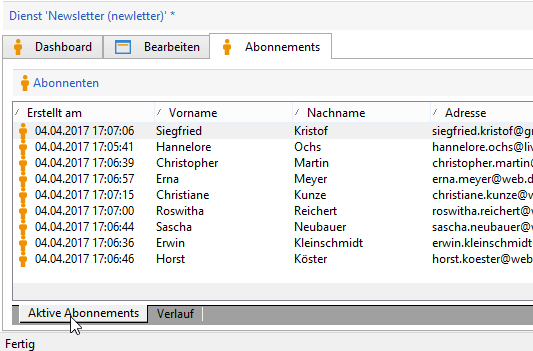

Die **[!UICONTROL Detail...]**-Schaltfläche bietet die Möglichkeit, die Eigenschaften des Abonnements für den markierten Empfänger anzuzeigen und zu ändern.

Sie können die Eigenschaften des Abonnements für einen Empfänger ändern.

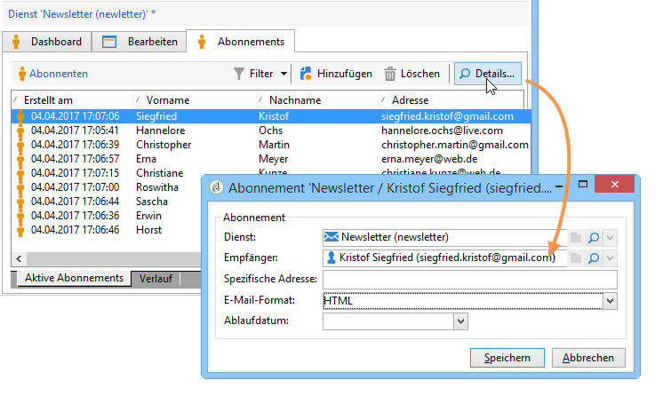

Klicken Sie im Dashboard auf die **[!UICONTROL Reports]** Registerkarte, um Abonnements zu verfolgen: Änderungen der Abonnementstufen, der Gesamtanzahl der Abonnenten usw. Auf dieser Registerkarte können Sie Berichte archivieren und sich die Geschichte ansehen.

## Abonnenten hinzufügen und löschen {#adding-and-deleting-subscribers}

Klicken Sie auf der **[!UICONTROL Subscriptions]** Registerkarte eines Informationsdienstes auf , um Abonnenten hinzuzufügen **[!UICONTROL Add]** . Sie können auch mit der rechten Maustaste auf die Liste der Abonnenten klicken und die Option **[!UICONTROL Add]**. Wählen Sie den Ordner aus, in dem die zu abonnierenden Profile gespeichert werden, wählen Sie dann die zu abonnierenden Profile aus und klicken Sie auf **[!UICONTROL OK]** , um zu validieren.

To delete subscribers, select them and click **[!UICONTROL Delete]**. You can also right-click the subscriber list and select **[!UICONTROL Delete]**.

In beiden Fällen können Sie eine Bestätigungsmeldung an die betreffenden Benutzer senden, wenn eine Liefervorlage für Abonnements an den Dienst angehängt wurde (siehe [Erstellen eines Informationsdienstes](#creating-an-information-service)). Mit einer Warnung können Sie diese Bereitstellung überprüfen oder nicht validieren:

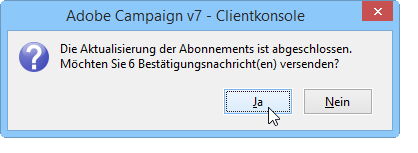

See [Subscription and unsubscription mechanisms](#subscription-and-unsubscription-mechanisms).

## An Abonnenten eines Dienstes versenden {#delivering-to-the-subscribers-of-a-service}

Um einen Versand an alle Abonnenten eines bestimmten Informationsdienstes zu erstellen, muss die Zielgruppe wie nachfolgend beschrieben definiert werden:

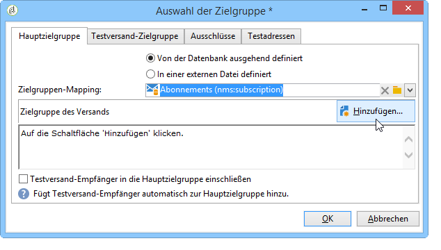

>[!CAUTION]
>
>The target mapping must be **[!UICONTROL Subscriptions]**.

Wählen Sie **[!UICONTROL Subscribers of an information service]** und klicken Sie auf **[!UICONTROL Next]**.

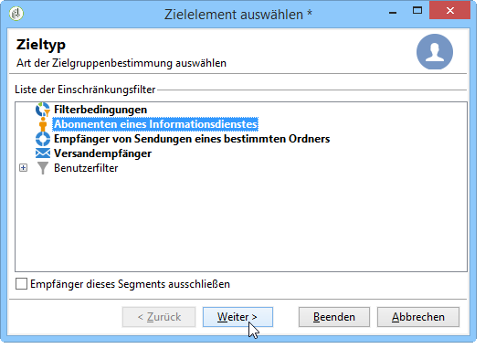

Select the targeted information service and click **[!UICONTROL Finish]**.

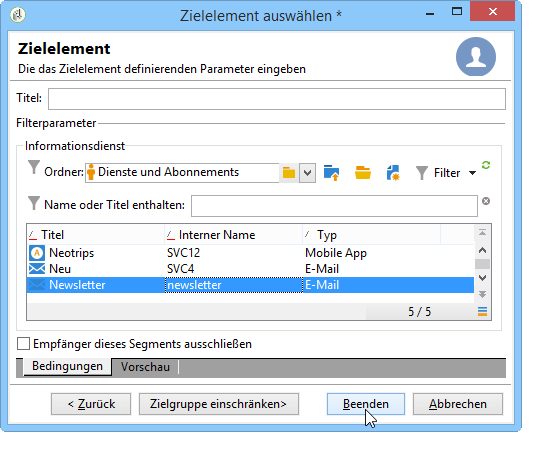

The **[!UICONTROL Preview]** tab lets you view the list of subscribers to the selected information service.

## An- und Abmeldungen {#subscription-and-unsubscription-mechanisms}

Sie haben die Möglichkeit, An- und Abmeldevorgänge sowie die Abonnentenverwaltung zu automatisieren.

>[!NOTE]
>
>Sie können neuen Abonnenten und jenen, die sich abmelden, eine Bestätigungsnachricht senden.\
>The content of this message is defined in the information service configuration via the **[!UICONTROL Subscription]** or **[!UICONTROL Unsubscription]** fields.
>
>The confirmation messages are created via the delivery templates specified in these fields. These target mappings must be **[!UICONTROL Subscriptions]**.

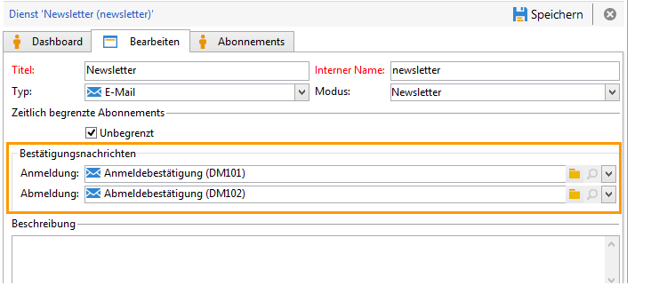

### Empfänger für Informationsdienste anmelden {#subscribing-a-recipient-to-a-service}

Sie haben verschiedene Möglichkeiten, um einen Empfänger für einen Dienst anzumelden:

* Manually add the service: to do this, from the **[!UICONTROL Subscriptions]** tab of their profile, click **[!UICONTROL Add]** and select the information service concerned.

   Lesen Sie diesbezüglich auch über die Bearbeitung von Empfängerprofilen in [diesem Abschnitt](../../platform/using/editing-a-profile.md).

* Abonnieren Sie automatisch eine Reihe von Empfängern für diesen Dienst. Die Liste der Empfänger kann aus einem Filtervorgang, einer Gruppe, einem Ordner, einem Import oder einer direkten Auswahl mit der Maus stammen. Um diese Empfänger zu abonnieren, wählen Sie die Profile aus und klicken Sie mit der rechten Maustaste. Wählen Sie **[!UICONTROL Actions > Subscribe selection to a service...]** den betreffenden Dienst aus und starten Sie den Vorgang.
* Empfänger im Zuge eines Imports für einen Dienst anmelden. Geben Sie im letzten Schritt des Import-Assistenten den gewünschten Dienst an.

   Weiterführende Informationen hierzu finden Sie in [diesem Abschnitt](../../platform/using/importing-data.md#import-wizard).

* Empfänger melden sich persönlich über ein Webformular an.

   Weiterführende Informationen hierzu finden Sie in [diesem Abschnitt](../../web/using/about-web-applications.md).

* Creating a targeting workflow and using a **[!UICONTROL Subscription service]** box.

   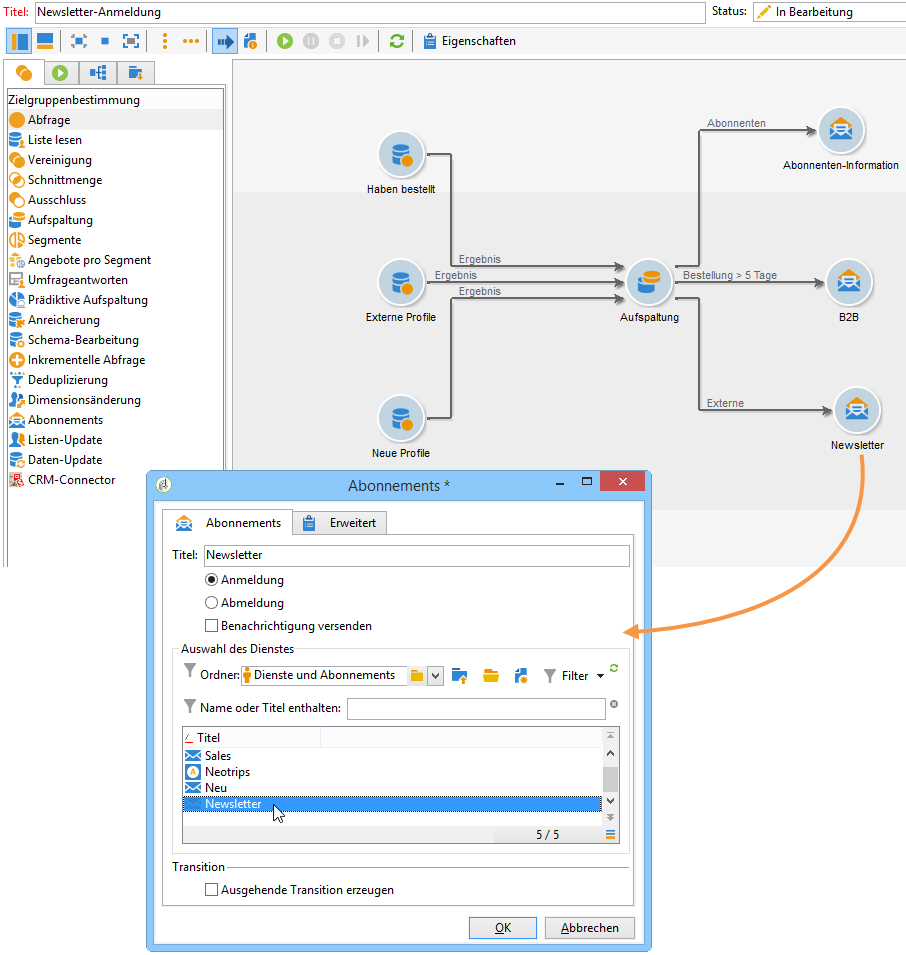

   Workflows und ihre Verwendung in Formularen werden in [diesem Abschnitt](../../workflow/using/about-workflows.md) beschrieben.

### Empfänger von einem Dienst abmelden {#unsubscribing-a-recipient-from-a-service}

#### Manuelle Abmeldung {#manual-unsubscribing}

Für kommerzielle E-Mail-Sendungen ist das Einfügen eines Abmelde-Links gesetzlich vorgeschrieben. Empfänger, die nicht mehr kontaktiert werden möchten, können auf den entsprechenden Link klicken und werden so zukünftig aus den Versandzielgruppen ausgeschlossen.

Der Standardlink zum Rückgängigmachen des Abonnements wird über die letzte Schaltfläche in der Symbolleiste des Inhaltseditors eingefügt, der im Bereitstellungsassistenten bereitgestellt wird (siehe [Info zur Personalisierung](../../delivery/using/about-personalization.md)). Wenn der Empfänger auf diesen Link klickt, wird das Profil in der schwarzen Liste aufgeführt (Ausschluss), d. h., dieser Empfänger wird nicht mehr durch eine Übermittlungsaktion als Ziel ausgewählt.

Die Empfänger können sich jedoch von einem Dienst abmelden, ohne sich von allen Diensten abmelden zu müssen. Um dies zu ermöglichen, können Sie ein Webformular verwenden (siehe [diesen Abschnitt](../../web/using/adding-fields-to-a-web-form.md#subscription-checkboxes)) oder einen personalisierten Link zum Rückgängigmachen des Abonnements einfügen (siehe [Personalisierungsblöcke](../../delivery/using/personalization-blocks.md)).

Sie können auch einen Empfänger manuell vom Empfängerprofil abmelden. Klicken Sie dazu auf die **[!UICONTROL Subscriptions]** Registerkarte des betreffenden Empfängers, wählen Sie die betreffenden Informationsdienste aus und klicken Sie auf **[!UICONTROL Delete]**.

Sie können sich über den betreffenden Informationsdienst endlich von einem oder mehreren Empfängern abmelden. Klicken Sie dazu auf die **[!UICONTROL Subscriptions]** Registerkarte des Dienstes, wählen Sie die betreffenden Empfänger aus und klicken Sie auf **[!UICONTROL Delete]**.

#### Automatische Abmeldung {#automatic-unsubscription}

Ein Informationsdienst kann eine begrenzte Dauer haben. Die Abonnements der Empfänger werden nach Ablauf der Gültigkeitsdauer automatisch aufgehoben. Dieser Zeitraum wird auf der **[!UICONTROL Edit]** Registerkarte der Diensteigenschaften angegeben. Er wird in Tagen ausgedrückt.

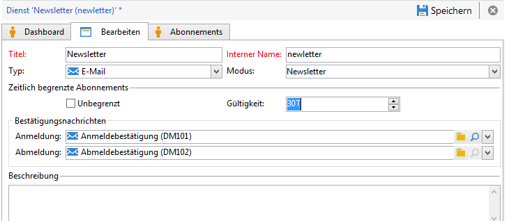

Sie können auch einen Arbeitsablauf für das Abmelden für eine Population einrichten. Gehen Sie dazu wie bei einem Abonnement-Workflow vor, wählen Sie jedoch die **[!UICONTROL Unsubscription]** Option aus. See [Subscribing a recipient to a service](#subscribing-a-recipient-to-a-service).

### Abonnement-Verfolgung {#subscriber-tracking}

You can track the changes in subscriptions to the information services using the **[!UICONTROL Reports]** link on the dashboard.

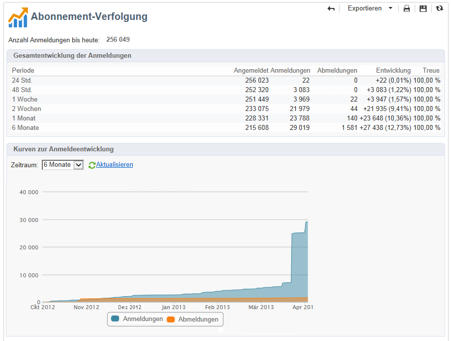
