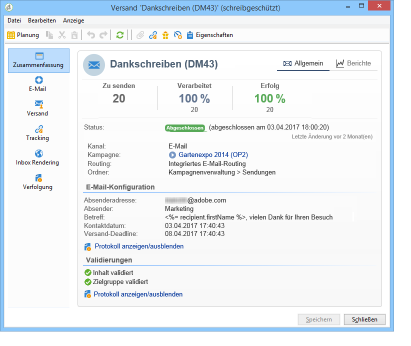
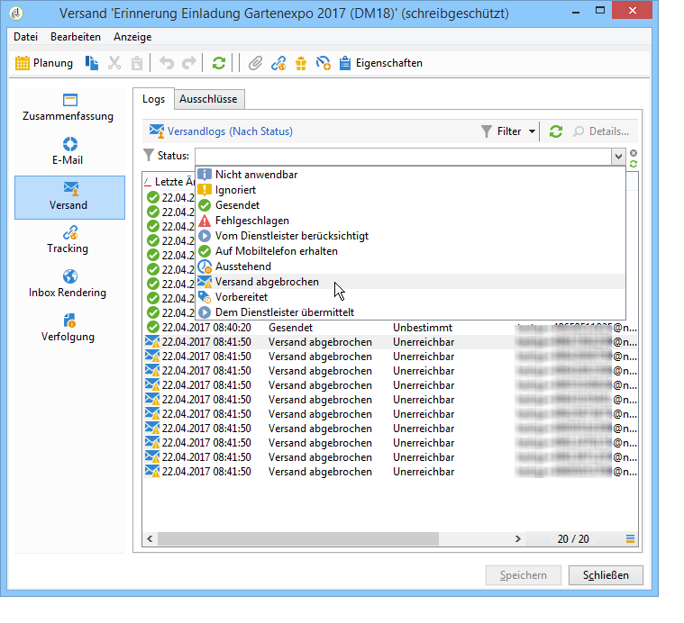
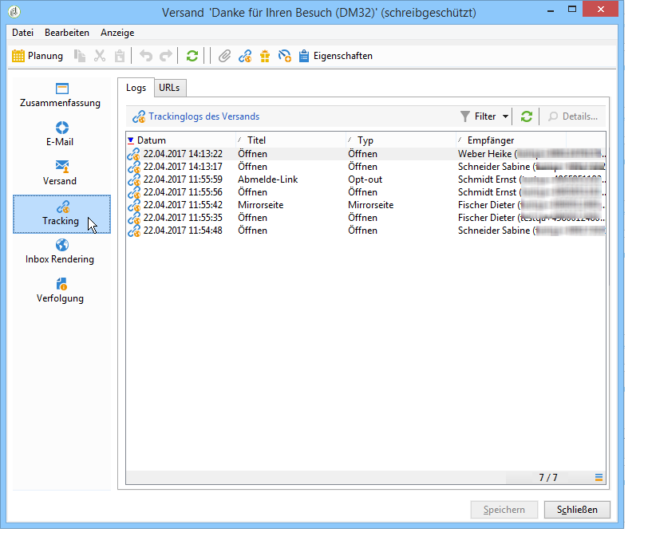
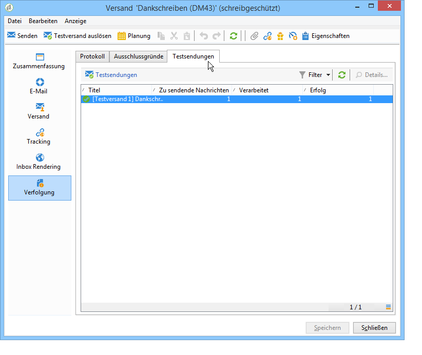

# Sendungen beobachten{#monitoring-a-delivery}

Im **Versand-Dashboard** können Sie Sendungen beobachten und etwaige Probleme beim Nachrichtenversand erkennen.

**Verwandte Themen**

* [Ursachen von fehlgeschlagenen Sendungen](../../delivery/using/understanding-delivery-failures.md)
* [Funktionsweise der Quarantäneverwaltung](../../delivery/using/understanding-quarantine-management.md)
* [Best Practices beim Versand](https://docs.campaign.adobe.com/doc/AC/getting_started/DE/deliveryBestPractices.html)
* [Erste-Schritte-Handbuch: Verwalten der Zustellbarkeit](https://docs.adobe.com/content/help/de-DE/campaign-classic/using/sending-messages/deliverability-management/about-deliverability.html)

## Versand-Dashboard {#delivery-dashboard}

Sie können Versandinformationen aufrufen, indem Sie das Dashboard öffnen und auf die verschiedenen Tabs klicken.

Nach Abschluss des Versands kann der Inhalt der einzelnen Tabs nicht mehr verändert werden und steht nur zur Ansicht zur Verfügung.



### Versandzusammenfassung {#delivery-summary}

Der Tab **[!UICONTROL Zusammenfassung]** enthält die Merkmale des Versands: Versandstatus, verwendeter Kanal, Absenderinformationen, Betreff, Informationen zur Ausführung. Weitere Informationen hierzu finden Sie unter [Anzahl gesendeter Nachrichten](#number-of-messages-sent).

Die Rubrik **[!UICONTROL Berichte]** bietet Übersichten und Analysen mit verschiedenen Schwerpunkten: Allgemeiner Sendebericht, detaillierter Bericht, Versandbericht, Verteilung fehlgeschlagener Sendungen, Öffnungsrate, Klicks und Transaktionen etc. Der Inhalt dieser Rubrik kann Ihren Bedürfnissen entsprechend angepasst werden. Weiterführende Informationen dazu finden Sie in [diesem Abschnitt](../../reporting/using/delivery-reports.md).

### Protokolle und Versandverlauf {#delivery-logs-and-history}

Der **[!UICONTROL Versand]**-Tab zeigt die Versandlogs, d. h. die Liste der Zustellversuche, und zeigt für jeden Empfänger den Status des Versands an.

Sie haben die Möglichkeit, beispielsweise nur fehlgeschlagene Zustellversuche anzuzeigen oder die Empfänger, die in Quarantäne gekommen sind. Klicken Sie hierfür auf die Schaltfläche **[!UICONTROL Filter]** und wählen Sie **[!UICONTROL Nach Status]**. Wählen Sie nun den gewünschten Status aus der Dropdown-Liste aus.



Unterschiedliche Status werden auf [dieser Seite](#delivery-statuses) beschrieben.

>[!NOTE]
>
>Der Link **[!UICONTROL Mirrorseite dieser Nachricht anzeigen...]** ermöglicht das Laden der Mirrorseite der markierten Zeile in einem separaten Fenster. Dies ist jedoch nur für Sendungen mit HTML-Inhalt möglich. Weitere Informationen finden Sie unter [Mirrorseite erstellen](../../delivery/using/sending-messages.md#generating-the-mirror-page).

### Trackinglogs   {#tracking-logs}

Im **[!UICONTROL Tracking]**-Tab wird der Tracking-Verlauf des Versands angezeigt. Hier werden die Tracking-Informationen bezüglich aller von Adobe Campaign gesendeten Nachrichten, d. h. alle getrackten URLs gelistet. Tracking-Informationen werden stündlich aktualisiert.

>[!NOTE]
>
>Sollte das Tracking für einen Versand nicht aktiviert worden sein, wird dieser Tab nicht angezeigt.

Die Tracking-Konfiguration erfolgt im Versand-Assistenten. Siehe [Getrackte Links konfigurieren](../../delivery/using/how-to-configure-tracked-links.md).

Interpretationen der **[!UICONTROL Trackingdaten]** finden Sie in den Versandberichten. Weiterführende Informationen dazu finden Sie in [diesem Abschnitt](../../reporting/using/delivery-reports.md).



### Versandverfolgung {#delivery-audit-}

Der Tab **[!UICONTROL Verfolgung]** enthält u. a. Informationen zu den Testsendungen des betreffenden Versands. Die **[!UICONTROL Aktualisieren]**-Schaltfläche ermöglicht die Aktualisierung der Informationen, während die **[!UICONTROL Filter]**-Schaltfläche es Ihnen erlaubt, nur die Daten anzuzeigen, die bestimmte Kriterien erfüllen.

Eventuelle Fehler oder Warnmeldungen werden durch spezifische Symbole hervorgehoben. Siehe [Versand analysieren](../../delivery/using/steps-validating-the-delivery.md#analyzing-the-delivery).

Ein Untertab listet die durchgeführten **[!UICONTROL Testsendungen]** auf.



Sie können die Anzeige in diesem Fenster (wie auch in den Tabs **[!UICONTROL Versand]** bzw. **[!UICONTROL Tracking]**) anpassen und die Spalten auswählen, die angezeigt werden sollen. Klicken Sie hierfür auf das Symbol **[!UICONTROL Liste konfigurieren]** in der rechten unteren Ecke des Bildschirms. Weiterführende Informationen zur Listenanzeige finden Sie in [diesem Abschnitt](../../platform/using/adobe-campaign-workspace.md#configuring-lists).

### Synchronisation des Versand-Dashboards {#delivery-dashboard-synchronization}

Im Versand-Dashboard können Sie anhand der verarbeiteten Nachrichten und der Versandlogs überprüfen, ob Ihr Versand erfolgreich durchgeführt wurde.

Manche Indikatoren oder Status können falsch oder nicht aktuell sein. Gehen Sie zur Behebung dieses Problems wie folgt vor:

* Wenn der Versandstatus falsch angezeigt wird, vergewissern Sie sich, dass alle nötigen Validierungen für diesen Versand durchgeführt wurden und die Workflows **[!UICONTROL operationMgt]** und **[!UICONTROL deliveryMgt]** problemlos ablaufen. Dieses Problem kann auch auftreten, wenn vom Versand eine Affinität verwendet wird, die in der Sendeinstanz nicht konfiguriert wurde.
* Wenn Ihre Versandindikatoren noch null anzeigen und eine Mid-Sourcing-Konfiguration verwendet wird, überprüfen Sie den technischen Workflow **[!UICONTROL Mid-Sourcing (Versandzähler)]**. Starten Sie ihn, wenn sein Status nicht **[!UICONTROL Gestartet]** lautet. Sie können dann die Indikatoren neu berechnen lassen, indem Sie mit der rechten Maustaste den entsprechenden Versand im Adobe Campaign-Explorer und danach **[!UICONTROL Aktionen]** > **[!UICONTROL Sende- und Berichtindikatoren neu berechnen...]** auswählen. Weiterführende Informationen zu Trackingindikatoren finden Sie in diesem [Abschnitt](../../reporting/using/delivery-reports.md#tracking-indicators).
* Wenn Ihr Versandzähler nicht die Anzahl Ihrer Sendungen anzeigt, lassen Sie die Indikatoren neu berechnen, indem Sie mit der rechten Maustaste im Adobe Campaign-Explorer den entsprechenden Versand und danach **[!UICONTROL Aktionen]** > **[!UICONTROL Sende- und Berichtindikatoren neu berechnen...]** auswählen, um eine neue Synchronisation durchzuführen. Weiterführende Informationen zu Trackingindikatoren finden Sie in diesem [Abschnitt](../../reporting/using/delivery-reports.md#tracking-indicators).
* Wenn Ihr Versandzähler nicht auf dem aktuellen Stand für Mid-Sourcing-Bereitstellungen ist, vergewissern Sie sich, dass der technische Workflow **[!UICONTROL Mid-Sourcing (Versandzähler)]** läuft. Weiterführende Informationen dazu finden Sie auf dieser [Seite](../../installation/using/mid-sourcing-deployment.md).

Sie können Ihre Sendungen auch mithilfe unterschiedlicher Berichte über das Versand-Dashboard nachverfolgen. Weiterführende Informationen dazu finden Sie in [diesem Abschnitt](../../reporting/using/delivery-reports.md).

## Leistungsprobleme {#performance-issues}

### Checkliste {#checklist-}

Bei mangelhafter Zustellbarkeit überprüfen Sie Folgendes:

* **Die Versandgröße**: Größere Sendungen benötigen zur Ausführung länger. MTA-Kindprozesse werden für Standard-Bündelgrößen konfiguriert. Diese sind für die meisten Instanzen ausreichend, müssen jedoch überprüft werden, wenn Sendungen immer zu langsam durchgeführt werden.
* **Die Zielgruppe des Versands**: Die Versandleistung kann durch Softbounce-Fehler beeinträchtigt werden, die entsprechend der Konfiguration der Neuversuche gehandhabt werden. Je größer die Anzahl der Fehler ist, desto mehr Neuversuche sind nötig.
* **Die Gesamtauslastung der Plattform**: Wenn mehrere große Sendungen durchgeführt werden, kann die gesamte Plattform davon beeinträchtigt sein. In diesem Zusammenhang sollten Sie auch die IP-Reputation und Probleme bei der Zustellbarkeit überprüfen. Weiterführende Informationen dazu finden Sie im Adobe Campaign-Handbuch zu [Best Practices für die Optimierung der Zustellbarkeit](https://docs.adobe.com/content/help/de-DE/campaign-classic/using/sending-messages/deliverability-management/about-deliverability.html) und auf [dieser Seite](../../delivery/using/about-deliverability.md).

Auch die Wartung der Plattform und der Datenbank kann die Leistung beim Versand beeinträchtigen. Weiterführende Informationen dazu finden Sie auf [dieser Seite](../../production/using/database-performances.md).

### Langsame Sendungen {#slow-deliveries}

Nach dem Anklicken der **[!UICONTROL Senden]**-Schaltfläche dauert der Versand länger als üblich. Dies kann unterschiedliche Ursachen haben:

* Manche Internet Service Provider haben Ihre IP-Adressen möglicherweise auf eine Schwarze Liste gesetzt. Prüfen Sie in diesem Fall Ihre Broadlogs und lesen Sie in [diesem Erste-Schritte-Handbuch](https://docs.adobe.com/content/help/de-DE/campaign-classic/using/sending-messages/deliverability-management/about-deliverability.html).
* Ihr Versand könnte für eine rasche Verarbeitung zu groß sein. Dies kann passieren, wenn eine umfassende JavaScript-Personalisierung vorliegt oder die Versandgröße mehr als 60 KB beträgt. Nähere Informationen zu den Inhaltsrichtlinien finden Sie im Adobe Campaign-Handbuch [Best Practices beim Versand](https://docs.campaign.adobe.com/doc/AC/getting_started/DE/deliveryBestPractices.html).
* Der Versand könnte im MTA (Message Transfer Agent) von Adobe Campaign gedrosselt worden sein. Dies kann folgende Ursachen haben:

   * Nachricht in die Warteschlange gestellt (Fehlermeldung **[!UICONTROL Kontingent ausgeschöpft]**): Das in Campaign von den MX-Regeln definierte Kontingent ist ausgeschöpft. Weitere Informationen zu dieser Meldung finden Sie auf [dieser Seite](https://helpx.adobe.com/de/campaign/kb/acc-deliverability-faq.html). Weitere Informationen zu MX-Regeln finden Sie auf [dieser Seite](../../delivery/using/technical-recommendations.md#mx-rules).
   * Nachricht in die Warteschlange gestellt (Fehlermeldung **[!UICONTROL dynamische Durchsatzkontrolle]**): Vom Campaign MTA wurden beim Sendeversuch an einen ISP Fehler entdeckt, weshalb der Versand verlangsamt wurde, um die Fehlerdichte zu verringern und zu vermeiden, dass die IP-Adresse auf eine Schwarze Liste gesetzt wird.

* Durch einen Systemfehler wird möglicherweise verhindert, dass Server miteinander interagieren. Dadurch kann sich der gesamte Versandvorgang verlangsamen. Überprüfen Sie die Server, um sicherzustellen, dass keine Speicher- oder Ressourcenfehler vorliegen, die Campaign beispielsweise daran hindern können, Personalisierungsdaten abzurufen.

### Best Practices zur Leistungserhaltung {#best-practices-performance}

* Bewahren Sie auf der Instanz keine fehlgeschlagenen Sendungen auf, da dadurch temporäre Tabellen gespeichert werden, was wiederum die Leistung beeinträchtigt.

* Entfernen Sie nicht mehr benötigte Sendungen.

* Inaktive Empfänger in den letzten 12 Monaten werden aus der Datenbank entfernt, um die Adressenqualität zu erhalten.

* Planen Sie nicht die gleichzeitige Durchführung umfangreicher Sendungen. In einem Zeitraum von 5 bis 10 Minuten wird die Last gleichmäßig über das System verteilt. Koordinieren Sie die Planung von Sendungen mit anderen Team-Mitgliedern, um eine optimale Leistung zu gewährleisten. Wenn der Marketing-Server viele verschiedene Aufgaben gleichzeitig ausführt, kann die Leistung verlangsamt werden.

* Halten Sie die Größe Ihrer E-Mails so gering wie möglich. Die empfohlene maximale Größe einer E-Mail beträgt ca. 35 KB. Die Größe eines E-Mail-Versands generiert eine bestimmte Menge an Volumen auf den sendenden Servern.

* Große Sendungen wie Sendungen an über eine Million Empfänger benötigen Platz in den Versandwarteschlangen. Dies allein ist kein Problem für den Server, aber in Kombination mit Dutzenden von anderen großen Sendungen, die alle gleichzeitig ausgehen, kann es zu einer Versandverzögerung führen.

* Durch Personalisierung in E-Mails werden Daten für jeden Empfänger aus der Datenbank abgerufen. Bei vielen Personalisierungselementen erhöht sich dadurch die Datenmenge, die zur Vorbereitung des Versands benötigt wird.

* Indexieren von Adressen. Um die Performance der in der Anwendung verwendeten SQL-Abfragen zu optimieren, kann ein Index vom Hauptelement des Datenschemas deklariert werden.

>[!NOTE]
>
>ISPs würden Adressen nach einer Inaktivitätsphase deaktivieren. Bounce-Nachrichten werden an den Absender gesendet, um sie über diesen neuen Status zu informieren.

## Versandstatus {#delivery-statuses}

Beim Versand können folgende Status auf dem Versand-Dashboard angezeigt werden:

<table> 
 <thead> 
  <tr> 
   <th> Status<br /> </th> 
   <th> Definitionen und Lösungen<br /> </th> 
  </tr> 
 </thead> 
 <tbody> 
  <tr> 
   <td> Nicht anwendbar<br /> </td> 
   <td> Der Versandserver (MTA) hat den Versand zwar berücksichtigt, aber nicht verarbeitet.<br /> </td> 
  </tr> 
  <tr> 
   <td> Ignoriert<br /> </td> 
   <td> Die Nachricht wurde wegen eines Adressfehlers nicht an den Empfänger gesendet. Die Adresse stand entweder auf der Blacklist, war in Quarantäne, nicht verfügbar oder ein Duplikat. <br /> </td> 
  </tr> 
  <tr> 
   <td> Gesendet<br /> </td> 
   <td> Gesendet: Der Versand wurde korrekt an den E-Mail-Provider durchgeführt (aber der Empfänger hat sie nicht unbedingt erhalten).<br /> </td> 
  </tr> 
  <tr> 
   <td> Fehlgeschlagen<br /> </td> 
   <td> Der Versand hat den Empfänger nicht erreicht, weil die Adresse ungültig oder der Posteingang voll war. Die Ursache kann auch ein Problem mit Gestaltungsbausteinen sein, da diese Fehler hervorrufen können, wenn die Schemata nicht mit dem Versand-Mapping übereinstimmen. Siehe <a href="#failed-status" target="_blank">Status „Fehlgeschlagen“</a><br /> </td> 
  </tr> 
  <tr> 
   <td> Vom Dienstleister berücksichtigt<br /> </td> 
   <td> Der SMS-Dienstleister hat den Versand erhalten.<br /> </td> 
  </tr> 
  <tr> 
   <td> Auf Mobiltelefon erhalten<br /> </td> 
   <td> Der Empfänger hat die SMS auf seinem Mobilgerät erhalten.<br /> </td> 
  </tr> 
  <tr> 
   <td> Ausstehend<br /> </td> 
   <td> Die Nachrichten sind versandbereit und werden vom Versand-Server (MTA) verarbeitet. Siehe <a href="#pending-status" target="_blank">Status „Ausstehend“</a>.<br /> </td> 
  </tr> 
  <tr> 
   <td> Versand abgebrochen<br /> </td> 
   <td> Ein Benutzer hat den Vorgang abgebrochen.<br /> </td> 
  </tr> 
  <tr> 
   <td> Vorbereitet<br /> </td> 
   <td> Hierbei handelt es sich um einen Zwischenstatus, der ausschließlich für externe Connectoren (z. B. Mobile-Kanal) verwendet wird. Er folgt auf den 'Ausstehend'-Status, wobei der Folgestatus vom externen Connector bestimmt wird.<br /> </td> 
  </tr> 
  <tr> 
   <td> Dem Dienstleister übermittelt<br /> </td> 
   <td> Der Versand wurde dem SMS-Dienstleister übermittelt, aber noch nicht von ihm empfangen.<br /> </td> 
  </tr> 
 </tbody> 
</table>

Weiterführende Informationen zur Optimierung der Zustellbarkeit von mit Adobe Campaign gesendeten E-Mails finden Sie im Adobe Campaign-Handbuch zu [Best Practices für die Optimierung der Zustellbarkeit](https://docs.adobe.com/content/help/de-DE/campaign-classic/using/sending-messages/deliverability-management/about-deliverability.html) und auf [dieser Seite](../../delivery/using/about-deliverability.md).

### Status Ausstehend {#pending-status}

Nach der Bestätigung des Versands ist dessen Status **[!UICONTROL Ausstehend]**. Das bedeutet, dass im Ausführungsprozess auf die Verfügbarkeit von Ressourcen gewartet wird.

Der Status **[!UICONTROL Ausstehend]** kann bedeuten, dass der Versand terminiert wurde und bis zum entsprechenden Datum in der Warteschlange bleibt. Weitere Informationen hierzu finden Sie im Abschnitt [Versandauslösung](../../delivery/using/steps-sending-the-delivery.md#scheduling-the-delivery-sending).

Wenn der Versand nicht durchgeführt wird und sein Status **[!UICONTROL Ausstehend]** bleibt, kann dies folgende Gründe haben:

* Der MTA (Message Transfer Agent), der für die Durchführung von Modulen und Prozessen am Versandserver und die Verwaltung des E-Mail-Versands verantwortlich ist, wurde möglicherweise noch nicht gestartet oder muss neu gestartet werden. Um dies zu überprüfen und bei Bedarf das Modul zu starten, gehen Sie wie folgt vor:

   * Überprüfen Sie, ob Ihre `mta@<instance>`-Module auf den MTA-Servern ausgeführt werden.

   ```
   nlserver pdump
   HH:MM:SS > Application server for Adobe Campaign Classic (X.Y.Z YY.R build nnnn@SHA1) of DD/MM/YYYY
   [...]
   mta@<INSTANCENAME> (9268) - 23.0 Mb
   [...]
   ```

   * Wenn der MTA nicht aufgelistet ist, starten Sie ihn mit folgendem Befehl:

   ```
   nlserver start mta@<INSTANCENAME>
   ```

   >[!NOTE]
   >
   >Ersetzen Sie `<INSTANCENAME>` durch den Namen Ihrer Instanz (Produktion, Entwicklung usw.). Der Instanzname wird über die Konfigurationsdateien identifiziert: `[path of application]nl6/conf/config-<INSTANCENAME>.xml`

* Möglicherweise wird für den Versand eine Affinität verwendet, die auf dem sendenden Server nicht konfiguriert wurde. Überprüfen Sie in diesem Fall die Konfiguration des Traffic-Managements (IP-Affinität) und verwenden Sie das Feld **[!UICONTROL Verwaltung der IP-Adressen-Affinitäten]**, um die Sendungen mit dem MTA zu verknüpfen, der die Affinität verwaltet. Weiterführende Informationen zu Affinitäten finden Sie in [diesem Abschnitt](../../installation/using/configuring-campaign-server.md#personalizing-delivery-parameters).
* Der Grund für eine ausstehende Versandvorbereitung kann darin liegen, dass zu viele Kampagnen aktiv sind, was die Aktualisierung des Versandstatus blockiert. Um dieses Problem zu beheben, öffnen Sie **[!UICONTROL Optionen]** und erhöhen Sie den Wert **[!UICONTROL NmsOperation_LimitConcurrency]** (der Standardwert ist 10). Führen Sie nicht mehr Kampagnen durch als im Wert für diese Option angegeben ist.

### Status Fehlgeschlagen {#failed-status}

Wenn der Status eines E-Mail-Versands **[!UICONTROL Fehlgeschlagen]** lautet, kann die Ursache an Problemen mit Gestaltungsbausteinen liegen. Gestaltungsbausteine können bei einem Versand Fehler verursachen, wenn beispielsweise das Schema nicht mit dem Versand-Mapping übereinstimmt.

Versandlogs liefern wichtige Informationen über den Grund von fehlgeschlagenen Sendungen, wie z. B.:

* Wenn Empfängernachrichten mit einem Fehler „Nicht erreichbar“ fehlschlagen, der Folgendes angibt: **Fehler beim Kompilieren der Skriptzeile &#39;content htmlContent&#39; Zeile X:`[table]`ist nicht definiert. JavaScript: Fehler beim Auswerten des Inhalts des Skripts htmlContent**. Die Ursache für dieses Problem ist fast immer eine Personalisierung innerhalb des HTML-Codes, die versucht, eine Tabelle oder ein Feld aufzurufen, die bzw. das bei der vorangegangenen Zielgruppenbestimmung oder beim Zielgruppen-Mapping des Versands nicht definiert oder zugeordnet wurde.

   Um dieses Problem zu beheben, müssen der Workflow und der Versandinhalt überprüft werden, um festzustellen, welcher Personalisierungsinhalt konkret die Tabelle aufrufen möchte und ob die Tabelle zugeordnet werden kann. Danach muss entweder der Aufruf dieser Tabelle in der HTML-Datei entfernt oder das Mapping mit dem Versand korrigiert werden.

* Beim Mid-Sourcing-Bereitstellungsmodell können Versandlogs folgende Mitteilung aufweisen: **Error during the call of method &#39;AppendDeliveryPart&#39; on the mid sourcing server: &#39;Communication error with the server: please check this one is correctly configured. Code HTTP 408 &#39;Service temporarily unavailable&#39;**.

   Die Ursache hierfür sind Leistungsprobleme. Dieser Fehler tritt auf, wenn die Marketing-Instanz zu lange für die Datenerfassung benötigt, bevor diese an den Mid-Sourcing-Server gesendet werden.

   Um dieses Problem zu beheben, wird empfohlen, einen Vacuum-Befehl und eine Neuindizierung der Datenbank durchzuführen. Weiterführende Informationen zur Wartung der Datenbank finden Sie in [diesem Abschnitt](../../production/using/recommendations.md).

   Zusätzlich sollten Sie alle Workflows mit einer terminierten Aktivität und alle Workflows mit fehlgeschlagenem Status neu starten. Weiterführende Informationen dazu finden Sie in [diesem Abschnitt](../../workflow/using/scheduler.md).

* Wenn ein Versand fehlschlägt, erscheint folgende Fehlermeldung in den Versandlogs: **DLV-XXXX The count of message prepared (123) is greater than the number of messages to send (111). Please contact support.**

   Normalerweise bedeutet dieser Fehler, dass es in der E-Mail ein Personalisierungsfeld oder einen Gestaltungsbaustein gibt, der für einen Empfänger mehr als einen Datensatz abruft.

   Um dieses Problem zu beheben, überprüfen Sie die verwendeten Personalisierungsdaten und danach den Zieldatensatz für die Empfänger, für deren Feld mehr als ein Eintrag vorhanden ist. Sie können vor der Versandaktivität auch die Aktivität **[!UICONTROL Deduplizierung]** im Zielgruppen-Workflow auswählen, damit immer nur ein einziges Personalisierungsfeld verwendet wird. Weitere Informationen zur Deduplizierung finden Sie auf [dieser Seite](../../workflow/using/deduplication.md).

* Wenn ein Versand fehlschlägt und der Fehler &quot;Unerreichbar&quot; mit der Mitteilung &quot;Empfang einer Bounce Message (Regel &#39;Auto_replies&#39; wurde auf diesen Bounce angewandt)&quot; angezeigt wird, bedeutet dies, dass der Versand erfolgreich war, aber Adobe Campaign eine automatische Antwort vom Empfänger erhalten hat (z. B. eine Abwesenheitsantwort), die den E-Mail-Empfangsregeln &#39;Auto_replies&#39; entsprochen hat. Die automatische Antwort wird von Adobe Campaign ignoriert, und die Empfängeradresse kommt nicht in Quarantäne.

**Verwandte Themen:**

* [Protokolle und Versandverlauf](#delivery-logs-and-history)
* [Ursachen von fehlgeschlagenen Sendungen](../../delivery/using/understanding-delivery-failures.md)
* [Typen und Ursachen für fehlgeschlagene Sendungen](../../delivery/using/understanding-delivery-failures.md#delivery-failure-types-and-reasons)

## Anzahl gesendeter Nachrichten {#number-of-messages-sent}

Auf die Liste aller Sendungen kann im Knoten **[!UICONTROL Kampagnenverwaltung > Sendungen]** zugegriffen werden.

Standardmäßig zeigt die Versandliste die Titel und Status aller im ausgewählten Knoten erstellten Sendungen sowie die Anzahl der zu versendenden, der verarbeiteten und der erfolgreich zugestellten Nachrichten an.

* Die Angabe **[!UICONTROL Zu sendende Nachrichten]** entspricht der Anzahl der Empfänger in der Zielgruppe, nach der Analyse aber vor Absendung.
* In der Spalte **[!UICONTROL Erfolg]** wird die Anzahl der erfolgreich zugestellten Nachrichten angezeigt.
* Die Spalte **[!UICONTROL Verarbeitet]** schließlich enthält die Summe der zugestellten und der fehlerhaften Nachrichten.

Dieselben Informationen werden auch im Versand-Dashboard angezeigt.

>[!NOTE]
>
>Bei umfangreichen Sendungen kann es nützlich sein, diese Werte zu aktualisieren. Machen Sie einen Rechtsklick auf dem entsprechenden Versand. Wählen Sie **[!UICONTROL Aktion > Sende- und Berichtindikatoren neu berechnen...]** und folgen Sie den einzelnen Schritten des Assistenten.

## Terminierte Sendungen {#scheduled-deliveries-}

Wenn Sendungen nicht zum terminierten Zeitpunkt durchgeführt werden, kann die Ursache daran liegen, dass die Server für die Mid-Sourcing-Instanz und die Produktionsinstanz in unterschiedlichen Zeitzonen liegen.

Wenn beispielsweise die Mid-Sourcing-Instanz in der Zeitzone von Brisbane liegt und die Produktionsinstanz in der Zeitzone von Darwin, liegen die beiden Zeitzonen eine halbe Stunde voneinander entfernt. Im Log würden Sie dann sehen, dass ein Versand, dessen Produktion um 11:56 Uhr festgelegt ist, am Mid-Sourcing-Server um 12:26 Uhr terminiert wäre, was einen Unterschied von einer halben Stunde ergibt.
