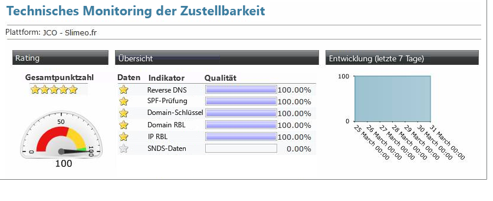

# Monitoring der Zustellbarkeit{#monitoring-deliverability}

Nachstehend finden Sie Einzelheiten zu den verschiedenen Monitoring-Tools von Adobe Campaign sowie weitere Richtlinien zum Monitoring der Zustellbarkeit.

## Monitoring-Tools {#monitoring-tools}

Verwenden Sie die von Adobe Campaign bereitgestellten Funktionen zum Monitoring der Zustellbarkeit Ihrer Plattform.

Das Zustellbarkeits-Package ermöglicht Ihnen Zugriff auf:

* Einen Bericht bezüglich der täglichen Zustell-Leistungen (Technisches Monitoring). Dieser auf Anfrage verfügbare Bericht ermöglicht es Ihnen, an einer bestimmten Adresse einen täglichen Bericht per E-Mail zu erhalten. Weiterführende Informationen erhalten Sie vom Adobe-Kundenunterstützungs-Team.
* Den [Inbox Rendering-Bericht](../../delivery/using/inbox-rendering.md), mit dem Sie Ihre Nachrichten auf gängigen E-Mail-Clients als Vorschau anzeigen können, um Inhalte und Reputation zu überprüfen.
* Übersicht über die Nachrichtenqualität (Zustellung in der Inbox, Spam).

Sie können auch die folgenden Tools verwenden:

* Der **[!UICONTROL Versanddurchsatz]**-Bericht bietet einen Überblick über den Durchsatz der gesamten Plattform für einen bestimmten Zeitraum. Weiterführende Informationen hierzu finden Sie in [diesem Abschnitt](../../reporting/using/global-reports.md#delivery-throughput).
* Der **[!UICONTROL Bericht zum technischen Zustellbarkeits-Monitoring]** enthält eine Reihe von Qualitätsindikatoren zur Zustellbarkeit für Ihre Plattform. Weiterführende Informationen hierzu finden Sie in [diesem Abschnitt](#technical-deliverability-monitoring).
* Bei jedem Versand wird ein Bericht mit Versandstatistiken für die verschiedenen Internet-Dienstanbieter (ISPs) erstellt. Es werden verschiedene Datenqualitäts- und Reputationsmetriken angezeigt, die sich auf die Zustellbarkeit auswirken können, einschließlich der folgenden Zahlen:
   * **[!UICONTROL Hardbounces]** geben Auskunft über die Datenqualität. Diese Zahl sollte unter 2 % liegen.
   * **[!UICONTROL Softbounces]** geben Auskunft über die Reputation. Diese Zahl sollte bei keinem ISP über 10 % liegen.

   Lesen Sie diesbezüglich auch den Abschnitt [Versandstatistiken](../../reporting/using/global-reports.md#delivery-statistics).
* Allgemein bietet Ihnen das [Versand-Dashboard](../../delivery/using/monitoring-a-delivery.md#delivery-dashboard) Zugriff auf:
   * die [Versandzusammenfassung](../../delivery/using/monitoring-a-delivery.md#delivery-summary), die die Details des Versands und die [Anzahl der zu sendenden, der verarbeiteten und der erfolgreich gesendeten Nachrichten](../../delivery/using/monitoring-a-delivery.md#number-of-messages-sent) anzeigt;
   * die [Versandlogs und den Versandverlauf](../../delivery/using/monitoring-a-delivery.md#delivery-logs-and-history), die zeigen, welche Zielgruppe ausgeschlossen wurde und warum;
   * die [Trackinglogs](../../delivery/using/monitoring-a-delivery.md#tracking-logs), die Tracking-Daten wie Öffnungen und Klicks anzeigen.

## Richtlinien für das Monitoring {#monitoring-guidelines}

Im Folgenden finden Sie einige zusätzliche Richtlinien zum Zustellbarkeits-Monitoring:

* Prüfen Sie regelmäßig den [Versanddurchsatz](../../reporting/using/global-reports.md#delivery-throughput) für die gesamte Plattform, um festzustellen, ob er der ursprünglichen Einstellung entspricht.
* Achten Sie darauf, dass [weitere Zustellversuche](../../delivery/using/understanding-delivery-failures.md#retries-after-a-delivery-temporary-failure) in den Versandvorlagen korrekt eingerichtet sind (30 Minuten für das Versuchsintervall und mehr als 20 weitere Versuche).
* Prüfen Sie regelmäßig, ob das [Bounce](../../delivery/using/understanding-delivery-failures.md#bounce-mail-management)-Postfach zugänglich ist, und sorgen Sie dafür, dass die Gültigkeit des Kontos nicht abläuft.
* Prüfen Sie, ob die einzelnen Versanddurchsätze der Gültigkeit des Versandinhalts entsprechen (&quot;Flash Sales&quot; zum Beispiel sollten innerhalb von Minuten, nicht von Tagen zugestellt werden).
* Wenn der Versand in [Schüben](../../delivery/using/steps-sending-the-delivery.md#sending-using-multiple-waves) erfolgt, stellen Sie sicher, dass genügend Zeit vorhanden ist, damit ein Schub fertiggestellt werden kann, bevor der nächste beginnt.
* Prüfen Sie, ob die Anzahl der Fehler und der neuen [Quarantänen](../../delivery/using/understanding-quarantine-management.md) der anderer Sendungen entspricht.
* Carefully consult the [delivery logs](../../delivery/using/monitoring-a-delivery.md#delivery-logs-and-history) in detail to check the kind of errors that are highlighted (grey or black-listing, DNS issues, anti-spam rules, etc.).

## Signal Spam {#signal-spam}

Signal Spam ist ein französischer Dienst, der anonymisiertes Feedback-Schleifen-Reporting für französische ISPs anbietet (Orange, SFR).

* Mit diesem Dienst können Sie die Reputation französischer ISPs verfolgen und die Kundenaktivität tracken.

* Signal Spam bietet auch eine eigene Benutzeroberfläche für die direkte Beschwerdemöglichkeit zum Beenden von Benutzerlogs. Durch diese Beschwerden werden dann E-Mails aus der Datenbank entfernt und in Quarantäne gestellt.

## 250ok {#deliverability-250ok}

[250ok](https://250ok.com/) ist eine ergänzende Überwachungslösung zu den internen Werkzeugen von Adobe zur Bereitstellung von IP, Blacklisting und Reputationsindikatoren.

Die bereitgestellten Werte sind in Echtzeit verfügbar, wodurch proaktive Unterstützung gewährleistet ist.

## Bericht zum technischen Zustellbarkeits-Monitoring {#technical-deliverability-monitoring}

Der Bericht zum technischen Zustellbarkeits-Monitoring wird täglich aktualisiert und ist aufrufbar, indem Sie zu **[!UICONTROL Monitoring]** > **[!UICONTROL Übersicht]** navigieren und auf den Link **[!UICONTROL Technisches Monitoring]** auf dem Tab **[!UICONTROL Startseite]** von Adobe Campaign klicken. Er enthält eine Reihe von Indikatoren zur Zustellungsqualität Ihrer Plattform.

Diese Indikatoren werden täglich um 9 Uhr aktualisiert.

>[!NOTE]
>
>Darüber hinaus besteht die Möglichkeit, den Bericht täglich per E-Mail zu beziehen. Teilen Sie uns hierzu bitte Ihre Adresse per E-Mail oder über das Adobe Campaign-Extranet mit.

Folgende Indikatoren werden im Bericht dargestellt:

* **[!UICONTROL Reverse DNS]**: Adobe Campaign prüft, ob für eine IP-Adresse ein Reverse-DNS angegeben ist und ob dieses wirklich auf die IP zurückverweist.

* **[!UICONTROL SPF]** (Sender Policy Framework): Ein Authentifizierungsmechanismus, der es ISPs und Postfachanbietern ermöglicht zu prüfen, ob der E-Mail-Absender in der sendenden Domain autorisiert ist.

* **[!UICONTROL DomainKeys]**: Von Yahoo entwickelter Service zur Zertifizierung der Identität eines E-Mail-Absenders.

* **[!UICONTROL IP und RBL-Domain]** (Real-time Blackhole List): Eine Liste der IP-Adressen und Domains, die von Blocklist-Organisationen aufgrund schlechter Reputation markiert wurden. Diese Listen werden von speziellen Organisationen wie Spamhaus, Spamcop, SURBL/URIBL etc. geführt. Adobe Campaign verarbeitet derzeit Prüfungen für RBLs, die erhebliche Auswirkungen auf die Zustellbarkeit haben. Diese RBLs spiegeln die Reputation des Absenders wider und können von ISPs referenziert werden, bevor sie den Empfang Ihrer E-Mails akzeptieren.

* **[!UICONTROL SNDS]** (Smart Network Data Services): Ein [Windows Live Hotmail Service](https://sendersupport.olc.protection.outlook.com/snds/FAQ.aspx) zur Spam-Bekämpfung. Hotmail ist der einzige ISP, der diese Informationen bereitstellt. Benchmark-Ergebnisse sind ein grünes Filterergebnis, eine Beschwerderate von weniger als 0,1 % und keine Spam-Fallen.

<!--### Delivery Reports - Broadcast Statistics {#broadcast-statistics}

Each delivery will generate a broadcast statistics report when you open a delivery in the “Deliveries List”, which includes some reputation metrics that may impact your deliverability.-->
