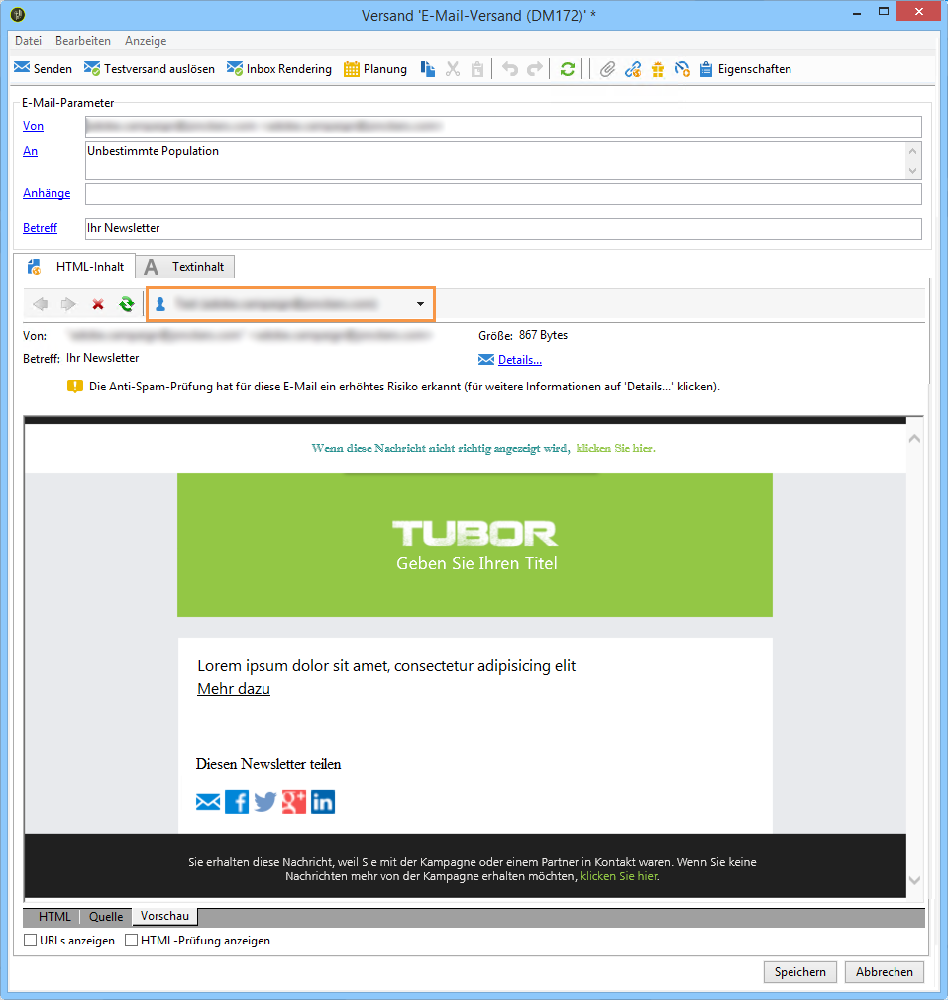

# Gestaltungsbausteine {#personalization-blocks}

Gestaltungsbausteine sind dynamisch und personalisierbar und weisen ein spezifisches Rendering auf. Sie können Gestaltungsbausteine in Nachrichten einfügen, z. B. ein Logo, eine Grußbotschaft oder einen Link zu einer Mirrorseite. Siehe [Einfügen von Gestaltungsbausteinen](#inserting-personalization-blocks).

[ Mehr zu dieser Funktion erfahren Sie im Video.](#personalization-blocks-video).

Auf Gestaltungsbausteine kann im Adobe Campaign-Explorer über den Knoten **[!UICONTROL Ressourcen > Kampagnenverwaltung > Gestaltungsbausteine]** zugegriffen werden. Standardmäßig sind verschiedene Bausteine verfügbar (siehe [Native Gestaltungsbausteine](#out-of-the-box-personalization-blocks)).

Sie haben die Möglichkeit, neue Bausteine zu definieren, mit denen Sie die Personalisierung Ihrer Sendungen verbessern können. Weitere Informationen hierzu finden Sie unter [Definieren von benutzerdefinierten Gestaltungsbausteinen](#defining-custom-personalization-blocks).

>[!NOTE]
>
>Gestaltungsbausteine sind auch im **[!UICONTROL Digital Content Editor (DCE)]** verfügbar. Weitere Informationen hierzu finden Sie auf [dieser Seite](../../web/using/editing-content.md#inserting-a-personalization-block).

## Einfügen von Gestaltungsbausteinen {#inserting-personalization-blocks}

Gehen Sie folgendermaßen vor, um Gestaltungsbausteine in eine Nachricht einzufügen:

1. Klicken Sie im Inhaltseditor des Versand-Assistenten auf das Symbol für personalisierte Felder und wählen Sie das Menü **[!UICONTROL Einschließen]** aus.
1. Wählen Sie einen Gestaltungsbaustein aus der Liste aus (in der Liste werden die zehn zuletzt verwendeten Gestaltungsbausteine angezeigt) oder greifen Sie über das Menü **[!UICONTROL Sonstige...]** auf die vollständige Liste zu.

   

1. Das Menü **[!UICONTROL Sonstige...]** ermöglicht den Zugriff auf alle standardmäßigen und benutzerdefinierten Gestaltungsbausteine (siehe [Standardmäßige Gestaltungsbausteine](#out-of-the-box-personalization-blocks) und [Definieren von benutzerdefinierten Gestaltungsbausteinen](#defining-custom-personalization-blocks)).

   

1. Der Gestaltungsbaustein wird in Form eines Scripts eingefügt und in der Personalisierungsphase automatisch an das Empfängerprofil angepasst.

   

1. Klicken Sie nun auf den **[!UICONTROL Vorschau]**-Tab und wählen Sie einen Empfänger aus, um das Ergebnis der Personalisierung anzusehen.

   

Sie können den Quell-Code eines Gestaltungsbausteins in den Versandinhalt einfügen. Wählen Sie die Option **[!UICONTROL HTML-Quell-Code des Bausteins einfügen]** aus.

Der HTML-Quell-Code wird in den Versandinhalt eingefügt. Beispielsweise wird der Gestaltungsbaustein **[!UICONTROL Grußformeln]** wie folgt angezeigt:

## Beispiel für Gestaltungsbausteine {#personalization-blocks-example}

In diesem Beispiel erstellen wir eine E-Mail, in der wir Gestaltungsbausteine verwenden, durch die der Empfänger die Mirrorseite ansehen, den Newsletter in sozialen Netzwerken teilen und sich von künftigen Sendungen abmelden kann.

Zu diesem Zweck müssen wir folgende Gestaltungsbausteine einfügen:

* **[!UICONTROL Link zur Mirrorseite]** .
* **[!UICONTROL Teilen-Links der sozialen Netzwerke]** .
* **[!UICONTROL Abmelde-Link]** .

>[!NOTE]
>
>Weitere Informationen zur Erstellung der Mirrorseite finden Sie unter [Erzeugen der Mirrorseite](sending-messages.md#generating-the-mirror-page).

1. Erstellen Sie einen neuen Versand oder öffnen Sie einen existierenden E-Mail-Versand.
1. Klicken Sie im Versand-Assistenten auf **[!UICONTROL Betreff]** , um den Betreff der Nachricht zu bearbeiten und einen Betreff einzugeben.
1. Fügen Sie die Gestaltungsbausteine in den Nachrichtentext ein. Klicken Sie dazu in das Inhaltsfeld der Nachricht und danach auf die Schaltfläche zum Einfügen von Personalisierungsfeldern. Wählen Sie danach das Menü **[!UICONTROL Einfügen]** aus.
1. Wählen Sie den ersten einzufügenden Gestaltungsbaustein aus. Wiederholen Sie diesen Vorgang, um die beiden anderen Bausteine einzufügen.

   

1. Klicken Sie nun auf den **[!UICONTROL Vorschau]**-Tab und wählen Sie einen Empfänger aus, um sich das Ergebnis der Personalisierung anzusehen.

   

1. Bestätigen Sie, dass die Inhalte der Bausteine korrekt angezeigt werden.

## Native Gestaltungsbausteine {#out-of-the-box-personalization-blocks}

Standardmäßig ist eine Liste mit Gestaltungsbausteinen verfügbar, um den Inhalt einer Nachricht zu personalisieren.

>[!NOTE]
>
>Die Liste der Gestaltungsbausteine hängt von den Modulen und Optionen ab, die auf Ihrer Instanz installiert sind.

* **[!UICONTROL Grußformeln]**: Hiermit werden Grußformeln mit dem Empfängernamen eingefügt, z. B. &quot;Guten Tag, Max Mustermann&quot;.
* **[!UICONTROL Logo einfügen]**: Hiermit wird ein natives Logo eingefügt, das beim Konfigurieren der Instanz definiert wurde.
* **[!UICONTROL Powered by Adobe Campaign]**: Hiermit wird das Logo &quot;Powered by Adobe Campaign&quot; eingefügt.
* **[!UICONTROL Mirrorseiten-URL]**: Hiermit wird die Mirrorseiten-URL eingefügt, damit Versanddesigner den Link prüfen können.

  >[!NOTE]
  >
  >Weitere Informationen zur Erstellung der Mirrorseite finden Sie unter [Erzeugen der Mirrorseite](sending-messages.md#generating-the-mirror-page).

* **[!UICONTROL Link zur Mirrorseite]**: Hiermit wird der Link zur Mirrorseite „Wenn die Nachricht nicht richtig angezeigt wird, bitte hier klicken“ eingefügt.
* **[!UICONTROL Abmelde-Link]**: Hiermit wird ein Link zur Abmeldung von allen Nachrichten (Blockierungsliste) eingefügt.
* **[!UICONTROL Formatierungsfunktion für Eigennamen]**: Hiermit wird die JavaScript-Funktion **[!UICONTROL toSmartCase]** erstellt, mit der der erste Buchstabe eines jeden Worts in einen Großbuchstaben umgewandelt wird.
* **[!UICONTROL Anmeldungsseiten-URL]**: Hiermit wird eine Anmelde-URL eingefügt (siehe [Über Dienste und Abonnements](about-services-and-subscriptions.md)).
* **[!UICONTROL Anmelde-Link]**: Hiermit wird ein Anmelde-Link eingefügt. der beim Konfigurieren der Instanz definiert wurde.
* **[!UICONTROL Anmelde-Link (mit Werber)]**: Hiermit wird ein Anmelde-Link eingefügt, über den der Besucher bzw. die Besucherin sowie der Versand identifiziert werden können. Der Link wurde beim Konfigurieren der Instanz definiert.

  >[!NOTE]
  >
  >Dieser Baustein kann in Sendungen verwendet werden, die nur an Besucher gerichtet sind.

* **[!UICONTROL Anmeldebestätigung]**: Hiermit wird ein Link eingefügt, mit dem die Anmeldung bestätigt werden kann.
* **[!UICONTROL Links zum Teilen in sozialen Netzwerken]**: fügt Schaltflächen ein, die es den Empfängerinnen und Empfängern ermöglichen, einen Link zum Inhalt der Mirrorseite mit dem E-Mail-Client, Facebook, X (früher bekannt als Twitter) und LinkedIn zu teilen (weitere Informationen finden Sie unter [Virales Marketing: Weiterleiten an eine Freundin oder einen Freund](viral-and-social-marketing.md#viral-marketing--forward-to-a-friend)).
* **[!UICONTROL Stil der Inhalts-E-Mails]** und **[!UICONTROL Stil der Benachrichtigungen]**: Hiermit wird Code erstellt, mit dem eine E-Mail mit nativen HTML-Stilen formatiert werden kann. Diese Bausteine müssen in den Quell-Code des Versands im Abschnitt **[!UICONTROL ...]** in **``**-Tags eingefügt werden.
* **[!UICONTROL Annahme-URL eines Angebots im Einzelmodus]**: Hiermit wird eine URL eingefügt, mit der ein Interaction-Angebot auf **[!UICONTROL Angenommen]** gesetzt werden kann (siehe [diesen Abschnitt](../../interaction/using/offer-analysis-report.md)).

## Definieren von benutzerdefinierten Gestaltungsbausteinen {#defining-custom-personalization-blocks}

Sie haben die Möglichkeit, neue Personalisierungsfelder zu konfigurieren, die dann über die entsprechende Schaltfläche ausgehend von der Option **[!UICONTROL Einfügen...]** verfügbar sind. Diese Felder werden in Gestaltungsbausteinen erstellt.

Gehen Sie im Explorer wie folgt vor, um Gestaltungsbausteine zu erstellen:

1. Gehen Sie in den Knoten **[!UICONTROL Ressourcen > Kampagnenverwaltung > Gestaltungsbausteine]**.
1. Klicken Sie mit der rechten Maustaste in der Bausteinliste und wählen Sie die Option **[!UICONTROL Neu]** .
1. Konfigurieren Sie den Gestaltungsbaustein:

   

   * Benennen Sie den Baustein. Der hier angegebene Titel wird im Einfügefenster der Personalisierungsfelder angezeigt.
   * Wählen Sie die Option **[!UICONTROL Im Personalisierungsmenü anzeigen]**, um den Baustein in der Dropdown-Liste der Personalisierungsfelder verfügbar zu machen.
   * Bei Bedarf können Sie die Option **[!UICONTROL Der Inhalt des Bausteins ist formatabhängig (HTML oder Text)]** ankreuzen, um für jedes Format einen separaten Baustein zu konfigurieren.

     In diesem Fall wird das Fenster in zwei Tabs – HTML- und Textinhalt – unterteilt, um die formatbedingten Inhalte separat erfassen zu können.

     

   * Geben Sie den Inhalt des Gestaltungsbausteins (in HTML, Text, JavaScript usw.) ein und klicken Sie auf **[!UICONTROL Speichern]**.

## Anleitungsvideo {#personalization-blocks-video}

Erfahren Sie, wie Sie dynamische Inhaltsbausteine erstellen und diese zur Personalisierung des Inhalts Ihres E-Mail-Versands verwenden.

>[!VIDEO](https://video.tv.adobe.com/v/24924?quality=12)

Weitere Anleitungsvideos zu Campaign Classic finden Sie [hier](https://experienceleague.adobe.com/docs/campaign-classic-learn/tutorials/overview.html?lang=de).
