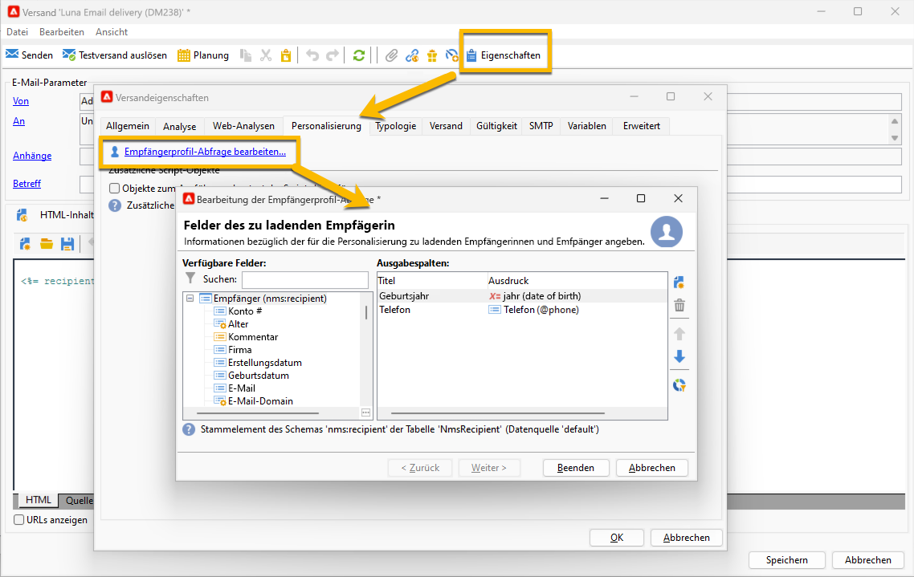
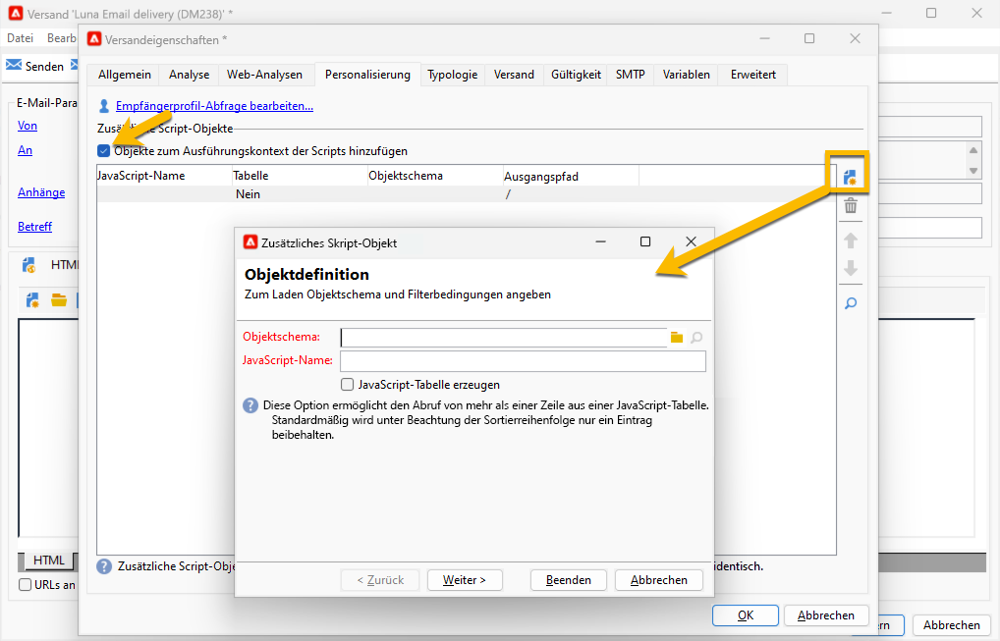
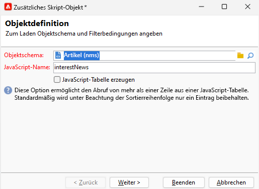
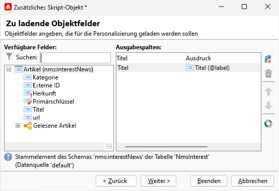

# Personalisierungsfelder {#personalization-fields}

Personalisierungsfelder dienen zur Personalisierung des Inhalts gesendeter Nachrichten auf erster Ebene. Die Felder, die Sie in einen Hauptinhalt einfügen, zeigen die Position an, an der die Daten aus einer ausgewählten Datenquelle eingefügt werden sollen.

So ersetzt Adobe Campaign das Personalisierungsfeld **&lt;%= recipient.LastName %>** durch den in der Empfängertabelle der Datenbank enthaltenen Nachnamen des Empfängers.

 [Mehr zu dieser Funktion erfahren Sie im Video.](#personalization-fields-video).

>[!CAUTION]
>
>Inhalt von Personalisierungsfeldern darf 1.024 Zeichen nicht überschreiten.

## Datenquellen {#data-sources}

Je nach ausgewähltem Versandmodus können die Personalisierungsfelder auf zwei verschiedene Datenquellen zurückgreifen:

* Die Adobe Campaign-Datenbank. Dies ist der gängigste Fall. Man spricht von Personalisierungsfeldern des Empfängers. Hierbei kommen sämtliche in der Empfängertabelle enthaltene Felder infrage, gleich ob es sich um Standardfelder (Nachname, Vorname, Anschrift, Geburtsdatum usw.) oder benutzerdefinierte Felder handelt.
* Eine externe Datei. Hierbei kommen sämtliche in der externen Datei enthaltene Felder infrage.

>[!NOTE]
>
>Ein Adobe Campaign Personalisierungs-Tag präsentiert sich stets in folgender Form: **&lt;%=Tabelle.Feld%>**.

## Personalisierungsfeld einfügen {#inserting-a-personalization-field}

Klicken Sie zum Einfügen von Personalisierungsfeldern auf das Symbol der Dropdown-Liste, das bei der Bearbeitung des Betreffs, des Nachrichten-Headers und des Nachrichten-Textkörpers zur Verfügung steht.

Nach der Auswahl der Datenquelle - Empfängerfeld oder Dateifeld - präsentiert sich das eingefügte Feld in Form einer von Adobe Campaign interpretierten Anweisung, welche die Ersetzung durch die Daten des jeweiligen Empfängers auslöst. Das Ergebnis der Ersetzung können Sie im **[!UICONTROL Vorschau]**-Tab prüfen.

## Beispiel für Personalisierungsfelder {#personalization-fields-example}

In unserem Beispiel wird eine E-Mail erstellt, in der der Empfängername im Betreff und das Datum der Profilerstellung im Nachrichten-Textkörper eingefügt werden soll. Gehen Sie wie folgt vor:

1. Erstellen Sie einen neuen Versand oder öffnen Sie einen existierenden E-Mail-Versand.
1. Klicken Sie im Versandassistenten auf den **[!UICONTROL Betreff]**, um den Betreff der Nachricht zu bearbeiten und einen Betreff einzugeben.
1. Geben Sie z. B. den Text **[!UICONTROL Sonderangebot für]** ein. Nutzen Sie nun die Schaltfläche in der Symbolleiste, um ein Personalisierungsfeld einzufügen. Wählen Sie **[!UICONTROL Empfängerinnen und Empfänger > Titel]**.

   

1. Wiederholen Sie den Vorgang, um den Nachnamen der Empfänger einzufügen. Vergessen Sie die Leerzeichen zwischen den Personalisierungsfeldern nicht.
1. Wählen Sie zur Bestätigung **[!UICONTROL OK]** aus.
1. Im nächsten Schritt wird der Nachrichten-Textkörper angepasst. Klicken Sie dazu in das Inhaltsfeld der Nachricht und danach auf die Schaltfläche zum Einfügen von Personalisierungsfeldern.
1. Wählen Sie **[!UICONTROL Empfänger > Sonstige...]**.

   

1. Markieren Sie das Feld, das die gewünschte Information enthält, und klicken Sie auf **[!UICONTROL OK]**.

   

1. Klicken Sie nun auf den **[!UICONTROL Vorschau]**-Tab und wählen Sie einen Empfänger aus, um sich das Ergebnis der Personalisierung anzusehen.

   

   >[!NOTE]
   >
   >Bei Sendungen, die über einen Workflow ausgelöst werden, haben Sie die Möglichkeit, die Daten aus der temporären Arbeitstabelle des Workflows zu verwenden. Diese Daten werden im Menü **[!UICONTROL Erweiterung des Zieldatensatzes]** gruppiert. Weiterführende Informationen hierzu finden Sie in [diesem Abschnitt](../../workflow/using/data-life-cycle.md#target-data).

## Personalisierung optimieren {#optimizing-personalization}

Mit der folgenden Option können Sie die Personalisierung optimieren: Verwenden Sie dazu im **[!UICONTROL Analyse]**-Tab der Versandeigenschaften die Option **[!UICONTROL Personalisierungsdaten mit einem Workflow vorbereiten.]** Weiterführende Informationen zur Versandanalyse finden Sie in [diesem Abschnitt](steps-validating-the-delivery.md#analyzing-the-delivery).

Diese Option ermöglicht es, im Zuge der Versandanalyse automatisch einen Workflow zu erstellen und auszuführen, welcher alle auf eine Zielgruppe bezogenen Daten in einer temporären Tabelle speichert (insbesondere Daten aus über FDA verknüpften Tabellen).

Wenn Sie die Option aktivieren, kann sich die Performance der Versandanalyse bei der Verarbeitung großer Datenmengen erheblich verbessern, insbesondere wenn die Personalisierungsdaten aus einer externen Tabelle via FDA stammen. Weiterführende Informationen dazu finden Sie unter [Zugriff auf externe Datenbanken (FDA)](../../installation/using/about-fda.md).

Sollten Sie beispielsweise beim Versand an zahlreiche Empfänger Performance-Probleme feststellen, wenn Sie viele Personalisierungsfelder und/oder Gestaltungsbausteine im Nachrichteninhalt verwenden, können Sie mit dieser Option die Personalisierung und somit den Nachrichtenversand beschleunigen.

Um diese Option zu verwenden, gehen Sie wie folgt vor:

1. Kampagne erstellen. Weiterführende Informationen hierzu finden Sie in [diesem Abschnitt](../../campaign/using/setting-up-marketing-campaigns.md#creating-a-campaign).
1. Fügen Sie auf der Registerkarte **[!UICONTROL Zielgruppenbestimmungen und Workflows]** Ihrer Kampagne eine **Abfrage-** Aktivität zu Ihrem Workflow hinzu. Weiterführende Informationen zur Verwendung dieser Aktivität finden Sie in [diesem Abschnitt](../../workflow/using/query.md).
1. Fügen Sie zum Workflow die Aktivität **[!UICONTROL E-Mail-Versand]** hinzu und öffnen Sie ihn. Weiterführende Informationen zur Verwendung dieser Aktivität finden Sie in [diesem Abschnitt](../../workflow/using/delivery.md).
1. Gehen Sie zum Tab **[!UICONTROL Analyse]** der **[!UICONTROL Versandeigenschaften]** und wählen Sie die Option **[!UICONTROL Personalisierungsdaten mit einem Workflow vorbereiten]** aus.

   

1. Konfigurieren Sie den Versand und starten Sie den Workflow, um mit der Analyse zu beginnen.

Nach Abschluss der Analyse werden die Personalisierungsdaten mithilfe eines technischen Workflows, der während der Analyse eingerichtet wird, in einer temporären Tabelle gespeichert.

Dieser Workflow ist nicht in der Adobe Campaign-Benutzeroberfläche sichtbar. Er ist lediglich ein technisches Hilfsmittel, um Personalisierungsdaten rasch zu speichern und zu handhaben.

Gehen Sie nach dem Abschluss der Analyse zu den Workflow-**[!UICONTROL Eigenschaften]** und wählen Sie den Tab **[!UICONTROL Variablen]** aus. Dort wird der Name der temporären Tabelle angezeigt. Mit diesem Namen können Sie einen SQL-Aufruf durchführen, um die darin enthaltenen IDs anzuzeigen.

## Timeout für die Personalisierungsphase {#timing-out-personalization}

Um die Versandsicherheit zu erhöhen, können Sie für die Personalisierungsphase einen Timeout-Zeitraum festlegen.

Wählen Sie auf dem Tab **[!UICONTROL Versand]** der **[!UICONTROL Versandeigenschaften]** einen Maximalwert in Sekunden für die Option **[!UICONTROL Maximale Laufzeit der Personalisierung]** aus.

Wenn die Personalisierungsphase während der Vorschau oder beim Senden die in diesem Feld angegebene maximale Zeit überschreitet, wird der Prozess mit einer Fehlermeldung abgebrochen und der Versand schlägt fehl.

Der Standardwert ist 5 Sekunden.

Wenn Sie diese Option auf 0 setzen, gilt für die Personalisierungsphase keine Zeitbeschränkung.

## Registerkarte „Personalisierung“ {#personalization-tab}

In den Versandeigenschaften befindet sich die Registerkarte „Personalisierung“.

Sie können der Profilabfrage der Zielgruppendimension Daten hinzufügen, indem Sie auf **„Ladeabfrage des Empfängerprofils bearbeiten“** klicken. Sie können die direkt in einem Ausdruck extrahierten Daten verwenden, um die tatsächlich benötigten Daten zu extrahieren. Diese Daten werden zum Kontext hinzugefügt.

{zoomable="yes"}

Wenn die Daten, die Sie hinzufügen möchten, nicht zur Zielgruppendimension gehören, können Sie auf **„Objekte im Ausführungskontext der Skripte hinzufügen“** klicken.

{zoomable="yes"}

Sie können dort das gewünschte Objektschema auswählen und diese Daten dann in Ihrem JavaScript-Code verwenden, der während der Versandvorbereitung ausgeführt wird.

{zoomable="yes"}

Durch Hinzufügen des Objektschemas können Sie die Felder auswählen, die Sie dem Kontext hinzufügen möchten:

{zoomable="yes"}

## Anleitungsvideo {#personalization-fields-video}

Erfahren Sie, wie Sie der Betreffzeile und dem Inhalt eines E-Mail-Versands ein Personalisierungsfeld hinzufügen.

>[!VIDEO](https://video.tv.adobe.com/v/24925?quality=12)

Weitere Anleitungsvideos zu Campaign Classic finden Sie [hier](https://experienceleague.adobe.com/docs/campaign-classic-learn/tutorials/overview.html?lang=de).
