# Personalisierte Gutscheine{#personalized-coupons}

Durch das Hinzufügen von Gutscheinen können Sie Ihren Empfängern Produkte und Dienstleistungen mit einem Mehrwert anbieten. Mit dem Campaign-Gutscheinmodul können Sie Gutscheine erstellen und zu einem späteren Zeitpunkt Marketingangeboten bei deren Erstellung zuweisen. Da Gutscheine nur für einen ausgewählten Zeitraum gültig sind, ist ein zugewiesener Gutschein eindeutig mit einer bestimmten Versandnachricht verknüpft. Zusätzlich wird von Campaign vor dem Versand bestätigt, dass genügend Gutscheine für die Anzahl der Nachrichten vorhanden sind.

>[!NOTE]
>
>Die Couponverwaltung ist ein Package, das installiert werden muss. Um festzustellen, ob Sie dieses Package installiert haben, gehen Sie zu **[!UICONTROL Administration > Konfiguration > Packageverwaltung > Installierte Packages.]**
>
>Gutscheindaten können im CSV- und XML-Format importiert und exportiert werden. Weiterführende Informationen zum Importieren und Exportieren finden Sie in [diesem Abschnitt](../../platform/using/generic-imports-and-exports.md).

## Gutscheine erstellen {#creating-a-coupon}

Für die Erstellung von Gutscheinen bietet Ihnen das Gutscheinmodul zwei Möglichkeiten:

* **Anonym**: ein Standardgutschein für ausgewählte Empfänger oder Empfängerlisten
* **Individuell**: ein personalisierter Gutschein für ausgewählte Empfänger

Bevor Sie die folgenden Schritte ausführen, entscheiden Sie sich für einen Gutscheintyp:

1. Wählen Sie im Campaign-Navigationsbaum **[!UICONTROL Ressourcen > Kampagnenverwaltung > Coupons]**.

   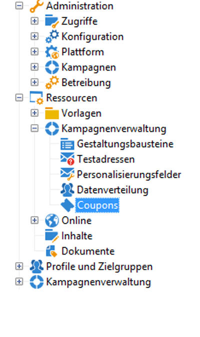

1. Klicken Sie auf die Schaltfläche **[!UICONTROL Neu]**.
1. Geben Sie im **[!UICONTROL Titelfeld]** den Namen des Gutscheins ein. In das Feld **[!UICONTROL Couponcode]** wurde automatisch ein eindeutiger Code eingefügt. Sie können den Code beibehalten oder einen neuen eingeben.

   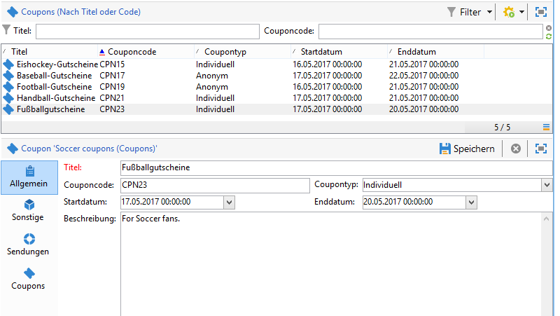

1. Wählen Sie das **[!UICONTROL Startdatum]** und das **[!UICONTROL Enddatum]**, um den Gültigkeitszeitraum des Gutscheins festzulegen.
1. Wählen Sie in **[!UICONTROL Coupontyp]** zwischen einem anonymen und einem individuellen Gutschein.

   **[!UICONTROL Anonyme Gutscheine]**: Anonyme Gutscheine sind für alle Empfänger gleich. Bestätigen Sie im Menü **Coupontyp** Ihre Auswahl eines anonymen Gutscheins und wählen Sie danach **Speichern**, um den Gutschein zu erstellen.

   **[!UICONTROL Individuelle Gutscheine]**: Individuelle Gutscheine können mit zusätzlichen Couponcodes weiter personalisiert werden. Beispiel: Für den Ausverkauf in einem Sportgeschäft wird ein individueller Gutschein erstellt. Doch die Empfängerliste ist lang und die Empfänger sind an unterschiedlichen Sportarten interessiert. Deshalb können Sie dem individuellen Gutschein einen Codenamen für die jeweilige Sportart hinzufügen (z. B. Fußball, Baseball) und die Codes an die entsprechenden Empfänger senden.

   1. Bei der Auswahl individueller Gutscheine erscheint links unten ein neuer Coupons-Tab. Wählen Sie in diesem **[!UICONTROL Coupons]**-Tab **[!UICONTROL Hinzufügen]** aus.
   1. Geben Sie für den individuellen Gutschein einen eindeutigen Code ein, wenn Sie vom Pop-up dazu aufgefordert werden.
   1. Klicken Sie auf **[!UICONTROL Speichern]**, um den Gutschein zu erstellen.

   Weitere Informationen zum Tab „Coupons“ finden Sie unter [Individuelle Gutscheine konfigurieren](#configuring-individual-coupons).

   >[!NOTE]
   >
   >Individuelle Gutscheine können gesammelt importiert werden. Weiterführende Informationen zum Importieren und Exportieren finden Sie in [diesem Abschnitt](../../platform/using/generic-imports-and-exports.md).

### Individuelle Gutscheine konfigurieren {#configuring-individual-coupons}

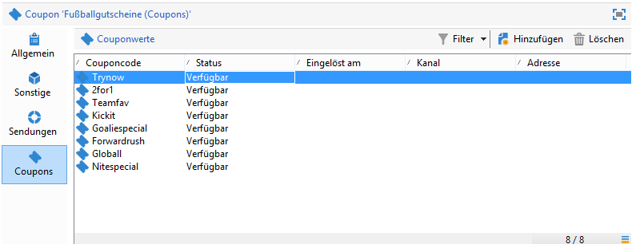

Der Coupons-Tab erscheint nur bei individuellen Gutscheinen. Nach der Verknüpfung eines Gutscheins mit einem Versand werden im Coupons-Tab folgende Informationen angezeigt:

* **[!UICONTROL Status]**: Verfügbarkeit des Gutscheins
* **[!UICONTROL Eingelöst am]**: das Datum, an dem der Gutschein eingelöst wurde
* **[!UICONTROL Kanal]**: der für den Versand des Gutscheins verwendete Kanal
* **[!UICONTROL Adresse]**: die E-Mail-Adresse der Empfänger

Die Werte für **[!UICONTROL Status]**, **[!UICONTROL Kanal]** und **[!UICONTROL Adresse]** werden automatisch ausgefüllt. Nur die Werte für **[!UICONTROL Eingelöst am]** werden nicht von Campaign abgerufen. Sie können aber durch den Import einer Datei eingefügt werden, in der die Details für die Gutscheineinlösung enthalten sind.

## Gutschein in einen E-Mail-Versand einfügen {#inserting-a-coupon-into-an-email-delivery}

Im folgenden Beispiel wird von der Startseite aus ein Versand erstellt. Weiterführende Informationen zum Erstellen eines Versands finden Sie in [diesem Abschnitt](../../delivery/using/about-email-channel.md). Sie können auch in einem Workflow einem Versand einen Gutschein hinzufügen.

1. Gehen Sie zu **[!UICONTROL Kampagnen]** und wählen Sie **[!UICONTROL Sendungen]** aus.
1. Wählen Sie **[!UICONTROL Erstellen]** aus.

   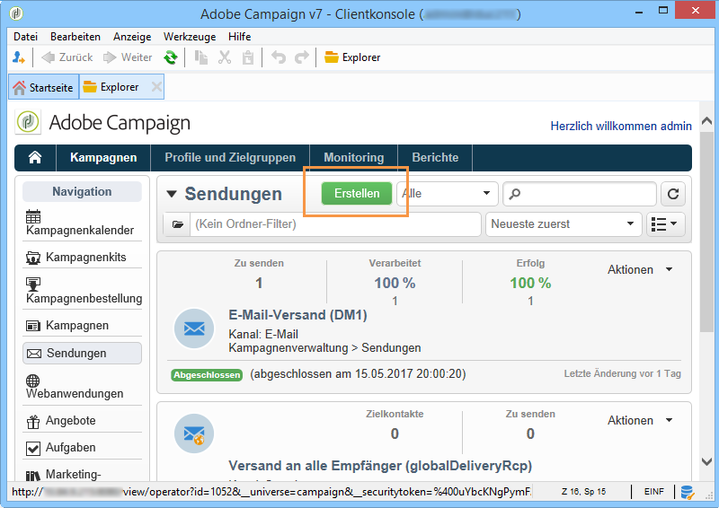

1. Geben Sie im **[!UICONTROL Titelfeld]** einen Namen ein und wählen Sie **[!UICONTROL Fortfahren]** aus.
1. Wählen Sie **[!UICONTROL An]** aus, um Empfänger hinzuzufügen.
1. Wählen Sie **[!UICONTROL Hinzufügen]** aus, um Empfänger für den Versand auszuwählen. Wählen Sie nach der Auswahl der Empfänger **[!UICONTROL OK]**, um zum Versand zurückzukehren.

   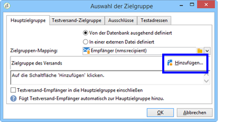

1. Geben Sie einen Betreff ein und fügen Sie der Nachricht einen Inhalt hinzu.

   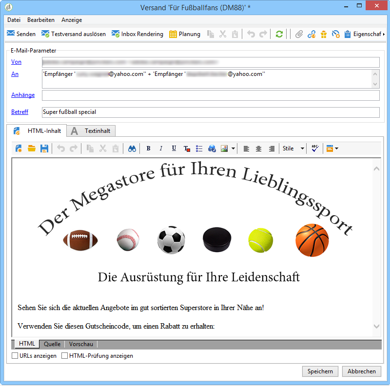

1. Wählen Sie in der Symbolleiste **[!UICONTROL Eigenschaften]** und danach den Tab **[!UICONTROL Erweitert]** aus.
1. Wählen Sie das Ordnersymbol für **[!UICONTROL Couponverwaltung]** aus.

   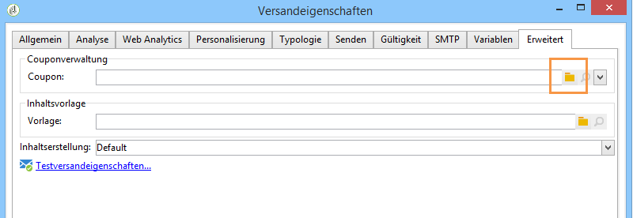

1. Wählen Sie den Gutschein und danach **[!UICONTROL OK]** aus. Wählen Sie erneut **[!UICONTROL OK]** aus.

   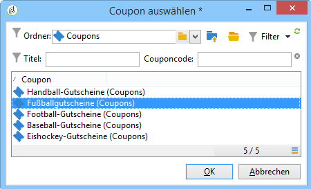

1. Klicken Sie auf die Nachricht, um zu kennzeichnen, wo Sie den Gutschein platzieren möchten.

   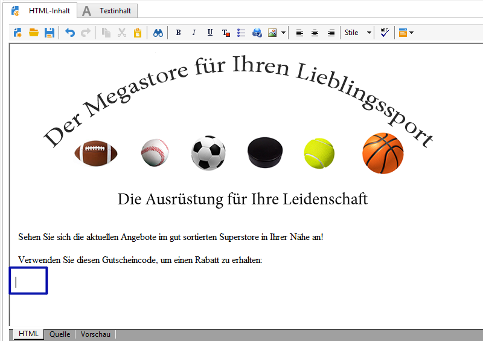

1. Wählen Sie das Personalisierungssymbol aus, um je nach Gutscheintyp die folgende Auswahl zu treffen:

   * Anonymer Gutschein: **[!UICONTROL Coupon > Couponcode]**

      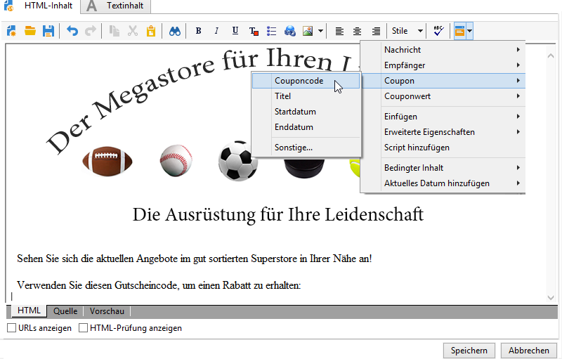

   * Individueller Gutschein: **[!UICONTROL Couponwert > Couponcode]**

      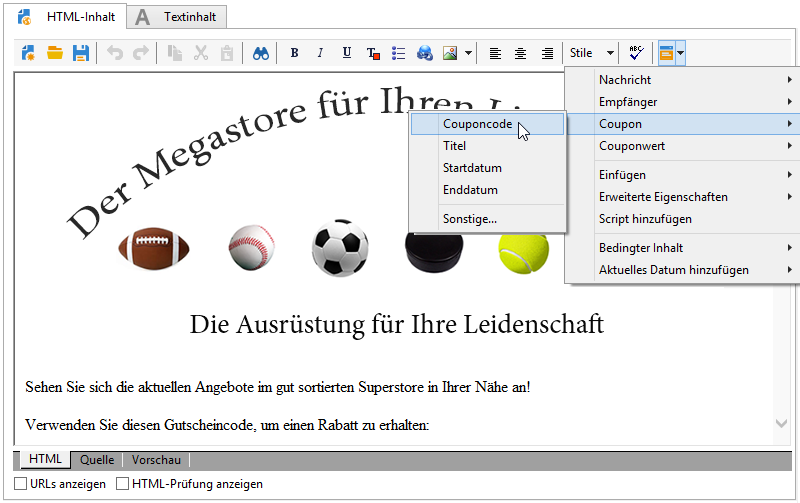

      Der Gutschein wird in die Nachricht als Code eingefügt und nicht mit dem von Ihnen zugewiesenen Namen. Der Code wird innerhalb des Campaign-Standard-Datenmodells verwendet.
   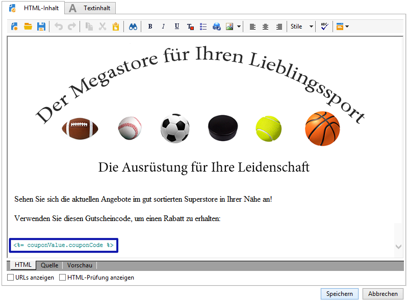

1. Führen Sie einen Test durch, um den von Ihnen dem Gutschein zugewiesenen Namen zu überprüfen. Wählen Sie dazu im Tab **[!UICONTROL Vorschau]** die Option **[!UICONTROL Personalisierung testen]** und danach einen Empfänger für den Test aus.

   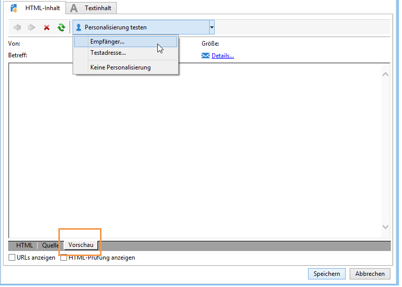

   Nach dem Test sollte auf dem Gutschein der zugewiesene Name anstatt des Codes angezeigt werden.

   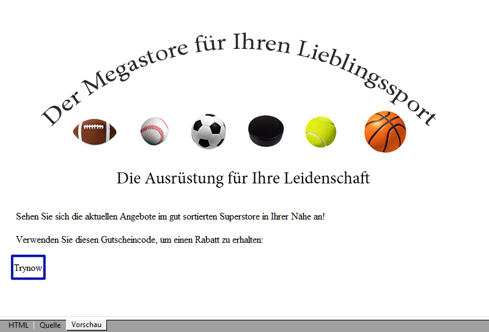

1. Klicken Sie in der Symbolleiste links oben auf **[!UICONTROL Senden]** und wählen Sie aus, wie Sie die Nachricht senden möchten.

   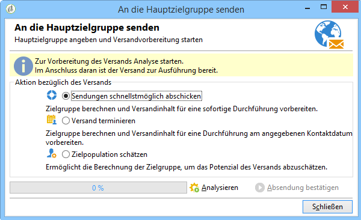

1. Wählen Sie **[!UICONTROL Analysieren]** aus. Wenn im Analyseprotokoll bestätigt wird, dass für alle Empfänger genügend Gutscheine vorhanden sind, versenden Sie die Nachrichten durch die Auswahl von **[!UICONTROL Absendung bestätigen]**.

   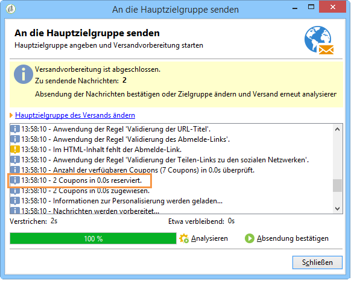

>[!NOTE]
>
>Eine Anleitung zur Vorgehensweise, wenn nicht genügend Coupons für einen Versand vorhanden sind, finden Sie unter [Ungenügende Anzahl von Gutscheinen verwalten](#managing-insufficient-coupons)

So prüfen Sie, ob der Versand erfolgreich war:

1. Gehen Sie zu **[!UICONTROL Explorer > Ressourcen > Kampagnenverwaltung > Coupons]**.
1. Wählen Sie den Tab **[!UICONTROL Sendungen]**.

   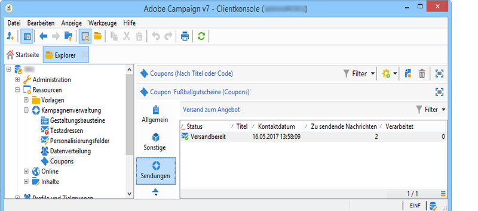

   Eine erfolgreiche Sendung ist im Status als **[!UICONTROL Abgeschlossen]** gekennzeichnet.

>[!NOTE]
>
>Standardmäßig wird vom Gutscheinverwaltungsmodul eine **nms:recipient**-Tabelle verwendet. Eine Anleitung zur Verwendung einer anderen Tabelle finden Sie unter [Schemabearbeitung](../../configuration/using/data-schemas.md).

## Ungenügende Anzahl von Gutscheinen verwalten {#managing-insufficient-coupons}

Die Versandanalyse wird angehalten, wenn es weniger Gutscheine als Nachrichten gibt. In diesem Fall können Sie zusätzliche Gutscheine importieren oder die Anzahl der Nachrichten beschränken. Im Folgenden erfahren Sie, wie Sie die Anzahl der Nachrichten beschränken können.

1. Gehen Sie zum E-Mail-Versand-Fenster.
1. Wählen Sie **[!UICONTROL An]**.
1. Gehen Sie unter **[!UICONTROL Auswahl der Zielgruppe]** zum Tab **[!UICONTROL Ausschlüsse]**.

   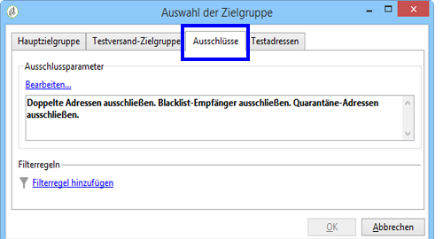

1. Wählen Sie im Bereich für die Einstellungen der Ausschlüsse **[!UICONTROL Bearbeiten]** aus.
1. Geben Sie die Anzahl der zu sendenden Nachrichten in **[!UICONTROL Begrenzung des Versands auf]** ein und bestätigen Sie mit **[!UICONTROL OK]**. Jetzt können Sie den Versand starten.

   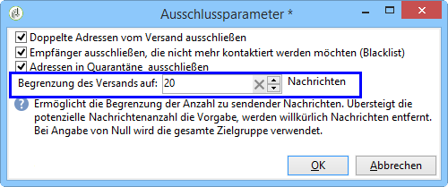

>[!NOTE]
>
>Bei der Verwaltung einer beschränkten Anzahl von Gutscheinen können Sie Ihren Versand durch einen Versand-Workflow gemäß Ihren Kriterien aufteilen. Diese Vorgehensweise ist empfehlenswert, wenn Sie Gutscheine an eine ausgewählte Population senden möchten, ohne die Zielgruppe einzuschränken.
