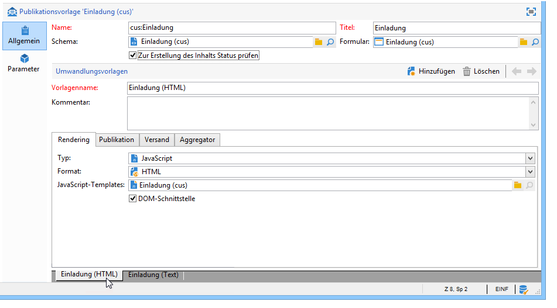
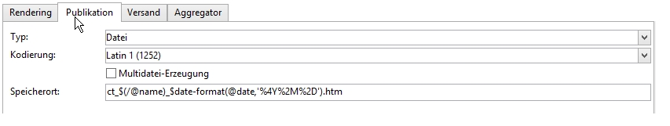
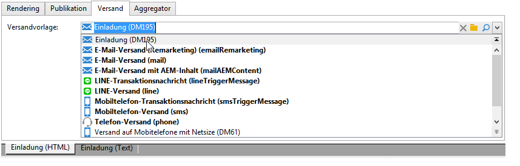
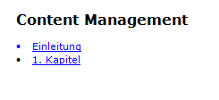
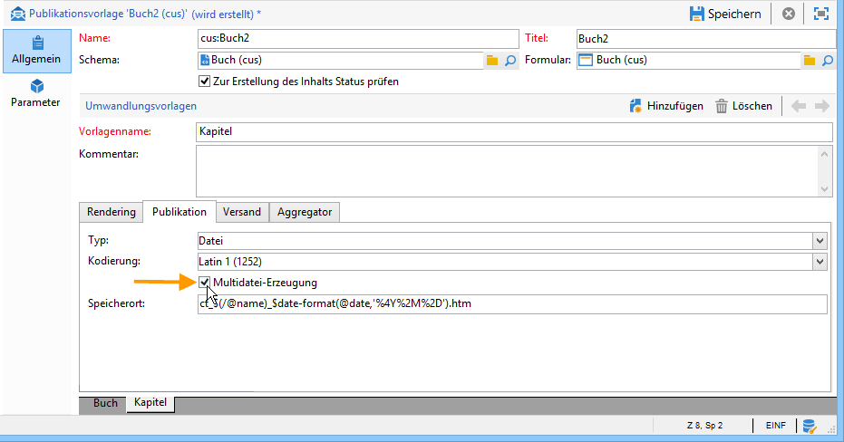

# Veröffentlichungsvorlagen{#publication-templates}

## Über Veröffentlichungsvorlagen {#about-publication-templates}

Die Publikationsvorlage verweist auf die im Veröffentlichungsprozess verwendeten Ressourcen, d. h.:

* das Datenschema,
* das Formular,
* die Umwandlungsvorlagen für jedes Ausgabedokument.

## Identifizierung von Veröffentlichungsvorlagen {#identification-of-a-publication-template}

Eine Veröffentlichungsvorlage wird über ihren Namen und Namespace identifiziert.

Der Identifizierungsschlüssel eines Stylesheets ist eine Zeichenfolge, die aus dem Namespace und dem Namen besteht, getrennt durch einen Doppelpunkt (z. B. **cus:newsletter**.

>[!NOTE]
>
>Es wird empfohlen, für Schema, Formular und Veröffentlichungsvorlage den gleichen Schlüssel zu verwenden.

## Erstellen und Konfigurieren der Vorlage {#creating-and-configuring-the-template}

Standardmäßig werden Veröffentlichungsvorlagen im Knoten **[!UICONTROL Administration > Konfiguration > Veröffentlichungsvorlagen]** gespeichert. Klicken Sie dort zur Erstellung einer neuen Vorlage auf die Schaltfläche **[!UICONTROL Neu]**.

Geben Sie den Namen der Vorlage (d. h. den aus Namespace und Namen bestehenden Identifikationsschlüssel), den Titel, das zugeordnete Datenschema sowie das entsprechende Formular an.



>[!NOTE]
>
>Bei Erstellung eines auf dieser Veröffentlichungsvorlage beruhenden Inhalts wird der hier vergebene Titel angezeigt.

Die Option **Zur Erstellung des Inhalts Status prüfen** stellt sicher, dass die Inhaltsinstanzen den Status „Validiert“ aufweisen, bevor die Datei erzeugt wird. Weitere Informationen hierzu finden Sie im Abschnitt [Veröffentlichung](#publication).

Für jedes Ausgabedokument muss eine Umwandlungsvorlage hinzugefügt werden. Sie können so viele Umwandlungsvorlagen wie nötig erstellen.

Das **[!UICONTROL Name der Vorlage]** ist eine freie Beschriftung, die den Rendertyp an der Ausgabe beschreibt. Für jede Umwandlungsvorlage sind die Veröffentlichungseinstellungen auf den Registerkarten verfügbar.

### Rendering {#rendering}

Konfigurieren Sie im **[!UICONTROL Rendering]**-Tab folgende Parameter:

* den Typ der Umwandlungsvorlage: XSL-Stylesheet oder JavaScript-Template;
* das Format des Ausgabedokuments: HTML, Text, XML oder RTF;
* den Namen der Vorlage, die die Umwandlungsinformationen enthält, d. h. des Stylesheets oder des JavaScript-Templates.

### Veröffentlichung {#publication}

Veröffentlichung bezeichnet den Vorgang der Erzeugung des Ausgabedokuments in Form einer Datei. Wählen Sie hierzu im gleichnamigen Tab im Feld Typ die Option **[!UICONTROL Datei]**.



Des Weiteren können folgende Veröffentlichungsparameter konfiguriert werden:

* Der Zeichensatz für die Ausgabedateicodierung kann über das Feld **[!UICONTROL Codierung]** erzwungen werden. Der Zeichensatz Latin 1 (1252) wird standardmäßig verwendet.
* Mit **[!UICONTROL Option zur Erzeugung mehrerer]** wird ein spezieller Modus für die Veröffentlichung von Dokumenten aktiviert. Bei dieser Option wird am Anfang jeder Seite des Ausgabedokuments ein Partitionierungs-Tag eingefügt. Durch Generieren des Inhalts wird eine Datei für jedes ausgefüllte Partitionierungs-Tag erstellt. Dieser Modus wird verwendet, um aus einem Inhaltsbaustein Mini-Sites zu generieren. Weitere Informationen hierzu finden Sie im Abschnitt [Multidatei-Erzeugung](#multi-file-generation).
* Das **[!UICONTROL Speicherort]**-Feld enthält den Namen der Ausgabedatei. Der Name kann aus Variablen bestehen, um einen automatischen Dateinamen zu generieren.

  Die Variablen sind wie folgt anzugeben: **`$(<xpath>)`**, wobei **`<xpath>`** den Pfad eines Felds des der Veröffentlichungsvorlage zugrunde liegenden Datenschemas bezeichnet.

  Beispielsweise kann der Dateiname auf ein Datumsfeld verweisen. In diesem Fall ist die Funktion **$date-format** zu verwenden und Feldpfad sowie Ausgabeformat sind anzugeben.

  Standardmäßig wird der Dateiname unter Verwendung der Variablen &quot;@name&quot; und &quot;@date&quot; konstruiert:

  ```xml
  ct_$(@name)_$date-format(@date,'%4Y%2M%2D').htm
  ```

  Der Dateiname nimmt somit folgende Form an: ct_news12_20110901.htm.

  >[!NOTE]
  >
  >Weitere Informationen zur Inhaltserstellung finden Sie unter [Erstellen einer Inhaltsinstanz](using-a-content-template.md#creating-a-content-instance).

### Versand {#delivery}

Auf dieser Registerkarte können Sie ein Szenario auswählen, um einen Versand direkt mit dem Inhalt zu starten. Der Inhalt der E-Mail wird automatisch anhand des Ausgabeformats (HTML oder Text) ausgefüllt.



>[!NOTE]
>
>Ein Beispiel für eine Versanderstellung basierend auf Inhalten finden Sie im Abschnitt [Versenden einer Inhaltsinstanz](using-a-content-template.md#delivering-a-content-instance).

### Aggregator {#aggregator}

Durch das Aggregieren der Daten aus einem Skript oder einer Abfrageliste können Sie das XML-Dokument mit den Inhaltsdaten anreichern. Ziel ist es, bestimmte durch Links referenzierte Informationen zu ergänzen oder Elemente aus der Datenbank hinzuzufügen.

### Multidatei-Erzeugung {#multi-file-generation}

Um die Generierung mehrerer Dateien zu aktivieren, wählen **[!UICONTROL im Veröffentlichungsmodell die Option]** Generierung mehrerer Dateien“ aus. Mit dieser Option können Sie die Aufteilung von Tags im Stylesheet für den Anfang jeder Seite des Ausgabedokuments festlegen. Bei der Inhaltserstellung wird für jedes aufgetretene Partitionierungs-Tag eine Datei erstellt.

Das zu verwendende Trennzeichen stellt sich wie folgt dar:

**`<xsl:comment> #nl:output_replace(<name_of_file>) </xsl:comment>`**, wobei **`<name_of_file>`** der Dateiname der zu erzeugenden Seite ist.

**Beispiel** Mehrfache Dateigenerierung mithilfe des Schemas „cus:book.

Ziel ist es, eine Hauptseite zu erzeugen, die die Kapitel auflistet und die Möglichkeit bietet, die Details der Kapitel in einer externen Seite anzuzeigen.



Das entsprechende Stylesheet („cus:book.xsl„) lautet wie folgt:

```xml
<?xml version="1.0" encoding="ISO-8859-1" ?>
<xsl:stylesheet xmlns:xsl="http://www.w3.org/1999/XSL/Transform" version="1.0">
  <xsl:output encoding="ISO-8859-1" method="html"/>

  <!-- Style sheet entry point -->
  <xsl:template match="/book">
    <html>
      <body>
        <h1><xsl:value-of select="@name"/></h1>
        <lu>
          <xsl:for-each select="chapter">
            <li><a target="_blank" href="chapter{@id}.htm"><xsl:value-of select="@name"/></a></li>  
          </xsl:for-each>
       </lu>
      </body>
    </html>
   </xsl:template>
</xsl:stylesheet>
```

Ein zweites Stylesheet („cus:chapter.xsl„) ist erforderlich, um die Details der Kapitel zu generieren:

```xml
<?xml version="1.0" encoding="ISO-8859-1" ?>
<xsl:stylesheet xmlns:xsl="http://www.w3.org/1999/XSL/Transform" version="1.0">
  <xsl:output encoding="ISO-8859-1" method="html"/>

  <!-- Detail of a chapter -->
  <xsl:template match="chapter">
    <!-- Cut tag -->   
    <xsl:comment> #nl:output_replace($(path)/chapter<xsl:value-of select="@id"/>.htm)</xsl:comment>
    
    <html>
      <body>
        <h1><xsl:value-of select="@name"/></h1>
        <xsl:value-of select="page" disable-output-escaping="yes"/>
      </body>
    </html>
  </xsl:template>

  <!-- Style sheet entry point -->
  <xsl:template match="/book">
    <xsl:apply-templates/>
   </xsl:template>
</xsl:stylesheet>
```

Das Trennzeichen wird zu Beginn jeder Seite angegeben, die in die zu erzeugende Datei einzuschließen ist.

```xml
<xsl:comment> #nl:output_replace($(path)/<xsl:value-of select="@id"/>.htm)</xsl:comment>
```

Der Dateiname wird mit der Variable **$(path)** konstruiert, welche den Veröffentlichungspfad bezeichnet, ergänzt durch **`<xsl:value-of select="@id" />`**, was der Kennung des Kapitels im Quelldokument entspricht.

Das Veröffentlichungsmodell muss mit den beiden Stylesheets „cus:book.xsl“ und „cus:chapter.xsl“ gefüllt werden.

In der Umwandlungsvorlage der Kapitel ist die Option **[!UICONTROL Multidatei-Erzeugung]** zu aktivieren:



Auch wenn das Feld **[!UICONTROL Speicherort]** bei der Multidatei-Erzeugung nicht verwendet wird, muss ein Dateiname angegeben werden, um eine Fehlermeldung bei der Veröffentlichung zu vermeiden.
