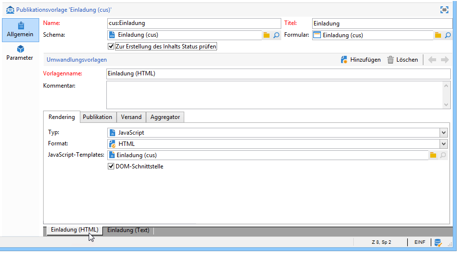

# Publikationsvorlagen{#publication-templates}

## Über Publikationsvorlagen {#about-publication-templates}

Die Publikationsvorlage stellt den Steckbrief des zu publizierenden Inhalts dar. Sie verweist auf alle für die Publikation erforderlichen Ressourcen:

* das Datenschema,
* das Formular,
* die Umwandlungsvorlagen für jedes Ausgabedokument.

## Identifizierung von Publikationsvorlagen {#identification-of-a-publication-template}

Eine Publikationsvorlage wird über ihren Namen und Namensraum identifiziert.

Der Identifikationsschlüssel eines Stylesheets ist eine Zeichenkette, die den Namensraum und den Namen enthält, getrennt durch das Zeichen &#39;:&#39; (z. B. **cus:newsletter**).

>[!NOTE]
>
>Es wird empfohlen, für Schema, Formular und Publikationsvorlage den gleichen Schlüssel zu verwenden.

## Erstellung und Konfiguration der Vorlagen {#creating-and-configuring-the-template}

Standardmäßig werden Publikationsvorlagen im Knoten **[!UICONTROL Administration > Konfiguration > Publikationsvorlagen]** gespeichert. Klicken Sie dort zur Erstellung einer neuen Vorlage auf die Schaltfläche **[!UICONTROL Neu]**.

Geben Sie den Namen der Vorlage (d. h. den aus Namensraum und Namen bestehenden Identifikationsschlüssel), den Titel, das zugeordnete Datenschema sowie das entsprechende Formular an.



>[!NOTE]
>
>Bei Erstellung eines auf dieser Publikationsvorlage beruhenden Inhalts wird der hier vergebene Titel angezeigt.

Die Option **Zur Erstellung des Inhalts Status prüfen** stellt sicher, dass die Inhaltsinstanzen den Status „Validiert“ aufweisen, bevor die Datei erzeugt wird. Weitere Informationen hierzu finden Sie im Abschnitt [Publikation](#publication).

Für jedes Ausgabeformat muss eine Umwandlungsvorlage hinzugefügt werden. Es können so viele Umwandlungsvorlagen wie nötig erstellt werden.

Im Feld **[!UICONTROL Vorlagenname]** ist ein frei wählbarer Titel anzugeben, der das Rendering des Ausgabedokuments beschreibt. Die verschiedenen Publikationsparameter sind für jede Umwandlungsvorlage separat in den einzelnen Tabs zu erfassen.

### Rendering {#rendering}

Konfigurieren Sie im **[!UICONTROL Rendering]**-Tab folgende Parameter:

* den Typ der Umwandlungsvorlage: XSL-Stylesheet oder JavaScript-Template;
* das Format des Ausgabedokuments: HTML, Text, XML oder RTF;
* den Namen der Vorlage, die die Umwandlungsinformationen enthält, d. h. des Stylesheets oder des JavaScript-Templates.

### Publikation {#publication}

Publikation bezeichnet den Vorgang der Erzeugung des Ausgabedokuments in Form einer Datei. Wählen Sie hierzu im gleichnamigen Tab im Feld Typ die Option **[!UICONTROL Datei]**.


Des Weiteren können folgende Publikationsparameter konfiguriert werden:

* **[!UICONTROL Zeichenkodierung]** der Ausgabedatei. Standardmäßig wird die Zeichensatztabelle Latin 1 (1252) verwendet.
* **[!UICONTROL Multidatei-Erzeugung]** fügt zu Beginn jeder neuen Seite des Ausgabedokuments ein Trennzeichen ein. Bei der Inhaltserzeugung werden so viele Dateien erstellt, wie Trennzeichen angegeben wurden. Dieser Modus wird für die Erstellung von Minisites verwendet. Weitere Informationen hierzu finden Sie im Abschnitt [Multidatei-Erzeugung](#multi-file-generation).
* Das Eingabefeld **[!UICONTROL Speicherort]** enthält den Namen der Ausgabedatei. Wenn dieser aus Variablen besteht, wird er automatisch erzeugt.

   A variable is populated with the following format: **`$(<xpath>)`**, where **`<xpath>`** is the path of a field of the publication template data schema.

   Beispielsweise kann der Dateiname auf ein Datumsfeld verweisen. In diesem Fall ist die Funktion **$date-format** zu verwenden und Feldpfad sowie Ausgabeformat sind anzugeben.

   Standardmäßig wird der Dateiname unter Verwendung der Variablen &quot;@name&quot; und &quot;@date&quot; konstruiert:

   ```
   ct_$(@name)_$date-format(@date,'%4Y%2M%2D').htm
   ```

   Der Dateiname nimmt somit folgende Form an: ct_news12_20110901.htm.

   >[!NOTE]
   >
   >Weitere Informationen zur Inhaltserstellung finden Sie unter [Erstellung einer Inhaltsinstanz](../../delivery/using/using-a-content-template.md#creating-a-content-instance).

### Versand {#delivery}

In diesem Tab kann eine Versandvorlage ausgewählt werden, um direkt einen Versand mit dem erstellten Inhalt durchzuführen. Der E-Mail-Inhalt wird automatisch in den konfigurierten Formaten - HTML oder Text - eingefügt.


>[!NOTE]
>
>Ein Beispiel für einen Versand, der einen im Content-Management erstellten Inhalt verwendet, finden Sie im Abschnitt [Versand einer Inhaltsinstanz](../../delivery/using/using-a-content-template.md#delivering-a-content-instance).

### Aggregator {#aggregator}

Sie können das XML-Ausgabedokument durch die Aggregation von Daten mithilfe eines Scripts oder einer Abfragenliste anreichern. Ziel ist es, gewisse referenzierte Informationen durch Links oder Elemente aus der Datenbank zu ergänzen.

### Multidatei-Erzeugung {#multi-file-generation}

Zur Verwendung dieser Option ist das Feld **[!UICONTROL Multidatei-Erzeugung]** in der Publikationsvorlage anzukreuzen. Auf diese Weise können im Stylesheet Trennzeichen zu Beginn jeder neuen Seite des Ausgabedokuments eingefügt werden. Bei der Inhaltserzeugung werden so viele Dateien erstellt, wie Trennzeichen angegeben wurden.

Das zu verwendende Trennzeichen stellt sich wie folgt dar:

**`<xsl:comment> #nl:output_replace(<name_of_file>) </xsl:comment>`**, wobei **`<name_of_file>`** der Dateiname der zu erzeugenden Seite ist.

**Beispiel:** Multidatei-Erzeugung anhand des Schemas &quot;cus:Buch&quot;.

Ziel ist es, eine Hauptseite zu erzeugen, die die Kapitel auflistet und die Möglichkeit bietet, die Details der Kapitel in einer externen Seite anzuzeigen.


Das entsprechende Stylesheet (&quot;cus:Buch.xsl&quot;) stellt sich wie folgt dar:

```
<?xml version="1.0" encoding="ISO-8859-1" ?>
<xsl:stylesheet xmlns:xsl="http://www.w3.org/1999/XSL/Transform" version="1.0">
  <xsl:output encoding="ISO-8859-1" method="html"/>

  <!-- Style sheet entry point -->
  <xsl:template match="/book">
    <html>
      <body>
        <h1><xsl:value-of select="@name"/></h1>
        <lu>
          <xsl:for-each select="chapter">
            <li><a target="_blank" href="chapter{@id}.htm"><xsl:value-of select="@name"/></a></li>  
          </xsl:for-each>
       </lu>
      </body>
    </html>
   </xsl:template>
</xsl:stylesheet>
```

Ein zweites Stylesheet (&quot;cus:Kapitel.xsl&quot;) ist erforderlich, um die Kapiteldetails zu erzeugen:

```
<?xml version="1.0" encoding="ISO-8859-1" ?>
<xsl:stylesheet xmlns:xsl="http://www.w3.org/1999/XSL/Transform" version="1.0">
  <xsl:output encoding="ISO-8859-1" method="html"/>

  <!-- Detail of a chapter -->
  <xsl:template match="chapter">
    <!-- Cut tag -->   
    <xsl:comment> #nl:output_replace($(path)/chapter<xsl:value-of select="@id"/>.htm)</xsl:comment>
    
    <html>
      <body>
        <h1><xsl:value-of select="@name"/></h1>
        <xsl:value-of select="page" disable-output-escaping="yes"/>
      </body>
    </html>
  </xsl:template>

  <!-- Style sheet entry point -->
  <xsl:template match="/book">
    <xsl:apply-templates/>
   </xsl:template>
</xsl:stylesheet>
```

Das Trennzeichen wird zu Beginn jeder Seite angegeben, die in die zu erzeugende Datei einzuschließen ist.

```
<xsl:comment> #nl:output_replace($(path)/<xsl:value-of select="@id"/>.htm)</xsl:comment>
```

Der Dateiname wird mit der Variable **$(path)** konstruiert, welche den Publikationspfad bezeichnet, ergänzt durch **`<xsl:value-of select="@id" />`**, was der Kennung des Kapitels im Quelldokument entspricht.

In der Publikationsvorlage müssen beide Stylesheets &quot;cus:Buch.xsl&quot; und &quot;cus:Kapitel.xsl&quot; angegeben werden.

In der Umwandlungsvorlage der Kapitel ist die Option **[!UICONTROL Multidatei-Erzeugung]** anzukreuzen:


Auch wenn das Feld **[!UICONTROL Speicherort]** bei der Multidatei-Erzeugung nicht verwendet wird, muss ein Dateiname angegeben werden, um eine Fehlermeldung zu vermeiden.
