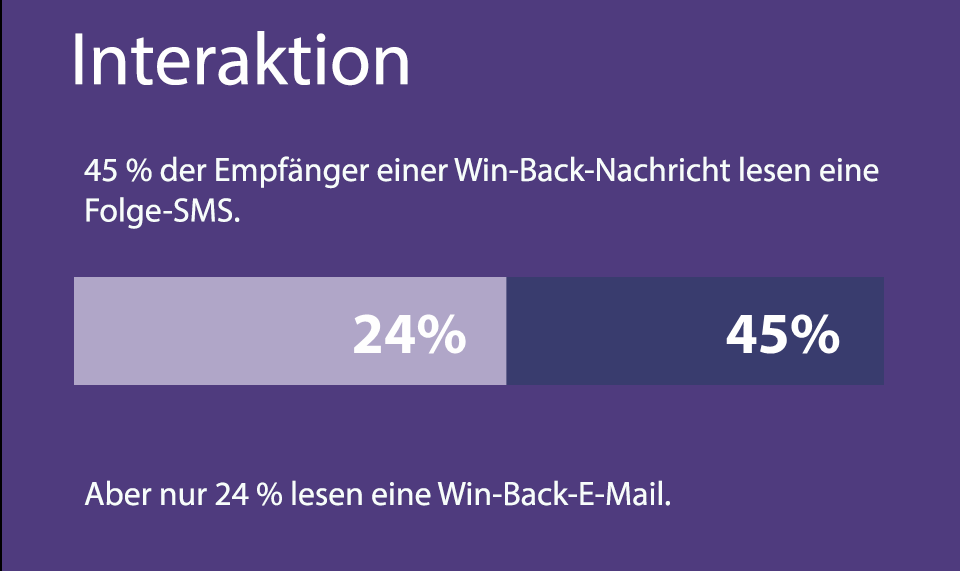
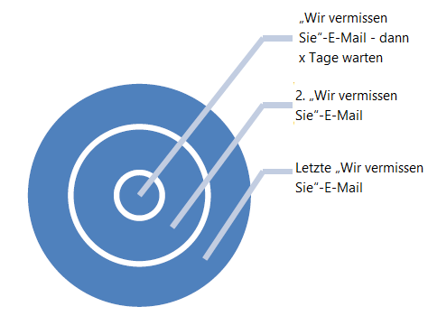
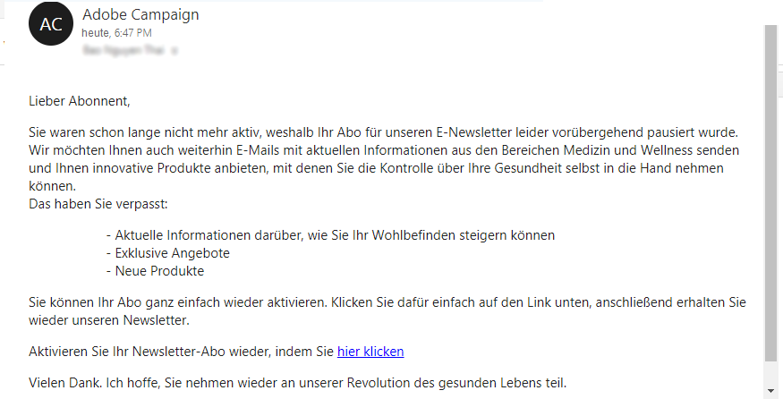
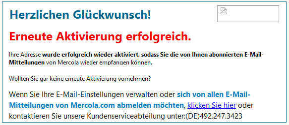

# Zustellbarkeit durch Rückgewinnung verbessern{#re-engagement}

Einige der Best Practices bei der Implementierung der Zustellbarkeit bestehen darin, einen gesunden Abonnentenstamm zu erhalten und die Zustellbarkeit durch Rückgewinnungsstrategien zu verbessern.

* Die Aufrechterhaltung eines gesunden Abonnentenstamms ist einer der Hauptaspekte für einen guten und konsistenten Versand. Viele Zustellbarkeitsprobleme entstehen durch schlechte Datenpraxis und Wartung.
* Eines der häufigsten Probleme, mit denen Marketing-Experten heutzutage konfrontiert sind, ist die Inaktivität von Abonnenten (auch als „niedrige“ oder „fehlende Interaktion“ bezeichnet), die sich negativ auf den Versand von E-Mails auswirken und einen niedrigen ROI verursachen kann.

>[!NOTE]
>
>Weitere Informationen zu Wiedergewinnungsstrategien und Zustellbarkeitsdiensten von Adobe erhalten sie von Ihrem Zustellbarkeitsberater oder Ihrem Adobe-Vertreter.

## Wie beurteilen ISPs inaktives Verhalten? {#how-do-isps-view-non-engagement-activity-}

Seit Jahren verwenden ISPs Feedback-Messwerte für die Interaktion von Benutzern, um zu entscheiden, wohin Nachrichten übermittelt werden und ob sie überhaupt übermittelt werden. Benutzerinteraktion kann sowohl positives als auch negatives Feedback enthalten und ISPs überwachen permanent beides. Fehlende Interaktion ist besonders negativ. Das ständige Versenden von Kampagnen an inaktive Benutzer kann der allgemeinen Reputation Ihrer IP-Adresse und Ihrer Domains schaden.

ISPs wie AOL, Gmail, Microsoft und Yahoo! erachten bei fehlender Interaktion eine E-Mail als unerwünscht und befördern diese Nachricht in den Spam-Ordner. Zusätzlich können E-Mail-Konten, die nicht mehr von Abonnenten verwendet werden, als &quot;wiederverwertete&quot; Spamfallen verwendet werden. Das bedeutet, dass die Adresse längere Zeit hindurch ungültig war und alle Nachrichten dorthin abgelehnt wurden. Wenn Ihr Abonnentenverwaltungssystem &quot;Hardbounces&quot; nicht entfernt, könnten Sie in einer solchen Mailing-Spamfalle landen, die beträchtliche Versandprobleme verursacht.

## Wie sollten Sie bei Inaktivität vorgehen? {#how-should-you-approach-inactivity-}

Kunden der Adobe-Campaign-Plattform haben die Möglichkeit, Inaktivität innerhalb ihrer Instanz zu erkennen, indem sie die Öffnungs- und Klickraten des Segments betrachten. Da fehlende Interaktion die Zustellbarkeit beeinträchtigen kann, ist der erste Gedanke, diese Abonnenten einfach aus der Datenbank zu entfernen. Doch dies könnte in manchen Fällen die falsche Entscheidung sein. Empfehlenswert ist eine Rückgewinnungsstrategie (auch Win-Back-Strategie genannt), um die Abonnenten zu behalten, die E-Mails erhalten möchten, und diejenigen, die keine Aktivität zeigen, nach und nach zu entfernen.

## Funktionieren Rückgewinnungskampagnen wirklich? {#do-re-engagement-campaigns-really-work-}

Laut einer Studie von Return Path erzielten Rückgewinnungskampagnen eine Öffnungsrate von 12 % verglichen mit einer durchschnittlichen Öffnungsrate von 14 % bei normalen Kampagnen. Obwohl nur 24 % der Abonnenten die Rückgewinnungskampagne gelesen hatten, lasen ca. 45 % von ihnen die darauf folgenden Nachrichten.

## Wie wird eine Rückgewinnungskampagne erstellt? {#how-do-you-create-a-re-engagement-campaign-}

### Phase 1 {#phase-1}

* Zunächst müssen die Abonnenten identifiziert werden, die nur sehr geringe oder gar keine Öffnungs- oder Klickaktivität zeigen, und entsprechend einem bestimmten Zeitrahmen aufgeteilt werden. Als Faustregel sollten alle Abonnenten überprüft werden, die innerhalb der letzten 90 Tage keine E-Mails geöffnet oder angeklickt haben. Doch dies variiert je nach Geschäftstätigkeit (z. B. saisonaler Versand).
* Außerdem sollten Sie bei der Festlegung von Zeitrahmen bedenken, dass ISPs und Anbieter von Blockierungslisten bei der Interaktion von zwischen 1,5 und 1,8 Jahren ausgehen. Darüber hinaus gibt es verhaltensbezogene Aktivitäten wie Einkäufe und Website-Aktivitäten oder andere Kontaktpunkte, wie zum Beispiel Voreinstellungen während der Anmeldungsphase oder des ersten Kontaktpunkts.

### Phase 2 {#phase-2}

* Sobald ein Segment definiert, ist, wird im nächsten Schritt eine auf die erfassten Messwerte des Abonnenten abgestimmte Rückgewinnungskampagne entwickelt. Zusätzlich weckt eine Betreffzeile verstärkt das Interesse des Abonnenten. Laut einer Studie von Return Path erzielen Betreffzeilen und Inhalte, in denen steht &quot;Wir vermissen Sie&quot; höhere Antwortraten als &quot;Wir wollen Sie zurückhaben&quot;.
* Für eine erneute Interaktion kann in der E-Mail auch ein Anreiz angeboten werden. Beim Angebot von Rabatten ist es besser, Beträge zu nennen als Prozentsätze, was laut Return Path höhere Antwortraten zur Folge hat. Schließlich sind auch A/B-Tests zur Überprüfung von Antwort- und Erfolgsraten eine nützliche Methode.

### Phase 3 {#phase-3}

Als Nächstes muss die Frequenz der Rückgewinnungskampagne bestimmt werden. Im Gegensatz zu einfachen Bestätigungsnachrichten sollen Rückgewinnungskampagnen die Abonnenten langfristig mit mehreren E-Mails zurückgewinnen. Im Folgenden wird ein Beispiel für die Ermittlung der Frequenz beschrieben.

Abonnenten, die in der Kampagne durch Öffnen oder Anklicken erneut aktiv werden, werden wieder auf die Liste aktiver Abonnenten gesetzt.

### Phase 4 {#phase-4}

* In der nächsten Phase werden Abonnenten identifiziert, die längere Zeit hindurch keine Aktivität zeigen. Der Versand von E-Mails an sie wird schrittweise verringert. Wenn innerhalb des letzten Jahres gar keine Aktivität stattgefunden hat, sollte die E-Mail-Adresse dieser Abonnenten ausgesetzt werden. Obwohl sie kein Interesse am Inhalt der E-Mail gezeigt haben, besteht immer noch die Möglichkeit, dass sie ihre Anmeldung erneuern, wenn Sie eine einmalige Bestätigungskampagne starten.
* Eine Bestätigungskampagne ermöglicht Ihnen, bereits seit langer Zeit inaktive Abonnenten zu fragen, ob sie auf der Abonnentenliste bleiben möchten. Bei der Erstellung der Kampagne sollten Sie einen &quot;Hier klicken&quot;-Link einfügen, damit Empfänger ihre Absicht bestätigen und ihre Adresse verifizieren können. Auf diese Weise kann die Aktion in der Datenbank festgehalten werden. Unten finden Sie ein Beispiel einer Bestätigungs-E-Mail:

   

   Nachdem der Abonnent die Aktion ausgeführt hat, könnten Sie ihm eine Landingpage mit der Bestätigung seiner erneuten Anmeldung anzeigen. Unten finden Sie ein Beispiel für eine Landingpage:

   
