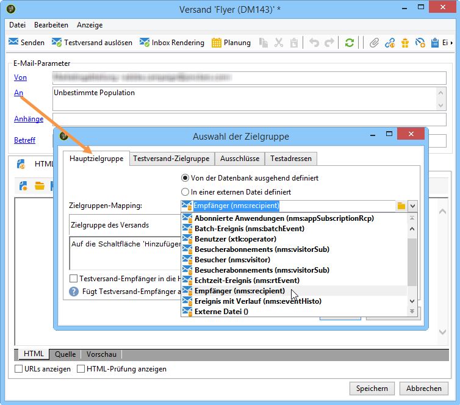

# Auswählen eines Zielgruppen-Mappings{#selecting-a-target-mapping}

Standard-Zielgruppe in Versandvorlagen sind die **[!UICONTROL Empfangenden]**. Das Zielgruppen-Mapping verwendet also die Felder der Tabelle **nms:recipient**. Adobe Campaign stellt jedoch auch andere Zielgruppen-Mappings zur Verfügung, auf die Sie je nach Bedarf zurückgreifen können.

Folgende Mappings sind vorhanden:

| Name | Verwendung | Standardschema |
|---|---|---|
| Bereich Empfänger | Versand richtet sich an die in der Adobe Campaign-Datenbank enthaltenen Empfänger | nms:recipient |
| Besuchende | Versand richtet sich an Profile, die beispielsweise durch das Weiterleiten von Nachrichten (Virales Marketing) oder durch soziale Netzwerke (Facebook, X – früher bekannt als Twitter) akquiriert wurden. | mns:visitor |
| Abonnements | Versand richtet sich an Abonnenten eines Informationsdienstes wie z. B. einen Newsletter | nms:subscription |
| Besucher-Abonnements | Versand richtet sich an Besucher, die einen Informationsdienst beziehen | nms:visitorSub |
| Service | Veröffentlichen auf einem X-Konto oder einer Facebook-Seite | nms:service |
| Benutzer | Versand richtet sich an Adobe Campaign-Benutzer | nms:operator |
| Externe Datei | Versand basiert auf einer Datei, die alle notwendigen Informationen enthält | Ohne Schema oder Zielgruppe |

>[!NOTE]
>
>Sie können auch neue Zielgruppen-Mappings erstellen. Dieser Vorgang ist erfahrenen Benutzern vorbehalten. Weiterführende Informationen hierzu finden Sie in [diesem Abschnitt](../../configuration/using/target-mapping.md).
