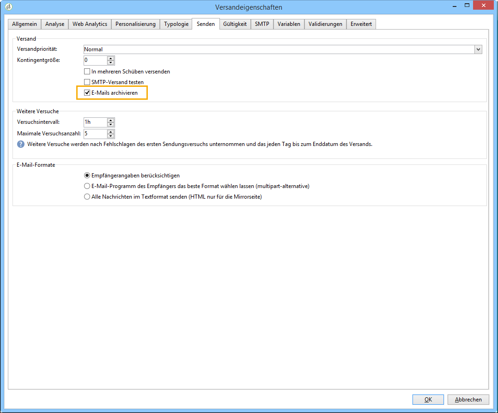
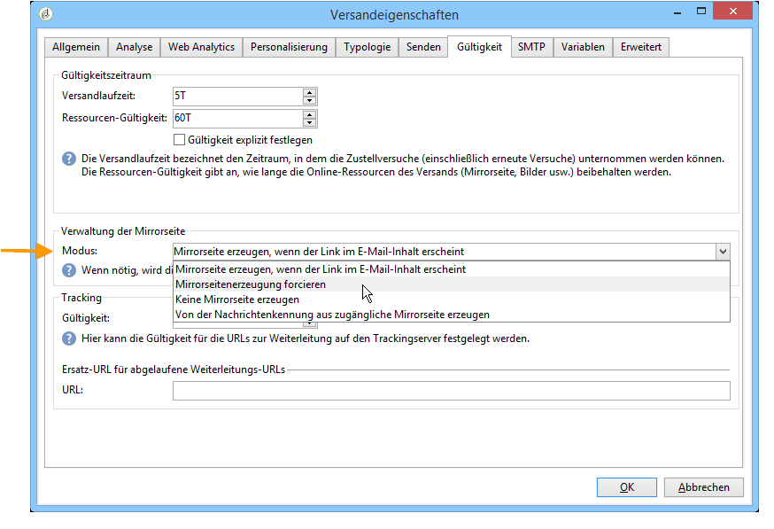
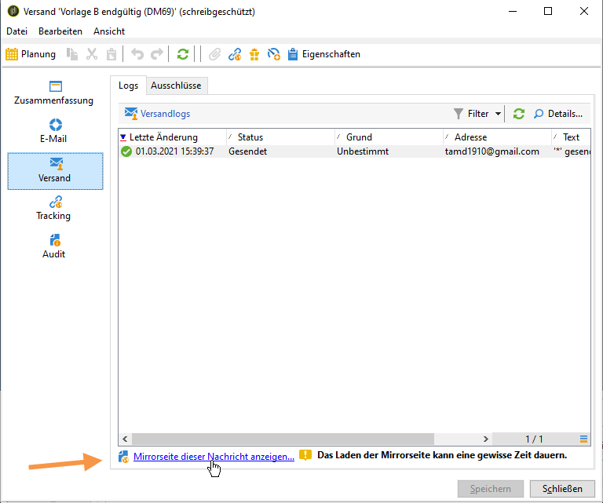
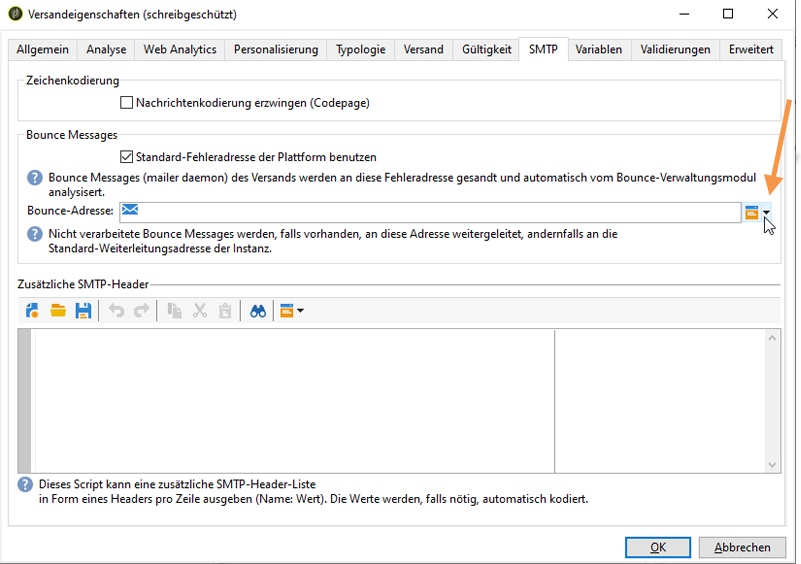
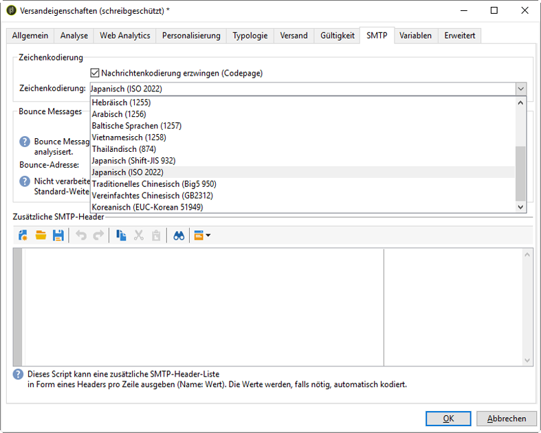

# E-Mail-Versand{#sending-an-email}

Klicken Sie auf **[!UICONTROL Senden]**, um die E-Mail-Erstellung zu verifizieren und den Versand zu starten.

Die detaillierten Schritte zur Validierung und zum Versand von Nachrichten finden Sie in den folgenden Abschnitten:

* [Versand validieren](../../delivery/using/steps-validating-the-delivery.md)
* [Versenden der Nachrichten](../../delivery/using/steps-sending-the-delivery.md)

In den folgenden Abschnitten werden die Parameter beschrieben, die speziell für den Versand von E-Mails gelten.

## E-Mails archivieren {#archiving-emails}

In Adobe Campaign können Sie mit der BCC-Option E-Mails in einem externen System speichern, indem Sie einfach eine BCC-E-Mail-Adresse zu ihrer Versandzielgruppe hinzufügen. Durch Aktivierung dieser Option wird eine exakte Kopie aller versandten Nachrichten aufbewahrt.

Weiterführende Informationen zur Konfiguration von E-Mail-BCC finden Sie in [diesem Abschnitt](../../installation/using/email-archiving.md).

>[!NOTE]
>
>Hierbei handelt es sich um eine optionale Funktion. Bitte prüfen Sie Ihren Lizenzvertrag und kontaktieren Sie den Ansprechpartner für Ihr Konto, um diese Funktion zu aktivieren.

Bei der Erstellung eines neuen Versands oder einer Versandvorlage ist die E-Mail-BCC-Option nicht standardmäßig aktiviert, selbst wenn die Option erworben wurde. Sie muss für jeden Versand bzw. jede Vorlage manuell aktiviert werden.

Gehen Sie dazu wie folgt vor:

1. Gehen Sie zu **[!UICONTROL Kampagnenverwaltung]** > **[!UICONTROL Sendungen]** oder **[!UICONTROL Ressourcen]** > **[!UICONTROL Vorlagen]** > **[!UICONTROL Versandvorlagen]**.
1. Wählen Sie den gewünschten Versand aus oder duplizieren Sie die Standardvorlage **E-Mail-Versand**, und wählen Sie dann die duplizierte Vorlage aus.
1. Wählen Sie die **Eigenschaften**-Schaltfläche aus.
1. Gehen Sie in den **[!UICONTROL Versand]**-Tab.
1. Aktivieren Sie die Option **E-Mails archivieren**, um eine Kopie aller gesendeten Nachrichten dieses Versands oder aller auf dieser Vorlage basierenden Sendungen aufzubewahren.

   

   >[!NOTE]
   >
   >Wenn die an eine BCC-Adresse gesendeten E-Mails geöffnet und angeklickt werden, wird dies in **[!UICONTROL Gesamtöffnungen]** und **[!UICONTROL Klicks]** der Versandanalyse berücksichtigt, was zu falschen Berechnungen führen könnte.

## Mirrorseite erstellen {#generating-the-mirror-page}

Eine Mirrorseite ist eine HTML-Seite, die über einen Webbrowser online abgerufen werden kann und deren Inhalt mit dem der E-Mail identisch ist.

Standardmäßig wird die Mirror­Seite automatisch generiert, wenn der entsprechende Link in den Inhalt der E-Mail eingefügt wurde. Weitere Informationen zum Einfügen von Gestaltungsbausteinen finden Sie unter [Gestaltungsbausteine](../../delivery/using/personalization-blocks.md).

In den Versandeigenschaften kann die Erzeugung der Seite über das Feld **[!UICONTROL Modus]** im Tab **[!UICONTROL Gültigkeit]** konfiguriert werden.

>[!CAUTION]
>
>Zur Erzeugung einer Mirrorseite muss zuvor ein HTML-Versandinhalt erstellt worden sein.

Außerdem stehen die folgenden Modi zur Verfügung:

* **[!UICONTROL Mirrorseitenerzeugung forcieren]**: Erstellt eine Mirrorseite, selbst wenn im Versandinhalt kein entsprechender Link enthalten ist.
* **[!UICONTROL Keine Mirrorseite erzeugen]**: Erstellt keine Mirrorseite, selbst wenn im Versandinhalt der entsprechende Link enthalten ist.
* **[!UICONTROL Von der Nachrichtenkennung aus zugängliche Mirrorseite erzeugen]**: Diese Option ermöglicht den Zugriff auf den Inhalt der Mirrorseite einschließlich aller Personalisierungsinformationen von den Versandlogs aus. Klicken Sie hierfür nach Durchführung des Versands auf den Tab **[!UICONTROL Versand]** und wählen Sie die Zeile des Empfängers aus, dessen Mirrorseite Sie ansehen möchten. Klicken Sie dann auf den Link **[!UICONTROL Mirrorseite dieser Nachricht anzeigen...]**.

   

## Bounce Messages verwalten {#managing-bounce-emails}

Im Tab **[!UICONTROL SMTP]** der Versandeigenschaften lässt sich der Umgang mit Bounce Messages konfigurieren.

Standardmäßig werden Bounce Messages an die im Softwareverteilungs-Assitenten der Plattform angegebene Fehleradresse gesendet. Es besteht jedoch die Möglichkeit, für einen Versand durch Abwählen der Standardoption eine spezifische Fehleradresse anzugeben.

Sie können eine weitere Adresse angeben, die es ermöglicht, die Unzustellbarkeitsursache derjenigen E-Mails zu untersuchen, bei denen die Anwendung sie nicht automatisch erkannt hat. Bei beiden Feldern können Sie durch Klick auf das entsprechende Symbol Personalisierungsfelder hinzufügen.

## Zeichenkodierung {#character-encoding}

Auf dem Tab **[!UICONTROL SMTP]** der Versandparameter können Sie im Abschnitt **[!UICONTROL Zeichenkodierung]** eine bestimmte Kodierung festlegen.

Die Standardkodierung ist UTF-8. Wenn einige E-Mail-Anbieter Ihrer Empfänger keine UTF-8-Standardkodierung unterstützen, sollten Sie eine bestimmte Kodierung einrichten, sodass Sonderzeichen den Empfängern Ihrer E-Mails korrekt angezeigt werden.

Gehen wir davon aus, dass Sie eine E-Mail mit japanischen Zeichen versenden möchten. Um sicherzustellen, dass Ihren Empfängern in Japan alle Zeichen korrekt dargestellt werden, sollten Sie eine Kodierung verwenden, die anstelle der standardmäßigen UTF-8-Kodierung japanische Zeichen unterstützt.

Wählen Sie dazu die Option **[!UICONTROL Nachrichtenkodierung erzwingen (Codepage)]** im Abschnitt **[!UICONTROL Zeichenkodierung]** und wählen Sie eine Kodierung aus der angezeigten Dropdown-Liste.

## SMTP-Header hinzufügen {#adding-smtp-headers}

Sie haben die Möglichkeit, Ihren Sendungen weitere SMTP-Header hinzuzufügen. Gehen Sie hierfür in den Tab **[!UICONTROL SMTP]** in den Versandeigenschaften.

Das in diesem Fenster erfasste Script muss pro Zeile einen Header im Format **Name: Wert** enthalten.

Werte werden bei Bedarf automatisch verschlüsselt.

>[!CAUTION]
>
>Das Hinzufügen zusätzlicher SMTP-Header ist eine Aufgabe für erfahrene Benutzer.
>
>Die Syntax des Skripts muss die Anforderungen für diesen Inhaltstyp (keine überflüssigen Leerzeichen, keine Leerzeilen usw.) erfüllen.
