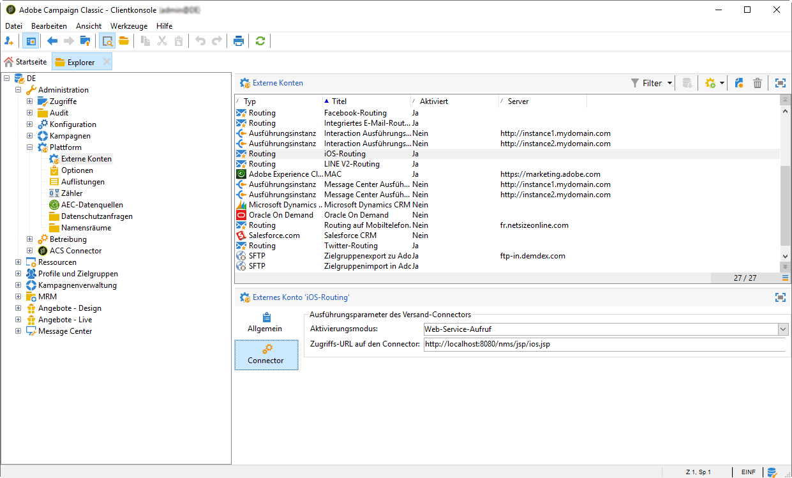
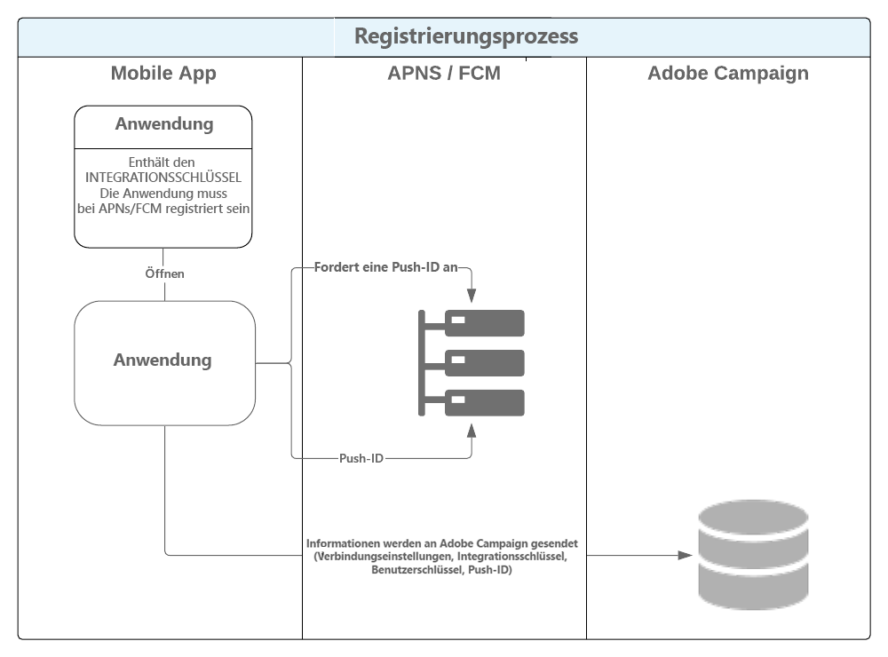
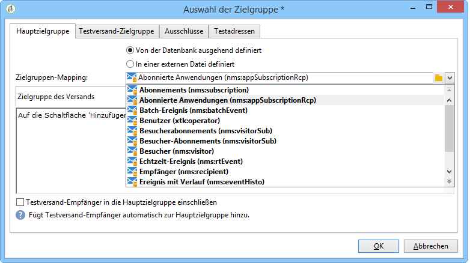

# Mobile-App-Kanal einrichten{#setting-up-mobile-app-channel}

## Einleitung {#introduction}

>[!CAUTION]
>
>Die Implementierung des Mobile-App-Kanals muss von Experten durchgeführt werden. Wenn Sie Hilfe brauchen, kontaktieren Sie bitte Ihren Adobe-Kundenbetreuer oder Professional Services-Partner.

Sie können mehrere Versionen Ihrer Mobile App (iOS, Android) erstellen: Mit dem Mobile-App-Kanal (Mobile App Channel) verfügen Sie über die ideale Lösung, um Ihren Abonnenten Benachrichtigungen zu senden.

Um die Funktionen des Mobile App-Kanals von Adobe Campaign nutzen zu können, müssen Sie Ihre Mobile App ändern/anpassen, um sie in die Adobe Campaign-Plattform zu integrieren.

Es stehen zwei Campaign Classic-SDKs zur Verfügung, eines für Android und eines für iOS, um eine einfache Integration Ihrer mobilen Anwendung mit Adobe Campaign zu ermöglichen. Es ist eine umfassende technische Kenntnis von Java und Objective-C erforderlich. Eine detaillierte Beschreibung des Campaign SDK finden Sie unter [Integrieren des Campaign SDK in die Mobilanwendung](#integrating-campaign-sdk-into-the-mobile-application).

>[!NOTE]
>
>Die von Adobe Campaign bereitgestellten Bibliotheken können mit Xcode (iOS) und Android Studio (Android) verwendet werden.

## Connectoren {#connectors}

### iOS-Connectoren {#ios-connectors}

Für iOS sind zwei Connectoren verfügbar:

* Der binäre iOS-Connector sendet Benachrichtigungen an APNS-Legacy-Binärserver.
* Der iOS HTTP/2-Connector sendet Benachrichtigungen an HTTP/2-APNS.

Wählen Sie den jeweiligen Connector folgendermaßen aus:

1. Go to **[!UICONTROL Administration > Platform > External accounts]**.
1. Wählen Sie das externe iOS-Routing-Konto aus.
1. Füllen Sie auf der **[!UICONTROL Connector]** Registerkarte das **[!UICONTROL Access URL of the connector]** Feld aus:

   Für binäres iOS: https://localhost:8080/nms/jsp/ios.jsp

   Für HTTP2-iOS: http://localhost:8080/nms/jsp/iosHTTP2.jsp

   

### Android-Connectoren {#android-connectors}

Für Android sind zwei Connectoren verfügbar:

* Der V1-Connector, der pro MTA-Kind eine Verbindung ermöglicht.
* Der V2-Connector, der gleichzeitige Verbindungen zum FCM-Server ermöglicht, um den Durchsatz zu erhöhen.

Wählen Sie den jeweiligen Connector folgendermaßen aus:

1. Go to **[!UICONTROL Administration > Platform > External accounts]**.
1. Wählen Sie das **[!UICONTROL Android routing]** externe Konto aus.
1. Füllen Sie auf der **[!UICONTROL Connector]** Registerkarte das **[!UICONTROL JavaScript used in the connector]** Feld aus:

   Für Android V1: https://localhost:8080/nms/jsp/androidPushConnector.js

   Für Android V2: https://localhost:8080/nms/jsp/androidPushConnectorV2.js

   

1. Für Android V2 ist ein zusätzlicher Parameter in der Adobe-Server-Konfigurationsdatei (serverConf.xml) verfügbar:

   * **maxGCMConnectPerChild**: Maximale Anzahl paralleler HTTP-Abfragen bei FCM durch jeden Kindserver (standardmäßig acht).

## Konfigurationsschritte {#configuration-steps}

### Anwendungserstellung {#creating-the-application}

Wenn Sie keine Mobilanwendung (App) haben, muss der Anwendungsentwickler sie erstellen und das SDK integrieren. Wenn die mobile Anwendung vorhanden ist, muss der Entwickler sie anpassen, indem er das Adobe Campaign SDK integriert und die für den Dienst spezifischen Einstellungen hinzufügt. Eine Beschreibung des SDK finden Sie unter [Integrieren des Kampagnen-SDK in die Mobilanwendung](#integrating-campaign-sdk-into-the-mobile-application).

>[!CAUTION]
>
>Bevor Sie die SDK integrieren, ist sicherzustellen, dass die Anwendungen für den Versand von Push-Benachrichtigungen konfiguriert wurden.
>
>Sollte dies nicht der Fall sein, besuchen Sie bitte [diese Seite](https://developer.apple.com/library/archive/documentation/NetworkingInternet/Conceptual/RemoteNotificationsPG/).

### Anforderungsanalyse {#collecting-information-}

Für die Konfiguration der Anwendung sind die erforderlichen Informationen in einem Lastenheft festzuhalten. Letzteres muss alle Parameter enthalten, die die Kommunikation zwischen Adobe Campaign und der Mobile App ermöglichen. Folgende Parameter sind zu definieren:

* **Integrationsschlüssel**: Jede Anwendung hat einen eindeutigen Schlüssel. Mit diesem Schlüssel können Sie den Adobe Campaign-Dienst und die mobile Anwendung verknüpfen. Siehe [Allgemeine Informationen](#general-information).
* **Variablen**: definieren Sie das Verhalten der Anwendung beim Aktivieren der Benachrichtigung. Siehe [Allgemeine Informationen](#general-information).
* **die Abonnementeinstellungen**: Adobe Campaign stellt standardmäßig das Feld **@userKey** wieder her, mit dem Sie Mobilgeräte mit den Empfängern in der Datenbank abgleichen können. Wenn Sie zusätzliche Daten erfassen möchten (z. B. einen komplexen Abgleichschlüssel), können Sie die Abonnementeinstellungen definieren. Siehe [Abonnementeinstellungen](#subscription-settings).
* **Sounds** (nur iOS): Wenn der ausgewählte Sound kein Systemsound ist, muss die Sounddatei in die mobile Anwendung eingebettet werden. Siehe [Anwendungsgeräusche](#application-sounds).
* **die URL des Marketing-Servers und des Tracking-Servers**: Der Adobe Campaign-Administrator muss dem Anwendungsentwickler die URLs des Marketing-Servers und die URLs des Tracking-Servers bereitstellen. Weitere Informationen finden Sie unter: [Integrieren des Kampagnen-SDK in die Mobilanwendung](#integrating-campaign-sdk-into-the-mobile-application).

### Diensterstellung {#creating-the-service}

Der Adobe Campaign-Administrator muss einen Dienst erstellen und konfigurieren, der mit der mobilen Anwendung verknüpft ist. For more on this, refer to [Configuring the mobile application in Adobe Campaign](#configuring-the-mobile-application-in-adobe-campaign).

### Testen der Anwendung {#testing-the-application}

Für iOS ist die Erstellung einer App im Sandbox-Modus erforderlich, um Tests und Validierungen durchzuführen. Anschließend muss innerhalb desselben Adobe-Campaign-Dienstes eine neue Anwendung vom Typ &quot;Produktion&quot; erstellt und das entsprechende Zertifikat angegeben werden. Lesen Sie diesbezüglich auch die Apple-Dokumentation zu Push-Benachrichtigungen.

Bei Android ist die Erstellung einer App ausreichend. Alle Tests (Abonnement-Erhebung, Sendung usw.) sind vor ihrer Publikation direkt in der Anwendung durchzuführen.

## Datenfluss {#data-path}

Die unten stehenden Schemata verdeutlichen den Austausch von Daten zwischen Mobile Apps und Adobe Campaign. Drei Akteure sind an diesem Prozess beteiligt:

* Mobile App
* Benachrichtigungsdienst - APNS (Apple Push Notification Service) bei iOS und FCM (Firebase Cloud Messaging) bei Android
* Adobe Campaign

Der Benachrichtigungsprozess besteht aus drei großen Schritten: Speicherung der App in Adobe Campaign (Abonnement-Erhebung), Versand und Tracking.

### 1. Schritt: Abonnement-Erhebung {#step-1--subscription-collection}

Die Mobile App wird vom Nutzer im App Store oder bei Google Play heruntergeladen. Die App enthält u. a. die Verbindungsparameter (Zertifikat bei iOS und Projektschlüssel bei Android) sowie den Integrationsschlüssel. Beim ersten Start der App werden je nach Konfiguration vom Benutzer gewisse Registrierungsdaten abgefragt (@userKey, beispielsweise eine E-Mail-Adresse oder eine Kundennummer). Gleichzeitig ruft die App beim Benachrichtigungsdienst eine Benachrichtigungskennung (Push-ID) ab. Alle diese Daten (Verbindungsparameter, Integrationsschlüssel, Benachrichtigungskennung, userKey) werden an Adobe Campaign übermittelt.



### 2. Schritt: Versand {#step-2--delivery}

Die Marketingabteilung erstellt einen Versand mit den jeweiligen App-Abonnenten als Zielgruppe. Der Versandprozess übermittelt dem Benachrichtigungsdienst die Verbindungsparameter (Zertifikat bei iOS und Projektschlüssel bei Android), die Benachrichtigungskennung (Push-ID) und den Inhalt der Benachrichtigung. Der Benachrichtigungsdienst sendet die Benachrichtigungen an die Mobilgeräte der Zielgruppenempfänger.

Folgende Informationen werden an Adobe Campaign gemeldet:

* Nur Android: Anzahl an Geräten, auf denen die Benachrichtigung angezeigt wurde (Impressions);
* Android und iOS: Anzahl an Klicks auf die Benachrichtigung.


Der Adobe-Campaign-Server muss den APNS auf folgenden Ports kontaktieren können:

* 2195 (Sendung) und 2186 (Feedback-Service) für den binären iOS-Connector
* 443 für den iOS-HTTP/2-Connector

Verwenden Sie folgende Befehle, um die korrekte Funktionsweise zu testen:

* Für Tests:

   ```
   telnet gateway.sandbox.push.apple.com
   ```

* In Produktion:

   ```
   telnet gateway.push.apple.com
   ```

Wenn ein binärer iOS-Connector verwendet wird, muss der APNS vom MTA und Webserver auf dem Port 2195 (Sendung) und vom Workflow-Server auf dem Port 2196 (Feedback-Service) kontaktiert werden können.

Wenn ein iOS-HTTP/2-Connector verwendet wird, muss der APNS vom MTA, Webserver und Workflow-Server auf dem Port 443 kontaktiert werden können.

## Integration des Campaign SDK in Mobile Apps {#integrating-campaign-sdk-into-the-mobile-application}

Die Campaign SDKs für iOS und Android sind im Mobile App Channel-Modul enthalten.

>[!NOTE]
>
>Um das Campaign SDK (früher bekannt als Neolane SDK) zu erhalten, wenden Sie sich bitte an die Adobe-Kundenunterstützung.

Ziel eines SDK ist es, die Integration einer Mobile App in die Adobe-Campaign-Plattform zu erleichtern.

Weiterführende Informationen zu den unterstützten Android- und iOS-Versionen finden Sie in der [Kompatibilitätsmatrix](https://helpx.adobe.com/campaign/kb/compatibility-matrix.html#MobileSDK) .

### Campaign SDK laden {#loading-campaign-sdk}

* **Android**: erfordert die Verknüpfung der Datei **neolane_sdk-release.aar** mit dem Projekt.

   Folgende Erlaubnis ermöglicht den Zugriff auf den Adobe-Campaign-Server:

   ```
   Neolane.getInstance().setIntegrationKey("your Adobe mobile app integration key");
   Neolane.getInstance().setMarketingHost("https://yourMarketingHost:yourMarketingPort/");
   Neolane.getInstance().setTrackingHost("https://yourTrackingHost:yourTrackingPort/");
   ```

   Folgende Erlaubnis ermöglicht den Abruf einer eindeutigen Kennung für jedes Telefon:

   ```
   <uses-permission android:name="android.permission.READ_PHONE_STATE" /> 
   ```

   Ab der SDK-Version 1.0.24 wird diese Erlaubnis nur für Android-Versionen unter Android 6.0 verwendet.

   Ab der SDK-Version 1.0.26 wird diese Erlaubnis nicht mehr verwendet.

* **iOS**: erfordert die Verknüpfung der Dateien **libNeolaneSDK.a** und **Neolane_SDK.h** mit dem Projekt. Ab der SDK-Version 1.0.24 ist die Option **ENABLE_BITCODE** aktiviert.

   >[!NOTE]
   >
   >Für die Version 1.0.25 des SDK sind die vier Architekturen in der Datei **Neolane_SDK.h** verfügbar.

### Integrationsparameter deklarieren {#declaring-integration-settings}

Zur Integration des Campaign SDK in die Mobile App benötigt der Entwickler folgende Informationen vom funktionalen Administrator:

* **Integrationsschlüssel**: zur Identifizierung der Mobile App durch die Adobe-Campaign-Plattform.

   >[!NOTE]
   >
   >This integration key is entered in the Adobe Campaign console, in the **[!UICONTROL Information]** tab of service dedicated to the mobile application. Siehe [Allgemeine Informationen](#general-information).

* **Tracking-URL**: entspricht der Adresse des Adobe-Campaign-Trackingservers.
* **Marketing-URL**: zur Abfrage der Abonnements.

* **Für Android**:

   ```
   Neolane.getInstance().setIntegrationKey("your Adobe mobile app integration key");
   Neolane.getInstance().setMarketingHost("https://yourMarketingHost:yourMarketingPort/");
   Neolane.getInstance().setTrackingHost("https://yourTrackingHost:yourTrackingPort/"); 
   ```

* **Für iOS**:

   ```
   Neolane_SDK *nl = [Neolane_SDK getInstance];
   [nl setMarketingHost:strMktHost];
   [nl setTrackingHost:strTckHost];
   [nl setIntegrationKey:strIntegrationKey];
   ```

### Registrierungsfunktion {#registration-function}

Die Registrierungsfunktion ermöglicht

* das Senden der Benachrichtigungskennung oder Push-ID (deviceToken bei iOS und registrationID bei Android) an Adobe Campaign.
* die Abfrage des Abstimmschlüssels oder userKey (z. B. E-Mail-Adresse oder Kundennummer).

* **Für Android**:

   ```
   void registerInNeolane(String registrationId, String userKey, Context context)
   {
    try{
     Neolane.getInstance().registerDevice(registrationToken, userKey, null, context);
    } catch (NeolaneException e){
     //...
    } catch (IOException e){
     //...
    }
   }
   ```

   Wenn Sie FCM (Firebase Cloud Messaging) verwenden, empfehlen wir Ihnen, beim Aufruf der **onTokenRefresh**-Funktion die **registerDevice**-Funktion zu verwenden, um Adobe Campaign vom Wechsel des Mobilgeräte-Tokens des Nutzers in Kenntnis zu setzen.

   ```
   public class NeoTripFirebaseInstanceIDService extends FirebaseInstanceIdService {
     @Override
     public void onTokenRefresh() {
       String registrationToken = FirebaseInstanceId.getInstance().getToken();
       NeolaneAsyncRunner neolaneAs = new NeolaneAsyncRunner(Neolane.getInstance());
       ...
       ...
       // Neolane Registration
       neolaneAs.registerDevice(registrationToken, userKey, additionnalParam, this, new NeolaneAsyncRunner.RequestListener() {
       public void onComplete(String e, Object state) { ... }
       public void onNeolaneException(NeolaneException e, Object state) { ... }
       public void onIOException(IOException e, Object state) { ... }
       });
       ...
       ...
     }
   }
   ```

* **Für iOS**:

   ```
   // Callback called on successful registration to the APNS
   - (void)application:(UIApplication*)application didRegisterForRemoteNotificationsWithDeviceToken:(NSData*)deviceToken
   {
       // Pass the token to Adobe Campaign
       Neolane_SDK *nl = [Neolane_SDK getInstance];
       [nl registerDevice:tokenString:self.userKey:dic];
   }
   ```

### Trackingfunktion {#tracking-function}

* **Für Android**:

   Trackingfunktionen ermöglichen das Tracking der Benachrichtigungsanzeige (Impression) und die Aktivierung der Benachrichtigungen (Öffnungen).

   To track the notification display (done by calling the **notifyReceive** function of the SDK), follow the implementation below. Note that if you use FCM (Firebase Cloud Messaging), we advise you to use the **notifyReceive** function when the **onMessageReceived** function is called by the Android system.

   ```
   package com.android.YourApplication;
   
   import android.content.Context;
   import android.content.SharedPreferences;
   import android.os.Bundle;
   import android.util.Log;
   
   import com.google.firebase.messaging.FirebaseMessagingService;
   import com.google.firebase.messaging.RemoteMessage;
   
   import java.util.Iterator;
   import java.util.Map;
   import java.util.Map.Entry;
   
   public class YourApplicationFirebaseMessagingService extends FirebaseMessagingService {
     private static final String TAG = "MyFirebaseMsgService";
   
     @Override
     public void onMessageReceived(RemoteMessage message) {
       Log.d(TAG, "Receive message from: " + message.getFrom());
       Map<String,String> payloadData = message.getData();
       final Bundle extras = new Bundle();
       final Iterator<Entry<String, String>> iter = payloadData.entrySet().iterator();
       while(iter.hasNext())
       {
         final Entry<String, String>  entry =iter.next();
         extras.putString(entry.getKey(), entry.getValue());
       }
   
       SharedPreferences settings = this.getSharedPreferences(YourApplicationActivity.APPLICATION_PREF_NAME, Context.MODE_PRIVATE);
       String mesg = payloadData.get("_msg");
       String title = payloadData.get("title");
       String url = payloadData.get("url");
       String messageId = payloadData.get("_mId");
       String deliveryId = payloadData.get("_dId");
       YourApplicationActivity.handleNotification(this, mesg, title, url, messageId, deliveryId, extras);
     }
   }
   ```

   ```
   public static void handleNotification(Context context, String message, String title, String url, String messageId, String deliveryId, Bundle extras){
       if( message == null ) message = "No Content";
       if( title == null )   title = "No title";
       if( url == null )     url = "https://www.tripadvisor.fr";
       int iconId = R.drawable.notif_neotrip;
   
       // notify Neolane that a notification just arrived
       NeolaneAsyncRunner nas = new NeolaneAsyncRunner(Neolane.getInstance());
       nas.notifyReceive(Integer.valueOf(messageId), deliveryId, new NeolaneAsyncRunner.RequestListener() {
         public void onNeolaneException(NeolaneException arg0, Object arg1) {}
         public void onIOException(IOException arg0, Object arg1) {}
         public void onComplete(String arg0, Object arg1){}
       });
       if (yourApplication.isActivityVisible())
       {
         Log.i("INFO", "The application has the focus" );
         ...
       }
       else
       {
         // notification creation :
         NotificationManager notificationManager = (NotificationManager) context.getSystemService(Context.NOTIFICATION_SERVICE);
         Notification notification;
   
         // Activity to start :
         Intent notifIntent = new Intent(context.getApplicationContext(), NotificationActivity.class);
         notifIntent.putExtra("notificationText", message);
         notifIntent.putExtra(NotificationActivity.NOTIFICATION_URL_KEYNAME, url);
         notifIntent.putExtra("_dId", deliveryId);
         notifIntent.putExtra("_mId", messageId);
         notifIntent.addFlags(Intent.FLAG_ACTIVITY_NEW_TASK);
         PendingIntent contentIntent = PendingIntent.getActivity(context, 1, notifIntent, PendingIntent.FLAG_UPDATE_CURRENT);
   
         notification = new Notification.Builder(context)
                 .setContentTitle(title)
                 .setContentText(message)
                 .setSmallIcon(iconId)
                 .setContentIntent(contentIntent)
                 .build();
   
         // launch the notification :
         notification.flags |= Notification.FLAG_AUTO_CANCEL;
         notificationManager.notify(Integer.valueOf(messageId), notification);
       }
   }
   ```

   Sehen Sie im Folgenden ein Implementierungsbeispiel für das (mittels des Aufrufs der SDK-Funktion **notifyOpening** erzeugte) Tracking der Öffnung einer Benachrichtigung. Die Klasse **NotificationActivity** entspricht der im vorangehenden Beispiel für die Erstellung des **notifIntent**-Objekts verwendeten Klasse.

   ```
   public class NotificationActivity extends Activity {
    public static final String NOTIFICATION_URL_KEYNAME = "NotificationUrl";
    .....
    public void onCreate(Bundle savedBundle) {
     super.onCreate(savedBundle);
     setContentView(R.layout.notification_viewer);  
     .....  
     Bundle extra = getIntent().getExtras();  
     .....  
     //get the messageId and the deliveryId to do the tracking  
     String deliveryId = extra.getString("_dId");
     String messageId = extra.getString("_mId");
     if (deliveryId != null && messageId != null) {
      NeolaneAsyncRunner neolaneAs = new NeolaneAsyncRunner(Neolane.getInstance());
      neolaneAs.notifyOpening(Integer.valueOf(messageId), deliveryId, new NeolaneAsyncRunner.RequestListener() {
       public void onNeolaneException(NeolaneException arg0, Object arg1) {}
       public void onIOException(IOException arg0, Object arg1) {}
       public void onComplete(String arg0, Object arg1) {}
       });
     }
    }
   }
   ```

* **Für iOS**:

   Mithilfe der Trackingfunktion lässt sich die Aktivierung der Benachrichtigungen (Öffnungen) verfolgen.

   ```
   (void)application:(UIApplication *)application didReceiveRemoteNotification:(NSDictionary *)launchOptions
   fetchCompletionHandler:(void (^)(UIBackgroundFetchResult))completionHandler
   {
   if( launchOptions ) { // Retrieve notification parameters here ... // Track application opening Neolane_SDK
   *nl = [Neolane_SDK getInstance]; [nl track:launchOptions:NL_TRACK_CLICK]; } 
   ...  
   completionHandler(UIBackgroundFetchResultNoData);
   }
   ```

   >[!NOTE]
   >
   >Ab Version 7.0 ruft das Betriebssystem, sobald die Funktion **application:didReceiveRemoteNotification:fetchCompletionHandler** implementiert ist, ausschließlich diese Funktion auf. Die Funktion **application:didReceiveRemoteNotification** wird deshalb nicht aufgerufen.

### Tracking von stillen Benachrichtigungen {#silent-notification-tracking}

Unter iOS können Sie stille Benachrichtigungen senden. Das sind Benachrichtigungen oder Daten, die direkt an eine mobile App gesendet werden, ohne Hinweise zu erzeugen. Adobe Campaign ermöglicht das Tracken dieser Benachrichtigungen.

Um stille Benachrichtigungen zu tracken, gehen Sie analog zum folgenden Beispiel vor:

```
// AppDelegate.m
...
...
#import "AppDelegate.h"
#import "Neolane_SDK.h"
...
...
// Callback called when the application is already launched (whether the application is running foreground or background)
- (void)application:(UIApplication *)application didReceiveRemoteNotification:(NSDictionary *)launchOptions fetchCompletionHandler:(void (^)(UIBackgroundFetchResult))completionHandler
{
 NSLog(@"IN didReceiveRemoteNotification:fetchCompletionHandler");
 if (launchOptions) NSLog(@"IN launchOptions: %@", [launchOptions description]);
 NSLog(@"Application state: %ld", (long)application.applicationState);

 // Silent Notification (specific case, can use NL_TRACK_RECEIVE as the user doesn't have click/open the notification)
 if ([launchOptions[@"aps"][@"content-available"] intValue] == 1 )
       {
  NSLog(@"Silent Push Notification");
  ...  
  ...
  //Call receive tracking
        Neolane_SDK *nl = [Neolane_SDK getInstance];
  [nl track:launchOptions:NL_TRACK_RECEIVE];

  completionHandler(UIBackgroundFetchResultNoData); //Do not show notification
  return;
 }  
 ...
 ...
        completionHandler(UIBackgroundFetchResultNoData);
}
```

### Delegation von RegisterDeviceStatus {#registerdevicestatus-delegate}

>[!NOTE]
>
>Bitte beachten Sie, dass diese Funktion nur für iOS verfügbar ist.

Mit dem Delegationsprotokoll können Sie in iOS das Ergebnis des **registerDevice**-Aufrufs abrufen und feststellen, ob bei der Registrierung ein Fehler aufgetreten ist.

Der **registerDeviceStatus**-Prototyp ist:

```
- (void) registerDeviceStatus: (ACCRegisterDeviceStatus) status:(NSString *) errorReason;
```

**Status** ermöglicht festzustellen, ob eine Registrierung erfolgreich war oder ob ein Fehler aufgetreten ist.

**ErrorReason** liefert zusätzliche Informationen zu den aufgetretenen Fehlern. Weiterführende Informationen zu möglichen Fehlern und deren Beschreibung finden Sie in der folgenden Tabelle.

<table> 
 <thead>
  <tr>
   <th> Status<br /> </th>
   <th> Beschreibung<br /> </th>
   <th> ErrorReason<br /> </th>
  </tr>
 </thead>
 <tbody>
  <tr>
   <td> ACCRegisterDeviceStatusSuccess <br /> </td>
   <td> Registrierung erfolgreich<br /> </td>
   <td> LEER<br /> </td>
  </tr>
  <tr> 
   <td> ACCRegisterDeviceStatusFailureMarketingServerHostnameEmpty <br /> </td>
   <td> Der Hostname des ACC-Marketingservers ist leer oder nicht definiert.<br /> </td>
   <td> LEER<br /> </td>
  </tr>
  <tr> 
   <td> ACCRegisterDeviceStatusFailureIntegrationKeyEmpty <br /> </td>
   <td> Der Integrationsschlüssel ist leer oder nicht definiert.<br /> </td>
   <td> LEER<br /> </td>
  </tr>
  <tr> 
   <td> ACCRegisterDeviceStatusFailureConnectionIssue<br /> </td>
   <td> Verbindungsproblem mit ACC<br /> </td>
   <td> Weitere Informationen (in der Sprache des Betriebssystems)<br /> </td>
  </tr>
  <tr> 
   <td> ACCRegisterDeviceStatusFailureUnknownUUID<br /> </td>
   <td> Die bereitgestellte UUID (Integrationsschlüssel) ist unbekannt.<br /> </td>
   <td> LEER<br /> </td>
  </tr>
  <tr> 
   <td> ACCRegisterDeviceStatusFailureUnexpectedError<br /> </td>
   <td> Unerwarteter Fehler an ACC-Server zurückgegeben.<br /> </td>
   <td> Die an ACC zurückgegebene Fehlermeldung.<br /> </td>
  </tr>
 </tbody>
</table>

Die Definition des **Neolane_SDKDelegate**-Protokolls und der **registerDeviceStatus**-Delegation ist wie folgt:

```
//  Neolane_SDK.h
//  Neolane SDK
..
.. 
// Register Device Status Enum
typedef NS_ENUM(NSUInteger, ACCRegisterDeviceStatus) {
 ACCRegisterDeviceStatusSuccess,                               // Resistration Succeed
 ACCRegisterDeviceStatusFailureMarketingServerHostnameEmpty,   // The ACC marketing server hostname is Empty or not set
 ACCRegisterDeviceStatusFailureIntegrationKeyEmpty,            // The integration key is empty or not set
 ACCRegisterDeviceStatusFailureConnectionIssue,                // Connection issue with ACC, more information in errorReason
 ACCRegisterDeviceStatusFailureUnknownUUID,                    // The provided UUID (integration key) is unknown
 ACCRegisterDeviceStatusFailureUnexpectedError                 // Unexpected error returned by ACC server, more information in errorReason
};
// define the protocol for the registerDeviceStatus delegate
@protocol Neolane_SDKDelegate <NSObject>
@optional
- (void) registerDeviceStatus: (ACCRegisterDeviceStatus) status :(NSString *) errorReason;
@end
@interface Neolane_SDK: NSObject {
} 
...
...
// registerDeviceStatus delegate
@property (nonatomic, weak) id <Neolane_SDKDelegate> delegate;
...
...
@end
```

Um die **registerDeviceStatus**-Delegation zu implementieren, gehen Sie folgendermaßen vor:

1. Implementieren Sie **setDelegate** während der SDK-Initialisierung.

   ```
   // AppDelegate.m
   ...
   ... 
   - (BOOL)application:(UIApplication *)application didFinishLaunchingWithOptions:(NSDictionary *)launchOptions
   {
   ...
   ...
    // Get the stored settings
   
    NSUserDefaults *defaults = [NSUserDefaults standardUserDefaults];
    NSString *strMktHost = [defaults objectForKey:@"mktHost"];
    NSString *strTckHost = [defaults objectForKey:@"tckHost"];
    NSString *strIntegrationKey = [defaults objectForKey:@"integrationKey"];
    userKey = [defaults objectForKey:@"userKey"];
   
    // Configure Neolane SDK on first launch
    Neolane_SDK *nl = [Neolane_SDK getInstance];
    [nl setMarketingHost:strMktHost];
    [nl setTrackingHost:strTckHost];
    [nl setIntegrationKey:strIntegrationKey];
    [nl setDelegate:self];    // HERE
   ...
   ...
   }
   ```

1. Fügen Sie das Protokoll zu **@interface** Ihrer Klasse hinzu.

   ```
   //  AppDelegate.h
   
   #import <UIKit/UIKit.h>
   #import <CoreLocation/CoreLocation.h>
   #import "Neolane_SDK.h"
   
   @class LandingPageViewController;
   
   @interface AppDelegate : UIResponder <UIApplicationDelegate, CLLocationManagerDelegate, Neolane_SDKDelegate> {
       CLLocationManager *locationManager;
       NSString *userKey;
       NSString *mktServerUrl;
       NSString *tckServerUrl;
       NSString *homeURL;
       NSString *strLandingPageUrl;
       NSTimer *timer;
   }
   ```

1. Implementieren Sie die Delegation in **AppDelegate**.

   ```
   //  AppDelegate.m
   
   #import "AppDelegate.h"
   #import "Neolane_SDK.h"
   #import "LandingPageViewController.h"
   #import "RootViewController.h"
   ...
   ...
   - (void) registerDeviceStatus: (ACCRegisterDeviceStatus) status :(NSString *) errorReason
   {
       NSLog(@"registerStatus: %lu",status);
   
       if ( errorReason != nil )
           NSLog(@"errorReason: %@",errorReason);
   
       if( status == ACCRegisterDeviceStatusSuccess )
       {
           // Registration successful
           ...
           ...
       }
       else { // An error occurred
           NSString *message;
           switch ( status ){
               case ACCRegisterDeviceStatusFailureUnknownUUID:
                   message = @"Unkown IntegrationKey (UUID)";
                   break;
               case ACCRegisterDeviceStatusFailureMarketingServerHostnameEmpty:
                   message = @"Marketing URL not set or Empty";
                   break;
               case ACCRegisterDeviceStatusFailureIntegrationKeyEmpty:
                   message = @"Integration Key not set or empty";
                   break;
               case ACCRegisterDeviceStatusFailureConnectionIssue:
                   message = [NSString stringWithFormat:@"%@ %@",@"Connection issue:",errorReason];
                   break;
               case ACCRegisterDeviceStatusFailureUnexpectedError:
               default:
                   message = [NSString stringWithFormat:@"%@ %@",@"Unexpected Error",errorReason];
                   break;
           }
    ...
    ...
       }
   }
   @end
   ```

### Variablen {#variables}

Mit den Variablen können Sie das Verhalten von Mobilanwendungen nach dem Erhalt einer Benachrichtigung definieren. Diese Variablen müssen im Code der mobilen Anwendung und in der Adobe Campaign-Konsole auf der **[!UICONTROL Variables]** Registerkarte des dedizierten Mobilanwendungsdienstes definiert werden (siehe [Allgemeine Informationen](#general-information)). Im Folgenden finden Sie ein Beispiel für einen Code, mit dem eine Mobilanwendung alle hinzugefügten Variablen in einer Benachrichtigung erfassen kann. In unserem Beispiel verwenden wir die Variable &quot;VAR&quot;.

* **Für Android**:

   ```
   public void onReceive(Context context, Intent intent) {
        ...
       String event = intent.getStringExtra("VAR");
        ...
   }
   ```

* **Für iOS**:

   ```
   - (BOOL)application:(UIApplication *)application didFinishLaunchingWithOptions:(NSDictionary *)launchOptions
   {
       ....
       if( launchOptions )
       {
           // When application is not already launched, the notification data if any are stored in the key 'UIApplicationLaunchOptionsRemoteNotificationKey'
           NSDictionary *localLaunchOptions = [launchOptions objectForKey:@"UIApplicationLaunchOptionsRemoteNotificationKey"];
           if( localLaunchOptions )
           {
            ...
            [localLaunchOptions objectForKey:@"VAR"];
           ...
           }
      }
   }
   
   // Callback called when the application is already launched (whether the application is running foreground or background)
   - (void)application:(UIApplication *)application didReceiveRemoteNotification:(NSDictionary *)launchOptions
   {
       if( launchOptions )
       {
        ...
           [launchOptions objectForKey:@"VAR"];
       }
   }
   ```

>[!CAUTION]
>
>Adobe empfiehlt, kurze Namen für die Variablen zu verwenden, da die Größe der Benachrichtigungen für iOS und Android auf 4 Kilobyte begrenzt ist.

## Konfiguration der Mobile App in Adobe Campaign {#configuring-the-mobile-application-in-adobe-campaign}

Nachfolgend finden Sie ein Beispiel für eine Konfiguration, die auf einem Unternehmen basiert, das online Urlaubspakete verkauft. Seine Mobile App (Neotrips) steht den Kunden in zwei Versionen zur Verfügung: Neotrips für Android und Neotrips für iOS. Um die Mobile App in Adobe Campaign zu konfigurieren, müssen Sie Folgendes tun:

1. Create a **[!UICONTROL Mobile application]** type [information service](#creating-the-service-and-collecting-subscriptions) for the Neotrips mobile application.
1. Fügen Sie diesem Dienst die iOS- und Android-Versionen der App hinzu.


>[!NOTE]
>
>Go to the **[!UICONTROL Subscriptions]** tab of the service to view the list of subscribers to the service, i.e. all people who have installed the application on their mobile and agreed to receive notifications.

### Diensterstellung und Abonnement-Erhebung {#creating-the-service-and-collecting-subscriptions}

1. Gehen Sie zum **[!UICONTROL Profiles and Targets > Services and subscriptions]** Knoten und klicken Sie auf **[!UICONTROL New]**.

   

1. Definieren Sie einen **[!UICONTROL Label]** und einen **[!UICONTROL Internal name]**.
1. Gehen Sie zum **[!UICONTROL Type]** Feld und wählen Sie **[!UICONTROL Mobile application]**.

   >[!NOTE]
   >
   >Die standardmäßige **[!UICONTROL Subscriber applications (nms:appSubscriptionRcp)]** Zielzuordnung ist mit der Empfängertabelle verknüpft. Wenn Sie eine andere Zielzuordnung verwenden möchten, müssen Sie eine neue Zielzuordnung erstellen und diese in das **[!UICONTROL Target mapping]** Feld des Dienstes eingeben. Weitere Informationen zum Erstellen der Zielzuordnung finden Sie im Handbuch [Konfiguration](../../configuration/using/about-custom-recipient-table.md).

1. Then click the **[!UICONTROL Add]** button to define the various versions of your mobile application (iOS, Android).

   

Im Folgenden werdend die einzelnen Konfigurationsschritte für jede Version dargestellt.

>[!NOTE]
>
>Bei der Erstellung einer iOS-Anwendung fordert der Assistent Sie dazu auf, sowohl die Entwicklungsversion (Sandbox) als auch die Produktionsversion der Anwendung zu konfigurieren. Im Anschluss an die Erstellung werden die beiden Anwendungsversionen hinzugefügt.

### Allgemeine Informationen {#general-information}


1. Start by entering the **[!UICONTROL Label]**.
1. Stellen Sie sicher, dass dasselbe in Adobe Campaign und im Anwendungscode (über das SDK) definiert **[!UICONTROL Integration key]** ist. Weitere Informationen finden Sie unter: [Integrieren des Kampagnen-SDK in die Mobilanwendung](#integrating-campaign-sdk-into-the-mobile-application). Mit diesem für jede Anwendung spezifischen Integrationsschlüssel können Sie die mobile Anwendung mit der Adobe Campaign-Plattform verknüpfen.
1. Wenn Ihre Anwendung ein Anwendungssymbol verarbeitet (obere linke Ecke der Benachrichtigung), können Sie es hier hinzufügen, damit die Vorschau dem tatsächlichen Stil der Bereitstellung genauer entspricht. Informationen zum Hinzufügen eines Bildes zum Inhalt (Rich-Benachrichtigung) finden Sie im Abschnitt [Rich-Benachrichtigungen](#rich-notifications) .

   >[!CAUTION]
   >
   >Die Bildgröße muss bei iOS 48 x 48 Pixel betragen.

1. Für Android ist die Angabe der Verbindungsparameter der Anwendung notwendig: Geben Sie den Projektschlüssel an, den Sie vom Entwickler der Mobile App erhalten haben.
1. Geben Sie schließlich die Anwendungsvariablen an.

   

   Mit Variablen können Sie das Anwendungsverhalten nach Erhalt einer Benachrichtigung definieren: Sie können beispielsweise einen anwendungsspezifischen Bildschirm konfigurieren, der angezeigt wird, wenn der Benutzer die Benachrichtigung aktiviert. Diese Variablen müssen im Code Ihrer mobilen Anwendung definiert werden. Klicken Sie auf die **[!UICONTROL Add]** Schaltfläche, um sie Adobe Campaign hinzuzufügen.

   Mit dem Bereitstellungsassistenten können Sie die Werte dieser Variablen definieren. Refer to [Creating notifications](../../delivery/using/creating-notifications.md).

### Abonnementparameter {#subscription-settings}

>[!NOTE]
>
>Die Konfiguration dieses Tabs ist nur erforderlich, wenn Sie zusätzliche Daten erheben möchten.


Standardmäßig speichert Adobe Campaign einen Schlüssel im Feld **[!UICONTROL User identifier]** (@userKey) der **[!UICONTROL Subscriber applications (nms:appSubscriptionRcp)]** Tabelle. Mit diesem Schlüssel können Sie ein Abonnement mit einem Empfänger verknüpfen. Um zusätzliche Daten zu erfassen (z. B. einen komplexen Abgleichschlüssel), müssen Sie die folgende Konfiguration anwenden:

1. Erstellen Sie eine Erweiterung des **[!UICONTROL Subscriber applications (nms:appsubscriptionRcp)]** Schemas und definieren Sie die neuen Felder.
1. Definieren Sie die Zuordnung auf der **[!UICONTROL Subscription parameters]** Registerkarte.

   >[!CAUTION]
   >
   >Stellen Sie sicher, dass die Konfigurationsnamen auf der **[!UICONTROL Subscription parameters]** Registerkarte mit denen im Code der mobilen Anwendung identisch sind. Weitere Informationen finden Sie im Abschnitt [Integrating Campaign SDK im Abschnitt Mobilanwendung](#integrating-campaign-sdk-into-the-mobile-application) .

### Anwendungstöne {#application-sounds}

>[!NOTE]
>
>Dieser Tab steht nur für die iOS-Versionen der Apps zur Verfügung.


Wenn Ihre iOS-Anwendung eingebettete Sounds enthält, verwenden Sie diese Registerkarte, um sie hinzuzufügen. Sie können dann den Auslieferungsassistenten verwenden, um einen der Sounds auszuwählen, die beim Empfang der Benachrichtigung abgespielt werden sollen. Weitere Informationen finden Sie unter [Senden von Benachrichtigungen unter iOS](../../delivery/using/creating-notifications.md#sending-notifications-on-ios).

>[!NOTE]
>
>An dieser Stelle können außerdem Systemtöne definiert werden.

Im **[!UICONTROL Application setting]** Bildschirm muss das **[!UICONTROL Internal name]** Feld den Namen der in die Anwendung eingebetteten Datei oder den Namen des Systemklangs enthalten. Der in das **[!UICONTROL Label]** Feld eingegebene Wert wird in der **[!UICONTROL Play a sound]** Dropdownliste des Auslieferungsassistenten angezeigt.

### Zertifikat {#certificate}

>[!NOTE]
>
>Dieser Tab steht nur für die iOS-Versionen der Apps zur Verfügung.

Geben Sie in diesem Bildschirm die Verbindungsparameter der Anwendung an.


Click the **[!UICONTROL Enter the certificate...]** link then select the authentication certificate and enter the password that was provided by the mobile application developer.

>[!NOTE]
>
>Vergewissern Sie sich, dass Sie nicht dasselbe Zertifikat sowohl für die Entwicklungsversion (Sandbox) als auch für die Produktionsversion der Anwendung verwenden.

## Rich-Benachrichtigungen {#rich-notifications}

Mit einer Rich-Benachrichtigung können Sie andere Arten von Medien wie Bilder oder Videos in Ihre Benachrichtigungen einfügen.

### Android {#android}

Mit Adobe Campaign können Sie neben dem Inhalt auch Anwendungsvariablen definieren (siehe [Senden von Benachrichtigungen unter Android](../../delivery/using/creating-notifications.md#sending-notifications-on-android)). Mit diesen Variablen können Informationen wie die Bild-URL für die Mobilanwendung bereitgestellt werden. Die Mobilanwendung kann dann eine benutzerdefinierte Benachrichtigung generieren.

Zunächst muss in Adobe Campaign eine Mobile App erstellt werden und die Anwendungsvariablen für diese App müssen definiert werden.

1. Go to **[!UICONTROL Profiles and Targets]** > **[!UICONTROL Services and Subscriptions]**.
1. Click **[!UICONTROL New]** to create a service.
1. Wählen Sie auf der **[!UICONTROL Edit]** Registerkarte **[!UICONTROL Mobile application]** als **[!UICONTROL Type]** und **[!UICONTROL Subscriber application]** (nms:appSubscriptionRcp) als **[!UICONTROL Target mapping]**.
1. Fügen Sie im **[!UICONTROL List of mobile applications that use the service]** Dialogfeld eine neue Anwendung hinzu und wählen Sie **[!UICONTROL Create an Android application]**.
1. Klicks **[!UICONTROL Next]**.
1. Geben Sie im Tab **[!UICONTROL Information]** des Erstellungsassistenten einen Titel ein.
1. In the **[!UICONTROL Application variables]** field, add the parameters that you want to use for sending a rich push:

   * title
   * sub
   * validity
   * imageURL
   * webpageURL

1. Click **[!UICONTROL Finish]** and save the service.

   

Erstellen Sie dann eine neue Versandvorlage und verknüpfen Sie sie mit der von Ihnen erstellten Mobile App.

1. Go to **[!UICONTROL Resources]** > **[!UICONTROL Templates]** > **[!UICONTROL Delivery templates]**.
1. Duplizieren Sie die **[!UICONTROL Deliver on Android]** Vorlage.
1. Change the label and click **[!UICONTROL Continue]**.
1. Click the **[!UICONTROL To]** link to target the application&#39;s subscribers.
1. Ändern Sie den Wert **[!UICONTROL Target mapping]** in **[!UICONTROL Subscriber applications (nms:appSubscriptionRcp)]**.

   

1. Klicken Sie auf **[!UICONTROL Add]**, wählen Sie **[!UICONTROL Subscribers of an Android mobile application]** und klicken Sie auf **[!UICONTROL Next]**.
1. Geben Sie einen Titel ein, wählen Sie den von Ihnen erstellten Dienst und die innerhalb dieses Dienstes erstellte Mobile App aus.

   

1. Klicks **[!UICONTROL Finish]**.

Die von Ihnen innerhalb der Mobile App erstellten Parameter werden im Feld **Anwendungsvariablen** angezeigt.


Erstellen Sie abschließend einen neuen Android-Versand und fügen Sie die gewünschten Parameterwerte hinzu, die Sie in der Mobile App definiert haben.

1. Go to **[!UICONTROL Campaign management]** > **[!UICONTROL Deliveries]**.
1. Klicks **[!UICONTROL New]**.
1. Select the delivery template that you just created and click **[!UICONTROL Continue]**.
1. In the **[!UICONTROL Application variables]** field, add the values of your choice for the different parameters.

   

1. Click **[!UICONTROL Save]** and send your delivery.

Auf den Android-Mobilgeräten der Abonnenten sollten das Bild und die Webseite in der Push-Benachrichtigung angezeigt werden.

### iOS {#ios}

iOS 10 oder höher ermöglicht die Erstellung von Rich-Benachrichtigungen. Adobe Campaign kann mithilfe von Variablen Benachrichtigungen versenden, durch die das Gerät eine Rich-Benachrichtigung anzeigen kann.

>[!NOTE]
>
>Wenn Sie Rich-Benachrichtigungen verwenden möchten, müssen Sie den iOS-HTTP/2-Connector verwenden. Refer to the [Connectors](#connectors) section.

In Adobe Campaign müssen die folgenden Parameter an die Mobile App gesendet werden:

* Markieren Sie das **[!UICONTROL Mutable content]** Kästchen im Fenster für die Bearbeitungsbenachrichtigung. Dadurch kann die mobile Anwendung Medieninhalte herunterladen.
* Das **[!UICONTROL Category]** Feld muss eingestellt werden. Der Wert muss mit einer der Inhaltserweiterungen der mobilen Anwendung übereinstimmen (Parameter **UNNotificationExtensionCategory**).
* Fügen Sie in den Anwendungsvariablen die URL der Mediendatei hinzu, die die Mobile App herunterladen und anzeigen soll.

   

Um Rich-Benachrichtigungen in Mobile Apps zu implementieren, müssen Sie Ihrem Projekt die folgenden Erweiterungen hinzufügen:

* Erweiterung für Benachrichtigungsdienst
* Erweiterung für Benachrichtigungsinhalt (je nach Implementierung eine oder mehr)

**Erweiterung für Benachrichtigungsdienst**

Die Medien müssen auf der Ebene der Benachrichtigungsdiensterweiterung heruntergeladen werden.

```
#import "NotificationService.h"

@interface NotificationService ()

@property (nonatomic, strong) void (^contentHandler)(UNNotificationContent *contentToDeliver);
@property (nonatomic, strong) UNMutableNotificationContent *bestAttemptContent;

@end

@implementation NotificationService

- (void)didReceiveNotificationRequest:(UNNotificationRequest *)request withContentHandler:(void (^)(UNNotificationContent * _Nonnull))contentHandler {
    NSDictionary *userInfo = nil;
    NSString *url = nil;

    self.contentHandler = contentHandler;
    self.bestAttemptContent = [request.content mutableCopy];

    userInfo = request.content.userInfo;
    if ( userInfo != nil )
    {
        url = userInfo[@"mediaUrl"];  // Get the url of the media to download (Adobe Campaign additional variable)
    }
    ...
    // Perform the download to local storage
```

**Erweiterung für Benachrichtigungsinhalt**

Gehen Sie hier folgendermaßen vor:

* Ordnen Sie Ihre Inhaltserweiterung der von Adobe Campaign gesendeten Kategorie zu:

   Wenn Ihre Mobile App ein Bild anzeigen soll, können Sie in Adobe Campaign als Kategoriewert &quot;image&quot; wählen und in Ihrer Mobile App eine Benachrichtigungserweiterung mit dem mit &quot;image&quot; festgelegten Parameter **UNNotificationExtensionCategory** erstellen. Wenn die Push-Benachrichtigung auf dem Gerät empfangen wird, wird die Erweiterung entsprechend dem definierten Kategoriewert abgerufen.

* Definieren Sie das Layout Ihrer Benachrichtigung.

   Sie müssen ein Layout mit den jeweiligen Widgets definieren. Das Widget für ein Bild ist **UIImageView**.

* Stellen Sie Ihre Medien dar.

   Sie müssen entsprechenden Code hinzufügen, um die Mediendaten an das Widget zu übertragen. Hier ist ein Beispiel für den Code eines Bildes:

   ```
   #import "NotificationViewController.h"
   #import <UserNotifications/UserNotifications.h>
   #import <UserNotificationsUI/UserNotificationsUI.h>
   
   @interface NotificationViewController () <UNNotificationContentExtension>
   
   @property (strong, nonatomic) IBOutlet UIImageView *imageView;
   @property (strong, nonatomic) IBOutlet UILabel *notifContent;
   @property (strong, nonatomic) IBOutlet UILabel *label;
   
   @end
   
   @implementation NotificationViewController
   
   - (void)viewDidLoad {
       [super viewDidLoad];
       // Do any required interface initialization here.
   }
   
   - (void)didReceiveNotification:(UNNotification *)notification {
       self.label.text = notification.request.content.title;
       self.notifContent.text = notification.request.content.body;
       UNNotificationAttachment *attachment = [notification.request.content.attachments objectAtIndex:0];
       if ([attachment.URL startAccessingSecurityScopedResource])
       {
         NSData * imageData = [[NSData alloc] initWithContentsOfURL:attachment.URL];
         self.imageView.image =[UIImage imageWithData: imageData];
         [attachment.URL stopAccessingSecurityScopedResource];
       }
   }
   @end
   ```
