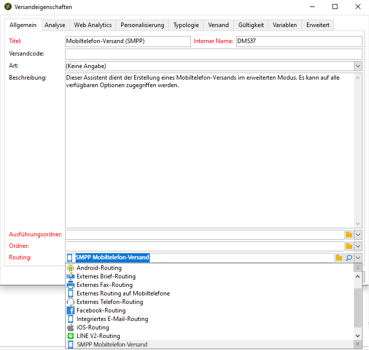
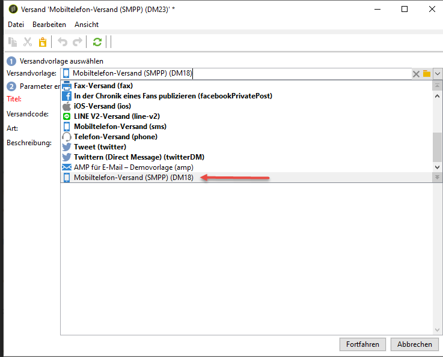

# SMS-Kanal{#sms-channel}

Adobe Campaign ermöglicht die Zustellung großer Mengen personalisierter SMS-Nachrichten. Die Empfängerprofile müssen mindestens eine Mobiltelefonnummer enthalten.

>[!NOTE]
>
>Die Option **Mobile App Channel (NMAC)** ermöglicht darüber hinaus den Empfang von Benachrichtigungen auf mobilen Terminals.
> 
>For more on this, refer to the [About mobile app channel](../../delivery/using/about-mobile-app-channel.md) section.

Die folgenden Abschnitte enthalten Informationen, die speziell für den SMS-Kanal gelten. Globale Informationen zum Erstellen einer Bereitstellung finden Sie in[diesem Abschnitt](../../delivery/using/steps-about-delivery-creation-steps.md).

## SMS-Kanal einrichten {#setting-up-sms-channel}

Folgende Voraussetzungen müssen gegeben sein, um Sendungen an Mobiltelefone richten zu können:

1. ein externes Konto mit Angabe des Connectors und des Nachrichtentyps;

   Die verfügbaren Connectoren sind NetSize, allgemeines SMPP (SMPP Version 3.4 mit Binärmodus-Unterstützung), Sybase365 (SAP SMS 365), CLX Communications, Tele2, O2 und erweitertes allgemeines SMPP.

1. eine Versandvorlage, die auf das externe Konto Bezug nimmt.

### Aktivierung eines externen Kontos {#activating-an-external-account}

The list of external accounts can be found in the **[!UICONTROL Platform]** > **[!UICONTROL External accounts]** node of the Adobe Campaign explorer tree.

* Gehen Sie beispielsweise zum Standardkonto namens **[!UICONTROL NetSize mobile delivery]**.
* Markieren Sie auf der **[!UICONTROL General]** Registerkarte das **[!UICONTROL Enabled]** Kontrollkästchen.

   

* Check that the **[!UICONTROL Mobile]** option is selected for the **[!UICONTROL Channel]** field.
* Wählen Sie auf der **[!UICONTROL Mobile]** Registerkarte einen Connector aus der Dropdownliste aus: NetSize, Generic SMPP, Sybase365 (SAP SMS 365), CLX Communications, Tele2, O2 oder Extended allgemeine SMPP. Weitere Informationen zum erweiterten allgemeinen SMPP-Connector finden Sie im Abschnitt [Erstellen eines externen SMPP-Kontos](#creating-an-smpp-external-account) .

   

* Konfigurieren Sie den Connector mit den von Ihrem Provider angegebenen Informationen. Im unten stehenden Beispiel handelt es sich bei dem Provider um NetSize.

   

* Lassen Sie auf der **[!UICONTROL Connector]** Registerkarte den **[!UICONTROL Call Web Service]** Aktivierungsmodus standardmäßig aktiviert.

   

* Wenn die **[!UICONTROL Connector]** Registerkarte angezeigt wird, geben Sie die Zugriffs-URL für den Connector an. Die Adresse muss in **netsize.jsp** enden, wenn Ihr Provider NetSize ist. Bei allen anderen Connectors endet die URL-Adresse in **smpp34.jsp**.

### Erstellen eines externen SMPP-Kontos {#creating-an-smpp-external-account}

Wenn Sie das SMPP-Protokoll verwenden möchten, können Sie auch ein neues externes Konto erstellen.

Weitere Informationen zum SMS-Protokoll und zu den Einstellungen finden Sie in dieser [Technote](https://helpx.adobe.com/campaign/kb/sms-connector-protocol-and-settings.html).

Gehen Sie dazu wie folgt vor:

1. Klicken Sie im Knoten **[!UICONTROL Platform]** > **[!UICONTROL External accounts]** des Baums auf das **[!UICONTROL New]** Symbol.
1. Definieren Sie den Kontotyp mit **Routing**, den Kanal mit **Mobiltelefon (SMS)** und den Versandmodus mit **Gebündelter Versand**.

   

1. Markieren Sie das **[!UICONTROL Enabled]** Kästchen.
1. Wählen Sie auf der **[!UICONTROL Mobile]** Registerkarte **[!UICONTROL Extended generic SMPP]** aus der **[!UICONTROL Connector]** Dropdownliste aus.

   

   Mit dieser **[!UICONTROL Enable verbose SMPP traces in the log file]** Option können Sie den gesamten SMPP-Traffic in Protokolldateien ablegen. Diese Option muss aktiviert sein, um eine Fehlerbehebung beim Connector vornehmen und den Traffic mit dem auf Provider-Seite verzeichneten Traffic vergleichen zu können.

1. Contact your SMS service provider who will explain to you how to complete the different external account fields from the **[!UICONTROL Connection settings]** tab.

   Then, contact your provider, depending on the one chosen, who will give you the value to enter into the **[!UICONTROL SMSC implementation name]** field.

   Sie können die Anzahl der Verbindungen mit dem Dienstleister per untergeordnetem MTA definieren. Standardmäßig ist 1 eingestellt.

1. Standardmäßig kommt in Bezug auf die maximal zulässige Zeichenanzahl einer SMS der Mobilfunkstandard GSM zur Anwendung.

   SMS, die das GSM-Alphabet verwenden, sind auf 160 Zeichen begrenzt oder auf 153 Zeichen pro SMS bei Nachrichten, die in mehreren Teilen gesendet werden.

   >[!NOTE]
   >
   >Gewisse Zeichen zählen doppelt (Akkoladen, eckige Klammern, Eurozeichen etc.).
   >
   >Eine Liste der von GSM unterstützten Zeichen finden Sie unten.

   Bei Bedarf können Sie die Transliteration von Zeichen zulassen, indem Sie die entsprechende Option aktivieren.

   

   Weiterführende Informationen hierzu finden Sie in [diesem Abschnitt](#about-character-transliteration).

1. In the **[!UICONTROL Throughput and delays]** tab, you can specify the maximum throughput of outbound messages (&quot;MT&quot;, Mobile Terminated) in MT per second. Bei Angabe von &quot;0&quot; im entsprechenden Feld ist der Durchsatz unbegrenzt.

   Werte, die eine Dauer angeben, sind in Sekunden auszudrücken.

1. Auf der **[!UICONTROL Mapping of encodings]** Registerkarte können Sie Kodierungen definieren.

   Weiterführende Informationen hierzu finden Sie in [diesem Abschnitt](#about-text-encodings).

1. Auf der **[!UICONTROL SMSC specificities]** Registerkarte ist die **[!UICONTROL Send full phone number]** Option standardmäßig deaktiviert. Aktivieren Sie sie nicht, wenn Sie das SMPP-Protokoll beachten und nur Ziffern auf den Server des SMS-Providers (SMSC) übertragen möchten.

   Bei gewissen Anbietern ist die Verwendung des Vorzeichens &#39;+&#39; jedoch erforderlich, sodass es ratsam ist, mit Ihrem Anbieter Kontakt aufzunehmen, der Sie bei Bedarf dazu auffordern wird, diese Option zu aktivieren.

   Mit dem **[!UICONTROL Enable TLS over SMPP]** Kontrollkästchen können Sie SMPP-Traffic verschlüsseln. For more on this, refer to this [technical note](https://helpx.adobe.com/campaign/kb/sms-connector-protocol-and-settings.html).

1. If you are configuring an **[!UICONTROL Extended generic SMPP]** connector, you can set up automatic replies.

   Weiterführende Informationen hierzu finden Sie in [diesem Abschnitt](#automatic-reply).

### Über die Transliteration von Zeichen {#about-character-transliteration}

Die Transliteration von Zeichen kann in einem externen Konto für den SMPP-Mobiltelefon-Versand im Tab **[!UICONTROL Mobile]** eingerichtet werden.

Transliteration bezeichnet in einer SMS die Ersetzung eines Zeichens durch ein anderes, wenn das erste Zeichen nicht von GSM unterstützt wird.

* If transliteration is **[!UICONTROL authorized]**, each character that is not taken into account is replaced by a GSM character when the message is sent. So wird beispielsweise der Buchstabe &quot;ë&quot; durch &quot;e&quot; ersetzt. Der Nachrichteninhalt wird in diesem Fall leicht verändert übermittelt, aber die Zeichenanzahl bleibt identisch.
* When transliteration is **[!UICONTROL not authorized]**, each message that contains characters that are not taken into account is sent in binary format (Unicode): all of the characters are therefore sent as they are. In Unicode kodierte SMS sind auf 70 Zeichen (oder 67 Zeichen bei Nachrichten, die in mehreren Teilen gesendet werden) begrenzt. Bei Überschreitung der maximalen Zeichenanzahl werden mehrere Teilnachrichten gesendet, wodurch zusätzliche Kosten entstehen können.

>[!CAUTION]
>
>Die Verwendung von Personalisierungsfeldern im SMS-Inhalt führt u. U. dazu, dass nicht von GSM unterstützte Zeichen eingefügt werden.

Die Transliteration von Zeichen ist standardmäßig deaktiviert. Es wird empfohlen, diese Option nicht zu aktivieren, wenn Sie alle Zeichen Ihrer SMS beibehalten möchten, um beispielsweise Eigennamen unverändert zu übermitteln.

Sollte Ihre SMS jedoch eine hohe Anzahl an Zeichen enthalten, die dem Unicode-Zeichensatz entstammen, können Sie diese Option wählen, um Ihre Versandkosten zu begrenzen.

Die folgende Tabelle zeigt den vom GSM-Standard unterstützten Zeichensatz. Jedes im Nachrichteninhalt enthaltene Zeichen, das nicht in der unten stehenden Tabelle aufgeführt ist, führt zur Konvertierung der gesamten Nachricht in das Binärformat (Unicode), sobald sie 70 Zeichen überschreitet.

**Einfache Zeichen**

<table> 
 <tbody> 
  <tr> 
   <td> @ </td> 
   <td>  </td> 
   <td> SP </td> 
   <td> 0 </td> 
   <td> ¡ </td> 
   <td> P </td> 
   <td> ¿ </td> 
   <td> p </td> 
  </tr> 
  <tr> 
   <td> £ </td> 
   <td> _ </td> 
   <td> ! </td> 
   <td> 1 </td> 
   <td> A </td> 
   <td> Q </td> 
   <td> a </td> 
   <td> q </td> 
  </tr> 
  <tr> 
   <td> $ </td> 
   <td>  </td> 
   <td> " </td> 
   <td> 2 </td> 
   <td> B </td> 
   <td> R </td> 
   <td> b </td> 
   <td> r </td> 
  </tr> 
  <tr> 
   <td> ¥ </td> 
   <td>  </td> 
   <td> # </td> 
   <td> 3 </td> 
   <td> C </td> 
   <td> S </td> 
   <td> c </td> 
   <td> s </td> 
  </tr> 
  <tr> 
   <td> è </td> 
   <td>  </td> 
   <td> ¤ </td> 
   <td> 4 </td> 
   <td> D </td> 
   <td> T </td> 
   <td> d </td> 
   <td> t </td> 
  </tr> 
  <tr> 
   <td> é </td> 
   <td>  </td> 
   <td> % </td> 
   <td> 5 </td> 
   <td> E </td> 
   <td> U </td> 
   <td> e </td> 
   <td> u </td> 
  </tr> 
  <tr> 
   <td> ù </td> 
   <td>  </td> 
   <td> &amp; </td> 
   <td> 6 </td> 
   <td> F </td> 
   <td> V </td> 
   <td> f </td> 
   <td> v </td> 
  </tr> 
  <tr> 
   <td> ì </td> 
   <td>  </td> 
   <td> ' </td> 
   <td> 7 </td> 
   <td> G </td> 
   <td> W </td> 
   <td> g </td> 
   <td> w </td> 
  </tr> 
  <tr> 
   <td> ò </td> 
   <td>  </td> 
   <td> ( </td> 
   <td> 8 </td> 
   <td> H </td> 
   <td> X </td> 
   <td> h </td> 
   <td> x </td> 
  </tr> 
  <tr> 
   <td> Ç </td> 
   <td>  </td> 
   <td> ) </td> 
   <td> 9 </td> 
   <td> I </td> 
   <td> Y </td> 
   <td> i </td> 
   <td> y </td> 
  </tr> 
  <tr> 
   <td> LF </td> 
   <td>  </td> 
   <td> * </td> 
   <td> : </td> 
   <td> J </td> 
   <td> Z </td> 
   <td> j </td> 
   <td> z </td> 
  </tr> 
  <tr> 
   <td> Ø </td> 
   <td> ESC </td> 
   <td> + </td> 
   <td> ; </td> 
   <td> K </td> 
   <td> Ä </td> 
   <td> k </td> 
   <td> ä </td> 
  </tr> 
  <tr> 
   <td> ø </td> 
   <td> Æ </td> 
   <td> , </td> 
   <td> &lt; </td> 
   <td> L </td> 
   <td> Ö </td> 
   <td> l </td> 
   <td> ö </td> 
  </tr> 
  <tr> 
   <td> CR </td> 
   <td> æ </td> 
   <td> - </td> 
   <td> = </td> 
   <td> M </td> 
   <td> Ñ </td> 
   <td> m </td> 
   <td> ñ </td> 
  </tr> 
  <tr> 
   <td> Å </td> 
   <td> ß </td> 
   <td>  . </td> 
   <td> &gt; </td> 
   <td> N </td> 
   <td> Ü </td> 
   <td> n </td> 
   <td> ü </td> 
  </tr> 
  <tr> 
   <td> å </td> 
   <td> É </td> 
   <td> / </td> 
   <td> ? </td> 
   <td> O </td> 
   <td> § </td> 
   <td> o </td> 
   <td> à </td> 
  </tr> 
 </tbody> 
</table>

SP: Leerzeichen

ESC: Escape

LF: Zeilenvorschub

CR: Wagenrücklauf

**Doppelt zählende Zeichen**

^ { } `[ ~ ]` | €

### Über Textkodierungen {#about-text-encodings}

Beim SMS-Versand kann Adobe Campaign eine oder mehrere Textkodierungen verwenden. Je nach Kodierung kommen unterschiedliche Zeichensätze zur Anwendung und variiert die Anzahl an zulässigen Zeichen pro SMS.

When configuring a new SMPP mobile delivery external account, you can define the **[!UICONTROL Mapping of encodings]** in the **[!UICONTROL Mobile]** tab: the **[!UICONTROL data_coding]** field allows Adobe Campaign to communicate which encoding is used to the SMSC.

>[!NOTE]
>
>Das Mapping zwischen dem Wert des **data_coding**-Felds und der tatsächlich verwendeten Kodierung ist standardisiert. Gewisse SMSC besitzen jedoch ihr eigenes Mapping. In diesem Fall muss Ihr **Adobe-Campaign**-Administrator das Mapping deklarieren. Kontaktieren Sie für weiterführende Informationen Ihren Anbieter.

Sie können **data_codings** deklarieren. Durch Angabe von nur einer Kodierung in der Tabelle wird die Anwendung dieser Kodierung erzwungen.

* Wenn kein Kodierungs-Mapping definiert wurde, verhält sich der Connector standardmäßig:

   * Er versucht, das GSM-Alphabet zu verwenden und ordnet diesem den Wert **DATA_CODING = 0** zu.
   * Falls die Verwendung des GSM-Alphabets nicht möglich ist, verwendet er **UCS2** und ordnet den Wert **DATA_CODING = 8** zu.

* Wenn Sie die zu verwendenden Kodierungen sowie die damit verbundenen **[!UICONTROL data_coding]**-Feldwerte definieren, verwendet Adobe Campaign die Kodierungen in der Reihenfolge ihres Erscheinens in der Liste. Wenn die Verwendung der ersten Kodierung nicht möglich ist, wird die zweite verwendet, usw.

>[!CAUTION]
>
>Die Reihenfolge der Deklarierung ist entscheidend. Wir empfehlen Ihnen, die Liste aufsteigend nach den entstehenden **Kosten** zu ordnen, um die Kodierungen zu favorisieren, die eine größere Anzahl von Zeichen pro SMS erlauben.
>
>Deklarieren Sie nur die Kodierungen, die Sie tatsächlich verwenden möchten. Deklarieren Sie hingegen keine vom SMSC angebotenen Kodierungen in der Liste, die nicht Ihrer Verwendung entsprechen.

### Automatische Antwort {#automatic-reply}

Wenn Sie einen Connector vom Typ Erweitertes allgemeines SMPP konfigurieren, können Sie automatische Antworten einrichten.

When a subscriber replies to an SMS message which was sent to them via Adobe Campaign and their message contains a keyword such as &quot;STOP&quot;, you can configure messages which are automatically sent back to them in the **[!UICONTROL Automatic reply sent to the MO]** section.

>[!NOTE]
>
>Bei den Schlüsselwörtern kann die Groß-/Kleinschreibung ignoriert werden.

Geben Sie für jedes Schlüsselwort eine Kurzwahlnummer (short code) an, d. h. eine als Absendername fungierende Nummer, die gewöhnlich für den Nachrichtenversand verwendet wird, sowie die an den Abonnenten zu sendende Nachricht.

Sie können eine Aktion auch mit Ihrer automatischen Antwort verknüpfen: **[!UICONTROL Send to quarantine]** oder **[!UICONTROL Remove from quarantine]**. Wenn ein Empfänger beispielsweise den Suchbegriff &quot;STOP&quot;sendet, erhält er automatisch eine Abonnementbestätigung und wird in Quarantäne gestellt.


If you link the **[!UICONTROL Remove from quarantine]** action to an automatic response, the recipients sending the corresponding keyword are automatically removed from quarantine.

Die Empfänger werden in der **[!UICONTROL Non deliverables and addresses]** Tabelle aufgelistet, die über das Menü **[!UICONTROL Administration]** > **[!UICONTROL Campaign Management]** > **[!UICONTROL Non deliverables Management]** angezeigt wird.

* To send the same reply no matter what the short code, leave the **[!UICONTROL Short code]** column empty.
* To send the same reply no matter what the keyword, leave the **[!UICONTROL Keyword]** column empty.
* To carry out an action without sending a response, leave the **[!UICONTROL Response]** column empty. So können Sie beispielsweise Benutzer, die mit einer anderen Meldung als &quot;STOP&quot;antworten, aus der Quarantäne entfernen.

Wenn Sie mehrere externe Konten mit dem erweiterten generischen SMPP-Connector mit demselben Provider-Konto haben, kann das folgende Problem auftreten: Wenn Sie eine Antwort an einen Kurzcode senden, kann sie auf einer Ihrer externen Kontoverbindungen empfangen werden. Daher könnte die automatische Antwort, die gesendet wird, nicht die erwartete Nachricht sein.
Um dies zu vermeiden, wenden Sie je nach verwendetem Anbieter eine der folgenden Lösungen an:
* Erstellen Sie für jedes externe Konto ein Anbieterkonto.
* Verwenden Sie das **[!UICONTROL System type]** Feld auf der Registerkarte **[!UICONTROL Mobile]** > **[!UICONTROL Connection settings]** , um jeden Kurzcode zu unterscheiden. Bitten Sie Ihren Anbieter um einen anderen Wert für jedes Konto.

   

Die Schritte zum Einrichten eines externen Kontos mithilfe des erweiterten generischen SMPP-Connectors sind im Abschnitt [Erstellen eines externen SMPP-Kontos](../../delivery/using/sms-channel.md#creating-an-smpp-external-account) beschrieben.

### Versandvorlagen ändern {#changing-the-delivery-template}

Adobe Campaign stellt Ihnen eine Vorlage zur Bereitstellung auf Mobilgeräten zur Verfügung. Diese Vorlage ist im **[!UICONTROL Resources > Templates > Delivery templates]** Knoten verfügbar. Weiterführende Informationen finden Sie im Abschnitt [Über Vorlagen](../../delivery/using/about-templates.md).

Um den SMS-Kanal zu nutzen, muss in der Versandvorlage der entsprechende Connector angegeben werden.

Wir empfehlen Ihnen, nicht die native Versandvorlage zu ändern, sondern diese zu duplizieren und die Kopie nach Bedarf zu konfigurieren.

Im folgenden Beispiel wird eine Vorlage erstellt, die dem Versand von Nachrichten mithilfe des zuvor aktivierten NetSize-Kontos dient. Gehen Sie dazu wie folgt vor:

1. Wechseln Sie zum **[!UICONTROL Delivery templates]** Knoten.
1. Klicken Sie mit der rechten Maustaste auf die **[!UICONTROL Send to mobiles]** Vorlage und wählen Sie **[!UICONTROL Duplicate]**.

   

1. Ändern Sie den Vorlagentitel.

   

1. Klicks **[!UICONTROL Properties]**.
1. In the **[!UICONTROL General]** tab, select a routing mode that corresponds to an external account that you configured, for example **[!UICONTROL NetSize mobile delivery]**.

   

1. Click **[!UICONTROL Save]** to create the template.

   

Sie verfügen nun über ein externes Konto und eine Versandvorlage, die es Ihnen erlauben, per SMS zu versenden.

## SMS-Versand erstellen {#creating-a-sms-delivery}

### Versandkanal auswählen {#selecting-the-delivery-channel}

Gehen Sie wie folgt vor, um einen neuen SMS-Versand zu erstellen:

>[!NOTE]
>
>Allgemeine Methoden zur Versanderstellung finden Sie in [diesem Abschnitt](../../delivery/using/steps-about-delivery-creation-steps.md).

1. Erstellen Sie einen neuen Versand beispielsweise im Versand-Dashboard.
1. Wählen Sie die zuvor erstellte Bereitstellungsvorlage **[!UICONTROL Send to mobiles (NetSize)]** aus. For more on this, refer to the [Changing the delivery template](#changing-the-delivery-template) section.

   

1. Geben Sie für Ihren Versand einen Titel, einen Code und eine Beschreibung ein. Weiterführende Informationen dazu finden Sie in [diesem Abschnitt](../../delivery/using/steps-create-and-identify-the-delivery.md#identifying-the-delivery).
1. Click **[!UICONTROL Continue]** to confirm this information and display the message configuration window.

## SMS-Inhalt erstellen {#defining-the-sms-content}

Um den Inhalt der SMS zu erstellen, gehen Sie wie folgt vor:

1. Geben Sie den Inhalt der Nachricht im **[!UICONTROL Text content]** Abschnitt des Assistenten ein. Mit den Symbolleistenschaltflächen können Sie Inhalte importieren, speichern oder suchen. Die letzte Schaltfläche wird zum Einfügen von Personalisierungsfeldern verwendet.

   

   The use of personalization fields is presented in the [About personalization](../../delivery/using/about-personalization.md) section.

1. Klicken Sie **[!UICONTROL Preview]** unten auf der Seite, um die Wiedergabe der Nachricht mit ihrer Personalisierung anzuzeigen. Um die Vorschau zu starten, wählen Sie einen Empfänger über die **[!UICONTROL Test personalization]** Schaltfläche in der Symbolleiste aus. Sie können einen Empfänger aus den definierten Zielen auswählen oder einen anderen Empfänger auswählen.

   

   Sie können nun den personalisierten Nachrichteninhalt sowie die Anzeige der SMS auf dem rechts im Bild angezeigten Mobiltelefondisplay prüfen. Klicken Sie auf das Display, um die Nachricht mit der Maus zu scrollen.

   

1. Click the **[!UICONTROL Data loaded]** link to view the information concerning the recipient.

   

   >[!NOTE]
   >
   >SMS-Nachrichten sind auf eine Länge von 160 Zeichen begrenzt, wenn die Code-Seite Latin-1 (ISO-8859-1) verwendet wird. Wenn die Nachricht in Unicode geschrieben ist, darf sie nicht länger als 70 Zeichen sein. Bestimmte Sonderzeichen können sich auf die Länge der Nachricht auswirken. Weitere Informationen zur Meldungslänge finden Sie im Abschnitt [Grundlagen zur Zeichentransliteration](#about-character-transliteration) .
   >
   >Wenn die Nachricht Personalisierungsfelder oder bedingte Inhalte enthält, kann die Länge von Empfänger zu Empfänger variieren. Daher sollte die Länge jeweils nach erfolgter Personalisierung geprüft werden.
   >
   >Während der Analysephase wird die Nachrichtenlänge geprüft und im Falle eines Überschreitens ein Warnhinweis erzeugt.

1. Wenn Sie den NetSize-Connector oder einen SMPP-Connector verwenden, können Sie den Namen des Absenders personalisieren. For more on this, refer to the [Advanced parameters](#advanced-parameters) section.

## Zielgruppe bestimmen {#selecting-the-target-population}

Die detaillierten Schritte zur Auswahl der Zielpopulation eines Versands finden Sie in [diesem Abschnitt](../../delivery/using/steps-defining-the-target-population.md).

For more on the use of personalization fields, refer to [About personalization](../../delivery/using/about-personalization.md).

For more on the inclusion of a seed list, refer to [About seed addresses](../../delivery/using/about-seed-addresses.md).

## SMS-Nachrichten senden {#sending-sms-messages}

To approve your message and send it to the recipients of the delivery being created, click **[!UICONTROL Send]**.

Die detaillierten Schritte zur Validierung und zum Versand von Nachrichten finden Sie in den folgenden Abschnitten:

* [Versand validieren](../../delivery/using/steps-validating-the-delivery.md)
* [Versenden der Nachrichten](../../delivery/using/steps-sending-the-delivery.md)

### Erweiterte Parameter {#advanced-parameters}

Über die **[!UICONTROL Properties]** Schaltfläche haben Sie Zugriff auf den erweiterten Auslieferungsparameter. Die Parameter für SMS-Auslieferungen finden Sie im **[!UICONTROL SMS parameters]** Abschnitt der **[!UICONTROL Delivery]** Registerkarte.

Folgende Optionen stehen zur Verfügung:

* **Absender** (nur bei NetSize- und SMPP-Connectoren): ermöglicht die Personalisierung des Absendernamens eines Versands mit einer alphanumerischen Zeichenkette von maximal 11 Zeichen. Das Feld darf nicht nur Ziffern enthalten. Es besteht die Möglichkeit, eine Bedingung zu erstellen, die beispielsweise in Abhängigkeit von der Ländervorwahl des Empfängers unterschiedliche Absender anzeigt:

   ```
   <% if( String(recipient.mobilePhone).indexOf("+1") == 0){ %>NeoShopUS<%} else %>
   ```

   >[!CAUTION]
   >
   >Überprüfen Sie die gültige Rechtslage Ihres Landes bezüglich der Änderung des Absendernamens. Stellen Sie außerdem sicher, dass Ihr Provider diese Funktionalität anbietet.

* **Übermittlungsmodus**: Art der SMS-Übermittlung.
* **Priorität**: einer Nachricht zugewiesene Wichtigkeitsstufe. Die **[!UICONTROL Normal]** Priorität ist standardmäßig ausgewählt. Fragen Sie Ihren Service Provider nach den Kosten für SMS mit **[!UICONTROL High]** Priorität.
* **Art der Anwendung**: Wählen Sie die Anwendung, die Sie Ihrer SMS-Zustellung zuweisen möchten. Die **[!UICONTROL Direct Marketing]** Option ist standardmäßig ausgewählt und die am häufigsten verwendete Option.

**Den NetSize-Connector betreffende Parameter**


* **Nachricht in mehreren SMS versenden**: ermöglicht den Versand von Nachrichten mit mehr als 160 Zeichen in mehreren SMS.

**SMPP-Connectoren betreffende Parameter**


* **Maximale Anzahl an SMS pro Nachricht**: ermöglicht die Angabe der maximalen SMS-Anzahl pro Nachricht, wobei 0 für eine SMS steht. Wenn die Nachricht mehr als die angegebene Anzahl an SMS benötigt, wird sie nicht gesendet.

## SMS-Sendungen beobachten und verfolgen {#monitoring-and-tracking-sms-deliveries}

Nach Absenden der Nachrichten können Sie den Versand beobachten und verfolgen, siehe diese Abschnitte:

* [Sendungen beobachten](../../delivery/using/monitoring-a-delivery.md)
* [Ursachen von fehlgeschlagenen Sendungen](../../delivery/using/understanding-delivery-failures.md)
* [Über das Nachrichten-Tracking](../../delivery/using/about-message-tracking.md)

## Verarbeitung eingehender Nachrichten {#processing-inbound-messages}

Das Modul **nlserver sms** ruft in regelmäßigen Abständen den Verarbeitungsfortschritt der Sendungen, Empfangsbestätigungen und Empfängerabmeldungen ab.

* **Empfangsbestätigungen**: Der Status Ihrer Sendungen kann in den Versandlogs eingesehen werden.

   >[!NOTE]
   >
   >Jede gesendete SMS ist mit einem externen Konto über den Primärschlüssel des letzteren verbunden. Dies bedeutet, dass
   >
   > * Empfangsbestätigungen eines externen Kontos für gelöschte SMS nicht korrekt verarbeitet werden können.
   > * ein SMS-Konto nur mit einem externen Konto verknüpft sein darf, damit die Empfangsbestätigungen korrekt zugeordnet werden können


* **Abmeldungen**: Empfänger, die keine SMS-Sendungen mehr erhalten möchten, können sich durch das Senden einer Nachricht mit Inhalt STOP abmelden. Wenn es Ihr Providervertrag vorsieht, können Sie diese Nachrichten mithilfe der Workflow-Aktivität **SMS-Empfang** abrufen. Dies ermöglicht die Erstellung einer Abfrage, die die Option **Diese Person nicht mehr kontaktieren** für die entsprechenden Empfänger aktiviert.

   Nähere Informationen hierzu finden Sie im [Workflows](../../workflow/using/executing-a-workflow.md#architecture)-Handbuch.

## InSMS-Schema {#insms-schema}

Das InSMS-Schema enthält Informationen zu eingehenden SMS. Die Beschreibung dieser Felder findet sich in ihren jeweiligen desc-Attributen.

* **message**: Inhalt der erhaltenen SMS.
* **origin**: Mobiltelefonnummer des Nachrichtenabsenders.
* **providerId**: Kennung der vom SMS-SC (Short Message Service Centre) zurückgegebenen Nachricht.
* **created**: Eingangsdatum der Nachricht in Adobe Campaign.
* **extAccount**: externes Adobe-Campaign-Konto.

   >[!CAUTION]
   >
   >Die folgenden Felder sind NetSize-spezifisch.
   >
   >Wenn der Betreiber nicht NetSize verwendet, bleiben diese Felder leer.

* **alias**: Alias der eingehenden Nachricht.
* **separator**: Trennzeichen zwischen Alias und Nachrichten-Textkörper.
* **messageDate**: Nachrichtendatum gemäß Betreiber.
* **receivalDate**: Datum des Empfangs der vom Betreiber gesendeten Nachricht im SMS-SC (Short Message Service Centre).
* **deliveryDate**: Datum des Versands der Nachricht durch das SMS-SC (Short Message Service Centre).
* **largeAccount**: Code des der eingehenden SMS zugeordneten Kundenkontos.
* **countryCode**: Ländercode des Betreibers.
* **operatorCode**: Netzwerkcode des Betreiber.
* **linkedSmsId**: Adobe-Campaign-Kennung (broadlogId) der ausgehenden SMS, auf die diese SMS antwortet.

## Automatische Antworten (US-amerikanische Gesetzgebung) {#managing-automatic-replies--american-regulation-}

Wenn ein Abonnent auf eine durch Adobe Campaign versendete SMS mit einer die Schlüsselwörter STOP, HELP oder YES enthaltenden Nachricht antwortet, ist für den US-amerikanischen Markt eine Konfiguration der automatischen Benachrichtigungen an den Absender gesetzlich vorgeschrieben.

Wenn beispielsweise das Wort STOP gesendet wird, erhält der Abonnent automatisch eine Abmelde-Bestätigung.

Der Absendername für diese Art von Nachrichten besteht aus einer kurzen Nummer (short code), welche auch für die üblichen Sendungen genutzt wird.

>[!CAUTION]
>
>Das folgende detaillierte Verfahren gilt nur für SMPP-Anschlüsse, mit Ausnahme des erweiterten generischen SMPP-Connectors. Weitere Informationen finden Sie im Abschnitt [Erstellen eines externen SMPP-Kontos](#creating-an-smpp-external-account) .
>
>Sie betrifft die Zertifizierung durch amerikanische Provider bezüglich in den USA zu versendender Marketingkampagnen. Insbesondere müssen diese SMS dem Abonnenten, der ein entsprechendes Schlüsselwort gesendet hat, unverzüglich zugestellt werden.

1. Erstellen Sie eine XML-Datei nach folgendem Muster:

   ```
   <autoreply>
     <shortcode name="12345">
       <reply keyword="STOP" text="You will not receive SMS anymore" />
       <reply keyword="HELP" text="Powered by Adobe Campaign" />
     </shortcode>
     <shortcode name="43115">
       <reply keyword="STOP" text="Vous ne recevrez plus de SMS" />
       <reply keyword="HELP" text="Service rendu par Adobe Campaign" />
     </shortcode>
     <shortcode name="*">
       <reply keyword="ADOBE" text="This text is replied when you send ADOBE to any short code" />
     </shortcode>
   </autoreply>
   ```

1. For the **name** attribute of the **`<shortcode>`** tag, specify the short code that will be displayed in the place of the message sender name.

   In each **`<reply>`** tag, enter the **keyword** attribute with a keyword and the **text** attribute with the message that you would like to send for this keyword.

   >[!NOTE]
   >
   >Schlüsselwörter sind in Großbuchstaben zu schreiben.

   Wenn Sie für verschiedene Schlüsselwörter dieselbe Nachricht versenden möchten, können Sie die entsprechende Zeile duplizieren.

   Beispiel:

   ```
   <reply keyword="STOP" text="You will not receive SMS anymore" />
   <reply keyword="QUIT" text="You will not receive SMS anymore" />
   ```

1. Speichern Sie dann die Datei unter dem Namen **smsAutoReply.xml**.

   Bitte berücksichtigen Sie, dass beim Dateinamen unter Linux die Groß- und Kleinschreibung zu beachten ist.

1. Kopieren Sie die Datei in das **conf**-Verzeichnis in Adobe Campaign (am gleichen Ort wie der Web-Server).

>[!CAUTION]
>
>Für diese Arten von Benachrichtigungen wird kein Verlauf erstellt. Sie sind also nicht im [Versand-Dashboard](../../delivery/using/monitoring-a-delivery.md#delivery-dashboard) enthalten.
>
>Sie werden des Weiteren nicht bei der Berechnung des [Werbedrucks](../../campaign/using/pressure-rules.md) berücksichtigt.
