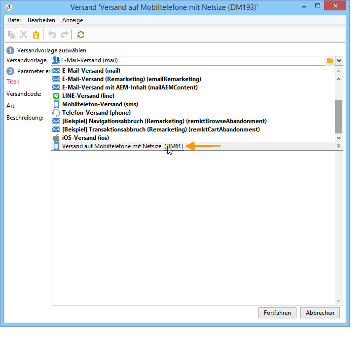
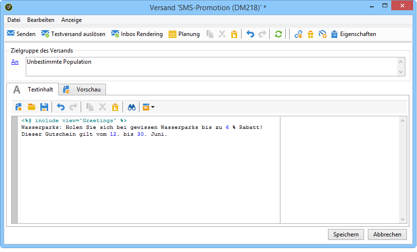
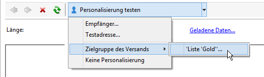
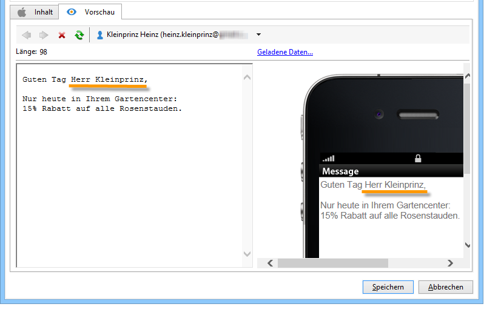
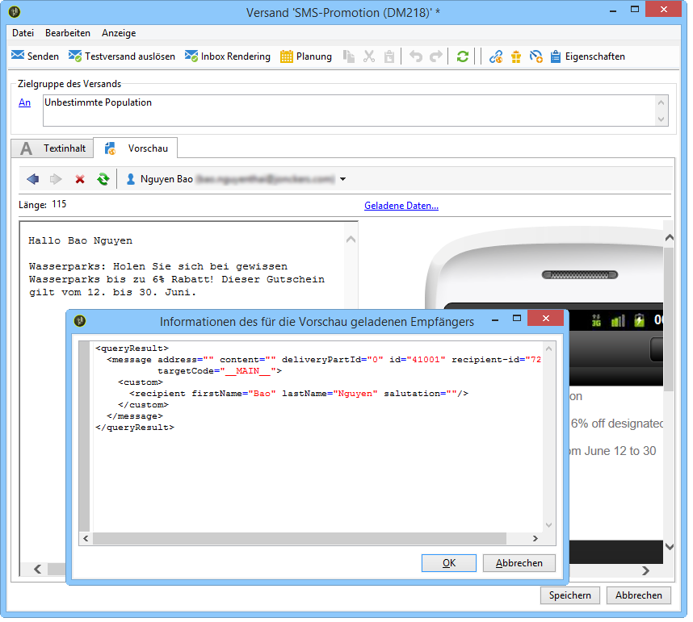

# Erstellen eines SMS-Versands {#creating-a-sms-delivery}

## Versandkanal auswählen {#selecting-the-delivery-channel}

Gehen Sie wie folgt vor, um einen neuen SMS-Versand zu erstellen:

>[!NOTE]
>
>Allgemeine Methoden zur Versanderstellung finden Sie in der [Dokumentation zu Campaign v8](https://experienceleague.adobe.com/docs/campaign/campaign-v8/send/create-message.html?lang=de){target="_blank"}.

1. Erstellen Sie einen neuen Versand, beispielsweise im Versand-Dashboard.
1. Wählen Sie die zuvor erstellte Versandvorlage **Mobiltelefon-Versand (SMPP)** aus. Lesen Sie diesbezüglich auch den Abschnitt [Versandvorlage ändern](sms-set-up.md#changing-the-delivery-template).

   

1. Geben Sie einen Titel, einen Code und eine Beschreibung für Ihren Versand ein. Weitere Informationen finden Sie in diesem Abschnitt der [Dokumentation zu Campaign v8](https://experienceleague.adobe.com/docs/campaign/campaign-v8/send/create-message.html?lang=de#create-the-delivery){target="_blank"}.
1. Klicken Sie auf **[!UICONTROL Fortfahren]**, um die Eingaben zu bestätigen und in das Fenster zur Nachrichtenkonfiguration zu gelangen.

## SMS-Inhalt erstellen {#defining-the-sms-content}

Um den Inhalt der SMS zu erstellen, gehen Sie wie folgt vor:

1. Geben Sie den Nachrichteninhalt im Bereich **[!UICONTROL Textinhalt]** des Assistenten ein. Mit den Schaltflächen der Symbolleiste können Sie Inhalte importieren, speichern oder suchen. Die letzte Schaltfläche in der Symbolleiste dient der Einfügung von Personalisierungsfeldern.

   

   Die Verwendung von Personalisierungsfeldern wird im Abschnitt [Über die Personalisierung](about-personalization.md) beschrieben.

1. Durch Auswahl der Registerkarte **[!UICONTROL Vorschau]** unten auf der Seite können Sie das Rendering der personalisierten Nachricht prüfen. Um die Vorschau zu starten, wählen Sie eine Empfängerin bzw. einen Empfänger mithilfe der Schaltfläche **[!UICONTROL Personalisierung testen]** in der Symbolleiste. Wählen Sie eine Empfängerin bzw. einen Empfänger aus der Zielgruppe oder ein anderes Profil aus.

   

   Sie können die SMS-Nachricht genehmigen. Sie können den Inhalt der SMS auch auf dem Mobiltelefonbildschirm anzeigen, der rechts neben dem Inhaltseditor angezeigt wird. Klicken Sie auf den Bildschirm und verwenden Sie die Maus, um durch den Inhalt zu scrollen.

   

1. Der Link **[!UICONTROL Geladene Daten]** ermöglicht die auszugsweise Anzeige des Empfängerprofils.

   

   >[!NOTE]
   >
   >SMS-Nachrichten sind auf eine Länge von 160 Zeichen beschränkt, wenn die Code-Seite Latin-1 (ISO-8859-1) verwendet wird. Wenn die Nachricht in Unicode geschrieben ist, darf sie 70 Zeichen nicht überschreiten. Bestimmte Sonderzeichen können sich auf die Nachrichtenlänge auswirken. Weitere Informationen zur Nachrichtenlänge finden Sie im Abschnitt [Transliteration von SMS-Zeichen](#about-character-transliteration).
   >
   >Wenn Personalisierungsfelder oder bedingte Inhaltsfelder vorhanden sind, variiert die Größe der Nachricht von einem Empfänger zum anderen. Die Länge der Nachricht muss nach der Personalisierung ausgewertet werden.
   >
   >Während der Analysephase wird die Nachrichtenlänge geprüft und im Falle eines Überschreitens ein Warnhinweis erzeugt.

1. Wenn Sie den NetSize-Connector oder einen SMPP-Connector verwenden, besteht die Möglichkeit, den Absendernamen des Versands zu personalisieren. Weitere Informationen hierzu finden Sie im Abschnitt [Erweiterte Parameter](#advanced-parameters).

## Zielpopulation bestimmen {#selecting-the-target-population}

Die detaillierten Schritte zur Auswahl der Zielpopulation eines Versands finden Sie in [diesem Abschnitt](steps-defining-the-target-population.md).

Weitere Informationen zur Verwendung von Personalisierungsfeldern finden Sie in [diesem Abschnitt](about-personalization.md).

Weitere Informationen zur Verwendung von Testadressen finden Sie auf [dieser Seite](about-seed-addresses.md).
