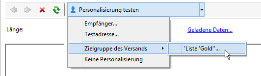

# Erstellen eines SMS-Versands {#creating-a-sms-delivery}

## Wählen Sie den Versand-Kanal {#selecting-the-delivery-channel}

Gehen Sie wie folgt vor, um einen neuen SMS-Versand zu erstellen:

>[!NOTE]
>
>Allgemeine Methoden zur Versanderstellung finden Sie in [diesem Abschnitt](../../delivery/using/steps-about-delivery-creation-steps.md).

1. Erstellen Sie einen neuen Versand beispielsweise im Versand-Dashboard.
1. Wählen Sie die zuvor erstellte Versandvorlage **Mobiltelefon-Versand (SMPP)** aus. Weitere Informationen finden Sie im Abschnitt [Versandvorlage](sms-set-up.md#changing-the-delivery-template) ändern.

   

1. Geben Sie für Ihren Versand einen Titel, einen Code und eine Beschreibung ein. Weiterführende Informationen dazu finden Sie in [diesem Abschnitt](../../delivery/using/steps-create-and-identify-the-delivery.md#identifying-the-delivery).
1. Klicken Sie auf **[!UICONTROL Fortfahren]**, um die Eingaben zu bestätigen und in das Fenster der Nachrichtenkonfiguration zu gelangen.

## Erstellen Sie den SMS-Inhalt {#defining-the-sms-content}

Um den Inhalt der SMS zu erstellen, gehen Sie wie folgt vor:

1. Geben Sie den Nachrichteninhalt im Bereich **[!UICONTROL Textinhalt]** des Assistenten ein. Die Schaltflächen der Symbolleiste bieten die Möglichkeit, Inhalte zu importieren und zu speichern oder in ihnen zu suchen. Die letzte Schaltfläche in der Symbolleiste dient der Einfügung von Personalisierungsfeldern.

   

   Die Verwendung von Personalisierungsfeldern wird im Abschnitt [Über die Personalisierung](../../delivery/using/about-personalization.md) beschrieben.

1. Durch Auswahl des **[!UICONTROL Vorschau]**-Tabs unten auf der Seite können Sie das Rendering der personalisierten Nachricht prüfen. Klicken Sie in der Symbolleiste auf die Schaltfläche **[!UICONTROL Personalisierung testen]** und wählen Sie einen Empfänger aus der Zielgruppe oder ein anderes Profil aus.

   

   Sie können nun den personalisierten Nachrichteninhalt sowie die Anzeige der SMS auf dem rechts im Bild angezeigten Mobiltelefondisplay prüfen. Klicken Sie auf das Display, um die Nachricht mit der Maus zu scrollen.

   

1. Der Link **[!UICONTROL Geladene Daten]** ermöglicht die auszugsweise Anzeige des Empfängerprofils.

   

   >[!NOTE]
   >
   >Bei Verwendung der Codepage „Latin-1 (ISO-8859-1)“ ist die Länge von SMS auf 160, bei Unicode auf 70 Zeichen begrenzt. Gewisse Sonderzeichen können die Länge der Nachricht beeinflussen. Weitere Informationen zur Länge der Nachricht finden Sie im Abschnitt [SMS-Zeichentransliteration](#about-character-transliteration).
   >
   >Wenn die Nachricht Personalisierungsfelder oder bedingte Inhalte enthält, kann die Länge von Empfänger zu Empfänger variieren. Daher sollte die Länge jeweils nach erfolgter Personalisierung geprüft werden.
   >
   >Während der Analysephase wird die Nachrichtenlänge geprüft und im Falle eines Überschreitens ein Warnhinweis erzeugt.

1. Wenn Sie den NetSize-Connector oder einen SMPP-Connector verwenden, besteht die Möglichkeit, den Absendernamen des Versands zu personalisieren. Weitere Informationen hierzu finden Sie im Abschnitt [Erweiterte Parameter](#advanced-parameters).

## Wählen Sie die Population der Zielgruppe {#selecting-the-target-population}

Die detaillierten Schritte zur Auswahl der Zielpopulation eines Versands finden Sie in [diesem Abschnitt](../../delivery/using/steps-defining-the-target-population.md).

Weitere Informationen zur Verwendung von Personalisierungsfeldern finden Sie in [diesem Abschnitt](../../delivery/using/about-personalization.md).

Weitere Informationen zur Aufnahme einer Seed-Liste finden Sie auf [dieser Seite](../../delivery/using/about-seed-addresses.md).

