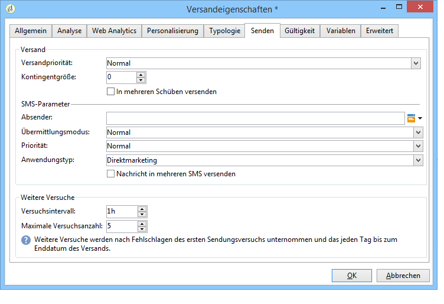
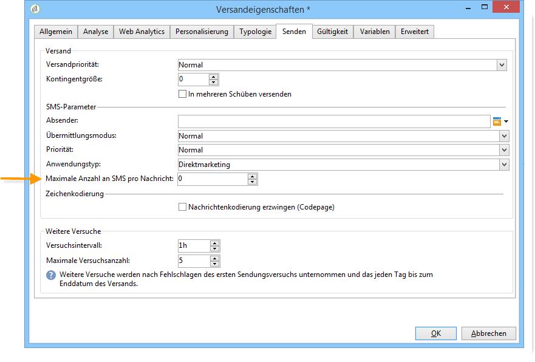

# Zusätzliche Konfiguration{#sms-properties}

<!--
## Send SMS messages {#sending-sms-messages}

To approve your message and send it to the recipients of the delivery being created, click **[!UICONTROL Send]**.

The detailed process when validating and sending a delivery is presented in the sections below:

* [Validate the delivery](steps-validating-the-delivery.md)
* [Send the delivery](steps-sending-the-delivery.md)
-->

## Erweiterte Parameter {#advanced-parameters}

Mit der Schaltfläche **[!UICONTROL Eigenschaften]** können Sie auf den erweiterten Versandparameter zugreifen. Die für SMS-Sendungen spezifischen Parameter befinden sich im Abschnitt **[!UICONTROL SMS-Parameter]** in der Registerkarte **[!UICONTROL Versand]**.

Folgende Optionen stehen zur Verfügung:

* **Absenderadresse**: ermöglicht die Personalisierung des Versandabsenders mit einer Zeichenfolge aus alphanumerischen Zeichen, die auf elf Zeichen begrenzt ist. Das Feld darf nicht ausschließlich aus Zahlen bestehen. Sie können eine Bedingung definieren, um beispielsweise je nach Bereichs-Code des Empfängers unterschiedliche Namen anzuzeigen:

  ```
  <% if( String(recipient.mobilePhone).indexOf("+1") == 0){ %>NeoShopUS<%} else %>
  ```

  >[!IMPORTANT]
  >
  >Prüfen Sie die Gesetze in Ihrem Land bezüglich der Bearbeitung von Absendernamen. Stellen Sie außerdem sicher, dass der Provider diese Funktionalität anbietet.

* **Übermittlungsmodus**: Art der SMS-Übermittlung.
* **Priorität**: Einer Nachricht zugewiesene Wichtigkeit. **[!UICONTROL Normal]** ist standardmäßig ausgewählt. Fragen Sie Ihren Provider nach den Kosten für mit der Priorität **[!UICONTROL Hoch]** versendete SMS.
* **Anwendungstyp**: Wählen Sie die Anwendung aus, die Sie Ihrem SMS-Versand zuweisen möchten. Standardmäßig wird **[!UICONTROL Direkt-Marketing]** vorgeschlagen, da es sich um den am häufigsten verwendeten Typ handelt.

**Den NetSize-Connector betreffende Parameter**



* **Nachricht in mehreren SMS versenden**: ermöglicht den Versand von Nachrichten mit mehr als 160 Zeichen in mehreren SMS.

**SMPP-Connectoren betreffende Parameter**



* **Maximale Anzahl an SMS pro Nachricht**: Diese Option bietet die Möglichkeit, die Anzahl von SMS-Nachrichten festzulegen, die zum Senden einer Nachricht verwendet werden sollen. Wenn die Zahl auf 0 gesetzt ist, können Sie eine SMS verwenden, um Ihre Nachricht zu versenden. Wenn die Zahl auf 1 oder 2 gesetzt ist und die Nachricht diese Schwelle überschreitet, wird sie nicht gesendet.

<!--
## Monitor and track SMS {#monitoring-and-tracking-sms-deliveries}

After sending messages, you can monitor and track your deliveries. For more on this, refer to these sections:

* [Monitor a delivery](about-delivery-monitoring.md)
* [Understand delivery failures](delivery-failures-quarantine.md)
* [About message tracking](about-message-tracking.md)
-->

## Eingehende Nachrichten verarbeiten {#processing-inbound-messages}

Das **nlserver sms**-Modul fragt den SMS-Router in regelmäßigen Abständen ab. Dadurch kann Adobe Campaign den Fortschritt von Sendungen nachverfolgen und die Statusberichte und Empfängerabmeldungen bearbeiten.

* **Empfangsbestätigungen**: Der Status Ihrer Sendungen kann in den Versandlogs eingesehen werden.

  >[!NOTE]
  >
  >Jede gesendete SMS ist mit einem externen Konto über dessen Primärschlüssel verknüpft. Dies bedeutet, dass:
  >
  > * Empfangsbestätigungen eines externen Kontos für gelöschte SMS nicht korrekt verarbeitet werden können.
  > * ein SMS-Konto nur mit einem externen Konto verknüpft sein darf, damit die Empfangsbestätigungen korrekt zugeordnet werden können

* **Abmeldung**: Empfangende, die keine SMS-Sendungen mehr erhalten möchten, können eine Nachricht mit dem Wort STOP zurückgeben. Wenn es Ihr Providervertrag vorsieht, können Sie diese Nachrichten mithilfe der Workflow-Aktivität **SMS-Empfang** abrufen. Dies ermöglicht die Erstellung einer Abfrage, die die Option **Diese Person nicht mehr kontaktieren** für die entsprechenden Empfänger aktiviert.

## InSMS-Schema {#insms-schema}

Das InSMS-Schema enthält Informationen zu eingehenden SMS. Eine Beschreibung dieser Felder ist über das Attribut „desc“ verfügbar.

* **message**: Inhalt der erhaltenen SMS.
* **origin**: Mobiltelefonnummer des Nachrichtenabsenders.
* **providerId**: Kennung der vom SMS-SC (Short Message Service Centre) zurückgegebenen Nachricht.
* **created**: Eingangsdatum der Nachricht in Adobe Campaign.
* **extAccount**: externes Adobe Campaign-Konto.

  >[!IMPORTANT]
  >
  >Die folgenden Felder sind NetSize-spezifisch.
  >
  >Wenn der Betreiber nicht NetSize verwendet, bleiben diese Felder leer.

* **alias**: Alias der eingehenden Nachricht.
* **separator**: Trennzeichen zwischen Alias und Nachrichten-Textkörper.
* **messageDate**: Nachrichtendatum gemäß Betreiber.
* **receivalDate**: Datum des Empfangs der vom Betreiber gesendeten Nachricht im SMS-SC (Short Message Service Centre).
* **deliveryDate**: Datum des Versands der Nachricht durch das SMS-SC (Short Message Service Centre).
* **largeAccount**: Code des der eingehenden SMS zugeordneten Kundenkontos.
* **countryCode**: Ländercode des Betreibers.
* **operatorCode**: Netzwerkcode des Betreiber.
* **linkedSmsId**: Adobe Campaign-Kennung (broadlogId) der ausgehenden SMS, auf die diese SMS antwortet.

## Automatische Antworten verwalten (US-amerikanische Gesetzgebung) {#managing-automatic-replies--american-regulation-}

Wenn ein Abonnent auf eine durch Adobe Campaign versendete SMS mit einer die Schlüsselwörter STOP, HELP oder YES enthaltenden Nachricht antwortet, ist für den US-amerikanischen Markt eine Konfiguration der automatischen Benachrichtigungen an den Absender gesetzlich vorgeschrieben.

Wenn beispielsweise das Wort STOP gesendet wird, erhält der Abonnent automatisch eine Abmelde-Bestätigung.

Der Absendername für diese Art von Nachrichten besteht aus einer kurzen Nummer (short code), welche auch für die üblichen Sendungen genutzt wird.

>[!IMPORTANT]
>
>Das folgende detaillierte Verfahren gilt nur für SMPP-Connectoren, mit Ausnahme des Connectors „Erweitertes allgemeines SMPP“. Weitere Informationen hierzu finden Sie im Abschnitt [Externes SMPP-Konto erstellen](sms-set-up.md#creating-an-smpp-external-account).
>
>Es ist Teil des Zertifizierungsprozesses, der von amerikanischen Betreibern für Marketing-Kampagnen in den USA durchgeführt wird. Insbesondere müssen diese SMS Abonnentinnen bzw. Abonnenten, die ein entsprechendes Schlüsselwort gesendet haben, unverzüglich nach Erhalt einer Nachricht zugestellt werden.

1. Erstellen Sie eine XML-Datei nach folgendem Muster:

   ```
   <autoreply>
     <shortcode name="12345">
       <reply keyword="STOP" text="You will not receive SMS anymore" />
       <reply keyword="HELP" text="Powered by Adobe Campaign" />
     </shortcode>
     <shortcode name="43115">
       <reply keyword="STOP" text="Vous ne recevrez plus de SMS" />
       <reply keyword="HELP" text="Service rendu par Adobe Campaign" />
     </shortcode>
     <shortcode name="*">
       <reply keyword="ADOBE" text="This text is replied when you send ADOBE to any short code" />
     </shortcode>
   </autoreply>
   ```

1. Geben Sie für das Attribut **name** des **`<shortcode>`**-Tags die Kurzwahlnummer an, die anstelle des Absendernamens angezeigt werden soll.

   Geben Sie in jedem **`<reply>`**-Tag im Attribut **keyword** ein Schlüsselwort und im Attribut **text** die dem Schlüsselwort entsprechende Nachricht an.

   >[!NOTE]
   >
   >Schlüsselwörter sind in Großbuchstaben zu schreiben.

   Wenn Sie für verschiedene Schlüsselwörter dieselbe Nachricht versenden möchten, können Sie die entsprechende Zeile duplizieren.

   Beispiel:

   ```
   <reply keyword="STOP" text="You will not receive SMS anymore" />
   <reply keyword="QUIT" text="You will not receive SMS anymore" />
   ```

1. Speichern Sie dann die Datei unter dem Namen **smsAutoReply.xml**.

   Bitte berücksichtigen Sie, dass beim Dateinamen unter Linux die Groß- und Kleinschreibung zu beachten ist.

1. Kopieren Sie die Datei in das **conf**-Verzeichnis in Adobe Campaign (am gleichen Ort wie der Web-Server).

>[!IMPORTANT]
>
>Für diese Arten von automatischen Nachrichten wird kein Verlauf erstellt. Daher werden sie nicht im Versand-Dashboard angezeigt. [Weitere Informationen](https://experienceleague.adobe.com/de/docs/campaign/campaign-v8/send/monitor/delivery-dashboard){target="_blank"}.
>
>Diese Nachrichten werden in den kommerziellen Druckregeln nicht berücksichtigt. Weitere Informationen finden Sie in der [Dokumentation zu Campaign v8](https://experienceleague.adobe.com/docs/campaign/automation/campaign-optimization/pressure-rules.html?lang=de){target="_blank"}.
