# Konfigurieren des SMS-Kanals in einer Mid-Sourcing-Infrastruktur {#setting-up-sms-channel}

Folgende Voraussetzungen müssen für das Senden an Mobiltelefone mit Mid-Servern gegeben sein:

1. Ein SMS-Benutzer oder eine SMS-Benutzerin, der bzw. die auf dem Mid-Server erstellt wurde und für das externe SMS-Konto verwendet wird, das auf dem Marketing-Server erstellt wurde.

1. Ein externes Konto auf dem Marketing-Server, das den Kanal und den Versandmodus angibt.

1. Ein externes Konto auf dem Mid-Server, in dem der Connector und der Nachrichtentyp aufgeführt sind.

1. Eine Versandvorlage, die auf das externe Konto verweist, um den Versandprozess zu optimieren.

>[!NOTE]
>
> Für SMS-Sendungen sollte die Typologie eine bestimmte SMS-Affinität verwenden, die in **einem** dedizierten Anwendungs-Server-Container erstellt wurde. [Weitere Informationen](../../installation/using/configure-delivery-settings.md#managing-outbound-smtp-traffic-with-affinities)

## Erstellen des SMS-Benutzers oder der SMS-Benutzerin auf dem Mid-Server {#create-sms-operator}

Um den Konfigurationsprozess zu starten, müssen Sie auf dem Mid-Server einen SMS-Benutzer oder eine SMS-Benutzerin speziell für das externe Konto erstellen.

>[!IMPORTANT]
>
>Jeder SMS-Connector benötigt einen eindeutigen SMS-Benutzer oder eine eindeutige SMS-Benutzerin.

1. Klicken Sie im Knoten **[!UICONTROL Administration]** > **[!UICONTROL Zugriffsverwaltung]** > **[!UICONTROL Benutzerknoten]** des Baums auf das Symbol **[!UICONTROL Neu]**.

   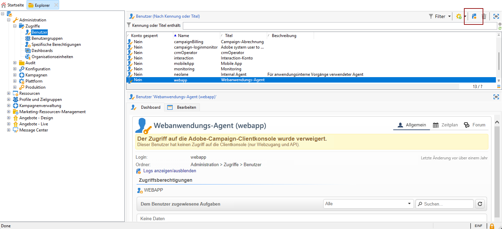

1. Geben Sie die **[!UICONTROL Identifizierungsparameter]** ein, einschließlich Login, Kennwort und Name. Login und Kennwort sind erforderlich, damit sich die Benutzenden sicher bei Adobe Campaign anmelden können.

   Beachten Sie, dass **[!UICONTROL Name (Login)]** später verwendet wird, um Ihr externes SMPP-Konto im Mid-Server zu benennen.

   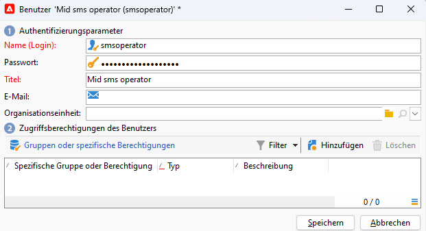

1. Wählen Sie die den Benutzenden erteilten Berechtigungen im Bereich „Zugriffsberechtigungen des Benutzers“ aus.

   Um Benutzenden Berechtigungen zuzuweisen, klicken Sie auf die Schaltfläche **[!UICONTROL Hinzufügen]** oberhalb der Liste der Berechtigungen. Wählen Sie als Nächstes eine **[!UICONTROL Benutzergruppe]** oder **[!UICONTROL spezifische Berechtigungen]** aus der verfügbaren Gruppenliste aus.

   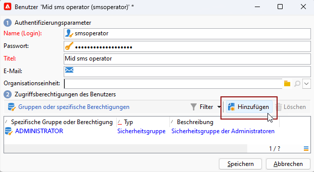

1. Klicken Sie auf **[!UICONTROL Speichern]**, um die Erstellung des Benutzers bzw. der Benutzerin abzuschließen. Das Profil ist jetzt in der Liste der vorhandenen Benutzenden enthalten.

## Erstellen eines externen SMS-Kontos auf dem Marketing-Server {#create-accound-mkt}

Um mit Mid-Servern eine SMS an ein Mobiltelefon zu senden, müssen Sie zunächst Ihr externes SMPP-Konto auf dem Marketing-Server erstellen.

1. Wählen Sie dazu im Navigationsbaum im Knoten **[!UICONTROL Plattform]** > **[!UICONTROL Externe Konten]** das Symbol **[!UICONTROL Neu]** aus.

   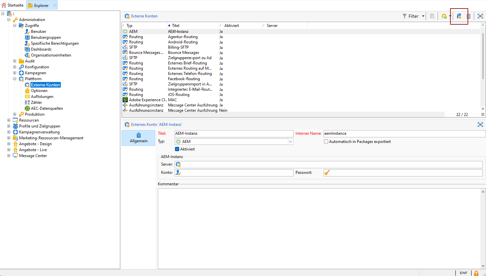

1. Geben Sie einen **[!UICONTROL Titel]** und einen **[!UICONTROL internen Namen]** ein. Beachten Sie, dass der interne Name später verwendet werden soll, um Ihr externes SMPP-Konto im Mid-Server zu benennen.

1. Definieren Sie den Kontotyp als **[!UICONTROL Routing]**, den Kanal als **[!UICONTROL Mobiltelefon (SMS)]** und den Versandmodus als **[!UICONTROL Mid-Sourcing]**.

   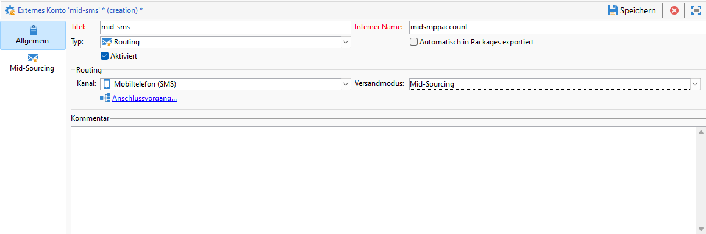

1. Geben Sie auf der Registerkarte **[!UICONTROL Mid-Sourcing]** die Verbindungsparameter für den Mid-Sourcing-Server an.

   Geben Sie die Details des [zuvor erstellten SMS-Connectors](#create-sms-operator) in den Feldern **[!UICONTROL Konto]** und **[!UICONTROL Kennwort]** ein.

   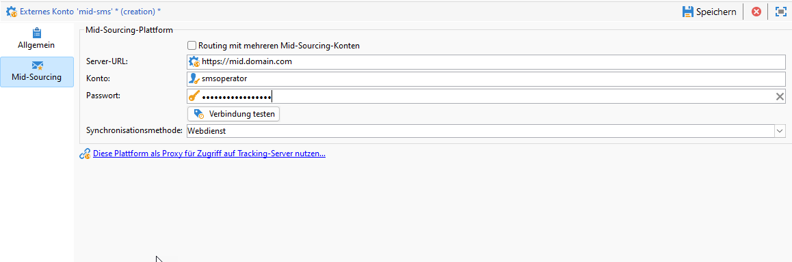

1. Bestätigen Sie Ihre Konfiguration durch Klicken auf **[!UICONTROL Verbindung testen]**.

1. Klicken Sie auf **[!UICONTROL Speichern]**.

## Erstellen eines externen SMPP-Kontos auf dem Mid-Server {#creating-smpp-mid}

>[!IMPORTANT]
>
>Die Verwendung desselben Kontos und Kennworts für mehrere externe SMS-Konten kann zu Konflikten und Überschneidungen zwischen den Konten führen. Siehe die [Seite zur SMS-Fehlerbehebung](troubleshooting-sms.md#external-account-conflict).

Nachdem Sie Ihr externes SMS-Konto erfolgreich auf dem Marketing-Server eingerichtet haben, besteht der nächste Schritt darin, Ihr externes SMPP-Konto auf dem Mid-Server einzurichten.

Weiterführende Informationen zum SMS-Protokoll und dessen Einstellungen finden Sie auf dieser [Seite](sms-protocol.md).

Gehen Sie dazu wie folgt vor:

1. Wählen Sie dazu im Navigationsbaum im Knoten **[!UICONTROL Plattform]** > **[!UICONTROL Externe Konten]** das Symbol **[!UICONTROL Neu]** aus.

1. Geben Sie einen **[!UICONTROL Titel]** und einen **[!UICONTROL internen Namen]** ein. 

   >[!WARNING]
   >
   >Beim Zuweisen eines **[!UICONTROL internen Namens]** müssen Sie die angegebene Namenskonvention befolgen:
   >  `SMS Operator Name_Internal Name of the Marketing SMS external account`

   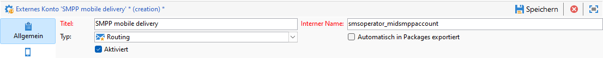

1. Definieren Sie den Kontotyp mit **Routing**, den Kanal mit **Mobiltelefon (SMS)** und den Versandmodus mit **Gebündelter Versand**.

   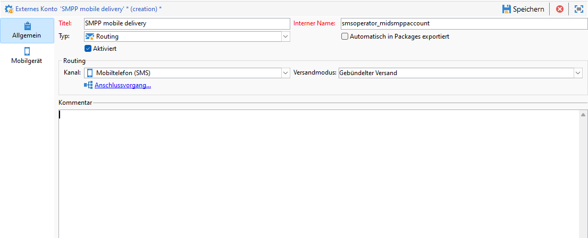

1. Kreuzen Sie die Option **[!UICONTROL Aktiviert]** an.

1. Wählen Sie im Tab **[!UICONTROL Mobiltelefon]** aus der **[!UICONTROL Connector]**-Dropdown-Liste die Option **[!UICONTROL Erweitertes allgemeines SMPP]**.

   

1. Mit der Option **[!UICONTROL Ausführliche SMPP-Verfolgung in Logdatei aktivieren]** können Sie den gesamten SMPP-Traffic in Protokolldateien speichern. Diese Option sollte nur aktiviert werden, um eine Fehlerbehebung beim Connector vornehmen und den Traffic mit dem auf Provider-Seite verzeichneten Traffic vergleichen zu können.

1. Wenden Sie sich an Ihren SMS-Dienstleister. Dieser kann Ihnen die für das externe Konto erforderlichen Angaben auf dem Tab **[!UICONTROL Verbindungsparameter]** bereitstellen.

   Der von Ihnen ausgewählte Provider nennt Ihnen danach den Wert für das Feld **[!UICONTROL Name der SMSC-Implementierung]**.

   Sie können die Anzahl der Verbindungen mit dem Dienstleister per untergeordnetem MTA definieren. Standardmäßig ist 1 eingestellt.

1. Standardmäßig kommt in Bezug auf die maximal zulässige Zeichenanzahl einer SMS der Mobilfunkstandard GSM zur Anwendung.

   SMS, die das GSM-Alphabet verwenden, sind auf 160 Zeichen begrenzt oder auf 153 Zeichen pro SMS bei Nachrichten, die in mehreren Teilen gesendet werden.

   >[!NOTE]
   >
   >Gewisse Zeichen zählen doppelt (Akkoladen, eckige Klammern, Eurozeichen etc.).
   >
   >Eine Liste der von GSM unterstützten Zeichen finden Sie [in diesem Abschnitt](sms-set-up.md#about-character-transliteration).

   Sie können die Transliteration von Zeichen auch zulassen, indem Sie die entsprechende Option aktivieren.

   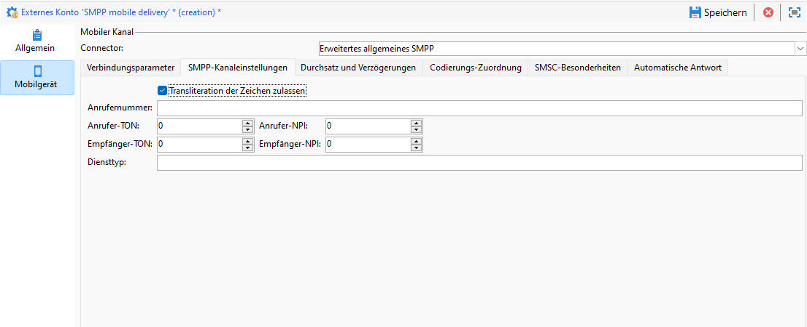

1. Auf der Registerkarte **[!UICONTROL Durchsatz und Dauer]** können Sie den maximalen Durchsatz für ausgehende Nachrichten (&quot;MT&quot;, Mobile Terminated) festlegen. Bei Angabe von &quot;0&quot; im entsprechenden Feld ist der Durchsatz unbegrenzt.

   Werte, die eine Dauer angeben, sind in Sekunden auszudrücken.

1. Im Tab **[!UICONTROL Kodierungs-Mapping]** können Sie Kodierungen definieren.

   Weiterführende Informationen hierzu finden Sie in [diesem Abschnitt](sms-set-up.md#about-text-encodings).

1. Im Tab **[!UICONTROL SMSC-Besonderheiten]** ist die Option **[!UICONTROL Vollständige Telefonnummer senden]** standardmäßig deaktiviert. Aktivieren Sie sie nicht, wenn Sie die Konformität mit dem SMPP-Protokoll wahren und nur Zahlen an den Server des SMS-Anbieters (SMSC) übertragen möchten.

   Bei gewissen Anbietern ist die Verwendung des Vorzeichens &#39;+&#39; jedoch erforderlich, sodass es ratsam ist, mit Ihrem Anbieter Kontakt aufzunehmen, der Sie bei Bedarf dazu auffordern wird, diese Option zu aktivieren.

   Die Checkbox **[!UICONTROL TLS über SMPP aktivieren]** ermöglicht die Verschlüsselung des SMPP-Traffics. Weiterführende Informationen hierzu finden Sie auf dieser [Seite](sms-protocol.md).

1. Wenn Sie einen Connector vom Typ **[!UICONTROL Erweitertes allgemeines SMPP]** konfigurieren, können Sie automatische Antworten einrichten.

   Weiterführende Informationen hierzu finden Sie in [diesem Abschnitt](sms-set-up.md#automatic-reply).

## Ändern der Versandvorlage {#changing-the-delivery-template}

Adobe Campaign bietet eine mobile Versandvorlage im Knoten **[!UICONTROL Ressourcen > Vorlagen > Versandvorlagen]** an. Weitere Informationen hierzu finden Sie in der [&#x200B; zu Campaign v8](https://experienceleague.adobe.com/docs/campaign/campaign-v8/send/create-templates.html?lang=de){target="_blank"}.

Um Nachrichten über den SMS-Kanal zu senden, müssen Sie eine Vorlage erstellen, die einen Verweis auf den Kanal-Connector enthält.

Wir empfehlen Ihnen, nicht die native Versandvorlage zu ändern, sondern diese zu duplizieren und die Kopie nach Bedarf zu konfigurieren.

Im folgenden Beispiel wird eine Vorlage generiert, die den Versand von Nachrichten über das zuvor erstellte SMPP-Konto erleichtert. Gehen Sie dazu wie folgt vor:

1. Klicken Sie im Knoten **[!UICONTROL Ressourcen]** > **[!UICONTROL Vorlagen]** > **[!UICONTROL Versandvorlagen]** des Baums mit der rechten Maustaste auf die Vorlage **[!UICONTROL Mobiltelefon-Versand]** und wählen Sie **[!UICONTROL Duplizieren]** aus.

   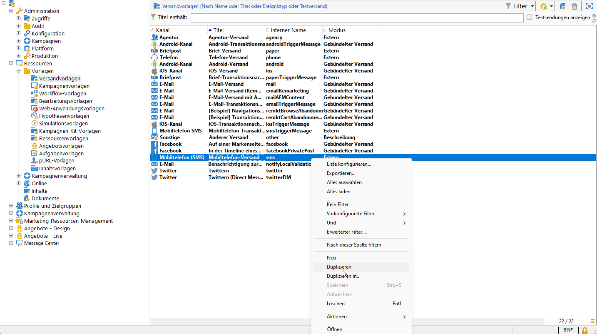

1. Ändern Sie die Beschriftung der Vorlage, z. B. **Mobiltelefon-Versand (SMPP)**.

   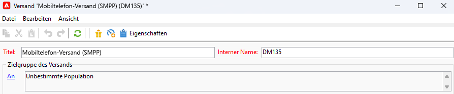

1. Klicken Sie auf **[!UICONTROL Eigenschaften]**.

1. Wählen Sie in der Registerkarte **[!UICONTROL Allgemein]** einen Routing-Modus aus, der dem externen Konto entspricht, das Sie im Abschnitt [Erstellen eines externen SMS-Kontos auf dem Marketing-Server](#create-accound-mkt) erstellt haben.

   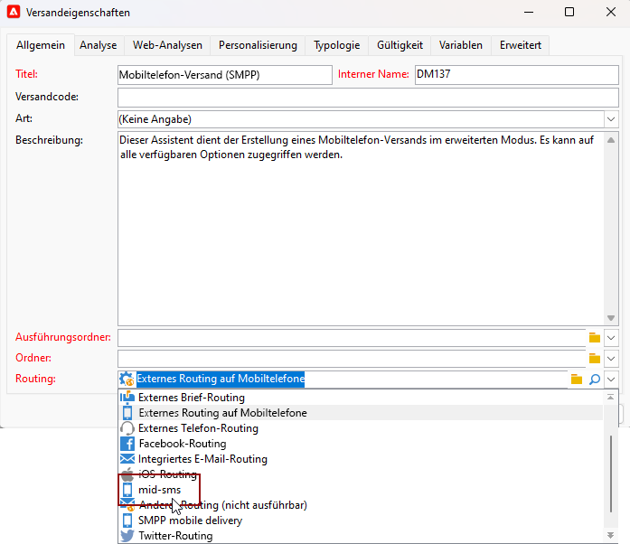

1. Klicken Sie auf **[!UICONTROL Speichern]**, um die Erstellung abzuschließen.

   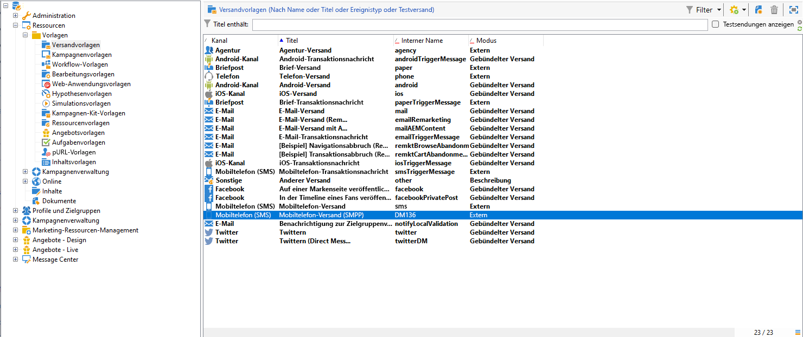

Sie verfügen nun über ein externes Konto und eine Versandvorlage, die es Ihnen erlauben, per SMS zu versenden.

## Verwandte Themen {#related-topics}

* [Transliteration von SMS-Zeichen](sms-set-up.md#about-character-transliteration)
* [Textcodierungen](sms-set-up.md#about-text-encodings)
* [Automatische Antwort](sms-set-up.md#automatic-reply)
