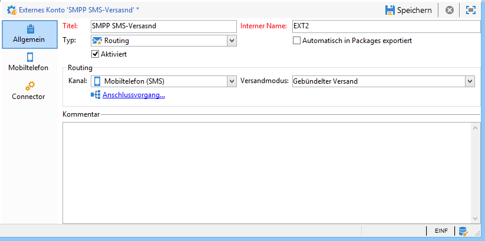
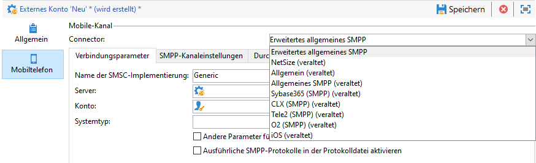
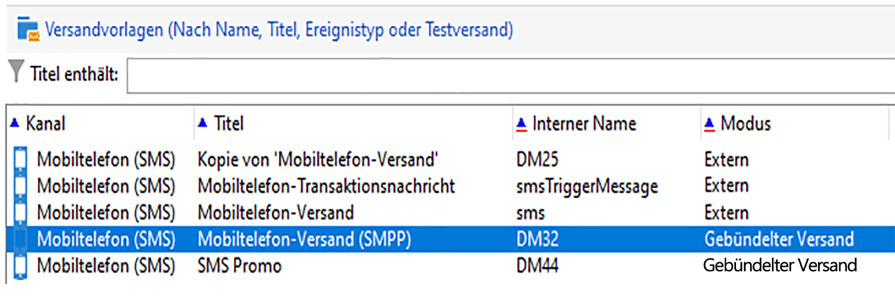

# SMS-Kanal {#setting-up-sms-channel} einrichten

Folgende Voraussetzungen müssen gegeben sein, um Sendungen an Mobiltelefone richten zu können:

1. ein externes Konto mit Angabe des Connectors und des Nachrichtentyps;

   Beachten Sie, dass ältere Connectors jetzt nicht mehr unterstützt werden. Eingestellte Funktionen sind weiterhin verfügbar, werden jedoch weder weiter verbessert noch unterstützt. Weitere Infos finden Sie auf [dieser Seite](../../rn/using/deprecated-features.md).

1. Eine Versandvorlage, die auf das externe Konto Bezug nimmt.

## Erstellen eines SMPP-Externen Kontos {#creating-an-smpp-external-account}

Um eine SMS an ein Mobiltelefon zu senden, müssen Sie zunächst Ihr externes SMPP-Konto erstellen.
Weitere Informationen zum SMS-Protokoll und zu den Einstellungen finden Sie auf dieser [Seite](../../delivery/using/sms-protocol.md).

Gehen Sie dazu wie folgt vor:

1. Wählen Sie dazu im Navigationsbaum im Knoten **[!UICONTROL Plattform]** > **[!UICONTROL Externe Konten]** das Symbol **[!UICONTROL Neu]** aus.
1. Definieren Sie den Kontotyp mit **Routing**, den Kanal mit **Mobiltelefon (SMS)** und den Versandmodus mit **Gebündelter Versand**.

   

1. Kreuzen Sie die Option **[!UICONTROL Aktiviert]** an.
1. Wählen Sie im Tab **[!UICONTROL Mobiltelefon]** aus der **[!UICONTROL Connector]**-Dropdown-Liste die Option **[!UICONTROL Erweitertes allgemeines SMPP]**.

   

   >[!CAUTION]
   >
   > Ab Version 20.2 werden ältere Connectoren eingestellt und nicht mehr unterstützt. Es wird empfohlen, den Connector **[!UICONTROL Erweitertes allgemeines SMPP]** zu verwenden. Weiterführende Informationen über das Migrieren zum empfohlenen Connector finden Sie auf dieser [Seite](../../delivery/using/unsupported-connector-migration.md).

1. Mit der Option **[!UICONTROL Ausführliche SMPP-Protokolle in der Protokolldatei aktivieren]** können Sie den gesamten SMPP-Traffic in Logdateien speichern. Diese Option muss aktiviert sein, um eine Fehlerbehebung beim Connector durchzuführen und einen Vergleich mit dem vom Provider aufgezeichneten Traffic anzustellen.

1. Wenden Sie sich an Ihren SMS-Dienstleister. Dieser kann Ihnen die für das externe Konto erforderlichen Angaben auf dem Tab **[!UICONTROL Verbindungsparameter]** bereitstellen.

   Der von Ihnen ausgewählte Provider nennt Ihnen danach den Wert für das Feld **[!UICONTROL Name der SMSC-Implementierung]**.

   Sie können die Anzahl der Verbindungen mit dem Dienstleister per untergeordnetem MTA definieren. Standardmäßig ist 1 eingestellt.

1. Standardmäßig kommt in Bezug auf die maximal zulässige Zeichenanzahl einer SMS der Mobilfunkstandard GSM zur Anwendung.

   SMS, die das GSM-Alphabet verwenden, sind auf 160 Zeichen begrenzt oder auf 153 Zeichen pro SMS bei Nachrichten, die in mehreren Teilen gesendet werden.

   >[!NOTE]
   >
   >Gewisse Zeichen zählen doppelt (Akkoladen, eckige Klammern, Eurozeichen etc.).
   >
   >Eine Liste der von GSM unterstützten Zeichen finden Sie unten.

   Bei Bedarf können Sie die Transliteration von Zeichen zulassen, indem Sie die entsprechende Option aktivieren.

   

   Weiterführende Informationen hierzu finden Sie in [diesem Abschnitt](#about-character-transliteration).

1. Im Tab **[!UICONTROL Durchsatz und Dauer]** können Sie den maximalen Durchsatz für ausgehende Nachrichten (&quot;MT&quot;, Mobile Terminated) festlegen. Bei Angabe von &quot;0&quot; im entsprechenden Feld ist der Durchsatz unbegrenzt.

   Werte, die eine Dauer angeben, sind in Sekunden auszudrücken.

1. Im Tab **[!UICONTROL Kodierungs-Mapping]** können Sie Kodierungen definieren.

   Weiterführende Informationen hierzu finden Sie in [diesem Abschnitt](#about-text-encodings).

1. Im Tab **[!UICONTROL SMSC-Besonderheiten]** ist die Option **[!UICONTROL Vollständige Telefonnummer senden]** standardmäßig deaktiviert. Aktivieren Sie sie nicht, wenn Sie die Konformität mit dem SMPP-Protokoll wahren und nur Zahlen an den Server des SMS-Anbieters (SMSC) übertragen möchten.

   Bei gewissen Anbietern ist die Verwendung des Vorzeichens &#39;+&#39; jedoch erforderlich, sodass es ratsam ist, mit Ihrem Anbieter Kontakt aufzunehmen, der Sie bei Bedarf dazu auffordern wird, diese Option zu aktivieren.

   Mit dem Kontrollkästchen **[!UICONTROL TLS über SMPP]** aktivieren können Sie SMPP-Traffic verschlüsseln. Weiterführende Informationen hierzu finden Sie auf dieser [Seite](../../delivery/using/sms-protocol.md).

1. Wenn Sie einen Connector vom Typ **[!UICONTROL Erweitertes allgemeines SMPP]** konfigurieren, können Sie automatische Antworten einrichten.

   Weiterführende Informationen hierzu finden Sie in [diesem Abschnitt](#automatic-reply).

## SMS-Zeichentransliteration {#about-character-transliteration}

Die Transliteration von Zeichen kann in einem externen Konto für den SMPP-Mobiltelefon-Versand im Tab **[!UICONTROL Mobile]** eingerichtet werden.

Transliteration bezeichnet in einer SMS die Ersetzung eines Zeichens durch ein anderes, wenn das erste Zeichen nicht von GSM unterstützt wird.

* Wenn die Transliteration **[!UICONTROL zugelassen]** wurde, wird jedes nicht unterstützte Zeichen beim Nachrichtenversand durch ein Zeichen des GSM-Alphabets ersetzt. So wird beispielsweise der Buchstabe &quot;ë&quot; durch &quot;e&quot; ersetzt. Der Nachrichteninhalt wird in diesem Fall leicht verändert übermittelt, aber die Zeichenanzahl bleibt identisch.
* Wenn die Transliteration **[!UICONTROL nicht zugelassen]** wurde, werden alle Nachrichten mit nicht unterstützten Zeichen im Binärformat (Unicode) gesendet: Alle Zeichen werden unverändert übermittelt. In Unicode kodierte SMS sind auf 70 Zeichen (oder 67 Zeichen bei Nachrichten, die in mehreren Teilen gesendet werden) begrenzt. Bei Überschreitung der maximalen Zeichenanzahl werden mehrere Teilnachrichten gesendet, wodurch zusätzliche Kosten entstehen können.

>[!IMPORTANT]
>
>Die Verwendung von Personalisierungsfeldern im SMS-Inhalt führt u. U. dazu, dass nicht von GSM unterstützte Zeichen eingefügt werden.

Die Transliteration von Zeichen ist standardmäßig deaktiviert. Es wird empfohlen, diese Option nicht zu aktivieren, wenn Sie alle Zeichen Ihrer SMS beibehalten möchten, um beispielsweise Eigennamen unverändert zu übermitteln.

Sollte Ihre SMS jedoch eine hohe Anzahl an Zeichen enthalten, die dem Unicode-Zeichensatz entstammen, können Sie diese Option wählen, um Ihre Versandkosten zu begrenzen.

Die folgende Tabelle zeigt den vom GSM-Standard unterstützten Zeichensatz. Jedes im Nachrichteninhalt enthaltene Zeichen, das nicht in der unten stehenden Tabelle aufgeführt ist, führt zur Konvertierung der gesamten Nachricht in das Binärformat (Unicode), sobald sie 70 Zeichen überschreitet.

**Einfache Zeichen**

<table> 
 <tbody> 
  <tr> 
   <td> @ </td> 
   <td>  </td> 
   <td> SP </td> 
   <td> 0 </td> 
   <td> ¡ </td> 
   <td> P </td> 
   <td> ¿ </td> 
   <td> p </td> 
  </tr> 
  <tr> 
   <td> £ </td> 
   <td> _ </td> 
   <td> ! </td> 
   <td> 1 </td> 
   <td> A </td> 
   <td> Q </td> 
   <td> a </td> 
   <td> q </td> 
  </tr> 
  <tr> 
   <td> $ </td> 
   <td>  </td> 
   <td> " </td> 
   <td> 2 </td> 
   <td> B </td> 
   <td> R </td> 
   <td> b </td> 
   <td> r </td> 
  </tr> 
  <tr> 
   <td> ¥ </td> 
   <td>  </td> 
   <td> # </td> 
   <td> 3 </td> 
   <td> C </td> 
   <td> S </td> 
   <td> c </td> 
   <td> s </td> 
  </tr> 
  <tr> 
   <td> è </td> 
   <td>  </td> 
   <td> ¤ </td> 
   <td> 4 </td> 
   <td> D </td> 
   <td> T </td> 
   <td> d </td> 
   <td> t </td> 
  </tr> 
  <tr> 
   <td> é </td> 
   <td>  </td> 
   <td> % </td> 
   <td> 5 </td> 
   <td> E </td> 
   <td> U </td> 
   <td> e </td> 
   <td> u </td> 
  </tr> 
  <tr> 
   <td> ù </td> 
   <td>  </td> 
   <td> &amp; </td> 
   <td> 6 </td> 
   <td> F </td> 
   <td> V </td> 
   <td> f </td> 
   <td> v </td> 
  </tr> 
  <tr> 
   <td> ì </td> 
   <td>  </td> 
   <td> ' </td> 
   <td> 7 </td> 
   <td> G </td> 
   <td> W </td> 
   <td> g </td> 
   <td> w </td> 
  </tr> 
  <tr> 
   <td> ò </td> 
   <td>  </td> 
   <td> ( </td> 
   <td> 8 </td> 
   <td> H </td> 
   <td> X </td> 
   <td> h </td> 
   <td> x </td> 
  </tr> 
  <tr> 
   <td> Ç </td> 
   <td>  </td> 
   <td> ) </td> 
   <td> 9 </td> 
   <td> I </td> 
   <td> Y </td> 
   <td> i </td> 
   <td> y </td> 
  </tr> 
  <tr> 
   <td> LF </td> 
   <td>  </td> 
   <td> * </td> 
   <td> : </td> 
   <td> J </td> 
   <td> Z </td> 
   <td> j </td> 
   <td> z </td> 
  </tr> 
  <tr> 
   <td> Ø </td> 
   <td> ESC </td> 
   <td> + </td> 
   <td> ; </td> 
   <td> K </td> 
   <td> Ä </td> 
   <td> k </td> 
   <td> ä </td> 
  </tr> 
  <tr> 
   <td> ø </td> 
   <td> Æ </td> 
   <td> , </td> 
   <td> &lt; </td> 
   <td> L </td> 
   <td> Ö </td> 
   <td> l </td> 
   <td> ö </td> 
  </tr> 
  <tr> 
   <td> CR </td> 
   <td> æ </td> 
   <td> - </td> 
   <td> = </td> 
   <td> M </td> 
   <td> Ñ </td> 
   <td> m </td> 
   <td> ñ </td> 
  </tr> 
  <tr> 
   <td> Å </td> 
   <td> ß </td> 
   <td> . </td> 
   <td> &gt; </td> 
   <td> N </td> 
   <td> Ü </td> 
   <td> n </td> 
   <td> ü </td> 
  </tr> 
  <tr> 
   <td> å </td> 
   <td> É </td> 
   <td> / </td> 
   <td> ? </td> 
   <td> O </td> 
   <td> § </td> 
   <td> o </td> 
   <td> à </td> 
  </tr> 
 </tbody> 
</table>

SP: Leerzeichen

ESC: Escape

LF: Zeilenvorschub

CR: Wagenrücklauf

**Doppelt zählende Zeichen**

^ { } `[ ~ ]` | €

## Über Textkodierungen {#about-text-encodings}

Beim SMS-Versand kann Adobe Campaign eine oder mehrere Textkodierungen verwenden. Je nach Kodierung kommen unterschiedliche Zeichensätze zur Anwendung und variiert die Anzahl an zulässigen Zeichen pro SMS.

Beim Konfigurieren eines neuen externen Kontos für einen SMPP-Mobiltelefon-Versand können Sie das **[!UICONTROL Kodierungs-Mapping]** im Tab **[!UICONTROL Mobiltelefon]** definieren: Über das Feld **[!UICONTROL data_coding]** kann Adobe Campaign dem SMSC (Short Message Service Center) kommunizieren, welche Kodierung verwendet wird.

>[!NOTE]
>
>Das Mapping zwischen dem Wert des **data_coding**-Felds und der tatsächlich verwendeten Kodierung ist standardisiert. Gewisse SMSC besitzen jedoch ihr eigenes Mapping. In diesem Fall muss Ihr **Adobe-Campaign**-Administrator das Mapping deklarieren. Kontaktieren Sie für weiterführende Informationen Ihren Anbieter.

Sie können **data_codings** deklarieren. Durch Angabe von nur einer Kodierung in der Tabelle wird die Anwendung dieser Kodierung erzwungen.

* Wenn kein Kodierungs-Mapping definiert wurde, verhält sich der Connector standardmäßig:

   * Er versucht, das GSM-Alphabet zu verwenden und ordnet diesem den Wert **DATA_CODING = 0** zu.
   * Falls die Verwendung des GSM-Alphabets nicht möglich ist, verwendet er **UCS2** und ordnet den Wert **DATA_CODING = 8** zu.

* Wenn Sie die zu verwendenden Kodierungen sowie die damit verbundenen **[!UICONTROL data_coding]**-Feldwerte definieren, verwendet Adobe Campaign die Kodierungen in der Reihenfolge ihres Erscheinens in der Liste. Wenn die Verwendung der ersten Kodierung nicht möglich ist, wird die zweite verwendet, usw.

>[!IMPORTANT]
>
>Die Reihenfolge der Deklarierung ist entscheidend. Wir empfehlen Ihnen, die Liste aufsteigend nach den entstehenden **Kosten** zu ordnen, um die Kodierungen zu favorisieren, die eine größere Anzahl von Zeichen pro SMS erlauben.
>
>Deklarieren Sie nur die Kodierungen, die Sie tatsächlich verwenden möchten. Deklarieren Sie hingegen keine vom SMSC angebotenen Kodierungen in der Liste, die nicht Ihrer Verwendung entsprechen.

## Automatische Antwort {#automatic-reply}

Wenn Sie einen Connector vom Typ Erweitertes allgemeines SMPP konfigurieren, können Sie automatische Antworten einrichten.

Im Bereich **[!UICONTROL Automatische Antwort auf MO]** können Sie Benachrichtigungen konfigurieren, die automatisch gesendet werden, wenn ein Abonnent auf eine durch Adobe Campaign versendete SMS mit einer ein Schlüsselwort wie beispielsweise &quot;STOP&quot; enthaltenden Nachricht antwortet.

>[!NOTE]
>
>Bei den Schlüsselwörtern kann die Groß-/Kleinschreibung ignoriert werden.

Geben Sie für jedes Schlüsselwort eine Kurzwahlnummer (short code) an, d. h. eine als Absendername fungierende Nummer, die gewöhnlich für den Nachrichtenversand verwendet wird, sowie die an den Abonnenten zu sendende Nachricht.

Es besteht die Möglichkeit, jeder automatischen Antwort eine Aktion zuzuordnen: **[!UICONTROL Unter Quarantäne stellen]** oder **[!UICONTROL Aus der Quarantäne entfernen]**. Wenn beispielsweise das Wort &quot;STOP&quot; gesendet wird, erhält der Abonnent automatisch eine Abmeldebestätigung und sein Profil wird unter Quarantäne gestellt.

Wird die Aktion **[!UICONTROL Aus der Quarantäne entfernen]** mit einer automatischen Antwort verknüpft, werden die Empfänger, die das entsprechende Schlüsselwort senden, automatisch aus der Quarantäne entlassen.

Die Empfänger sind in der Tabelle **[!UICONTROL Adressen unzustellbarer Sendungen]** aufgeführt, die über das Menü **[!UICONTROL Administration]** > **[!UICONTROL Kampagnenverwaltung]** > **[!UICONTROL Unzustellbarkeitsverwaltung]** abrufbar ist.

* Lassen Sie die Spalte **[!UICONTROL Kurzwahlnummer]** leer, wenn unabhängig von der Kurzwahlnummer dieselbe Nachricht gesendet werden soll.
* Lassen Sie die Spalte **[!UICONTROL Schlüsselwort]** leer, wenn unabhängig vom Schlüsselwort dieselbe Nachricht gesendet werden soll.
* Lassen Sie die Spalte **[!UICONTROL Antwort]** leer, wenn nur eine Aktion ausgeführt, aber keine Antwort gesendet werden soll. Dies ermöglicht beispielsweise die Entlassung eines Abonnenten aus der Quarantäne, wenn er ein anderes Schlüsselwort als &quot;STOP&quot; sendet.

Wenn Sie mehrere externe Konten mit dem Connector „Erweitertes allgemeines SMPP“ mit demselben Provider-Konto haben, kann das folgende Problem auftreten: Wenn Sie eine Antwort an eine Kurzwahlnummer senden, kann sie auf einer Ihrer externen Kontoverbindungen empfangen werden. Folglich ist die automatische Antwort, die gesendet wird, möglicherweise nicht die erwartete Nachricht.
Um dies zu vermeiden, wenden Sie je nach verwendetem Provider eine der folgenden Lösungen an:

* Erstellen Sie für jedes externe Konto ein Provider-Konto.
* Verwenden Sie das Feld **[!UICONTROL Systemtyp]** im Tab **[!UICONTROL Mobiltelefon]** > **[!UICONTROL Verbindungsparameter]**, um jede Kurzwahlnummer zu unterscheiden. Bitten Sie Ihren Provider um einen anderen Wert für jedes Konto.

   

Die Schritte zum Einrichten eines Externen Kontos mithilfe des erweiterten generischen SMPP-Connectors sind im Abschnitt [Erstellen eines SMPP-Externen Kontos](#creating-an-smpp-external-account) beschrieben.

## Versandvorlage {#changing-the-delivery-template} ändern

Adobe Campaign enthält eine vorkonfigurierte Vorlage für Sendungen auf Mobiltelefone. Auf diese Vorlage können Sie im Knoten **[!UICONTROL Ressourcen > Vorlagen > Versandvorlagen]** zugreifen. Weiterführende Informationen finden Sie im Abschnitt [Über Vorlagen](../../delivery/using/about-templates.md).

Um den SMS-Kanal zu nutzen, muss in der Versandvorlage der entsprechende Connector angegeben werden.

Wir empfehlen Ihnen, nicht die native Versandvorlage zu ändern, sondern diese zu duplizieren und die Kopie nach Bedarf zu konfigurieren.

Im folgenden Beispiel wird eine Vorlage erstellt, die dem Versand von Nachrichten mithilfe des zuvor aktivierten SMPP-Kontos dient. Gehen Sie dazu wie folgt vor:

1. Markieren Sie den **[!UICONTROL Versandvorlagen]**-Knoten.
1. Klicken Sie mit der rechten Maustaste auf die Vorlage **[!UICONTROL Versand auf Mobiltelefone]** und wählen Sie die Option **[!UICONTROL Duplizieren]**.

   

1. Ändern Sie die Beschriftung der Vorlage, z. B. **Mobiltelefon-Versand (SMPP)**.

   

1. Klicken Sie auf **[!UICONTROL Eigenschaften]**.
1. Wählen Sie auf dem Tab **[!UICONTROL Allgemein]** einen Routing-Modus, der dem externen Konto entspricht, das Sie in den vorherigen Schritten erstellt haben.

   

1. Klicken Sie auf **[!UICONTROL Speichern]**, um die Erstellung abzuschließen.

   

Sie verfügen nun über ein externes Konto und eine Versandvorlage, die es Ihnen erlauben, per SMS zu versenden.
