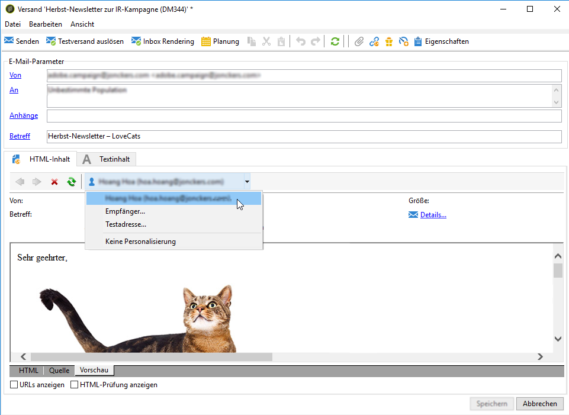
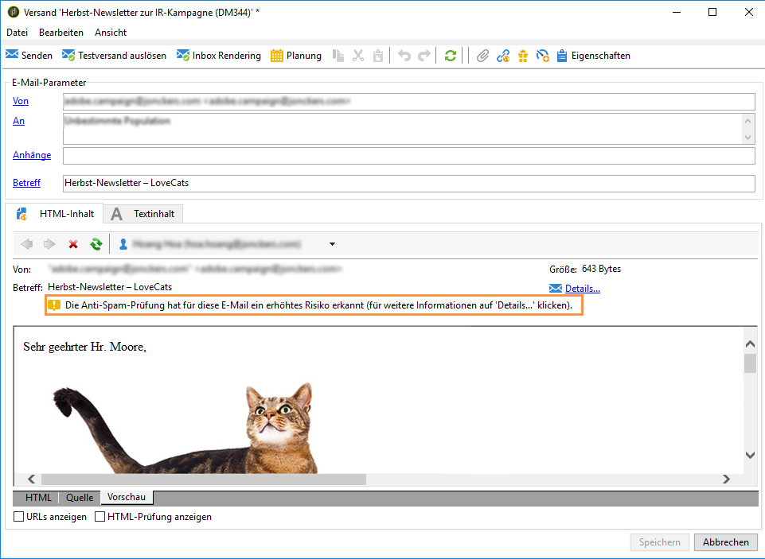
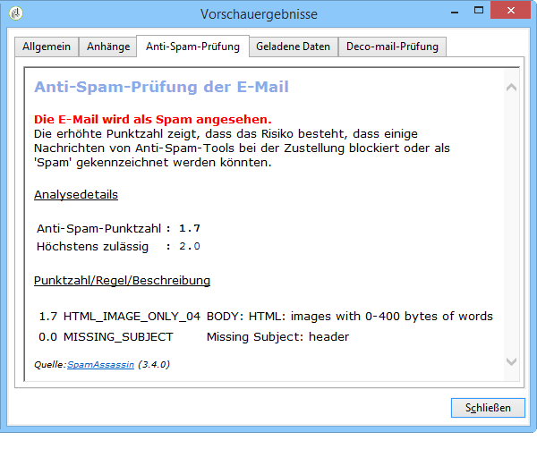

# SpamAssassin{#spamassassin}

Adobe Campaign bietet die Möglichkeit der Nutzung von [SpamAssassin](https://spamassassin.apache.org), einem Drittanbieterdienst zum Filtern von E-Mail-Spam. Mit diesem Filterprogramm wird E-Mails eine Punktzahl zugeordnet. Diese gibt Auskunft über die Wahrscheinlichkeit, von Anti-Spam-Programmen als unerwünscht eingestuft zu werden.

SpamAssassin nutzt eine Vielzahl von Spam-Erkennungs-Methoden, darunter:

* Spam-Erkennung auf der Basis des DNS und der unscharfen Prüfsumme
* Bayes&#39;sche Filtertechnologie
* Externe Programme
* Blockierungslisten
* Online-Datenbanken

>[!NOTE]
>
>SpamAssassin muss auf dem Adobe Campaign-Anwendungs-Server installiert und konfiguriert werden. Weiterführende Informationen hierzu finden Sie in [diesem Abschnitt](../../installation/using/configuring-spamassassin.md).
>
>Die Regeln, mit denen bestimmt wird, ob ein Element Spam ist oder nicht, werden über SpamAssassin verwaltet und können von einem Administrator mit den entsprechenden Berechtigungen bearbeitet werden.

## Verwenden von SpamAssassin in Campaign {#using-spamassassin}

Nachdem Sie Ihren E-Mail-Versand erstellt und seinen Inhalt definiert haben, folgen Sie den unten stehenden Schritten, um die Risiken auszuwerten.

Weiterführende Informationen zur Erstellung und Konzeption eines Versands finden Sie in [diesem Abschnitt](about-email-channel.md).

1. Gehen Sie zum Tab **[!UICONTROL Vorschau]**.
1. Wählen Sie einen Empfänger aus, um Ihren Versand in der Vorschau zu betrachten.

   

   >[!NOTE]
   >
   >Wenn Sie keinen Empfänger auswählen, kann die Anti-Spam-Prüfung nicht durchgeführt werden.

1. In einem Warnhinweis wird das Testergebnis angezeigt. Wenn ein hohes Risiko besteht, wird der folgende Warnhinweis angezeigt:

   

1. Wählen Sie den Link **[!UICONTROL Details...]** neben dem Warnhinweis aus.
1. Wählen Sie den Tab **[!UICONTROL Anti-Spam-Prüfung]** aus.
1. Gehen Sie zum Bereich **[!UICONTROL Punktzahl/Regel/Beschreibung]**, um sich die Gründe für das Risiko anzusehen.

   

>[!NOTE]
>
>Jedes Mal, wenn Sie **[!UICONTROL Anti-Spam-Prüfung]** auswählen, wird der SpamAssassin-Dienst aufgerufen und die Nachricht wird erneut analysiert. Achten Sie darauf, dass Sie den Inhalt ändern, bevor Sie die Anti-Spam-Prüfung erneut durchführen.
