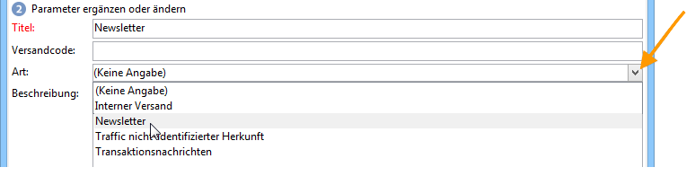

# Versand erstellen und identifizieren {#create-and-identify-the-delivery}

## Versand erstellen {#creating-the-delivery}

Die Erstellung eines Versands ist in der Übersicht oder im Menü **[!UICONTROL Erstellen > Versand]** möglich.

Klicken Sie oberhalb der Versandliste auf die Schaltfläche **[!UICONTROL Erstellen]**. Wählen Sie im Feld **[!UICONTROL Versandvorlage]** aus der Dropdown-Liste das dem gewünschten Kanal entsprechende Modell aus.

Die Plattform enthält für jeden installierten Kanal (Briefpost, E-Mail, Fax, Telefon, Mobiltelefon [SMS], Facebook, Twitter usw.) eine Vorlage.

>[!NOTE]
>
>Die in der Liste vorgeschlagenen Kanäle hängen von Ihrer Lizenz ab.

Sie können neue Versandvorlagen erstellen, um bestimmte Parameter vorab an Ihre Anforderungen anzupassen. Weiterführende Informationen zu Vorlagen finden Sie in [diesem Abschnitt](../../delivery/using/about-templates.md).

## Versand identifizieren {#identifying-the-delivery}

Zunächst muss der Versand durch Angabe der Parameter identifiziert werden. Gehen Sie dazu wie folgt vor:

1. Geben Sie im Feld **[!UICONTROL Titel]** einen Namen für den Versand ein.

   Sie können dem Versand außerdem einen Code zuordnen. Diese Informationen werden in der Versandliste angezeigt, sind für die Empfänger der Nachrichten jedoch nicht sichtbar.

1. Geben Sie im Feld **[!UICONTROL Beschreibung]** weitere, den Versand betreffende Informationen ein.
1. Wählen Sie die Versandart aus. Diese Information ist insbesondere für die Versandverfolgung nützlich, da Sie die Sendungen in Listen und Abfragen nach diesem Kriterium filtern können.

   

1. Klicken Sie auf **[!UICONTROL Fortfahren]**, um die Eingaben zu bestätigen und in das Fenster der Nachrichtenkonfiguration zu gelangen.

Der Versandinhalt ist bereit zur Konfiguration. Die Definition des Versandinhalts erfolgt für jeden Kanal einzeln. Weiterführende Informationen dazu finden Sie im entsprechenden Abschnitt:

* [E-Mail-Inhalt erstellen](../../delivery/using/defining-the-email-content.md)
* [SMS-Inhalt erstellen](../../delivery/using/sms-channel.md#defining-the-sms-content)
* [Briefpost-Inhalt definieren](../../delivery/using/defining-the-direct-mail-content.md)
* [Push-Benachrichtigungen ](../../delivery/using/about-mobile-app-channel.md)

