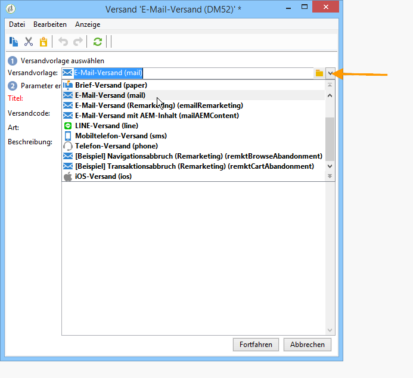
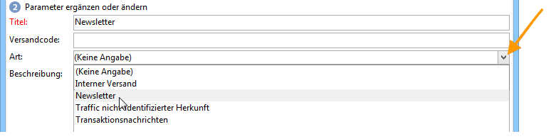

# Erstellen und Identifizieren des Versands {#create-and-identify-the-delivery}

## Erstellen des Versands {#creating-the-delivery}

Die Erstellung eines Versands ist in der Übersicht oder im Menü **[!UICONTROL Erstellen > Versand]** möglich.

Um einen Versand zu erstellen, klicken Sie über der Liste der Sendungen auf **[!UICONTROL Erstellen]**. Wenn sie einen neuen Versand erstellen, müssen Sie den zu verwendenden Versandkanal angeben.Wählen Sie im Feld **[!UICONTROL Versandvorlage]** aus der Dropdown-Liste das dem gewünschten Kanal entsprechende Modell aus.

Für jeden von Ihnen installierten Kanal wird eine Standardvorlage bereitgestellt: Briefpost, E-Mail, Fax, Telefon, Mobiltelefon (SMS), Facebook, X (früher bekannt als Twitter) usw.

>[!NOTE]
>
>Die in der Liste vorgeschlagenen Kanäle hängen von Ihrer Lizenz ab.

Sie können neue Versandvorlagen erstellen, um bestimmte Parameter vorab an Ihre Anforderungen anzupassen. Weiterführende Informationen zu Vorlagen finden Sie in [diesem Abschnitt](about-templates.md).

## Identifizieren des Versands {#identifying-the-delivery}

Sie müssen die Parameter angeben, um den Versand zu identifizieren. Gehen Sie dazu wie folgt vor:

1. Geben Sie im Feld **[!UICONTROL Titel]** einen Namen für den Versand ein.

   Außerdem kann dem Versand ein Versand-Code zugewiesen werden. Der Name des Versands und der Code werden in der Liste der Sendungen angezeigt, sind jedoch für die Empfängerinnen und Empfänger nicht sichtbar.

1. Geben Sie im Feld **[!UICONTROL Beschreibung]** weitere, den Versand betreffende Informationen ein.
1. Wählen Sie die Versandart im entsprechenden Feld aus. Diese Information ist insbesondere für die Versandverfolgung nützlich, da Sie die Sendungen in Listen und Abfragen nach diesem Kriterium filtern können.

   

1. Klicken Sie auf **[!UICONTROL Fortfahren]**, um die Eingaben zu bestätigen und in das Fenster der Nachrichtenkonfiguration zu gelangen.

Der Versandinhalt ist bereit zur Konfiguration. Die Definition des Versandinhalts erfolgt für jeden Kanal einzeln. Weiterführende Informationen dazu finden Sie im entsprechenden Abschnitt:

* [Definieren des E-Mail-Inhalts](defining-the-email-content.md)
* [Definieren des SMS-Inhalts](sms-create.md#defining-the-sms-content)
* [Definieren des Direkt-Mail-Inhalts](defining-the-direct-mail-content.md)
* [Push-Benachrichtigungen](about-mobile-app-channel.md)
