# Zielpopulation bestimmen {#defining-the-target-population}

## Über Zielpopulationen {#about-target-populations}

Für jeden Versand können verschiedene Zielpopulationen bestimmt werden. Im folgenden Abschnitt finden Sie weitere Informationen zur Auswahl von:

* Hauptempfängern des Versands – [mehr dazu](../../delivery/using/steps-defining-the-target-population.md#selecting-the-main-target)
* Empfängern von Testversandnachrichten, um einen Validierungszyklus einzurichten – [mehr dazu](../../delivery/using/steps-defining-the-target-population.md#defining-a-specific-proof-target)

Wenn der Versand außerdem in einer Marketing-Kampagne enthalten ist, können Sie auch [Testadressen](../../delivery/using/about-seed-addresses.md) und [Kontrollgruppen](../../campaign/using/marketing-campaign-deliveries.md#defining-a-control-group) definieren.

## Hauptempfänger des Versands auswählen {#selecting-the-main-target}

Meistens wird die Hauptzielgruppe aus der Adobe Campaign-Datenbank extrahiert (Standardmodus). Empfänger können aber auch in einer externen Datei gespeichert werden. Weiterführende Informationen finden Sie in diesem [Abschnitt](../../delivery/using/steps-defining-the-target-population.md#selecting-external-recipients).

Um die Versandempfänger auszuwählen, gehen Sie wie folgt vor:

1. Wählen Sie im Versand-Editor **[!UICONTROL An]** aus.
1. Wählen Sie die erste Option, wenn Ihre Empfänger in der Datenbank gespeichert sind.

   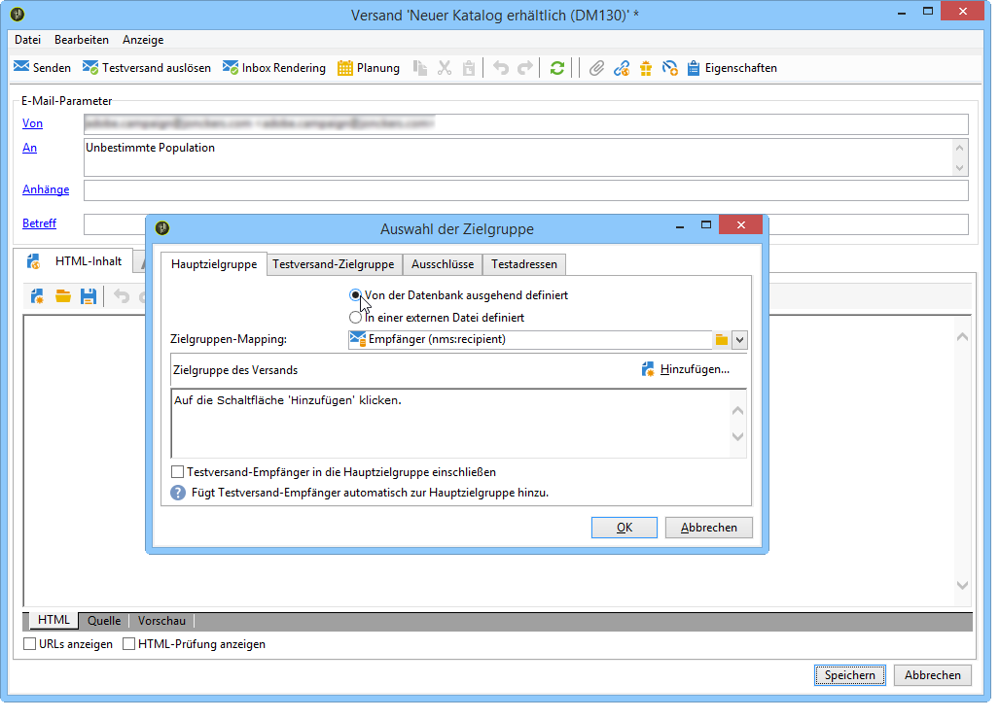

1. Wählen Sie Zielgruppen-Mapping aus der Dropdown-Liste **[!UICONTROL Zielgruppen-Mapping]** aus. Die Adobe-Campaign-Standardeinstellung für Zielgruppen-Mapping ist **[!UICONTROL Empfänger]**, basierend auf dem Schema **nms:recipient**.

   Es sind weitere Zielgruppen-Mappings verfügbar, von denen sich einige auf Ihre spezifische Konfiguration beziehen können. Weitere Informationen zu Zielgruppen-Mappings finden Sie unter [Zielgruppen-Mapping wählen](../../delivery/using/selecting-a-target-mapping.md).

1. Wählen Sie zur Konfiguration von Einschränkungsfiltern die Schaltfläche **[!UICONTROL Hinzufügen]** aus.

   Sie haben die Wahl zwischen verschiedenen Filtertypen:

   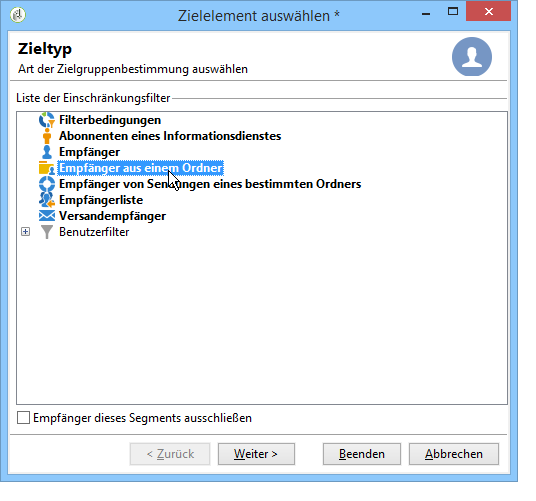

   Sie können zwischen verschiedenen Empfängerarten wählen. Markieren Sie den gewünschten Filter und klicken Sie auf **[!UICONTROL Weiter]**. Für jede Zielgruppe können Sie durch Klick auf den Tab **[!UICONTROL Vorschau]** die entsprechenden Empfänger anzeigen. Für gewisse Zieltypen erlaubt die Schaltfläche **[!UICONTROL Zielgruppe einschränken]** die Kombination verschiedener Filterkriterien.

   Folgende Zieltypen werden standardmäßig vorgeschlagen:

   * **[!UICONTROL Filterbedingungen]**: Erstellung einer Abfrage mit der Möglichkeit der Vorschau auf das Ergebnis. Näheres zur Erstellung von Abfragen finden Sie in [diesem Abschnitt](../../platform/using/creating-filters.md#creating-an-advanced-filter).
   * **[!UICONTROL Abonnenten eines Informationsdienstes]**: Angabe des Newsletters, den die Empfänger abonniert haben müssen, um in die Zielgruppe des Versands aufgenommen zu werden.

      

   * **[!UICONTROL Versandempfänger]**: Angabe des Versands in der Liste, den die Empfänger erhalten haben müssen, um in die Zielgruppe des aktuellen Versands aufgenommen zu werden.

      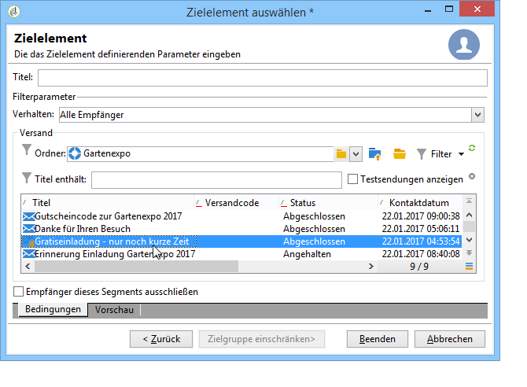

   * **[!UICONTROL Empfänger von Sendungen eines bestimmten Ordners]**: Angabe eines Ordners mit Sendungen, deren Zielgruppen erneut als Empfänger ausgewählt werden sollen.

      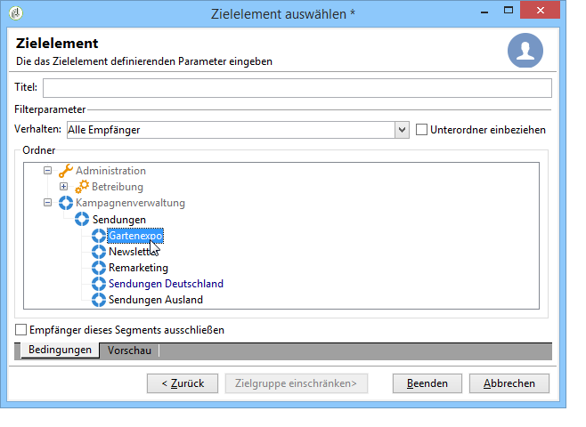

      Sie können außerdem die Liste der Empfänger nach deren Verhalten beim Empfang früherer E-Mails einschränken:

      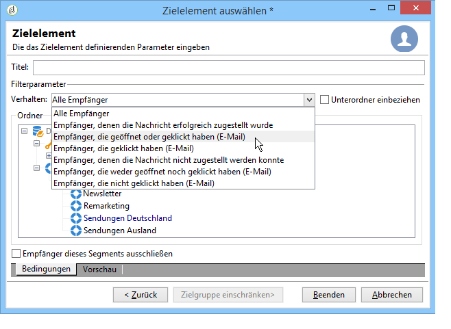

      >[!NOTE]
      >
      >Die Option **[!UICONTROL Unterordner einbeziehen]** dehnt den Kreis der Empfänger auf die in Unterordnern des ausgewählten Knotens enthaltenen Sendungen aus.

   * **[!UICONTROL Empfänger aus einem Ordner]**: Angabe des Ordners, der die Empfänger erhält.
   * **[!UICONTROL Empfänger]**: Auswahl eines spezifischen Empfängers aus der Datenbank.
   * **[!UICONTROL Empfängerliste]**: Auswahl einer die Empfänger enthaltenden Liste. Weiterführende Informationen zu Listen finden Sie in [diesem Abschnitt](../../platform/using/creating-and-managing-lists.md).
   * **[!UICONTROL Benutzerfilter]**: ermöglicht den Zugriff auf vom Benutzer erstellte Filter. Weiterführende Informationen zu Benutzerfiltern finden Sie in [diesem Abschnitt](../../platform/using/creating-filters.md#saving-a-filter).
   * Die Option **[!UICONTROL Empfänger dieses Segments ausschließen]** ermöglicht es, die Zielbestimmung umzukehren. Der Versand wird nicht an die Empfänger gerichtet, die den Filterkriterien entsprechen, sondern im Gegenteil an jene, die ihnen nicht entsprechen. Kreuzen Sie in diesem Fall die Option an und konfigurieren Sie die Zielgruppe wie zuvor beschrieben.

      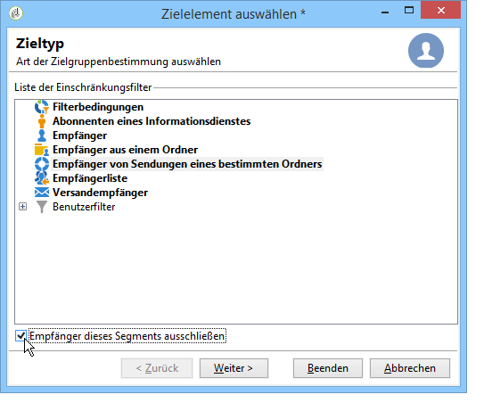

1. Standardmäßig wird der Filter nach dem ersten Kriterium benannt. Vergeben Sie daher im Fall von kombinierten Kriterien im Feld **[!UICONTROL Titel]** einen expliziten Namen.
1. Bestätigen Sie die Zielgruppenkonfiguration durch Klick auf die Schaltfläche **[!UICONTROL Beenden]**.

   Die derart festgelegten Zielbestimmungskriterien werden im mittleren Bereich des Hauptzielgruppe-Tabs zusammengefasst. Durch Klick auf ein Kriterium können Sie seinen Inhalt (Konfiguration und Vorschau) prüfen. Klicken Sie auf das rote Kreuz rechts, um das Kriterium zu löschen.

   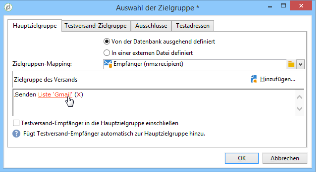

### Externe Empfänger auswählen {#selecting-external-recipients}

Sie haben die Möglichkeit, einen Versand an Empfänger zu richten, deren Profile nicht in der Datenbank, sondern in einer externen Datei gespeichert sind. In unserem Beispiel führen wir einen Versand an Empfänger durch, die aus einer Textdatei importiert wurden.

Gehen Sie dazu wie folgt vor:

1. Wählen Sie den Link **[!UICONTROL An]** aus, um die Empfänger Ihres Versands festzulegen.
1. Wählen Sie die Option **[!UICONTROL In einer externen Datei definiert]** aus.

   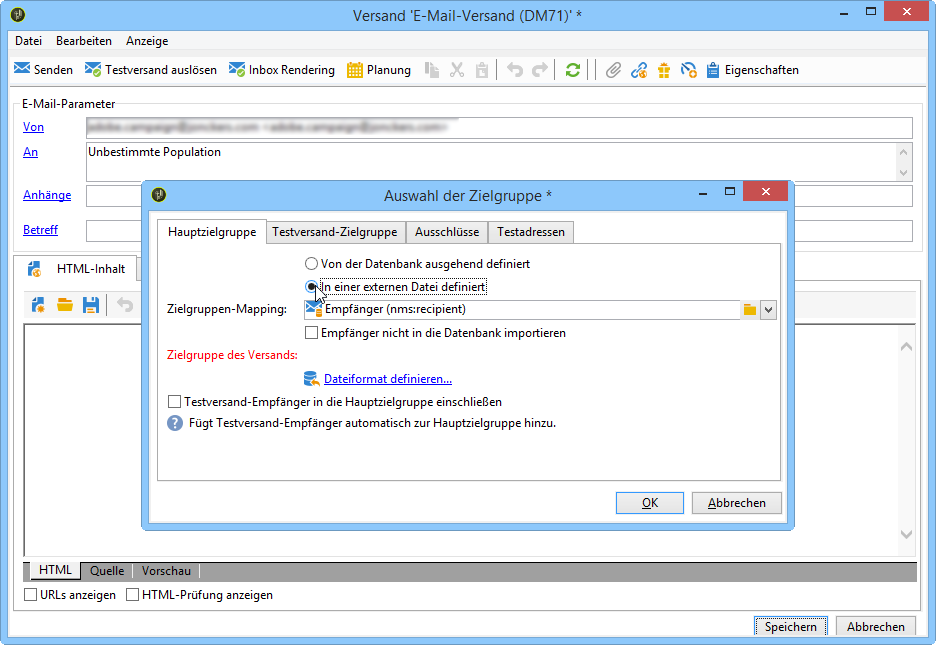

1. Standardmäßig werden Empfänger in die Datenbank importiert. Sie müssen das **[!UICONTROL Zielgruppen-Mapping]** auswählen. Weitere Informationen zu Zielgruppen-Mappings finden Sie unter [Zielgruppen-Mapping wählen](../../delivery/using/selecting-a-target-mapping.md)

   Sie können auch **[!UICONTROL Empfänger nicht in die Datenbank importieren]** auswählen.

1. Wählen Sie beim Import der Empfänger den Link **[!UICONTROL Dateiformat definieren...]** aus, um die externe Datei auszuwählen und zu konfigurieren.

   Weitere Informationen zum Datenimport finden Sie in [diesem Abschnitt](../../platform/using/importing-data.md#step-2---source-file-selection).

1. Wählen Sie **[!UICONTROL Beenden]** und konfigurieren Sie Ihren Versand als Standardversand.

>[!CAUTION]
>
>Schließen Sie bei einem externen E-Mail-Versand bei der Inhaltserstellung keinen Mirrorseite-Link ein. Die Seite kann bei dieser Versandart nicht erstellt werden.

### Ausschlussparameter einstellen {#customizing-exclusion-settings}

Fehlerhafte Adressen und der Qualitätsindex werden vom Dienstleister übermittelt. Diese Informationen werden nach Durchführung des Versands und dem Laden der Ergebnisdatei des Dienstleisters automatisch im Empfängerprofil aktualisiert. Hier werden sie angezeigt, können aber nicht geändert werden.

Es besteht die Möglichkeit, Adressen, für die die maximal zulässige Fehleranzahl erreicht wurde oder deren Qualitätsindex unter der in diesem Fenster angegebenen Schwelle liegt, vom Versand auszuschließen. Das Gleiche gilt für nicht-qualifizierte Adressen, d. h. solche, für die keine Informationen vonseiten des Dienstleisters übermittelt wurden.

>[!NOTE]
>
>Wenn zwei Empfänger eines Briefpost-Versands denselben Vornamen, Nachnamen, dieselbe Postleitzahl und Stadt haben, wird ein Duplikat erzeugt, das nicht berücksichtigt wird.

Der Tab **[!UICONTROL Ausschlüsse]** ermöglicht es, die Anzahl an Nachrichten zu begrenzen.

>[!NOTE]
>
>Die Standardparameter werden empfohlen, Sie können die Einstellungen nach Bedarf anpassen. Diese Optionen sollten jedoch nur von einem Experten geändert werden, um Missbrauch und Fehler zu vermeiden.

Wählen Sie den Link **[!UICONTROL Bearbeiten...]** aus, um die Standardkonfiguration zu ändern.

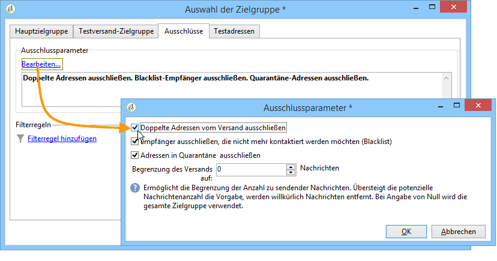

Folgende Optionen stehen zur Verfügung:

* **[!UICONTROL Doppelte Adressen vom Versand ausschließen]**: Diese standardmäßig aktivierte Option dedupliziert die E-Mail-Adressen vor dem Versand. Die Vorgehensweise hängt dabei von der Art der Verwendung der Adobe-Campaign-Software und den in der Datenbank enthaltenen Daten ab.

   Der Standardwert dieser Option kann für jede Versandvorlage konfiguriert werden.

   Beispiel:

   * Newsletter-Versand oder elektronische Zustellung von Dokumenten: keine Deduplizierung (in den Fällen, in denen definitionsgemäß keine Dubletten zu erwarten sind). Lebensgefährten, die sich mit derselben E-Mail-Adresse angemeldet haben, können erwarten, zwei unterschiedlich personalisierte Nachrichten mit dem jeweiligen Vor- und Nachnamen zu erhalten. In diesem Fall kann die Option abgewählt werden.
   * Versand im Rahmen einer Marketingkampagne: Um eine Überflutung der Empfänger mit E-Mails zu vermeiden, ist die Deduplizierung unbedingt zu empfehlen. In diesem Fall kann diese Option angekreuzt werden.

      Bei Abwahl der Option erscheint eine zusätzliche Auswahlmöglichkeit: **[!UICONTROL In der Zielgruppe doppelt enthaltene Datensätze (identische Kennung) beibehalten]**. Sie ermöglicht die Zustellung mehrerer Nachrichten, wenn ein Empfänger verschiedenen Zielbedingungen entspricht.

      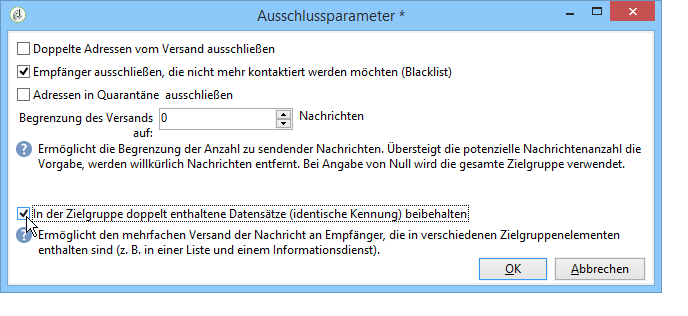

* **[!UICONTROL Schließen Sie Empfänger aus, die nicht mehr kontaktiert]** werden möchten, d. h. Empfänger, deren E-Mail-Adressen sich auf einer Blockierungsliste („Opt-out“) befinden. Diese Option muss ausgewählt bleiben, um die Berufsethik des E-Marketings und die Gesetze hinsichtlich E-Commerce einzuhalten.
* **[!UICONTROL Adressen in Quarantäne ausschließen]**: schließt die Empfänger aus, für die frühere Zustellversuche fehlgeschlagen sind. Es wird dringend empfohlen, diese Option NICHT ABZUWÄHLEN.

   >[!NOTE]
   >
   >Weitere Informationen zur Quarantäneverwaltung finden Sie unter [Funktionsweise der Quarantäneverwaltung](../../delivery/using/understanding-quarantine-management.md).

* **[!UICONTROL Begrenzung des Versands]** auf eine gewisse Anzahl an Nachrichten: Es wird höchstens die angegebene Anzahl an Nachrichten gesendet, wobei die auszuschließenden Empfänger zufällig aus der Zielgruppe ausgewählt werden.

### Größe der Zielpopulation verringern {#reducing-the-size-of-the-target-population}

Sie können die Größe der Zielpopulation verringern. Geben Sie dazu die Anzahl der Empfänger an, die im Feld **[!UICONTROL Anz. abzurufender Datensätze]** exportiert werden sollen.

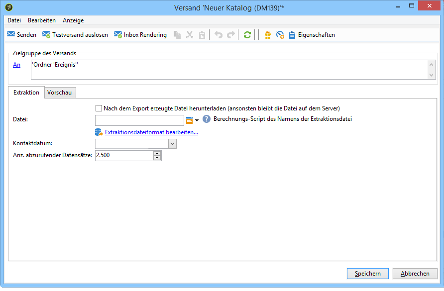

## Empfänger von Testversandnachrichten auswählen {#selecting-the-proof-target}

Ein Testversand ist eine spezifische Nachricht, die den eigentlichen Versand prüft, bevor er an die Hauptzielgruppe gesendet wird. Die Testversand-Empfänger sind verantwortlich für die Überprüfung des Inhalts und der Form von Sendungen.

 [Entdecken Sie diese Funktion im Video](#seeds-and-proofs-video).

Um die Testversand-Zielgruppe auszuwählen, gehen Sie wie folgt vor:

1. Wählen Sie den Link **[!UICONTROL An]** aus.
1. Wählen Sie den Tab **[!UICONTROL Testversand-Zielgruppe]** aus.
1. Wählen Sie über das Feld **[!UICONTROL Zielgruppenbestimmungsmodus]** die anzuwendende Methode aus: **[!UICONTROL Bestimmung einer speziellen Testversand-Zielgruppe]**, **[!UICONTROL Adressersetzung]**, **[!UICONTROL Testadressen]** oder **[!UICONTROL Spezifische Zielgruppe und Testadressen]**.

>[!NOTE]
>
>Im Regelfall kann die Testversand-Zielgruppe in die Hauptzielgruppe eingeschlossen werden. Kreuzen Sie hierfür die entsprechende Option im unteren Bereich des **[!UICONTROL Hauptzielgruppe]**-Tabs an.

## Spezifische Testversand-Zielgruppe definieren {#defining-a-specific-proof-target}

Bei der Auswahl der Testversand-Zielgruppe können Sie über die Option **[!UICONTROL Bestimmung einer speziellen Testversand-Zielgruppe]** die Empfänger des Testversands aus den Profilen in der Datenbank auswählen.

Wählen Sie diese Option aus, um mit der Schaltfläche **[!UICONTROL Hinzufügen]** Empfänger ähnlich der Definition der Hauptzielgruppe auszuwählen. Siehe [Hauptzielgruppe auswählen](../../delivery/using/steps-defining-the-target-population.md#selecting-the-main-target).

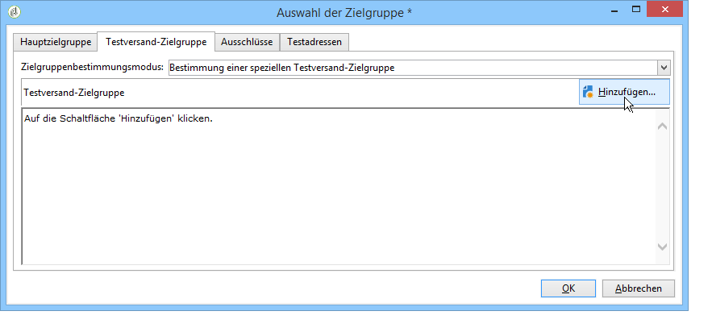

Weiterführende Informationen zum Testversand finden Sie in [diesem Abschnitt](../../delivery/using/steps-validating-the-delivery.md#sending-a-proof).

### Adressersetzung beim Testversand verwenden {#using-address-substitution-in-proof}

Anstatt bestimmte Empfänger in der Datenbank auszuwählen, können Sie die Option **[!UICONTROL Adressersetzung]** verwenden.

Mit dieser Option können Sie die Profile aus der Zielgruppe verwenden, bei denen die E-Mail-Adressen durch eine oder mehrere andere Adressen ersetzt werden, die den Testversand erhalten.

Ein spezifisches Fenster ermöglicht die Angabe der Testversand-Adressen und die Konfiguration der Ersetzung(en).

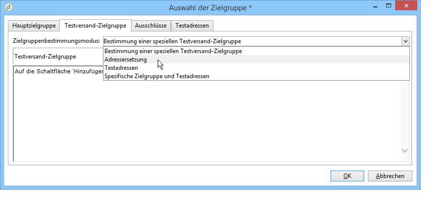

Gehen Sie dazu wie folgt vor:

1. Wählen Sie **[!UICONTROL Hinzufügen]** aus.
1. Geben Sie die zu verwendende E-Mail-Adresse ein oder wählen Sie sie aus der Liste aus.
1. Wählen Sie das zu verwendende Profil im Testversand aus: Sie können in der Spalte **[!UICONTROL Zu verwendendes Profil]** entweder den Wert **[!UICONTROL Zufällig]** beibehalten

   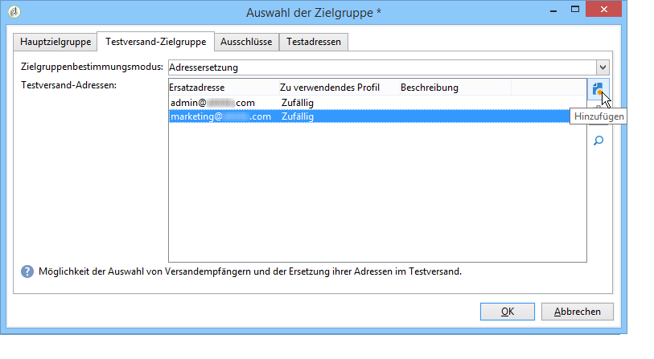

1. oder auf das Symbol **[!UICONTROL Details]** (Lupe) klicken, um ein Profil aus der Hauptzielgruppe auszuwählen.

   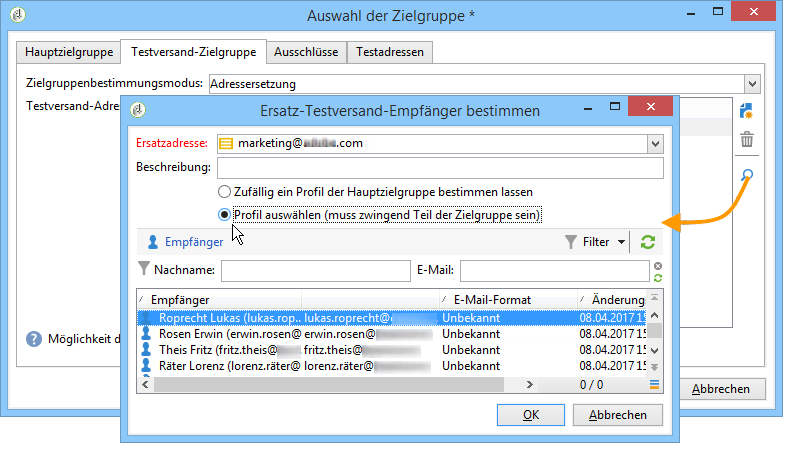

   Konfigurieren Sie so viele Ersatzadressen wie nötig.

## Testadressen als Zielgruppe verwenden {#using-seed-addresses-as-proof}

Sie können **[!UICONTROL Testadressen]** als Testversand-Zielgruppe verwenden: Mit dieser Option können Sie eine Testadressenliste verwenden oder importieren.

>[!NOTE]
>
>Die Testadressen werden unter [Über Testadressen](../../delivery/using/about-seed-addresses.md) vorgestellt.

Mit der Option **[!UICONTROL Spezifische Zielgruppe und Testadressen]** können Sie die Bestimmung einer speziellen Testversand-Zielgruppe und die Verwendung von Testadressen kombinieren. Die entsprechende Konfiguration erfolgt dann in zwei getrennten Tabs.

## Verwalten von Testadressen und Testsendungen in einer E-Mail {#seeds-and-proofs-video}

In diesem Video erfahren Sie, wie Sie einer vorhandenen E-Mail Testadressen und Testsendungen hinzufügen und diese ausführen.

>[!VIDEO](https://video.tv.adobe.com/v/25606?quality=12&captions=ger)

Siehe auch:
* [Testversand-Zielgruppe auswählen](#selecting-the-proof-target)

* [Über Testadressen](../../delivery/using/about-seed-addresses.md)

* [Anwendungsbeispiel: Auswahl von Testadressen nach Kriterien](../../delivery/using/use-case--selecting-seed-addresses-on-criteria.md)
