# Bestimmen der Zielpopulation {#defining-the-target-population}

Für jeden Versand können verschiedene Zielpopulationen bestimmt werden:

* **Haupt-Zielgruppe**: Profile, die Nachrichten empfangen. [Weitere Informationen](steps-defining-the-target-population.md#selecting-the-main-target)
* **Testversand**: Empfänger von Nachrichten in Testsendungen, die am Validierungszyklus beteiligt sind. [Weitere Informationen](steps-defining-the-target-population.md#defining-a-specific-proof-target)
* **Testadressen**: Empfänger, die nicht zur Zielgruppe des Versands gehören, aber den Versand erhalten (nur im Rahmen einer Marketing-Kampagne). [Weitere Informationen](about-seed-addresses.md)
* **Kontrollgruppen**: Population, die den Versand nicht erhält und verwendet wird, um das Verhalten und die Auswirkungen der Kampagne zu verfolgen (nur im Rahmen einer Marketing-Kampagne). [Weitere Informationen](../../campaign/using/marketing-campaign-target.md#defining-a-control-group).

## Auswahl der Hauptempfänger des Versands {#selecting-the-main-target}

Meistens wird die Hauptzielgruppe aus der Adobe Campaign-Datenbank extrahiert (Standardmodus). Empfänger können aber auch in einer externen Datei gespeichert werden. Weiterführende Informationen finden Sie in diesem [Abschnitt](steps-defining-the-target-population.md#selecting-external-recipients).

Um die Versandempfänger auszuwählen, gehen Sie wie folgt vor:

1. Wählen Sie im Versand-Editor **[!UICONTROL An]** aus.
1. Wählen Sie die erste Option, wenn Ihre Empfänger in der Datenbank gespeichert sind.

   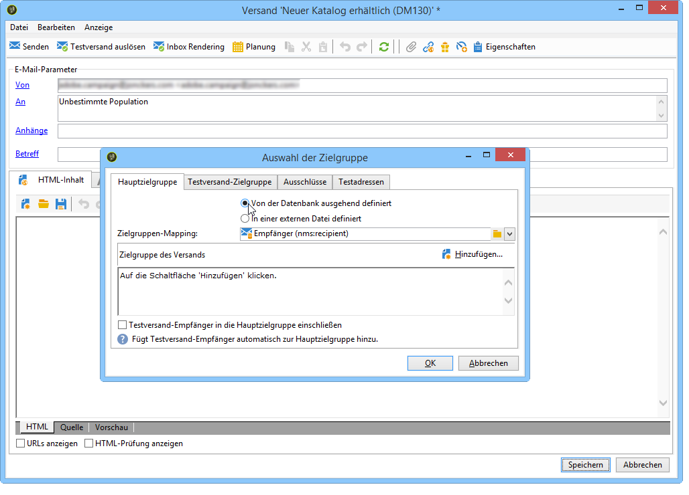

1. Wählen Sie Zielgruppen-Mapping aus der Dropdown-Liste **[!UICONTROL Zielgruppen-Mapping]** aus. Die Adobe Campaign-Standardeinstellung für Zielgruppen-Mapping ist **[!UICONTROL Empfänger]**, basierend auf dem Schema **nms:recipient**.

   Es sind weitere Zielgruppen-Mappings verfügbar, von denen sich einige auf Ihre spezifische Konfiguration beziehen können.[Weitere Informationen](#select-a-target-mapping).

1. Wählen Sie zur Konfiguration von Einschränkungsfiltern die Schaltfläche **[!UICONTROL Hinzufügen]** aus.

   Sie haben die Wahl zwischen verschiedenen Filtertypen:

   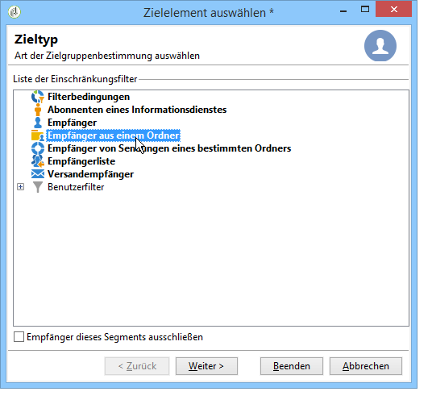

   Sie können zwischen verschiedenen Empfängerarten wählen. Markieren Sie den gewünschten Filter und klicken Sie auf **[!UICONTROL Weiter]**. Für jede Zielgruppe können Sie durch Klick auf den Tab **[!UICONTROL Vorschau]** die entsprechenden Empfänger anzeigen. Für gewisse Zieltypen erlaubt die Schaltfläche **[!UICONTROL Zielgruppe einschränken]** die Kombination verschiedener Filterkriterien.

   Folgende Zieltypen werden standardmäßig vorgeschlagen:

   * **[!UICONTROL Filterbedingungen]**: Erstellung einer Abfrage mit der Möglichkeit der Vorschau auf das Ergebnis. Weitere Informationen zu Filtern finden Sie in der [Dokumentation zu Campaign v8 (Konsole)](https://experienceleague.adobe.com/de/docs/campaign/campaign-v8/audience/create-filters){target=_blank}.
   * **[!UICONTROL Abonnenten eines Informationsdienstes]**: Angabe des Newsletters, den die Empfänger abonniert haben müssen, um in die Zielgruppe des Versands aufgenommen zu werden.

     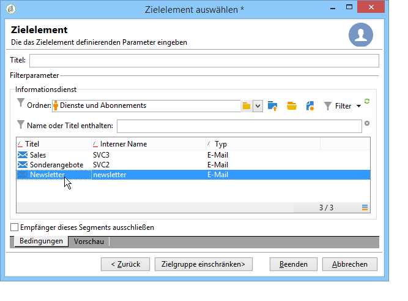

   * **[!UICONTROL Empfänger eines Versands]** Mit dieser Option können Sie die Empfänger eines bestehenden Versands als Zielgruppenbestimmungskriterium definieren. Sie müssen dann den Versand in der Liste auswählen:

     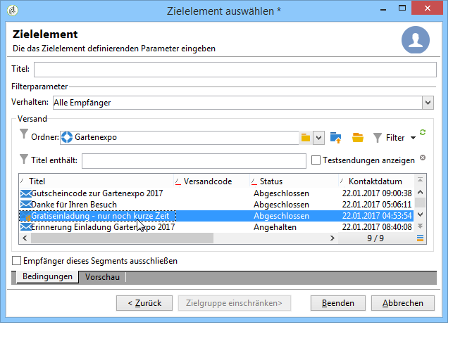

   * **[!UICONTROL Empfänger von Sendungen eines bestimmten Ordners]**: Angabe eines Ordners mit Sendungen, deren Zielgruppen erneut als Empfänger ausgewählt werden sollen.

     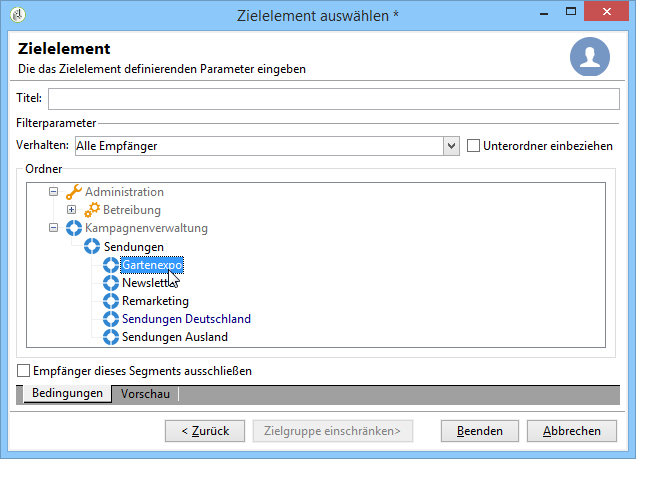

     Sie können außerdem die Liste der Empfänger nach deren Verhalten beim Empfang früherer E-Mails einschränken:

     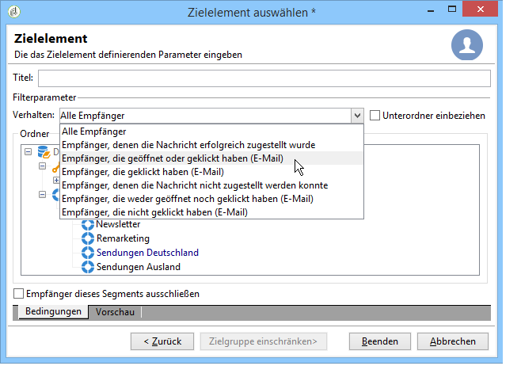

     >[!NOTE]
     >
     >Die Option **[!UICONTROL Unterordner einbeziehen]** dehnt den Kreis der Empfänger auf die in Unterordnern des ausgewählten Knotens enthaltenen Sendungen aus.

   * **[!UICONTROL Empfänger aus einem Ordner]**: Angabe des Ordners, der die Empfänger erhält.
   * **[!UICONTROL Empfänger]**: Auswahl eines spezifischen Empfängers aus der Datenbank.
   * **[!UICONTROL Empfängerliste]**: Auswahl einer die Empfänger enthaltenden Liste. Listen finden Sie in [diesem Abschnitt](../../platform/using/creating-and-managing-lists.md).
   * **[!UICONTROL Benutzerfilter]**: ermöglicht den Zugriff auf vom Benutzer erstellte Filter. Weitere Informationen zu Filtern finden Sie in der [Dokumentation zu Campaign v8 (Konsole)](https://experienceleague.adobe.com/de/docs/campaign/campaign-v8/audience/create-filters){target=_blank}.
   * Mit der Option **[!UICONTROL Empfänger ausschließen, die diesem Segment]**, können Sie Empfänger auswählen, die die definierten Zielgruppenkriterien nicht erfüllen. Um diese Option zu verwenden, aktivieren Sie das entsprechende Kontrollkästchen und wenden Sie dann die Zielgruppenbestimmung an (wie zuvor definiert), um die resultierenden Profile auszuschließen.

     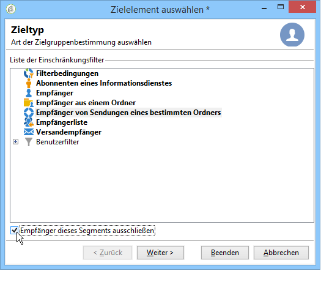

1. Geben Sie im Feld **[!UICONTROL Titel]** einen Namen für diese Zielgruppenbestimmung ein. Der Titel entspricht standardmäßig dem Titel der ersten Zielgruppenbestimmung. Für eine Kombination ist es besser, einen expliziten Namen zu verwenden.
1. Bestätigen Sie die konfigurierte Zielgruppenbestimmung durch Klick auf die Schaltfläche **[!UICONTROL Beenden]**.

   Die definierten Zielgruppenkriterien werden im zentralen Abschnitt der Hauptregisterkarte der Zielkonfiguration zusammengefasst. Klicken Sie auf ein Kriterium, um seinen Inhalt anzuzeigen (Konfiguration und Vorschau). Um ein Kriterium zu löschen, klicken Sie auf das Kreuz hinter seinem Titel.

   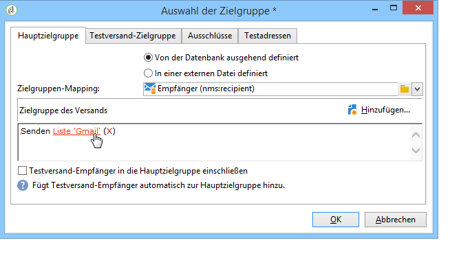

### Auswahl externer Empfänger {#selecting-external-recipients}

Sie können einen Versand an Empfängerinnen und Empfänger starten, die nicht in der Datenbank gespeichert, sondern in einer externen Datei gespeichert sind. Wir senden hier beispielsweise einen Versand an Empfängerinnen und Empfänger, die aus einer Textdatei importiert wurden.

Gehen Sie dazu wie folgt vor:

1. Wählen Sie den Link **[!UICONTROL An]** aus, um die Empfänger Ihres Versands festzulegen.
1. Wählen Sie die Option **[!UICONTROL In einer externen Datei definiert]** aus.

   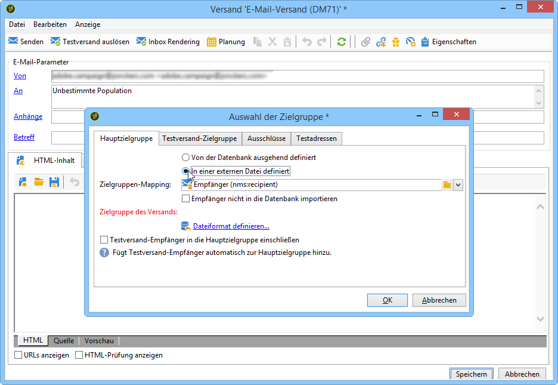

1. Standardmäßig werden Empfängerinnen und Empfänger in die Datenbank importiert. Sie müssen das **[!UICONTROL Zielgruppen-Mapping]** auswählen. [Weitere Informationen](#select-a-target-mapping)

   Sie können auch **[!UICONTROL Empfänger nicht in die Datenbank importieren]** auswählen.

1. Wählen Sie beim Import der Empfänger den Link **[!UICONTROL Dateiformat definieren...]** aus, um die externe Datei auszuwählen und zu konfigurieren.

   Weitere Informationen zum Datenimport finden Sie in [diesem Abschnitt](../../platform/using/executing-import-jobs.md#step-2---source-file-selection).

1. Wählen Sie **[!UICONTROL Beenden]** und konfigurieren Sie Ihren Versand als Standardversand.

>[!CAUTION]
>
>Schließen Sie bei einem externen E-Mail-Versand bei der Inhaltserstellung keinen Mirrorseite-Link ein. Die Seite kann bei dieser Versandart nicht erstellt werden.

### Definieren von Ausschlusseinstellungen {#define-exclusion-settings}

Adressfehler und Qualitätsbewertungen werden vom Dienstleister (IAP) bereitgestellt. Diese Informationen werden im Empfängerprofil nach den Versandaktionen automatisch mit den von den Dienstleistern zurückgegebenen Dateien aktualisiert. Es kann im Profil schreibgeschützt angezeigt werden.

Sie können Adressen ausschließen, die eine bestimmte Anzahl aufeinander folgender Fehler erreicht haben oder deren Qualitätsbewertung unter einem in diesem Fenster angegebenen Schwellenwert liegt. Das Gleiche gilt für nicht-qualifizierte Adressen, d. h. solche, für die keine Informationen vonseiten des Dienstleisters übermittelt wurden.

>[!NOTE]
>
>Wenn zwei Empfänger eines Briefpost-Versands denselben Vornamen, Nachnamen, dieselbe Postleitzahl und Stadt haben, wird ein Duplikat erzeugt, das nicht berücksichtigt wird.

Der Tab **[!UICONTROL Ausschlüsse]** ermöglicht es, die Anzahl an Nachrichten zu begrenzen.

>[!NOTE]
>
>Standardparameter werden empfohlen. Sie können die Einstellungen jedoch an Ihre Anforderungen anpassen. Diese Optionen sollten jedoch nur von einem erfahrenen Benutzer geändert werden, um Missbrauch und Fehler zu vermeiden.

Wählen Sie den Link **[!UICONTROL Bearbeiten...]** aus, um die Standardkonfiguration zu ändern.

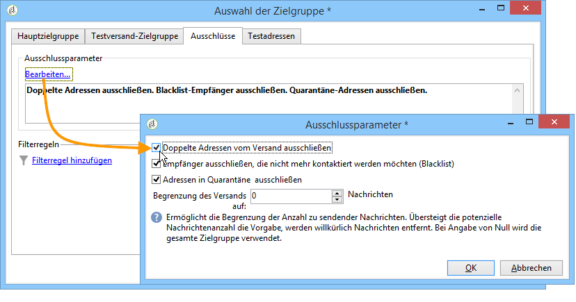

Folgende Optionen stehen zur Verfügung:

* **[!UICONTROL Doppelte Adressen beim Versand ausschließen]**. Diese Option ist standardmäßig aktiviert: Sie verhindert doppelte E-Mail-Adressen während des Versands. Die Vorgehensweise hängt dabei von der Art der Verwendung der Adobe Campaign-Software und den in der Datenbank enthaltenen Daten ab.

  Der Standardwert dieser Option kann für jede Versandvorlage konfiguriert werden.

  Beispiel:

   * Versand eines Newsletters oder eines elektronischen Dokuments. In einigen Fällen werden Duplikate nicht ausgeschlossen, wenn die Daten keine nativen Duplikate enthalten. Bei einem Abonnement mit derselben E-Mail-Adresse kann man davon ausgehen, dass es zwei spezifische personalisierte E-Mail-Nachrichten erhält: eine an jede Person mit Namen. In diesem Fall kann diese Option deaktiviert werden.
   * Versand einer Marketing-Kampagne: Ein doppelter Ausschluss ist unerlässlich, um zu vermeiden, dass zu viele Nachrichten an denselben Empfänger gesendet werden. In diesem Fall kann diese Option ausgewählt werden.

     Wenn Sie diese Option deaktivieren, können Sie auf eine zusätzliche Option zugreifen: **[!UICONTROL Dubletten (identische Kennung) beibehalten]**. Auf diese Weise können Sie mehrere Sendungen an Empfängerinnen und Empfänger genehmigen, die mehrere Zielgruppenbestimmungskriterien erfüllen.

     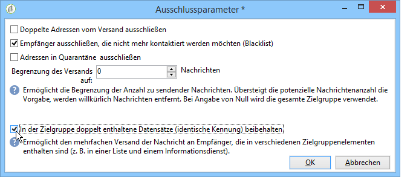

* **[!UICONTROL Schließen Sie Empfänger aus, die nicht mehr kontaktiert]** werden möchten, d. h. Empfänger, deren E-Mail-Adressen sich auf einer Blockierungsliste (&quot;Opt-out&quot;) befinden. Diese Option muss ausgewählt bleiben, um die Berufsethik des E-Marketings und die Gesetze hinsichtlich E-Commerce einzuhalten.
* **[!UICONTROL Adressen in Quarantäne ausschließen]**. Mit dieser Option können Sie alle Profile mit einer Adresse, die nicht antwortet, aus der Zielgruppe ausschließen. Es wird dringend empfohlen, diese Option aktiviert zu lassen.

  >[!NOTE]
  >
  >Weitere Informationen zur Quarantäneverwaltung finden Sie unter [Funktionsweise der Quarantäneverwaltung](delivery-failures-quarantine.md).

* **[!UICONTROL Versand begrenzen]** auf eine bestimmte Anzahl von Nachrichten. Mit dieser Option können Sie die maximale Anzahl der zu sendenden Nachrichten eingeben. Wenn der Inhalt der Zielgruppe die angegebene Anzahl von Nachrichten überschreitet, wird eine Zufallsauswahl auf die Zielgruppe angewendet.

### Verringern der Größe der Zielpopulation {#reducing-the-size-of-the-target-population}

Sie können die Größe der Zielpopulation verringern. Geben Sie dazu die Anzahl der Empfänger an, die im Feld **[!UICONTROL Anz. abzurufender Datensätze]** exportiert werden sollen.

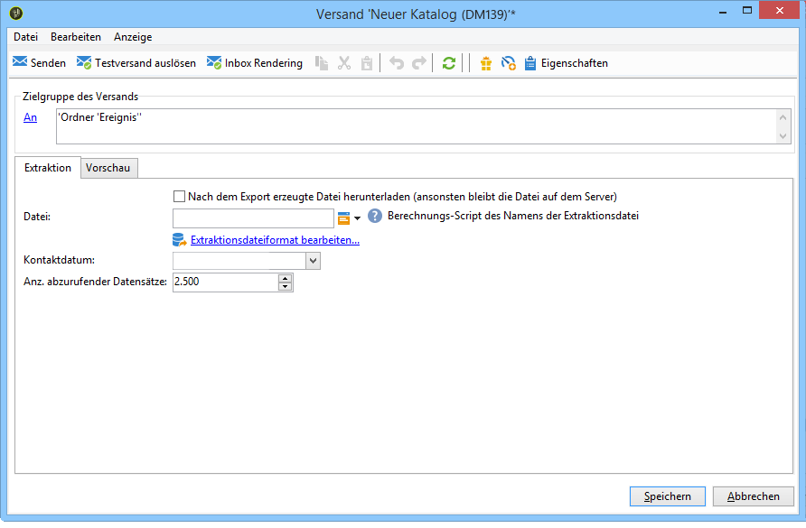

## Auswählen der Empfänger von Testversandnachrichten {#selecting-the-proof-target}

Der Testversand ist eine spezielle Nachricht, mit der Sie einen Versand testen können, bevor Sie ihn an die Hauptzielgruppe senden. Die Testversand-Empfänger sind sowohl für die Validierung des Formulars als auch des Inhalts der Nachricht verantwortlich.

 [Funktion im Video kennenlernen](#seeds-and-proofs-video).

Um die Testversand-Zielgruppe auszuwählen, gehen Sie wie folgt vor:

1. Wählen Sie den Link **[!UICONTROL An]** aus.
1. Wählen Sie den Tab **[!UICONTROL Testversand-Zielgruppe]** aus.
1. Wählen Sie über das Feld **[!UICONTROL Zielgruppenbestimmungsmodus]** die anzuwendende Methode aus: **[!UICONTROL Bestimmung einer speziellen Testversand-Zielgruppe]**, **[!UICONTROL Adressersetzung]**, **[!UICONTROL Testadressen]** oder **[!UICONTROL Spezifische Zielgruppe und Testadressen]**.

>[!NOTE]
>
>Im Regelfall kann die Testversand-Zielgruppe in die Hauptzielgruppe eingeschlossen werden. Kreuzen Sie hierfür die entsprechende Option im unteren Bereich des **[!UICONTROL Hauptzielgruppe]**-Tabs an.

## Definieren einer spezifischen Testversand-Zielgruppe {#defining-a-specific-proof-target}

Bei der Auswahl der Testversand-Zielgruppe können Sie über die Option **[!UICONTROL Bestimmung einer speziellen Testversand-Zielgruppe]** die Empfänger des Testversands aus den Profilen in der Datenbank auswählen.

Wählen Sie diese Option aus, um mit der Schaltfläche **[!UICONTROL Hinzufügen]** Empfänger ähnlich der Definition der Hauptzielgruppe auszuwählen. Siehe [Auswählen der Hauptzielgruppe](steps-defining-the-target-population.md#selecting-the-main-target).

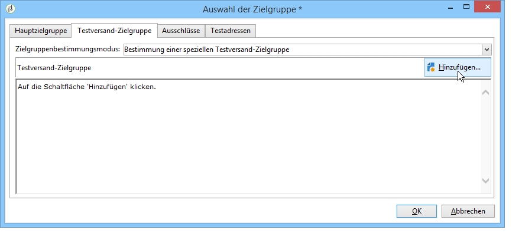

Weiterführende Informationen zum Testversand finden Sie in [diesem Abschnitt](steps-validating-the-delivery.md#sending-a-proof).

### Verwenden der Adressersetzung beim Testversand {#using-address-substitution-in-proof}

Anstatt bestimmte Empfänger in der Datenbank auszuwählen, können Sie die Option **[!UICONTROL Adressersetzung]** verwenden.

Mit dieser Option können Sie die Profile aus der Zielgruppe verwenden, bei denen die E-Mail-Adressen durch eine oder mehrere andere Adressen ersetzt werden, die den Testversand erhalten.

Ein spezifisches Fenster ermöglicht die Angabe der Testversand-Adressen und die Konfiguration der Ersetzung(en).

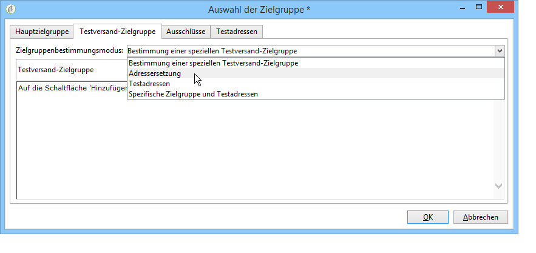

Gehen Sie dazu wie folgt vor:

1. Wählen Sie **[!UICONTROL Hinzufügen]** aus.
1. Geben Sie die zu verwendende E-Mail-Adresse ein oder wählen Sie sie aus der Liste aus.
1. Wählen Sie das zu verwendende Profil im Testversand aus: Sie können in der Spalte **[!UICONTROL Zu verwendendes Profil]** entweder den Wert **[!UICONTROL Zufällig]** beibehalten

   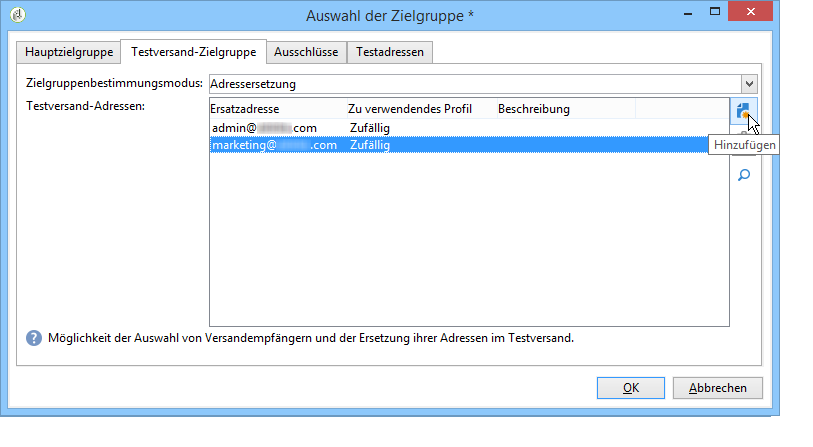

1. oder auf das Symbol **[!UICONTROL Details]** (Lupe) klicken, um ein Profil aus der Hauptzielgruppe auszuwählen.

   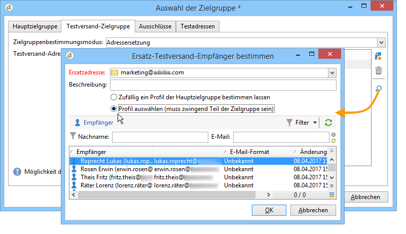

   Konfigurieren Sie so viele Ersatzadressen wie nötig.

## Verwenden von Testadressen für den Testversand {#using-seed-addresses-as-proof}

Sie können **[!UICONTROL Testadressen]** als Testversand-Zielgruppe verwenden: Mit dieser Option können Sie eine Testadressenliste verwenden oder importieren.

>[!NOTE]
>
>Die Testadressen werden unter [Über Testadressen](about-seed-addresses.md) vorgestellt.

Sie können die Definition einer speziellen Testversand-Zielgruppe und die Verwendung von Testadressen mit der Option **[!UICONTROL Spezifische Zielgruppe und Testadressen]** kombinieren. Die entsprechenden Konfigurationen werden dann in zwei separaten Unterregisterkarten definiert.

Siehe auch:

* [Auswählen der Zielgruppe für den Testversand](#selecting-the-proof-target)
* [Über Testadressen](about-seed-addresses.md)
* [Anwendungsbeispiel: Auswählen von Testadressen nach Kriterien](use-case-selecting-seed-addresses-on-criteria.md)

## Auswählen eines Zielgruppen-Mappings {#select-a-target-mapping}

Standard-Zielgruppe in Versandvorlagen sind die **[!UICONTROL Empfangenden]**. Das Zielgruppen-Mapping verwendet also die Felder der Tabelle **nms:recipient**. Adobe Campaign stellt jedoch auch andere Zielgruppen-Mappings zur Verfügung, auf die Sie je nach Bedarf zurückgreifen können.

Folgende Mappings sind vorhanden:

| Name | Verwendung | Standardschema |
|---|---|---|
| Bereich Empfänger | Versand richtet sich an die in der Adobe Campaign-Datenbank enthaltenen Empfänger | nms:recipient |
| Besuchende | Versand richtet sich an Profile, die beispielsweise durch das Weiterleiten von Nachrichten (Virales Marketing) oder durch soziale Netzwerke (Facebook, X – früher bekannt als Twitter) akquiriert wurden. | mns:visitor |
| Abonnements | Versand richtet sich an Abonnenten eines Informationsdienstes wie z. B. einen Newsletter | nms:subscription |
| Besucher-Abonnements | Versand richtet sich an Besucher, die einen Informationsdienst beziehen | nms:visitorSub |
| Service | Veröffentlichen auf einem X-Konto oder einer Facebook-Seite | nms:service |
| Benutzer | Versand richtet sich an Adobe Campaign-Benutzer | nms:operator |
| Externe Datei | Versand basiert auf einer Datei, die alle notwendigen Informationen enthält | Ohne Schema oder Zielgruppe |

## Anleitungsvideo {#seeds-and-proofs-video}

In diesem Video erfahren Sie, wie Sie einer vorhandenen E-Mail Testadressen und Testsendungen hinzufügen und diese ausführen.

>[!VIDEO](https://video.tv.adobe.com/v/25606?quality=12)

Weitere Anleitungsvideos zu Campaign Classic finden Sie [hier](https://experienceleague.adobe.com/docs/campaign-classic-learn/tutorials/overview.html?lang=de).
