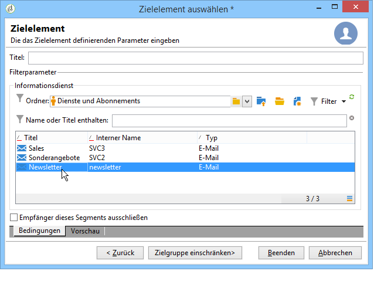

# Zielpopulation bestimmen {#defining-the-target-population}

## Über Zielpopulationen {#about-target-populations}

Für jede Bereitstellung können Sie mehrere Arten von Zielgruppen definieren. Im folgenden Abschnitt finden Sie weitere Informationen zur Auswahl:

* **Die Hauptempfänger der Lieferung**. [Mehr dazu](../../delivery/using/steps-defining-the-target-population.md#selecting-the-main-target).
* **Die Empfänger von Proof-Meldungen**, um einen Überprüfungszyklus einzurichten. [Mehr dazu](../../delivery/using/steps-defining-the-target-population.md#defining-a-specific-proof-target).

Darüber hinaus können Sie auch [Seed-Adressen](../../delivery/using/about-seed-addresses.md)und [Steuerungsgruppen](../../campaign/using/marketing-campaign-deliveries.md#defining-a-control-group)definieren. wenn die Bereitstellung in einer Marketingkampagne enthalten ist.

## Auswählen der Hauptempfänger der Bereitstellung {#selecting-the-main-target}

Meistens wird die Hauptzielgruppe aus der Adobe-Campaign-Datenbank extrahiert (Standardmodus).

Empfänger können auch in einer externen Datei gespeichert werden. The configuration of this type of delivery is presented in [Selecting external recipients](../../delivery/using/steps-defining-the-target-population.md#selecting-external-recipients).

Gehen Sie wie folgt vor, um die Empfänger der erstellten Bereitstellung auszuwählen:

1. Klicken Sie auf den **[!UICONTROL To]** Link.
1. Wählen Sie die erste Option, wenn Ihre Empfänger in der Datenbank gespeichert sind.

   

1. Wählen Sie die Zielzuordnung in der **[!UICONTROL Target mapping]** Dropdownliste aus. Die Standardzielzuordnung für Adobe Campaign ist **[!UICONTROL Recipients]**.

   Es sind weitere Zielzuordnungen verfügbar, und einige können mit Ihrer spezifischen Konfiguration in Zusammenhang stehen. Weitere Informationen zu Zielzuordnungen finden Sie unter [Auswählen einer Zielzuordnung](../../delivery/using/selecting-a-target-mapping.md).

1. Click the **[!UICONTROL Add]** button to define restriction filters.

   Sie haben die Wahl zwischen verschiedenen Filtertypen:

   

   Sie können Empfänger mit den in der Datenbank definierten Targeting-Typen auswählen. Um einen Zieltyp zu verwenden, wählen Sie ihn aus und klicken Sie auf **[!UICONTROL Next]**. Für jedes Ziel können Sie die betreffenden Empfänger anzeigen, indem Sie auf die **[!UICONTROL Preview]** Registerkarte klicken. Bei bestimmten Zieltypen können Sie mit der **[!UICONTROL Refine target]** Schaltfläche mehrere Targeting-Kriterien kombinieren.

   Folgende Zieltypen werden standardmäßig vorgeschlagen:

   * **[!UICONTROL Filtering conditions]** : Mit dieser Option können Sie eine Abfrage definieren und das Ergebnis anzeigen. Die Methode zum Definieren von Abfragen wird in [diesem Abschnitt](../../platform/using/creating-filters.md#creating-an-advanced-filter)dargestellt.
   * **[!UICONTROL Subscribers of an information service]** : Mit dieser Option können Sie einen Newsletter auswählen, für den die Empfänger abonniert werden müssen, damit die Bereitstellung zielgerichtet erfolgen kann.

      

   * **[!UICONTROL Recipients of a delivery]** : Mit dieser Option können Sie die Empfänger einer vorhandenen Bereitstellung als Targeting-Kriterium definieren. Sie müssen dann die Bereitstellung in der Liste auswählen:

      

   * **[!UICONTROL Delivery recipients belonging to a folder]** : Mit dieser Option können Sie einen Bereitstellungsordner auswählen und die Empfänger der Auslieferungen in diesem Ordner als Ziel auswählen.

      

      Sie können außerdem die Liste der Empfänger nach deren Verhalten beim Empfang früherer E-Mails einschränken:

      

      >[!NOTE]
      >
      >The **[!UICONTROL Include sub-folders]** option also lets you target the deliveries contained in folders located in the tree structure below the selected node.

   * **[!UICONTROL Recipients included in a folder]** : Mit dieser Option können Sie die Profile in einem bestimmten Ordner der Struktur als Ziel auswählen.
   * **[!UICONTROL A recipient]** : Mit dieser Option können Sie einen bestimmten Empfänger aus den Profilen in der Datenbank auswählen.
   * **[!UICONTROL A list of recipients]** : Mit dieser Option können Sie eine Liste der Empfänger als Ziel auswählen. Listen werden in [diesem Abschnitt](../../platform/using/creating-and-managing-lists.md)dargestellt.
   * **[!UICONTROL User filters]** : Mit dieser Option können Sie auf die vorkonfigurierten Filter zugreifen, um sie als Filterkriterien für Profile in der Datenbank zu verwenden. Vorkonfigurierte Filter werden in [diesem Abschnitt](../../platform/using/creating-filters.md#saving-a-filter)angezeigt.
   * Mit dieser Option **[!UICONTROL Exclude recipients corresponding to this segment]** können Sie Empfänger als Ziel auswählen, die die definierten Zielkriterien nicht erfüllen. Um diese Option zu verwenden, wählen Sie das entsprechende Feld aus und wenden Sie dann das Targeting wie oben definiert an, um die resultierenden Profile auszuschließen.

      

1. Geben Sie einen Namen für dieses Targeting in das **[!UICONTROL Label]** Feld ein. Standardmäßig ist die Beschriftung die Beschriftung des ersten Targeting-Kriteriums. Für eine Kombination ist es besser, einen expliziten Namen zu verwenden.
1. Click **[!UICONTROL Finish]** to validate the configured targeting.

   Die derart festgelegten Zielbestimmungskriterien werden im mittleren Bereich des Hauptzielgruppe-Tabs zusammengefasst. Durch Klick auf ein Kriterium können Sie seinen Inhalt (Konfiguration und Vorschau) prüfen. Klicken Sie auf das rote Kreuz rechts, um das Kriterium zu löschen.

   

### Externe Empfänger auswählen {#selecting-external-recipients}

Sie haben die Möglichkeit, einen Versand an Empfänger zu richten, deren Profile nicht in der Datenbank, sondern in einer externen Datei gespeichert sind. In unserem Beispiel führen wir einen Versand an Empfänger durch, die aus einer Textdatei importiert wurden.

Gehen Sie dazu wie folgt vor:

1. Click the **[!UICONTROL To]** link to select the recipients of your delivery.
1. Select the **[!UICONTROL Defined in an external file]** option.

   

1. Standardmäßig werden Empfänger in die Datenbank importiert. Sie müssen die **[!UICONTROL Target mapping]** Option auswählen. Weitere Informationen zu Zielzuordnungen finden Sie unter [Auswählen einer Zielzuordnung.](../../delivery/using/selecting-a-target-mapping.md)

   Sie können auch wählen **[!UICONTROL Do not import the recipients into the database]**.

1. When importing the recipients, click the **[!UICONTROL File format definition...]** link to select and configure the external file.

   Weitere Informationen zum Datenimport finden Sie in [diesem Abschnitt](../../platform/using/importing-data.md#step-2---source-file-selection).

1. Click **[!UICONTROL Finish]** and configure your delivery as a standard delivery.

>[!CAUTION]
>
>Schließen Sie bei einem externen E-Mail-Versand bei der Inhaltserstellung keinen Mirrorseite-Link ein. Die Seite kann bei dieser Versandart nicht erstellt werden.

### Einrichten von Ausschlusseinstellungen {#customizing-exclusion-settings}

Fehlerhafte Adressen und der Qualitätsindex werden vom Dienstleister übermittelt. Diese Informationen werden nach Durchführung des Versands und dem Laden der Ergebnisdatei des Dienstleisters automatisch im Empfängerprofil aktualisiert. Hier werden sie angezeigt, können aber nicht geändert werden.

Es besteht die Möglichkeit, Adressen, für die die maximal zulässige Fehleranzahl erreicht wurde oder deren Qualitätsindex unter der in diesem Fenster angegebenen Schwelle liegt, vom Versand auszuschließen. Das Gleiche gilt für nicht-qualifizierte Adressen, d. h. solche, für die keine Informationen vonseiten des Dienstleisters übermittelt wurden.

>[!NOTE]
>
>Wenn zwei Empfänger eines Briefpost-Versands denselben Vornamen, Nachnamen, dieselbe Postleitzahl und Stadt haben, wird ein Duplikat erzeugt, das nicht berücksichtigt wird.

The **[!UICONTROL Exclusions]** tab is used to limit the number of messages.

>[!NOTE]
>
>Die Standardparameter werden empfohlen, Sie können die Einstellungen nach Bedarf anpassen. Diese Optionen sollten jedoch nur von einem Experten geändert werden, um Missbrauch und Fehler zu vermeiden.

Click the **[!UICONTROL Edit...]** link to modify the default configuration.

Folgende Optionen stehen zur Verfügung:

* **[!UICONTROL Exclude duplicate addresses during delivery]**. Diese Option ist standardmäßig aktiv: Dadurch können Sie doppelte E-Mail-Adressen während der Bereitstellung löschen. Die angewendete Strategie kann je nach Verwendung von Adobe Campaign und dem Datentyp in der Datenbank variieren.

   Der Standardwert dieser Option kann für jede Versandvorlage konfiguriert werden.

   Beispiel:

   * Newsletter-Versand oder elektronische Zustellung von Dokumenten: keine Deduplizierung (in den Fällen, in denen definitionsgemäß keine Dubletten zu erwarten sind). Lebensgefährten, die sich mit derselben E-Mail-Adresse angemeldet haben, können erwarten, zwei unterschiedlich personalisierte Nachrichten mit dem jeweiligen Vor- und Nachnamen zu erhalten. In diesem Fall kann die Option abgewählt werden.
   * Versand im Rahmen einer Marketingkampagne: Um eine Überflutung der Empfänger mit E-Mails zu vermeiden, ist die Deduplizierung unbedingt zu empfehlen. In diesem Fall kann diese Option angekreuzt werden.

      If you unselect this option, you can access an additional option: **[!UICONTROL Keep duplicate records (same identifier)]**. It lets you authorize multiple deliveries to recipients who satisfy several targeting criteria.

      

* **[!UICONTROL Exclude recipients who no longer want to be contacted]** , d. h. Empfänger, deren E-Mail-Adressen auf einer schwarzen Liste stehen (&quot;opt out&quot;). Diese Option muss weiterhin gewählt werden, um die Berufsethik des E-Marketing und die Gesetze über den elektronischen Geschäftsverkehr einzuhalten.
* **[!UICONTROL Exclude quarantined recipients]**. Mit dieser Option können Sie Profile mit einer Adresse, die nicht reagiert, vom Ziel ausschließen. Es wird dringend empfohlen, diese Option weiterhin auszuwählen.

   >[!NOTE]
   >
   >Weitere Informationen zum Quarantänemanagement finden Sie unter [Das Quarantänemanagement](../../delivery/using/understanding-quarantine-management.md).

* **[!UICONTROL Limit delivery]** zu einer bestimmten Anzahl von Nachrichten. Mit dieser Option können Sie die maximale Anzahl der zu sendenden Nachrichten eingeben. Übersteigt der Inhalt des Ziels die angegebene Anzahl von Nachrichten, wird eine zufällige Auswahl auf das Ziel angewendet.

### Größe der Zielpopulation verringern {#reducing-the-size-of-the-target-population}

Sie können die Größe der Zielpopulation verringern. Geben Sie dazu die Anzahl der Empfänger an, die in das **[!UICONTROL Requested quantity]** Feld exportiert werden sollen.

## Auswahl der Empfänger von Proof-Nachrichten {#selecting-the-proof-target}

Ein Testversand ist eine spezifische Nachricht, die den eigentlichen Versand prüft, bevor er an die Hauptzielgruppe gesendet wird. Die Testversand-Empfänger sind verantwortlich für die Überprüfung des Inhalts und der Form von Sendungen.

Um die Testversand-Zielgruppe auszuwählen, gehen Sie wie folgt vor:

1. Klicken Sie auf den **[!UICONTROL To]** Link.
1.  Klicken Sie auf die **[!UICONTROL Target of the proofs]** Registerkarte.
1. Klicken Sie auf das **[!UICONTROL Targeting mode]** Feld, um die anzuwendende Methode auszuwählen: **[!UICONTROL Definition of a specific proof target]** , **[!UICONTROL Substitution of the address]** , **[!UICONTROL Seed addresses]** oder **[!UICONTROL Specific target and seed addresses]**.

>[!NOTE]
>
>Normalerweise kann das Ziel für den Beweis dem Hauptziel hinzugefügt werden. Wählen Sie dazu die entsprechende Option im unteren Bereich der **[!UICONTROL Main target]** Registerkarte aus.

## Spezifische Testversand-Zielgruppe definieren {#defining-a-specific-proof-target}

When selecting the proof target, the **[!UICONTROL Definition of a specific proof target]** option lets you select the proof recipients from the profiles in the database.

Select this option to choose recipients using the **[!UICONTROL Add]** button, as in the case of defining the main target. See [Selecting the main target](../../delivery/using/steps-defining-the-target-population.md#selecting-the-main-target).

For more on proof sending, refer to [this section](../../delivery/using/steps-validating-the-delivery.md#sending-a-proof).

### Adressersetzung beim Testversand verwenden {#using-address-substitution-in-proof}

Instead of selecting dedicated recipients in the database, you can use the **[!UICONTROL Substitution of the address]** option.

Mit dieser Option können Sie die Profile aus der Zielgruppe verwenden, bei denen die E-Mail-Adressen durch eine oder mehrere andere Adressen ersetzt werden, die den Testversand erhalten.

Ein spezifisches Fenster ermöglicht die Angabe der Testversand-Adressen und die Konfiguration der Ersetzung(en).

Gehen Sie dazu wie folgt vor:

1. Click the **[!UICONTROL Add]** icon to define a substitution.
1. Geben Sie die zu verwendende E-Mail-Adresse ein oder wählen Sie sie aus der Liste aus.
1. Select the profile to use in the proof: save the **[!UICONTROL Random]** value in the **[!UICONTROL Profile to use]** column to use the data of any profile of the target in the proof.

   

1. Click the **[!UICONTROL Detail]** icon to select a profile from the main target, as in the following example:

   

   Konfigurieren Sie so viele Ersatzadressen wie nötig.

## Testadressen als Zielgruppe verwenden {#using-seed-addresses-as-proof}

You can use **[!UICONTROL Seed addresses]** as target of the proofs: this option lets you use or import a list of existing seed addresses.

>[!NOTE]
>
>Die Seed-Adressen werden unter [Über Seed-Adressen](../../delivery/using/about-seed-addresses.md)dargestellt.

Sie können die Definition eines bestimmten Proof-Ziels und die Verwendung von Seed-Adressen mit der **[!UICONTROL Specific target and Seed addresses]** Option kombinieren. Die zugehörigen Konfigurationen werden dann in zwei separaten Unterregisterkarten definiert.
