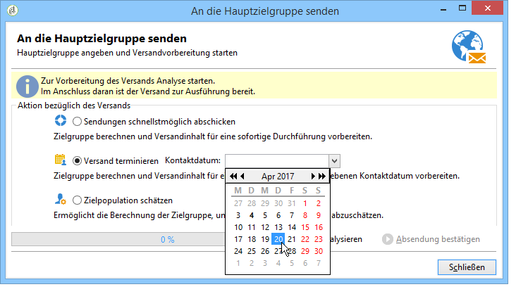

# Konfigurieren und Durchführen des Versands {#configuring-and-sending-the-delivery}

## Berechtigungen{#delivery-permissions}

Nur die für einen Versand verantwortliche Person kann den Versand starten. Damit andere Benutzende (oder Benutzergruppen) einen Versand starten können, fügen Sie diese als Validierungsverantwortliche im Feld **[!UICONTROL Versandstart:]** hinzu. [Weitere Informationen](../../campaign/using/marketing-campaign-approval.md#selecting-reviewers).

## Zusätzliche Versandparameter {#delivery-additiona-parameters}

Vor der Durchführung des Versands können Sie im Tab **[!UICONTROL Versand]** die Parameter der Versandeigenschaften definieren.

* **[!UICONTROL Versandpriorität]**: Diese Option ermöglicht es Ihnen, die Versandreihenfolge für Ihre Sendungen durch Angabe der Prioritätsstufe (normal, hoch oder niedrig) zu ändern.

* **[!UICONTROL Kontingentgröße]**: Mithilfe dieser Option können Sie die Anzahl der in einem XML-Versand-Package enthaltenen Nachrichten festlegen. Wenn der Parameter auf „0“ gesetzt ist, werden die Nachrichten automatisch gruppiert. Die Package-Größe wird durch die `<delivery size>/1024`-Berechnung definiert, mit mindestens 8 und maximal 256 Nachrichten pro Package.

  >[!IMPORTANT]
  >
  >Wenn der Versand durch Duplizieren eines existierenden Versands erstellt wird, wird dieser Parameter zurückgesetzt.

* **[!UICONTROL In mehreren Schüben versenden]**: Verwenden Sie diese Option, um Ihre Nachrichten in mehreren Schüben anstatt gleichzeitig zu versenden. [Weitere Informationen](#sending-using-multiple-waves).

* **[!UICONTROL SMTP-Versand testen]**: Verwenden Sie diese Option, um den Versand per SMTP zu testen. Der Versand wird bis zur Verbindung mit dem SMTP-Server verarbeitet, aber nicht gesendet: Für jeden Empfänger des Versands stellt Campaign eine Verbindung mit dem Server des SMTP-Anbieters her, führt den SMTP-Befehl RCPT TO aus und schließt die Verbindung vor dem SMTP-Befehl DATA.

  >[!NOTE]
  >
  >* Diese Option darf bei Mid-Sourcing nicht festgelegt werden.
  >
  >* Weitere Informationen zur SMTP-Server-Konfiguration finden Sie in [diesem Abschnitt](../../installation/using/configure-delivery-settings.md).

* **[!UICONTROL E-Mail-BCC]**: Mit dieser Option können Sie mit der BCC-Funktion E-Mails in einem externen System speichern, indem Sie einfach eine E-Mail-Adresse als BCC zu Ihrer Versandzielgruppe hinzufügen. [Weitere Informationen](sending-messages.md#archiving-emails).

## Bestätigen des Versands {#confirming-delivery}

Wenn der Versand konfiguriert und versandbereit ist, führen Sie die Versandanalyse aus.

Klicken Sie dazu auf **[!UICONTROL Senden]**, wählen Sie die gewünschte Aktion aus und klicken Sie auf **[!UICONTROL Analysieren]**. [Weitere Informationen](steps-validating-the-delivery.md#analyzing-the-delivery).

Klicken Sie abschließend auf **[!UICONTROL Absendung bestätigen]**, um den Versand der Nachrichten zu starten.

Nun können Sie den Versand-Assistenten schließen und die Durchführung im **[!UICONTROL Versand]**-Tab verfolgen (entweder in der Detailansicht des Versands oder in der Versandliste).

Nach dem Nachrichtenversand können Sie Ihre Sendungen überwachen und verfolgen. Lesen Sie diesbezüglich auch diese Abschnitte:

* [Überwachen von Sendungen](about-delivery-monitoring.md)
* [Ursachen für das Fehlschlagen von Sendungen](understanding-delivery-failures.md)
* [Über das Nachrichten-Tracking](about-message-tracking.md)

## Planen des Versandzeitpunkts {#scheduling-the-delivery-sending}

Sie können den Nachrichtenversand verzögern, indem Sie für den Versand einen Zeitpunkt planen.

1. Klicken Sie auf die Schaltfläche **[!UICONTROL Senden]** und wählen Sie die Option **[!UICONTROL Versand terminieren]** aus.

1. Geben Sie im Feld **[!UICONTROL Kontaktdatum]** den gewünschten Starttermin an.

1. Sie können dann die Versandanalyse starten und den Versand bestätigen. Der Versand beginnt jedoch erst nach dem im Feld **[!UICONTROL Kontaktdatum]** angegebenen Datum.

>[!IMPORTANT]
>
>Sobald Sie die Analyse gestartet haben, wird das von Ihnen definierte Kontaktdatum fixiert. Wenn Sie dieses Datum ändern, müssen Sie die Analyse neu starten, damit Ihre Änderungen berücksichtigt werden.

In der Liste aller Sendungen erscheint der Versand mit dem Status **[!UICONTROL Ausstehend]**.

Die Terminierung kann auch vorab über die Schaltfläche **[!UICONTROL Planung]** erfolgen.

Dies bietet die Möglichkeit, den Versand auf einen späteren Zeitpunkt zu verschieben und ihn im Planungskalender zu verzeichnen.

* Bei Wahl der Option **[!UICONTROL Versand planen (keine automatische Ausführung)]** können Sie zudem die Analyse des Versands terminieren.

  In diesem Fall erhält der Versand den Status **[!UICONTROL Zielbestimmung ausstehend]** und die Analyse wird zum angegebenen Zeitpunkt gestartet.

* Bei Wahl der Option **[!UICONTROL Versand planen (automatische Ausführung am geplanten Datum)]** wird nur das Kontaktdatum angegeben.

  Klicken Sie auf die Schaltfläche **[!UICONTROL Senden]**, wählen Sie **[!UICONTROL Versand terminieren]**, starten Sie die Analyse und bestätigen Sie den Versand. Auf diese Weise wird die Analyse durchgeführt und die Zielgruppe vorbereitet. Am angegebenen Stichtag werden die Nachrichten dann automatisch versendet.

Datum und Uhrzeit werden in der Zeitzone des aktuellen Benutzers angegeben. Die **[!UICONTROL Zeitzone]** in der Dropdown-Liste unter dem Eingabefeld Kontaktdatum können Sie das eingegebene Datum und die eingegebene Uhrzeit automatisch in die ausgewählte Zeitzone konvertieren.

Wenn Sie also beispielsweise einen Versand für 8 Uhr Brüsseler Zeit terminieren, wird die Uhrzeit automatisch in die ausgewählte Zeitzone konvertiert:

## Versenden in mehreren Schüben {#sending-using-multiple-waves}

Um eine gleichmäßige Auslastung der Kapazitäten zu gewährleisten, können Sie Sendungen in mehrere Schübe unterteilen. Konfigurieren Sie die Anzahl der Schübe und ihre Größe in Bezug auf den gesamten Versand.

>[!NOTE]
>
>Sie können nur die Größe und die Zeitverzögerung zwischen zwei aufeinanderfolgenden Schüben definieren. Die Empfängerauswahlkriterien für jeden Schub können nicht konfiguriert werden.

1. Öffnen Sie das Versandeigenschaftenfenster und wählen Sie den **[!UICONTROL Versand]**-Tab aus.
1. Wählen Sie die Option **[!UICONTROL In mehreren Schüben versenden]** aus und danach den Link **[!UICONTROL Definition der Schübe...]**.

   

1. Zur Konfiguration von Schüben haben Sie die folgenden Möglichkeiten:

   * Definieren Sie die Größe für jeden Schub. Wenn Sie beispielsweise im entsprechenden Feld **[!UICONTROL 30 %]** eingeben, enthält jeder Schub 30 % der Versandnachrichten und der letzte Schub 10 % der Nachrichten.

     Im **[!UICONTROL Zeitraum]** geben Sie die Verzögerung zwischen dem Start zweier aufeinander folgender Schübe an. Wenn Sie zum Beispiel **[!UICONTROL 2d]** eingeben, startet der erste Schub sofort, der zweite Schub startet in zwei Tagen, der dritte in vier Tagen usw.

     

   * Definieren Sie einen Kalendereintrag für den Versand eines jeden Schubs.

     Geben Sie in der Spalte **[!UICONTROL Start]** die Verzögerung zwischen dem Start zweier aufeinanderfolgender Schübe an. Geben Sie in der Spalte **[!UICONTROL Größe]** eine feste Zahl oder einen Prozentsatz ein.

     Im unten stehenden Beispiel beinhaltet der erste Schub 25 % der Gesamtzahl der im Versand enthaltenen Nachrichten und beginnt unmittelbar. Die nächsten drei Schübe vervollständigen den Versand und starten in Intervallen von je sechs Stunden.

     

   Eine spezifische Typologieregel (**[!UICONTROL Prüfung der Schub-Planung]**) stellt sicher, dass der letzte Schub vor der Versand-Deadline eingeplant ist. Kampagnentypologien und die entsprechenden Regeln werden im Tab **[!UICONTROL Typologie]** der Versandeigenschaften konfiguriert und in [Validierung mit Typologien](steps-validating-the-delivery.md#validation-process-with-typologies) dargestellt.

   >[!IMPORTANT]
   >
   >Achten Sie darauf, dass die letzten Schübe nicht die Versandgültigkeit überschreiten, die im Tab **[!UICONTROL Gültigkeit]** festgelegt wird. Ansonsten werden manche Nachrichten nicht gesendet.
   >
   >Planen Sie bei der Konfiguration der letzten Schübe auch genügend Zeit für zusätzliche Versuche ein. Siehe [diesen Abschnitt](steps-sending-the-delivery.md#configuring-retries).

1. Gehen Sie zur Überwachung Ihrer Sendungen zu den Versandlogs. Weitere Informationen finden Sie auf [dieser Seite](delivery-dashboard.md#delivery-logs-and-history).

   Die Versandlogs enthalten die bereits in den verarbeiteten Schüben durchgeführten Sendungen (Status **[!UICONTROL Gesendet]**) sowie die in den restlichen Schüben durchzuführenden Sendungen (Status **[!UICONTROL Ausstehend]**).

Im Folgenden finden Sie die häufigsten Anwendungsbeispiele für Schübe.

* **In der Anfangsphase**

  Wenn E-Mails über eine neue Plattform versendet werden, sind ISPs normalerweise misstrauisch gegenüber den neuen IP-Adressen. Das plötzliche Versenden großer Mengen an E-Mails veranlasst ISPs oft dazu, sie als Spam zu qualifizieren.

  Um zu verhindern, dass Ihre Sendungen als Spam eingestuft werden, können Sie das gesendete Volumen schrittweise mithilfe von Schüben erhöhen. Damit gewährleisten Sie eine problemlose Entwicklung in der Anfangsphase und die Verringerung der Anzahl der ungültigen Adressen.

  Verwenden Sie dazu die Option **[!UICONTROL Schübe in einem Kalender definieren]**. Setzen Sie beispielsweise den ersten Schub auf 10 %, den zweiten auf 15 % usw.

  

* **Kampagnen, die ein Callcenter beinhalten**

  Bei telefonischen Treuekampagnen verfügen Unternehmen oft über begrenzte Kapazitäten für die Verarbeitung der Anrufe an Abonnenten.

  Mithilfe von Schüben kann die Anzahl der Nachrichten auf 20 pro Tag beschränkt werden, was der täglichen Verarbeitungskapazität eines Callcenters entspricht.

  Wählen Sie dazu die Option **[!UICONTROL Mehrere Schübe derselben Größe planen]**. Geben Sie **[!UICONTROL 20]** als Schubgröße und **[!UICONTROL 1d]** im Feld **[!UICONTROL Zeitraum]** ein.

  

## Konfigurieren der weiteren Zustellversuche {#configuring-retries}

Vorübergehend nicht zugestellte Nachrichten aufgrund einer **Soft** oder **Ignoriert** -Fehler werden automatisch wiederholt. Typen und Ursachen für fehlgeschlagene Sendungen werden in diesem Abschnitt beschrieben. [Abschnitt](understanding-delivery-failures.md#delivery-failure-types-and-reasons).

>[!IMPORTANT]
>
>Bei gehosteten oder hybriden Installationen werden die Einstellungen für den erneuten Versuch im Versand nicht mehr von Campaign verwendet, wenn Sie auf den [Enhanced MTA](sending-with-enhanced-mta.md) aktualisiert haben. Weitere Zustellversuche aufgrund von Softbounces sowie die Zeitdauer zwischen ihnen werden durch den Enhanced MTA bestimmt, basierend auf Typ und Prioritätsstufe der Bounce-Antworten, die von der E-Mail-Domain der Nachricht zurückgegeben werden.

Bei On-Premise-Installationen und gehosteten/hybriden Installationen, die den bestehenden Campaign-MTA verwenden, gibt der zentrale Abschnitt der Registerkarte **[!UICONTROL Versand]** für die Versandparameter an, wie viele weitere Versuche am Tag nach dem Versand durchgeführt werden sollen, und den Mindestzeitabstand zwischen den Versuchen. 

Standardmäßig sind innerhalb der ersten 24 Stunden des Versands fünf erneute Versuche im Abstand von mindestens einer Stunde vorgesehen. An den folgenden Tagen und bis zum Ablauf der Versandgültigkeit, die in der Variablen **[!UICONTROL Gültigkeit]** Registerkarte. Siehe [Definieren des Gültigkeitszeitraums](#defining-validity-period).

## Definieren des Gültigkeitszeitraums {#defining-validity-period}

Nach dem Start des Versands können die Nachrichten (und alle weiteren Zustellversuche) bis zum Ablauf der Versandgültigkeit gesendet werden. Dies wird in den Versandeigenschaften über die Variable **[!UICONTROL Gültigkeit]** Registerkarte.

* Im Feld **[!UICONTROL Versandlaufzeit]** kann die Zeitspanne angegeben werden, in der erneute globale Zustellversuche unternommen werden. Dies bedeutet konkret, dass Adobe Campaign die Nachrichten ab dem Startdatum versendet und bis zum Ablauf der angegebenen Spanne nicht zustellbare Nachrichten in regelmäßigen Abständen erneut sendet.

  Sie können alternativ auch ein genaues Datum angeben. Markieren Sie dazu die Option **[!UICONTROL Gültigkeit explizit festlegen]**. In diesem Fall kann mit den Versand- und Gültigkeitsdaten auch eine bestimmte Uhrzeit konfiguriert werden. Standardmäßig wird die aktuelle Uhrzeit eingesetzt, sie kann jedoch direkt im Eingabefeld angepasst werden.

  >[!IMPORTANT]
  >
  >Wenn Sie auf den [Enhanced MTA](sending-with-enhanced-mta.md) aktualisiert haben, wird bei gehosteten oder hybriden Installationen die Einstellung **[!UICONTROL Versandlaufzeit]** in Ihren Campaign-E-Mail-Sendungen nur verwendet, wenn sie auf **3,5 Tage oder weniger** festgelegt ist. Wenn Sie einen Wert von mehr als 3,5 Tagen definieren, wird dieser nicht berücksichtigt.

* **Gültigkeit von Ressourcen**: Das Feld **[!UICONTROL Gültigkeit]** wird für hochgeladene Ressourcen verwendet, hauptsächlich für die Mirrorseite und Bilder. Die Gültigkeitsdauer der Ressourcen auf dieser Seite ist begrenzt, um Speicherkapazität zu sparen.

  Die in diesem Feld möglichen Zeiteinheiten (Tage, Stunden etc.) können Sie in [diesem Abschnitt](../../platform/using/adobe-campaign-workspace.md#default-units) nachlesen.
