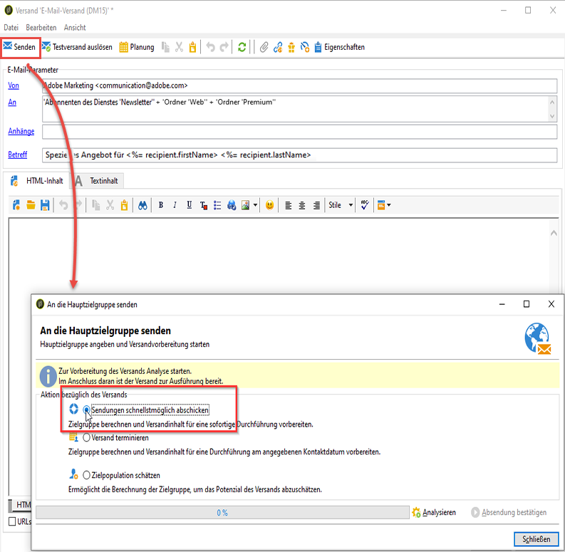
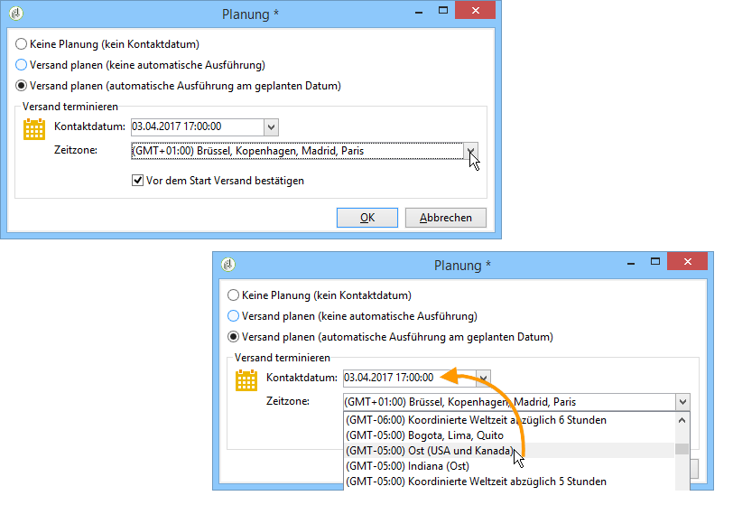

# Versand konfigurieren und senden {#configuring-and-sending-the-delivery}

>[!NOTE]
>
>Standardmäßig kann nur der für den Versand verantwortliche Benutzer den Start desselben auslösen. Damit andere Benutzer (oder Benutzergruppen) einen Versand starten können, müssen diese im Feld **[!UICONTROL Versand-Start:]** als Validierungsverantwortliche hinzugefügt werden.
>
>Weitere Informationen dazu finden Sie in [diesem Abschnitt](../../campaign/using/marketing-campaign-approval.md#selecting-reviewers).

## Zusätzliche Versandparameter {#delivery-additiona-parameters}

Vor der Durchführung des Versands können Sie im Tab **[!UICONTROL Versand]** die Versandparameter der Versandeigenschaften definieren.

* **[!UICONTROL Versandpriorität]**: Diese Option ermöglicht es Ihnen, die Versandreihenfolge für Ihre Sendungen durch Angabe der Prioritätsstufe (normal, hoch oder niedrig) zu beeinflussen. Damit können Sie den Versand dringender Sendungen vorziehen.

* **[!UICONTROL Kontingentgröße]**: Mithilfe dieser Option können Sie die Anzahl der in einem XML-Versand-Package enthaltenen Nachrichten festlegen. Wenn der Parameter auf „0“ gesetzt ist, werden die Nachrichten automatisch gruppiert. Die Package-Größe wird durch die `<delivery size>/1024`-Berechnung definiert, mit mindestens 8 und maximal 256 Nachrichten pro Package.

   >[!CAUTION]
   >
   >Bei Duplizierung eines Versands wird dieser Parameter automatisch auf 0 zurückgesetzt.

* **[!UICONTROL In mehreren Schüben versenden]**: Weitere Informationen hierzu finden Sie unter [In mehreren Schüben versenden](#sending-using-multiple-waves).

* **[!UICONTROL SMTP-Versand testen]**: Mit dieser Option können Sie das Senden über SMTP testen. Der Versand wird bis zur Verbindung mit dem SMTP-Server verarbeitet, jedoch nicht gesendet.

   >[!NOTE]
   >
   >Bei Mid-Sourcing-Installationen ist von der Verwendung dieser Option abzuraten, damit der MTA nicht aufgerufen wird.
   >
   >Weiterführende Informationen zur Konfiguration eines SMTP-Servers finden Sie in [diesem Abschnitt](../../installation/using/configuring-campaign-server.md#personalizing-delivery-parameters).

* **[!UICONTROL E-Mails archivieren]**:In Adobe Campaign können Sie mit der BCC-Option E-Mails in einem externen System speichern, indem Sie einfach eine BCC-E-Mail-Adresse zu Ihrer Versandzielgruppe hinzufügen. Weitere Informationen hierzu finden Sie unter [E-Mails archivieren](../../delivery/using/sending-messages.md#archiving-emails).

Nachdem der Versand konfiguriert wurde und versandbereit ist, stellen Sie sicher, dass Sie die [Versandanalyse](../../delivery/using/steps-validating-the-delivery.md#analyzing-the-delivery)ausgeführt haben. Klicken Sie abschließend auf **[!UICONTROL Absendung bestätigen]**, um den Versand der Nachrichten zu starten.

Nun können Sie den Versand-Assistenten schließen und die Durchführung im **[!UICONTROL Versand]**-Tab verfolgen (entweder in der Detailansicht des Versands oder in der Versandliste).

Nach Absenden der Nachrichten können Sie den Versand beobachten und verfolgen, siehe diese Abschnitte:

* [Sendungen beobachten](../../delivery/using/monitoring-a-delivery.md)
* [Ursachen von fehlgeschlagenen Sendungen](../../delivery/using/understanding-delivery-failures.md)
* [Über das Nachrichten-Tracking](../../delivery/using/about-message-tracking.md)

## Versandzeitpunkt planen {#scheduling-the-delivery-sending}

Sie können das Senden der Nachrichten auf einen späteren Zeitpunkt verschieben, um z. B. den Werbedruck auf eine bestimmte Population zu kontrollieren.

1. Klicken Sie auf die Schaltfläche **[!UICONTROL Senden]** und wählen Sie die Option **[!UICONTROL Versand terminieren]** aus.

1. Geben Sie im Feld **[!UICONTROL Kontaktdatum]** den gewünschten Starttermin an.

1. Sie können dann die Versandanalyse starten und den Versand bestätigen. Der Versand beginnt jedoch erst nach dem im Feld **[!UICONTROL Kontaktdatum]** angegebenen Datum.

>[!CAUTION]
>
>Sobald Sie die Analyse gestartet haben, steht das von Ihnen definierte Kontaktdatum fest. Sollten Sie dieses Datum abändern, ist darauf zu achten, die Analyse erneut zu starten, damit Ihre Änderungen berücksichtigt werden.

In der Liste aller Sendungen erscheint der Versand mit dem Status **[!UICONTROL Ausstehend]**.

Die Terminierung kann auch vorab über die Schaltfläche **[!UICONTROL Planung]** erfolgen.

Dies bietet die Möglichkeit, den Versand auf einen späteren Zeitpunkt zu verschieben und ihn im Planungskalender zu verzeichnen.

* Bei Wahl der Option **[!UICONTROL Versand planen (keine automatische Ausführung)]** können Sie zudem die Analyse des Versands terminieren.

   In diesem Fall erhält der Versand den Status **[!UICONTROL Zielbestimmung ausstehend]** und die Analyse wird zum angegebenen Zeitpunkt gestartet.

* Bei Wahl der Option **[!UICONTROL Versand planen (automatische Ausführung am geplanten Datum)]** wird nur das Kontaktdatum angegeben.

   Klicken Sie auf die Schaltfläche **[!UICONTROL Senden]**, wählen Sie **[!UICONTROL Versand terminieren]**, starten Sie die Analyse und bestätigen Sie den Versand. Auf diese Weise wird die Analyse durchgeführt und die Zielgruppe vorbereitet. Am angegebenen Stichtag werden die Nachrichten dann automatisch versendet.

Datum und Uhrzeit beziehen sich jeweils auf den aktuellen Benutzer. Die unter dem Eingabefeld des Kontaktdatums situierte Dropdown-Liste **[!UICONTROL Zeitzone]** ermöglicht es, die oberhalb eingegebene Uhrzeit der ausgewählten Zeitzone anzupassen.

Wenn Sie also beispielsweise einen Versand für 8 Uhr Brüsseler Zeit terminieren, wird die Uhrzeit automatisch in die ausgewählte Zeitzone konvertiert:

## In mehreren Schüben versenden {#sending-using-multiple-waves}

Um eine gleichmäßige Auslastung der Kapazitäten zu gewährleisten, können Sie Sendungen in mehrere Schübe unterteilen. Konfigurieren Sie die Anzahl der Schübe und ihre Größe in Bezug auf den gesamten Versand.

>[!NOTE]
>
>Sie können nur die Größe und die Zeitverzögerung zwischen zwei aufeinanderfolgenden Schüben definieren. Die Empfängerauswahlkriterien für jeden Schub können nicht konfiguriert werden.

1. Öffnen Sie das Versandeigenschaftenfenster und wählen Sie den **[!UICONTROL Versand]**-Tab aus.
1. Wählen Sie die Option **[!UICONTROL In mehreren Schüben versenden]** aus und danach den Link **[!UICONTROL Definition der Schübe...]**.

   

1. Zur Konfiguration von Schüben haben Sie die folgenden Möglichkeiten:

   * Definieren Sie die Größe eines jeden Schubs. Wenn Sie beispielsweise **[!UICONTROL 30%]** im entsprechenden Feld eingeben, enthält jeder Schub 30 % der Versandnachrichten. Nur der letzte Schub enthält 10 % der Nachrichten.

      Geben Sie im Feld **[!UICONTROL Zeitraum]** die Verzögerung zwischen dem Start zweier aufeinanderfolgender Schübe an. Wenn Sie zum Beispiel **[!UICONTROL 2d]** eingeben, startet der erste Schub sofort, der zweite Schub startet in zwei Tagen, der dritte in vier Tagen usw.

      

   * Definieren Sie einen Kalendereintrag für den Versand eines jeden Schubs.

      Geben Sie in der Spalte **[!UICONTROL Start]** die Verzögerung zwischen dem Start von zwei aufeinanderfolgenden Schüben an. Geben Sie in der Spalte **[!UICONTROL Größe]** eine Zahl oder einen Prozentsatz ein.

      Im unten stehenden Beispiel beinhaltet der erste Schub 25 % der Gesamtzahl der im Versand enthaltenen Nachrichten und beginnt unmittelbar. Die nächsten beiden Schübe vervollständigen den Versand und starten in Intervallen von je sechs Stunden.

      
   Eine spezifische Typologieregel (**[!UICONTROL Prüfung der Schub-Planung]**) stellt sicher, dass der letzte Schub vor der Versand-Deadline eingeplant ist. Kampagnentypologien und die entsprechenden Regeln werden im Tab **[!UICONTROL Typologie]** der Versandeigenschaften konfiguriert und in [Validierung mit Typologien](../../delivery/using/steps-validating-the-delivery.md#validation-process-with-typologies) dargestellt.

   >[!CAUTION]
   >
   >Achten Sie darauf, dass die letzten Schübe nicht die Versandgültigkeit überschreiten, die im Tab **[!UICONTROL Gültigkeit]** festgelegt wird. Ansonsten werden manche Nachrichten nicht gesendet.
   >
   >Planen Sie bei der Konfiguration der letzten Schübe auch genügend Zeit für zusätzliche Versuche ein. Siehe [diesen Abschnitt](../../delivery/using/steps-sending-the-delivery.md#configuring-retries).

1. Gehen Sie zur Überwachung Ihrer Sendungen zu den Versandlogs. Näheres hierzu finden Sie auf [dieser Seite](../../delivery/using/monitoring-a-delivery.md#delivery-logs-and-history).

   Die Versandlogs enthalten die bereits in den verarbeiteten Schüben durchgeführten Sendungen (Status **[!UICONTROL Gesendet]**) sowie die in den restlichen Schüben durchzuführenden Sendungen (Status **[!UICONTROL Ausstehend]**).

Im Folgenden finden Sie die häufigsten Anwendungsbeispiele für Schübe.

* **In der Anfangsphase**

   Wenn E-Mails über eine neue Plattform versendet werden, sind ISPs normalerweise misstrauisch gegenüber den neuen IP-Adressen. Das plötzliche Versenden großer Mengen an E-Mails veranlasst ISPs oft dazu, sie als Spam zu qualifizieren.

   Um zu verhindern, dass Ihre Sendungen als Spam eingestuft werden, können Sie das gesendete Volumen schrittweise mithilfe von Schüben erhöhen. Damit gewährleisten Sie eine problemlose Entwicklung in der Anfangsphase und die Verringerung der Anzahl der ungültigen Adressen.

   Verwenden Sie dazu die Option **[!UICONTROL Schübe in einem Kalender definieren]**. Wählen Sie beispielsweise für den ersten Schub 10 %, für den zweiten 15 % usw.

   

* **Kampagnen, die ein Callcenter beinhalten**

   Bei telefonischen Treuekampagnen verfügen Unternehmen oft über begrenzte Kapazitäten für die Verarbeitung der Anrufe an Abonnenten.

   Mithilfe von Schüben kann die Anzahl der Nachrichten auf 20 pro Tag beschränkt werden, was der täglichen Verarbeitungskapazität eines Callcenters entspricht.

   Wählen Sie dazu die Option **[!UICONTROL Mehrere Schübe mit gleicher Größe planen]** aus. Geben Sie **[!UICONTROL 20]** als Schubgröße und **[!UICONTROL 1d]** im Feld **[!UICONTROL Zeitraum]** ein.

   

## Konfiguration weiterer Zustellversuche {#configuring-retries}

Vorübergehend nicht zustellbare Nachrichten aufgrund eines **Softbounce** oder eines **ignorierten Fehlers** werden automatisch für einen erneuten Versuch vorgesehen. Die Typen und Ursachen für fehlgeschlagene Sendungen finden Sie in diesem [Abschnitt](../../delivery/using/understanding-delivery-failures.md#delivery-failure-types-and-reasons).

In den Versandeigenschaften im mittleren Bereich des **[!UICONTROL Senden]**-Tabs können Sie angeben, wie viele Zustellversuche am Tag des Versandstarts unternommen werden sollen und in welchen Abständen.

Standardmäßig sind innerhalb der ersten 24 Stunden des Versands fünf erneute Versuche im Abstand von mindestens einer Stunde vorgesehen. An den folgenden Tagen und bis zum Ablauf der Versandgültigkeit, die im Tab **[!UICONTROL Gültigkeit]** angegeben ist, wird jeweils ein Versuch unternommen (siehe [Gültigkeitszeitraum bestimmen](../../delivery/using/steps-sending-the-delivery.md#defining-validity-period)).

>[!NOTE]
>
>Bei gehosteten oder hybriden Installationen werden die Einstellungen für den erneuten Versuch im Versand nicht mehr von Campaign verwendet, wenn Sie auf den Enhanced MTA aktualisiert haben. Versuche aufgrund von Softbounces und die Zeitdauer zwischen ihnen werden durch den Enhanced MTA bestimmt, basierend auf Typ und Prioritätsstufe der Bounce-Antworten, die von der E-Mail-Domain der Nachricht zurückgegeben werden.
>
>Alle Auswirkungen sind im Dokument [Adobe Campaign Enhanced MTA](https://helpx.adobe.com/campaign/kb/acc-campaign-enhanced-mta.html) ausführlich beschrieben.

## Gültigkeitszeitraum bestimmen {#defining-validity-period}

Der Nachrichtenversand inklusive aller Neuversuche erfolgt innerhalb eines bestimmten Zeitraums, der ausgehend vom Startdatum im Tab **[!UICONTROL Gültigkeit]** der Versandeigenschaften festgelegt wird.

* Im Feld **[!UICONTROL Versandlaufzeit]** können Sie die Zeitspanne angeben, in der erneute Zustellversuche unternommen werden. Dies bedeutet konkret, dass Adobe Campaign die Nachrichten ab dem Startdatum versendet und bis nach Ablauf der angegebenen Spanne nicht zustellbare Nachrichten in regelmäßigen Abständen erneut sendet.

   Sie können alternativ auch ein genaues Ablaufdatum angeben. Kreuzen Sie in diesem Fall die Option **[!UICONTROL Gültigkeit explizit festlegen]** an. Auf diese Weise kann auch eine bestimmte Uhrzeit konfiguriert werden. Standardmäßig ist dies die aktuelle Uhrzeit. Diese kann jedoch direkt im Eingabefeld angepasst werden.

* **Gültigkeit von Ressourcen**: Das Feld **[!UICONTROL Gültigkeit]** wird für hochgeladene Ressourcen verwendet, hauptsächlich für die Mirrorseite und Bilder. Die Gültigkeitsdauer der Ressourcen auf dieser Seite ist begrenzt, um Speicherkapazität zu sparen.

   Die in diesem Feld möglichen Zeiteinheiten (Tage, Stunden etc.) können Sie in [diesem Abschnitt](../../platform/using/adobe-campaign-workspace.md#default-units) nachlesen.

>[!NOTE]
>
>Wenn Sie auf den Enhanced MTA aktualisiert haben, wird bei gehosteten oder hybriden Installationen die Einstellung **[!UICONTROL Versandlaufzeit]** in Ihren Campaign-Sendungen nur verwendet, wenn sie auf **3,5** Tage oder weniger festgelegt ist. Wenn Sie einen Wert von mehr als 3,5 Tagen definieren, wird dieser nicht berücksichtigt.
>
>Alle Auswirkungen sind im Dokument [Adobe Campaign Enhanced MTA](https://helpx.adobe.com/campaign/kb/acc-campaign-enhanced-mta.html) ausführlich beschrieben.
