# Versand validieren {#validating-the-delivery}

Der erstellte und konfigurierte Versand muss vor dem Senden an die Hauptzielgruppe validiert werden.

Gehen Sie dazu wie folgt vor:

1. **Versand analysieren** – hier erfolgt die Vorbereitung der zu sendenden Nachrichten. Siehe [Versand analysieren ](#analyzing-the-delivery).

   Die während der Analyse angewendeten Regeln werden in [diesem Abschnitt](#validation-process-with-typologies) erläutert. Die verfügbaren Validierungsmodi werden unter [Validierungsmodus ändern](#changing-the-approval-mode) detailliert beschrieben.

1. **Testsendungen durchführen** – hier erfolgt die Validierung von Inhalt, URLs, Personalisierungsfeldern usw. Siehe [Testversand durchführen](../../delivery/using/steps-validating-the-delivery.md#sending-a-proof) und [Spezifische Testversand-Zielgruppe definieren](../../delivery/using/steps-defining-the-target-population.md#defining-a-specific-proof-target).

>[!IMPORTANT]
>
>Beide Schritte sind erforderlich und müssen nach jeder Änderung des Nachrichteninhalts wiederholt werden.

## Versand analysieren {#analyzing-the-delivery}

Die Analyse ist die Phase, in der die Zielpopulation berechnet und der Versandinhalt vorbereitet wird. Sobald sie abgeschlossen ist, ist der Versand startbereit.

### Starten der Analyse {#launching-the-analysis}

1. Um die Versandanalyse zu starten, klicken Sie auf **[!UICONTROL Senden]**.
1. Wählen Sie **[!UICONTROL Sendungen schnellstmöglich abschicken]**.

   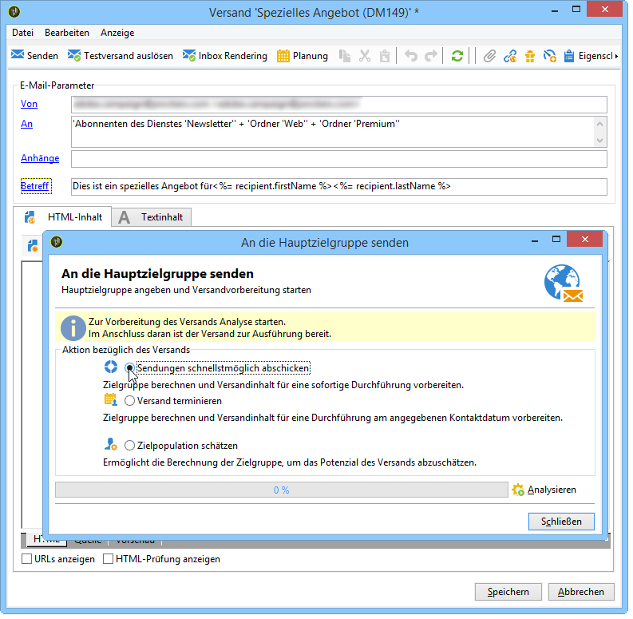

1. Klicken Sie auf **[!UICONTROL Analysieren]**, um die Analyse manuell zu starten.

   Die Fortschrittsleiste zeigt den Fortschritt der Analyse an.

   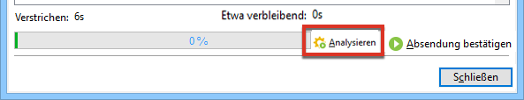

   >[!NOTE]
   >
   >Die bei der Analyse verwendeten Validierungsregeln werden im Abschnitt [Validierung mit Typologien](../../delivery/using/steps-validating-the-delivery.md#validation-process-with-typologies) beschrieben.

1. Es ist jederzeit möglich, den Vorgang durch Klick auf die Schaltfläche **[!UICONTROL Stoppen]** zu unterbrechen.

   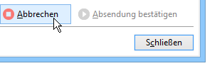

   In der Vorbereitungsphase werden keine Nachrichten gesendet. Sie können die Analyse daher ohne Risiko starten oder abbrechen.

   >[!IMPORTANT]
   >
   >Beim Ausführen friert die Analyse den Versand (oder Testversand) ein. Auf jede Änderung am Versand (oder Testversand) muss eine weitere Analyse folgen, bevor sie anwendbar wird.

1. Warten Sie, bis die Analyse abgeschlossen ist.

   Nach Abschluss der Analyse wird im oberen Bereich des Fensters angezeigt, ob die Sendungsvorbereitung abgeschlossen wurde oder ob Fehler aufgetreten sind. Alle Validierungsschritte, Warnungen und Fehler werden aufgelistet. Farbige Symbole zeigen den Nachrichtentyp an:
   * Das blaue Symbol steht für eine informative Nachricht.
   * Das gelbe Symbol steht für einen nicht kritischen Verarbeitungsfehler.
   * Das rote Symbol steht für einen kritischen Fehler, der die Durchführung des Versands verhindert.

   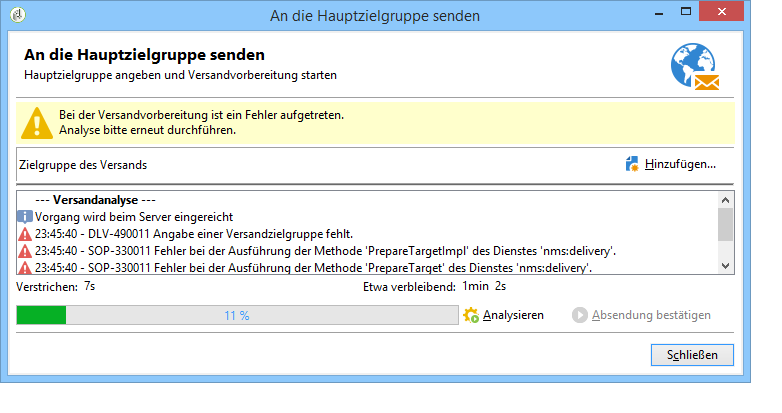

1. Klicken Sie auf **[!UICONTROL Schließen]**, um Fehler (falls vorhanden) zu korrigieren.

1. Nachdem Sie die Änderungen vorgenommen haben, starten Sie die Analyse neu, indem Sie auf **[!UICONTROL Analysieren]** klicken.

Nachdem Sie das Ergebnis der Analyse geprüft haben, können Sie auf **[!UICONTROL Absendung bestätigen]** klicken, um die Nachricht an die angegebene Zielgruppe zu senden. Über eine Bestätigungsnachricht kann der Versand gestartet werden.

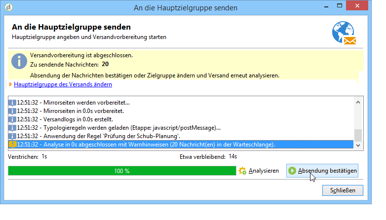

>[!NOTE]
>
>Klicken Sie auf den Link **[!UICONTROL Hauptzielgruppe des Versands ändern]**, wenn die Anzahl der zu sendenden Nachrichten nicht Ihrer Konfiguration entspricht. Passen Sie die Zielpopulation entsprechend an und analysieren Sie erneut den Versand.

### Analyseparameter {#analysis-parameters}

Der **[!UICONTROL Analyse]**-Tab in den Versandeigenschaften ermöglicht in der Analysephase die Konfiguration verschiedener Informationen zur Nachrichtenvorbereitung.

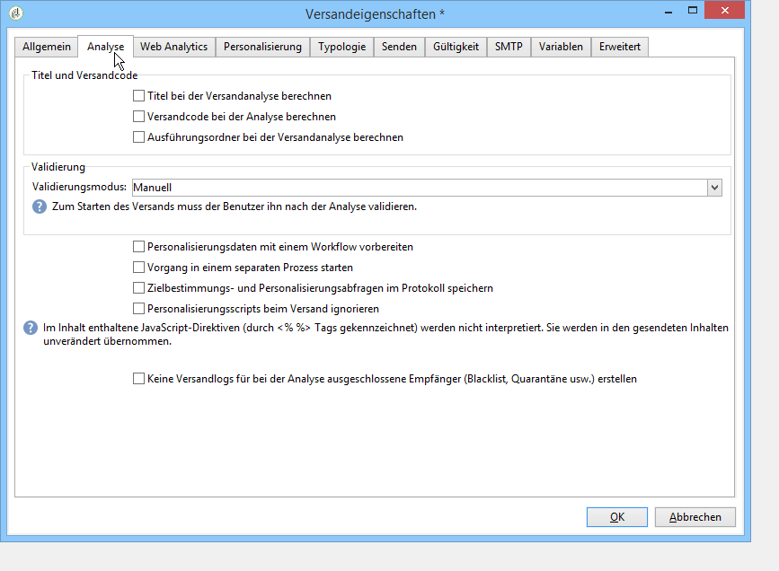

Folgende Optionen stehen zur Verfügung:

* **[!UICONTROL Titel und Versandcode]**: Die Optionen in diesem Abschnitt werden in der Versandanalysephase zur Berechnung der Werte dieser Felder verwendet. Das Feld **[!UICONTROL Ausführungsordner bei der Versandanalyse berechnen]** berechnet den Namen des Ordners, der in der Analysephase diese Versandaktion enthält.
* **[!UICONTROL Validierungsmodus]**: In diesem Feld können Sie nach Abschluss der Analyse einen manuellen oder automatischen Versand definieren. Die Validierungsmodi werden im Abschnitt [Ändern des Validierungsmodus](#changing-the-approval-mode) angezeigt.
* **[!UICONTROL Versandteile in der Datenbank vorbereiten]**: Mit dieser Option können Sie die Leistung bei Versandanalysen verbessern. Weiterführende Informationen hierzu finden Sie in [diesem Abschnitt](#improving-delivery-analysis).
* **[!UICONTROL Personalisierungsdaten mit einem Workflow vorbereiten]**: Mit dieser Option können Sie die Personalisierungsdaten, die in Ihrem Versand enthalten sind, in einem automatischen Workflow vorbereiten, wodurch Sie bei der Verwendung der Personalisierungsfunktion deutlich mehr Leistung erzielen können. Weiterführende Informationen dazu finden Sie unter [Optimieren von Personalisierung](../../delivery/using/personalization-fields.md#optimizing-personalization).
* **[!UICONTROL Vorgang in einem separaten Prozess starten]**: Mit dieser Option können Sie die Versandanalyse in einem separaten Prozess starten. Standardmäßig verwendet die Analysefunktion den Prozess des Adobe Campaign-Anwendungsservers (web nlserver). Durch Auswählen dieser Option stellen Sie sicher, dass die Analyse auch im Falle eines Anwendungsserver-Problems vollständig durchgeführt wird.
* **[!UICONTROL Zielbestimmungs- und Personalisierungsabfragen im Protokoll speichern]** - schreibt in der Analysephase die SQL-Abfrage-Logs in das Versandprotokoll.
* **[!UICONTROL Personalisierungsscripts beim Versand ignorieren]** - im HTML-Inhalt enthaltene JavaScript-Anweisungen werden nicht interpretiert, sondern 1:1 in den gesendeten Inhalten abgebildet. Die Anweisungen beginnen mit dem Tag **&lt;%=**.

### Verbessern der Leistung bei Versandanalysen {#improving-delivery-analysis}

Um die Sendungsvorbereitung zu beschleunigen, können Sie vor dem Starten der Analyse die Option **[!UICONTROL Versandteile in der Datenbank vorbereiten]** aktivieren.

Wenn diese Option aktiviert ist, wird die Sendungsvorbereitung direkt in der Datenbank vorgenommen, was die Analyse erheblich beschleunigen kann.

Diese Option ist derzeit nur verfügbar, wenn folgende Bedingungen erfüllt sind:
* Der Versand muss per E-Mail ausgeführt werden. Die anderen Kanäle werden derzeit nicht unterstützt.
* Sie dürfen kein Mid-Sourcing oder externes Routing nutzen, sondern nur den Routing-Typ &quot;Gebündelter Versand&quot;. Sie können das verwendete Routing auf dem Tab **[!UICONTROL Allgemein]** der **[!UICONTROL Versandeigenschaften]** überprüfen.
* Eine Population, die aus einer externen Datei stammt, kann nicht Zielgruppe sein. Klicken Sie für einen einzelnen Versand in den **[!UICONTROL E-Mail-Parametern]** auf den Link **[!UICONTROL An]** und stellen Sie sicher, dass die Option **[!UICONTROL Von der Datenbank ausgehend definiert]** aktiviert ist. Achten Sie bei einem Versand, der in einem Workflow verwendet wird, darauf, dass bei den Empfängern **[!UICONTROL Werden durch die Eingangsereignisse angegeben]** auf dem Tab **[!UICONTROL Versand]** markiert ist.
* Sie müssen eine PostgreSQL-Datenbank verwenden.

### Analysepriorität konfigurieren {#analysis-priority-}

Wenn Ihr Versand Teil einer Kampagne ist, bietet der **[!UICONTROL Erweitert]**-Tab eine zusätzliche Option, die die Hierarchisierung der Sendungen innerhalb der Kampagne ermöglicht.

Jeder Versand wird analysiert, bevor die Nachrichten abgeschickt werden. Die Analysedauer hängt von der Größe der Extraktionsdatei des Versands ab. Je größer die Datei, desto länger die Analyse. Nachfolgende Sendungen werden verzögert.

Die Optionen im Bereich **[!UICONTROL Nachrichtenvorbereitung durch die Steuerung]** erlauben die Priorisierung der Versandanalysen eines Kampagnen-Workflows.

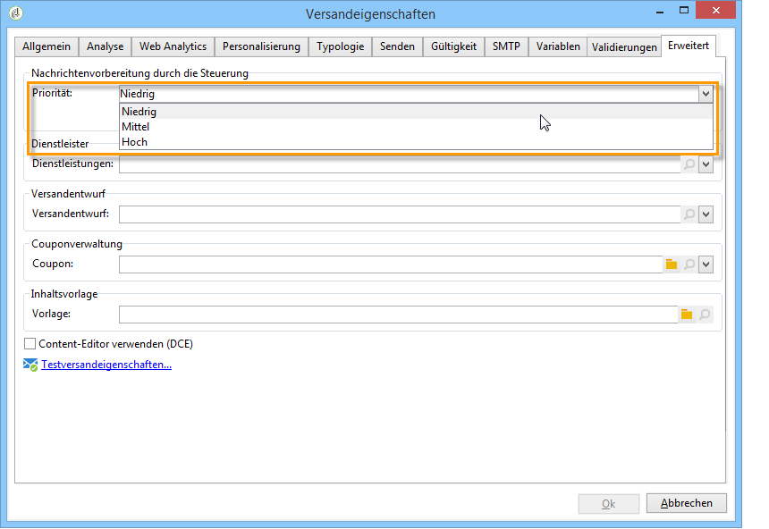

Einem großen Versand sollte also vorzugsweise eine niedrige Priorität zugewiesen werden, um die Analyse der anderen Sendungen des Workflows nicht zu verlangsamen.

>[!NOTE]
>
>Um sicherzustellen, dass die Analyse umfangreicher Sendungen die Durchführung Ihrer Workflows nicht bremst, haben Sie die Möglichkeit, die Option **[!UICONTROL Ausführung auf einen Zeitpunkt mit geringer Auslastung verschieben]** anzukreuzen.

## Testversand durchführen {#sending-a-proof}

Um eventuelle Konfigurationsfehler zu erkennen, ist es empfehlenswert, Ihre Sendungen einem Validierungszyklus zu unterziehen. Auf diese Weise können Sie den Inhalt wiederholt von Testempfängern prüfen lassen. Schalten Sie nach jeder Änderung einen neuen Testversand, um den Inhalt abschließend validieren zu lassen.

>[!NOTE]
>
>* Die verfügbaren Validierungsmodi werden unter [Validierungsmodus ändern](../../delivery/using/steps-validating-the-delivery.md#changing-the-approval-mode) detailliert beschrieben.
>* Die Konfiguration der Testversand-Zielgruppe wird unter [Spezifische Testversand-Zielgruppe definieren](../../delivery/using/steps-defining-the-target-population.md#defining-a-specific-proof-target) beschrieben.

>

Gehen Sie wie folgt vor, um einen Testversand durchzuführen:

1. Stellen Sie sicher, dass die Testversand-Zielgruppe wie unter [Spezifische Testversand-Zielgruppe definieren](../../delivery/using/steps-defining-the-target-population.md#defining-a-specific-proof-target) beschrieben konfiguriert wurde.
1. Wählen Sie **[!UICONTROL Testversand auslösen]** in der Symbolleiste am oberen Rand des Versand-Assistenten aus.

   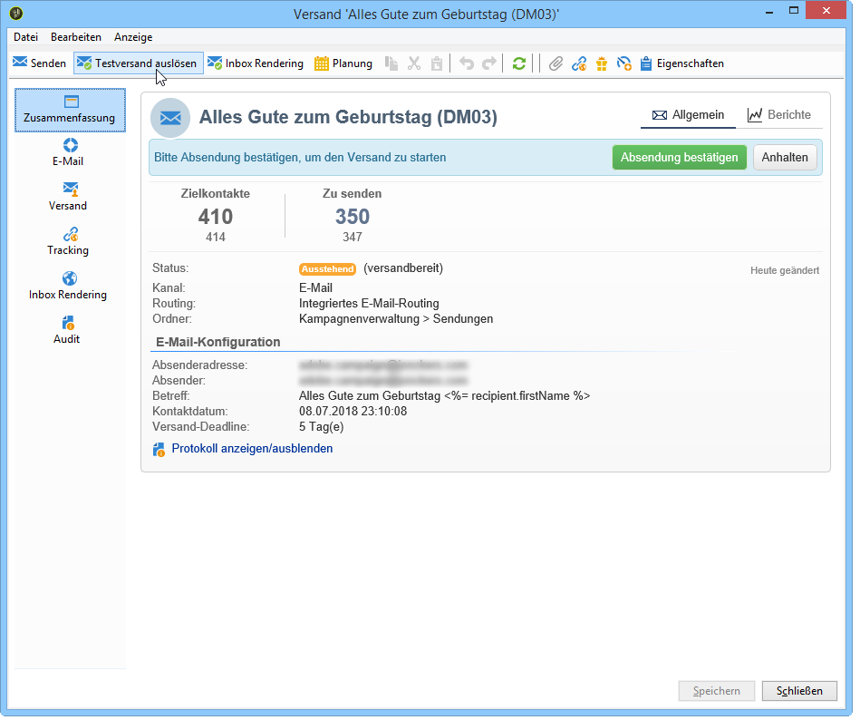

1. Starten Sie die Nachrichtenanalyse. Siehe [Versand analysieren](../../delivery/using/steps-validating-the-delivery.md#analyzing-the-delivery).
1. Sie können den Versand jetzt starten (siehe [Versand senden](../../delivery/using/steps-sending-the-delivery.md)).

   Nach dem Versand gestartet wurde, wird der Testversand in der Versandliste angezeigt und automatisch erstellt und nummeriert. Er kann bearbeitet werden, wenn Sie auf den Inhalt und die Eigenschaften zugreifen möchten. Weiterführende Informationen hierzu finden Sie auf dieser [Seite](../../delivery/using/monitoring-a-delivery.md#delivery-dashboard).

   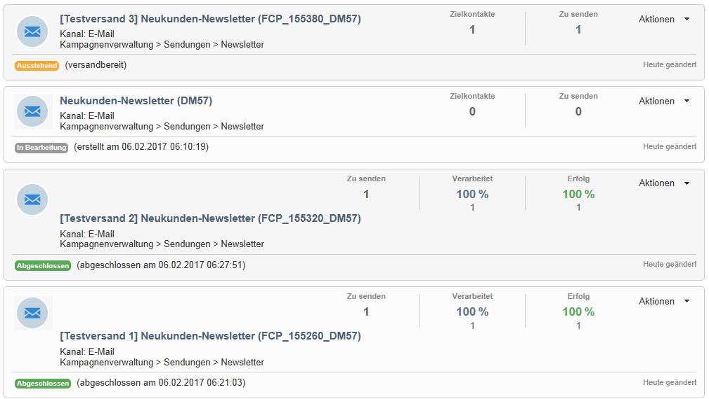

   >[!NOTE]
   >
   >Wenn ein Versand mit Inhalten in verschiedenen Formaten (HTML und Text) erstellt wurde, können Sie entscheiden, welches Format den Testversand-Empfängern zugestellt werden soll. Wählen Sie im unteren Bereich des Fensters zur Testversand-Zielgruppenauswahl die entsprechende Option aus.

   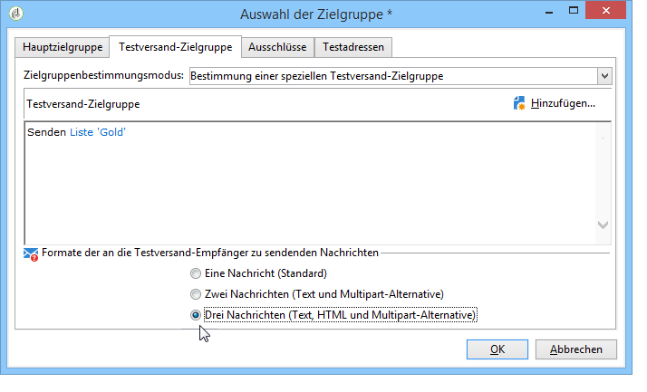

Zur Einarbeitung der Hinweise der Testversand-Empfänger werden verschiedene Änderungen im Versandinhalt vorzunehmen sein. Im Anschluss an diese Änderungen müssen Analyse und Testversand erneut durchgeführt werden. Die fortlaufend nummerierten Testsendungen werden im Versandprotokoll verzeichnet.

Klicken Sie auf den Tab **[!UICONTROL Testsendungen]** des Protokolls (Rubrik **[!UICONTROL Verfolgung]**), um einen Überblick über die gesamte Testversandliste zu erhalten.

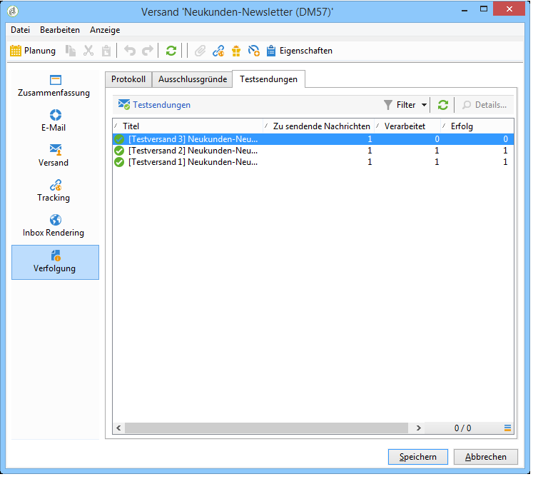

Nach Abschluss des Validierungszyklus kann der Versand der Hauptzielgruppe zugestellt werden.

Im Tab **[!UICONTROL Erweitert]** der Versandeigenschaften kann der Testversand konfiguriert werden. Bei Bedarf können Sie die Ausschlussregeln überschreiben.

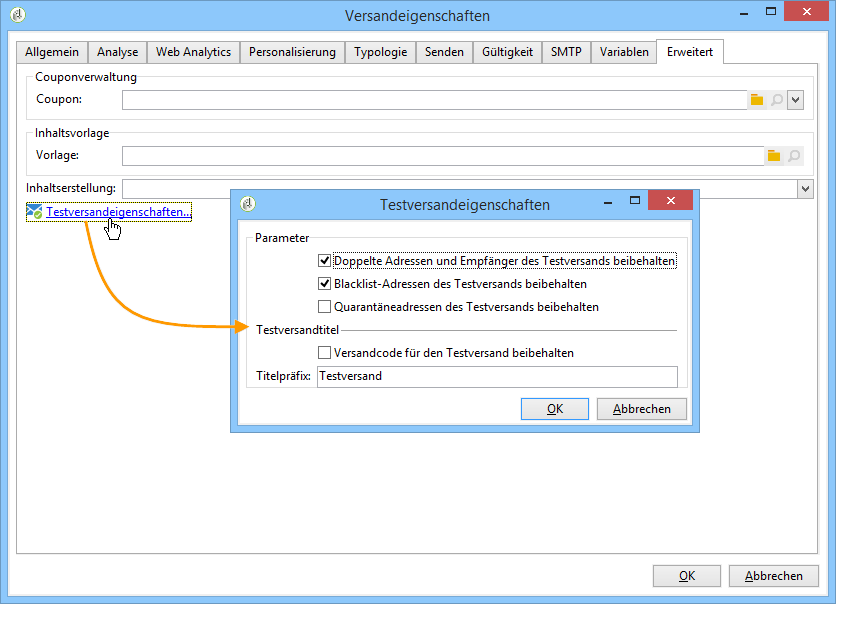

Folgende Optionen stehen zur Verfügung:

* Beibehaltung von doppelten Adressen und Empfängern;
* Mit beiden der folgenden Optionen können Sie Empfänger auf der Blockierungsliste und Adressen in der Quarantäne beibehalten. Eine Beschreibung dieser Optionen für die Hauptzielgruppe finden Sie unter [Ausschlussparameter anpassen](../../delivery/using/steps-defining-the-target-population.md#customizing-exclusion-settings). Im Gegensatz zur Zielgruppe eines Versands, bei dem diese Adressen standardmäßig ausgeschlossen sind, werden sie standardmäßig für die Zielgruppe eines Testversands beibehalten.
* Wenn Sie die Option **[!UICONTROL Versandcode für den Testversand beibehalten]** auswählen, werden Haupt- und Testversand unter dem gleichen Code geführt, welcher im ersten Schritt des Versandassistenten vergeben wird.
* Standardmäßig enthält der Betreff des Testversands &#39;Proof #‘, wobei # der Nummer des Testversands entspricht. Sie können dieses Präfix im Feld **[!UICONTROL Titelpräfix]** ändern.

## Validierung mit Typologien {#validation-process-with-typologies}

Während der Versandanalyse werden Inhalt und Konfiguration anhand gewisser Regeln geprüft. Standardmäßig beziehen sich die **Typologieregeln** für E-Mails auf folgende Punkte:

* Validierung des Betreffs,
* Validierung von URLs und Bildern,
* Validierung der URL-Titel,
* Validierung des Abmelde-Links,
* Prüfung der Testversandgröße,
* Prüfung der Gültigkeitsdauer,
* Prüfung der Schub-Planung.

Die jeweils anzuwendenden Regeln werden im **[!UICONTROL Typologie]**-Tab der Versandeigenschaften ausgewählt.

Sie können auf die Typologieregeln im Knoten **[!UICONTROL Administration > Kampagnenverwaltung > Typologieverwaltung > Typologieregeln]** zugreifen, um z. B. eine ausführliche Beschreibung zu erhalten oder die Reihenfolge der Anwendung festzulegen.

An dieser Stelle können auch neue Regeln und Typologien erstellt werden. Dies sollte jedoch erfahrenen Anwendern mit JavaScript-Kenntnissen vorbehalten bleiben.

Weiterführende Informationen zu Typologieregeln finden Sie unter [Über Kampagnentypologien](../../campaign/using/about-campaign-typologies.md).

Klicken Sie zur Bearbeitung der aktuellen Typologie auf das Symbol **[!UICONTROL Verknüpftes Element öffnen]** (rechts vom Feld **[!UICONTROL Typologie]**).

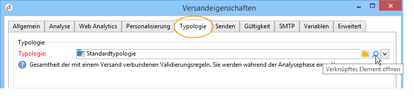

Im Tab **[!UICONTROL Regeln]** finden Sie die Liste der anzuwendenden Typologieregeln. Ihre genaue Konfiguration können Sie durch Klick auf das Symbol **[!UICONTROL Details...]** einsehen:

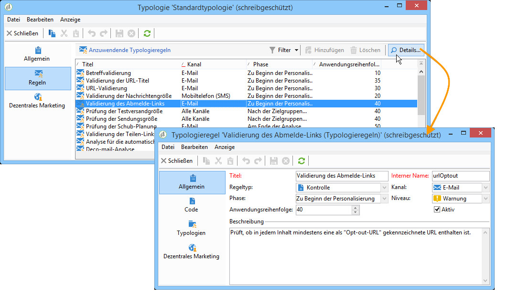

>[!NOTE]
>
>Typologien vom Typ **[!UICONTROL Schlichtung]** kommen im Bereich des Werbedruck-Managements zum Einsatz. Lesen Sie diesbezüglich [diesen Abschnitt](../../campaign/using/about-marketing-resource-management.md).

## Validierungsmodus ändern {#changing-the-approval-mode}

Der **[!UICONTROL Analyse]**-Tab in den Versandeigenschaften bietet die Möglichkeit, einen Validierungsmodus zu wählen. So können Sie angeben, ob ein Versand trotz Erzeugung von Warnhinweisen bei der Analyse (z. B. weil im Versandbetreff bestimmte Sonderzeichen wie § oder $ verwendet wurden) gestartet werden soll oder nicht. Standardmäßig muss der Benutzer den Versand der Nachrichten nach Abschluss der Analyse bestätigen. Es handelt sich in diesem Fall um eine **manuelle** Validierung.

In der Dropdown-Liste des entsprechenden Felds

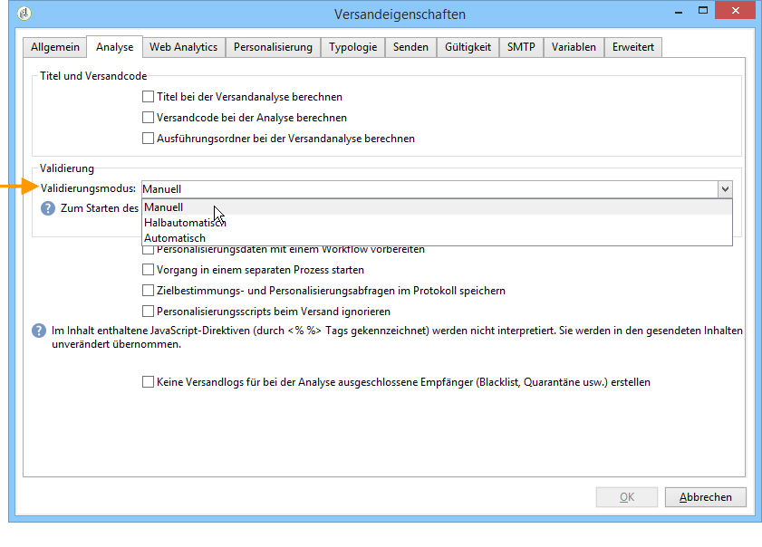

stehen folgende Validierungsmodi zur Verfügung:

* **[!UICONTROL Manuell]**: Am Ende der Analysephase muss der Benutzer die Absendung bestätigen, um die Nachrichten abzuschicken. Klicken Sie dazu auf die Schaltfläche **[!UICONTROL Start]**, um den Versand zu starten.
* **[!UICONTROL Halbautomatisch]**: Die Nachrichten werden automatisch abgeschickt, wenn die Analysephase ohne Warnhinweise abschließt.
* **[!UICONTROL Automatisch]**: Die Nachrichten werden unabhängig vom Ergebnis der Analysephase automatisch abgeschickt.
