# Versand validieren {#validating-the-delivery}

Der erstellte und konfigurierte Versand muss vor dem Senden an die Hauptzielgruppe validiert werden.

Gehen Sie dazu wie folgt vor:

1. **Versand analysieren** – hier erfolgt die Vorbereitung der zu sendenden Nachrichten. [Weitere Informationen](#analyzing-the-delivery).

   Die während der Analyse angewendeten Regeln werden in [diesem Abschnitt](#validation-process-with-typologies) erläutert. Die verfügbaren Validierungsmodi werden im Abschnitt [Ändern des Validierungsmodus](#changing-the-approval-mode) detailliert beschrieben.

1. **Durchführen von Testsendungen**: In diesem Schritt können Sie Inhalte, URLs, Personalisierung usw. steuern. Weitere Informationen finden Sie unter [Durchführen eines Testversands](steps-validating-the-delivery.md#sending-a-proof) und [Definieren einer spezifischen Testversand-Zielgruppe](steps-defining-the-target-population.md#defining-a-specific-proof-target).

>[!IMPORTANT]
>
>Die beiden oben genannten Schritte MÜSSEN nach jeder Änderung am Nachrichteninhalt ausgeführt werden.

## Analysieren Sie den Versand {#analyzing-the-delivery}

Die Analyse ist die Phase, in der die Zielpopulation berechnet und der Versandinhalt vorbereitet wird. Sobald sie abgeschlossen ist, ist der Versand startbereit.

### Analyse starten {#launching-the-analysis}

1. Um die Versandanalyse zu starten, klicken Sie auf **[!UICONTROL Senden]**.
1. Wählen Sie **[!UICONTROL Sendungen schnellstmöglich abschicken]**.

   

1. Klicken Sie auf **[!UICONTROL Analysieren]**, um die Analyse manuell zu starten.

   Die Fortschrittsleiste zeigt den Fortschritt der Analyse an.

   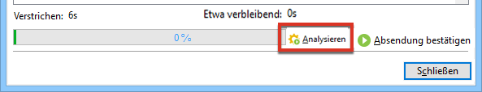

   >[!NOTE]
   >
   >Die bei der Analyse verwendeten Validierungsregeln werden im Abschnitt [Validierung mit Typologien](steps-validating-the-delivery.md#validation-process-with-typologies) beschrieben.

1. Es ist jederzeit möglich, den Vorgang durch Klick auf die Schaltfläche **[!UICONTROL Stoppen]** zu unterbrechen.

   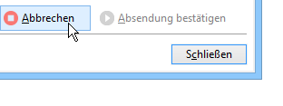

   In der Vorbereitungsphase werden keine Nachrichten gesendet. Sie können die Analyse daher ohne Risiko starten oder abbrechen.

   >[!IMPORTANT]
   >
   >Beim Ausführen friert die Analyse den Versand (oder Testversand) ein. Auf jede Änderung am Versand (oder Testversand) muss eine weitere Analyse folgen, bevor sie anwendbar wird.

1. Warten Sie, bis die Analyse abgeschlossen ist.

   Nach Abschluss der Analyse wird im oberen Bereich des Fensters angezeigt, ob die Sendungsvorbereitung abgeschlossen wurde oder ob Fehler aufgetreten sind. Alle Validierungsschritte, Warnungen und Fehler werden aufgelistet. Farbige Symbole zeigen den Nachrichtentyp an:
   * Das blaue Symbol steht für eine informative Nachricht.
   * Das gelbe Symbol steht für einen nicht kritischen Verarbeitungsfehler.
   * Das rote Symbol steht für einen kritischen Fehler, der die Durchführung des Versands verhindert.

   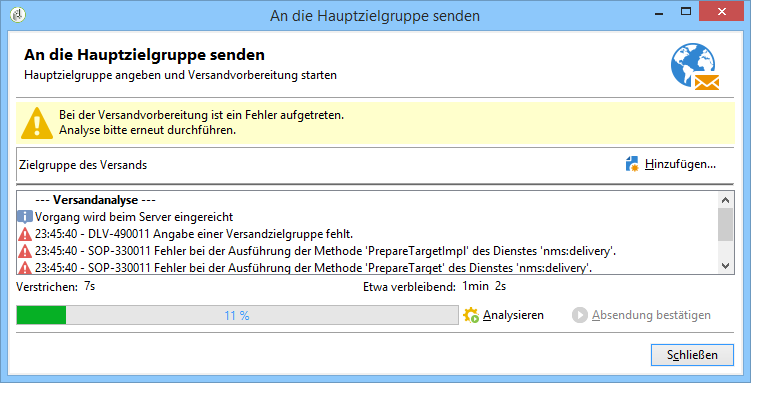

1. Klicken Sie auf **[!UICONTROL Schließen]**, um Fehler (falls vorhanden) zu korrigieren.

1. Nachdem Sie die Änderungen vorgenommen haben, starten Sie die Analyse neu, indem Sie auf **[!UICONTROL Analysieren]** klicken.

Nachdem Sie das Ergebnis der Analyse geprüft haben, können Sie auf **[!UICONTROL Absendung bestätigen]** klicken, um die Nachricht an die angegebene Zielgruppe zu senden. Über eine Bestätigungsnachricht kann der Versand gestartet werden.

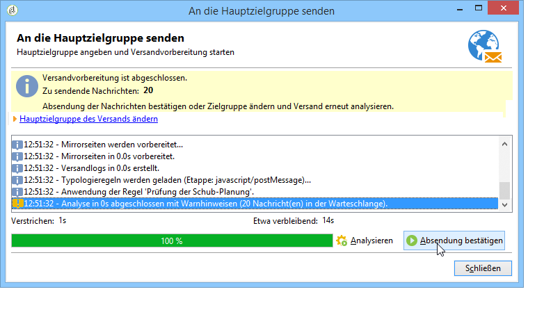

>[!NOTE]
>
>Klicken Sie auf den Link **[!UICONTROL Hauptzielgruppe des Versands ändern]**, wenn die Anzahl der zu sendenden Nachrichten nicht Ihrer Konfiguration entspricht. Damit können Sie die Definition der Zielgruppenpopulation ändern und die Analyse erneut starten.

### Analyseeinstellungen {#analysis-parameters}

Der **[!UICONTROL Analyse]**-Tab in den Versandeigenschaften ermöglicht in der Analysephase die Konfiguration verschiedener Informationen zur Nachrichtenvorbereitung.

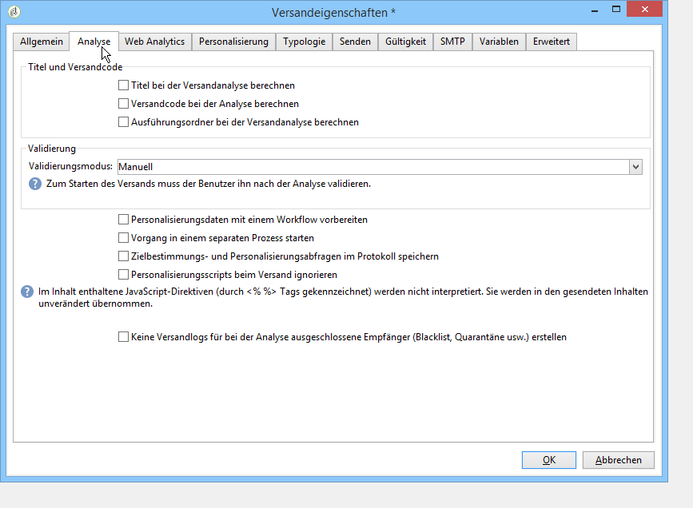

Folgende Optionen stehen zur Verfügung:

* **[!UICONTROL Titel und Versandcode]**: Die Optionen in diesem Abschnitt werden in der Versandanalysephase zur Berechnung der Werte dieser Felder verwendet. Das Feld **[!UICONTROL Ausführungsordner bei der Versandanalyse berechnen]** berechnet den Namen des Ordners, der in der Analysephase diese Versandaktion enthält.
* **[!UICONTROL Validierungsmodus]**: In diesem Feld können Sie nach Abschluss der Analyse einen manuellen oder automatischen Versand definieren. Die Validierungsmodi werden im Abschnitt [Validierungsmodus ändern](#changing-the-approval-mode) angezeigt.
* **[!UICONTROL Versandteile in der Datenbank vorbereiten]**: Mit dieser Option können Sie die Performance bei Versandanalysen verbessern. Weiterführende Informationen hierzu finden Sie in [diesem Abschnitt](#improving-delivery-analysis).
* **[!UICONTROL Personalisierungsdaten mit einem Workflow vorbereiten]**: Mit dieser Option können Sie die Personalisierungsdaten, die in Ihrem Versand enthalten sind, in einem automatischen Workflow vorbereiten, wodurch Sie bei der Verwendung der Personalisierungsfunktion deutlich mehr Performance erzielen können. Weiterführende Informationen dazu finden Sie unter [Optimieren der Personalisierung](personalization-fields.md#optimizing-personalization).
* **[!UICONTROL Auftrag in einem separaten Prozess starten]**: Mit dieser Option können Sie die Versandanalyse in einem separaten Prozess starten. Standardmäßig verwendet die Analysefunktion den Prozess des Adobe Campaign-Anwendungs-Servers (nlserver web). Durch Ankreuzen dieser Option stellen Sie sicher, dass die Analyse selbst im Falle eines Problems mit dem Anwendungs-Server vollständig durchgeführt wird.
* **[!UICONTROL Zielbestimmungs- und Personalisierungsabfragen im Protokoll speichern]**: Schreibt in der Analysephase die SQL-Abfrage-Logs in das Versandprotokoll.
* **[!UICONTROL Personalisierungsscripts beim Versand ignorieren]**: Mit dieser Option wird die Interpretation von im HTML-Inhalt enthaltenen JavaScript-Anweisungen umgangen.Sie werden so, wie sie sind, in den bereitgestellten Inhalten angezeigt. Diese Richtlinien werden mit dem Tag **&lt;%=** eingeleitet).

### Performance bei Versandanalysen verbessern {#improving-delivery-analysis}

Um die Sendungsvorbereitung zu beschleunigen, können Sie vor dem Starten der Analyse die Option **[!UICONTROL Versandteile in der Datenbank vorbereiten]** aktivieren.

Wenn diese Option aktiviert ist, wird die Sendungsvorbereitung direkt in der Datenbank vorgenommen, was die Analyse erheblich beschleunigen kann.

Diese Option ist derzeit nur verfügbar, wenn folgende Bedingungen erfüllt sind:

* Der Versand muss per E-Mail ausgeführt werden. Die anderen Kanäle werden derzeit nicht unterstützt.
* Sie dürfen kein Mid-Sourcing oder externes Routing nutzen, sondern nur den Routing-Typ &quot;Gebündelter Versand&quot;. Sie können das verwendete Routing auf dem Tab **[!UICONTROL Allgemein]** der **[!UICONTROL Versandeigenschaften]** überprüfen.
* Eine Population, die aus einer externen Datei stammt, kann nicht Zielgruppe sein. Klicken Sie für einen einzelnen Versand in den **[!UICONTROL E-Mail-Parametern]** auf den Link **[!UICONTROL An]** und stellen Sie sicher, dass die Option **[!UICONTROL Von der Datenbank ausgehend definiert]** aktiviert ist. Achten Sie bei einem Versand, der in einem Workflow verwendet wird, darauf, dass bei den Empfängern **[!UICONTROL Werden durch die Eingangsereignisse angegeben]** auf dem Tab **[!UICONTROL Versand]** markiert ist.
* Sie müssen eine PostgreSQL-Datenbank verwenden.

### Analysepriorität konfigurieren {#analysis-priority-}

Wenn Ihr Versand Teil einer Kampagne ist, bietet die Registerkarte **[!UICONTROL Erweitert]** eine zusätzliche Option. Diese ermöglicht die Hierarchisierung der Sendungen innerhalb derselben Kampagne.

Vor dem Senden wird jeder Versand analysiert. Die Analysedauer hängt von der Versandextraktionsdatei ab. Je größer die Datei, desto länger die Analyse. Nachfolgende Sendungen werden verzögert.

Die Optionen im Bereich **[!UICONTROL Nachrichtenvorbereitung durch die Steuerung]** erlauben die Priorisierung der Versandanalysen eines Kampagnen-Workflows.

Einem großen Versand sollte also vorzugsweise eine niedrige Priorität zugewiesen werden, um die Analyse der anderen Sendungen des Workflows nicht zu verlangsamen.

>[!NOTE]
>
>Um sicherzustellen, dass die Analyse umfangreicher Sendungen die Durchführung Ihrer Workflows nicht bremst, haben Sie die Möglichkeit, die Option **[!UICONTROL Ausführung auf einen Zeitpunkt mit geringer Auslastung verschieben]** anzukreuzen.

## Durchführen eines Testversands {#sending-a-proof}

Um mögliche Fehler in der Nachrichtenkonfiguration zu erkennen,  ist es empfehlenswert, einen Validierungszyklus für den Versand einzurichten. Stellen Sie sicher, dass Inhalte so oft wie nötig genehmigt werden, indem Sie Testsendungen an Testempfänger und -empfängerinnen senden. Schalten Sie nach jeder Änderung einen neuen Testversand, um den Inhalt abschließend validieren zu lassen.

>[!NOTE]
>
>Die verfügbaren Validierungsmodi werden unter [Ändern des Validierungsmodus](steps-validating-the-delivery.md#changing-the-approval-mode) detailliert beschrieben.

Gehen Sie wie folgt vor, um einen Testversand durchzuführen:

1. Stellen Sie sicher, dass die Testversand-Zielgruppe wie unter [Spezifische Testversand-Zielgruppe definieren](steps-defining-the-target-population.md#defining-a-specific-proof-target) beschrieben konfiguriert wurde.

1. Wählen Sie **[!UICONTROL Testversand auslösen]** in der Symbolleiste am oberen Rand des Versandassistenten aus.

   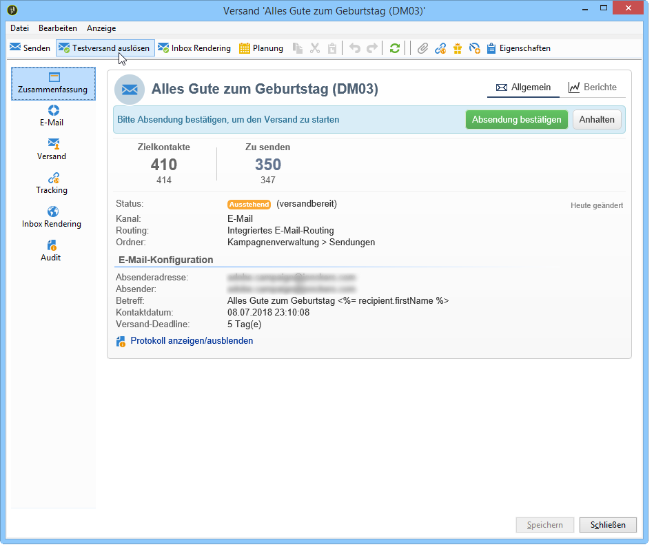

1. Starten Sie die Nachrichtenanalyse. Siehe [Versand analysieren](steps-validating-the-delivery.md#analyzing-the-delivery).
1. Sie können den Versand jetzt starten (siehe [Versand durchführen](steps-sending-the-delivery.md)).

   Nach dem Versand gestartet wurde, wird der Testversand in der Versandliste angezeigt und automatisch erstellt und nummeriert. Er kann bearbeitet werden, wenn Sie auf den Inhalt und die Eigenschaften zugreifen möchten. Weiterführende Informationen hierzu finden Sie auf dieser [Seite](about-delivery-monitoring.md).

   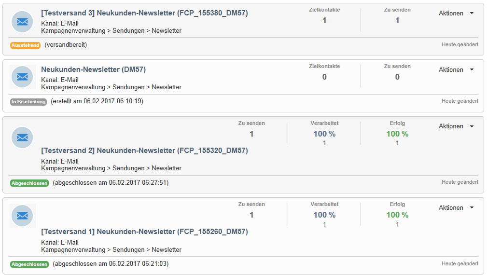

   >[!NOTE]
   >
   >Wenn ein Versand mit Inhalten in verschiedenen Formaten (HTML und Text) erstellt wurde, können Sie entscheiden, welches Format den Testversand-Empfängern zugestellt werden soll. Wählen Sie im unteren Bereich des Fensters zur Testversand-Zielgruppenauswahl die entsprechende Option aus.

   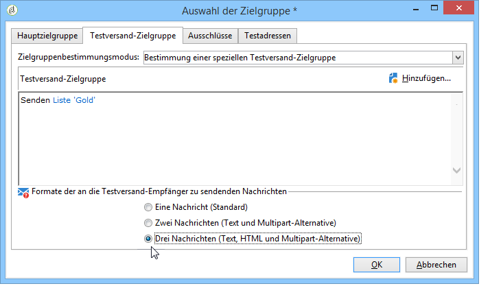

Sie möchten möglicherweise den Inhalt des Versands aufgrund von Kommentaren der Validierungsgruppe des Testversands anpassen. Nachdem Sie Ihre Änderungen vorgenommen haben, müssen Sie die Analyse neu starten und dann einen weiteren Testversand durchführen. Jeder neue Testversand wird nummeriert und im Versandprotokoll protokolliert.

Klicken Sie auf den Tab **[!UICONTROL Testsendungen]** des Protokolls (Rubrik **[!UICONTROL Verfolgung]**), um einen Überblick über die gesamte Testversandliste zu erhalten.

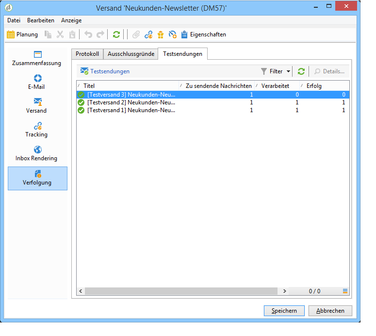

Sie müssen so viele Testsendungen wie nötig durchführen, bis der Inhalt des Versands fertiggestellt ist. Danach können Sie den Versand an die Hauptzielgruppe senden und den Validierungszyklus beenden.

Auf der Registerkarte **[!UICONTROL Erweitert]** der Versandeigenschaften können Sie die Eigenschaften des Testversands definieren. Bei Bedarf können Sie die Regeln zum Ausschluss von Empfangenden überschreiben.

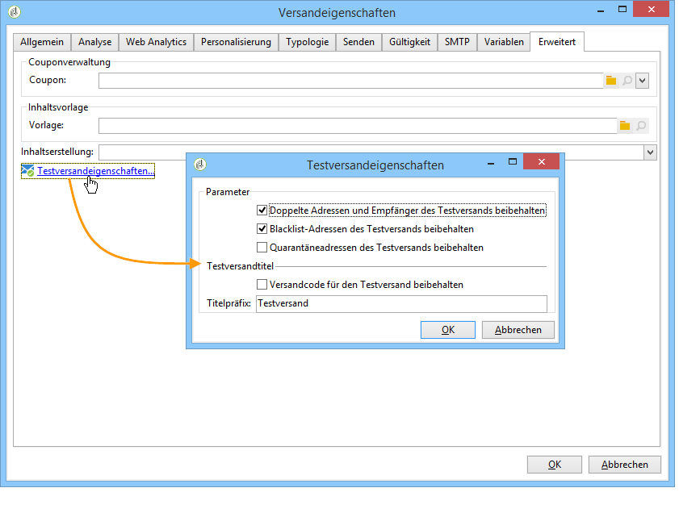

Folgende Optionen stehen zur Verfügung:

* Beibehaltung von doppelten Adressen und Empfängern;
* Mit beiden der folgenden Optionen können Sie Empfänger auf der Blockierungsliste und Adressen in der Quarantäne beibehalten. Eine Beschreibung dieser Optionen für die Hauptzielgruppe finden Sie unter [Ausschlussparameter anpassen](steps-defining-the-target-population.md#customizing-exclusion-settings). Im Gegensatz zur Zielgruppe eines Versands, bei dem diese Adressen standardmäßig ausgeschlossen sind, werden sie standardmäßig für die Zielgruppe eines Testversands beibehalten.
* Mit der Option **[!UICONTROL Versand-Code für den Testversand beibehalten]**, können Sie den Testversand mit demselben Versand-Code verknüpfen, der für den Versand, auf den er sich bezieht, definiert ist. Dieser Code wird im ersten Schritt des Versandassistenten angegeben.
* Standardmäßig wird dem Betreff des Testversands „Testversand #“ vorangestellt, wobei # die Nummer des Testversands ist. Sie können dieses Präfix im Feld **[!UICONTROL Titelpräfix]** ändern.

## Validierungsprozess mit Typologien {#validation-process-with-typologies}

Vor dem Versand von Nachrichten sollten Sie die Kampagne analysieren, um Inhalt und Konfiguration zu validieren. Die in der Vorbereitungsphase anzuwendenden Validierungsregeln sind in einer **Typologie** festgelegt. Standardmäßig umfasst die Analyse für E-Mails die folgenden Punkte:

* Validierung des Betreffs,
* Validierung von URLs und Bildern,
* Validierung der URL-Titel,
* Validierung des Abmelde-Links,
* Prüfung der Testversandgröße,
* Prüfung der Gültigkeitsdauer,
* Prüfung der Schub-Planung.

Die jeweils anzuwendenden Regeln werden im **[!UICONTROL Typologie]**-Tab der Versandeigenschaften ausgewählt.

Sie können auf die Typologieregeln im Knoten **[!UICONTROL Administration > Kampagnenverwaltung > Typologieverwaltung > Typologieregeln]** zugreifen, um z. B. eine ausführliche Beschreibung zu erhalten oder die Reihenfolge der Anwendung festzulegen.

Von diesem Knoten aus können Sie neue Regeln erstellen und neue Typologien definieren. Diese Aufgaben sind jedoch erfahrenen Benutzenden vorbehalten, die JavaScript kennen.

Weiterführende Informationen zu Typologieregeln finden Sie auf [dieser Seite](../../campaign-opt/using/about-campaign-typologies.md).

Um die aktuelle Typologie zu bearbeiten, klicken Sie auf das Symbol **[!UICONTROL Link bearbeiten]** rechts neben dem Feld **[!UICONTROL Typologie]**.

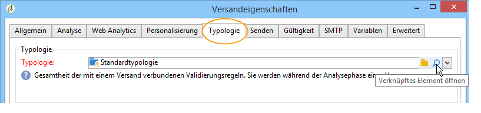

Die Registerkarte **[!UICONTROL Regel]** enthält eine Liste der anzuwendenden Typologieregeln. Wählen Sie eine Regel aus und klicken Sie auf das Symbol **[!UICONTROL Detail…]**, um die Konfiguration anzuzeigen:

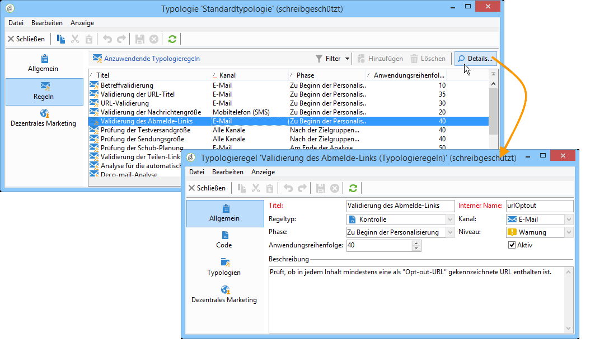

>[!NOTE]
>
>**[!UICONTROL Schlichtung]** Typologien werden im Rahmen des Werbedruck-Managements verwendet. Weiterführende Informationen hierzu finden Sie in [diesem Abschnitt](../../mrm/using/about-marketing-resource-management.md).

## Ändern des Genehmigungsmodus {#changing-the-approval-mode}

Auf der Registerkarte **[!UICONTROL Analyse]** der Versandeigenschaften können Sie den Validierungsmodus auswählen. Wenn bei der Analyse Warnungen erzeugt werden (z. B. wenn im Betreff des Versands bestimmte Zeichen mit einem Akzent versehen wurden usw.), können Sie den Versand so konfigurieren, dass festgelegt wird, ob er trotzdem ausgeführt werden soll oder nicht. Standardmäßig müssen Benutzende den Nachrichtenversand am Ende der Analysephase bestätigen: Hierbei handelt es sich um eine **manuelle** Validierung.

In der Dropdown-Liste des entsprechenden Felds

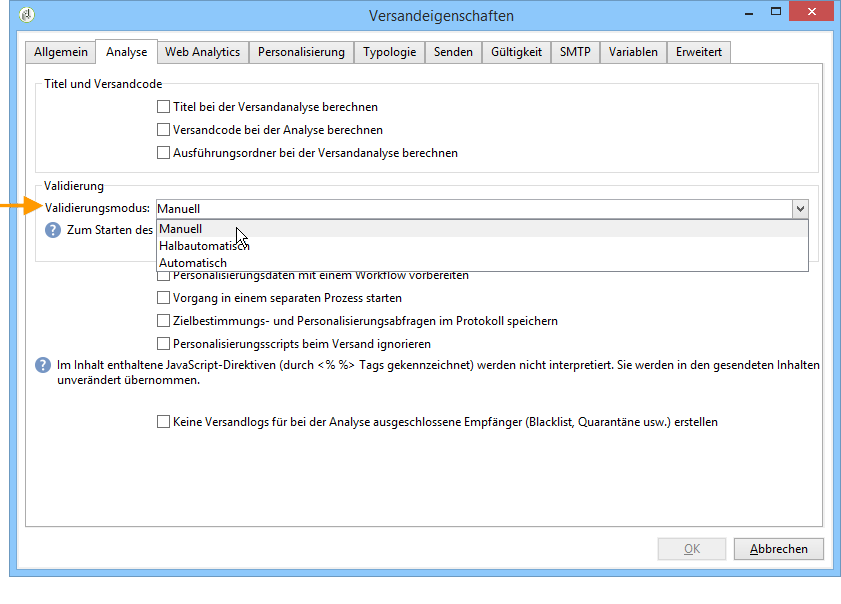

stehen folgende Validierungsmodi zur Verfügung:

* **[!UICONTROL Manuell]**: Am Ende der Analysephase muss der Benutzer die Absendung bestätigen, um die Nachrichten abzuschicken. Klicken Sie dazu auf die Schaltfläche **[!UICONTROL Start]**, um den Versand zu starten.
* **[!UICONTROL Halbautomatisch]**: Die Nachrichten werden automatisch abgeschickt, wenn die Analysephase ohne Warnhinweise abschließt.
* **[!UICONTROL Automatisch]**: Die Nachrichten werden unabhängig vom Ergebnis der Analysephase automatisch abgeschickt.
