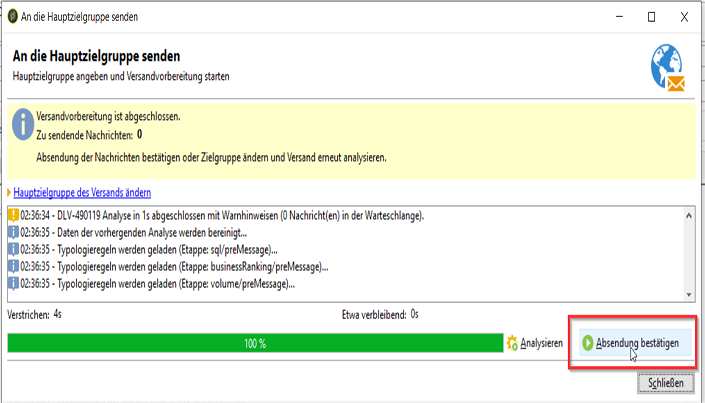

# Versand validieren {#validating-the-delivery}

Der erstellte und konfigurierte Versand muss vor dem Senden an die Hauptzielgruppe validiert werden.

Gehen Sie dazu wie folgt vor:

1. **Analyse der Bereitstellung**: In diesem Schritt können Sie die zu sendenden Nachrichten vorbereiten. Weitere Informationen finden Sie unter [Analysieren der Bereitstellung](#analyzing-the-delivery).

   Die verfügbaren Überprüfungsmodi werden unter [Ändern des Genehmigungsmodus](../../delivery/using/steps-validating-the-delivery.md#changing-the-approval-mode)beschrieben.

1. **Proofs** senden: In diesem Schritt können Sie Inhalte, URLs, Personalisierungsfelder usw. genehmigen. Weitere Informationen finden Sie unter [Senden eines Tests](../../delivery/using/steps-validating-the-delivery.md#sending-a-proof) und [Definieren eines bestimmten Proof-Ziels](../../delivery/using/steps-defining-the-target-population.md#defining-a-specific-proof-target).

>[!CAUTION]
>
>Beide Schritte sind erforderlich und müssen nach jeder Änderung des Nachrichteninhalts wiederholt werden.

## Versand analysieren {#analyzing-the-delivery}

Die Analyse ist der Zeitraum, in dem die Zielpopulation berechnet und der Bereitstellungsinhalt vorbereitet wird. Sobald die Lieferung abgeschlossen ist, ist die Lieferung bereit zu senden. Um die Auslieferungsanalyse zu starten, klicken Sie auf **[!UICONTROL Send]** und wählen Sie **[!UICONTROL Deliver as soon as possible]**.

Über die **[!UICONTROL Analyze]** Schaltfläche können Sie die Analyse manuell starten. Die Fortschrittsleiste zeigt den Fortschritt der Analyse an. Im unteren Bereich des Fensters wird das Analyseergebnis angezeigt. Über Sondersymbole werden Warnungen angezeigt.

>[!NOTE]
>
>Die Validierungsregeln werden unter [Validierung mit Typologien](../../delivery/using/steps-validating-the-delivery.md#validation-process-with-typologies)beschrieben.

You can stop this job at any time by clicking **[!UICONTROL Stop]**.

Während der Analysephase werden noch keine Nachrichten versandt. Sie können diesen Vorgang daher so oft wie nötig starten und unterbrechen.

>[!CAUTION]
>
>Der Zustand des Versands (oder Testversands) wird zum Zeitpunkt der Analyse festgeschrieben. Jede Änderung des Versands (oder Testversands) muss durch eine erneute Analysephase bestätigt werden.

Der letzte Logeintrag zeigt eventuelle Fehler und deren Anzahl an. Ein spezifisches Symbol verdeutlicht den Fehlertypen. Ein gelbes Symbol kennzeichnet beispielsweise einen nicht blockierenden Verarbeitungsfehler, während ein rotes Symbol einen Fehler bezeichnet, der den Start des Versands verhindert.

Klicken Sie auf **[!UICONTROL Close]** , um die Fehler zu korrigieren. Nachdem Sie die Änderungen vorgenommen haben, müssen Sie die Analyse neu starten.

Überprüfen Sie das Ergebnis der Analyse, bevor Sie auf klicken, **[!UICONTROL Confirm delivery]** um die Nachricht an das angegebene Ziel zu senden.  Mit einer Bestätigungsmeldung können Sie die Bereitstellung starten.

>[!NOTE]
>
>Klicken Sie auf den **[!UICONTROL Change the main delivery target]** Link, wenn die Anzahl der zu sendenden Nachrichten nicht Ihrer Konfiguration entspricht. Auf diese Weise können Sie die Definition der Zielpopulation ändern und die Analyse neu starten.

The delivery parameters **[!UICONTROL Analysis]** tab lets you define a set of information concerning the preparation of messages during the analysis phase.

Folgende Optionen stehen zur Verfügung:

* **[!UICONTROL Label and code of the delivery]** : Die Optionen für diesen Abschnitt des Bildschirms werden zur Berechnung der Werte dieser Felder während der Auslieferungsphase verwendet. Das **[!UICONTROL Calculate the execution folder during the delivery analysis]** Feld berechnet den Namen des Ordners, der diese Auslieferungsaktion während der Analysephase enthält.
* **[!UICONTROL Approval mode]** : In diesem Feld können Sie den Typ der Liefergenehmigung auswählen. Die Genehmigungsmodi werden im [Validierungsprozess mit Typologien](../../delivery/using/steps-validating-the-delivery.md#validation-process-with-typologies)dargestellt.
* **[!UICONTROL Prepare the personalization data with a workflow]** : Mit dieser Option können die Personalisierungsdaten, die in Ihrer Bereitstellung enthalten sind, in einem automatischen Workflow vorbereitet werden. Es ermöglicht eine deutliche Verbesserung der Leistung der Auslieferungsanalyse, wenn viele Daten verarbeitet werden, insbesondere wenn die Personalisierungsdaten von einer externen Tabelle über FDA stammen. Weitere Informationen finden Sie im Abschnitt [Zugreifen auf eine externe Datenbank (FDA)](../../platform/using/accessing-an-external-database.md#optimizing-email-personalization-with-external-data) .
* **[!UICONTROL Start job in a detached process]** : Mit dieser Option können Sie die Auslieferungsanalyse in einem separaten Prozess starten. Die Analysefunktion verwendet standardmäßig den Adobe Campaign-Anwendungsserverprozess (Web-Nlserver). Durch Auswahl dieser Option stellen Sie sicher, dass die Analyse auch bei einem Anwendungsserverausfall abgeschlossen wird.
* **[!UICONTROL Log SQL queries generated during the analysis in the journal]** : Diese Option fügt die SQL-Abfrageprotokolle während der Analysephase dem Bereitstellungsprotokoll hinzu.
* **[!UICONTROL Ignore personalization scripts during sending]** : Mit dieser Option können Sie die Interpretation von JavaScript-Direktiven umgehen, die in HTML-Inhalten gefunden werden. Sie werden wie im bereitgestellten Inhalt angezeigt. Diese Direktiven werden mit dem **&lt;%=** -Tag eingeführt.

### Konfigurieren der Analysepriorität {#analysis-priority-}

Wenn die Bereitstellung Teil einer Kampagne ist, bietet die **[!UICONTROL Advanced]** Registerkarte eine zusätzliche Option. Auf diese Weise können Sie die Verarbeitungsreihenfolge für Lieferungen in derselben Kampagne organisieren.

Jeder Versand wird analysiert, bevor die Nachrichten abgeschickt werden. Die Analysedauer hängt von der Größe der Extraktionsdatei des Versands ab. Je größer die Datei, desto länger die Analyse. Nachfolgende Sendungen werden verzögert.

Mit den Optionen für die **[!UICONTROL Message preparation by the scheduler]** können Sie der Bereitstellungsanalyse in einem Kampagnen-Workflow Priorität einräumen.

Einem großen Versand sollte also vorzugsweise eine niedrige Priorität zugewiesen werden, um die Analyse der anderen Sendungen des Workflows nicht zu verlangsamen.

>[!NOTE]
>
>To ensure that the larger delivery analyses do not slow down the progress of your workflows, you can schedule their executions by ticking the **[!UICONTROL Schedule execution for a time of low activity]**.

## Testversand durchführen {#sending-a-proof}

Um eventuelle Konfigurationsfehler zu erkennen, ist es empfehlenswert, Ihre Sendungen einem Validierungszyklus zu unterziehen. Auf diese Weise können Sie den Inhalt wiederholt von Testempfängern prüfen lassen. Schalten Sie nach jeder Änderung einen neuen Testversand, um den Inhalt abschließend validieren zu lassen.

>[!NOTE]
>
>* Die verfügbaren Überprüfungsmodi werden unter [Ändern des Genehmigungsmodus](../../delivery/using/steps-validating-the-delivery.md#changing-the-approval-mode)beschrieben.
>* Die Konfiguration des Proof-Ziels wird unter [Definieren eines bestimmten Proof-Ziels](../../delivery/using/steps-defining-the-target-population.md#defining-a-specific-proof-target)beschrieben.
>

Gehen Sie wie folgt vor, um einen Testversand durchzuführen:

1. Stellen Sie sicher, dass das Proof-Ziel wie unter [Definieren eines bestimmten Proof-Ziels](../../delivery/using/steps-defining-the-target-population.md#defining-a-specific-proof-target)beschrieben konfiguriert wurde.
1. Klicken Sie **[!UICONTROL Send a proof]** auf die obere Leiste des Auslieferungsassistenten.

   

1. Starten Sie die Nachrichtenanalyse. Siehe [Analysieren der Bereitstellung](../../delivery/using/steps-validating-the-delivery.md#analyzing-the-delivery).
1. Sie können die Lieferung jetzt senden (siehe [Senden der Lieferung](../../delivery/using/steps-sending-the-delivery.md)).

   Nach dem Versand wird der Beweis in der Lieferliste angezeigt und automatisch erstellt und nummeriert. Sie kann bearbeitet werden, wenn Sie auf den Inhalt und die Eigenschaften zugreifen möchten. Weiterführende Informationen hierzu finden Sie auf dieser [Seite](../../delivery/using/monitoring-a-delivery.md#delivery-dashboard).

   

   >[!NOTE]
   >
   >Wenn ein Versand mit Inhalten in verschiedenen Formaten (HTML und Text) erstellt wurde, können Sie entscheiden, welches Format den Testversand-Empfängern zugestellt werden soll. Wählen Sie im unteren Bereich des Fensters zur Testversand-Zielgruppenauswahl die entsprechende Option aus.

   

Zur Einarbeitung der Hinweise der Testversand-Empfänger werden verschiedene Änderungen im Versandinhalt vorzunehmen sein. Im Anschluss an diese Änderungen müssen Analyse und Testversand erneut durchgeführt werden. Die fortlaufend nummerierten Testsendungen werden im Versandprotokoll verzeichnet.

Once the delivery has been analyzed, you can view the various proofs sent via the **[!UICONTROL Proofs]** sub-tab of the log (**[!UICONTROL Audit]** tab).

Nach Abschluss des Validierungszyklus kann der Versand der Hauptzielgruppe zugestellt werden.

Auf der **[!UICONTROL Advanced]** Registerkarte &quot;Eigenschaften&quot;können Sie die Eigenschaften des Proof definieren. Bei Bedarf können Sie die Ausschlussregeln des Empfängers überschreiben.

Folgende Optionen stehen zur Verfügung:

* Beibehaltung von doppelten Adressen und Empfängern;
* Mit beiden der folgenden Optionen können Sie Empfänger und Adressen in der schwarzen Liste in Quarantäne halten. Siehe Beschreibung dieser Optionen für das Hauptziel unter [Anpassen der Ausschlusseinstellungen](../../delivery/using/steps-defining-the-target-population.md#customizing-exclusion-settings). Im Gegensatz zum Ziel einer Lieferung, bei dem diese Adressen standardmäßig ausgeschlossen sind, werden sie standardmäßig für das Ziel eines Beweises beibehalten.
* Mit der **[!UICONTROL Keep the delivery code for the proof]** Option können Sie dem Nachweis denselben Liefercode wie dem für die Lieferung, auf die er sich bezieht, definierten geben. Dieser Code wird im ersten Schritt des Auslieferungsassistenten angegeben.
* Standardmäßig wird dem Betreff des Beweises der Proof # vorangestellt, wobei # die Nummer des Nachweises ist. Sie können dieses Präfix im **[!UICONTROL Label prefix]** Feld ändern.

## Validierung mit Typologien {#validation-process-with-typologies}

Während der Versandanalyse werden Inhalt und Konfiguration anhand gewisser Regeln geprüft. Standardmäßig beziehen sich die **Typologieregeln** für E-Mails auf folgende Punkte:

* Validierung des Betreffs,
* Validierung von URLs und Bildern,
* Validierung der URL-Titel,
* Validierung des Abmelde-Links,
* Prüfung der Testversandgröße,
* Prüfung der Gültigkeitsdauer,
* Prüfung der Schub-Planung.

The typology to be applied for each delivery is selected in the **[!UICONTROL Typologies]** tab in the delivery parameters.

Sie können die Genehmigungsregeln, ihren Inhalt, ihre Ausführungsreihenfolge und ihre vollständige Beschreibung über den **[!UICONTROL Administration > Campaign execution > Typology management > Typology rules]** Knoten anzeigen und bearbeiten.

An dieser Stelle können auch neue Regeln und Typologien erstellt werden. Dies sollte jedoch erfahrenen Anwendern mit JavaScript-Kenntnissen vorbehalten bleiben.

To edit the current typology, click the **[!UICONTROL Edit link]** icon to the right of the **[!UICONTROL Typology]** field.

Auf der **[!UICONTROL Rule]** Registerkarte finden Sie eine Liste der anzuwendenden Typologieregeln. Wählen Sie eine Regel aus und klicken Sie auf das **[!UICONTROL Detail...]** Symbol, um die Konfiguration anzuzeigen:

>[!NOTE]
>
>**[!UICONTROL Arbitration]** Typologien werden im Rahmen des Druckmanagements für den Vertrieb verwendet. Weiterführende Informationen hierzu finden Sie in [diesem Abschnitt](../../campaign/using/about-marketing-resource-management.md).

## Validierungsmodus ändern {#changing-the-approval-mode}

Auf der **[!UICONTROL Analysis]** Registerkarte für Bereitstellungseigenschaften können Sie den Überprüfungsmodus auswählen. Wenn während der Analyse Warnungen generiert werden (z. B. wenn bestimmte Zeichen im Bereitstellungsgegenstand akzentuiert sind usw.), können Sie die Bereitstellung so konfigurieren, dass festgelegt wird, ob sie weiterhin ausgeführt werden soll oder nicht. Standardmäßig muss der Benutzer das Senden von Nachrichten am Ende der Analysephase bestätigen: dies ist eine **manuelle** Überprüfung.

In der Dropdown-Liste des entsprechenden Felds

stehen folgende Validierungsmodi zur Verfügung:

* **[!UICONTROL Manual]**: Am Ende der Analysephase muss der Benutzer die Bereitstellung bestätigen, um mit dem Senden beginnen zu können. Klicken Sie dazu auf die **[!UICONTROL Start]** Schaltfläche, um die Bereitstellung zu starten.
* **[!UICONTROL Semi-automatic]**: Die Nachrichten werden automatisch abgeschickt, wenn die Analysephase ohne Warnhinweise abschließt.
* **[!UICONTROL Automatic]**: Die Nachrichten werden unabhängig vom Ergebnis der Analysephase automatisch abgeschickt.
