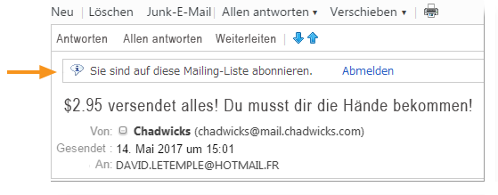
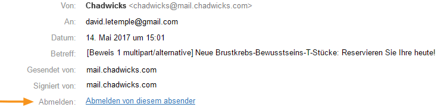
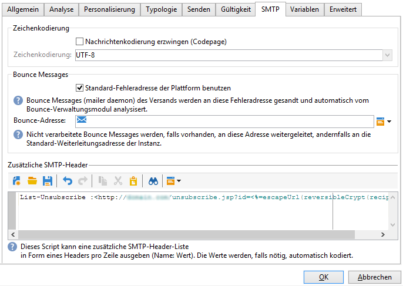

# Technische Empfehlungen{#technical-recommendations}

Die folgende Liste enthält diverse Techniken, Konfigurationen und Werkzeuge zur Verbesserung Ihrer Zustellrate.

## Konfiguration {#configuration}

### Reverse DNS {#reverse-dns}

: Adobe Campaign prüft, ob für eine IP-Adresse ein Reverse-DNS angegeben ist und ob dieses wirklich auf die IP-Adresse zurückverweist.

Bei der Netzwerkkonfiguration ist es wichtig sicherzustellen, dass für jede der für ausgehende Nachrichten bestimmten IP-Adressen ein korrektes Reverse-DNS angegeben ist. Für eine bestimmte IP-Adresse existiert also ein Reverse-DNS Datensatz (PTR-Datensatz) mit einem passenden DNS (Datensatz), das auf die ursprüngliche IP zurückverweist.

Die Wahl der Domain für ein Reverse DNS hat Auswirkungen auf den Umgang mit bestimmten ISPs. Insbesondere AOL akzeptiert nur Feedback-Schleifen mit einer Adresse in derselben Domain wie das Reverse DNS (siehe [Feedback Loop](#feedback-loop)).

Zur Überprüfung der Konfiguration einer Domain steht folgendes Tool zur Verfügung: [https://mxtoolbox.com/SuperTool.aspx](https://mxtoolbox.com/SuperTool.aspx).

### MX-Regeln {#mx-rules}

MX-Regeln (Mail eXchanger) dienen zur Verwaltung der Kommunikation zwischen einem Sender- und einem Empfangs-Server.

Genauer gesagt dienen sie zum Steuern der Geschwindigkeit, mit der der Campaign MTA (Message Transfer Agent) E-Mails an die einzelnen E-Mail-Domains oder ISPs (z. B. hotmail.com, comcast.net) sendet. Diese Regeln basieren meist auf den von den ISPs veröffentlichten Beschränkungen (z. B. nicht mehr als 20 Nachrichten pro SMTP-Verbindung).

Weiterführende Informationen zur MX-Verwaltung erfahren Sie in [diesem Abschnitt](../../installation/using/email-deliverability.md#mx-configuration).

### TLS {#tls}

: TLS (Transport Layer Security) ist ein Verschlüsselungsprotokoll zur Sicherung der Verbindung zwischen zwei E-Mail-Servern. Damit wird sichergestellt, dass die E-Mail nur vom beabsichtigten Empfänger gelesen werden kann.

## Authentifizierung {#authentication}

### SPF {#spf}

: SPF (Sender Policy Framework) ist ein Standard für die E-Mail-Authentifizierung, mit dem der Inhaber einer Domain angeben kann, welche E-Mail-Server E-Mails im Namen dieser Domain senden dürfen. Bei diesem Standard wird die Domain in der Kopfzeile &quot;Return-Path&quot; der E-Mail (auch als &quot;Envelope From&quot;-Adresse bezeichnet) genutzt.

Zur Überprüfung eines SPF-Eintrags steht folgendes Tool zur Verfügung: [https://www.kitterman.com/spf/validate.html](https://www.kitterman.com/spf/validate.html)

SPF ist eine Technik, mit der Sie in gewissem Umfang sicherstellen können, dass der in einer E-Mail verwendete Domain-Name nicht gefälscht wird. Wenn eine Nachricht von einer Domain empfangen wird, wird der DNS-Server der Domain abgefragt. Die Antwort ist ein kurzer Datensatz (der SPF-Datensatz), der angibt, welche Server für das Senden von E-Mails von dieser Domain autorisiert sind. Wenn wir davon ausgehen, dass nur der Eigentümer der Domain über die Mittel verfügt, um diesen Datensatz zu ändern, können wir davon ausgehen, dass mit dieser Technik die Absenderadresse nicht gefälscht werden kann, zumindest nicht der Teil rechts von „@“.

In der endgültigen [RFC 4408-Spezifikation](https://www.rfc-editor.org/info/rfc4408) werden zwei Elemente der Nachricht verwendet, um die Domain zu bestimmen, die als Absender gilt: Die Domain, die durch den SMTP-Befehl „HELO“ (oder „EHLO“) angegeben wird, und die Domain, die durch die Adresse des „Return-Path“-Headers (oder „MAIL FROM“) angegeben wird, die gleichzeitig die Bounce-Adresse ist. Verschiedene Überlegungen ermöglichen es, nur einen dieser Werte zu berücksichtigen. Wir empfehlen, dass beide Quellen dieselbe Domain angeben.

Durch die Überprüfung des SPF ist eine Evaluierung der Gültigkeit der Absender-Domain gewährleistet.

* **None**: Es konnte keine Evaluierung ausgeführt werden.
* **Neutral**: Für die abgefragte Domain ist keine Evaluierung aktiviert.
* **Pass**: Die Domain wird als echt angesehen.
* **Fail**: Die Domain ist gefälscht und die Nachricht sollte abgelehnt werden.
* **SoftFail**: Die Domain ist wahrscheinlich gefälscht, aber die Nachricht sollte nicht ausschließlich aufgrund dieses Ergebnisses abgelehnt werden.
* **TempError**: Ein temporärer Fehler hat die Evaluierung angehalten. Die Nachricht kann abgelehnt werden.
* **PermError**: Die SPF-Einträge der Domain sind ungültig.

Bitte beachten Sie, dass es bis zu 48 Stunden in Anspruch nehmen kann, bis in der Umgebung von DNS-Servern gemachte Einträge berücksichtigt werden. Die Dauer hängt davon ab, mit welcher Häufigkeit die DNS-Caches der Empfangs-Server aktualisiert werden.

### DKIM {#dkim}

DKIM (DomainKeys Identified Mail)-Authentifizierung ist ein Nachfolger von SPF und verwendet Public-Key-Verschlüsselung, mit der der E-Mail-Empfangs-Server überprüfen kann, ob eine Nachricht tatsächlich von der angegebenen Person oder dem angegebenen Unternehmen gesendet wurde. Ferner kann festgestellt werden, ob die Nachricht zwischen dem Versandzeitpunkt (und der „Signierung“ mit DKIM) sowie dem Empfangszeitpunkt verändert wurde. Bei diesem Standard wird in der Regel die Domain im &quot;Von&quot;- oder &quot;Absender&quot;-Header genutzt. Um die DKIM-Sicherheitsstufe zu gewährleisten, ist 1024b die in den Best Practices empfohlene Verschlüsselungsgröße. Niedrigere DKIM-Schlüssel werden von den meisten Zugangsanbietern nicht als gültig angesehen.

DKIM geht auf eine Kombination der Authentifizierungsprinzipien DomainKeys von Yahoo! und Identified Internet Mail von Cisco zurück und dient der Prüfung der Authentizität von Absender-Domains sowie der Sicherstellung der Integrität von Nachrichten.

DKIM hat sozusagen die **DomainKeys**-Authentifizierung ersetzt.

Für die Verwendung von DKIM müssen folgende Voraussetzungen gegeben sein:

* **Sicherheit**: Verschlüsselung ist ein Hauptelement von DKIM, und seit Frühjahr 2013 gewährleistet die in den Best Practices empfohlene Verschlüsselungsgröße von 1024b dessen hohen Sicherheitsstandard. DKIM-Schlüssel mit einer unter diesem Wert liegenden Größe werden von den meisten Zugangsanbietern als ungültig angesehen.
* **Reputation**: Die Reputation basiert auf dem IP und/oder der Domain, dabei bildet jedoch auch der weniger transparente DKIM-Selektor ein zu berücksichtigendes Schlüsselelement. Die Auswahl eines Selektors ist wichtig: Vermeiden Sie es, den &quot;default&quot;-Selektor beizubehalten, da er von jedem verwendet werden könnte und deshalb über eine schwache Reputation verfügt. Für die Kommunikationsarten **Retention vs. Akquise** und Authentifizierung ist die Implementierung von jeweils unterschiedlichen Selektoren erforderlich.
* **Deklaration von Optionen in Adobe Campaign**: Der private DKIM-Schlüssel basiert in Adobe Campaign auf einem DKIM-Selektor und einer Domain. Aktuell ist es nicht möglich, mehrere private Schlüssel für dieselbe Domain/Sub-Domain mit unterschiedlichen Selektoren zu erstellen. In der Plattform oder der E-Mail ist es nicht möglich zu definieren, welcher Selektor für die Authentifizierung verwendet werden soll. Die Plattform wählt alternativ einen der privaten Schlüssel aus, wodurch die Authentifizierung ein hohes Fehlschlagrisiko birgt.

>[!NOTE]
>
>* Wenn Sie DomainKeys für Ihre Adobe Campaign-Instanz konfiguriert haben, müssen Sie nur **dkim** in den [Domain-Verwaltungsregeln](../../delivery/using/understanding-delivery-failures.md#domain-management) auswählen. Führen Sie andernfalls die gleichen Konfigurationsschritte (privater/öffentlicher Schlüssel) wie bei DomainKeys aus.
>* Es ist nicht notwendig, sowohl DomainKeys als auch DKIM für dieselbe Domain zu aktivieren, da es sich bei DKIM um eine verbesserte Version von DomainKeys handelt.
>* Folgende Domains validieren aktuell DKIM: AOL, Gmail.


>[!IMPORTANT]
>
>Bei gehosteten oder hybriden Installationen erfolgt die DKIM-E-Mail-Authentifizierungssignatur für alle Nachrichten mit allen Domains durch den Enhanced MTA, wenn Sie auf den [Enhanced MTA](https://helpx.adobe.com/campaign/kb/acc-campaign-enhanced-mta.html) aktualisiert haben.

### DMARC {#dmarc}

DMARC (Domain-based Message Authentication, Reporting and Conformance) ist die neueste Art der E-Mail-Authentifizierung. Bei der Entscheidung, ob eine E-Mail weitergeleitet wird oder fehlschlägt, kommt sowohl SPF- als auch DKIM-Authentifizierung zum Einsatz. DMARC ist in zwei wichtigen Bereichen einzigartig und extrem leistungsstark:

* Conformance (Konformität) – ermöglicht dem Absender, ISPs anzuweisen, was mit einer Nachricht passieren soll, die nicht authentifiziert werden kann (z. B. nicht akzeptieren).
* Reporting (Berichterstellung) – liefert dem Absender einen detaillierten Bericht mit allen Nachrichten, die die DMARC-Authentifizierung nicht bestanden haben, sowie die jeweils verwendete &quot;Von&quot;-Domain und IP-Adresse. Damit können Unternehmen legitime E-Mails erkennen, die nicht authentifiziert werden konnten und &quot;repariert&quot; werden müssen (z. B. durch Hinzufügen von IP-Adressen zu ihrem SPF-Datensatz), sowie die Quellen und das Vorkommen von Phishing-Versuchen auf ihren E-Mail-Domains identifizieren.

DMARC kann die von [250ok](https://250ok.com/) erstellten Berichte nutzen.

<!--#### Configuring the application {#configuring-the-application}

To define the domain used for the HELO command, edit the instance's configuration file (conf/config-instance.xml) and define a "localDomain" attribute as follows:

```
<serverConf>
  <shared>
    <dnsConfig localDomain="mydomain.net"/>
  </shared>
</serverConf>
```

The MAIL FROM domain is the domain used in technical bounce messages. This address is defined in the deployment wizard or via the NmsEmail_DefaultErrorAddr option.

#### DNS configuration {#dns-configuration}

An SPF record can currently be defined on a DNS server as a TXT type record (code 16) or an SPF type record (code 99). An SPF record takes the form of a character string. For example:

```
v=spf1 ip4:12.34.56.78/32 ip4:12.34.56.79/32 ~all
```

defines the 2 IP addresses 12.34.56.78 and 12.34.56.79 as authorized to send emails for the domain. **~all** means that any other address should be interpreted as a SoftFail.

Recommendations for defining an SPF record:

* Add **~all** (SoftFail) or **-all** (Fail) at the end to reject all servers other than those defined. Without this, servers will be able to forge this domain (with a Neutral evaluation).
* Do not add **ptr** (openspf.org recommends against this as costly and unreliable).-->

## Feedback Loops {#feedback-loop}

Eine Feedback-Schleife funktioniert, indem auf ISP-Ebene eine bestimmte E-Mail-Adresse für eine Reihe von IP-Adressen angegeben wird, die zum Senden von Nachrichten verwendet werden. Der ISP wird die Nachrichten, die von Empfängern als Spam gemeldet werden, in ähnlicher Weise an diesen Posteingang senden wie bei den Absprungmeldungen. Die Plattform sollte so konfiguriert sein, dass zukünftige Versand für Benutzer, die sich beschwert haben, blockiert werden. Es ist wichtig, sich nicht mehr mit ihnen in Verbindung zu setzen, auch wenn sie nicht den richtigen Ausschluss-Link verwendet haben. Auf der Grundlage dieser Beschwerden wird ein ISP seiner blockierungsliste eine IP-Adresse hinzufügen. Je nach ISP wird eine Beschwerderate von etwa 1 % dazu führen, dass eine IP-Adresse blockiert wird.

Aktuell wird an der Konzeption eines Standards für das Format von Feedback-Loop-Nachrichten gearbeitet: das [Abuse Feedback Reporting Format (ARF)](https://tools.ietf.org/html/rfc6650).

Zur Implementierung eines Feedback Loops für eine Instanz sind folgende Elemente erforderlich:

* ein für die Instanz bestimmtes Postfach, bei dem es sich um das Bounce-Postfach handeln kann,
* für die Instanz bestimmte IP-Versandadressen.

Die Implementierung eines einfachen Feedback Loop in Adobe Campaign verwendet die Bounce-Nachrichtenfunktionalität. Das Feedback Loop-Postfach wird als ein Bounce-Postfach verwendet. Es wird eine Regel zur Erkennung dieser Nachrichten definiert. Die E-Mail-Adressen der Empfänger, die die Nachricht als Spam gemeldet haben, werden der Quarantäneliste hinzugefügt.

* Erstellen oder bearbeiten Sie im Knoten **[!UICONTROL Administration > Kampagnen > Unzustellbarkeitsverwaltung > E-Mail-Regeln]** eine Bounce-Message-Regel **Feedback_loop** und geben Sie dabei den Grund **Abgelehnt** sowie den Typ **Hard** an.
* Wenn speziell für das Feedback Loop ein Postfach definiert wurde, definieren Sie die dafür geltenden Zugriffsparameter, indem Sie unter **[!UICONTROL Administration > Plattform > Externe Konten]** ein neues externes Bounce-Message-Konto erstellen.

Der Mechanismus zur Verarbeitung von Beschwerdebenachrichtigungen ist sofort funktionstüchtig. Um die korrekte Funktionsweise der Regel sicherzustellen, können Sie die Konten zeitweise deaktivieren, damit sie diese Nachrichten nicht abrufen. Sie können die Inhalte des Feedback-Loop-Postfachs dann manuell überprüfen. Führen Sie auf dem Server die folgenden Befehle aus:

```
nlserver stop inMail@instance,
nlserver inMail -instance:instance -verbose.
```

Sollten Sie gezwungen sein, eine einzige Feedback-Loop-Adresse für mehrere Instanzen zu verwenden, müssen Sie:

* die empfangenen Nachrichten auf so vielen Postfächern replizieren wie Instanzen vorhanden sind,
* dafür sorgen, dass jedes Postfach von einer einzigen Instanz abgerufen wird,
* Konfigurieren Sie die Instanzen so, dass sie nur die Nachrichten verarbeiten, die sie betreffen: Die Instanzinformationen sind im Nachrichten-ID-Header der von Adobe Campaign gesendeten Nachrichten enthalten und befinden sich daher auch in den Feedback Loop-Nachrichten. Geben Sie einfach den Parameter **checkInstanceName** in der Konfigurationsdatei der Instanz an (standardmäßig wird die Instanz nicht überprüft, was dazu führen kann, dass bestimmte Adressen falsch unter Quarantäne gestellt werden):

   ```
   <serverConf>
     <inMail checkInstanceName="true"/>
   </serverConf>
   ```

Der Zustellbarkeitsdienst in Adobe Campaign sorgt für die Verwaltung Ihrer Anmeldung für Feedback-Loop-Dienste für die folgenden ISPs: AOL, BlueTie, Comcast, Cox, EarthLink, FastMail, Gmail, Hotmail, HostedEmail, Libero, Mail.ru, MailTrust, OpenSRS, QQ, RoadRunner, Synacor, Telenor, Terra, UnitedOnline, USA, XS4ALL, Yahoo, Yandex, Zoho.

## List-Unsubscribe {#list-unsubscribe}

### Über List-Unsubscribe {#about-list-unsubscribe}

Zur optimalen Verwaltung der Zustellbarkeit ist das Hinzufügen eines SMTP-Headers namens **List-Unsubscribe** zwingend erforderlich.

Dieser Header kann alternativ zum Symbol &quot;Als Spam melden&quot; verwendet werden. Er wird innerhalb der E-Mail in Form eines Abmelde-Links angezeigt.

Die Verwendung dieser Funktion hilft dabei, Ihren Ruf zu schützen, und das Feedback wird wie eine Abmeldung ausgeführt.

>[!NOTE]
>
>Diese Funktion ist ab Build 6831 verfügbar.

Zur Verwendung von List-Unsubscribe ist die Eingabe einer Befehlszeile notwendig, die in etwa so aussieht:

```
List-Unsubscribe: mailto: client@newsletter.example.com?subject=unsubscribe?body=unsubscribe
```

>[!IMPORTANT]
>
>Das oben stehende Beispiel basiert auf der Empfängertabelle. Sollte die Datenbankimplementierung über eine andere Tabelle erfolgen, stellen Sie bitte sicher, dass Sie die Befehlszeile mit den korrekten Informationen umformulieren.

Die folgende Befehlszeile kann zum Zweck der Erstellung eines dynamischen **List-Unsubscribe** verwendet werden:

```
List-Unsubscribe: mailto: %=errorAddress%?subject=unsubscribe%=message.mimeMessageId%
```

Gmail, Outlook.com und Microsoft Outlook unterstützen diese Methode und eine Abmelde-Schaltfläche ist direkt in ihrer Benutzeroberfläche verfügbar. Durch diese Technik werden Beschwerderaten gesenkt.





Die Implementierung von **List-Unsubscribe** erfolgt durch:

* das direkte Hinzufügen der Befehlszeile in der Versandvorlage (siehe [diesen Abschnitt](#adding-a-command-line-in-a-delivery-template)) oder
* das Erstellen einer Typologieregel (siehe [diesen Abschnitt](#creating-a-typology-rule)).

### Hinzufügen einer Befehlszeile in einer Versandvorlage {#adding-a-command-line-in-a-delivery-template}

Die Befehlszeile muss im Zusatzabschnitt des SMTP-Headers der E-Mail hinzugefügt werden.

Das kann entweder in jeder E-Mail oder in bereits existierenden Versandvorlagen erfolgen. Sie haben außerdem die Möglichkeit, eine neue diese Funktion beinhaltende Versandvorlage zu erstellen.

### Erstellung einer Typologieregel {#creating-a-typology-rule}

Die Regel muss das Script zur Erzeugung der Befehlszeile beinhalten und im E-Mail-Header enthalten sein.

>[!NOTE]
>
>Es wird empfohlen, eine Typologieregel zu erstellen: Die List-Unsubscribe-Funktion wird automatisch zu jeder E-Mail hinzugefügt.

1. List-Unsubscribe: &lt;mailto:unsubscribe@domain.com>

   Durch die Verwendung des **unsubscribe**-Links wird das Standard-E-Mail-Programm des Benutzers geöffnet. Diese Typologieregel muss in einer zur E-Mail-Erstellung verwendeten Typologie hinzugefügt werden.

1. List-Unsubscribe: `<https://domain.com/unsubscribe.jsp>`

   Durch die Verwendung des **unsubscribe**-Links wird der Benutzer zu Ihrem Abmeldeformular weitergeleitet.

   Beispiel:

   

## E-Mail-Optimierung {#email-optimization}

### SMTP {#smtp}

SMTP (Simple Mail Transfer Protocol) ist ein Internet-Standard für die E-Mail-Übertragung.

Nicht mithilfe einer Regel überprüfte SMTP-Fehler sind im Ordner **[!UICONTROL Administration]** > **[!UICONTROL Kampagnenverwaltung]** > **[!UICONTROL Unzustellbarkeitsverwaltung]** > **[!UICONTROL Versandlogqualifizierung]** aufgelistet. Diese Fehlermeldungen werden standardmäßig als unerreichbare Softbounces interpretiert. Wenn Sie die Ausgabe der SMTP-Server korrekt qualifizieren möchten, müssen die häufigsten Fehler identifiziert und in **[!UICONTROL Administration]** > **[!UICONTROL Kampagnenverwaltung]** > **[!UICONTROL Unzustellbarkeitsverwaltung]** > **[!UICONTROL E-Mail-Regeln]** die entsprechende Regel hinzugefügt werden. Andernfalls wird die Plattform (im Fall unbekannter Nutzer) unnötige weitere Zustellversuche unternehmen oder bestimmte Empfänger nach einer gewissen Anzahl an Versuchen fälschlicherweise unter Quarantäne stellen.

### Dedizierte IP-Adressen {#dedicated-ips}

Adobe bietet jedem Kunden für die Anlaufphase eine dedizierte IP-Strategie zum Aufbau der Reputation und zur Optimierung der Zustellbarkeit.

## IP-Zertifizierung {#ip-certification}

Die IP-Zertifizierung ist ein Programm zum Versenden von Best Practices, mit dem sichergestellt werden kann, dass E-Mails ohne Blockierung durch Anti-Spam-Filter oder andere E-Mail-Sperrsysteme empfangen werden.

Derzeit bieten zwei Anbieter eine IP-Zertifizierung an: Return Path und Certified Senders Alliance.

Zertifizierte Absender werden E-Mail-zulassungsliste hinzugefügt, die von globalen Mailbox-Anbietern und E-Mail-Firmen verwendet werden. Diese kommerziellen zulassungsliste basieren auf einem System, das es dem Absender ermöglicht, Anti-Spam-Filter ganz zu umgehen oder inkrementelle Punkte beim Einstieg in das System zuzuweisen.

Das [Zertifizierungsprogramm von Return Path](https://www.validity.com/products/returnpath/certification/) bietet eine Reihe von Vorteilen, darunter die folgenden:

* Eine messbare Steigerung der Posteingangsplatzierung bei führenden E-Mail-Anbietern wie Microsoft, AOL, Yahoo, Gmail, Comcast, Orange, Mail.ru und mehr
* Positive Reputation und bevorzugte Behandlung bei kritischen Filtern wie Cloudmark, SpamAssassin und Cisco Ironport
* Ein Compliance-Team, das rund um die Uhr überwacht, Sicherheitswarnungen bereitstellt und mit Ihnen bei der Lösung von Kompromissen zusammenarbeitet
* E-Mail-Anbieterdaten mit detaillierten Informationen zu KPIs, Platzierung und Zertifizierungsleistung
* Vereinfachtes und schnelleres IP-Warmup, einschließlich einer besseren Reputation und Erkennung bei der Migration oder beim Erhalt einer neuen IP-Adresse

Die Zertifizierung durch [Certified Senders Alliance](https://certified-senders.org/certification-process/) bietet unter anderem folgende Vorteile:

* Zertifizierung von Absendern von kommerziellen E-Mails, die hohe Qualitätsstandards erfüllen können
* Verbesserter Versand und verbesserte Zustellbarkeit von kommerziellen E-Mails, um die Platzierungsrate im Posteingang zu erhöhen und das Filtern von Spam zu reduzieren
* Schutz vor rechtlichen und finanziellen Risiken durch vollständige Einhaltung der Rechtsnormen
* Schutz der Reputation durch frühzeitige Warnungen der CSA-Beschwerdestelle und tägliche Berichte über Spam-Fallen

ISPs können diese Dienste kostenlos nutzen, und die Anzahl der ISPs kann je nach zulassungsliste variieren.

Da jedoch immer mehr ISPs ihre Antispam-Filter auf Grundlage des Verhaltens jedes Posteingangsbesitzers erstellen, anstatt den Nachrichteninhalt selbst zu analysieren, kann die Verwendung der IP-Zertifizierung keine Garantie für die Platzierung im Posteingang oder gar die Bereitstellung sein.
