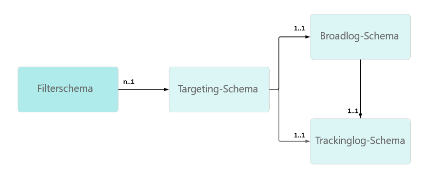

# Fehlerbehebung beim Tracking {#tracking-troubleshooting}

In diesem Abschnitt finden Sie häufige Fragen zur Konfiguration und Implementierung von Tracking in Adobe Campaign Classic.

## Der Tracking-Workflow schlägt fehl. {#tracking-workflow-failing}

Mein Tracking-Workflow schlägt fehl. Wie kann ich die beschädigten Zeilen in der Tracking-Datei erkennen?

>[!NOTE]
>
>Nur für Windows verfügbar

Die beschädigte Trackinglog-Datei .../nl6/var/&lt;Instanzname>/redir/log/0x0000 log kann den Tracking-Workflow stoppen. Mit den folgenden Befehlen können Sie beschädigte Zeilen leicht erkennen und entfernen, um den Tracking-Workflow fortzusetzen. 

### Ich weiß, in welcher Datei die beschädigte Zeile enthalten ist

In diesem Fall können Sie die beschädigten Zeilen in der Datei 0x00000000000A0000.log finden. Der gleiche Vorgang kann jedoch nacheinander auf eine Reihe von Dateien angewendet werden.

```
$ cd {install directory}/var/{instance name}/redir/log
$ cat 0x00000000000A0000.log | sed -nE '/^[[:alnum:]]{2}x[[:alnum:]]*\t[0-9T:\.-]*\t[0-9a-fA-F]*\t[0-9a-fA-F]*\t[0-9a-fA-F]*\t[[:alnum:]]*\t[[:alnum:]-]*\t[[:print:]]*\t[[:print:]]*\t[[:print:]]*\t([0-9a-fA-F\.:]*|[0-9a-fA-F\.:]*\t[[:print:]]*|[0-9a-fA-F\.:]*,[[:print:]]*)$/!p'
```

Anschließend können Sie den Tracking-Workflow stoppen, die beschädigten Zeilen löschen und den Workflow neu starten.

### Ich weiß nicht, in welcher Datei die beschädigte Zeile enthalten ist

1. Verwenden Sie die folgende Befehlszeile, um alle Tracking-Dateien zu prüfen.

   ```
   $ cd {install directory}/var/{instance name}/redir/log
   $ cat *.log | sed -nE '/^[[:alnum:]]{2}x[[:alnum:]]*\t[0-9T:\.-]*\t[0-9a-fA-F]*\t[0-9a-fA-F]*\t[0-9a-fA-F]*\t[[:alnum:]]*\t[[:alnum:]-]*\t[[:print:]]*\t[[:print:]]*\t[[:print:]]*\t([0-9a-fA-F\.:]*|[0-9a-fA-F\.:]*\t[[:print:]]*|[0-9a-fA-F\.:]*,[[:print:]]*)$/!p'
   ```

1. Der Befehl listet alle beschädigten Zeilen auf. Beispiel:

   ```
   50x000000000FD7EC86 2017-06-24T21:00:50.96 1f506d71 1aeab4b6 1af77020 0 e5155671-4ab7-4ce4-a763-3b82dda6d881 h
   Mozilla/5.0 (Macintosh; Intel Mac OS X 10_12_4) AppleWebKit/537.36 (KHTML, like Gecko) Chrome/55.0.2883.95 Safari/537.36 52.46.20.64
   ```

   >[!NOTE]
   >
   >Der Zeilenumbruch wurde vor dem Benutzeragenten hinzugefügt, um bessere Lesbarkeit zu ermöglichen, und spiegelt nicht das effektive Rendering wider.

1. Führen Sie einen grep-Befehl aus, um die entsprechende Datei zu finden.

```
$ grep -Rn <Log Id>
# for example:
$ grep -Rn 50x000000000FD7EC86
```

1. Suchen Sie nach dem fehlerhaften Log mit dem Dateinamen und der Zeilennummer. Beispiel:

   ```
   ./0x000000000FD7E000.log:3207:50x000000000FD7EC86 2017-06-24T21:00:50.96 1f506d71 1aeab4b6 1af77020 0 e5155671-4ab7-4ce4-a763-3b82dda6d881 h
   Mozilla/5.0 (Macintosh; Intel Mac OS X 10_12_4) AppleWebKit/537.36 (KHTML, like Gecko) Chrome/55.0.2883.95 Safari/537.36 52.46.20.64
   ```

   >[!NOTE]
   >
   >Ein Zeilenumbruch wurde vor dem Benutzeragenten hinzugefügt, um bessere Lesbarkeit zu ermöglichen, und spiegelt nicht das effektive Rendering wider.

Anschließend können Sie den Tracking-Workflow stoppen, die beschädigten Zeilen löschen und den Workflow neu starten.

## Trackinglinks schlagen gelegentlich fehl {#tracking-links-fail-intermittently}

Beim Versuch, auf die Trackinglinks zuzugreifen, wird folgende Meldung angezeigt:

`Requested URL '/r/ id=h787bc0,281a4d8,281a4da&amp;p1=1' cannot be found`

1. Greifen Sie auf die URL &lt;redirect_server>/r/test zu und überprüfen Sie, ob die Build-Nummer und localhost von der Anfrage zurückgegeben wurden.

1. Überprüfen Sie die spareServer-Konfiguration in der Datei serverConf.xml auf den Tracking-Server. Diese Konfiguration sollte sich im Weiterleitungsmodus befinden.

   ```
   <redirection>
      <spareServer _operation="update" enabledIf="$(hostname)!='test-rt1'" id="1"
      url="http://test-rt1:8080"/>
      <spareServer _operation="insert" enabledIf="$(hostname)!='test-rt4'" id="4"
      url="http://test-rt4:8080"/>
      <spareServer _operation="insert" enabledIf="$(hostname)!='test-rt3'" id="3"
      url="http://test-rt3:8080"/>
      <spareServer _operation="insert" enabledIf="$(hostname)!=test-rt2'" id="2"
      url="http://test-rt2:8080"/>
   </redirection>
   ```

1. Prüfen Sie manuell, ob die XML-Datei &lt;deliveryID>.xml auf dem Computer im Verzeichnis &quot;... / nl6 / var / &lt;Instanzname> / redir / url / &lt;JJJJ>&quot; vorhanden ist (JJJJ steht für das Versandjahr).

1. Prüfen Sie manuell, ob &lt;trackingUrlId> in der Datei &lt;deliveryID>.xml gefunden werden kann.

1. Prüfen Sie manuell, ob broadlogID im zugehörigen deliveryID-Versand vorhanden ist.

1. Prüfen Sie die Berechtigungen der &lt;deliveryID>.xml-Dateien im Verzeichnis &quot;.../nl6/var/&lt;Instanzname>/redir/url/year&quot;.

   Sie sollten mindestens die Berechtigung &quot;644&quot; haben, damit Apache die Tracking-URLs lesen kann, um den angeforderten Link weiterzuleiten.

## Aktualisieren der Option &quot;NmsTracking_Pointer&quot;? {#updating-option}

Gehen Sie beim Aktualisieren der Option &quot;NmsTracking_Pointer&quot; wie folgt vor:

1. Stoppen Sie den Tracking-Workflow an.

1. Stoppen Sie den trackinglogd-Service an.

1. Aktualisieren Sie die Option &quot;NmsTracking_Pointer&quot; auf den gewünschten Wert.

1. Starten Sie den trackinglogd-Service neu.

1. Starten Sie den Tracking-Workflow neu.

## Tracking scheint bei einigen WebMail-Services nicht zu funktionieren {#webmail}

Sie können die Klick-Tracking-Formel anpassen und eine benutzerdefinierte Adobe Analytics-Tracking-Formel angeben.

Diese Art der Anpassung muss mit Vorsicht erfolgen, um zu vermeiden, dass zusätzliche Zeilenvorschubzeichen hinzugefügt werden. Alle Zeilenvorschubzeichen, die außerhalb des JavaScript-Ausdrucks vorhanden sind, sind in der endgültigen Formel enthalten.

Diese Art von zusätzlichem Zeilenvorschubzeichen in der Tracking-URL führt bei einigen WebMail-Services (AOL, GMail usw.) zu Problemen.

**Erstes Beispiel:**

* Falsche Syntax

   ```
   <%@ include option='NmsTracking_ClickFormula' %><% // Parameters expected by Adobe-Genesis
   var pattern = new RegExp("(nl611\.test15|google\.com)", 'i')
   if( $(urlstring).match(pattern) && delivery.FCP == false )
   {
   %>
   &cid=<%= message.delivery.internalName %>&bid=<%= message.id.toString().toLowerCase() %><% } %>
   ```

* Richtige Syntax

   ```
   <%@ include option='NmsTracking_ClickFormula' %><% // Parameters expected by Adobe-Genesis
   var pattern = new RegExp("(nl611\.test15|google\.com)", 'i')
   if( $(urlstring).match(pattern) && delivery.FCP == false )
   {
   %>&cid=<%= message.delivery.internalName %>&bid=<%= message.id.toString().toLowerCase() %><% } %>
   ```

Um zu verstehen, wo sich der zusätzliche Zeilenvorschub befindet, können Sie den JavaScript-Ausdruck durch eine unveränderliche STRING-Zeichenkette ersetzen.

```
// Incorrect
STRING1
&cid=STRING2&bid=STRING3

// Correct
STRING1&cid=STRING2&bid=STRING3
```

**Zweites Beispiel**

* Falsche Syntax

   ```
   <%@ include option='NmsTracking_ClickFormula' %>
   <% // Parameters expected by Adobe-Genesis
   var pattern = new RegExp("(vistaprint|entryUrl)", 'i')
   if( $(urlstring).match(pattern) && delivery.FCP == false )
   {%>&cid=<%= message.delivery.internalName%>&bid=<%= message.id.toString().toLowerCase()%>&SHPID=<%= message.recipient.factShopper.shopper_id %><% }
   
   %>
   ```

* Richtige Syntax

   ```
   <%@ include option='NmsTracking_ClickFormula' %><% // Parameters expected by Adobe-Genesis
   var pattern = new RegExp("(vistaprint|entryUrl)", 'i')
   if( $(urlstring).match(pattern) && delivery.FCP == false )
   {%>&cid=<%= message.delivery.internalName%>&bid=<%= message.id.toString().toLowerCase()%>&SHPID=<%= message.recipient.factShopper.shopper_id %><% }
   
   %>
   ```

Um zu verstehen, wo sich der zusätzliche Zeilenvorschub befindet, können Sie den JavaScript-Ausdruck durch eine unveränderliche STRING-Zeichenkette ersetzen.

```
// Incorrect
STRING1&cid=STRING2&bid=STRING3&SHPID=STRING4

// Correct
STRING1&cid=STRING2&bid=STRING3&SHPID=STRING4
```

## Trackinglogs werden zu langsam abgerufen {#slow-retrieval}

Wenn die Instanz die Trackinglogs nicht direkt abruft, sondern von einem entfernten Adobe Campaign Classic-Server, werden die Logs über den SOAP-Aufruf &quot;GetTrackingLogs&quot; abgerufen, der im remoteTracking-Schema definiert ist.

Mit einer Option in der Datei serverConf.xml können Sie die Anzahl der Logs festlegen, die mit dieser Methode gleichzeitig abgerufen werden: logCountPerRequest.

Der Standardwert von &quot;logCountPerRequest&quot; ist 1000, was sich in einigen Fällen als zu klein erweisen kann. Die zulässigen Werte müssen zwischen 0 und 10.000 liegen.

## Trackinglogs konnten nicht mit Empfängern verknüpft werden {#link-recipients}

In Adobe Campaign Classic soll ein Zielgruppen-Mapping hinsichtlich des Empfängerschemas im Vergleich zu Broadlog-/Trackinglog-Schemas eindeutig sein.



Es ist nicht möglich, mehrere Zielgruppenschemas mit demselben Trackinglog-Schema zu verwenden, da der Tracking-Workflow keine Daten mit der Zielgruppenbestimmungs-ID abgleichen kann.

Wenn Sie das vorkonfigurierte Zielgruppen-Mapping nicht mit &quot;nms:recipient&quot; verwenden möchten, empfehlen wir die folgenden Vorgehensweisen:

* Wenn Sie die benutzerdefinierte Zielgruppendimension verwenden möchten, müssen Sie ein benutzerdefiniertes Schema &quot;broadLog/trackingLog&quot; mit &quot;nms:extenlog&quot; als Vorlage erstellen (z. B. &quot;nms:broadLogRcp&quot;, &quot;nms:broadLogSvc&quot; usw.).

* Wenn Sie die vorkonfigurierten trackingLogRcp/broadLogRcp verwenden möchten, muss die Zielgruppendimension &quot;nms:recipient&quot; lauten, und die Filterdimension könnte ein benutzerdefiniertes Schema sein.
