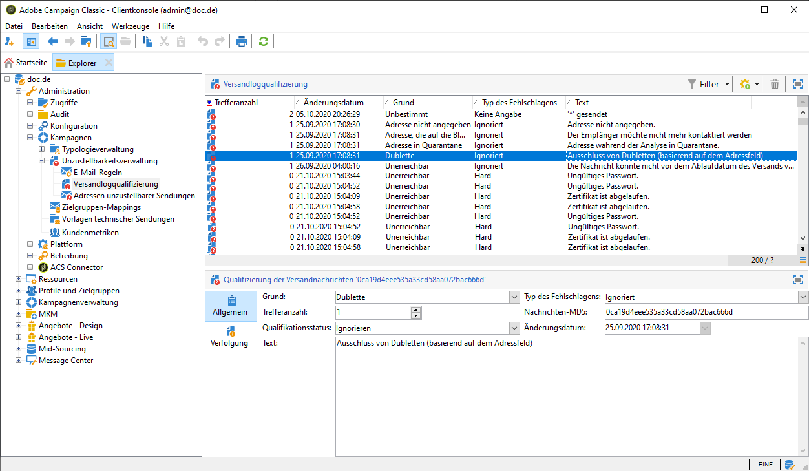

# Ursachen von fehlgeschlagenen Sendungen{#understanding-delivery-failures}

## Über fehlgeschlagene Sendungen {#about-delivery-failures}

Wenn einem Profil eine Nachricht (E-Mail, SMS, Push-Benachrichtigung) nicht zugestellt werden kann, sendet der Remote-Server automatisch eine Fehlermeldung, die von der Adobe Campaign-Plattform erfasst und qualifiziert wird, um festzustellen, ob die E-Mail-Adresse oder Telefonnummer unter Quarantäne gestellt werden soll. Siehe [Bounce-Message-Verwaltung](#bounce-mail-management).

>[!NOTE]
>
>E-Mail-Fehlermeldungen (auch &quot;Bounces&quot; genannt) werden vom inMail-Prozess qualifiziert. SMS-Fehlermeldungen (auch &quot;SR&quot; für &quot;Status Report&quot; genannt) werden vom MTA-Prozess qualifiziert.

Nachdem eine Nachricht gesendet wurde, können Sie im Versandlogs-Tab den Versandstatus für jedes Profil sowie den damit verbundenen Fehlertyp und die Ursache einsehen.

Mitteilungen können während der Versandvorbereitung auch ausgeschlossen werden, wenn eine Adresse unter Quarantäne gestellt oder ein Profil auf die Blacklist gesetzt wurde. Ausgeschlossene Mitteilungen werden im Versand-Dashboard aufgeführt.

**Verwandte Themen:**

* [Protokolle und Versandverlauf](../../delivery/using/monitoring-a-delivery.md#delivery-logs-and-history)
* [Status Fehlgeschlagen](../../delivery/using/monitoring-a-delivery.md#failed-status)
* [Typen und Ursachen für fehlgeschlagene Sendungen](#delivery-failure-types-and-reasons)

## Typen und Ursachen für fehlgeschlagene Sendungen    {#delivery-failure-types-and-reasons}

Es gibt drei Typen von fehlgeschlagenen Sendungen. Vom jeweiligen Fehlertyp hängt es ab, ob eine Adresse in Quarantäne kommt. Weitere Informationen hierzu finden Sie unter [Ursachen für Quarantänen](../../delivery/using/understanding-quarantine-management.md#conditions-for-sending-an-address-to-quarantine)

* **Hard**: Dieser Fehlertyp tritt bei einer ungültigen Adresse auf. Fehlermeldung, die explizit eine ungültige Adresse anzeigt, beispielsweise &quot;Benutzer unbekannt&quot;.
* **Soft**: Fehler, der eventuell nur vorübergehend auftritt oder der nicht qualifiziert werden konnte, beispielsweise &quot;Ungültige Domain&quot;, &quot;Postfach voll&quot;.
* **Ignoriert**: Vorübergehender Fehler, beispielsweise &quot;Out of office&quot; oder technischer Fehler bei Absendern vom Typ &quot;Postmaster&quot;.

Mögliche Ursachen für fehlgeschlagene Sendungen sind:

<table> 
 <tbody> 
  <tr> 
   <td> Bezeichnung des Fehlers </td> 
   <td> Fehlertyp </td> 
   <td> Technischer Wert </td> 
   <td> Beschreibung </td> 
  </tr> 
  <tr> 
   <td> Konto deaktiviert </td> 
   <td> Softbounce / Hardbounce </td> 
   <td> 4 </td> 
   <td> Das mit der Adresse verknüpfte Konto ist nicht mehr aktiv. Wenn das Konto längere Zeit nicht abgefragt wird, kann es vom Internetanbieter geschlossen werden, was den Versand an diese Empfängeradresse unmöglich macht. Wenn das Konto vorübergehend wegen einer sechsmonatigen Inaktivität deaktiviert ist und wieder aktiviert werden kann, wird der Status "Mit Fehlern" zugewiesen und der Zustellversuch wird wiederholt, bis der Fehlerzähler 5 erreicht hat. Wenn aus den Fehlern hervorgeht, dass das Konto permanent deaktiviert ist, wird es sofort unter Quarantäne gestellt.  </td> 
  </tr> 
  <tr> 
   <td> Adresse in Quarantäne </td> 
   <td> Hard </td> 
   <td> 9 </td> 
   <td> Die Adresse wurde unter Quarantäne gestellt.  </td> 
  </tr> 
  <tr> 
   <td> Adresse nicht angegeben </td> 
   <td> Hard </td> 
   <td> 7 </td> 
   <td> Empfängeradresse fehlt.  </td> 
  </tr> 
  <tr> 
   <td> Adresse schlechter Qualität </td> 
   <td> Ignoriert </td> 
   <td> 14 </td> 
   <td> Qualitätsindex der Postanschrift ist zu niedrig.  </td> 
  </tr> 
  <tr> 
   <td> Adresse auf der Blacklist </td> 
   <td> Hard </td> 
   <td> 8 </td> 
   <td> Zum Versandzeitpunkt war die Adresse auf der Blacklist. Dieser Status wird zum Import von Daten aus externen Listen und Systemen in die Quarantäne-Liste verwendet.  </td> 
  </tr> 
  <tr> 
   <td> Kontrollgruppenadresse </td> 
   <td> Ignoriert </td> 
   <td> 127 </td> 
   <td> Empfängeradresse ist Teil der Kontrollgruppe.  </td> 
  </tr> 
  <tr> 
   <td> Doppelt </td> 
   <td> Ignoriert </td> 
   <td> 10 </td> 
   <td> Empfängeradresse bereits im Versand enthalten.  </td> 
  </tr> 
  <tr> 
   <td> Fehler ignoriert </td> 
   <td> Ignoriert </td> 
   <td> 25 </td> 
   <td> Die Adresse ist auf der Whitelist. Der Fehler wird deshalb ignoriert und eine E-Mail wird gesendet.  </td> 
  </tr> 
  <tr> 
   <td> Ausgeschlossen nach Schlichtung </td> 
   <td> Ignoriert </td> 
   <td> 12 </td> 
   <td> Der Empfänger wurde durch Anwendung einer Typologieregel vom Typ 'Schlichtung' ausgeschlossen.  </td> 
  </tr> 
  <tr> 
   <td> Von einer SQL-Regel ausgeschlossen </td> 
   <td> Ignoriert </td> 
   <td> 11 </td> 
   <td> Der Empfänger wurde durch Anwendung einer Typologieregel vom Typ 'SQL' ausgeschlossen.  </td> 
  </tr> 
  <tr> 
   <td> Ungültige Domain </td> 
   <td> Soft </td> 
   <td> 2 </td> 
   <td> Die Domain der E-Mail-Adresse ist fehlerhaft oder existiert nicht mehr. An dieses Profil werden wiederholte Zustellversuche unternommen, bis die Fehleranzahl 5 erreicht. Danach wird der Datensatz in den Quarantänestatus versetzt und die Zustellversuche werden eingestellt.  </td> 
  </tr> 
  <tr> 
   <td> Postfach voll </td> 
   <td> Soft </td> 
   <td> 5 </td> 
   <td> Das Postfach des Benutzers ist voll und kann keine Nachrichten mehr aufnehmen. An dieses Profil werden wiederholte Zustellversuche unternommen, bis die Fehleranzahl 5 erreicht. Danach wird der Datensatz in den Quarantänestatus versetzt und die Zustellversuche werden eingestellt.  Dieser Fehlertyp wird von einem Bereinigungsprozess verwaltet. Die Adresse erhält nach 30 Tagen wieder einen gültigen Status.  Achtung: Damit die Adresse automatisch aus der Quarantäne genommen werden kann, muss der technische Workflow Datenbankbereinigung (Cleanup) gestartet sein.  </td> 
  </tr> 
  <tr> 
   <td> Nicht angemeldet </td> 
   <td> Ignoriert </td> 
   <td> 6 </td> 
   <td> Das Mobiltelefon des Empfängers war beim Versand der Nachricht ausgeschaltet oder verfügte über keinen Netzempfang.  </td> 
  </tr> 
  <tr> 
   <td> Unbestimmt </td> 
   <td> Unbestimmt </td> 
   <td> 0 </td> 
   <td> Die Qualifikation der Adresse ist noch nicht abgeschlossen, da die Fehler noch nicht inkrementiert wurden. Dieser Fehlertyp tritt auf, wenn der Server eine bis dahin unbekannte Fehlernachricht sendet. Hierbei kann es sich um einen einmaligen Fehler handeln. Sollte er sich jedoch wiederholen, wird der Fehlerzähler erhöht, was die zuständigen Mitarbeiter auf das Problem aufmerksam macht. Diese können dann die Nachricht analysieren und den Fehler über den Knoten Administration / Kampagnen / Unzustellbarkeitsverwaltung qualifizieren.  </td> 
  </tr> 
  <tr> 
   <td> Kommt nicht für die Angebote infrage </td> 
   <td> Ignoriert </td> 
   <td> 16 </td> 
   <td> Der Empfänger kommt für die Angebote im Versand nicht infrage.  </td> 
  </tr> 
  <tr> 
   <td> Zurückgewiesen </td> 
   <td> Softbounce / Hardbounce </td> 
   <td> 20 </td> 
   <td> Die Adresse wurde wegen eines Sicherheits-Feedbacks unter Quarantäne gestellt, da die Nachricht als Spam gemeldet wurde. Je nach Fehler wird der Zustellversuch wiederholt, bis der Fehlerzähler 5 erreicht hat, oder die Adresse wird sofort unter Quarantäne gestellt.  </td> 
  </tr> 
  <tr> 
   <td> Größe der Zielgruppe begrenzt </td> 
   <td> Ignoriert </td> 
   <td> 17 </td> 
   <td> Maximale Versandgröße wurde für den Empfänger erreicht.  </td> 
  </tr> 
  <tr> 
   <td> Adresse nicht qualifiziert </td> 
   <td> Ignoriert </td> 
   <td> 15 </td> 
   <td> Postanschrift wurde nicht qualifiziert  </td> 
  </tr> 
  <tr> 
   <td> Unerreichbar </td> 
   <td> Softbounce / Hardbounce </td> 
   <td> 3 </td> 
   <td> In der Verteilungskette der Nachricht ist ein Fehler aufgetreten. Hierbei kann es sich um einen Vorfall beim SMTP-Server oder eine zeitweilig unerreichbare Domain handeln etc. Je nach Fehler wird der Zustellversuch wiederholt, bis der Fehlerzähler 5 erreicht hat, oder die Adresse wird sofort unter Quarantäne gestellt.  </td> 
  </tr> 
  <tr> 
   <td> Unbekannter Nutzer </td> 
   <td> Hard </td> 
   <td> 1 </td> 
   <td> Die Adresse existiert nicht. An dieses Profil werden keine weiteren Zustellversuche unternommen.  </td> 
  </tr> 
 </tbody> 
</table>

## Weitere Zustellversuche nach einem vorübergehend fehlgeschlagenen Versand    {#retries-after-a-delivery-temporary-failure}

Wenn die Zustellung vorübergehend wegen eines **Softbounce** oder eines **ignorierten Fehlers** fehlschlägt, werden während der Versandlaufzeit erneute Zustellversuche vorgenommen.

>[!NOTE]
>
>Vorübergehend unzustellbare Nachrichten können als Ursache nur einen **Softbounce** oder einen **ignorierten** Fehler haben, nicht aber einen **Hardbounce** (siehe [Typen und Ursachen für fehlgeschlagene Sendungen](#delivery-failure-types-and-reasons)).

Gehen Sie zur Änderung der Versandlaufzeit in die erweiterten Eigenschaften des Versands oder seiner Vorlage und geben Sie im entsprechenden Feld die gewünschte Dauer ein. Weiterführende Informationen zu den erweiterten Versandeigenschaften finden Sie in [diesem Abschnitt](../../delivery/using/steps-sending-the-delivery.md#defining-validity-period).

Standardmäßig sind innerhalb der ersten 24 Stunden fünf Versuche im Abstand von mindestens einer Stunde vorgesehen, an den vier folgenden Tagen je ein Versuch. Die Anzahl weiterer Versuche kann global geändert werden (kontaktieren Sie Ihren technischen Administrator von Adobe) oder für jeden Versand oder jede Versandvorlage (siehe [diesen Abschnitt](../../delivery/using/steps-sending-the-delivery.md#configuring-retries)).

## Synchrone und asynchrone Fehler    {#synchronous-and-asynchronous-errors}

Ein Versand kann sofort fehlschlagen (synchroner Fehler) oder zu einem späteren Zeitpunkt nach dem Versand (asynchroner Fehler).

* Synchroner Fehler: Der vom Adobe Campaign-Server angesprochene Remote-Mail-Server hat unmittelbar eine Fehlermeldung zurückgegeben, die Nachricht darf nicht an den Server des Profils gesendet werden. Adobe Campaign qualifiziert jeden Fehlschlag, um zu bestimmen, ob die betroffenen E-Mail-Adressen in Quarantäne kommen oder nicht. Siehe [Bounce-Message-Qualifizierung](#bounce-mail-qualification).
* Asynchroner Fehler: Eine Bounce Message oder ein SR wird vom Remote-Server verzögert zurückgesendet. Diese E-Mail wird an ein spezifisches Postfach weitergeleitet, das automatisch von der Anwendung abgefragt wird, um die fehlerhaften Nachrichten zu erfassen. Asynchrone Fehler können bis zu einer Woche nach dem Versand auftreten.

   >[!NOTE]
   >
   >Die Konfiguration der Bounce-Adresse wird in [diesem Abschnitt](../../installation/using/deploying-an-instance.md#managing-bounced-emails) beschrieben.

   Der Feedback-Loop (Beschwerdenverwaltung) folgt dem gleichen Prinzip wie die Bounce Messages. Es besteht die Möglichkeit, in Adobe Campaign E-Mail-Regeln zu konfigurieren, um zukünftige Sendungen zu verhindern, wenn ein Empfänger eine E-Mail als unerwünscht kennzeichnet. Nachrichten an Empfänger, die bereits eine E-Mail als Spam gekennzeichnet haben, werden automatisch an ein speziell hierfür angelegtes Postfach weitergeleitet. Die Adressen dieser Empfänger werden auf die Blacklist gesetzt, auch wenn sie nicht auf den Abmelde-Link geklickt haben. Diese Blacklist-Adressen werden demzufolge in der Quarantänetabelle (**NmsAddress**) und nicht in der Empfängertabelle (**NmsRecipient**) gespeichert.

   >[!NOTE]
   >
   >Der Feedback Loop (Beschwerdenverwaltung) wird im Abschnitt [Verwaltung der Zustellbarkeit](../../delivery/using/about-deliverability.md) erläutert.

## Bounce-Message-Verwaltung {#bounce-mail-management}

Die Adobe Campaign-Plattform bietet mit der Bounce-Message-Funktion die Möglichkeit, Zustellprobleme zu verwalten. Wenn eine E-Mail nicht zugestellt werden kann, sendet der Remote-E-Mail-Server automatisch eine Fehlermeldung, eine s. g. Bounce Message, an die speziell für diesen Zweck konfigurierte technische E-Mail-Adresse. Adobe Campaign ruft diese Fehlermeldungen ab und qualifiziert sie mithilfe des inMail-Prozesses, um die Liste der E-Mail-Verwaltungsregeln anzureichern.

### Bounce-Message-Qualifizierung    {#bounce-mail-qualification}

Wenn eine E-Mail nicht zugestellt werden kann, empfängt der Adobe Campaign-Versandserver eine Fehlermeldung vom Remote-Mail- oder -DNS-Server. Jeder Fehlermeldung wird ein Fehlertyp und -grund zugeordnet.

Auf die entsprechende Liste kann im Knoten **[!UICONTROL Administration > Kampagnenverwaltung > Unzustellbarkeitsverwaltung > Versandlogqualifizierung]** zugegriffen werden. Sie enthält alle von Adobe Campaign für die Qualifizierung von fehlgeschlagenen Sendungen verwendeten Regeln. Die Liste erhebt keinen Anspruch auf Vollständigkeit. Sie wird jedoch regelmäßig von Adobe Campaign angereichert und kann auch vom Benutzer ergänzt werden.

* Die vom Remote-Server beim ersten Auftreten dieses Fehlertyps zurückgegebene Nachricht wird in der Spalte **[!UICONTROL Erster Text]** der Tabelle **[!UICONTROL Versandlogqualifizierung]** angezeigt. Wird diese Spalte nicht angezeigt, wählen Sie in der Liste rechts unten die Schaltfläche **[!UICONTROL Liste konfigurieren]**, um die Spalte auszuwählen.

Adobe Campaign filtert diese Nachricht, um den variablen Inhalt (wie IDs, Daten, E-Mail-Adressen, Telefonnummern usw.) zu löschen, und zeigt das gefilterte Ergebnis in der Spalte **[!UICONTROL Text]** an. Die Variablen werden durch **`#xxx#`** ersetzt, mit Ausnahme der Adressen, die durch ersetzt **`*`** werden.

Dadurch können alle Fehlschläge desselben Typs zusammengefasst werden und mehrfache Einträge für ähnliche Fehler in die Versandlogqualifizierungs-Tabelle werden vermieden.

>[!NOTE]
>
>Im Feld **[!UICONTROL Trefferanzahl]** wird die Anzahl der Vorkommnisse der Nachricht in der Liste angezeigt. Die maximale Anzahl ist 100 000. Sie können das Feld bearbeiten, wenn Sie es beispielsweise zurücksetzen möchten.

Folgende Qualifikationsstatus von Bounce Messages treten auf:

* **[!UICONTROL Zu qualifizieren]**: Die Bounce Message konnte nicht automatisch qualifiziert werden und muss dem Zustellbarkeitsteam vorgelegt werden, um die korrekte Steuerung der Zustellbarkeit der Plattform zu gewährleisten. Nicht qualifizierte Bounce Messages werden nicht zur Anreicherung der E-Mail-Regeln herangezogen.
* **[!UICONTROL Beibehalten]**: Die Bounce Message wurde qualifiziert und wird vom Workflow **Zustellbarkeit** verwendet, um mit den existierenden E-Mail-Regeln verglichen zu werden und eventuell die Liste zu ergänzen.
* **[!UICONTROL Ignorieren]**: Die Bounce Message wird vom Campaign MTA ignoriert, was bedeutet, dass diese Bounce Message nie dazu führt, dass die Adresse des Empfängers unter Quarantäne gestellt wird. Sie wird vom Workflow **Zustellbarkeit** nicht verwendet und auch nicht an Client-Instanzen gesendet.

>[!IMPORTANT]
>
>Bei gehosteten oder hybriden Installationen, wenn Sie ein Upgrade auf den Enhanced MTA durchgeführt haben:
>
>* Die Bounce-Qualifizierungen in der Tabelle **[!UICONTROL Versandlogqualifizierung]** werden nicht mehr für Fehlernachrichten bei synchronen Sendungen verwendet. Der Enhanced MTA bestimmt den Bounce-Typ und die Qualifizierung und sendet diese Informationen an Campaign zurück.
   >
   >
* Asynchrone Bounces werden weiterhin vom InMail-Prozess über die Regeln für **[!UICONTROL Eingehende E-Mails]** qualifiziert. Weiterführende Informationen dazu finden Sie im Abschnitt [E-Mail-Verwaltungsregeln](#email-management-rules).
   >
   >
* Bei Instanzen, die den Enhanced MTA ohne **Webhooks/EFS** verwenden, dienen die Regeln für **[!UICONTROL Eingehende E-Mails]** auch zur Verarbeitung der synchronen Bounce-E-Mails, die aus dem Enhanced MTA kommen, wobei dieselbe E-Mail-Adresse wie bei asynchronen Bounce-E-Mails genutzt wird.
>
>
Weiterführende Informationen zum Adobe Campaign Enhanced MTA finden Sie in diesem [Dokument](https://helpx.adobe.com/campaign/kb/acc-campaign-enhanced-mta.html).

### E-Mail-Verwaltungsregeln {#email-management-rules}

Auf E-Mail-Regeln kann im Knoten **[!UICONTROL Administration > Kampagnen > Unzustellbarkeitsverwaltung]** zugegriffen werden. Im unteren Teil des Fensters können Sie die Details der Regeln ansehen.

>[!NOTE]
>
>Die Standardparameter der Plattform werden im Softwareverteilungs-Assistenten konfiguriert. Lesen Sie diesbezüglich auch [diesen Abschnitt](../../installation/using/deploying-an-instance.md).

Folgende Regeln sind in der Standardkonfiguration vorgesehen.

>[!IMPORTANT]
>
>* Nach Änderungen in der Konfiguration muss der Versandserver (MTA) neu gestartet werden.
>* Neuerstellung und Änderungen von Verwaltungsregeln sollten erfahrenen Benutzern vorbehalten bleiben.

#### Eingehende E-Mails {#inbound-email}

In den Regeln sind die von Remote-Servern potenziell zurückgegebenen Strings enthalten, die die Qualifizierung der Fehler in **Hardbounce**, **Softbounce** oder **Ignoriert** erlauben.

Wenn die Zustellung einer E-Mail fehlschlägt, gibt der Remote-Server eine Bounce-Meldung an die in der Plattformkonfiguration angegebene Adresse zurück. Adobe Campaign vergleicht den Inhalt jeder Bounce Message mit den in der Regelliste verzeichneten Strings und ordnet ihn einem der drei [Fehlertypen](#delivery-failure-types-and-reasons) zu.

>[!NOTE]
>
>Der Benutzer kann eigene Regeln erstellen. Beim Import eines Packages und bei der Aktualisierung von Daten durch den Workflow **Zustellbarkeit** werden benutzerdefinierte E-Mail-Regeln überschrieben.

Weiterführende Informationen zur Bounce-Message-Qualifizierung finden Sie in [diesem Abschnitt](#bounce-mail-qualification).

>[!IMPORTANT]
>
>Wenn Sie bei gehosteten oder hybriden Installationen ein Upgrade auf den Enhanced MTA durchgeführt haben und Ihre Instanz über die Funktion **Webhooks/EFS** verfügt, werden die Regeln für **[!UICONTROL Eingehende E-Mails]** nicht mehr für Fehlernachrichten bei synchronem Versand verwendet. Weiterführende Informationen hierzu finden Sie in [diesem Abschnitt](#bounce-mail-qualification).
>
>Weiterführende Informationen zum Adobe Campaign Enhanced MTA finden Sie in diesem [Dokument](https://helpx.adobe.com/campaign/kb/acc-campaign-enhanced-mta.html).

#### Domain-Verwaltung {#domain-management}

Der Adobe Campaign-Messaging-Server wendet eine einzige **Domain-Verwaltungsregel** auf alle Domains an.

<!---->

* Sie haben die Möglichkeit, gewisse Authentifizierungsnormen und Verschlüsselungsschlüssel zu aktivieren, um den Domain-Namen zu prüfen: **Sender ID**, **DomainKeys**, **DKIM**, **S/MIME**.
* Mit den **SMTP-Relais**-Parametern können Sie die IP-Adresse und den Relais-Server-Port für eine bestimmte Domain konfigurieren. Weiterführende Informationen hierzu finden Sie in [diesem Abschnitt](../../installation/using/configuring-campaign-server.md#smtp-relay).

Wenn Ihre Nachrichten in Outlook mit **[!UICONTROL im Namen von]** in der Absenderadresse angezeigt werden, vergewissern Sie sich, dass Sie Ihre E-Mails nicht mit der **Sender ID** signieren, dem veralteten proprietären Authentifizierungsstandard für E-Mails von Microsoft. Wenn die Option **[!UICONTROL Sender ID]** aktiviert ist, deaktivieren Sie das entsprechende Feld und wenden Sie sich an den Support von Adobe Campaign. Ihre Zustellbarkeit wird nicht beeinträchtigt.

>[!IMPORTANT]
>
>Bei gehosteten oder hybriden Installationen werden die Regeln für die **[!UICONTROL Domain-Verwaltung]** nicht mehr verwendet, wenn Sie ein Upgrade auf den Enhanced MTA durchgeführt haben. Die Signierung zur E-Mail-Authentifizierung mit **DKIM (DomainKeys Identified Mail)** erfolgt durch den Enhanced MTA für alle Nachrichten mit allen Domains. Die Signierung erfolgt nicht mit **Sender ID**, **DomainKeys** oder **S/MIME**, es sei denn, auf der Ebene des Enhanced MTA ist etwas anderes angegeben.
>
>Weiterführende Informationen zum Adobe Campaign Enhanced MTA finden Sie in diesem [Dokument](https://helpx.adobe.com/campaign/kb/acc-campaign-enhanced-mta.html).

#### MX-Verwaltung {#mx-management}

* MX-Verwaltungsregeln ermöglichen die Regulierung des Volumens der ausgehenden E-Mails nach Domains. Sie analysieren die Bounce Messages und blockieren falls nötig den Versand.

* Der Adobe-Campaign-E-Mail-Server wendet zunächst die spezifischen Domain-Regeln an und anschließend die Regeln für den allgemeinen Fall, der in der Liste der Regeln mit einem Sternchen (*) gekennzeichnet ist.

* Um eigene MX-Verwaltungsregeln zu erstellen, sind die Angabe einer Schwelle und die Auswahl gewisser SMTP-Parameter erforderlich. Die **Schwelle** entspricht einem Prozentsatz an Fehlern, der bei Überschreiten den Versand an die betroffene Domain unterbricht. So wird beispielsweise der Versand drei Stunden lang unterbrochen, wenn bei einem Volumen von mindestens 300 Nachrichten die Fehlerquote 90 % erreicht.

Weiterführende Informationen zur MX-Verwaltung erfahren Sie in [diesem Abschnitt](../../installation/using/email-deliverability.md#mx-configuration).

>[!IMPORTANT]
>
>Bei gehosteten oder hybriden Installationen werden die Versanddurchsatzregeln der **[!UICONTROL MX-Verwaltung]** nicht mehr verwendet, wenn Sie auf den Enhanced MTA aktualisiert haben. Der Enhanced MTA verwendet seine eigenen MX-Regeln. Mit diesen kann Ihr Durchsatz anhand Ihrer historischen E-Mail-Reputation und dem Echtzeit-Feedback, das von den Domänen stammt, von denen Sie E-Mails senden, angepasst werden.
>
>Weiterführende Informationen zum Adobe Campaign Enhanced MTA finden Sie in diesem [Dokument](https://helpx.adobe.com/campaign/kb/acc-campaign-enhanced-mta.html).
