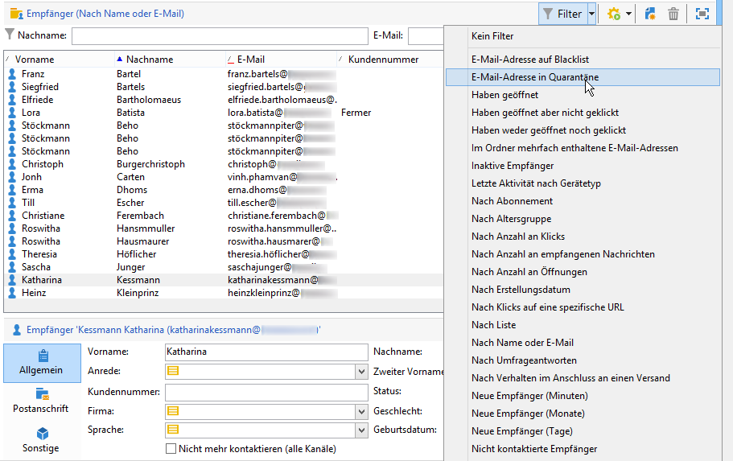
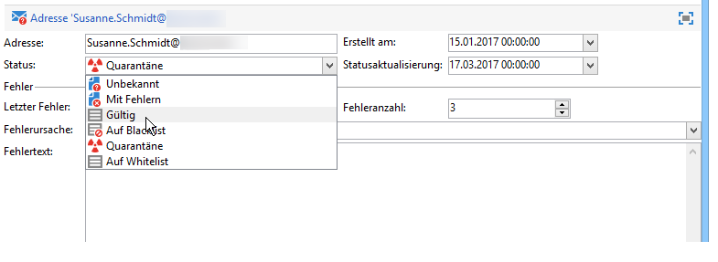
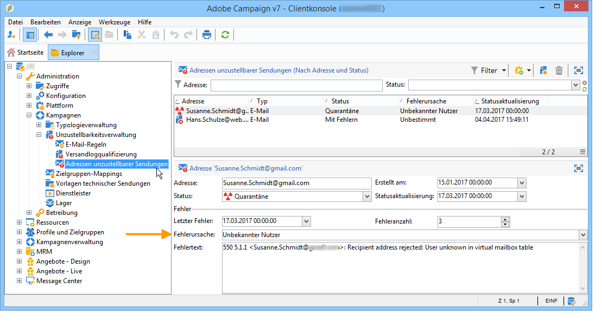
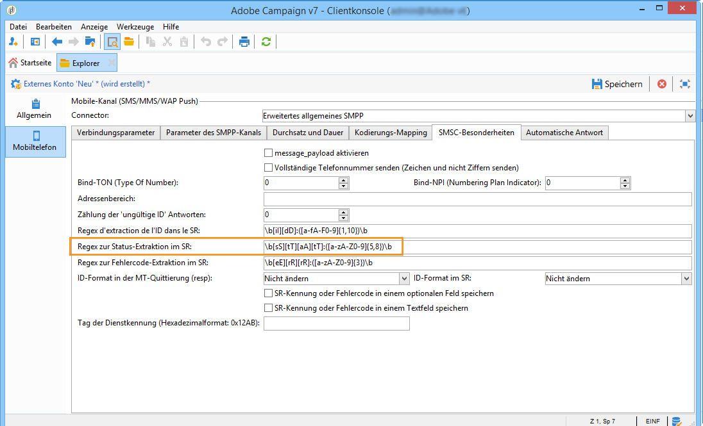

# Funktionsweise der Quarantäneverwaltung{#understanding-quarantine-management}

## Über Quarantänen {#about-quarantines}

Adobe Campaign erlaubt die Verwaltung von Quarantäne-Adressen. Empfänger, deren Adresse in Quarantäne ist, werden standardmäßig zum Zeitpunkt der Versandanalyse ausgeschlossen und fließen somit nicht in die Berechnung der Zielgruppe ein. Eine E-Mail-Adresse kann in Quarantäne kommen, weil z. B. das Postfach voll ist oder die Adresse nicht existiert. Nachfolgend werden die Regeln, die eine Quarantäne auslösen, näher erläutert.

>[!NOTE]
>
>Dieser Abschnitt gilt für Online-Kanäle: E-Mail, SMS, Push-Benachrichtigungen.

### Zustellbarkeit durch Quarantänen optimieren {#optimizing-your-delivery-through-quarantines}

Die Profile, deren E-Mail-Adressen oder Telefonnummern unter Quarantäne sind, werden während der Nachrichtenvorbereitung automatisch ausgeschlossen (siehe [Für einen Versand in Quarantäne befindliche Adressen identifizieren](#identifying-quarantined-addresses-for-a-delivery)). Dies beschleunigt die Zustellung, da sich die Fehlerrate maßgeblich auf die Zustellgeschwindigkeit auswirkt.

Teilweise werden E-Mails von Providern automatisch als Spam eingestuft, wenn die Anzahl ungültiger Adressen zu hoch ist. Durch die Quarantäne können Sie also vermeiden, von diesen Providern auf eine Blockierungsliste gesetzt zu werden.

Zusätzlich helfen Ihnen Quarantänen, die Kosten des SMS-Versands zu senken, indem fehlerhafte Telefonnummern aus dem Versand ausgeschlossen werden. Weiterführende Informationen zu Best Practices zur Durchführung und Optimierung von Sendungen finden Sie auf [dieser Seite](../../delivery/using/delivery-best-practices.md) .

### Quarantäne vs. Blockierungsliste {#quarantine-vs-denylist}

Eine **Quarantäne** bezieht sich immer nur auf die Adresse, nicht aber auf das Profil selbst. Sollten zwei Profile dieselbe E-Mail-Adresse verwenden, sind beide von der Quarantäne betroffen.

Falls jedoch ein Profil mit einer E-Mail-Adresse in Quarantäne eine neue Adresse angibt, kann es erneut in Versandzielgruppen aufgenommen werden.

Die Aufnahme in die **Blockierungsliste** führt dagegen dazu, dass das Profil vom Versand ausgeschlossen wird. Dies ist z. B. nach einer Abmeldung (Opt-out) der Fall.

>[!NOTE]
>
>Wenn ein Benutzer auf eine SMS-Nachricht mit einem Schlüsselwort wie &quot;STOPP&quot; antwortet, um sich vom SMS-Versand abzumelden, wird sein Profil nicht wie bei einem E-Mail-Abmeldevorgang auf die Blockierungsliste gesetzt. Die Telefonnummer des Profils wird unter Quarantäne gestellt, sodass der Benutzer weiterhin E-Mail-Nachrichten erhält.

## In Quarantäne befindliche Adressen identifizieren {#identifying-quarantined-addresses}

Die in Quarantäne befindlichen Adressen können für einen bestimmten Versand oder für die gesamte Plattform angezeigt werden.

### Für einen Versand in Quarantäne befindliche Adressen identifizieren {#identifying-quarantined-addresses-for-a-delivery}

Die für einen bestimmten Versand in Quarantäne befindlichen Adressen werden während der Versandvorbereitung in den Versandlogs des Versand-Dashboards angezeigt (siehe [Protokolle und Versandverlauf](../../delivery/using/monitoring-a-delivery.md#delivery-logs-and-history)).

### Für die gesamte Plattform in Quarantäne befindliche Adressen identifizieren {#identifying-quarantined-addresses-for-the-entire-platform}

Administratoren können die für die gesamte Plattform in Quarantäne befindlichen Adressen im Knoten **[!UICONTROL Administration > Kampagnenverwaltung > Unzustellbarkeitsverwaltung > Adressen unzustellbarer Sendungen]** anzeigen.

>[!NOTE]
>
>In diesem Menü werden unter Quarantäne gestellte Elemente für die Kanäle **E-Mail**, **SMS** und **Push-Benachrichtigungen** aufgeführt.

Folgende Informationen stehen für jede Adresse zur Verfügung:


>[!NOTE]
>
>Mit zunehmendem Alter der Datenbank steigt auch die Zahl der Adressen in Quarantäne. Wenn man beispielsweise davon ausgeht, dass eine E-Mail-Adresse eine Lebensdauer von etwa drei Jahren hat und dass die Empfängertabelle pro Jahr um 50 % wächst, lässt sich der Quarantänezuwachs wie folgt berechnen:
>
>Ende 1. Jahr: (1 x 0,33) / (1 + 0,5) = 22 %.
Ende von Jahr 2: ((1,22*0,33)+0,33)/(1,5+0,75)=32,5 %.

### In Versandberichten in Quarantäne befindliche Adressen identifizieren {#identifying-quarantined-addresses-in-delivery-reports}

Folgende Berichte enthalten Informationen zu Adressen in Quarantäne:

* Die **[!UICONTROL Versandzusammenfassung]** gibt Aufschluss über die Anzahl der Adressen in Quarantäne in der Zielgruppe. Sie zeigt insbesondere

   * die Adressen, die bei der Versandanalyse ausgeschlossen wurden,

   * die Adressen, die infolge des Versands neu unter Quarantäne gestellt wurden.

* In **[!UICONTROL Fehler und Bounces]** finden sich neben den Informationen bezüglich der Quarantäne-Adressen auch Hinweise auf die Fehlertypen und die Verteilung der Fehler nach Domains.

Diese Informationen stehen für alle Sendungen der Plattform (**[!UICONTROL Startseite > Berichte]**) oder versandspezifisch zur Verfügung. Sie haben auch die Möglichkeit, benutzerdefinierte Berichte zu erstellen und die dort angezeigten Daten Ihren Bedürfnissen entsprechend zu konfigurieren.

### Für einen Empfänger in Quarantäne befindliche Adressen identifizieren {#identifying-quarantined-addresses-for-a-recipient}

Sie können für jeden Empfänger den Status seiner E-Mail-Adresse prüfen. Klicken Sie hierfür im Empfängerprofil auf den Tab **[!UICONTROL Sendungen]**. Für jeden an den Empfänger gerichteten Versand wird angezeigt, ob er fehlgeschlagen ist, die Adresse während der Analyse unter Quarantäne gestellt wurde etc. Es besteht des Weiteren die Möglichkeit, nur die Empfänger anzuzeigen, deren Adresse in Quarantäne ist, indem Sie den Anwendungsfilter **[!UICONTROL E-Mail-Adresse in Quarantäne]** nutzen.



### Adresse aus der Quarantäne nehmen {#removing-a-quarantined-address}

Bei Bedarf können Sie eine Adresse manuell aus der Quarantäneliste entfernen. Darüber hinaus werden Adressen, die bestimmten Bedingungen entsprechen, durch den **[!UICONTROL Datenbankbereinigungs]**-Workflow automatisch aus der Quarantäneliste gelöscht.

Manuelles Entfernen einer Adresse aus der Quarantäneliste:

* Sie können den Status der Adresse über den Knoten **[!UICONTROL Administration > Kampagnenverwaltung > Unzustellbarkeitsverwaltung > Adressen unzustellbarer Sendungen]** in **[!UICONTROL Gültig]** ändern.

   

* Sie können ihren Status auch in **[!UICONTROL Auf die Zulassungsliste gesetzt]**&#x200B;ändern. In diesem Fall bleibt die Adresse auf der Quarantäneliste, aber sie wird systematisch als Ziel ausgewählt, selbst wenn ein Fehler auftritt.

In den folgenden Fällen werden die Adressen automatisch aus der Quarantäneliste entfernt:

* Adressen mit dem Status **[!UICONTROL Fehlerhaft]** werden nach einem erfolgreichen Versand aus der Quarantäneliste entfernt.
* Adressen mit dem Status **[!UICONTROL Fehlerhaft]** werden aus der Quarantäneliste entfernt, wenn der letzte Softbounce mehr als 10 Tage zurückliegt. Weitere Informationen zum Umgang mit Softbounces finden Sie in [diesem Abschnitt](#soft-error-management).
* Adressen mit dem Status **[!UICONTROL Fehlerhaft]**, die mit dem Fehler **[!UICONTROL Postfach voll]** zurückkommen, werden nach 30 Tagen aus der Quarantäneliste entfernt.

Ihr Status ändert sich dann in **[!UICONTROL Gültig]**.

>[!IMPORTANT]
Empfänger mit einer Adresse in **[!UICONTROL Quarantäne]** oder dem Status **[!UICONTROL Auf Blockierungsliste]** werden niemals entfernt, auch wenn sie eine E-Mail erhalten.

Sie können die Anzahl der Fehler und den Zeitraum zwischen zwei Fehlern ändern. Ändern Sie dazu die entsprechenden Einstellungen im Softwareverteilungs-Assistenten (**[!UICONTROL E-Mail-Kanal]** > **[!UICONTROL Erweiterte Parameter]**). Weiterführende Informationen zum Softwareverteilungs-Assistenten finden Sie in [diesem Abschnitt](../../installation/using/deploying-an-instance.md).

## Ursachen für Quarantänen {#conditions-for-sending-an-address-to-quarantine}

Adobe Campaign verwaltet die Quarantäne je nach dem Typ des Versandfehlers und dem Grund, der bei der Qualifizierung von Fehlermeldungen (siehe [Bounce-Message-Qualifizierung](../../delivery/using/understanding-delivery-failures.md#bounce-mail-qualification) und [Typen und Ursachen für fehlgeschlagene Sendungen](../../delivery/using/understanding-delivery-failures.md#delivery-failure-types-and-reasons)) zugewiesen wurde.

* **Ignorierter Fehler**: Bei ignorierten Fehlern wird eine Adresse nicht unter Quarantäne gestellt.
* **Hardbounce**: Die E-Mail-Adresse kommt sofort in Quarantäne.
* **Softbounce**: In diesem Fall wird die Adresse nicht sofort unter Quarantäne gestellt, sondern der Fehlerzähler nur hinaufgesetzt. Weitere Informationen hierzu finden Sie unter [Verwaltung von Softbounces](#soft-error-management).

Wenn ein Benutzer eine E-Mail als Spam kennzeichnet ([Feedback Loop](../../delivery/using/technical-recommendations.md#feedback-loop)), wird die Nachricht automatisch an ein von Adobe verwaltetes technisches Postfach weitergeleitet. Die E-Mail-Adresse des Benutzers wird dann automatisch unter Quarantäne gestellt.

Bei Adressen in Quarantäne zeigt das Feld **[!UICONTROL Fehlerursache]** an, was die Quarantäne ausgelöst hat. Bei der Quarantänefunktion in Adobe Campaign wird die Groß-/Kleinschreibung beachtet. Achten Sie darauf, E-Mail-Adressen in Kleinbuchstaben zu importieren, damit sie später nicht erneut verwendet werden.



### Verwaltung von Softbounces{#soft-error-management}

Im Gegensatz zu Hardbounces senden Softbounces nicht sofort eine Adresse in die Quarantäne, sondern erhöhen stattdessen einen Fehlerzähler.

* Wenn der Zähler eine festgelegte Schwelle überschreitet, kommt die Adresse in Quarantäne.
* Die Standardkonfiguration sieht eine Schwelle von fünf Fehlern vor, die jeweils in einem Abstand von mindestens 24 Stunden auf den vorhergehenden folgen müssen, um berücksichtigt zu werden. Beim fünften Fehler kommt die Adresse in Quarantäne.
* Die Schwelle für den Fehlerzähler ist einstellbar. Weitere Informationen hierzu finden Sie unter [Weitere Zustellversuche nach einem vorübergehend fehlgeschlagenen Versand](../../delivery/using/understanding-delivery-failures.md#retries-after-a-delivery-temporary-failure).

Der Fehlerzähler wird erneut initialisiert, wenn der letzte signifikante Fehler vor mehr als 10 Tagen aufgetreten ist. Der Status der Adresse wird auf **Gültig** gesetzt und mithilfe des Workflows **Datenbankbereinigung** wird die Adresse aus der Quarantäneliste gelöscht.

## Quarantäne für Push-Benachrichtigungen {#push-notification-quarantines}

Der Quarantänemechanismus für Push-Benachrichtigungen ist global gesehen mit dem allgemeinen Prozess identisch. Näheres dazu erfahren Sie unter [Über Quarantänen](#about-quarantines). Bestimmte Fehler werden jedoch für Push-Benachrichtigungen unterschiedlich verwaltet. Bei bestimmten Soft-Fehlern werden beispielsweise innerhalb desselben Versands keine weiteren Versuche unternommen. Die Besonderheiten bei Push-Benachrichtigungen sind unten aufgeführt. Der Wiederholungsmechanismus (Anzahl weiterer Versuche, Frequenz) entspricht dem für E-Mails.

Bei den unter Quarantäne gestellten Objekten handelt es sich um Device Token.

### Quarantäne bei iOS-Geräten {#ios-quarantine}

**Für iOS - binäre Connectoren**

>[!NOTE]
Die frühere Version des binären iOS-Connectors wird ab der Campaign-Version 20.3 nicht mehr unterstützt. Wenn Sie diesen Connector nutzen, müssen Sie Ihre Implementierung entsprechend anpassen. [Mehr dazu](https://helpx.adobe.com/de/campaign/kb/migrate-to-apns-http2.html)

Für jede Benachrichtigung empfängt Adobe Campaign die synchronen und asynchronen Fehler vom APNS-Server. Bei den folgenden synchronen Fehlern erzeugt Adobe Campaign Softbounces:

* Fehler durch Nutzdatenlänge: kein Neuversuch, der Grund für den Fehler ist **[!UICONTROL Unerreichbar]**.
* Fehler durch Ablauf des Zertifikats: kein Neuversuch, der Grund für den Fehler ist **[!UICONTROL Unerreichbar]**.
* Verbindungsabbruch während der Zustellung: Neuversuch wird unternommen, der Grund für den Fehler ist **[!UICONTROL Unerreichbar]**.
* Fehler bei der Konfiguration des Dienstes (ungültiges Zertifikat, ungültiges Passwort für Zertifikat, kein Zertifikat): kein Neuversuch, der Grund für den Fehler ist **[!UICONTROL Unerreichbar]**.

Der APNS-Server benachrichtigt Adobe Campaign asynchron darüber, dass ein Device-Token abgemeldet wurde (wenn die Mobile App durch den Empfänger deinstalliert wurde). Der **[!UICONTROL mobileAppOptOutMgt]**-Workflow wird alle sechs Stunden durchgeführt. Dabei werden die APNS-Feedback-Services aufgefordert, die Tabelle **AppSubscriptionRcp** zu aktualisieren. Für jedes deaktivierte Token wird das Feld **Deaktiviert** auf **Wahr** gesetzt, und das mit diesem Device-Token verknüpfte Abonnement wird automatisch von künftigen Sendungen ausgeschlossen.

**Für iOS – HTTP/V2-Connector**

Das HTTP/V2-Protokoll ermöglicht für jeden Push-Versand ein direktes Feedback zu dessen Status. Bei Verwendung des Connectors für das HTTP/V2-Protokoll wird der Feedback-Dienst des Workflows **[!UICONTROL mobileAppOptOutMgt]** nicht mehr aufgerufen. Die abgemeldeten Token werden beim binären iOS-Connector nicht in gleicher Weise verarbeitet wie beim iOS-HTTP/V2-Connector. Ein Token gilt als abgemeldet, wenn eine Mobile App deinstalliert oder neu installiert wird.

Wenn der APNS für eine Nachricht den Status &quot;abgemeldet&quot; zurückgibt, wird der Ziel-Token direkt unter Quarantäne gestellt.

<table> 
 <tbody> 
  <tr> 
   <td> <strong>Szenario</strong><br /> </td> 
   <td> <strong>Status</strong><br /> </td> 
   <td> <strong>Fehlernachricht</strong><br /> </td> 
   <td> <strong>Typ des Fehlschlagens</strong><br /> </td> 
   <td> <strong>Grund des Fehlschlagens</strong><br /> </td> 
   <td> <strong>Erneut versuchen</strong><br /> </td> 
  </tr> 
  <tr> 
   <td> Zielgerät eingeschaltet<br /> </td> 
   <td> OK<br /> </td> 
   <td> </td> 
   <td> </td> 
   <td> </td> 
   <td> </td> 
  </tr> 
  <tr> 
   <td> Zielgerät ausgeschaltet<br /> </td> 
   <td> OK<br /> </td> 
   <td> </td> 
   <td> </td> 
   <td> </td> 
   <td> </td> 
  </tr> 
  <tr> 
   <td> Empfänger deaktiviert Benachrichtigungen für die Anwendung<br /> </td> 
   <td> OK<br /> </td> 
   <td> </td> 
   <td> </td> 
   <td> </td> 
   <td> </td> 
  </tr> 
  <tr> 
   <td> Nachrichtenerstellung/Analysephase - Nutzdaten zu groß<br /> </td> 
   <td> Fehlgeschlagen<br /> </td> 
   <td> Nutzdaten zu lang<br /> </td> 
   <td> Soft<br /> </td> 
   <td> Zurückgewiesen<br /> </td> 
   <td> Nein<br /> </td> 
  </tr> 
  <tr> 
   <td> Nachrichtenerstellung/Analysephase - Problem mit Inhalt mit unerwartetem Format<br /> </td> 
   <td> Fehlgeschlagen<br /> </td> 
   <td> Verschiedene Fehlernachrichten je nach Fehler<br /> </td> 
   <td> Soft<br /> </td> 
   <td> Unbestimmt<br /> </td> 
   <td> Nein<br /> </td> 
  </tr> 
  <tr> 
   <td> Problem mit Zertifikat (Passwort, Beschädigung etc.) und Fehler bei Testverbindung mit APNS<br /> </td> 
   <td> Fehlgeschlagen<br /> </td> 
   <td> Verschiedene Fehlernachrichten je nach Fehler<br /> </td> 
   <td> Soft<br /> </td> 
   <td> Zurückgewiesen<br /> </td> 
   <td> Nein<br /> </td> 
  </tr> 
  <tr> 
   <td> Netzwerkverbindung während des Versands abgebrochen<br /> </td> 
   <td> Fehlgeschlagen<br /> </td> 
   <td> Verbindungsfehler<br /> </td> 
   <td> Unbestimmt<br /> </td> 
   <td> Unerreichbar<br /> </td> 
   <td> Ja<br /> </td> 
  </tr> 
  <tr> 
   <td> Zurückweisung von APNS-Nachricht: Abmeldung<br /> Benutzer hat die Mobile App entfernt oder das Token ist abgelaufen<br /> </td> 
   <td> Fehlgeschlagen<br /> </td> 
   <td> Abgemeldet<br /> </td> 
   <td> Hard<br /> </td> 
   <td> Unbekannter Nutzer<br /> </td> 
   <td> Nein<br /> </td> 
  </tr> 
  <tr> 
   <td> Zurückweisung von APNS-Nachricht: alle anderen Fehler<br /> </td> 
   <td> Fehlgeschlagen<br /> </td> 
   <td> Der Grund für Zurückweisung wird in der Fehlernachricht angegeben<br /> </td> 
   <td> Soft<br /> </td> 
   <td> Zurückgewiesen<br /> </td> 
   <td> Nein<br /> </td> 
  </tr> 
 </tbody> 
</table>

### Quarantäne bei Android-Geräten {#android-quarantine}

**Für Android V1**

Für jede Benachrichtigung erhält Adobe Campaign die synchronen Fehler direkt vom FCM-Server. Adobe Campaign verarbeitet diese unmittelbar und erstellt Hard- und Softbounces entsprechend der Prioritätsstufe des Fehlers. Es können weitere Zustellversuche vorgenommen werden:

* Nutzdatenlänge überschritten, Verbindungsproblem, Problem mit Dienstverfügbarkeit: Neuversuch wird unternommen, Softbounce, Grund für den Fehler ist **[!UICONTROL Abgelehnt]**.
* Gerätequote überschritten: kein Neuversuch, Softbounce, Grund für Fehler ist **[!UICONTROL Abgelehnt]**.
* Ungültiger oder abgemeldeter Token, unerwarteter Fehler, Problem mit Absenderkonto: kein Neuversuch, Hardbounce, Grund für Fehler ist **[!UICONTROL Abgelehnt]**.

Der **[!UICONTROL mobileAppOptOutMgt]**-Workflow wird alle sechs Stunden zur Aktualisierung der **AppSubscriptionRcp**-Tabelle durchgeführt. Für jeden abgemeldeten oder nicht mehr gültigen Token wird das Feld **Deaktiviert** auf **Wahr** gesetzt und das mit dem Gerät verknüpfte Abonnement wird automatisch von künftigen Sendungen ausgeschlossen.

Während der Versandanalyse werden alle Geräte, die von der Zielgruppe ausgeschlossen werden, automatisch zur Tabelle **excludeLogAppSubRcp** hinzugefügt.

>[!NOTE]
Im Folgenden finden Sie die unterschiedlichen Fehlertypen für den Baidu-Connector:
* Verbindungsproblem zu Beginn des Versands: Fehlertyp **[!UICONTROL Undefiniert]**, Grund **[!UICONTROL Unerreichbar]**, Neuversuch wird unternommen.
* Verbindung während des Versands unterbrochen: Softbounce, Grund für den Fehler **[!UICONTROL Abgelehnt]**, Neuversuch wird unternommen.
* Während des Versands von Baidu synchroner Fehler zurückgegeben: Hardbounce, Grund für den Fehler **[!UICONTROL Abgelehnt]**, es wird kein Neuversuch unternommen.

Adobe Campaign kontaktiert den Baidu-Server alle zehn Minuten, um den Status der versendeten Nachrichten abzurufen, und aktualisiert die Versandlogs. Wenn eine Nachricht als gesendet gemeldet wird, ändert sich der Status der Nachricht in den Versandlogs in **[!UICONTROL Erhalten]**. Wenn Baidu einen Fehler meldet, wird der Status auf **[!UICONTROL Fehlgeschlagen]** gesetzt.

**Für Android V2**

Das Quarantäneverfahren für Android V2 ist identisch mit dem für Android V1. Dasselbe gilt für die Aktualisierung von Anmeldungen und Ausschlüssen. Weiterführende Informationen dazu finden Sie im Abschnitt [Android V1](#android-quarantine).

<table> 
 <tbody> 
  <tr> 
   <td> <strong>Szenario</strong><br /> </td> 
   <td> <strong>Status</strong><br /> </td> 
   <td> <strong>Fehlernachricht</strong><br /> </td> 
   <td> <strong>Typ des Fehlschlagens</strong><br /> </td> 
   <td> <strong>Grund des Fehlschlagens</strong><br /> </td> 
   <td> <strong>Erneut versuchen</strong><br /> </td> 
  </tr> 
  <tr> 
   <td> Nachrichtenerstellung/Analysephase: unzulässige Schlüsselwörter in den benutzerdefinierten Feldern verwendet<br /> </td> 
   <td> Fehlgeschlagen<br /> </td> 
   <td> Folgende Schlüsselwörter dürfen nicht benutzt werden: {1}<br /> </td> 
   <td> Soft<br /> </td> 
   <td> </td> 
   <td> Nein<br /> </td> 
  </tr> 
  <tr> 
   <td> Nachrichtenerstellung/Analysephase: Nutzdaten zu groß<br /> </td> 
   <td> Fehlgeschlagen<br /> </td> 
   <td> Die Benachrichtigung ist zu groß: {1} Bit statt maximal {2}.<br /> </td> 
   <td> Soft<br /> </td> 
   <td> Zurückgewiesen<br /> </td> 
   <td> Nein<br /> </td> 
  </tr> 
  <tr> 
   <td> Netzwerkverbindung während des Versands abgebrochen<br /> </td> 
   <td> Fehlgeschlagen<br /> </td> 
   <td> Keine Antwort von Firebase Cloud Messaging für die Adresse: {1}<br /> </td> 
   <td> Soft<br /> </td> 
   <td> Unerreichbar<br /> </td> 
   <td> Ja<br /> </td> 
  </tr> 
  <tr> 
   <td> Zurückweisung von FCM-Nachricht: Der FCM-Server ist vorübergehend nicht verfügbar (z. B. durch Timeouts). <br /> </td> 
   <td> Fehlgeschlagen<br /> </td> 
   <td> Firebase Cloud Messaging ist zurzeit nicht verfügbar<br /> </td> 
   <td> Soft<br /> </td> 
   <td> Unerreichbar<br /> </td> 
   <td> Ja<br /> </td> 
  </tr> 
  <tr> 
   <td> Zurückweisung von FCM-Nachricht: Fehler bei der Authentifizierung des Absenderkontos<br /> </td> 
   <td> Fehlgeschlagen<br /> </td> 
   <td> Entwicklerkonto konnte nicht identifiziert werden, bitte Kennung und Kennwort prüfen.<br /> </td> 
   <td> Soft<br /> </td> 
   <td> Zurückgewiesen<br /> </td> 
   <td> Nein<br /> </td> 
  </tr> 
  <tr> 
   <td> Zurückweisung von FCM-Nachricht: Gerätequote überschritten<br /> </td> 
   <td> Fehlgeschlagen<br /> </td> 
   <td> </td> 
   <td> Soft<br /> </td> 
   <td> Zurückgewiesen<br /> </td> 
   <td> Ja<br /> </td> 
  </tr> 
  <tr> 
   <td> Zurückweisung von FCM-Nachricht: ungültige Registrierung/nicht registriert<br /> </td> 
   <td> Fehlgeschlagen<br /> </td> 
   <td> </td> 
   <td> Hard<br /> </td> 
   <td> Unbekannter Nutzer<br /> </td> 
   <td> Nein<br /> </td> 
  </tr> 
  <tr> 
   <td> Zurückweisung von FCM-Nachricht: alle anderen Fehler<br /> </td> 
   <td> Fehlgeschlagen<br /> </td> 
   <td> Der Firebase Cloud Messaging Server hat einen unerwarteten Fehlercode ausgegeben: {1} </td> 
   <td> </td> 
   <td> Zurückgewiesen<br /> </td> 
   <td> Nein<br /> </td> 
  </tr> 
    <tr> 
   <td> Zurückweisung von FCM-Nachricht: ungültiges Argument<br /> </td> 
   <td> Fehlgeschlagen<br /> </td> 
   <td> INVALID_ARGUMENT </td> 
   <td> Ignoriert</td> 
   <td> Unbestimmt<br /> </td> 
   <td> Nein<br /> </td> 
  </tr>
    <tr> 
   <td> Zurückweisung von FCM-Nachricht: Authentifizierungsfehler bei Drittanbieter<br /> </td> 
   <td> Fehlgeschlagen<br /> </td> 
   <td> THIRD_PARTY_AUTH_ERROR </td> 
   <td> Ignoriert</td>
   <td> Zurückgewiesen<br /> </td> 
   <td> Ja<br /> </td> 
  </tr>
    <tr> 
   <td> Zurückweisung von FCM-Nachricht: Sender ID stimmt nicht überein<br /> </td> 
   <td> Fehlgeschlagen<br /> </td> 
   <td> SENDER_ID_MISMATCH </td> 
   <td> Soft</td>
   <td> Unbekannter Nutzer<br /> </td> 
   <td> Nein<br /> </td> 
  </tr>
    <tr> 
   <td> Zurückweisung von FCM-Nachricht: abgemeldet<br /> </td> 
   <td> Fehlgeschlagen<br /> </td>
   <td> UNREGISTERED </td> 
   <td> Hard</td> 
   <td> Unbekannter Nutzer<br /> </td> 
   <td> Nein<br /> </td> 
  </tr>
    <tr> 
   <td> Zurückweisung von FCM-Nachricht: intern<br /> </td> 
   <td> Fehlgeschlagen<br /> </td> 
   <td> INTERNAL </td> 
   <td> Ignoriert</td> 
   <td> Zurückgewiesen<br /> </td> 
   <td> Ja<br /> </td> 
  </tr>
    <tr> 
   <td> Zurückweisung von FCM-Nachricht: nicht verfügbar<br /> </td> 
   <td> Fehlgeschlagen<br /> </td> 
   <td> UNAVAILABLE</td> 
   <td> Ignoriert</td> 
   <td> Zurückgewiesen<br /> </td> 
   <td> Ja<br /> </td> 
  </tr>
    <tr> 
   <td> Zurückweisung von FCM-Nachricht: unerwarteter Fehlercode<br /> </td> 
   <td> Fehlgeschlagen<br /> </td> 
   <td> Unerwarteter Fehlercode</td> 
   <td> Ignoriert</td> 
   <td> Zurückgewiesen<br /> </td> 
   <td> Nein<br /> </td> 
  </tr>
  <tr> 
   <td> Authentifizierung: Verbindungsproblem<br /> </td> 
   <td> Fehlgeschlagen<br /> </td> 
   <td> Verbindung zum Authentifizierungs-Server nicht möglich </td> 
   <td> Ignoriert</td>
   <td> Zurückgewiesen<br /> </td> 
   <td> Ja<br /> </td> 
  </tr>
    <tr> 
   <td> Authentifizierung: Nicht autorisierter Client oder Perimeter in Anfrage.<br /> </td> 
   <td> Fehlgeschlagen<br /> </td> 
   <td> unauthorized_client </td> 
   <td> Ignoriert</td>
   <td> Zurückgewiesen<br /> </td> 
   <td> Nein<br /> </td> 
  </tr>
    <tr> 
   <td> Authentifizierung: Der Client ist nicht berechtigt, Zugriffs-Token mit dieser Methode abzurufen, oder der Client ist für keinen der angeforderten Perimeter autorisiert.<br /> </td> 
   <td> Fehlgeschlagen<br /> </td> 
   <td> unauthorized_client </td> 
   <td> Ignoriert</td>
   <td> Zurückgewiesen<br /> </td> 
   <td> Nein<br /> </td> 
  </tr>
    <tr> 
   <td> Authentifizierung: Zugriff verweigert<br /> </td> 
   <td> Fehlgeschlagen<br /> </td>
   <td> access_denied</td> 
   <td> Ignoriert</td>
   <td> Zurückgewiesen<br /> </td> 
   <td> Nein<br /> </td> 
  </tr>
    <tr> 
   <td> Authentifizierung: ungültige E-Mail-Adresse<br /> </td> 
   <td> Fehlgeschlagen<br /> </td> 
   <td> invalid_grant </td> 
   <td> Ignoriert</td> 
   <td> Zurückgewiesen<br /> </td> 
   <td> Nein<br /> </td> 
  </tr>
    <tr> 
   <td> Authentifizierung: ungültiger JWT<br /> </td> 
   <td> Fehlgeschlagen<br /> </td> 
   <td> invalid_grant </td> 
   <td> Ignoriert</td> 
   <td> Zurückgewiesen<br /> </td> 
   <td> Nein<br /> </td> 
  </tr>
    <tr> 
   <td> Authentifizierung: ungültige JWT-Signatur<br /> </td> 
   <td> Fehlgeschlagen<br /> </td> 
   <td> invalid_grant </td> 
   <td> Ignoriert</td> 
   <td> Zurückgewiesen<br /> </td> 
   <td> Nein<br /> </td> 
  </tr>
    <tr> 
   <td> Authentifizierung: ungültiger OAuth-Perimeter oder ungültige ID-Token-Zielgruppe angegeben<br /> </td> 
   <td> Fehlgeschlagen<br /> </td> 
   <td> unauthorized_client</td> 
   <td> Ignoriert</td> 
   <td> Zurückgewiesen<br /> </td> 
   <td> Nein<br /> </td> 
  </tr>
    <tr> 
   <td> Authentifizierung: OAuth-Client deaktiviert<br /> </td> 
   <td> Fehlgeschlagen<br /> </td> 
   <td> disabled_client</td> 
   <td> Ignoriert</td> 
   <td> Zurückgewiesen<br /> </td> 
   <td> Nein<br /> </td> 
  </tr>
 </tbody> 
</table>

## Quarantäne für SMS {#sms-quarantines}

**Für Standard-Connectoren**

Der Quarantänemechanismus für SMS-Nachrichten ist global gesehen mit dem allgemeinen Prozess identisch. Näheres dazu erfahren Sie unter [Über Quarantänen](#about-quarantines). Die Besonderheiten bei SMS-Nachrichten sind unten aufgeführt.

>[!NOTE]
Die Tabelle **[!UICONTROL Versandlogqualifizierung]** gilt nicht für den Connector **Erweitertes allgemeines SMPP**.

<table> 
 <tbody> 
  <tr> 
   <td> <strong>Szenario</strong><br /> </td> 
   <td> <strong>Status</strong><br /> </td> 
   <td> <strong>Fehlernachricht</strong><br /> </td> 
   <td> <strong>Typ des Fehlschlagens</strong><br /> </td> 
   <td> <strong>Grund des Fehlschlagens</strong><br /> </td> 
  </tr> 
  <tr> 
   <td> An Anbieter gesendet<br /> </td> 
   <td> Gesendet<br /> </td> 
   <td> </td> 
   <td> </td> 
   <td> </td> 
  </tr> 
  <tr> 
   <td> Auf Mobiltelefon erhalten<br /> </td> 
   <td> Erhalten<br /> </td> 
   <td> </td> 
   <td> </td> 
   <td> </td> 
  </tr> 
  <tr> 
   <td> Fehler von Provider gemeldet<br /> </td> 
   <td> Fehlgeschlagen<br /> </td> 
   <td> Fehler beim Abrufen von Daten (SR oder MO)<br /> </td> 
   <td> Soft<br /> </td> 
   <td> Unerreichbar<br /> </td> 
  </tr> 
  <tr> 
   <td> Ungültige MT-Quittierung<br /> </td> 
   <td> Fehlgeschlagen<br /> </td> 
   <td> Fehler '{1}' bei der Verarbeitung des Empfangsbestätigungs-Frames eines Sendeauftrags<br /> </td> 
   <td> Soft<br /> </td> 
   <td> Unerreichbar<br /> </td> 
  </tr> 
  <tr> 
   <td> Fehler beim Senden von MT<br /> </td> 
   <td> Fehlgeschlagen<br /> </td> 
   <td> Fehler beim Senden der Nachrichten<br /> </td> 
   <td> Soft<br /> </td> 
   <td> Unerreichbar<br /> </td> 
  </tr> 
 </tbody> 
</table>

**Für den Connector für erweitertes allgemeines SMPP**

Bei der Verwendung des SMPP-Protokolls zum Versand von SMS-Nachrichten werden Fehler anders gehandhabt. Weiterführende Informationen zum Connector für erweitertes allgemeines SMPP finden Sie auf [dieser Seite](../../delivery/using/sms-channel.md#creating-an-smpp-external-account).

Der SMPP-Connector ruft zum Filtern des Inhalts mithilfe regulärer Ausdrücke (regexes) Daten von der zurückgegebenen Empfangsbestätigung ab. Diese Daten werden dann mit den Informationen in der Tabelle **[!UICONTROL Versandlogqualifizierung]** abgeglichen. Der Zugriff darauf erfolgt über das Menü **[!UICONTROL Administration]** > **[!UICONTROL Kampagnenverwaltung]** > **[!UICONTROL Unzustellbarkeitsverwaltung]**.

Bevor ein neuer Fehlertyp qualifiziert wird, wird der Fehlergrund immer standardmäßig auf **Abgelehnt** gesetzt.

>[!NOTE]
Die Typen und Ursachen für Fehlschläge sind dieselben wie für E-Mails. Siehe [Typen und Ursachen für fehlgeschlagene Sendungen](../../delivery/using/understanding-delivery-failures.md#delivery-failure-types-and-reasons).
Erkundigen Sie sich bei Ihrem Provider nach einer Liste mit Status- und Fehlercodes, um in der Versandlogqualifizierungs-Tabelle die korrekten Fehlertypen und -ursachen anzugeben.

Beispiel einer generierten Nachricht:

```
SR Generic DELIVRD 000|#MESSAGE#
```

* Alle Fehlernachrichten beginnen mit **SR**, sodass SMS-Fehlercodes von E-Mail-Fehlercodes unterschieden werden können.
* Der zweite Teil der Fehlernachricht (in diesem Beispiel **Generic**) bezieht sich auf den Namen der SMSC-Implementierung entsprechend der Definition im Feld **[!UICONTROL Name der SMSC-Implementierung]** des externen SMS-Kontos. Siehe [diese Seite](../../delivery/using/sms-channel.md#creating-an-smpp-external-account).

   Da derselbe Fehlercode bei jedem Provider eine andere Bedeutung haben kann, sehen Sie in diesem Feld, welcher Provider den Fehlercode erstellt hat. Den Fehler können Sie dann in der entsprechenden Dokumentation des Providers einsehen.

* Der dritte Teil der Fehlernachricht (in diesem Beispiel **DELIVRD**) entspricht dem Statuscode, der von der Empfangsbestätigung unter Verwendung des – im externen SMS-Konto definierten – regulären Ausdruck zur Statusextraktion abgerufen wurde.

   Dieser reguläre Ausdruck ist im Tab **[!UICONTROL SMSC-Besonderheiten]** des externen Kontos spezifiziert. Siehe auch [diese Seite](../../delivery/using/sms-channel.md#creating-an-smpp-external-account).

   

   Standardmäßig erfolgt die Regex-Extraktion des **stat:**-Felds entsprechend der Definition im Bereich **Appendix B** der **SMPP 3.4-Spezifikation**.

* Der vierte Teil der Fehlernachricht (in diesem Beispiel **000**) entspricht dem Fehlercode, der von der Empfangsbestätigung unter Verwendung des im externen SMS-Konto definierten regulären Ausdrucks zur Fehlercode-Extraktion extrahiert wurde.

   Dieser reguläre Ausdruck ist im Tab **[!UICONTROL SMSC-Besonderheiten]** des externen Kontos spezifiziert. Siehe auch [diese Seite](../../delivery/using/sms-channel.md#creating-an-smpp-external-account).

   Standardmäßig erfolgt die Regex-Extraktion des **err:**-Felds entsprechend der Definition im Bereich **Appendix B** der **SMPP 3.4-Spezifikation**.

* Alles, was hinter dem senkrechten Strich (|) steht, wird nur in der Spalte **[!UICONTROL Erster Text]** der Tabelle **[!UICONTROL Versandlogqualifizierung]** dargestellt. Nach der Bereinigung der Nachricht wird dieser Inhalt durch **#MESSAGE#** ersetzt. Dadurch wird vermieden, dass für ähnliche Fehler mehrere Einträge vorgenommen werden. Das Verfahren ist dasselbe wie für E-Mails. Weitere Informationen hierzu finden Sie unter [Bounce-Message-Qualifizierung](../../delivery/using/understanding-delivery-failures.md#bounce-mail-qualification).

Der Connector für erweitertes allgemeines SMPP wendet eine Heuristik an, um sinnvolle Standardwerte zu finden: Ein mit **DELIV** beginnender Status wird als erfolgreich bewertet, da dies den üblicherweise von Providern verwendeten Statuswerten **DELIVRD** oder **DELIVERED** entspricht. Alle anderen Statuswerte verursachen einen Hardbounce.
