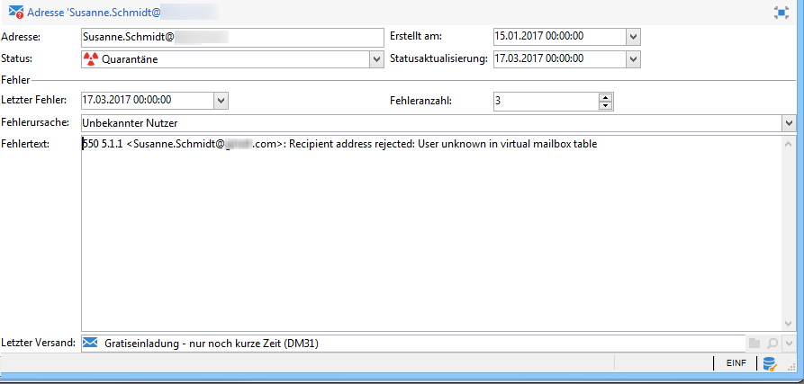

# Funktionsweise der Quarantäneverwaltung{#understanding-quarantine-management}

## Über Quarantänen {#about-quarantines}

Adobe Campaign erlaubt die Verwaltung von Quarantäne-Adressen. Empfänger, deren Adresse in Quarantäne ist, werden standardmäßig zum Zeitpunkt der Versandanalyse ausgeschlossen und fließen somit nicht in die Berechnung der Zielgruppe ein. Eine E-Mail-Adresse kann in Quarantäne kommen, weil z. B. das Postfach voll ist oder die Adresse nicht existiert. Nachfolgend werden die Regeln, die eine Quarantäne auslösen, näher erläutert.

>[!NOTE]
>
>Dieser Abschnitt gilt für Online-Kanäle: E-Mail, SMS, Push-Benachrichtigungen.

### Zustellbarkeit durch Quarantänen optimieren {#optimizing-your-delivery-through-quarantines}

Die Profile, deren E-Mail-Adressen oder Telefonnummern unter Quarantäne sind, werden während der Nachrichtenvorbereitung automatisch ausgeschlossen (siehe [Für einen Versand in Quarantäne befindliche Adressen identifizieren](#identifying-quarantined-addresses-for-a-delivery)). Dies beschleunigt die Zustellung, da sich die Fehlerrate maßgeblich auf die Zustellgeschwindigkeit auswirkt.

Teilweise werden E-Mails von Providern automatisch als Spam eingestuft, wenn die Anzahl ungültiger Adressen zu hoch ist. Durch die Quarantänefunktion vermeiden Sie, von diesen Providern auf eine Blacklist gesetzt zu werden.

Zusätzlich helfen Ihnen Quarantänen, die Kosten des SMS-Versands zu senken, indem fehlerhafte Telefonnummern aus dem Versand ausgeschlossen werden. Weiterführende Informationen zu Best Practices zur Durchführung und Optimierung von Sendungen finden Sie auf [dieser Seite](https://docs.campaign.adobe.com/doc/AC/getting_started/EN/deliveryBestPractices.html).

### Quarantäne im Vergleich zur Blacklist {#quarantine-vs-blacklisting}

Eine **Quarantäne** bezieht sich immer nur auf die Adresse, nicht aber auf das Profil selbst. Sollten zwei Profile dieselbe E-Mail-Adresse verwenden, sind beide von der Quarantäne betroffen.

Falls jedoch ein Profil mit einer E-Mail-Adresse in Quarantäne eine neue Adresse angibt, kann es erneut in Versandzielgruppen aufgenommen werden.

Im Gegensatz dazu sind es bei der **Blacklist** die Profile selbst, die vom Versand ausgeschlossen werden. Dies ist z. B. nach einem Opt-out der Fall. 

>[!NOTE]
>
>Wenn ein Benutzer auf eine SMS-Nachricht mit einem Schlüsselwort wie &quot;STOP&quot; antwortet, um sich vom SMS-Versand abzumelden, wird sein Profil nicht wie bei einem E-Mail-Abmeldevorgang auf die Blacklist gesetzt. Die Telefonnummer des Profils wird unter Quarantäne gestellt, sodass der Benutzer weiterhin E-Mail-Nachrichten erhält.

## In Quarantäne befindliche Adressen identifizieren {#identifying-quarantined-addresses}

Die in Quarantäne befindlichen Adressen können für einen bestimmten Versand oder für die gesamte Plattform angezeigt werden.

### Für einen Versand in Quarantäne befindliche Adressen identifizieren {#identifying-quarantined-addresses-for-a-delivery}

Quarantined addresses for a specific delivery are listed during the delivery preparation phase, in the delivery logs of the delivery dashboard (see [Delivery logs and history](../../delivery/using/monitoring-a-delivery.md#delivery-logs-and-history)).

### Für die gesamte Plattform in Quarantäne befindliche Adressen identifizieren {#identifying-quarantined-addresses-for-the-entire-platform}

Administratoren können die Adressen in Quarantäne für die gesamte Plattform vom **[!UICONTROL Administration > Campaign Management > Non deliverables Management > Non deliverables and addresses]** Knoten aus auflisten.

>[!NOTE]
>
>In diesem Menü werden unter Quarantäne gestellte Elemente für die Kanäle **E-Mail**, **SMS** und **Push-Benachrichtigungen** aufgeführt.

Folgende Informationen stehen für jede Adresse zur Verfügung:



>[!NOTE]
>
>Mit zunehmendem Alter der Datenbank steigt auch die Zahl der Adressen in Quarantäne. Wenn man beispielsweise davon ausgeht, dass eine E-Mail-Adresse eine Lebensdauer von etwa drei Jahren hat und dass die Empfängertabelle pro Jahr um 50 % wächst, lässt sich der Quarantänezuwachs wie folgt berechnen:
>
>Ende 1. Jahr: (1 x 0,33) / (1 + 0,5) = 22 %.
Ende von Jahr 2: ((1,22*0,33)+0,33)/(1,5+0,75)=32,5 %.

### In Versandberichten in Quarantäne befindliche Adressen identifizieren {#identifying-quarantined-addresses-in-delivery-reports}

Folgende Berichte enthalten Informationen zu Adressen in Quarantäne:

* For each delivery, the **[!UICONTROL Delivery summary]** report shows the number of addresses in quarantine in the delivery target. Es wird angezeigt:

   * die Adressen, die bei der Versandanalyse ausgeschlossen wurden,

   * die Adressen, die infolge des Versands neu unter Quarantäne gestellt wurden.

* The **[!UICONTROL Non-deliverables and bounces]** report displays information about the addresses in quarantine, the types of error encountered, etc., and a failure breakdown by domain.

Diese Informationen stehen für alle Sendungen der Plattform (**Startseite > Berichte**) oder versandspezifisch zur Verfügung. Sie haben auch die Möglichkeit, benutzerdefinierte Berichte zu erstellen und die dort angezeigten Daten Ihren Bedürfnissen entsprechend zu konfigurieren.

### Für einen Empfänger in Quarantäne befindliche Adressen identifizieren {#identifying-quarantined-addresses-for-a-recipient}

Sie können den Status der E-Mail-Adresse eines Empfängers nachschlagen. Wählen Sie dazu das Empfängerprofil aus und klicken Sie auf die **[!UICONTROL Deliveries]** Registerkarte. Für alle Lieferungen an diesen Empfänger können Sie herausfinden, ob die Adresse fehlgeschlagen ist, während der Analyse isoliert wurde usw. Für jeden Ordner können Sie nur die Empfänger anzeigen, deren E-Mail-Adresse in Quarantäne steht. Verwenden Sie dazu den **[!UICONTROL Quarantined email address]** Anwendungsfilter.


### Adresse aus der Quarantäne nehmen {#removing-a-quarantined-address}

If you need to remove an address from quarantine, change its status manually to **[!UICONTROL Valid]**.


If you change the status to **[!UICONTROL Whitelisted]**, the address will be targeted systematically each time even if an error is encountered.

>[!CAUTION]
Adressen auf der Blacklist sind nicht von der Quarantäneverwaltung betroffen und werden nicht in die Zustellung einbezogen, auch wenn ihr Status manuell geändert wurde.

Sie können außerdem die Fehlerschwelle und die Spanne zwischen zwei Fehlern anpassen. Auf die entsprechenden Parameter kann im Softwareverteilungs-Assistenten (E-Mail-Kanal / erweiterte Parameter) zugegriffen werden. Näheres zum Softwareverteilungs-Assistenten erfahren Sie in [diesem Abschnitt](../../installation/using/deploying-an-instance.md).

## Ursachen für Quarantänen {#conditions-for-sending-an-address-to-quarantine}

Adobe Campaign verwaltet die Quarantäne entsprechend dem Typ des Bereitstellungsfehlers und dem Grund, der während der Qualifizierung von Fehlermeldungen zugewiesen wurde (siehe Qualifizierung[der ](../../delivery/using/understanding-delivery-failures.md#bounce-mail-qualification)Absprungmail), sowie den Fehlertypen und -gründen für die [Auslieferung](../../delivery/using/understanding-delivery-failures.md#delivery-failure-types-and-reasons).

* **Ignorierter Fehler**: Bei ignorierten Fehlern wird eine Adresse nicht unter Quarantäne gestellt.
* **Hardbounce**: Die E-Mail-Adresse kommt sofort in Quarantäne.
* **Softbounce**: In diesem Fall wird die Adresse nicht sofort unter Quarantäne gestellt, sondern der Fehlerzähler nur hinaufgesetzt. For more on this, see [Soft error management](#soft-error-management).

Wenn ein Benutzer eine E-Mail als Spam kennzeichnet (**Feedback Loop**), wird die Nachricht automatisch an ein von Adobe verwaltetes technisches Postfach weitergeleitet. Die E-Mail-Adresse des Benutzers wird dann automatisch unter Quarantäne gestellt.

In the list of quarantined addresses, the **[!UICONTROL Error reason]** field indicates why the selected address was placed in quarantine. Bei der Quarantänefunktion in Adobe Campaign wird die Groß-/Kleinschreibung beachtet. Achten Sie darauf, E-Mail-Adressen in Kleinbuchstaben zu importieren, damit sie später nicht erneut verwendet werden.


### Weiche Fehlerverwaltung {#soft-error-management}

Im Gegensatz zu harten Fehlern senden weiche Fehler nicht sofort eine Adresse an Quarantäne, sondern erhöhen einen Fehlerzähler.

* Wenn der Fehlerzähler den Grenzwert erreicht, wird die Adresse in Quarantäne gestellt.
* Die Standardkonfiguration sieht eine Schwelle von fünf Fehlern vor, die jeweils in einem Abstand von mindestens 24 Stunden auf den vorhergehenden folgen müssen, um berücksichtigt zu werden. Beim sechsten Fehler kommt die Adresse in Quarantäne.
* Die Schwelle für den Fehlerzähler ist einstellbar. For more on this, refer to [Retries after a delivery temporary failure](../../delivery/using/understanding-delivery-failures.md#retries-after-a-delivery-temporary-failure).

Der Fehlerzähler wird erneut initialisiert, wenn der letzte bedeutende Fehler vor mehr als 10 Tagen auftrat. The address status then changes to **Valid** and it is deleted from the list of quarantines by the **Database cleanup** workflow.

## Quarantäne für Push-Benachrichtigungen {#push-notification-quarantines}

Der Quarantänemechanismus für Push-Benachrichtigungen ist global identisch mit dem allgemeinen Prozess. Näheres dazu erfahren Sie unter [Über Quarantänen](#about-quarantines). Bestimmte Fehler werden jedoch für Push-Benachrichtigungen unterschiedlich verwaltet. Bei bestimmten Soft-Fehlern werden beispielsweise innerhalb derselben Bereitstellung keine Wiederholungen durchgeführt. Die Besonderheiten für die Push-Benachrichtigung sind unten aufgeführt. Der Wiederholungsmechanismus (Anzahl der Wiederholungen, Häufigkeit) entspricht dem für E-Mails.

Bei den unter Quarantäne gestellten Objekten handelt es sich um Device Token.

### Quarantäne bei iOS-Geräten {#ios-quarantine}

**Für iOS - binäre Connectoren**

Für jede Benachrichtigung empfängt Adobe Campaign die synchronen und asynchronen Fehler vom APNS-Server. Bei den folgenden synchronen Fehlern erzeugt Adobe Campaign Softbounces:

* Payload length issues: no retry, the failure reason is **[!UICONTROL Unreachable]**.
* Certificate expiration issues: no retry, the failure reason is **[!UICONTROL Unreachable]**.
* Connection lost during the delivery: retry performed, the failure reason is **[!UICONTROL Unreachable]**.
* Service configuration issue (invalid certificate, invalid certificate password, no certificate): no retry, the failure reason is **[!UICONTROL Unreachable]**.

Der APNS-Server benachrichtigt Adobe Campaign asynchron, dass ein Gerätetoken nicht registriert wurde (wenn die Mobilanwendung vom Benutzer deinstalliert wurde). Der **[!UICONTROL mobileAppOptOutMgt]** Arbeitsablauf wird alle 6 Stunden ausgeführt, um die APNS-Feedback-Dienste zu kontaktieren, um die **AppSubscriptionRcp** -Tabelle zu aktualisieren. Bei allen deaktivierten Token ist das Feld **Deaktiviert** auf **True** eingestellt und das mit diesem Gerätetoken verknüpfte Abonnement wird automatisch aus zukünftigen Auslieferungen ausgeschlossen.

**Für iOS - HTTP/2-Connector**

Das HTTP/2-Protokoll ermöglicht ein direktes Feedback und Status für jede Push-Bereitstellung. Wenn der HTTP/2-Protokollanschluss verwendet wird, wird der Feedback-Dienst nicht mehr vom **[!UICONTROL mobileAppOptOutMgt]** Workflow aufgerufen. Die nicht registrierten Token werden zwischen dem binären iOS-Connector und dem iOS-HTTP/2-Connector unterschiedlich gehandhabt. Ein Token gilt als nicht registriert, wenn eine Mobilanwendung deinstalliert oder neu installiert wird.

Wenn das APNS für eine Nachricht den Status &quot;abgemeldet&quot; zurückgibt, wird der Target Token sofort in Quarantäne gestellt.

<table> 
 <tbody> 
  <tr> 
   <td> <strong>Szenario</strong><br /> </td> 
   <td> <strong>Status</strong><br /> </td> 
   <td> <strong>Fehlernachricht</strong><br /> </td> 
   <td> <strong>Typ des Fehlschlagens</strong><br /> </td> 
   <td> <strong>Grund des Fehlschlagens</strong><br /> </td> 
   <td> <strong>Erneut versuchen</strong><br /> </td> 
  </tr> 
  <tr> 
   <td> Zielgerät eingeschaltet<br /> </td> 
   <td> OK<br /> </td> 
   <td> </td> 
   <td> </td> 
   <td> </td> 
   <td> </td> 
  </tr> 
  <tr> 
   <td> Zielgerät ausgeschaltet<br /> </td> 
   <td> OK<br /> </td> 
   <td> </td> 
   <td> </td> 
   <td> </td> 
   <td> </td> 
  </tr> 
  <tr> 
   <td> Empfänger deaktiviert Benachrichtigungen für die Anwendung<br /> </td> 
   <td> OK<br /> </td> 
   <td> </td> 
   <td> </td> 
   <td> </td> 
   <td> </td> 
  </tr> 
  <tr> 
   <td> Nachrichtenerstellung/Analysephase - Nutzdaten zu groß<br /> </td> 
   <td> Fehlgeschlagen<br /> </td> 
   <td> Nutzdaten zu lang<br /> </td> 
   <td> Soft<br /> </td> 
   <td> Zurückgewiesen<br /> </td> 
   <td> Nein<br /> </td> 
  </tr> 
  <tr> 
   <td> Nachrichtenerstellung/Analysephase - Problem mit Inhalt mit unerwartetem Format<br /> </td> 
   <td> Fehlgeschlagen<br /> </td> 
   <td> Verschiedene Fehlernachrichten je nach Fehler<br /> </td> 
   <td> Soft<br /> </td> 
   <td> Unbestimmt<br /> </td> 
   <td> Nein<br /> </td> 
  </tr> 
  <tr> 
   <td> Problem mit Zertifikat (Passwort, Beschädigung etc.) und Fehler bei Testverbindung mit APNS<br /> </td> 
   <td> Fehlgeschlagen<br /> </td> 
   <td> Verschiedene Fehlernachrichten je nach Fehler<br /> </td> 
   <td> Soft<br /> </td> 
   <td> Zurückgewiesen<br /> </td> 
   <td> Nein<br /> </td> 
  </tr> 
  <tr> 
   <td> Netzwerkverbindung während des Versands abgebrochen<br /> </td> 
   <td> Fehlgeschlagen<br /> </td> 
   <td> Verbindungsfehler<br /> </td> 
   <td> Unbestimmt<br /> </td> 
   <td> Unerreichbar<br /> </td> 
   <td> Ja<br /> </td> 
  </tr> 
  <tr> 
   <td> Ablehnung der APNS-Nachricht: Die Aufhebung der Registrierung<br /> des Benutzers hat die Anwendung entfernt oder das Token ist abgelaufen.<br /> </td> 
   <td> Fehlgeschlagen<br /> </td> 
   <td> Abgemeldet<br /> </td> 
   <td> Hard<br /> </td> 
   <td> Unbekannter Nutzer<br /> </td> 
   <td> Nein<br /> </td> 
  </tr> 
  <tr> 
   <td> Zurückweisung von APNS-Nachricht: alle anderen Fehler<br /> </td> 
   <td> Fehlgeschlagen<br /> </td> 
   <td> Der Grund für Zurückweisung wird in der Fehlernachricht angegeben<br /> </td> 
   <td> Soft<br /> </td> 
   <td> Zurückgewiesen<br /> </td> 
   <td> Nein<br /> </td> 
  </tr> 
 </tbody> 
</table>

### Quarantäne bei Android-Geräten {#android-quarantine}

**Für Android V1**

Für jede Benachrichtigung erhält Adobe Campaign die synchronen Fehler direkt vom FCM-Server. Adobe Campaign verarbeitet diese unmittelbar und erstellt Hard- und Softbounces entsprechend der Prioritätsstufe des Fehlers. Es können weitere Zustellversuche vorgenommen werden:

* Payload length exceeded, connection issue, service availability issue: retry performed, soft error, failure reason is **[!UICONTROL Refused]**.
* Device quota exceeded: no retry, soft error, failure reason is **[!UICONTROL Refused]**.
* Invalid or unregistered token, unexpected error, sender account issue: no retry, hard error, failure reason is **[!UICONTROL Refused]**.

Der **[!UICONTROL mobileAppOptOutMgt]** Arbeitsablauf wird alle 6 Stunden ausgeführt, um die **Tabelle AppSubscriptionRcp** zu aktualisieren. Für die Token, die nicht registriert oder nicht mehr gültig sind, ist das Feld **Deaktiviert** auf **True** eingestellt und das Abonnement, das mit diesem Gerätetoken verknüpft ist, wird automatisch von zukünftigen Auslieferungen ausgeschlossen.

Während der Versandanalyse werden alle Geräte, die von der Zielgruppe ausgeschlossen werden, automatisch zur Tabelle **excludeLogAppSubRcp** hinzugefügt.

>[!NOTE]
Im Folgenden finden Sie die unterschiedlichen Fehlertypen für den Baidu-Connector:
* Connection issue at the beginning of the delivery: failure type **[!UICONTROL Undefined]**, failure reason **[!UICONTROL Unreachable]**, retry is performed.
* Connection lost during a delivery: soft error, failure reason **[!UICONTROL Refused]**, retry is performed.
* Synchronous error returned by Baidu during the sending: hard error, failure reason **[!UICONTROL Refused]**, no retry is performed.

Adobe Campaign contacts the Baidu server every 10 minutes to retrieve the sent message&#39;s status, and updates the broadlogs. If a message is declared as sent, the status of the message in the broadlogs is set to **[!UICONTROL Received]**. If Baidu declares an error, the status is set to **[!UICONTROL Failed]**.

**Für Android V2**

Das Quarantäneverfahren für Android V2 ist identisch mit dem für Android V1. Dasselbe gilt für die Aktualisierung von Anmeldungen und Ausschlüssen. Weiterführende Informationen dazu finden Sie im Abschnitt [Android V1](#android-quarantine).

<table> 
 <tbody> 
  <tr> 
   <td> <strong>Szenario</strong><br /> </td> 
   <td> <strong>Status</strong><br /> </td> 
   <td> <strong>Fehlernachricht</strong><br /> </td> 
   <td> <strong>Typ des Fehlschlagens</strong><br /> </td> 
   <td> <strong>Grund des Fehlschlagens</strong><br /> </td> 
   <td> <strong>Erneut versuchen</strong><br /> </td> 
  </tr> 
  <tr> 
   <td> Nachrichtenerstellung/Analysephase: unzulässige Schlüsselwörter in den benutzerdefinierten Feldern verwendet<br /> </td> 
   <td> Fehlgeschlagen<br /> </td> 
   <td> Folgende Schlüsselwörter dürfen nicht benutzt werden: {1}<br /> </td> 
   <td> Soft<br /> </td> 
   <td> </td> 
   <td> Nein<br /> </td> 
  </tr> 
  <tr> 
   <td> Nachrichtenerstellung/Analysephase: Nutzdaten zu groß<br /> </td> 
   <td> Fehlgeschlagen<br /> </td> 
   <td> Die Benachrichtigung ist zu groß: {1} Bit statt maximal {2}.<br /> </td> 
   <td> Soft<br /> </td> 
   <td> Zurückgewiesen<br /> </td> 
   <td> Nein<br /> </td> 
  </tr> 
  <tr> 
   <td> Netzwerkverbindung während des Versands abgebrochen<br /> </td> 
   <td> Fehlgeschlagen<br /> </td> 
   <td> Keine Antwort von Firebase Cloud Messaging für die Adresse: {1}<br /> </td> 
   <td> Soft<br /> </td> 
   <td> Unerreichbar<br /> </td> 
   <td> Ja<br /> </td> 
  </tr> 
  <tr> 
   <td> Zurückweisung von FCM-Nachricht: Der FCM-Server ist vorübergehend nicht verfügbar (z. B. durch Timeouts). <br /> </td> 
   <td> Fehlgeschlagen<br /> </td> 
   <td> Firebase Cloud Messaging ist zurzeit nicht verfügbar<br /> </td> 
   <td> Soft<br /> </td> 
   <td> Unerreichbar<br /> </td> 
   <td> Ja<br /> </td> 
  </tr> 
  <tr> 
   <td> Zurückweisung von FCM-Nachricht: Fehler bei der Authentifizierung des Absenderkontos<br /> </td> 
   <td> Fehlgeschlagen<br /> </td> 
   <td> Entwicklerkonto konnte nicht identifiziert werden, bitte Kennung und Kennwort prüfen.<br /> </td> 
   <td> Soft<br /> </td> 
   <td> Zurückgewiesen<br /> </td> 
   <td> Nein<br /> </td> 
  </tr> 
  <tr> 
   <td> Zurückweisung von FCM-Nachricht: Gerätequote überschritten<br /> </td> 
   <td> Fehlgeschlagen<br /> </td> 
   <td> </td> 
   <td> Soft<br /> </td> 
   <td> Zurückgewiesen<br /> </td> 
   <td> Ja<br /> </td> 
  </tr> 
  <tr> 
   <td> Zurückweisung von FCM-Nachricht: ungültige Registrierung/nicht registriert<br /> </td> 
   <td> Fehlgeschlagen<br /> </td> 
   <td> </td> 
   <td> Hard<br /> </td> 
   <td> Unbekannter Nutzer<br /> </td> 
   <td> Nein<br /> </td> 
  </tr> 
  <tr> 
   <td> Zurückweisung von FCM-Nachricht: alle anderen Fehler<br /> </td> 
   <td> Fehlgeschlagen<br /> </td> 
   <td> Der Firebase Cloud Messaging Server hat einen unerwarteten Fehlercode ausgegeben: {1} </td> 
   <td> </td> 
   <td> Zurückgewiesen<br /> </td> 
   <td> Nein<br /> </td> 
  </tr> 
 </tbody> 
</table>

## Quarantäne für SMS {#sms-quarantines}

**Für Standard-Connectoren**

Der Quarantänemechanismus für SMS-Nachrichten ist global identisch mit dem allgemeinen Prozess. Näheres dazu erfahren Sie unter [Über Quarantänen](#about-quarantines). Die Besonderheiten für SMS sind nachfolgend aufgeführt.

>[!NOTE]
The **[!UICONTROL Delivery log qualification]** table does not apply to the **Extended generic SMPP** connector.

<table> 
 <tbody> 
  <tr> 
   <td> <strong>Szenario</strong><br /> </td> 
   <td> <strong>Status</strong><br /> </td> 
   <td> <strong>Fehlernachricht</strong><br /> </td> 
   <td> <strong>Typ des Fehlschlagens</strong><br /> </td> 
   <td> <strong>Grund des Fehlschlagens</strong><br /> </td> 
  </tr> 
  <tr> 
   <td> An Anbieter gesendet<br /> </td> 
   <td> Gesendet<br /> </td> 
   <td> </td> 
   <td> </td> 
   <td> </td> 
  </tr> 
  <tr> 
   <td> Auf Mobiltelefon erhalten<br /> </td> 
   <td> Erhalten<br /> </td> 
   <td> </td> 
   <td> </td> 
   <td> </td> 
  </tr> 
  <tr> 
   <td> Fehler von Provider gemeldet<br /> </td> 
   <td> Fehlgeschlagen<br /> </td> 
   <td> Fehler beim Abrufen von Daten (SR oder MO)<br /> </td> 
   <td> Soft<br /> </td> 
   <td> Unerreichbar<br /> </td> 
  </tr> 
  <tr> 
   <td> Ungültige MT-Quittierung<br /> </td> 
   <td> Fehlgeschlagen<br /> </td> 
   <td> Fehler '{1}' bei der Verarbeitung des Empfangsbestätigungs-Frames eines Sendeauftrags<br /> </td> 
   <td> Soft<br /> </td> 
   <td> Unerreichbar<br /> </td> 
  </tr> 
  <tr> 
   <td> Fehler beim Senden von MT<br /> </td> 
   <td> Fehlgeschlagen<br /> </td> 
   <td> Fehler beim Senden der Nachrichten<br /> </td> 
   <td> Soft<br /> </td> 
   <td> Unerreichbar<br /> </td> 
  </tr> 
 </tbody> 
</table>

**Für den Connector für erweitertes allgemeines SMPP**

Bei der Verwendung des SMPP-Protokolls zum Versand von SMS-Nachrichten werden Fehler anders gehandhabt. Weiterführende Informationen zum Connector für erweitertes allgemeines SMPP finden Sie auf [dieser Seite](../../delivery/using/sms-channel.md#creating-an-smpp-external-account).

Der SMPP-Connector ruft Daten aus der SR-Meldung (Statusbericht) ab, die mit regulären Ausdrücken (Regexes) zurückgegeben wird, um den Inhalt zu filtern. Diese Daten werden dann mit den Informationen in der **[!UICONTROL Delivery log qualification]** Tabelle abgeglichen (verfügbar über das Menü **[!UICONTROL Administration]** > **[!UICONTROL Campaign Management]** > **[!UICONTROL Non deliverables Management]** ).

Bevor ein neuer Fehlertyp qualifiziert wird, wird der Fehlergrund immer standardmäßig auf **Abgelehnt** gesetzt.

>[!NOTE]
Die Fehlertypen und Fehlerursachen sind identisch mit denen für E-Mails. See [Delivery failure types and reasons](../../delivery/using/understanding-delivery-failures.md#delivery-failure-types-and-reasons).
Erkundigen Sie sich bei Ihrem Provider nach einer Liste mit Status- und Fehlercodes, um in der Versandlogqualifizierungs-Tabelle die korrekten Fehlertypen und -ursachen anzugeben.

Beispiel einer generierten Nachricht:

```
SR Generic DELIVRD 000|#MESSAGE#
```

* Alle Fehlernachrichten beginnen mit **SR**, sodass SMS-Fehlercodes von E-Mail-Fehlercodes unterschieden werden können.
* The second part (**Generic** in this example) of the error message refers to the name of the SMSC implementation such as defined in the **[!UICONTROL SMSC implementation name]** field of the SMS external account. Weiterführende Informationen finden Sie auf [dieser Seite](../../delivery/using/sms-channel.md#creating-an-smpp-external-account).

   Da derselbe Fehlercode bei jedem Provider eine andere Bedeutung haben kann, sehen Sie in diesem Feld, welcher Provider den Fehlercode erstellt hat. Den Fehler können Sie dann in der entsprechenden Dokumentation des Providers einsehen.

* Der dritte Teil der Fehlernachricht (in diesem Beispiel **DELIVRD**) entspricht dem Statuscode, der von der Empfangsbestätigung unter Verwendung des – im externen SMS-Konto definierten – regulären Ausdruck zur Statusextraktion abgerufen wurde.

   Dieser Regex wird auf der **[!UICONTROL SMSC specificities]** Registerkarte des externen Kontos angegeben. Weiterführende Informationen finden Sie auf [dieser Seite](../../delivery/using/sms-channel.md#creating-an-smpp-external-account).

   

   Standardmäßig erfolgt die Regex-Extraktion des **stat:**-Felds entsprechend der Definition im Bereich **Appendix B** der **SMPP 3.4-Spezifikation**.

* Der vierte Teil der Fehlernachricht (in diesem Beispiel **000**) entspricht dem Fehlercode, der von der Empfangsbestätigung unter Verwendung des im externen SMS-Konto definierten regulären Ausdrucks zur Fehlercode-Extraktion extrahiert wurde.

   Dieser Regex wird auf der **[!UICONTROL SMSC specificities]** Registerkarte des externen Kontos angegeben. Weiterführende Informationen finden Sie auf [dieser Seite](../../delivery/using/sms-channel.md#creating-an-smpp-external-account).

   Standardmäßig erfolgt die Regex-Extraktion des **err:**-Felds entsprechend der Definition im Bereich **Appendix B** der **SMPP 3.4-Spezifikation**.

* Alles, was nach dem Senkrechtstrich (|) kommt, wird nur in der **[!UICONTROL First text]** Spalte der **[!UICONTROL Delivery log qualification]** Tabelle angezeigt. Dieser Inhalt wird immer durch **#MESSAGE#** ersetzt, nachdem die Nachricht normalisiert wurde. Dieser Vorgang verhindert, dass mehrere Einträge für ähnliche Fehler vorhanden sind, und ist mit dem für E-Mails identisch. Weitere Informationen hierzu finden Sie unter [Absprungmail-Qualifizierung](../../delivery/using/understanding-delivery-failures.md#bounce-mail-qualification).

Der Connector für erweitertes allgemeines SMPP wendet eine Heuristik an, um sinnvolle Standardwerte zu finden: Ein mit **DELIV** beginnender Status wird als erfolgreich bewertet, da dies den üblicherweise von Providern verwendeten Statuswerten **DELIVRD** oder **DELIVERED** entspricht. Alle anderen Statuswerte verursachen einen Hardbounce.
