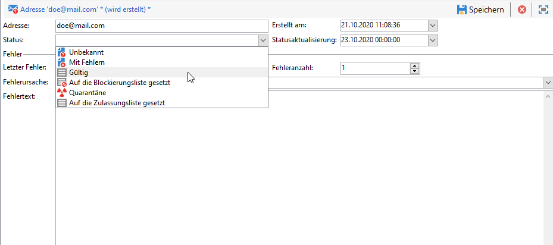

# Funktionsweise der Quarantäneverwaltung{#understanding-quarantine-management}

Adobe Campaign erlaubt die Verwaltung von Quarantäne-Adressen. Empfänger, deren Adresse in Quarantäne ist, werden standardmäßig zum Zeitpunkt der Versandanalyse ausgeschlossen und fließen somit nicht in die Berechnung der Zielgruppe ein. Eine E-Mail-Adresse kann in Quarantäne kommen, weil z. B. das Postfach voll ist oder die Adresse nicht existiert. Nachfolgend werden die Regeln, die eine Quarantäne auslösen, näher erläutert.

>[!NOTE]
>
>Dieser Abschnitt gilt für Online-Kanäle: E-Mail, SMS, Push-Benachrichtigungen.

## Optimieren Ihres Versands durch die Quarantäneverwaltung {#optimizing-your-delivery-through-quarantines}

Die Profile, deren E-Mail-Adressen oder Telefonnummern unter Quarantäne sind, werden während der Nachrichtenvorbereitung automatisch ausgeschlossen (siehe [Identifizieren von für einen Versand in Quarantäne befindlichen Adressen](#identifying-quarantined-addresses-for-a-delivery)). Dies beschleunigt die Zustellung, da sich die Fehlerrate maßgeblich auf die Zustellgeschwindigkeit auswirkt.

Teilweise werden E-Mails von Providern automatisch als Spam eingestuft, wenn die Anzahl ungültiger Adressen zu hoch ist. Durch die Quarantäne können Sie also vermeiden, von diesen Providern auf eine Blockierungsliste gesetzt zu werden.

Zusätzlich helfen Ihnen Quarantänen, die Kosten des SMS-Versands zu senken, indem fehlerhafte Telefonnummern aus dem Versand ausgeschlossen werden.

Weiterführende Informationen zu Best Practices zur Durchführung und Optimierung von Sendungen finden Sie auf [dieser Seite](delivery-best-practices.md).

### Quarantäne vs. Blockierungsliste {#quarantine-vs-denylist}

Die Quarantäne und die Blockierungsliste gelten nicht für dasselbe Objekt:

* Die **Quarantäne** bezieht sich nur auf eine **Adresse** (oder Telefonnummer usw.), nicht aber auf das Profil selbst. Wenn beispielsweise ein Profil mit einer in Quarantäne befindlichen E-Mail-Adresse eine neue Adresse angibt, kann es erneut in Versandzielgruppen aufgenommen werden. Wenn zwei Profile dieselbe Telefonnummer haben, sind sie beide betroffen, wenn die Nummer unter Quarantäne gestellt wird.

  Die unter Quarantäne gestellten Adressen oder Telefonnummern werden in den [Ausschlusslogs](#identifying-quarantined-addresses-for-a-delivery) (für einen Versand) oder in der [Quarantäneliste](#identifying-quarantined-addresses-for-the-entire-platform) (für die gesamte Plattform) angezeigt.

* Die Aufnahme in die **Blockierungsliste** führt dagegen dazu, dass das **Profil** vom Versand ausgeschlossen wird. Dies ist z. B. nach einer Abmeldung (Opt-out) von einem Kanal der Fall. Wenn beispielsweise ein Profil, das auf der Blockierungsliste für den E-Mail-Kanal steht, zwei E-Mail-Adressen hat, werden beide Adressen vom Versand ausgeschlossen.

  Im Abschnitt **[!UICONTROL Nicht mehr kontaktieren]** der Registerkarte **[!UICONTROL Allgemein]** des Profils können Sie überprüfen, ob sich ein Profil auf der Blockierungsliste für einen oder mehrere Kanäle befindet. Weitere Informationen finden Sie in [diesem Abschnitt](../../platform/using/editing-a-profile.md#general-tab).

>[!NOTE]
>
>Die Quarantäne beinhaltet den Status **[!UICONTROL Auf die Blockierungsliste gesetzt]**, der angewendet wird, wenn Empfängerinnen bzw. Empfänger Ihre Nachricht als Spam melden oder auf eine SMS mit einem Keyword wie „STOP“ antworten. In diesem Fall wird die betroffene Adresse oder Telefonnummer des Profils unter Quarantäne gestellt und erhält den Status **[!UICONTROL Auf die Blockierungsliste gesetzt]**. Weiterführende Informationen zur Verwaltung von STOP-SMS-Nachrichten finden Sie in [diesem Abschnitt](../../delivery/using/sms-send.md#processing-inbound-messages).

## Identifizieren von in Quarantäne befindlichen Adressen {#identifying-quarantined-addresses}

Die in Quarantäne befindlichen Adressen können für einen bestimmten Versand oder für die gesamte Plattform angezeigt werden.

### Identifizieren von für einen Versand in Quarantäne befindlichen Adressen {#identifying-quarantined-addresses-for-a-delivery}

Die für einen bestimmten Versand in Quarantäne befindlichen Adressen werden während der Versandvorbereitung in den Versandlogs des Versand-Dashboards angezeigt (siehe [Versandlogs und Versandverlauf](delivery-dashboard.md#delivery-logs-and-history)).

### Identifizieren von für die gesamte Plattform in Quarantäne befindlichen Adressen {#identifying-quarantined-addresses-for-the-entire-platform}

Administratoren können die für die gesamte Plattform in Quarantäne befindlichen Adressen im Knoten **[!UICONTROL Administration > Kampagnenverwaltung > Unzustellbarkeitsverwaltung > Adressen unzustellbarer Sendungen]** anzeigen.

>[!NOTE]
>
>In diesem Menü werden unter Quarantäne gestellte Elemente für die Kanäle **E-Mail**, **SMS** und **Push-Benachrichtigungen** aufgeführt.

Folgende Informationen stehen für jede Adresse zur Verfügung:


>[!NOTE]
>
>Mit zunehmendem Alter der Datenbank steigt auch die Zahl der Adressen in Quarantäne. Wenn man beispielsweise davon ausgeht, dass eine E-Mail-Adresse eine Lebensdauer von etwa drei Jahren hat und die Empfängertabelle pro Jahr um 50 % wächst, lässt sich der Quarantänezuwachs wie folgt berechnen:
>
>Ende 1. Jahr: (1 &#42; 0,33) / (1 + 0,5) = 22 %.
>
Ende 2. Jahr: ((1,22 &#42; 0,33) + 0,33) / (1,5 + 0,75) = 32,5 %.

### Identifizieren von in Quarantäne befindlichen Adressen in Versandberichten {#identifying-quarantined-addresses-in-delivery-reports}

Folgende Berichte enthalten Informationen zu Adressen in Quarantäne:

* Die **[!UICONTROL Versandzusammenfassung]** gibt Aufschluss über die Anzahl der Adressen in Quarantäne in der Zielgruppe. Sie zeigt insbesondere

   * die Adressen, die bei der Versandanalyse ausgeschlossen wurden,

   * die Adressen, die infolge des Versands neu unter Quarantäne gestellt wurden.

* In **[!UICONTROL Fehler und Bounces]** finden sich neben den Informationen bezüglich der Quarantäne-Adressen auch Hinweise auf die Fehlertypen und die Verteilung der Fehler nach Domains.

Diese Informationen stehen für alle Sendungen der Plattform (**[!UICONTROL Startseite > Berichte]**) oder versandspezifisch zur Verfügung. Sie haben auch die Möglichkeit, benutzerdefinierte Berichte zu erstellen und die dort angezeigten Daten Ihren Bedürfnissen entsprechend zu konfigurieren.

### Identifizieren von für einen Empfänger in Quarantäne befindlichen Adressen {#identifying-quarantined-addresses-for-a-recipient}

Sie können den Status der E-Mail-Adresse sämtlicher Empfangenden aufrufen. Wählen Sie dazu das Empfängerprofil aus und klicken Sie auf die Registerkarte **[!UICONTROL Sendungen]**. Sie können für alle Sendungen an diese Empfängerin bzw. diesen Empfänger feststellen, ob beispielsweise die Adresse fehlerhaft war, während der Analyse unter Quarantäne gestellt wurde usw. Sie können für jeden Ordner nur die Empfangenden anzeigen, deren Adresse in Quarantäne ist. Verwenden Sie dazu den Anwendungsfilter **[!UICONTROL E-Mail-Adresse in Quarantäne]**.


## Bedingungen für die Quarantäne von Adressen {#conditions-for-sending-an-address-to-quarantine}

Adobe Campaign verwaltet die Quarantäne je nach dem Typ der fehlgeschlagenen Sendung und dem Grund, der bei der Qualifizierung von Fehlermeldungen zugewiesen wurde (siehe [Qualifizierung von Bounce-Nachrichten](understanding-delivery-failures.md#bounce-mail-qualification) und [Typen und Ursachen für fehlgeschlagene Sendungen](understanding-delivery-failures.md#delivery-failure-types-and-reasons)). 

* **Ignorierter Fehler**: Bei ignorierten Fehlern wird eine Adresse nicht unter Quarantäne gestellt.
* **Hardbounce**: Die E-Mail-Adresse kommt sofort in Quarantäne.
* **Softbounce**: In diesem Fall wird die Adresse nicht sofort unter Quarantäne gestellt, sondern der Fehlerzähler nur hinaufgesetzt. Weitere Informationen hierzu finden Sie unter [Verwaltung von Softbounces](#soft-error-management).

Wenn ein Benutzer eine E-Mail als Spam kennzeichnet ([Feedback Loop](https://experienceleague.adobe.com/docs/deliverability-learn/deliverability-best-practice-guide/transition-process/infrastructure.html?lang=de#feedback-loops)), wird die Nachricht automatisch an ein von Adobe verwaltetes technisches Postfach weitergeleitet. Die E-Mail-Adresse des Benutzers wird dann automatisch unter Quarantäne gestellt und der Status in **[!UICONTROL Auf Blockierungsliste]** geändert. Der Status bezieht sich ausschließlich auf die Adresse und das Profil wird nicht auf die Blockierungsliste gesetzt, sodass der Empfänger nach wie vor SMS-Nachrichten und Push-Benachrichtigungen erhält.

>[!NOTE]
>
Bei der Quarantänefunktion in Adobe Campaign wird die Groß-/Kleinschreibung beachtet. Achten Sie darauf, E-Mail-Adressen in Kleinbuchstaben zu importieren, damit sie später nicht erneut verwendet werden.

Bei Adressen in Quarantäne (siehe [Identifizieren von für die gesamte Plattform in Quarantäne befindlichen Adressen](#identifying-quarantined-addresses-for-the-entire-platform)) zeigt das Feld **[!UICONTROL Fehlerursache]** an, wodurch die Quarantäne ausgelöst wurde.


### Verwaltung von Softbounces {#soft-error-management}

Im Gegensatz zu Hardbounces senden Softbounces eine Adresse nicht sofort in die Quarantäne, sondern erhöhen stattdessen einen Fehlerzähler.

Während der [Versandlaufzeit](../../delivery/using/steps-sending-the-delivery.md#defining-validity-period) werden noch weitere Zustellversuche durchgeführt. Sollte der Zähler eine festgelegte Schwelle überschreiten, wird die Adresse unter Quarantäne gestellt. Weitere Informationen hierzu finden Sie unter [Weitere Zustellversuche nach einem vorübergehend fehlgeschlagenen Versand](understanding-delivery-failures.md#retries-after-a-delivery-temporary-failure).

Der Fehlerzähler wird erneut initialisiert, wenn der letzte signifikante Fehler vor mehr als 10 Tagen aufgetreten ist. Der Status der Adresse wird auf **Gültig** gesetzt und mithilfe des Workflows [Datenbankbereinigung](../../production/using/database-cleanup-workflow.md) wird die Adresse aus der Quarantäneliste gelöscht.


Wenn Sie bei gehosteten oder hybriden Installationen ein Upgrade auf [Enhanced MTA](sending-with-enhanced-mta.md) durchgeführt haben, basiert die maximale Anzahl weiterer Versuche, die im Falle des Status **[!UICONTROL Fehlerhaft]** durchgeführt werden, sowie die Mindestverzögerung zwischen Wiederholungsversuchen jetzt darauf, wie gut eine IP in einer bestimmten Domain sowohl in der Vergangenheit funktioniert hat als auch aktuell funktioniert.

Bei On-Premise-Installationen und gehosteten/hybriden Installationen, die den veralteten Campaign MTA verwenden, können die Anzahl der Fehler und der Zeitraum zwischen zwei Fehlern geändert werden. Ändern Sie dazu die entsprechenden Einstellungen im [Bereitstellungsassistenten](../../installation/using/deploying-an-instance.md) (**[!UICONTROL E-Mail-Kanal]** > **[!UICONTROL Erweiterte Parameter]**) oder [auf Versandebene](../../delivery/using/steps-sending-the-delivery.md#configuring-retries).


## Entfernen einer Adresse aus der Quarantäne {#removing-a-quarantined-address}

### Automatische Aktualisierungen {#unquarantine-auto}

Adressen, die bestimmte Bedingungen erfüllen, werden automatisch durch den [Datenbankbereinigungs](../../production/using/database-cleanup-workflow.md)-Workflow aus der Quarantäneliste gelöscht.

In den folgenden Fällen werden die Adressen automatisch aus der Quarantäneliste entfernt:

* Adressen mit dem Status **[!UICONTROL Fehlerhaft]** werden nach einem erfolgreichen Versand aus der Quarantäneliste entfernt.
* Adressen mit dem Status **[!UICONTROL Fehlerhaft]** werden aus der Quarantäneliste entfernt, wenn der letzte Softbounce mehr als 10 Tage zurückliegt. Weitere Informationen zum Umgang mit Softbounces finden Sie in [diesem Abschnitt](#soft-error-management).
* Adressen mit dem Status **[!UICONTROL Fehlerhaft]**, die mit dem Fehler **[!UICONTROL Postfach voll]** zurückkommen, werden nach 30 Tagen aus der Quarantäneliste entfernt.

Ihr Status ändert sich dann in **[!UICONTROL Gültig]**.

>[!IMPORTANT]
>
Empfängerinnen und Empfänger mit einer Adresse im Status **[!UICONTROL Quarantäne]** oder **[!UICONTROL Auf Blockierungsliste]** werden niemals entfernt, auch wenn sie eine E-Mail erhalten.

### Manuelle Aktualisierungen {#unquarantine-manual}

Sie können die Quarantäne für eine Adresse auch manuell aufheben. Um eine Adresse manuell aus der Quarantäneliste zu entfernen, ändern Sie im Knoten **[!UICONTROL Administration > Kampagnen-Management > Unzustellbarkeitsverwaltung > Adressen unzustellbarer Sendungen]** ihren Status in **[!UICONTROL Gültig]**.



### Massenaktualisierungen {#unquarantine-bulk}

Möglicherweise müssen Sie Massenaktualisierungen auf der Quarantäneliste durchführen, z. B. im Falle eines ISP-Ausfalls. In diesem Fall werden E-Mails fälschlicherweise als Bounce gekennzeichnet, da sie ihren Empfängerinnen und Empfängern nicht erfolgreich zugestellt werden können. Diese Adressen müssen aus der Quarantäneliste entfernt werden.

Erstellen Sie dazu einen Workflow und fügen Sie eine **[!UICONTROL Abfrage]**-Aktivität in Ihrer Quarantänetabelle hinzu, um alle betroffenen Empfängerinnen und Empfänger herauszufiltern. Sobald sie identifiziert sind, können sie aus der Quarantäneliste entfernt und in zukünftige E-Mail-Sendungen in Campaign aufgenommen werden.

Nachfolgend befinden sich die empfohlenen Richtlinien für diese Abfrage:

* Für Campaign Classic v7-Umgebungen mit Regelinformationen für eingehende E-Mails im Feld **[!UICONTROL Fehlertext]** der Quarantäneliste:

   * **Fehlertext (Quarantänetext)** enthält „Momen_Code10_InvalidRecipient“
   * **E-Mail-Domain (@domain)** gleich domain1.com ODER **E-Mail-Domain (@domain)** gleich domain2.com ODER **E-Mail-Domain (@domain)** gleich domain3.com
   * **Statusaktualisierung (@lastModified)** `MM/DD/YYYY HH:MM:SS AM` oder später
   * **Statusaktualisierung (@lastModified)** `MM/DD/YYYY HH:MM:SS PM` oder früher 

* Für Campaign Classic v7-Umgebungen mit SMTP-Bounce-Antwortinformationen im Feld **[!UICONTROL Fehlertext]** der Quarantäneliste:

   * **Fehlertext (Quarantänetext)** enthält „550-5.1.1“ UND **Fehlertext (Quarantänetext)** enthält „support.ISP.com“,

  wobei „support.ISP.com“ zum Beispiel: „support.apple.com“ oder „support.google.com“ sein kann

   * **Statusaktualisierung (@lastModified)** am oder später als `MM/DD/YYYY HH:MM:SS AM`
   * **Statusaktualisierung (@lastModified)** am oder früher als `MM/DD/YYYY HH:MM:SS PM`

Sobald Sie die Liste der betroffenen Empfängerinnen und Empfänger haben, fügen Sie die Aktivität **[!UICONTROL Daten aktualisieren]** hinzu, um den Status der E-Mail-Adressen auf **[!UICONTROL Gültig]** zu setzen, damit sie durch den Workflow **[!UICONTROL Datenbankbereinigung]** aus der Quarantäneliste entfernt werden. Sie können sie auch einfach aus der Quarantänetabelle löschen.

## Quarantäne für Push-Benachrichtigungen {#push-notification-quarantines}

Der Quarantänemechanismus für Push-Benachrichtigungen ist global gesehen mit dem allgemeinen Prozess identisch. Bestimmte Fehler werden jedoch für Push-Benachrichtigungen unterschiedlich verwaltet. Bei bestimmten Soft-Fehlern werden beispielsweise innerhalb desselben Versands keine weiteren Versuche unternommen. Die Besonderheiten bei Push-Benachrichtigungen sind unten aufgeführt. Der Wiederholungsmechanismus (Anzahl weiterer Versuche, Frequenz) entspricht dem für E-Mails.

Bei den unter Quarantäne gestellten Objekten handelt es sich um Device Token.

### Quarantäne bei iOS-Geräten {#ios-quarantine}

Das HTTP/V2-Protokoll ermöglicht für jeden Push-Versand ein direktes Feedback zu dessen Status. Bei Verwendung des Connectors für das HTTP/V2-Protokoll wird der Feedback-Dienst des Workflows **[!UICONTROL mobileAppOptOutMgt]** nicht mehr aufgerufen. Ein Token gilt als abgemeldet, wenn eine Mobile App deinstalliert oder neu installiert wird.

Wenn der APNS für eine Nachricht den Status &quot;abgemeldet&quot; zurückgibt, wird der Ziel-Token direkt unter Quarantäne gestellt.

<table> 
 <tbody> 
  <tr> 
   <td> <strong>Szenario</strong><br /> </td> 
   <td> <strong>Status</strong><br /> </td> 
   <td> <strong>Fehlernachricht</strong><br /> </td> 
   <td> <strong>Typ des Fehlschlagens</strong><br /> </td> 
   <td> <strong>Grund des Fehlschlagens</strong><br /> </td> 
   <td> <strong>Erneut versuchen</strong><br /> </td> 
  </tr> 
  <tr> 
   <td> Zielgerät eingeschaltet<br /> </td> 
   <td> OK<br /> </td> 
   <td> </td> 
   <td> </td> 
   <td> </td> 
   <td> </td> 
  </tr> 
  <tr> 
   <td> Zielgerät ausgeschaltet<br /> </td> 
   <td> OK<br /> </td> 
   <td> </td> 
   <td> </td> 
   <td> </td> 
   <td> </td> 
  </tr> 
  <tr> 
   <td> Empfänger deaktiviert Benachrichtigungen für die Anwendung<br /> </td> 
   <td> OK<br /> </td> 
   <td> </td> 
   <td> </td> 
   <td> </td> 
   <td> </td> 
  </tr> 
  <tr> 
   <td> Nachrichtenerstellung/Analysephase - Nutzdaten zu groß<br /> </td> 
   <td> Fehlgeschlagen<br /> </td> 
   <td> Nutzdaten zu lang<br /> </td> 
   <td> Soft<br /> </td> 
   <td> Zurückgewiesen<br /> </td> 
   <td> Nein<br /> </td> 
  </tr> 
  <tr> 
   <td> Nachrichtenerstellung/Analysephase - Problem mit Inhalt mit unerwartetem Format<br /> </td> 
   <td> Fehlgeschlagen<br /> </td> 
   <td> Verschiedene Fehlernachrichten je nach Fehler<br /> </td> 
   <td> Soft<br /> </td> 
   <td> Unbestimmt<br /> </td> 
   <td> Nein<br /> </td> 
  </tr> 
  <tr> 
   <td> Problem mit Zertifikat (Passwort, Beschädigung etc.) und Fehler bei Testverbindung mit APNS<br /> </td> 
   <td> Fehlgeschlagen<br /> </td> 
   <td> Verschiedene Fehlernachrichten je nach Fehler<br /> </td> 
   <td> Soft<br /> </td> 
   <td> Zurückgewiesen<br /> </td> 
   <td> Nein<br /> </td> 
  </tr> 
  <tr> 
   <td> Netzwerkverbindung während des Versands abgebrochen<br /> </td> 
   <td> Fehlgeschlagen<br /> </td> 
   <td> Verbindungsfehler<br /> </td> 
   <td> Unbestimmt<br /> </td> 
   <td> Unerreichbar<br /> </td> 
   <td> Ja<br /> </td> 
  </tr> 
  <tr> 
   <td> Zurückweisung von APNS-Nachricht: Abmeldung<br /> Benutzer hat die Mobile App entfernt oder das Token ist abgelaufen<br /> </td> 
   <td> Fehlgeschlagen<br /> </td> 
   <td> Abgemeldet<br /> </td> 
   <td> Hard<br /> </td> 
   <td> Unbekannter Nutzer<br /> </td> 
   <td> Nein<br /> </td> 
  </tr> 
  <tr> 
   <td> Zurückweisung von APNS-Nachricht: alle anderen Fehler<br /> </td> 
   <td> Fehlgeschlagen<br /> </td> 
   <td> Der Grund für Zurückweisung wird in der Fehlernachricht angegeben<br /> </td> 
   <td> Soft<br /> </td> 
   <td> Zurückgewiesen<br /> </td> 
   <td> Nein<br /> </td> 
  </tr> 
 </tbody> 
</table>

### Quarantäne bei Android-Geräten {#android-quarantine}

**Für Android V1**

Für jede Benachrichtigung erhält Adobe Campaign die synchronen Fehler direkt vom FCM-Server. Adobe Campaign verarbeitet diese unmittelbar und erstellt Hard- und Softbounces entsprechend der Prioritätsstufe des Fehlers. Es können weitere Zustellversuche vorgenommen werden:

* Nutzdatenlänge überschritten, Verbindungsproblem, Problem mit Dienstverfügbarkeit: Neuversuch wird unternommen, Softbounce, Grund für den Fehler ist **[!UICONTROL Abgelehnt]**.
* Gerätequote überschritten: kein Neuversuch, Softbounce, Grund für Fehler ist **[!UICONTROL Abgelehnt]**.
* Ungültiger oder abgemeldeter Token, unerwarteter Fehler, Problem mit Absenderkonto: kein Neuversuch, Hardbounce, Grund für Fehler ist **[!UICONTROL Abgelehnt]**.

Der Workflow **[!UICONTROL mobileAppOptOutMgt]** läuft alle 6 Stunden, um die Tabelle **AppSubscriptionRcp** zu aktualisieren. Für jedes abgemeldete oder nicht mehr gültige Token wird das Feld **Deaktiviert** auf **Wahr** gesetzt und das mit dem Gerät verknüpfte Abonnement wird automatisch von künftigen Sendungen ausgeschlossen.

Während der Versandanalyse werden alle Geräte, die von der Zielgruppe ausgeschlossen werden, automatisch zur Tabelle **excludeLogAppSubRcp** hinzugefügt.

>[!NOTE]
>
Im Folgenden finden Sie die unterschiedlichen Fehlertypen für den Baidu-Connector:
>
* Verbindungsproblem zu Beginn des Versands: Fehlertyp **[!UICONTROL Undefiniert]**, Grund **[!UICONTROL Unerreichbar]**, Neuversuch wird unternommen.
* Verbindung während des Versands unterbrochen: Softbounce, Grund für den Fehler **[!UICONTROL Abgelehnt]**, Neuversuch wird unternommen.
* Während des Versands von Baidu synchroner Fehler zurückgegeben: Hardbounce, Grund für den Fehler **[!UICONTROL Abgelehnt]**, es wird kein Neuversuch unternommen.
>
Adobe Campaign kontaktiert den Baidu-Server alle 10 Minuten, um den Status der gesendeten Nachricht abzurufen, und aktualisiert die Broadlogs. Wenn eine Nachricht als gesendet gemeldet wird, wird der Status der Nachricht in den Broadlogs auf **[!UICONTROL Erhalten]** festgelegt. Wenn Baidu einen Fehler meldet, wird der Status auf **[!UICONTROL Fehlgeschlagen]** festgelegt.

**Für Android V2**

Der Quarantänemechanismus für Android V2 verwendet denselben Prozess wie für Android V1. Dasselbe gilt für die Aktualisierung von Anmeldungen und Ausschlüssen. Weiterführende Informationen hierzu finden Sie im Abschnitt [Android V1](#android-quarantine).

<table> 
 <tbody> 
  <tr> 
   <td> <strong>Szenario</strong><br /> </td> 
   <td> <strong>Status</strong><br /> </td> 
   <td> <strong>Fehlernachricht</strong><br /> </td> 
   <td> <strong>Typ des Fehlschlagens</strong><br /> </td> 
   <td> <strong>Grund des Fehlschlagens</strong><br /> </td> 
   <td> <strong>Erneut versuchen</strong><br /> </td> 
  </tr> 
  <tr> 
   <td> Nachrichtenerstellung/Analysephase: unzulässige Schlüsselwörter in den benutzerdefinierten Feldern verwendet<br /> </td> 
   <td> Fehlgeschlagen<br /> </td> 
   <td> Folgende Schlüsselwörter dürfen nicht benutzt werden: {1}<br /> </td> 
   <td> Soft<br /> </td> 
   <td> </td> 
   <td> Nein<br /> </td> 
  </tr> 
  <tr> 
   <td> Nachrichtenerstellung/Analysephase: Nutzdaten zu groß<br /> </td> 
   <td> Fehlgeschlagen<br /> </td> 
   <td> Die Benachrichtigung ist zu groß: {1} Bit statt maximal {2}.<br /> </td> 
   <td> Soft<br /> </td> 
   <td> Zurückgewiesen<br /> </td> 
   <td> Nein<br /> </td> 
  </tr> 
  <tr> 
   <td> Netzwerkverbindung während des Versands abgebrochen<br /> </td> 
   <td> Fehlgeschlagen<br /> </td> 
   <td> Keine Antwort von Firebase Cloud Messaging für die Adresse: {1}<br /> </td> 
   <td> Soft<br /> </td> 
   <td> Unerreichbar<br /> </td> 
   <td> Ja<br /> </td> 
  </tr> 
  <tr> 
   <td> Zurückweisung von FCM-Nachricht: Der FCM-Server ist vorübergehend nicht verfügbar (z. B. durch Timeouts). <br /> </td> 
   <td> Fehlgeschlagen<br /> </td> 
   <td> Firebase Cloud Messaging ist zurzeit nicht verfügbar<br /> </td> 
   <td> Soft<br /> </td> 
   <td> Unerreichbar<br /> </td> 
   <td> Ja<br /> </td> 
  </tr> 
  <tr> 
   <td> Zurückweisung von FCM-Nachricht: Fehler bei der Authentifizierung des Absenderkontos<br /> </td> 
   <td> Fehlgeschlagen<br /> </td> 
   <td> Entwicklerkonto konnte nicht identifiziert werden, bitte Kennung und Kennwort prüfen.<br /> </td> 
   <td> Soft<br /> </td> 
   <td> Zurückgewiesen<br /> </td> 
   <td> Nein<br /> </td> 
  </tr> 
  <tr> 
   <td> Zurückweisung von FCM-Nachricht: Gerätequote überschritten<br /> </td> 
   <td> Fehlgeschlagen<br /> </td> 
   <td> </td> 
   <td> Soft<br /> </td> 
   <td> Zurückgewiesen<br /> </td> 
   <td> Ja<br /> </td> 
  </tr> 
  <tr> 
   <td> Zurückweisung von FCM-Nachricht: ungültige Registrierung/nicht registriert<br /> </td> 
   <td> Fehlgeschlagen<br /> </td> 
   <td> </td> 
   <td> Hard<br /> </td> 
   <td> Unbekannter Nutzer<br /> </td> 
   <td> Nein<br /> </td> 
  </tr> 
  <tr> 
   <td> Zurückweisung von FCM-Nachricht: alle anderen Fehler<br /> </td> 
   <td> Fehlgeschlagen<br /> </td> 
   <td> Der Firebase Cloud Messaging Server hat einen unerwarteten Fehlercode ausgegeben: {1} </td> 
   <td> </td> 
   <td> Zurückgewiesen<br /> </td> 
   <td> Nein<br /> </td> 
  </tr> 
    <tr> 
   <td> Zurückweisung von FCM-Nachricht: ungültiges Argument<br /> </td> 
   <td> Fehlgeschlagen<br /> </td> 
   <td> INVALID_ARGUMENT </td> 
   <td> Ignoriert</td> 
   <td> Unbestimmt<br /> </td> 
   <td> Nein<br /> </td> 
  </tr>
    <tr> 
   <td> Zurückweisung von FCM-Nachricht: Authentifizierungsfehler bei Drittanbieter<br /> </td> 
   <td> Fehlgeschlagen<br /> </td> 
   <td> THIRD_PARTY_AUTH_ERROR </td> 
   <td> Ignoriert</td>
   <td> Zurückgewiesen<br /> </td> 
   <td> Ja<br /> </td> 
  </tr>
    <tr> 
   <td> Zurückweisung von FCM-Nachricht: Sender ID stimmt nicht überein<br /> </td> 
   <td> Fehlgeschlagen<br /> </td> 
   <td> SENDER_ID_MISMATCH </td> 
   <td> Soft</td>
   <td> Unbekannter Nutzer<br /> </td> 
   <td> Nein<br /> </td> 
  </tr>
    <tr> 
   <td> Zurückweisung von FCM-Nachricht: abgemeldet<br /> </td> 
   <td> Fehlgeschlagen<br /> </td>
   <td> UNREGISTERED </td> 
   <td> Hard</td> 
   <td> Unbekannter Nutzer<br /> </td> 
   <td> Nein<br /> </td> 
  </tr>
    <tr> 
   <td> Zurückweisung von FCM-Nachricht: intern<br /> </td> 
   <td> Fehlgeschlagen<br /> </td> 
   <td> INTERNAL </td> 
   <td> Ignoriert</td> 
   <td> Zurückgewiesen<br /> </td> 
   <td> Ja<br /> </td> 
  </tr>
    <tr> 
   <td> Zurückweisung von FCM-Nachricht: nicht verfügbar<br /> </td> 
   <td> Fehlgeschlagen<br /> </td> 
   <td> UNAVAILABLE</td> 
   <td> Ignoriert</td> 
   <td> Zurückgewiesen<br /> </td> 
   <td> Ja<br /> </td> 
  </tr>
    <tr> 
   <td> Zurückweisung von FCM-Nachricht: unerwarteter Fehlercode<br /> </td> 
   <td> Fehlgeschlagen<br /> </td> 
   <td> Unerwarteter Fehlercode</td> 
   <td> Ignoriert</td> 
   <td> Zurückgewiesen<br /> </td> 
   <td> Nein<br /> </td> 
  </tr>
  <tr> 
   <td> Authentifizierung: Verbindungsproblem<br /> </td> 
   <td> Fehlgeschlagen<br /> </td> 
   <td> Verbindung zum Authentifizierungs-Server nicht möglich </td> 
   <td> Ignoriert</td>
   <td> Zurückgewiesen<br /> </td> 
   <td> Ja<br /> </td> 
  </tr>
    <tr> 
   <td> Authentifizierung: Nicht autorisierter Client oder Perimeter in Anfrage.<br /> </td> 
   <td> Fehlgeschlagen<br /> </td> 
   <td> unauthorized_client </td> 
   <td> Ignoriert</td>
   <td> Zurückgewiesen<br /> </td> 
   <td> Nein<br /> </td> 
  </tr>
    <tr> 
   <td> Authentifizierung: Der Client ist nicht berechtigt, Zugriffs-Token mit dieser Methode abzurufen, oder der Client ist für keinen der angeforderten Perimeter autorisiert.<br /> </td> 
   <td> Fehlgeschlagen<br /> </td> 
   <td> unauthorized_client </td> 
   <td> Ignoriert</td>
   <td> Zurückgewiesen<br /> </td> 
   <td> Nein<br /> </td> 
  </tr>
    <tr> 
   <td> Authentifizierung: Zugriff verweigert<br /> </td> 
   <td> Fehlgeschlagen<br /> </td>
   <td> access_denied</td> 
   <td> Ignoriert</td>
   <td> Zurückgewiesen<br /> </td> 
   <td> Nein<br /> </td> 
  </tr>
    <tr> 
   <td> Authentifizierung: ungültige E-Mail-Adresse<br /> </td> 
   <td> Fehlgeschlagen<br /> </td> 
   <td> invalid_grant </td> 
   <td> Ignoriert</td> 
   <td> Zurückgewiesen<br /> </td> 
   <td> Nein<br /> </td> 
  </tr>
    <tr> 
   <td> Authentifizierung: ungültiger JWT<br /> </td> 
   <td> Fehlgeschlagen<br /> </td> 
   <td> invalid_grant </td> 
   <td> Ignoriert</td> 
   <td> Zurückgewiesen<br /> </td> 
   <td> Nein<br /> </td> 
  </tr>
    <tr> 
   <td> Authentifizierung: ungültige JWT-Signatur<br /> </td> 
   <td> Fehlgeschlagen<br /> </td> 
   <td> invalid_grant </td> 
   <td> Ignoriert</td> 
   <td> Zurückgewiesen<br /> </td> 
   <td> Nein<br /> </td> 
  </tr>
    <tr> 
   <td> Authentifizierung: ungültiger OAuth-Perimeter oder ungültige ID-Token-Zielgruppe angegeben<br /> </td> 
   <td> Fehlgeschlagen<br /> </td> 
   <td> unauthorized_client</td> 
   <td> Ignoriert</td> 
   <td> Zurückgewiesen<br /> </td> 
   <td> Nein<br /> </td> 
  </tr>
    <tr> 
   <td> Authentifizierung: OAuth-Client deaktiviert<br /> </td> 
   <td> Fehlgeschlagen<br /> </td> 
   <td> disabled_client</td> 
   <td> Ignoriert</td> 
   <td> Zurückgewiesen<br /> </td> 
   <td> Nein<br /> </td> 
  </tr>
 </tbody> 
</table>

## Quarantäne für SMS {#sms-quarantines}

**Für Standard-Connectoren**

Der Quarantänemechanismus für SMS-Nachrichten ist global gesehen mit dem allgemeinen Prozess identisch. Näheres dazu erfahren Sie unter [Über Quarantänen](#about-quarantines). Die Besonderheiten bei SMS-Nachrichten sind unten aufgeführt.

>[!NOTE]
>
Die Tabelle **[!UICONTROL Versandlogqualifizierung]** gilt nicht für den Connector **Erweitertes allgemeines SMPP**.

<table> 
 <tbody> 
  <tr> 
   <td> <strong>Szenario</strong><br /> </td> 
   <td> <strong>Status</strong><br /> </td> 
   <td> <strong>Fehlernachricht</strong><br /> </td> 
   <td> <strong>Typ des Fehlschlagens</strong><br /> </td> 
   <td> <strong>Grund des Fehlschlagens</strong><br /> </td> 
  </tr> 
  <tr> 
   <td> An Anbieter gesendet<br /> </td> 
   <td> Gesendet<br /> </td> 
   <td> </td> 
   <td> </td> 
   <td> </td> 
  </tr> 
  <tr> 
   <td> Auf Mobiltelefon erhalten<br /> </td> 
   <td> Erhalten<br /> </td> 
   <td> </td> 
   <td> </td> 
   <td> </td> 
  </tr> 
  <tr> 
   <td> Fehler von Provider gemeldet<br /> </td> 
   <td> Fehlgeschlagen<br /> </td> 
   <td> Fehler beim Abrufen von Daten (SR oder MO)<br /> </td> 
   <td> Soft<br /> </td> 
   <td> Unerreichbar<br /> </td> 
  </tr> 
  <tr> 
   <td> Ungültige MT-Quittierung<br /> </td> 
   <td> Fehlgeschlagen<br /> </td> 
   <td> Fehler '{1}' bei der Verarbeitung des Empfangsbestätigungs-Frames eines Sendeauftrags<br /> </td> 
   <td> Soft<br /> </td> 
   <td> Unerreichbar<br /> </td> 
  </tr> 
  <tr> 
   <td> Fehler beim Senden von MT<br /> </td> 
   <td> Fehlgeschlagen<br /> </td> 
   <td> Fehler beim Senden der Nachrichten<br /> </td> 
   <td> Soft<br /> </td> 
   <td> Unerreichbar<br /> </td> 
  </tr> 
 </tbody> 
</table>

**Für den Connector für erweitertes allgemeines SMPP**

Bei der Verwendung des SMPP-Protokolls zum Versand von SMS-Nachrichten werden Fehler anders gehandhabt. Weiterführende Informationen zum Connector für erweitertes allgemeines SMPP finden Sie auf [dieser Seite](sms-set-up.md#creating-an-smpp-external-account).

Der SMPP-Connector ruft Daten aus der zurückgegebenen SR (Status Report)-Meldung mithilfe regulärer Ausdrücke (Regexes) ab, um den Inhalt zu filtern. Diese Daten werden dann mit den Informationen in der Tabelle **[!UICONTROL Versandlogqualifizierung]** abgeglichen (verfügbar über das Menü **[!UICONTROL Administration]** > **[!UICONTROL Kampagnen-Management]** > **[!UICONTROL Unzustellbarkeitsverwaltung]**).

Bevor ein neuer Fehlertyp qualifiziert wird, wird der Fehlergrund immer standardmäßig auf **Abgelehnt** gesetzt.

>[!NOTE]
>
Die Typen und Ursachen für Fehlschläge sind dieselben wie für E-Mails. Siehe [Typen und Ursachen für fehlgeschlagene Sendungen](understanding-delivery-failures.md#delivery-failure-types-and-reasons).
>
Erkundigen Sie sich bei Ihrem Provider nach einer Liste mit Status- und Fehlercodes, um in der Versandlogqualifizierungs-Tabelle die korrekten Fehlertypen und -ursachen anzugeben.

Beispiel einer generierten Nachricht:

```
SR Generic DELIVRD 000|#MESSAGE#
```

* Alle Fehlernachrichten beginnen mit **SR**, sodass SMS-Fehlercodes von E-Mail-Fehlercodes unterschieden werden können.
* Der zweite Teil der Fehlernachricht (in diesem Beispiel **Generic**) bezieht sich auf den Namen der SMSC-Implementierung entsprechend der Definition im Feld **[!UICONTROL Name der SMSC-Implementierung]** des externen SMS-Kontos. Weitere Informationen finden Sie auf [dieser Seite](sms-set-up.md#creating-an-smpp-external-account).

  Da derselbe Fehlercode bei jedem Provider eine andere Bedeutung haben kann, sehen Sie in diesem Feld, welcher Provider den Fehlercode erstellt hat. Den Fehler können Sie dann in der entsprechenden Dokumentation des Providers einsehen.

* Der dritte Teil der Fehlernachricht (in diesem Beispiel **DELIVRD**) entspricht dem Statuscode, der von der Empfangsbestätigung unter Verwendung des – im externen SMS-Konto definierten – regulären Ausdruck zur Statusextraktion abgerufen wurde.

  Dieser reguläre Ausdruck ist im Tab **[!UICONTROL SMSC-Besonderheiten]** des externen Kontos spezifiziert. Weitere Informationen finden Sie auf [dieser Seite](sms-set-up.md#creating-an-smpp-external-account).

  

  Standardmäßig erfolgt die Regex-Extraktion des **stat:**-Felds entsprechend der Definition im Bereich **Appendix B** der **SMPP 3.4-Spezifikation**.

* Der vierte Teil der Fehlernachricht (in diesem Beispiel **000**) entspricht dem Fehlercode, der von der Empfangsbestätigung unter Verwendung des im externen SMS-Konto definierten regulären Ausdrucks zur Fehlercode-Extraktion extrahiert wurde.

  Dieser reguläre Ausdruck ist im Tab **[!UICONTROL SMSC-Besonderheiten]** des externen Kontos spezifiziert. Weitere Informationen finden Sie auf [dieser Seite](sms-set-up.md#creating-an-smpp-external-account).

  Standardmäßig erfolgt die Regex-Extraktion des **err:**-Felds entsprechend der Definition im Bereich **Anhang B** der **SMPP 3.4-Spezifikation**.

* Alles, was hinter dem senkrechten Strich (|) steht, wird nur in der Spalte **[!UICONTROL Erster Text]** der Tabelle **[!UICONTROL Versandlogqualifizierung]** angezeigt. Dieser Inhalt wird immer durch **#MESSAGE#** ersetzt, nachdem die Nachricht normalisiert wurde. Dadurch wird verhindert, dass mehrere Einträge für ähnliche Fehler vorliegen, und der Prozess ist mit dem für E-Mails identisch. Weitere Informationen hierzu finden Sie unter [Bounce-Message-Qualifizierung](understanding-delivery-failures.md#bounce-mail-qualification).

Der Connector für erweitertes allgemeines SMPP wendet eine Heuristik an, um sinnvolle Standardwerte zu finden: Ein mit **DELIV** beginnender Status wird als erfolgreich bewertet, da dies den üblicherweise von Providern verwendeten Statuswerten **DELIVRD** oder **DELIVERED** entspricht. Alle anderen Statuswerte verursachen einen Hardbounce.
