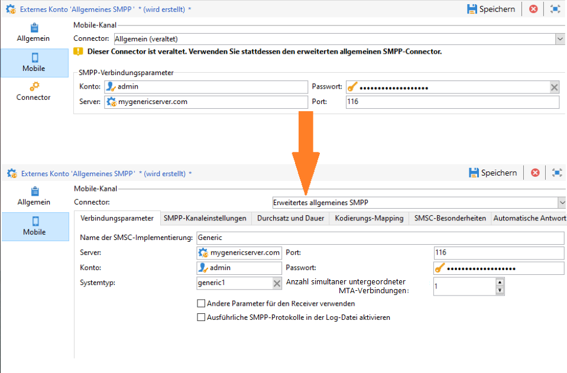
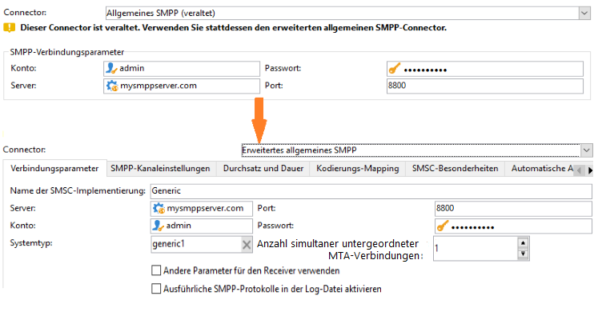
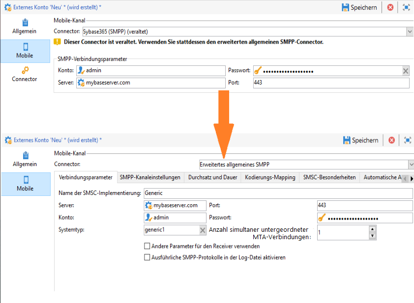
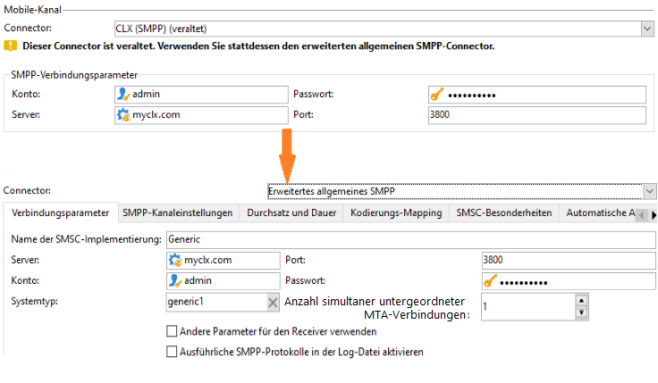

# Migrieren von nicht unterstützten SMS-Connectors zum erweiterten generischen SMPP-Connector{#unsupported-connector-migration}

Ab Version 20.2 werden ältere Connectors nicht mehr unterstützt. Mit diesem Dokument können Sie Connectors migrieren, die weiterhin auf dem alten System ausgeführt werden, und den empfohlenen SMPP-Anschluss verwenden.

>[!CAUTION]
>
>Diese Migration ist nicht obligatorisch, wird jedoch von der Adobe empfohlen und stellt sicher, dass Sie mit der neuesten unterstützten Softwareversion arbeiten.

## Info zu SMS-Connectors {#about-sms-connectors}

Die folgenden Connectors werden ab Version 20.2 nicht mehr unterstützt:

* **[!UICONTROL Generisches SMPP]**  (SMPP Version 3.4 unterstützt Binärmodus)
* **[!UICONTROL Sybase365]** (SAP SMS 365)
* **[!UICONTROL CLX Communications]**
* **[!UICONTROL Tele2]**
* **[!UICONTROL O2]**
* **[!UICONTROL iOS]**

Veraltete Funktionen sind weiterhin verfügbar und werden unterstützt, sie werden jedoch nicht weiter verbessert. Es wird empfohlen, den Connector **[!UICONTROL Erweitertes allgemeines SMPP]** zu verwenden.

Weitere Informationen zu veralteten und entfernten Funktionen finden Sie auf dieser [Seite](../../rn/using/deprecated-features.md).

Alte SMS-Connectors verwenden den Java SMS-Connector, der den Webprozess überlädt. Durch die Migration auf den neuen Connector **[!UICONTROL Erweitertes generisches SMPP]** wird diese Last auf das MTA verschoben, das sie unterstützen kann.

## Migration zum Extended Generic SMPP Connector {#migrating-extended-generic-smpp}

>[!CAUTION]
>
>Auch wenn Sie die Parameter implementieren können, müssen Sie bei der Konfiguration des Connectors **[!UICONTROL Erweitertes generisches SMPP]** mit Ihrem Provider sprechen, der Ihnen die Informationen gibt, die zum Ausfüllen der übrigen Parameter erforderlich sind. Weiterführende Informationen hierzu finden Sie auf dieser [Seite](../../delivery/using/sms-protocol.md).

Zunächst müssen Sie ein neues generisches **[!UICONTROL Extended SMPP]**-Externe Konto erstellen und dann möglicherweise einige der Parameter implementieren. Die detaillierten Schritte finden Sie auf dieser [Seite](../../delivery/using/sms-channel.md#creating-an-smpp-external-account).

Sie müssen nun die Parameter aus dem Register **[!UICONTROL Mobil]** Ihres neu erstellten **[!UICONTROL Erweiterten generischen SMPP]**-Externen Kontos entsprechend Ihrem vorherigen Connector ausfüllen.

### Über den generischen Connector {#from-generic-connector}

Bei Auswahl des Connectors **[!UICONTROL Generisch]** sollten Sie über einen benutzerdefinierten JavaScript-Connector verfügen, der sich an jede Situation anpasst.

Wenn Sie wissen, dass dieser Connector bereits das SMPP-Protokoll verwendet, können Sie zum **[!UICONTROL Extended Generic SMPP]** Connector migrieren. Falls nicht, fragen Sie Ihren Anbieter, ob er das SMPP-Protokoll unterstützt, und richten Sie mithilfe eines Beraters einen neuen Connector ein.

Von Ihrem **[!UICONTROL Generic]** Connector können Sie in Ihr neu erstelltes **[!UICONTROL Extended SMPP]**-Konto übertragen:

Auf der Registerkarte **[!UICONTROL Verbindungseinstellungen]**:

* **[!UICONTROL Konto]**
* **[!UICONTROL Passwort]**
* **[!UICONTROL Server]**
* **[!UICONTROL Port]**

### Aus dem generischen SMPP-Anschluss {#from-generic-smpp-connector}

Sie können aus Ihrem **[!UICONTROL Generic SMPP]**-Connector in Ihr neu erstelltes **[!UICONTROL Extended SMPP]**-Konto übertragen:

Auf der Registerkarte **[!UICONTROL Verbindungseinstellungen]**:

* **[!UICONTROL Konto]**
* **[!UICONTROL Passwort]**
* **[!UICONTROL Server]**
* **[!UICONTROL Port]**
* **[!UICONTROL Systemtyp]**

Auf der Registerkarte **[!UICONTROL SMPP Kanal Settings]**:

* **[!UICONTROL Anrufernummer]**
* **[!UICONTROL Anrufer-NPI]**
* **[!UICONTROL Empfänger-NPI]**
* **[!UICONTROL Anrufer-TON]**
* **[!UICONTROL Empfänger-TON]**

Auf der Registerkarte **[!UICONTROL Zuordnung der Kodierung]**:

* **[!UICONTROL Ausgehende SMS-Kodierung]**

Auf der Registerkarte **[!UICONTROL SMSC-Eigenschaften]**:

* **[!UICONTROL Code beim]** Senden entspricht dem  **[!UICONTROL ID-Format in MT-Bestätigung]**
* **[!UICONTROL Code beim]** Empfang entspricht dem  **[!UICONTROL ID-Format im SR]**

### Vom Sybase365-Connector {#from-sybase}

Von Ihrem **[!UICONTROL Sybase365]**-Connector aus können Sie das neu erstellte **[!UICONTROL Extended SMPP]**-Konto in Ihr neu erstelltes  übertragen:

Auf der Registerkarte **[!UICONTROL Verbindungseinstellungen]**:

* **[!UICONTROL Konto]**
* **[!UICONTROL Passwort]**
* **[!UICONTROL Server]**
* **[!UICONTROL Port]**
* **[!UICONTROL Systemtyp]**

### Von CLX Connector {#from-clx}

Vom **[!UICONTROL CLX]**-Connector aus können Sie das neu erstellte **[!UICONTROL Extended SMPP]**-Konto in Ihr neu erstelltes -Konto übertragen:

Auf der Registerkarte **[!UICONTROL Verbindungseinstellungen]**:

* **[!UICONTROL Konto]**
* **[!UICONTROL Passwort]**
* **[!UICONTROL Server]**
* **[!UICONTROL Port]**
* **[!UICONTROL Systemtyp]**

Auf der Registerkarte **[!UICONTROL SMPP Kanal Settings]**:

* **[!UICONTROL Anrufernummer]**

Auf der Registerkarte **[!UICONTROL SMSC-Eigenschaften]**:

* **[!UICONTROL Code beim]** Senden entspricht dem  **[!UICONTROL ID-Format in MT-Bestätigung]**
* **[!UICONTROL Code beim]** Empfang entspricht dem  **[!UICONTROL ID-Format im SR]**

### Über den Tele2-Anschluss {#from-tele2}

Von Ihrem **[!UICONTROL Tele2]**-Connector können Sie auf Ihr neu erstelltes **[!UICONTROL Extended SMPP]**-Konto übertragen:

Auf der Registerkarte **[!UICONTROL Verbindungseinstellungen]**:

* **[!UICONTROL Konto]**
* **[!UICONTROL Passwort]**
* **[!UICONTROL Server]**
* **[!UICONTROL Port]**
* **[!UICONTROL Systemtyp]**

Auf der Registerkarte **[!UICONTROL SMPP Kanal Settings]**:

* **[!UICONTROL Anrufernummer]**
* **[!UICONTROL Anrufer-NPI]**
* **[!UICONTROL Empfänger-NPI]**
* **[!UICONTROL Anrufer-TON]**

Auf der Registerkarte **[!UICONTROL Zuordnung der Kodierung]**:

* **[!UICONTROL Ausgehende SMS-Kodierung]**

### Vom O2-Anschluss {#from-O2}

Von Ihrem **[!UICONTROL O2]**-Connector können Sie in Ihr neu erstelltes **[!UICONTROL Extended SMPP]**-Konto übertragen:

Auf der Registerkarte **[!UICONTROL Verbindungseinstellungen]**:

* **[!UICONTROL Konto]**
* **[!UICONTROL Passwort]**
* **[!UICONTROL Server]**
* **[!UICONTROL Port]**
* **[!UICONTROL Systemtyp]**

Auf der Registerkarte **[!UICONTROL SMPP Kanal Settings]**:

* **[!UICONTROL Anrufernummer]**
* **[!UICONTROL Anrufer-NPI]**
* **[!UICONTROL Empfänger-NPI]**
* **[!UICONTROL Anrufer-TON]**
* **[!UICONTROL Empfänger-TON]**