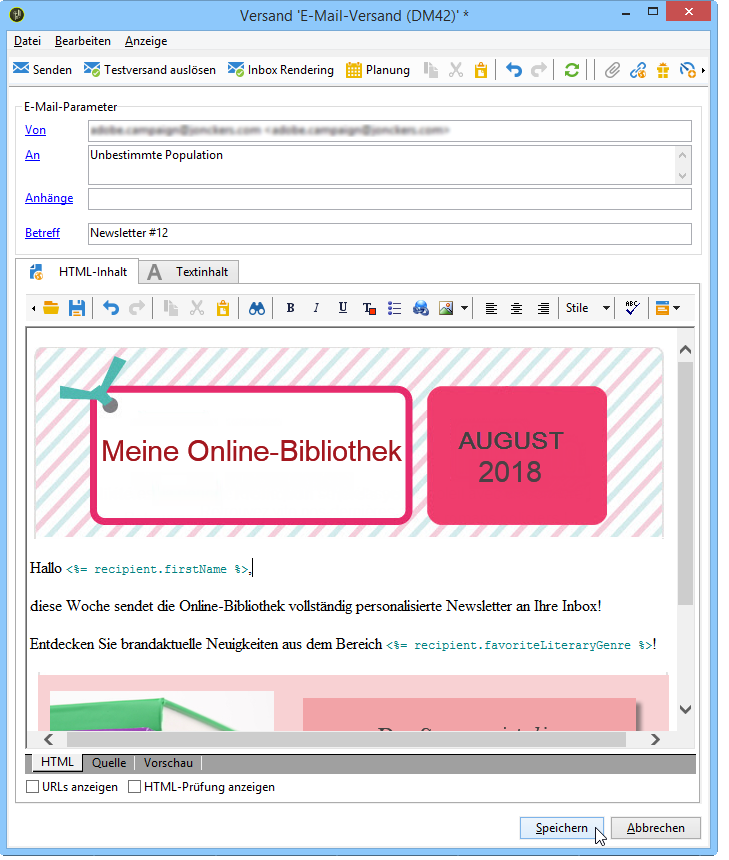
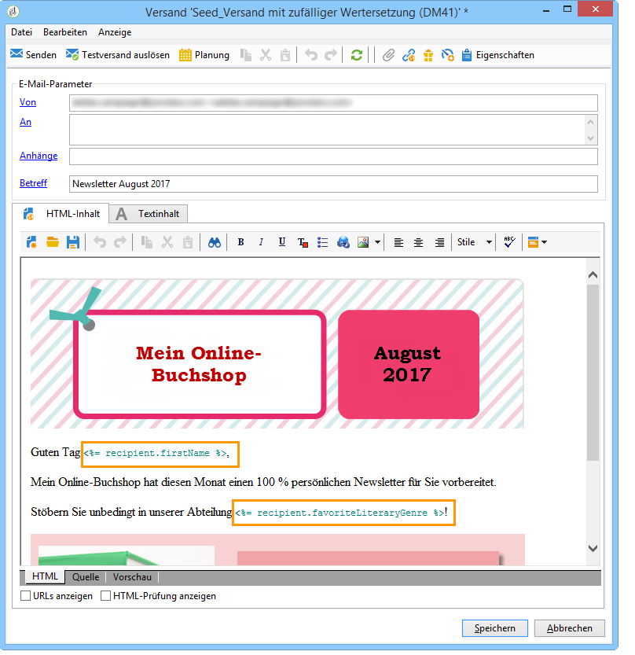
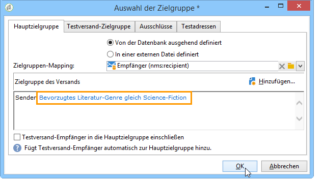
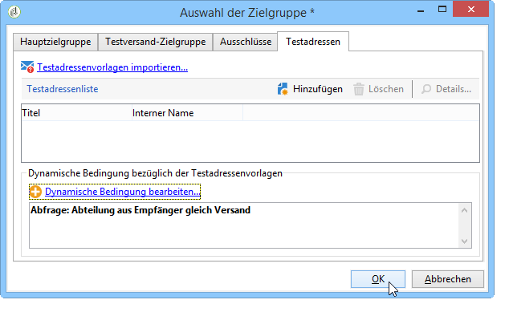
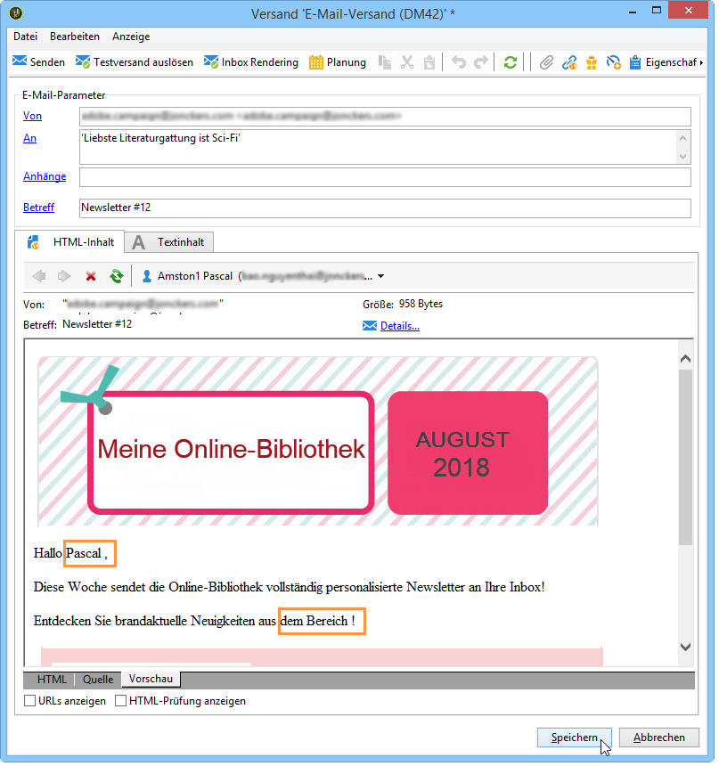
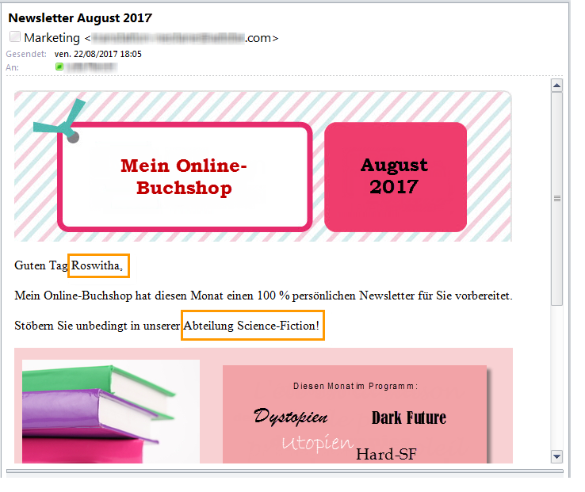

# Anwendungsbeispiel: Wertersetzung konfigurieren{#use-case-configuring-the-field-substitution}

Die zufällige Ersetzung von Werten bietet die Möglichkeit, fehlende Werte in Testadressen durch aus der Empfängertabelle stammende Werte zu ersetzen, falls diese in einem Versand benutzt werden (z. B. Name, Stadt usw.).

Auf diese Weise ist es nicht erforderlich, jede Testadresse manuell zu ergänzen. Stattdessen werden Werte aus der für den Versand vorgesehenen Empfängerliste willkürlich ausgewählt und den Testadressen zugewiesen.

## Kontext {#context}

In diesem Anwendungsbeispiel versendet die Webseite **Mein Online-Buchshop** je nach bevorzugtem Genre verschiedene Rabattangebote an seine Kunden.

Der versandverantwortliche Benutzer hat in die E-Mail ein Personalisierungsfeld eingefügt, das dieser Bedingung Rechnung trägt. Der Versand soll auch an Testadressen geschickt werden. In der Tabelle der Testadressen ist das Personalisierungsfeld enthalten, es wurden jedoch keine Werte gespeichert.

Zur Verwendung der zufälligen Wertersetzung benötigen Sie:

* einen Versand mit einem oder mehreren Personalisierungsfeldern,
* Testadressen, deren **Datenschema** um die im Versand verwendeten Personalisierungsfelder erweitert wurde.

## Versanderstellung {#step-1---creating-a-delivery}

Die Schritte zum Erstellen eines Versands finden Sie im Abschnitt [E-Mail-Versand erstellen](../../delivery/using/creating-an-email-delivery.md).

Im vorliegenden Beispiel wurde der unten gezeigte Newsletter erstellt :



## Testadressen-Schema erweitern {#editing-the-seed-addresses-data-schema}

Die einzelnen Schritte der Schemaerweiterung werden im Abschnitt beschrieben.

Im vorliegenden Beispiel übernimmt das Testadressen-Schema einen im Datenschema der Empfänger erstellten Wert:

```
 <attribute label="Favorite literary genre" length="80" name="favoriteLiteraryGenre"
               type="string" userEnum="favoriteLiteraryGenre"/>
```

Diese Auflistung ermöglicht es dem Benutzer, das bevorzugte literarische Genre der Kunden anzugeben.

Damit diese Änderung des Datenschemas im **Eingabeformular** für Testadressen angezeigt werden kann, müssen Sie es aktualisieren. Weitere Informationen finden Sie im Abschnitt [Testadressen-Formular aktualisieren](../../delivery/using/use-case--selecting-seed-addresses-on-criteria.md#updating-the-input-form).

## Personalisierung konfigurieren {#configuring-personalization}

1. Öffnen Sie den zuvor erstellten Versand.

   In unserem Beispiel weist der Versand zwei Personalisierungsfelder auf: den **Vornamen** des Empfängers und sein **bevorzugtes Genre**.

   

1. Konfigurieren Sie Ihre Versandliste und die Testadressen. Siehe [Zielpopulationen identifizieren](../../delivery/using/steps-defining-the-target-population.md).

   Im vorliegenden Beispiel soll der Versand an alle Kunden mit dem bevorzugten Genre **Science-Fiction** adressiert werden.

   

   Außerdem werden über eine dynamische Bedingung Testadressen hinzugefügt.

   

   >[!NOTE]
   >
   >Weitere Informationen zum Link **[!UICONTROL Dynamische Bedingung bearbeiten...]** finden Sie unter [Anwendungsbeispiel: Auswahl von Testadressen nach Kriterien](../../delivery/using/use-case--selecting-seed-addresses-on-criteria.md).

1. Klicken Sie auf den **[!UICONTROL Vorschau]**-Tab und wählen Sie eine Testadresse aus, um die Personalisierung zu testen.

   

   Eines der beiden Personalisierungsfelder bleibt leer. Da die Testadresse keinen Wert im entsprechenden Feld aufweist, wird in der HTML-Vorschau kein Wert angezeigt.

   Die zufällige Wertersetzung erfolgt erst **zum Zeitpunkt der Absendung**.

1. Klicken Sie auf die Schaltfläche **[!UICONTROL Senden]**.
1. Analysieren Sie den Versand und klicken Sie auf **Absendung bestätigen**.

   Bei Eingang des Versands im Postfach wurde bei den Testadressen-Empfängern der Wert wie gewünscht ersetzt.

   Alle Felder wurden korrekt personalisiert.

   
