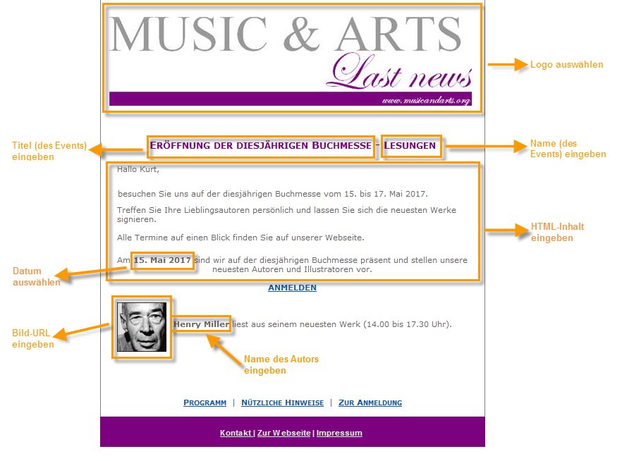
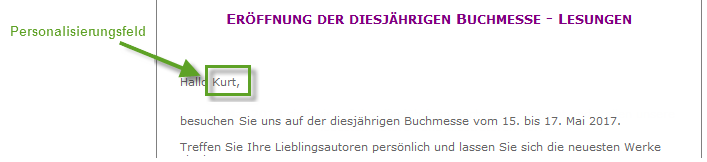
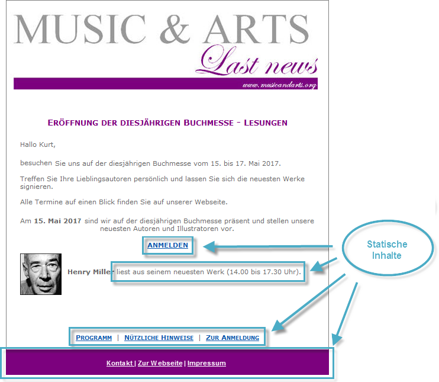
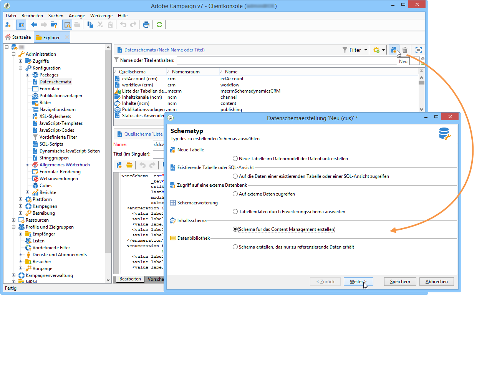
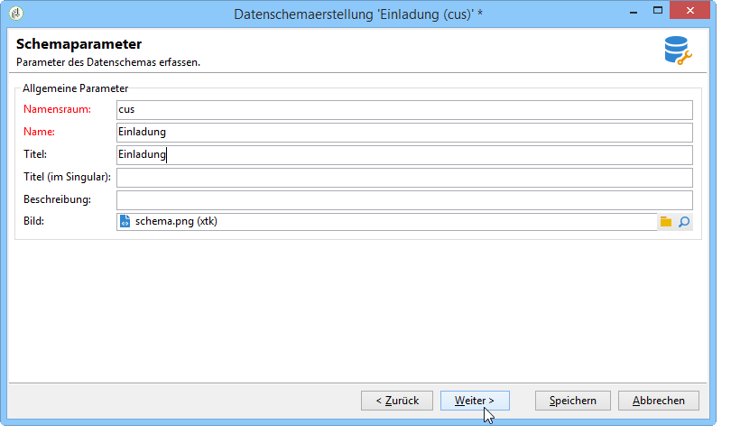
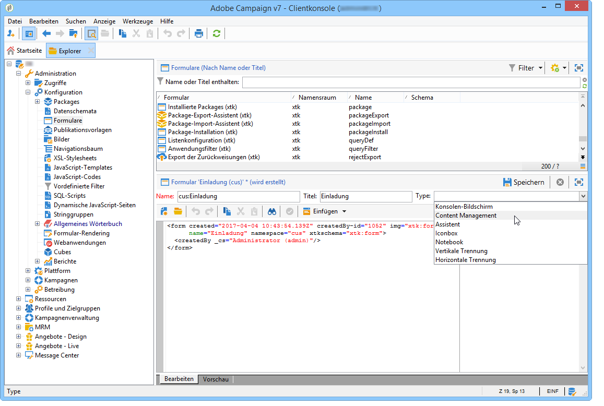
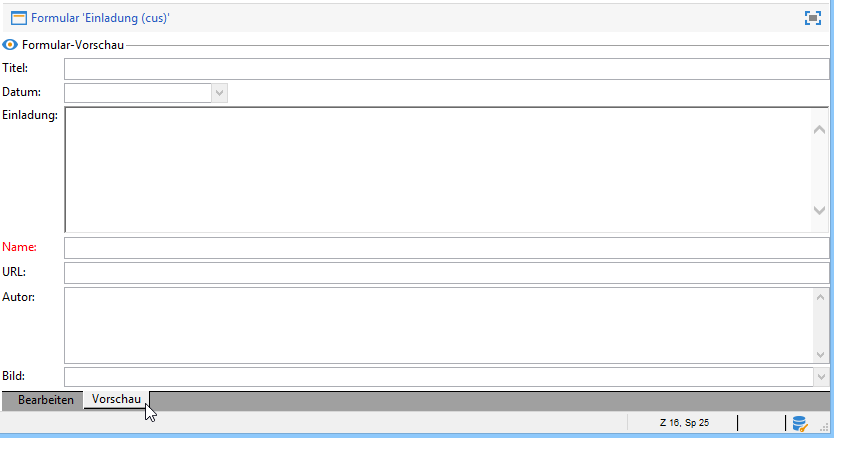
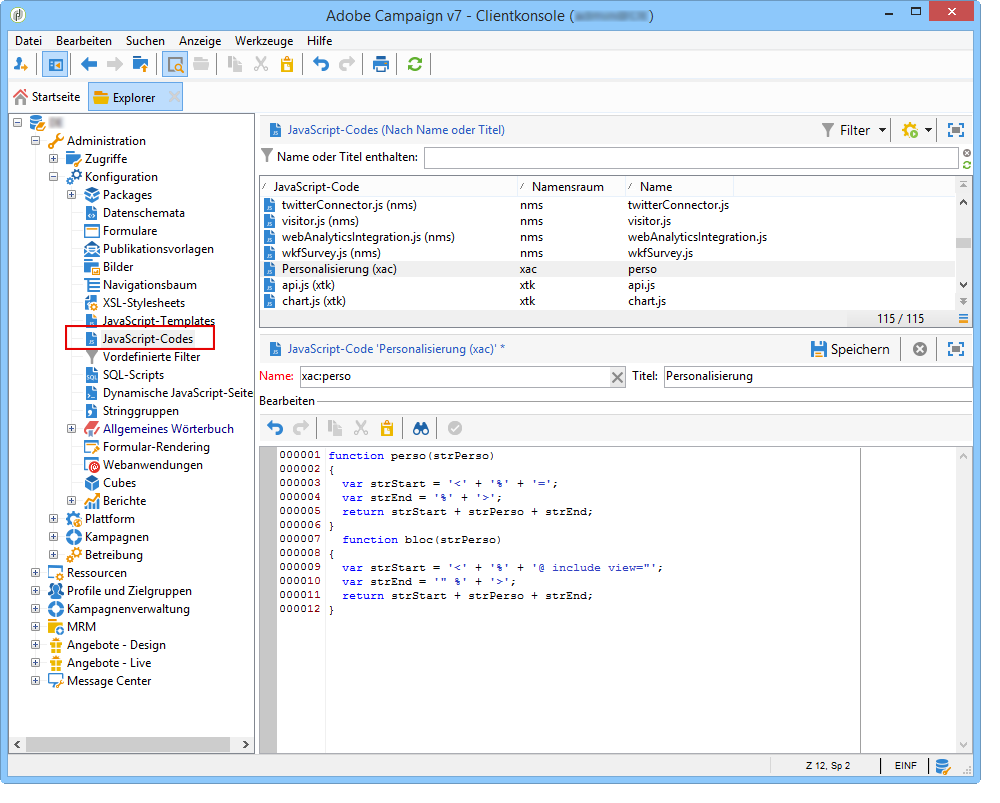
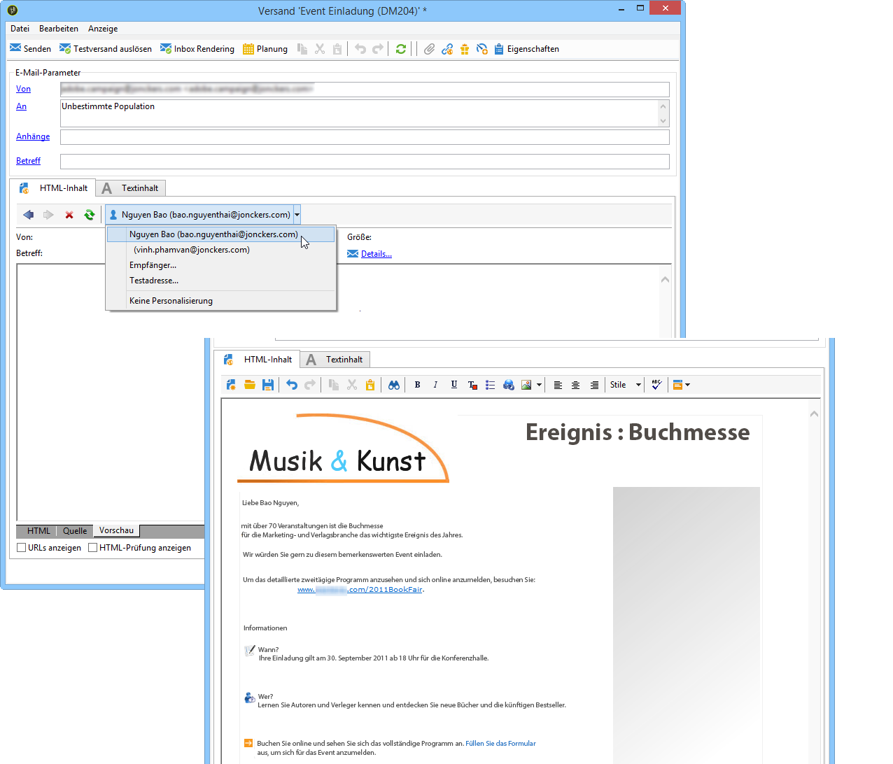

# Anwendungsbeispiele: Verwenden des Content Managements{#use-case-creating-content-management}

Folgende Schritte sind zur Verwendung des Content Managements zu durchlaufen:

* [1. Schritt - Anforderungsanalyse bezüglich des zu erstellenden Inhalts](#step-1---analyzing-the-content-to-be-produced),
* [2. Schritt - Erstellung des Datenschemas](#step-2---creating-the-data-schema),
* [3. Schritt - Erstellung des Formulars](#step-3---creating-the-input-form),
* [4. Schritt - Erstellung der Umwandlungsvorlagen](#step-4---creating-the-construction-template),
* [5. Schritt - Erstellung der Publikationsvorlage](#step-5---creating-the-publication-template),
* [6. Schritt - Erstellung des Inhalts](#step-6---creating-contents).

## 1. Schritt - Anforderungsanalyse bezüglich des zu erstellenden Inhalts {#step-1---analyzing-the-content-to-be-produced}

Zu Beginn sollten Sie genauestens analysieren, welche Art von Inhalten zu erstellen ist, d. h. die anzuzeigenden Elemente und ihre Typen bestimmen, mögliche diesbezügliche Einschränkungen identifizieren usw. Dabei gilt es, statische und variable Inhaltselemente zu unterscheiden.

In folgendem Beispiel soll ein Newsletter im HTML-Format mit folgendem Inhalt erstellt werden:


Dieser Newsletter enthält drei verschiedene Elementtypen:

1. Variable Elemente, deren Inhalt vom Benutzer zum Zeitpunkt der Versanderstellung über ein Formular erfasst oder ausgewählt wird.

   

1. Personalisierungsfelder, die dynamisch durch in der Datenbank enthaltene Informationen (hier Vor- und Nachname des Empfängers) ersetzt werden.

   

1. Statische Elemente, die in jedem Newsletter identisch sind.

   

Die verschiedenen Elemente dieses Newsletters werden entsprechend den in einem JavaScript-Template definierten Regeln zusammengefügt. Im Template werden alle Elemente sowie ihr Layout definiert.

Die Elemente selbst werden mithilfe eines dedizierten Schemas erstellt, welches für jeden Inhalt Titel, Namen, Typ, Größe und andere, für die Verwendung in Adobe Campaign erforderliche Informationen enthält.

## 2. Schritt - Erstellung des Datenschemas {#step-2---creating-the-data-schema}

Ein Datenschema ist ein mit einem Inhalt verknüpftes XML-Dokument zur Beschreibung der Struktur der Inhaltsdaten.

>[!NOTE]
>
>Erstellung und Konfiguration von Datenschemata in Adobe Campaign werden in [diesem Abschnitt](../../configuration/using/about-schema-edition.md) beschrieben.
>
>Configuration elements specific to content management are detailed in [Data schemas](../../delivery/using/data-schemas.md).

Gehen Sie wie folgt vor, um ein Datenschema zu erstellen:

1. Öffnen Sie den Adobe Campaign Explorer und wählen Sie den **[!UICONTROL Administration > Configuration > Data schemas]** Knoten aus.

   Click the **[!UICONTROL New]** icon located above the list of data schemas.

1. Wählen Sie die **[!UICONTROL Create a schema]** Option für die Inhaltsverwaltung und klicken Sie dann auf **[!UICONTROL Next]**.

   

1. Geben Sie einen Namen und einen Titel für das Schema an. Sie können ggf. eine Beschreibung und ein spezifisches Bild hinzufügen.

   

   Click **[!UICONTROL Next]** to validate.

1. Enter the content of the schema in the **[!UICONTROL Edit schema]** window.

   Use the **[!UICONTROL Insert]** button to create the schema content.

   

   For more on this, refer to [Editing schemas](../../delivery/using/data-schemas.md#editing-schemas).

   Für jedes im Inhalt bezeichnete Element muss der entsprechende Datentyp eingefügt werden.

   Im vorliegenden Beispiel wurden folgende Inhalte sowie ihr Format, Typ und Titel identifiziert:

<table> 
 <thead> 
  <tr> 
   <th> <strong>Inhalt</strong><br /> </th> 
   <th> <strong>Format</strong><br /> </th> 
   <th> <strong>Typ</strong><br /> </th> 
   <th> <strong>Titel</strong> <br /> </th> 
  </tr> 
 </thead> 
 <tbody> 
  <tr> 
   <td> Title<br /> </td> 
   <td> Attribut<br /> </td> 
   <td> String <br /> </td> 
   <td> Title<br /> </td> 
  </tr> 
  <tr> 
   <td> Untertitel<br /> </td> 
   <td> Attribut<br /> </td> 
   <td> String <br /> </td> 
   <td> Name<br /> </td> 
  </tr> 
  <tr> 
   <td> Ereignisdatum<br /> </td> 
   <td> Attribut<br /> </td> 
   <td> Datum<br /> </td> 
   <td> Datum<br /> </td> 
  </tr> 
  <tr> 
   <td> Einleitung<br /> </td> 
   <td> Element<br /> </td> 
   <td> HTML<br /> </td> 
   <td> Übersicht<br /> </td> 
  </tr> 
  <tr> 
   <td> Foto des Autors<br /> </td> 
   <td> Attribut<br /> </td> 
   <td> String <br /> </td> 
   <td> URL<br /> </td> 
  </tr> 
  <tr> 
   <td> Autor<br /> </td> 
   <td> Element<br /> </td> 
   <td> Memo<br /> </td> 
   <td> Autor<br /> </td> 
  </tr> 
  <tr> 
   <td> Header-Logo (aus den öffentlichen Ressourcen in Adobe Campaign)<br /> </td> 
   <td> Attribut<br /> </td> 
   <td> Link<br /> </td> 
   <td> Bild<br /> </td> 
  </tr> 
 </tbody> 
</table>

Das Schema stellt sich also wie folgt dar:

```
<element label="Invitation" name="invitation" template="ncm:content" xmlChildren="true">
    <compute-string expr="@name"/>
    <attribute label="Title" length="40" name="title" type="string"/>
    <element label="Presentation" name="presentation" type="html"/>
    <attribute label="Date" name="date" type="date"/>
    <attribute label="Name" length="10" name="name" type="string"/>
    <attribute label="URL" name="url" type="string"/>
    <element label="Author" name="author" type="memo"/>
    <element label="Image" name="image" target="xtk:fileRes" type="link"/>
  </element>
```

1. Click **[!UICONTROL Save]** to create the data schema.

## 3. Schritt - Erstellung des Formulars {#step-3---creating-the-input-form}

Formulare ermöglichen die Bearbeitung einer Inhaltsinstanz über eine Eingabeschnittstelle der Adobe-Campaign-Clientkonsole.

Die Beschreibung eines Formulars ist ein strukturiertes XML-Dokument, welches die Grammatik des Formularschemas &quot;xtk:form&quot; anwendet.

>[!NOTE]
>
>Erstellung und Konfiguration von Formularen in Adobe Campaign werden in [diesem Abschnitt](../../configuration/using/identifying-a-form.md) beschrieben.
>
>Configuration elements specific to content management are detailed in [Input forms](../../delivery/using/input-forms.md).

Gehen Sie wie folgt vor, um ein Formular für das Content Management zu erstellen:

1. Öffnen Sie den Adobe Campaign Explorer und wählen Sie den **[!UICONTROL Administration > Configuration > Input forms]** Knoten aus.

   Click the **[!UICONTROL New]** icon above the list of forms.

1. Geben Sie Namen und Titel des Formulars an und wählen Sie den Typ **[!UICONTROL Content management]** aus.

   

   >[!NOTE]
   >
   >Damit beide Elemente automatisch übereinstimmen, sollten Sie denselben Namen wie für das verknüpfte Datenschema verwenden. Verwenden Sie die **[!UICONTROL Insert]** Schaltfläche oberhalb der Eingabezone, um Felder aus dem mit dem Formular verknüpften Schema hinzuzufügen.

   

1. Fügen Sie die Felder, die im Formular angezeigt werden sollen, wie zuvor beschrieben ein.

   Im vorliegenden Beispiel stellen sich die Informationen wie folgt dar:

   ```
    <input xpath="@title"/>
     <input xpath="@date"/>
     <input xpath="presentation"/>
     <input xpath="@name"/>
     <input xpath="@url"/>
     <input xpath="author"/>
     <input img="nl:sryimage.png" newEntityFormChoice="true" xpath="image">
       <sysFilter>
         <condition expr="@isImage = true"/>
       </sysFilter>
     </input>
   ```

   The **[!UICONTROL Preview]** tab lets you check the rendering of the form while you are editing it:

   

1. Click **[!UICONTROL Save]** to create the input form.

## 4. Schritt - Erstellung der Umwandlungsvorlagen {#step-4---creating-the-construction-template}

Die XSLT-Programmiersprache ermöglicht die Umwandlung eines XML-Dokuments in ein Ausgabedokument eines anderen Formats. Diese Umwandlung wird in einem XML-Stylesheet beschrieben.

Im vorliegenden Beispiel wird ein JavaScript-Template verwendet, um den Aufbau und das Layout des Ausgabedokuments zu definieren.

>[!NOTE]
>
>Constraints linked to document building (JavaScript or XSL template) are detailed in [Formatting](../../delivery/using/formatting.md).

Gehen Sie wie folgt vor, um ein JavaScript-Template in Adobe Campaign zu erstellen:

1. Öffnen Sie den Adobe Campaign Explorer und wählen Sie den **[!UICONTROL Administration > Configuration > JavaScript Templates]** Knoten aus.

   Click the **[!UICONTROL New]** icon above the list of templates.

1. Geben Sie einen Namen für das Template ein und wählen Sie das zuvor für das Content Management erstellte Schema aus.
1. Importieren Sie die Inhalte, die in allen Ausgabedokumenten, die das Template verwenden, unveränderlich angezeigt werden sollen.

   Add the variable elements while respecting the syntax detailed in [JavaScript templates](../../delivery/using/formatting.md#javascript-templates).

   Für das vorliegende Beispiel stellt sich das JavaScript-Template wie folgt dar:

   ```
   <html>
   <% eval(xtk.javascript.load("xac:perso").data); %>
   <head>
     <title>Invitation to an exceptional dedication session</title>
   </head>
   <body link="#0E59AE" vlink="#0E59AE" alink="#0E59AE" style="background-color:white;">
       <table width="546" border="0" align="center" cellpadding="0" cellspacing="0" style="border-left: solid 1px gray;border-top: solid 1px gray;border-right: solid 1px gray;">
         <tr>
           <td colspan="3">
             <%= generateImgTag(content.@["image-id"]) %>
           </td>
         </tr>
       </table>
       <table width="546" border="0" align="center" cellpadding="0" cellspacing="0" style="border-left: solid 1px gray;border-right: solid 1px gray;">
         <tr>
           <td>
             <table border="0" cellspacing="0" cellpadding="5">
               <tr>
                 <td width="10"> </td>
                 <td style="padding-top:2em; padding-bottom:2em;" width="730" align="middle">
                   <b>
                     <font style="font-family:Verdana, Arial, Helvetica, sans-serif; font-size:14px; color:#800080;">
                       <span style="FONT-VARIANT: small-caps"><%= content.@title %> - <%= content.@name %></span>
                     </font>
                   </b>
                 </td>
                 <td width="10"> </td>
               </tr>
               <tr>
                 <td width="10"> </td>
                 <td style="padding-top:1em; padding-bottom:1em;" width="730">
                   <font style="font-family:Verdana, Arial, Helvetica, sans-serif; font-size:11px; color:#666666;">
                     Hello <%= perso('recipient.firstName') %> <%= perso('recipient.lastName') %>,
                     <p>
                       <%= content.presentation %>
                     </p>               
                     <center>
                       <b><%= formatDate(content.@date, "%2D %Bl %4Y") %></b> come to our Book Fair and meet our favorite authors and illustrators.<br>
                       <br>
                       <a href="https://www.site.web.com/registration" target="_blank"><b>REGISTER</b></a>
                     </center>
                   </font>
                 </td>
                 <td width="10"> </td>
               </tr>
               <tr>
                 <td width="10"> </td>
                 <td style="padding-top:1em; padding-bottom:1em;" width="730">
                   <font style="font-family:Verdana, Arial, Helvetica, sans-serif; font-size:11px; color:#666666;">
                    " width="70" height="70">
                     <b><%= content.author %></b>, will be signing their book between 2
   and 5:30PM.
                   </font>
                 </td>
                 <td width="10"> </td>
               </tr>            
                   <tr>
                 <td width="10"> </td>
                 <td width="730">
                   <font style="font-family:Verdana, Arial, Helvetica, sans-serif; font-size:11px; color:#666666;">                  
                 </td>
                 <td width="10"> </td>
               </tr>           
               <tr>
                 <td width="10"> </td>
                 <td>
                   <font style="font-family:Verdana, Arial, Helvetica, sans-serif; font-size:11px; color:#666666;">
                     <center>
                       <p>
                         <a href="https://www.site.web.com/program" target="_blank"><span style="FONT-VARIANT: small-caps"><b>Program</b></span></a>
                          | 
                         <a href="https://www.site.web.com/information" target="_blank"><span style="FONT-VARIANT: small-caps"><b>Useful information</b></span></a>
                          | 
                       <a href="https://www.site.web.com/registration" target="_blank"><span style="FONT-VARIANT: small-caps"><b>Register</b></span></a></p>
                       </center>
                     </font>
                   </td>
                   <td width="10"> </td>
                 </tr>
               </table>
               <br>
             </td>
           </tr>
         </table>
   </body>
   </html>
   ```

   Durch Aufruf einer Funktion am Anfang einer Vorlage können Sie einen Aufruf zu Personalisierungsdaten aus der Adobe Campaign-Datenbank einrichten (in diesem Fall: empfänger.firstName und empfänger.lastName), sodass sie bei der Verwendung in einer Bereitstellung interpretiert werden können. Weitere Informationen hierzu finden Sie unter JavaScript-Vorlage [einschließen](../../delivery/using/formatting.md#including-a-javascript-template).

   Im vorliegenden Beispiel enthält die Funktion folgenden Code:

   ```
   function perso(strPerso)
   {
     var strStart = '<' + '%' + '=';
     var strEnd = '%' + '>';
     return strStart + strPerso + strEnd;
   }
     function bloc(strPerso)
   {
     var strStart = '<' + '%' + '@ include view="';
     var strEnd = '" %' + '>';
     return strStart + strPerso + strEnd;
   }
   ```

   In order for the JavaScript template to be valid, this function must be created beforehand from the **[!UICONTROL JavaScript codes]** node in the tree structure, as below:

   

## 5. Schritt - Erstellung der Publikationsvorlage {#step-5---creating-the-publication-template}

In diesem Schritt wird die Vorlage erstellt, die die Relation zwischen Schema, Formular und Umwandlungsvorlage herstellt. In der Publikationsvorlage können Sie zwischen verschiedenen Ausgabeformaten wählen.

>[!NOTE]
>
>For more on content publication templates, refer to [Publication templates](../../delivery/using/publication-templates.md).

Gehen Sie wie folgt vor:

1. Erstellen Sie eine neue Veröffentlichungsvorlage über den **[!UICONTROL Administration > Configuration > Publication templates]** Knoten.
1. Geben Sie Namen und Titel an und wählen Sie das jeweils zu verwendende Schema und Formular aus.
1. Geben Sie dann den Namen der Vorlage ein und wählen Sie den Rendermodus, den Sie anwenden möchten. Hier haben wir eine **[!UICONTROL JavaScript]** Art Rendering basierend auf der Vorlage erstellt oben.

   

   >[!NOTE]
   >
   >Die **[!UICONTROL DOM interface]** Option ist standardmäßig aktiviert, sodass auf dieses Dokument nicht zugegriffen werden kann, wenn Sie die E4X-Syntax verwenden. Die DOM-Schnittstelle muss verwendet werden, wenn diese Option aktiviert ist und die empfohlene Syntax ist.
   >
   >Wenn Sie dennoch die E4X-Syntax verwenden möchten, deaktivieren Sie diese Option.

   Use the **[!UICONTROL Add]** button to create other transformation templates.

1. Click **[!UICONTROL Save]** to create the publication template.

## 6. Schritt - Erstellung des Inhalts {#step-6---creating-contents}

Nun können Sie auf der zuvor erstellten Publikationsvorlage beruhende Inhalte erstellen.

>[!NOTE]
>
>Weitere Informationen zum Erstellen von Inhalten finden Sie unter [Verwenden einer Inhaltsvorlage](../../delivery/using/using-a-content-template.md).

### Inhaltserstellung im Versand-Assistenten {#creating-content-in-the-delivery-wizard}

Gehen Sie wie folgt vor, um direkt im Versand einen Inhalt zu erstellen:

1. Start by referencing the publication template via the **[!UICONTROL Advanced]** tab of the delivery properties.

   

   Im Versand-Assistenten erscheint ein zusätzlicher Tab, der es ermöglicht, den Versandinhalt über das zuvor erstellte Formular zu erfassen.

1. Geben Sie hier die variablen Elemente Ihres Newsletters ein.

   

1. Klicken Sie auf die **[!UICONTROL HTML preview]** Registerkarte, um die Wiedergabe anzuzeigen. Sie müssen einen Empfänger auswählen, um die Personalisierung zu testen.

   
