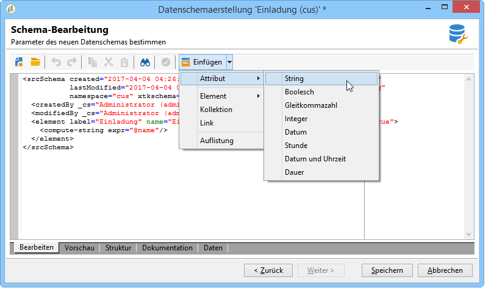
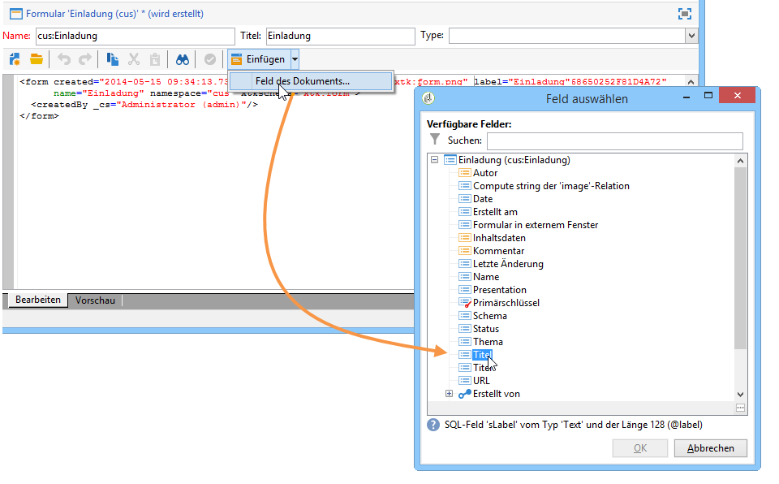
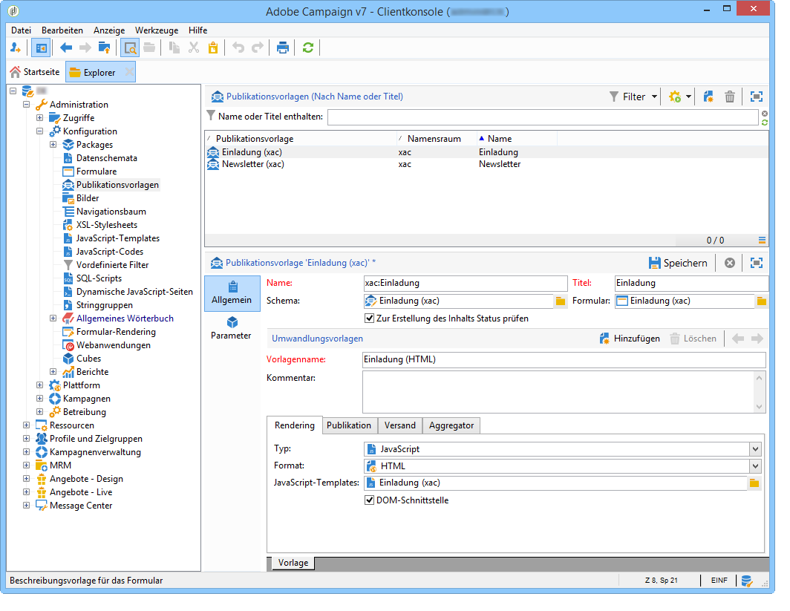

# Anwendungsbeispiele: Verwenden des Content Managements{#use-case-creating-content-management}

Folgende Schritte sind zur Verwendung des Content Managements zu durchlaufen:

* [1. Schritt - Anforderungsanalyse bezüglich des zu erstellenden Inhalts](#step-1---analyzing-the-content-to-be-produced),
* [2. Schritt - Erstellung des Datenschemas](#step-2---creating-the-data-schema),
* [3. Schritt - Erstellung des Formulars](#step-3---creating-the-input-form),
* [4. Schritt - Erstellung der Umwandlungsvorlagen](#step-4---creating-the-construction-template),
* [5. Schritt - Erstellung der Publikationsvorlage](#step-5---creating-the-publication-template),
* [6. Schritt - Erstellung des Inhalts](#step-6---creating-contents).

## 1. Schritt - Anforderungsanalyse bezüglich des zu erstellenden Inhalts {#step-1---analyzing-the-content-to-be-produced}

Zu Beginn sollten Sie genauestens analysieren, welche Art von Inhalten zu erstellen ist, d. h. die anzuzeigenden Elemente und ihre Typen bestimmen, mögliche diesbezügliche Einschränkungen identifizieren usw. Dabei gilt es, statische und variable Inhaltselemente zu unterscheiden.

In folgendem Beispiel soll ein Newsletter im HTML-Format mit folgendem Inhalt erstellt werden:


Dieser Newsletter enthält drei verschiedene Elementtypen:

1. Variable Elemente, deren Inhalt vom Benutzer zum Zeitpunkt der Versanderstellung über ein Formular erfasst oder ausgewählt wird.

   

1. Personalisierungsfelder, die dynamisch durch in der Datenbank enthaltene Informationen (hier Vor- und Nachname des Empfängers) ersetzt werden.

   

1. Statische Elemente, die in jedem Newsletter identisch sind.

   

Die verschiedenen Elemente dieses Newsletters werden entsprechend den in einem JavaScript-Template definierten Regeln zusammengefügt. Im Template werden alle Elemente sowie ihr Layout definiert.

Die Elemente selbst werden mithilfe eines dedizierten Schemas erstellt, welches für jeden Inhalt Titel, Namen, Typ, Größe und andere, für die Verwendung in Adobe Campaign erforderliche Informationen enthält.

## 2. Schritt - Erstellung des Datenschemas {#step-2---creating-the-data-schema}

Ein Datenschema ist ein mit einem Inhalt verknüpftes XML-Dokument zur Beschreibung der Struktur der Inhaltsdaten.

>[!NOTE]
>
>Erstellung und Konfiguration von Datenschemata in Adobe Campaign werden in [diesem Abschnitt](../../configuration/using/about-schema-edition.md) beschrieben.
>
>Die das Content Management betreffenden Elemente werden im Kapitel [Datenschemata](../../delivery/using/data-schemas.md) erläutert.

Gehen Sie wie folgt vor, um ein Datenschema zu erstellen:

1. Markieren Sie im Explorer den Knoten **[!UICONTROL Administration > Konfiguration > Datenschemata]**.

   Klicken Sie auf die Schaltfläche **[!UICONTROL Neu]** oberhalb der Datenschemata-Liste.

1. Kreuzen Sie die Option **[!UICONTROL Schema für das Content Management erstellen]** an und klicken Sie auf **[!UICONTROL Weiter]**.

   

1. Geben Sie einen Namen und einen Titel für das Schema an. Sie können ggf. eine Beschreibung und ein spezifisches Bild hinzufügen.

   

   Klicken Sie auf **[!UICONTROL Weiter]**, um die Eingaben zu bestätigen.

1. Geben Sie nun den Inhalt des Schemas im Fenster **[!UICONTROL Schema-Bearbeitung]** ein.

   Verwenden Sie hierzu die Schaltfläche **[!UICONTROL Einfügen]**.

   

   Weitere Informationen hierzu finden Sie im Abschnitt [Schemabearbeitung ](../../delivery/using/data-schemas.md#editing-schemas).

   Für jedes im Inhalt bezeichnete Element muss der entsprechende Datentyp eingefügt werden.

   Im vorliegenden Beispiel wurden folgende Inhalte sowie ihr Format, Typ und Titel identifiziert:

<table> 
 <thead> 
  <tr> 
   <th> <strong>Content</strong> <br /> </th> 
   <th> <strong>Format</strong> <br /> </th> 
   <th> <strong>Typ</strong> <br /> </th> 
   <th> <strong>Titel</strong> <br /> </th> 
  </tr> 
 </thead> 
 <tbody> 
  <tr> 
   <td> Title<br /> </td> 
   <td> Attribut<br /> </td> 
   <td> String <br /> </td> 
   <td> Title<br /> </td> 
  </tr> 
  <tr> 
   <td> Untertitel<br /> </td> 
   <td> Attribut<br /> </td> 
   <td> String <br /> </td> 
   <td> Name<br /> </td> 
  </tr> 
  <tr> 
   <td> Ereignisdatum<br /> </td> 
   <td> Attribut<br /> </td> 
   <td> Datum<br /> </td> 
   <td> Datum<br /> </td> 
  </tr> 
  <tr> 
   <td> Einleitung<br /> </td> 
   <td> Element<br /> </td> 
   <td> HTML<br /> </td> 
   <td> Übersicht<br /> </td> 
  </tr> 
  <tr> 
   <td> Foto des Autors<br /> </td> 
   <td> Attribut<br /> </td> 
   <td> String <br /> </td> 
   <td> URL<br /> </td> 
  </tr> 
  <tr> 
   <td> Autor<br /> </td> 
   <td> Element<br /> </td> 
   <td> Memo<br /> </td> 
   <td> Autor<br /> </td> 
  </tr> 
  <tr> 
   <td> Header-Logo (aus den öffentlichen Ressourcen in Adobe Campaign)<br /> </td> 
   <td> Attribut<br /> </td> 
   <td> Link<br /> </td> 
   <td> Bild<br /> </td> 
  </tr> 
 </tbody> 
</table>

Das Schema stellt sich also wie folgt dar:

```
<element label="Invitation" name="invitation" template="ncm:content" xmlChildren="true">
    <compute-string expr="@name"/>
    <attribute label="Title" length="40" name="title" type="string"/>
    <element label="Presentation" name="presentation" type="html"/>
    <attribute label="Date" name="date" type="date"/>
    <attribute label="Name" length="10" name="name" type="string"/>
    <attribute label="URL" name="url" type="string"/>
    <element label="Author" name="author" type="memo"/>
    <element label="Image" name="image" target="xtk:fileRes" type="link"/>
  </element>
```

1. Klicken Sie auf **[!UICONTROL Speichern]**, um die Erstellung des Datenschemas abzuschließen.

## 3. Schritt - Erstellung des Formulars {#step-3---creating-the-input-form}

Formulare ermöglichen die Bearbeitung einer Inhaltsinstanz über eine Eingabeschnittstelle der Adobe-Campaign-Clientkonsole.

Die Beschreibung eines Formulars ist ein strukturiertes XML-Dokument, welches die Grammatik des Formularschemas &quot;xtk:form&quot; anwendet.

>[!NOTE]
>
>Erstellung und Konfiguration von Formularen in Adobe Campaign werden in [diesem Abschnitt](../../configuration/using/identifying-a-form.md) beschrieben.
>
>Die das Content Management betreffenden Elemente werden im Kapitel [Formulare](../../delivery/using/input-forms.md) erläutert.

Gehen Sie wie folgt vor, um ein Formular für das Content Management zu erstellen:

1. Markieren Sie im Explorer den Knoten **[!UICONTROL Administration > Konfiguration > Formular]**.

   Klicken Sie auf die Schaltfläche **[!UICONTROL Neu]** oberhalb der Formularliste.

1. Geben Sie Namen und Titel des Formulars an und wählen Sie den Typ **[!UICONTROL Content Management]** aus.

   

   >[!NOTE]
   >
   >Um die automatische Verknüpfung zwischen Datenschema und Formular zu erzeugen, wird empfohlen, für beide den gleichen Namen zu verwenden. Auf diese Weise können Sie die aus dem Schema stammenden Felder ganz einfach über die **[!UICONTROL Einfügen]**-Schaltfläche hinzufügen.

   

1. Fügen Sie die Felder, die im Formular angezeigt werden sollen, wie zuvor beschrieben ein.

   Im vorliegenden Beispiel stellen sich die Informationen wie folgt dar:

   ```
    <input xpath="@title"/>
     <input xpath="@date"/>
     <input xpath="presentation"/>
     <input xpath="@name"/>
     <input xpath="@url"/>
     <input xpath="author"/>
     <input img="nl:sryimage.png" newEntityFormChoice="true" xpath="image">
       <sysFilter>
         <condition expr="@isImage = true"/>
       </sysFilter>
     </input>
   ```

   Im **[!UICONTROL Vorschau]**-Tab können Sie das Rendering des erstellten Formulars prüfen:

   

1. Klicken Sie nun auf **[!UICONTROL Speichern]**, um die Formularerstellung abzuschließen.

## 4. Schritt - Erstellung der Umwandlungsvorlagen {#step-4---creating-the-construction-template}

Die XSLT-Programmiersprache ermöglicht die Umwandlung eines XML-Dokuments in ein Ausgabedokument eines anderen Formats. Diese Umwandlung wird in einem XML-Stylesheet beschrieben.

Im vorliegenden Beispiel wird ein JavaScript-Template verwendet, um den Aufbau und das Layout des Ausgabedokuments zu definieren.

>[!NOTE]
>
>Eventuelle Einschränkungen in Verbindung mit der Dokumentenerstellung via JavaScript oder XSL werden im Abschnitt [Formatierung](../../delivery/using/formatting.md) behandelt.

Gehen Sie wie folgt vor, um ein JavaScript-Template in Adobe Campaign zu erstellen:

1. Markieren Sie im Explorer den Knoten **[!UICONTROL Administration > Konfiguration > JavaScript-Templates]**.

   Klicken Sie auf die Schaltfläche **[!UICONTROL Neu]** oberhalb der Template-Liste.

1. Geben Sie einen Namen für das Template ein und wählen Sie das zuvor für das Content Management erstellte Schema aus.
1. Importieren Sie die Inhalte, die in allen Ausgabedokumenten, die das Template verwenden, unveränderlich angezeigt werden sollen.

   Fügen Sie unter Beachtung der im Abschnitt [JavaScript-Templates](../../delivery/using/formatting.md#javascript-templates) dargestellten Syntax die variablen Elemente ein.

   Für das vorliegende Beispiel stellt sich das JavaScript-Template wie folgt dar:

   ```
   <html>
   <% eval(xtk.javascript.load("xac:perso").data); %>
   <head>
     <title>Invitation to an exceptional dedication session</title>
   </head>
   <body link="#0E59AE" vlink="#0E59AE" alink="#0E59AE" style="background-color:white;">
       <table width="546" border="0" align="center" cellpadding="0" cellspacing="0" style="border-left: solid 1px gray;border-top: solid 1px gray;border-right: solid 1px gray;">
         <tr>
           <td colspan="3">
             <%= generateImgTag(content.@["image-id"]) %>
           </td>
         </tr>
       </table>
       <table width="546" border="0" align="center" cellpadding="0" cellspacing="0" style="border-left: solid 1px gray;border-right: solid 1px gray;">
         <tr>
           <td>
             <table border="0" cellspacing="0" cellpadding="5">
               <tr>
                 <td width="10"> </td>
                 <td style="padding-top:2em; padding-bottom:2em;" width="730" align="middle">
                   <b>
                     <font style="font-family:Verdana, Arial, Helvetica, sans-serif; font-size:14px; color:#800080;">
                       <span style="FONT-VARIANT: small-caps"><%= content.@title %> - <%= content.@name %></span>
                     </font>
                   </b>
                 </td>
                 <td width="10"> </td>
               </tr>
               <tr>
                 <td width="10"> </td>
                 <td style="padding-top:1em; padding-bottom:1em;" width="730">
                   <font style="font-family:Verdana, Arial, Helvetica, sans-serif; font-size:11px; color:#666666;">
                     Hello <%= perso('recipient.firstName') %> <%= perso('recipient.lastName') %>,
                     <p>
                       <%= content.presentation %>
                     </p>               
                     <center>
                       <b><%= formatDate(content.@date, "%2D %Bl %4Y") %></b> come to our Book Fair and meet our favorite authors and illustrators.<br>
                       <br>
                       <a href="https://www.site.web.com/registration" target="_blank"><b>REGISTER</b></a>
                     </center>
                   </font>
                 </td>
                 <td width="10"> </td>
               </tr>
               <tr>
                 <td width="10"> </td>
                 <td style="padding-top:1em; padding-bottom:1em;" width="730">
                   <font style="font-family:Verdana, Arial, Helvetica, sans-serif; font-size:11px; color:#666666;">
                    " width="70" height="70">
                     <b><%= content.author %></b>, will be signing their book between 2
   and 5:30PM.
                   </font>
                 </td>
                 <td width="10"> </td>
               </tr>            
                   <tr>
                 <td width="10"> </td>
                 <td width="730">
                   <font style="font-family:Verdana, Arial, Helvetica, sans-serif; font-size:11px; color:#666666;">                  
                 </td>
                 <td width="10"> </td>
               </tr>           
               <tr>
                 <td width="10"> </td>
                 <td>
                   <font style="font-family:Verdana, Arial, Helvetica, sans-serif; font-size:11px; color:#666666;">
                     <center>
                       <p>
                         <a href="https://www.site.web.com/program" target="_blank"><span style="FONT-VARIANT: small-caps"><b>Program</b></span></a>
                          | 
                         <a href="https://www.site.web.com/information" target="_blank"><span style="FONT-VARIANT: small-caps"><b>Useful information</b></span></a>
                          | 
                       <a href="https://www.site.web.com/registration" target="_blank"><span style="FONT-VARIANT: small-caps"><b>Register</b></span></a></p>
                       </center>
                     </font>
                   </td>
                   <td width="10"> </td>
                 </tr>
               </table>
               <br>
             </td>
           </tr>
         </table>
   </body>
   </html>
   ```

   Der Funktionsaufruf zu Beginn des Templates steuert die Personalisierung des Dokuments und verweist auf Informationen, die in der Adobe Campaign-Datenbank gespeichert sind (hier recipient.firstName und recipient.lastName). Bei Durchführung eines Versands, der auf diesem Template beruht, werden diese Daten dynamisch ersetzt. Weitere Informationen hierzu finden Sie unter [Verwendung von JavaScript-Templates](../../delivery/using/formatting.md#including-a-javascript-template).

   Im vorliegenden Beispiel enthält die Funktion folgenden Code:

   ```
   function perso(strPerso)
   {
     var strStart = '<' + '%' + '=';
     var strEnd = '%' + '>';
     return strStart + strPerso + strEnd;
   }
     function bloc(strPerso)
   {
     var strStart = '<' + '%' + '@ include view="';
     var strEnd = '" %' + '>';
     return strStart + strPerso + strEnd;
   }
   ```

   Damit das JavaScript-Template gültig ist, muss diese Funktion zuvor im Knoten **[!UICONTROL JavaScript-Code]** des Navigationsbaums, wie unten gezeigt, erstellt werden:

   

## 5. Schritt - Erstellung der Publikationsvorlage {#step-5---creating-the-publication-template}

In diesem Schritt wird die Vorlage erstellt, die die Relation zwischen Schema, Formular und Umwandlungsvorlage herstellt. In der Publikationsvorlage können Sie zwischen verschiedenen Ausgabeformaten wählen.

>[!NOTE]
>
>Weiterführende Informationen finden Sie im Abschnitt [Publikationsvorlagen](../../delivery/using/publication-templates.md).

Gehen Sie wie folgt vor:

1. Erstellen Sie im Knoten **[!UICONTROL Administration > Konfiguration > Publikationsvorlagen]** eine neue Vorlage.
1. Geben Sie Namen und Titel an und wählen Sie das jeweils zu verwendende Schema und Formular aus.
1. Füllen Sie das Feld **[!UICONTROL Vorlagenname]** aus und wählen Sie im Tab den gewünschten Typ aus. Im vorliegenden Beispiel handelt es sich gemäß der zuvor erstellten Vorlage um JavaScript.

   

   >[!NOTE]
   >
   >Die Option **[!UICONTROL DOM-Schnittstelle]** ist standardmäßig aktiviert, was bedeutet, dass der Zugriff auf das Dokument nicht über die E4X-Syntax erfolgen kann. Wenn diese Option aktiviert ist, muss die DOM-Schnittstelle verwendet werden. Sie ist auch die empfohlene Syntax.
   >
   >Wenn Sie dennoch die E4X-Syntax verwenden möchten, deaktivieren Sie diese Option.

   Verwenden Sie die **[!UICONTROL Hinzufügen]**-Schaltfläche, wenn Sie weitere Umwandlungsvorlagen erstellen möchten.

1. Klicken Sie auf **[!UICONTROL Speichern]**, um die Vorlagenerstellung abzuschließen.

## 6. Schritt - Erstellung des Inhalts {#step-6---creating-contents}

Nun können Sie auf der zuvor erstellten Publikationsvorlage beruhende Inhalte erstellen.

>[!NOTE]
>
>Weitere Informationen zum Erstellen von Inhalten finden Sie unter [Verwendung von Inhaltsvorlagen](../../delivery/using/using-a-content-template.md).

### Inhaltserstellung im Versand-Assistenten {#creating-content-in-the-delivery-wizard}

Gehen Sie wie folgt vor, um direkt im Versand einen Inhalt zu erstellen:

1. Geben Sie im **[!UICONTROL Erweitert]**-Tab der Versandeigenschaften die Publikationsvorlage an.

   

   Im Versand-Assistenten erscheint ein zusätzlicher Tab, der es ermöglicht, den Versandinhalt über das zuvor erstellte Formular zu erfassen.

1. Geben Sie hier die variablen Elemente Ihres Newsletters ein.

   

1. Klicken Sie auf den **[!UICONTROL HTML-Vorschau]**-Tab und wählen Sie einen Empfänger aus, um Rendering und Personalisierung zu testen.

   
