# Anwendungsbeispiel: Auswahl von Testadressen nach Kriterien{#use-case-selecting-seed-addresses-on-criteria}

In the framework of a delivery or a campaign, the **[!UICONTROL Edit the dynamic condition...]** link lets you choose seed addresses based on specific selection criteria.

In unserem Anwendungsbeispiel versendet die Webseite **Mein Online-Buchshop** je nach bevorzugtem Genre verschiedene Newsletter an seine Kunden.

In Absprache mit der Einkaufsabteilung hat der versandverantwortliche Benutzer einen Newsletter für Kunden erstellt, die in der Vergangenheit bereits Kriminalromane bestellt haben.

Damit die Kollegen der Einkaufsabteilung das Ergebnis ihrer Zusammenarbeit sehen können, fügt sie der Versandverantwortliche als Testadressen zu den Versandempfängern hinzu. Durch die Verwendung einer dynamischen Bedingung lassen sich der Konfigurationsaufwand und die Adressaktualisierung optimieren.

Zur Verwendung von dynamischen Bedingungen benötigen Sie:

* einen vollständig konfigurierten Versand,
* Testadressen mit einem gemeinsamen Wert. Dieser Wert kann aus einem in Adobe Campaign vorhandenen Feld stammen. Im vorliegenden Beispiel besteht die Gemeinsamkeit der Testadressen im Wert &quot;Einkauf&quot; des Felds &quot;Abteilung&quot;, welches nicht standardmäßig in der Anwendung enthalten ist.

## Schritt 1: Erstellen eines Versands {#step-1---creating-a-delivery}

Die Schritte zum Erstellen einer Auslieferung finden Sie im Abschnitt [Erstellen einer E-Mail-Auslieferung](../../delivery/using/creating-an-email-delivery.md) .

Im vorliegenden Beispiel hat der Versandverantwortliche zunächst den Newsletter erstellt und die Zielgruppe ausgewählt.

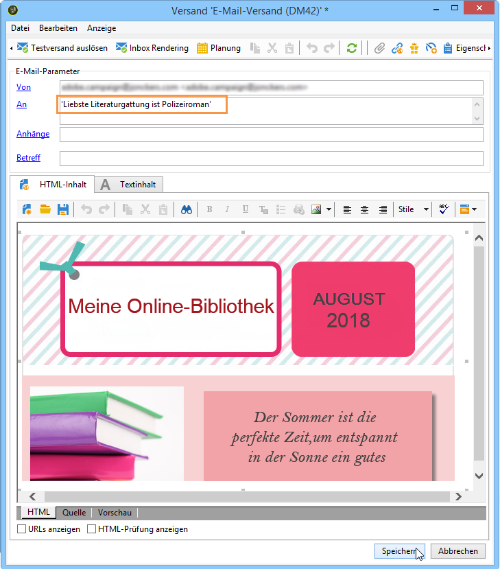

## 2. Schritt - Gemeinsamen Wert definieren {#step-2---creating-a-common-value}

Die Hinzufügung des Abteilung-Feldes, welches den gemeinsamen Wert aufnehmen soll, erfordert eine Erweiterung des **Datenschemas** der Testadressen und die Anpassung des entsprechenden Formulars.

### Datenschema erweitern {#extending-the-data-schema}

Weiterführende Informationen zur Schemaerweiterung entnehmen Sie bitte dem [Konfigurationshandbuch](../../configuration/using/data-schemas.md).

1. Klicken Sie im **[!UICONTROL Administration > Configuration > Data schemas]** Knoten auf das **[!UICONTROL New]** Symbol.
1. Wählen Sie im **[!UICONTROL Creation of a data schema]** Fenster die **[!UICONTROL Extension of a schema]** Option aus und klicken Sie auf **[!UICONTROL Next]**.

   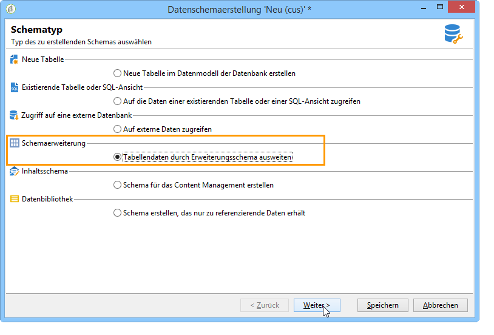

1. Wählen Sie das **[!UICONTROL Seed addresses]** Quellschema aus, geben Sie **doc** als Wert ein **[!UICONTROL Namespace]** und klicken Sie auf **[!UICONTROL Ok]**.

   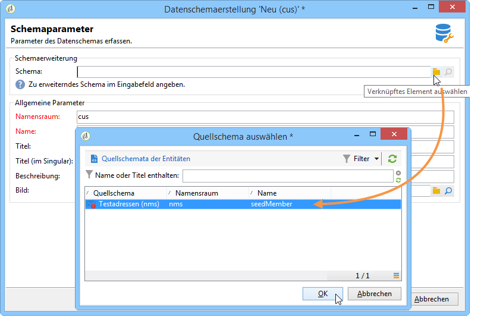

1. Klicks **[!UICONTROL Save]**.
1. Fügen Sie nun die nachfolgenden Zeilen wie auf der Abbildung dargestellt in das Schema ein:

   ```
     <element name="common">
       <element label="Recipient" name="custom_nms_recipient">
         <attribute label="Department" length="80" name="workField" template="nms:recipient:recipient/@company"
                    type="string" userEnum="workField"/>
       </element>
     </element>
   ```

   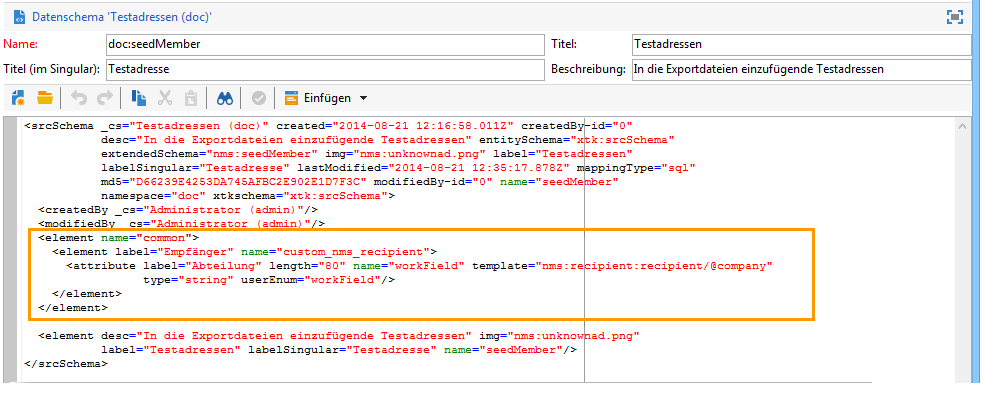

   Kopieren Sie dann die folgenden Zeilen und fügen Sie sie unter dem **[!UICONTROL Seed to insert in the export files]** Element ein.

   ```
       <element aggregate="doc:seedMember:common">
     </element>
   ```

   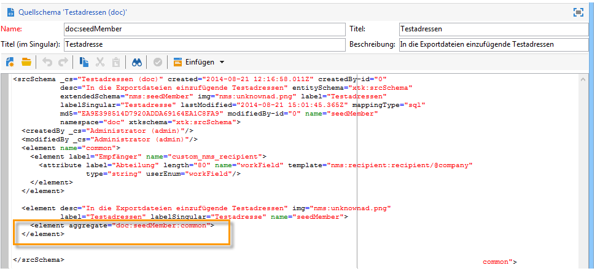

   In this case, you are specifying that a new enumeration named **[!UICONTROL Department]** has been created in the seed address table, and it is based on the standard **[!UICONTROL @company]** enumeration template (labeled under the name **Company** in the seed address form).

1. Klicks **[!UICONTROL Save]**.
1. Wählen Sie im **[!UICONTROL Tools > Advanced]** Menü die **[!UICONTROL Update database structure]** Option aus.

   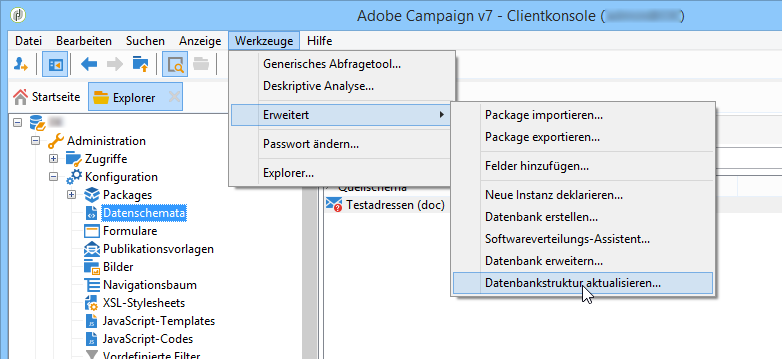

1. When the update wizard is displayed, click the **[!UICONTROL Next]** button to access the Edit tables window: changes carried out in the seed address data schema require a structure update.

   

1. Folgen Sie dem Assistenten, bis Sie zur Seite gelangen, um das Update auszuführen. Click the **[!UICONTROL Start]** button.

   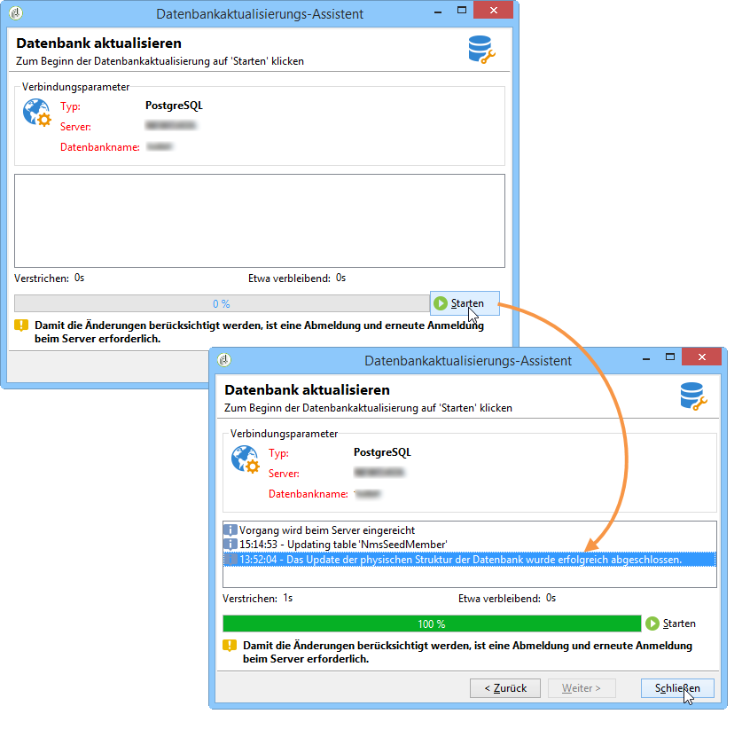

   Nach Abschluss der Aktualisierung können Sie den Assistenten schließen.

1. Disconnect then reconnect to Adobe Campaign. The changes made in the seed address data schema are now effective. In order for them to be visible from the seed address screen, you must update the associated **[!UICONTROL Input form]**. Weitere Informationen finden Sie im Abschnitt [Aktualisieren des Eingabedrucks](#updating-the-input-form) .

#### Datenschema ausgehend von einer verbundenen Tabelle erweitern {#extending-the-data-schema-from-a-linked-table}

Das Testadressen-Schema kann auch Werte aus einer mit dem Empfängerschema verbundenen Tabelle übernehmen.

For example, the user would like to integrate the **[!UICONTROL Internet Extension]** found in the **[!UICONTROL Country]** table that is linked to the recipients schema.

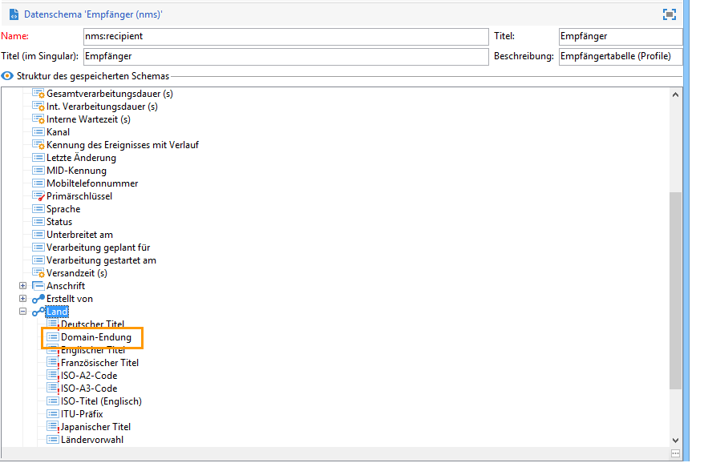

In diesem Fall ist das Testadressen-Schema wie im Abschnitt  beschrieben zu erweitern. Die im **Schritt 4** einzufügenden Code-Zeilen lauten jedoch wie folgt:

```
<element name="country">
      <attribute label="Internet Extension" length="2" name="iana" type="string"/>
      <attribute label="Country ISO" length="2" name="countryIsoA2" type="string"/>
    </element>
```

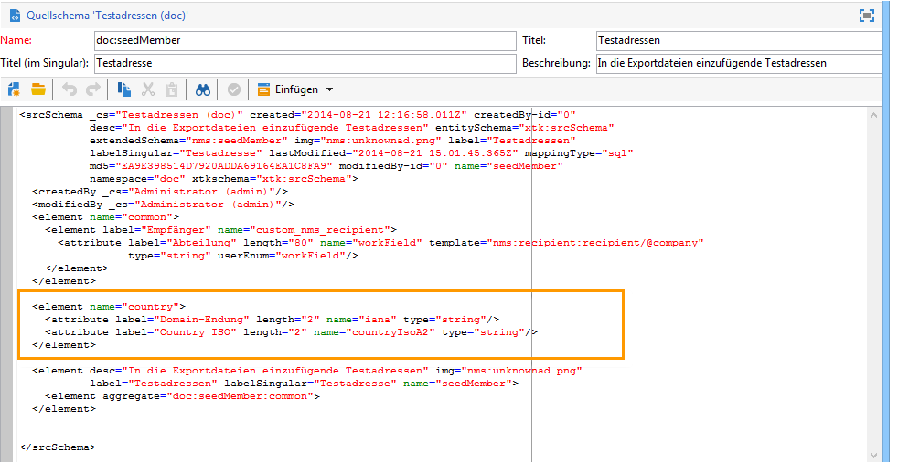

Auf diese Weise:

* that the user wants to create a new element named **[!UICONTROL Internet Extension]**,
* welches aus der Tabelle **[!UICONTROL Country]** stammt.

>[!CAUTION]
>
>Es ist erforderlich, in der verbundenen Tabelle den **xpath-dst** anzugeben.
>
>This can be found in the **[!UICONTROL Country]** element in the recipients table.

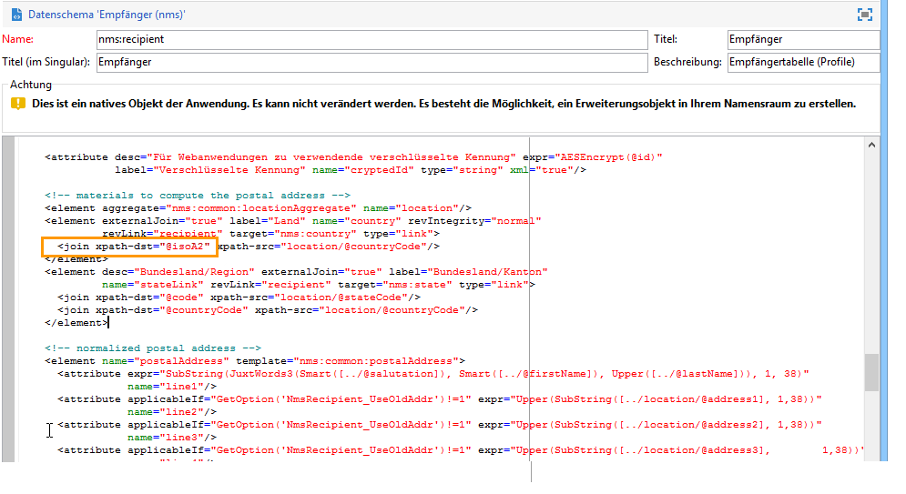

The user can then follow from **step 5** of the section, and update the **[!UICONTROL Input form]** of the seed addresses.

Weitere Informationen finden Sie im Abschnitt [Aktualisieren des Eingabedrucks](#updating-the-input-form) .

#### Testadressen-Formular aktualisieren {#updating-the-input-form}

1. Suchen Sie im **[!UICONTROL Administration > Configuration > Input forms]** Knoten das Eingabeformular für die Startadressen.

   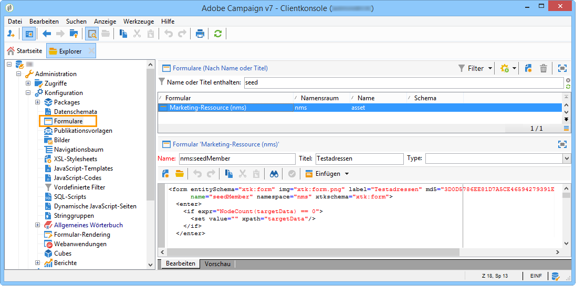

1. Edit the form and insert the following line in the **[!UICONTROL Recipient]** container.

   ```
   <input xpath="@workField"/>
   ```

   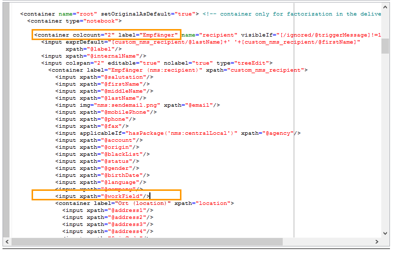

1. Speichern Sie Ihre Änderungen.
1. Öffnen Sie eine Seed-Adresse. Das **[!UICONTROL Department]** Feld wird in der **[!UICONTROL Recipient]** Tabelle angezeigt.

   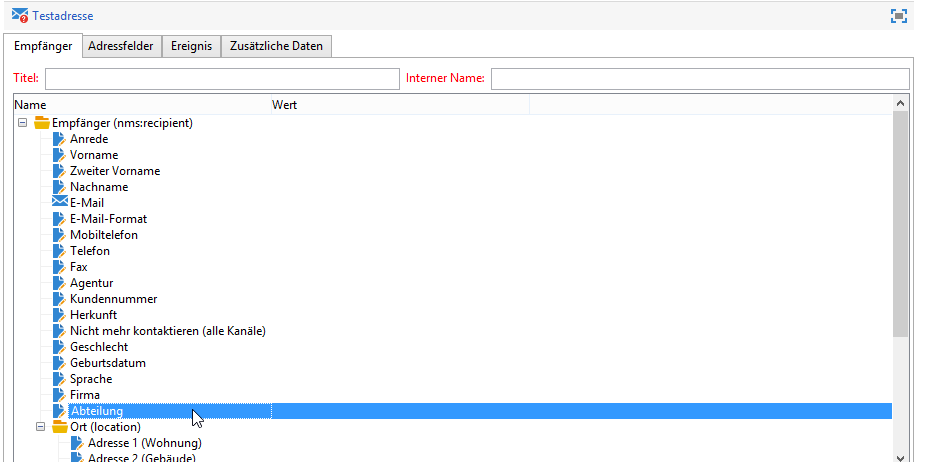

1. Edit the seed addresses that you want to use for the delivery and enter **Purchasing** as the value in the **[!UICONTROL Department]** field.

## 3. Schritt - Bedingung bestimmen {#step-3---defining-the-condition}

Sie können nun die dynamische Bedingung für die Testadressen-Auswahl definieren. Gehen Sie wie folgt vor:

1. Öffnen Sie den zuvor erstellten Versand.

   

1. Klicken Sie auf den **[!UICONTROL To]** Link und dann auf die **[!UICONTROL Seed addresses]** Registerkarte, um auf den **[!UICONTROL Edit the dynamic condition...]** Link zuzugreifen.

   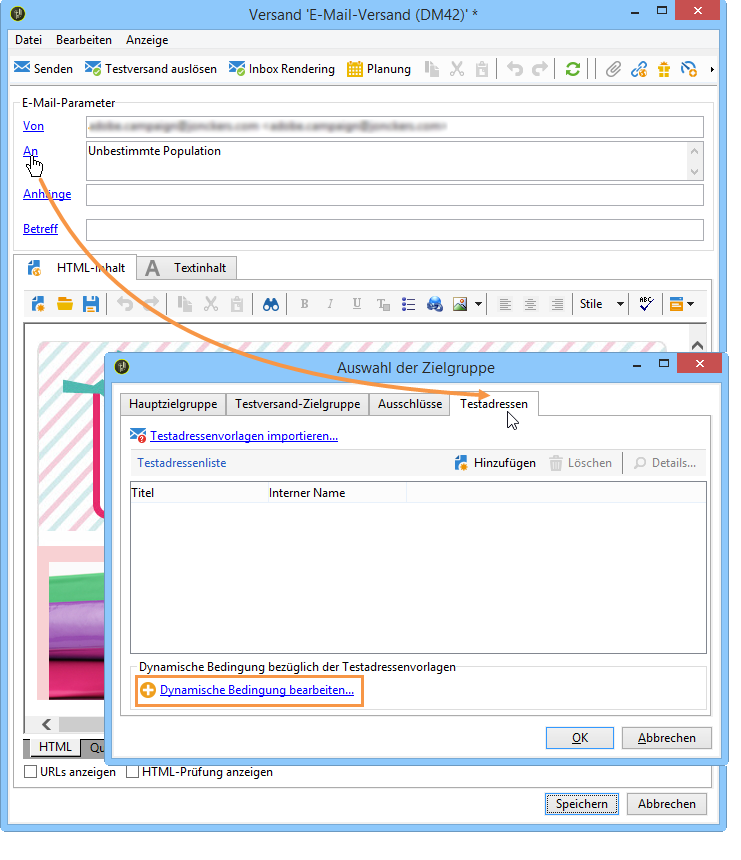

1. Wählen Sie den Ausdruck aus, mit dem Sie die gewünschten Startadressen auswählen können. Hier wählt der Benutzer den **[!UICONTROL Department (@workField)]** Ausdruck aus.

   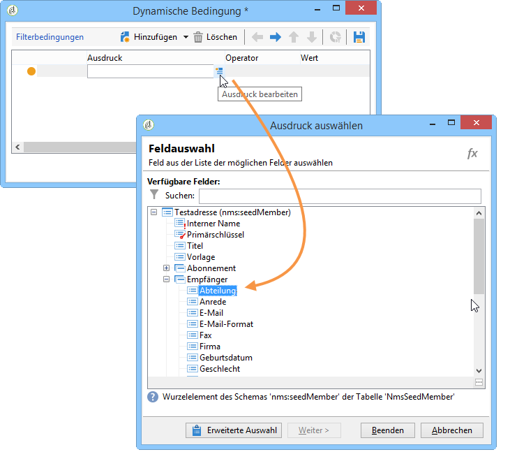

1. Geben Sie den Operator **gleich** ein und wählen Sie den Wert aus der Dropdown-Liste aus.

   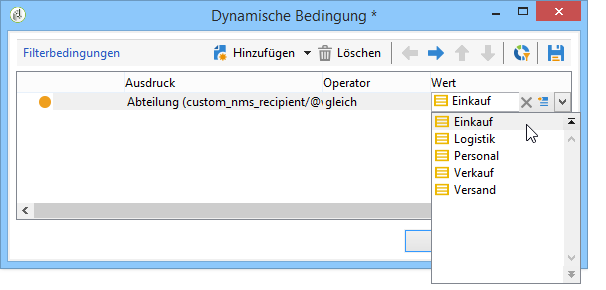

   >[!NOTE]
   >
   >Die zuvor vorgenommene Schemaerweiterung beruht auf dem Empfängerschema (**(recipient**). Dies gilt auch für die Auflistung, aus der die oben zu sehenden Werte stammen.****

1. Klicks **[!UICONTROL Ok]**.

   The query is displayed in the **[!UICONTROL Select target]** window.

   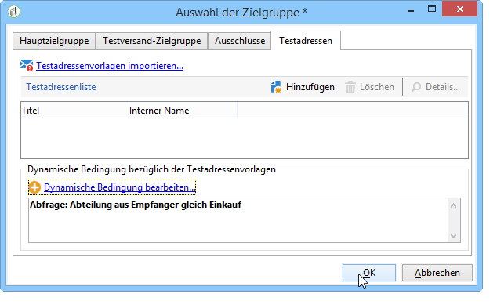

1. Klicken Sie erneut auf **[!UICONTROL Ok]**, um die Abfrage zu bestätigen.
1. Analyze your delivery then click on the **[!UICONTROL Delivery]** tab to access the delivery logs.

   Die Testadressen der Einkaufsabteilung werden wie die Empfängeradressen auch mit ausstehendem Status angezeigt:

   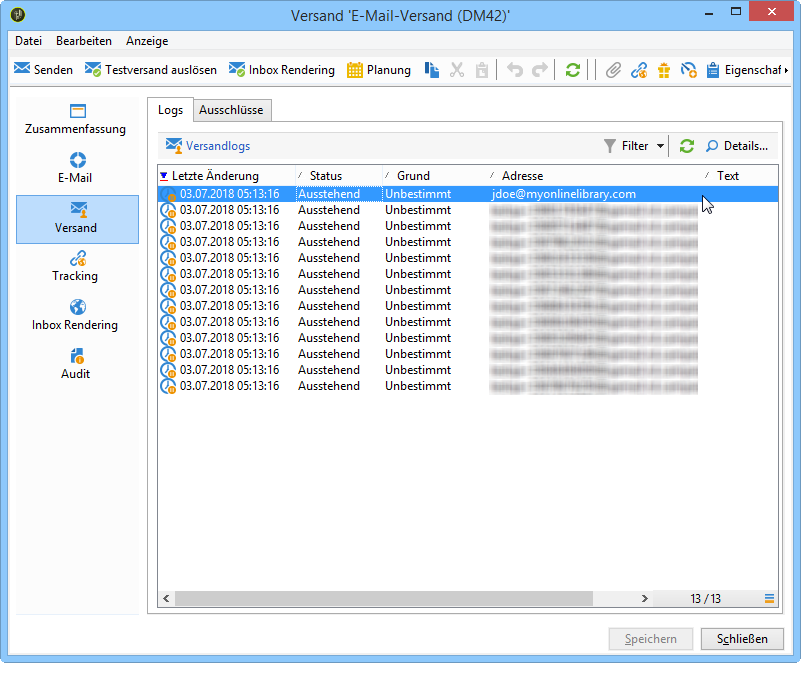

1. Click the **[!UICONTROL Send]** button to start the delivery.

   Die in Ihren Testadressen enthaltenen Personen der Einkaufsabteilung erhalten die Sendung in ihrem E-Mail-Postfach:

   
