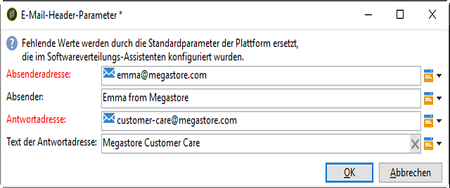
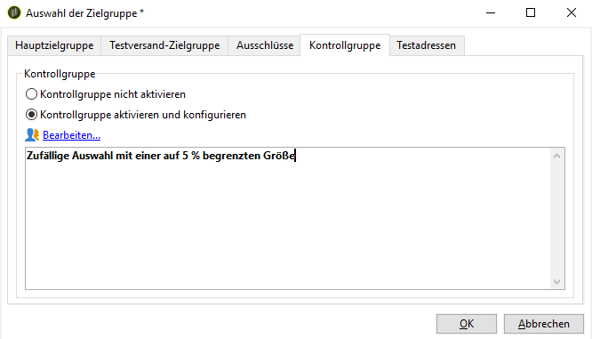

# Verwenden von Vorlagen {#use-templates}

Versandvorlagen ermöglichen eine effiziente Nutzung, da sie für die häufigsten Aktivitäten vordefinierte Szenarien enthalten. Mit Vorlagen können Marketing-Experten rasch neue Kampagnen bei minimaler Anpassung bereitstellen.

Learn more about delivery templates in [this section](../../delivery/using/creating-a-delivery-template.md).

## Erste Schritte mit Versandvorlagen {#gs-templates}

A [delivery template](../../delivery/using/creating-a-delivery-template.md) enables you to define once a set of technical and functional properties that suit your needs and that can be reused for future deliveries. Sie können dann bei Bedarf Zeit sparen und Versand standardisieren.

Wenn Sie mehrere Marken in Adobe Campaign verwalten, empfiehlt Adobe die Zuweisung einer Subdomain pro Marke. Eine Bank kann beispielsweise für jede ihrer regionalen Niederlassungen über eine Subdomain verfügen. Wenn eine Bank die Domäne &quot;bluebank.com&quot;besitzt, können ihre Subdomänen @ny.bluebank.com, @ma.bluebank.com, @ca.bluebank.com usw. sein. Mit einer Versandvorlage pro Subdomain können Sie stets die richtigen vorkonfigurierten Parameter für jede Marke verwenden, um Fehler zu verhindern und Zeit zu sparen.

**Tipp**:  Um Konfigurationsfehler in Campaign Standard zu vermeiden, sollten Sie eine native Vorlage mit Duplikat versehen und deren Eigenschaften ändern, anstatt eine neue Vorlage zu erstellen.

## Konfigurieren von Adressen

* Die Angabe der Absenderadresse ist für den E-Mail-Versand zwingend erforderlich.

* Some ISPs (Internet Service Providers) check the validity of the sender address before accepting messages.

* A badly formed address may result in it being rejected by the receiving server. Sie müssen sicherstellen, dass eine korrekte Adresse angegeben wird.

* Die Adresse muss die Identität eines Absenders enthalten. Die Domain muss im Besitz des Absenders und auf ihn registriert sein.

* Adobe empfiehlt, E-Mail-Konten zu erstellen, die der Absender- und Antwortadresse entsprechen. Wenden Sie sich diesbezüglich bitte an den Administrator Ihres E-Mail-Programms.

To configure addresses in Campaign interface, follow the steps below:

1. In the [delivery template](../../delivery/using/creating-a-delivery-template.md), click the **[!UICONTROL From]** link. Füllen Sie im Fenster **[!UICONTROL Parameter des E-Mail-Headers]** die folgenden Felder aus:

   

1. In the **[!UICONTROL Sender address]** field, make sure the address domain is the same as the sub-domain that you delegated to Adobe. You can change the part preceding the &#39;@&#39; but not the domain address.

1. Verwenden Sie im Feld &quot; **[!UICONTROL Von]** &quot;einen Namen, der von den Empfängern leicht identifiziert werden kann, z. B. den Namen Ihrer Marke, um die Öffnungsrate Ihrer Versand zu erhöhen. To further improve the recipient&#39;s experience, you can add a person&#39;s name, for example &quot;Emma from Megastore&quot;.

1. In den Textfeldern **[!UICONTROL Antwort-Adresse]** wird standardmäßig die Adresse des Absenders für Antworten verwendet. Adobe empfiehlt jedoch die Verwendung einer vorhandenen echten Adresse wie der Kundenbetreuung Ihrer Marke. In diesem Fall kann die Kundenunterstützung die Antwort dann bearbeiten, wenn ein Empfänger eine Antwort sendet.

### Einrichten einer Kontrollgruppe

Sobald der Versand durchgeführt wurde, können Sie das Verhalten der ausgeschlossenen Empfänger mit den Empfängern vergleichen, die den Versand erhalten haben. Anschließend können Sie die Effizienz Ihrer Kampagnen messen. Weitere Informationen zu Kontrollgruppen finden Sie [in diesem Abschnitt](../../campaign/using/marketing-campaign-deliveries.md#defining-a-control-group).

To set up a control group, click the **[!UICONTROL To]** link. In the **[!UICONTROL Select target]** window, select the **[!UICONTROL Control group]** tab. You can extract a portion of the target, for example a 5% random sample.

## Use typologies to apply filters or control rules

Eine Typologie enthält Regeln, die in der Analysephase vor dem Versand einer Nachricht angewendet werden.

In the **[!UICONTROL Typology]** tab of the template&#39;s properties, change the default typology according to your needs.

For example, to better control the outbound traffic, you can define which IP addresses can be used by defining one affinity per sub-domain and creating one typology per affinity. The affinities are defined in the instance&#39;s configuration file. Contact your Adobe Campaign administrator.

For more on typologies, refer to [this section](../../campaign/using/about-campaign-typologies.md).
