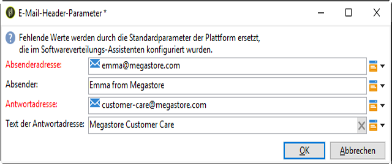
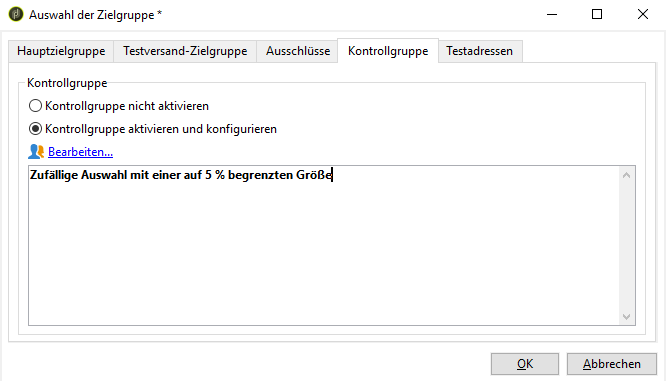

# Vorlagen verwenden {#use-templates}

Versandvorlagen ermöglichen eine effiziente Nutzung, da sie für die häufigsten Aktivitäten vordefinierte Szenarien enthalten. Mit Vorlagen können Marketing-Fachleute in kürzerer Zeit neue Kampagnen bei minimaler Anpassung bereitstellen.

Weiterführende Informationen zu Versandvorlagen finden Sie in [diesem Abschnitt](about-templates.md).

## Erste Schritte mit Versandvorlagen {#gs-templates}

Mit einer [Versandvorlage](about-templates.md) können Sie ein Set technischer und funktioneller Eigenschaften nach Ihren Anforderungen definieren und für künftige Sendungen wiederverwenden. Sie können damit Zeit sparen und Sendungen bei Bedarf standardisieren.

Wenn Sie mehrere Marken in Adobe Campaign verwalten, empfiehlt Adobe die Zuweisung einer Subdomain pro Marke. Eine Bank kann beispielsweise für jede ihrer regionalen Niederlassungen über eine Subdomain verfügen. Wenn einer Bank die Domain „bluebank.com“ gehört, sind beispielsweise folgende Subdomains möglich: @ny.bluebank.com, @ma.bluebank.com, @ca.bluebank.com. Mit einer Versandvorlage pro Subdomain können Sie stets die richtigen vorkonfigurierten Parameter für jede Marke verwenden, um Fehler zu verhindern und Zeit zu sparen.

**Tipp**: Zur Vermeidung von Konfigurationsfehlern wird empfohlen, keine neuen Vorlagen zu erstellen, sondern native Vorlagen zu duplizieren und die Eigenschaften nach Bedarf anzupassen.

## Konfigurieren von Adressen

* Die Angabe der Absenderadresse ist für den E-Mail-Versand zwingend erforderlich.

* Manche ISPs (Internet Service Provider) prüfen die Gültigkeit der Absenderadresse, bevor sie Nachrichten akzeptieren.

* Eine schlecht formulierte Adresse könnte vom Empfangs-Server abgelehnt werden. Achten Sie darauf, dass eine korrekte Adresse angegeben ist.

* Die Adresse muss den Absender explizit identifizieren. Die Domain muss im Besitz des Absenders sein und auf dessen Namen registriert sein.

* Adobe empfiehlt, E-Mail-Konten zu erstellen, die der für Sendungen und Antworten angegebenen Adresse entsprechen. Wenden Sie sich an den bzw. die Systemadmin für das Messaging-System.

Gehen Sie wie folgt vor, um Adressen in der Campaign-Benutzeroberfläche zu konfigurieren:

1. Wählen Sie in der [Versandvorlage](about-templates.md) den Tab **[!UICONTROL Von]** aus. Füllen Sie im Fenster **[!UICONTROL E-Mail-Header-Parameter]** die folgenden Felder aus:

   

1. Stellen Sie im Feld **[!UICONTROL Absenderadresse]** sicher, dass die Adress-Domain mit der Subdomain übereinstimmt, die Sie an Adobe delegiert haben. Sie können den Teil vor dem „@“ ändern, nicht aber die Domain-Adresse.

1. Verwenden Sie im Feld **[!UICONTROL Von]** einen Namen, der von den Empfängern leicht identifiziert werden kann, z. B. den Namen Ihrer Marke, um die Öffnungsrate Ihrer Sendungen zu erhöhen. Um das Benutzererlebnis zu verbessern, können Sie den Namen einer Person einfügen, wie z. B. „Emma von Megastore“.

1. Im Feld **[!UICONTROL Text der Antwortadresse]** wird für Antworten standardmäßig die Adresse des Absenders verwendet. Adobe empfiehlt, eine echte Adresse zu verwenden, wie etwa den Kundendienst Ihrer Marke. So kann sich dieser gegebenenfalls um etwaige Antworten kümmern.

### Einrichten einer Kontrollgruppe

Sobald der Versand durchgeführt wurde, können Sie das Verhalten der ausgeschlossenen Empfänger mit den Empfängern vergleichen, die den Versand erhalten haben. Anschließend können Sie die Effizienz Ihrer Kampagnen messen. Weiterführende Informationen zu Kontrollgruppen finden Sie in [diesem Abschnitt](../../campaign/using/marketing-campaign-deliveries.md#defining-a-control-group).

Um eine Kontrollgruppe einzurichten, klicken Sie auf den Link **[!UICONTROL An]**. Wählen Sie im Fenster **[!UICONTROL Auswahl der Zielgruppe]** die Registerkarte **[!UICONTROL Kontrollgruppe]** aus. Sie können einen Teil der Zielgruppe extrahieren, z. B. eine Zufallsauswahl von 5 %.

## Verwenden von Typologien, um Filter und Kontrollregeln anzuwenden

Eine Typologie enthält Regeln, die in der Analysephase vor dem Versand einer Nachricht angewendet werden.

Ändern Sie in den Eigenschaften der Vorlage im Tab **[!UICONTROL Typologie]** die Standardtypologie entsprechend Ihren Anforderungen.

Um beispielsweise den ausgehenden Traffic besser zu steuern, können Sie festlegen, welche IP-Adressen verwendet werden können, indem Sie für jede Subdomain eine Affinität definieren und für jede Affinität eine Typologie erstellen. Die Affinitäten werden in der Konfigurationsdatei der Instanz bestimmt. Wenden Sie sich an Ihre bzw. Ihren Adobe Campaign-Admin.

Weiterführende Informationen zu Typologien finden Sie in [diesem Abschnitt](../../campaign-opt/using/about-campaign-typologies.md).
