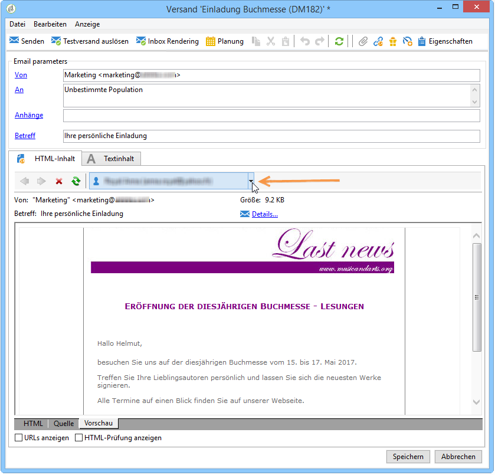

# Verwendung von Inhaltsvorlagen{#using-a-content-template}

## Über Inhaltsvorlagen {#about-content-templates}

Inhaltsvorlagen können direkt in der Versanderstellung referenziert und verwendet werden. Siehe [Versanderstellung unter Verwendung des Content Managements](#creating-a-delivery-via-content-management).

Sie können auch zum Erstellen von Inhaltsinstanzen genutzt werden. Nach der Erstellung sind diese Instanzen versandbereit (siehe [Versand einer Inhaltsinstanz](#delivering-a-content-instance)) oder exportbereit (siehe [Erstellung einer Inhaltsinstanz](#creating-a-content-instance)).

## Versanderstellung unter Verwendung des Content Managements {#creating-a-delivery-via-content-management}

Sie haben die Möglichkeit, bei der Versanderstellung eine Inhaltsvorlage anzugeben und mithilfe dieser den Inhalt zu erfassen. Im Versand-Assistenten erscheint in diesem Fall ein zusätzlicher Tab mit den Feldern zur Eingabe der variablen Inhaltselemente.

Die Formatierung geschieht automatisch gemäß den ausgewählten Parametern. Klicken Sie zu ihrer Prüfung auf den Tab **[!UICONTROL HTML-Vorschau]** bzw. **[!UICONTROL Text-Vorschau]** und wählen Sie einen Empfänger aus, um die Personalisierung zu testen.

Weitere Informationen finden Sie im vollständigen Implementierungsbeispiel unter [Inhaltserstellung im Versand-Assistenten](../../delivery/using/use-case--creating-content-management.md#creating-content-in-the-delivery-wizard).

## Erstellung einer Inhaltsinstanz {#creating-a-content-instance}

Es besteht die Möglichkeit, Inhalte direkt im Explorer zu erstellen. Sie können dann in Workflows genutzt, exportiert oder in neuen Sendungen verwendet werden.

Gehen Sie wie folgt vor:

1. Markieren Sie den Knoten **[!UICONTROL Ressourcen > Inhalte]** und klicken Sie mit der rechten Maustaste auf einen der Inhaltsordner. Wählen Sie die Option **[!UICONTROL Eigenschaften...]**.

   

1. Wählen Sie die gewünschten Publikationsvorlagen aus.

   

1. Nun können Sie über die Schaltfläche **[!UICONTROL Neu]** (rechts oberhalb der Inhaltsliste) neue Inhalte erstellen.

   

1. Füllen Sie die Felder des Formulars aus.

   

1. Klicken Sie nun auf den Tab **[!UICONTROL HTML-Vorschau]**, um das Rendering zu prüfen. Im vorliegenden Beispiel fehlen die Angaben in den Personalisierungsfeldern, die auf Daten aus der Datenbank zurückgreifen.

   

1. Nach seiner Erstellung erscheint der Inhalt in der Liste der verfügbaren Inhalte. Durch Klick auf die **[!UICONTROL Eigenschaften]**-Schaltfläche können Sie Titel und Status ändern und den Verlauf ansehen.

   

1. Nach der Validierung kann der Inhalt bei Bedarf erzeugt werden. Dies geschieht durch Klick auf die entsprechende Schaltfläche in der Symbolleiste.

   

   >[!NOTE]
   >
   >Sie haben auch die Möglichkeit, die Erzeugung nicht validierter Inhalte zuzulassen. Ändern Sie in diesem Fall die entsprechende Option in der Publikationsvorlage. Weitere Informationen hierzu finden Sie unter [Erstellung und Konfiguration der Vorlagen](../../delivery/using/publication-templates.md#creating-and-configuring-the-template).

   HTML- und Text-Inhalte werden standardmäßig im **Publishing**-Ordner der Adobe-Campaign-Instanz erzeugt. Ausgehend von der Option **NcmPublishingDir** können Sie einen anderen Ordner wählen.

## Versand einer Inhaltsinstanz {#delivering-a-content-instance}

Damit eine Inhaltsinstanz automatisch erstellt und versendet werden kann, muss in der Publikationsvorlage, die für die Inhaltserzeugung verwendet wird, eine Versandvorlage angegeben sein. Weitere Informationen hierzu finden Sie im Abschnitt [Versand](../../delivery/using/publication-templates.md#delivery).

Des Weiteren muss der Ordner, in dem der Inhalt gespeichert wird, den aus dieser Publikationsvorlage stammenden Inhalten vorbehalten sein. Ein Inhaltsordner, der die Erzeugung verschiedener Inhaltstypen erlaubt, ist nicht für die automatische Versanderstellung geeignet.

Klicken Sie zur automatischen Erstellung eines Versands mit dem ausgewählten Inhalt auf das **[!UICONTROL Versand]**-Symbol und wählen Sie die Vorlage aus.

Die Inhalte (Text und HTML) werden automatisch eingefügt.
