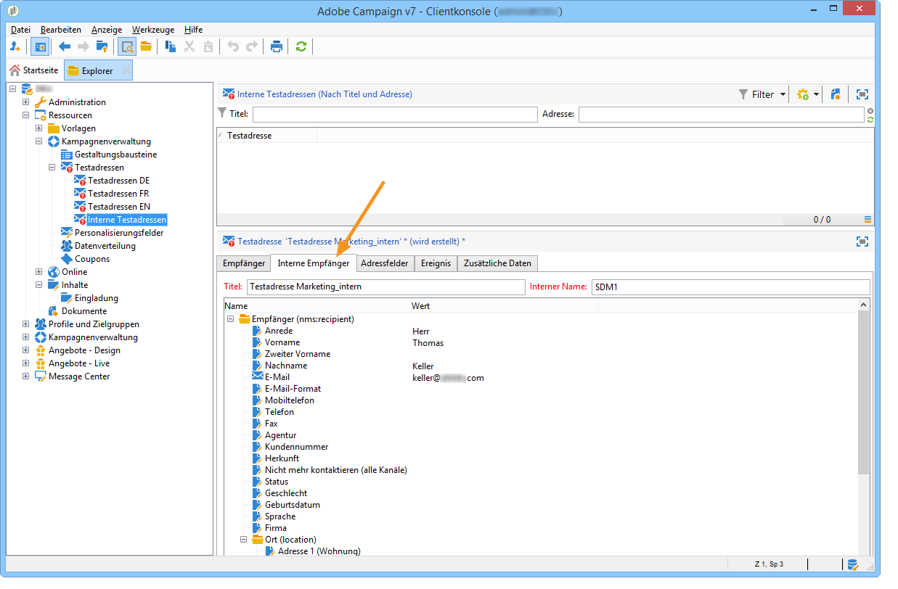
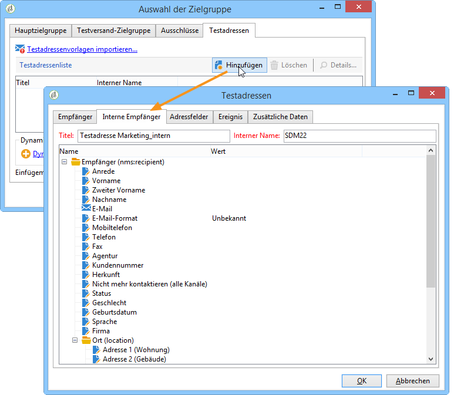

# Externe Empfängertabelle verwenden{#using-an-external-recipient-table}

Im Falle einer externen Versandtabelle sind zusätzliche Konfigurationen erforderlich. So muss das Schema **[!UICONTROL nms:seedmember]** erweitert werden. Der im Zuge dessen hinzugefügte Tab erlaubt die Angabe der entsprechenden Felder, wie in unten stehendem Beispiel dargestellt:

Geben Sie in diesem Fall die Testadressen-Daten direkt in den jeweiligen Feldern des entsprechenden Tabs auf Ebene des Versands ein oder importieren Sie Adressenvorlagen:

Die Schemaerweiterung **nms:seedMember** wird in [diesem Abschnitt](../../configuration/using/seed-addresses.md) näher erläutert.
