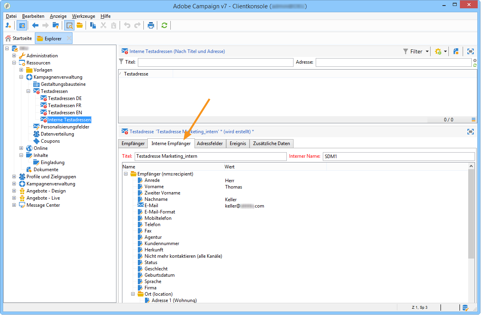
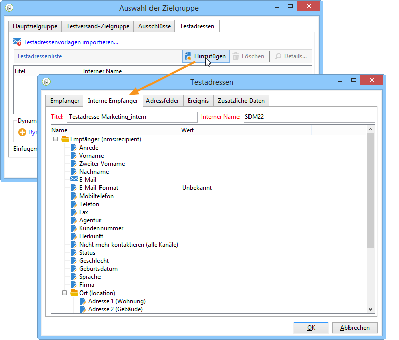

# Verwenden einer externen Empfängertabelle{#using-an-external-recipient-table}

Wenn es sich bei der Versandtabelle um eine externe Tabelle handelt, müssen Sie zusätzliche Konfigurationen vornehmen. Das **[!UICONTROL nms:seedmember]**-Schema muss erweitert werden. Es wird eine Registerkarte zu den Testadressen hinzugefügt, um die entsprechenden Felder wie folgt zu definieren:

Geben Sie in diesem Fall die Testadressen-Daten direkt in den jeweiligen Feldern des entsprechenden Tabs auf Ebene des Versands ein oder importieren Sie Adressenvorlagen:

Die **nms:seedMember**-Schemaerweiterung lautet [dieser Abschnitt](../../configuration/using/seed-addresses.md).
