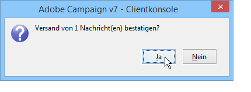

# Validierung{#validating}

In [diesem Abschnitt](../../delivery/using/steps-validating-the-delivery.md) werden globale Konzepte zur Validierung eines Versands vorgestellt.

Die Ausgabedatei eines Briefpost-Versands wird während der Versandanalyse generiert. Der Inhalt der Datei hängt von den ausgewählten Ausgabespalten ab (siehe [Extraktionsdatei](../../delivery/using/defining-the-direct-mail-content.md#extraction-file)).

>[!NOTE]
>
>Die Analysephase ist im Abschnitt [Versand analysieren](../../delivery/using/steps-validating-the-delivery.md#analyzing-the-delivery) ausführlich beschrieben.

Bei der Erzeugung der Datei werden keine Empfängerinformationen (z. B. Versandlogs) aktualisiert. Der Vorgang kann daher problemlos unterbrochen werden.

Prüfen Sie jetzt das Ergebnis der Analyse und klicken Sie dann auf **[!UICONTROL Absendung bestätigen]**, um die Nachrichten an die gewählte Zielgruppe zu senden. Durch Bestätigung des Pop-ups wird der Versand gestartet.

Mit der Absendebestätigung wird die Extraktion der Daten in die angegebene Datei gestartet.

Nun können Sie den Assistenten schließen und die Logs im **[!UICONTROL Versand]**-Tab ansehen, auf den Sie über die Detailansicht des Versands zugreifen können.

Sie können den Feedback-Modus der Versandlogs im **[!UICONTROL Analyse]**-Tab der Versandeigenschaften konfigurieren.

Dabei stehen zwei Modi zur Verfügung:

* **[!UICONTROL Nachrichten werden nach Validierung als gesendet betrachtet]** (Standardmodus): In diesem Funktionsmodus werden alle Versandlogs aktualisiert, sobald der Benutzer den Versand bestätigt (ihr Status wechselt von &#39;Versand ausstehend&#39; zu &#39;Gesendet&#39;). Der Versand wechselt dann automatisch in den Status **[!UICONTROL Abgeschlossen]**.
* **[!UICONTROL Ergebnisdatei listet gesendete und fehlgeschlagene Nachrichten]**: Dieser Modus ermöglicht eine Aktualisierung der Versandlogs mittels einer externen Datei vom Dienstleister. In diesem Fall ist die Erstellung eines Workflows zur Verarbeitung dieser Informationen notwendig, um den Status der Versandlogs zu aktualisieren.

   >[!NOTE]
   >
   >Nach der Aktualisierung der Versandlogs muss der Versandstatus vom Benutzer in **[!UICONTROL Abgeschlossen]** geändert werden.
