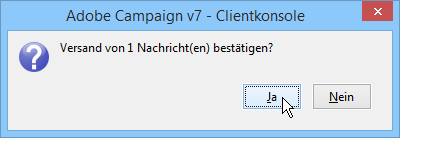

# Validierung{#validating}

In [diesem Abschnitt](steps-validating-the-delivery.md) werden globale Konzepte zur Validierung eines Versands vorgestellt.

Die Ausgabedatei eines Briefpost-Versands wird während der Versandanalyse generiert. Der Inhalt der Datei hängt von den ausgewählten Ausgabespalten ab (siehe [Extraktionsdatei](defining-the-direct-mail-content.md#extraction-file)).

>[!NOTE]
>
>Die Analysephase ist im Abschnitt [Versand analysieren](steps-validating-the-delivery.md#analyzing-the-delivery) ausführlich beschrieben.

Während der Analysephase wird die Datei zwar generiert, die Empfängerinformationen (d. h. die Versandlogs) werden jedoch nicht aktualisiert. Sie können diesen Vorgang daher ohne Risiko abbrechen.

Überprüfen Sie das Ergebnis der Analyse und den Inhalt der Ausgabedatei, bevor Sie auf **[!UICONTROL Versand bestätigen]** klicken. Über eine Bestätigungsnachricht kann der Versand gestartet werden.

Mit der Absendebestätigung wird die Extraktion der Daten in die angegebene Datei gestartet.

Nun können Sie den Assistenten schließen und die Versand-Logs auf der Registerkarte **[!UICONTROL Versand]** ansehen, auf die Sie über die Detailansicht des Versands zugreifen können.

Sie können den Abrufmodus der Versandlogs auf der Registerkarte **[!UICONTROL Analyse]** der Versandeigenschaften konfigurieren.

Dabei stehen zwei Modi zur Verfügung:

* **[!UICONTROL Nachrichten werden nach Validierung als gesendet betrachtet]** (Standardmodus): In diesem Funktionsmodus werden alle Versandlogs aktualisiert, sobald der Benutzer den Versand bestätigt (ihr Status wechselt von &#39;Versand ausstehend&#39; zu &#39;Gesendet&#39;). Der Versand wechselt dann automatisch in den Status **[!UICONTROL Abgeschlossen]**.
* **[!UICONTROL Eine Ergebnisdatei bestimmt die gesendeten und die fehlgeschlagenen Nachrichten]** : In diesem Modus können Sie die Broadlogs über eine externe Datei aktualisieren, die vom Dienstleister gesendet wird. In diesem Fall muss ein Workflow zur Verarbeitung dieser Informationen verwendet werden, um den Broadlog-Status zu aktualisieren.

  >[!NOTE]
  >
  >Nach der Aktualisierung der Versandlogs muss der Versandstatus vom Benutzer in **[!UICONTROL Abgeschlossen]** geändert werden.
