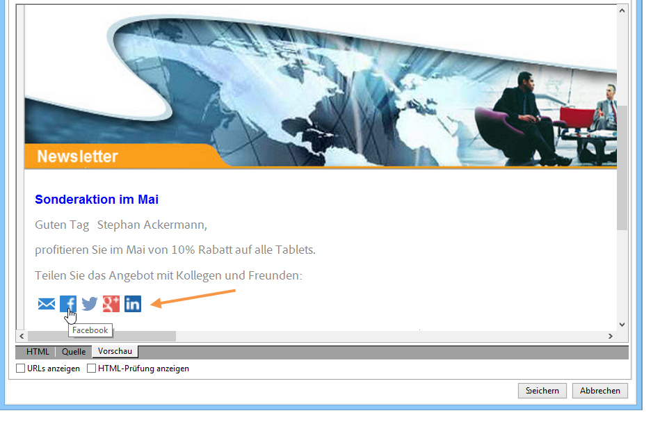
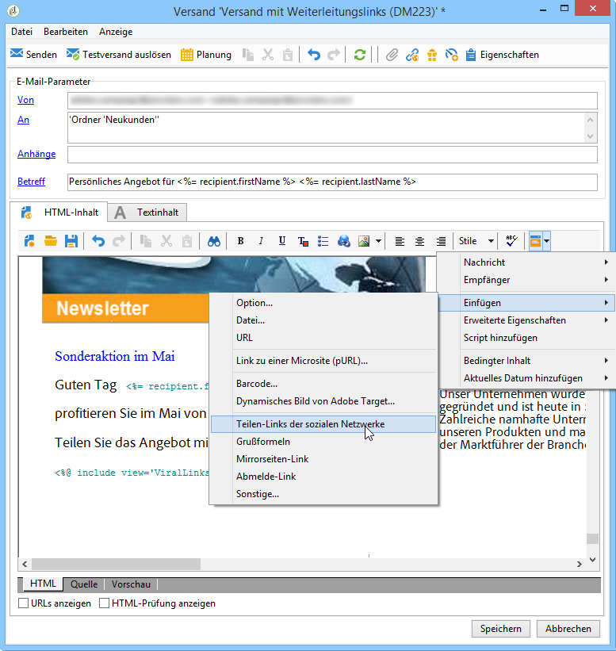
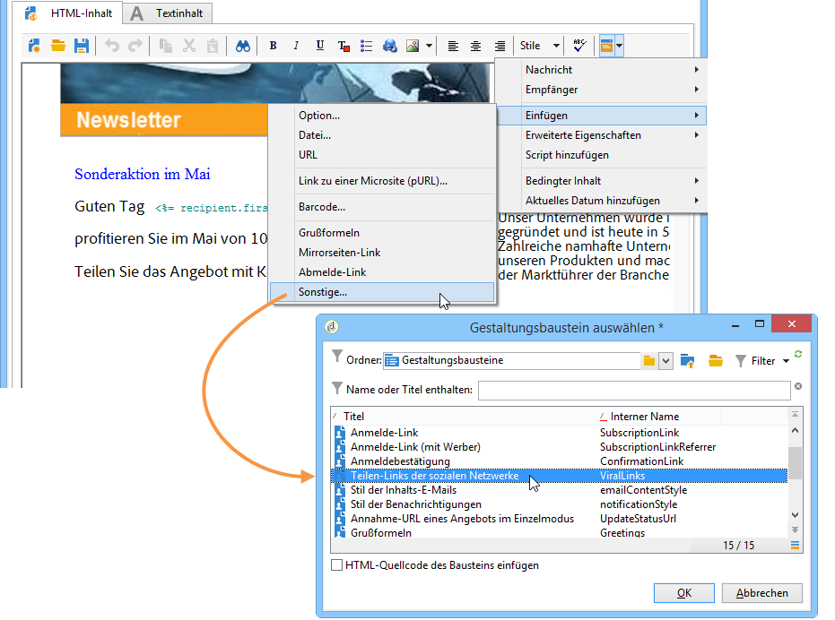
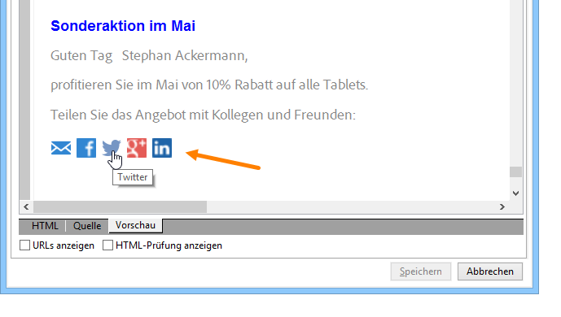
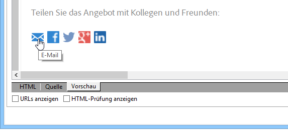
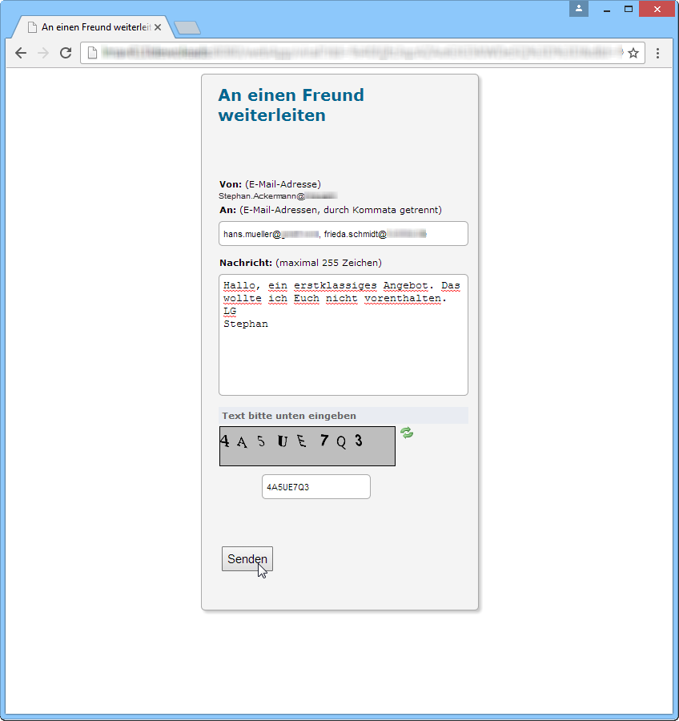
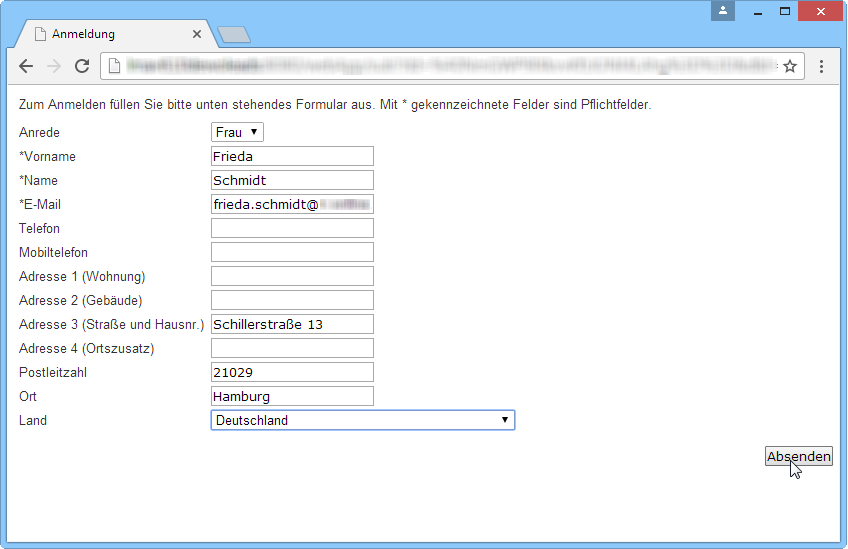
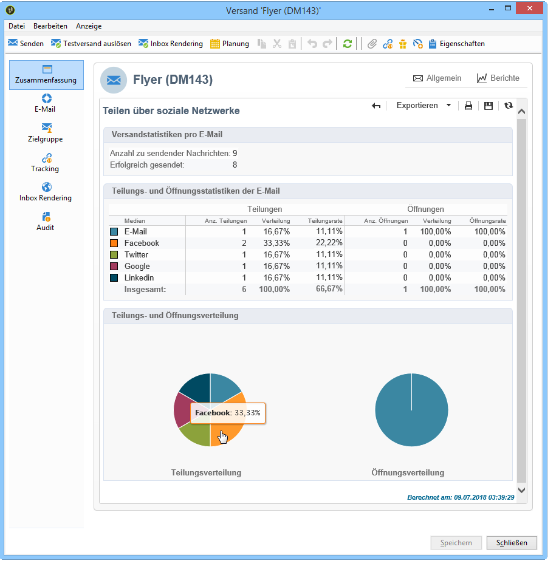

# Virale Marketingstrategien{#viral-and-social-marketing}

## Über virale Marketingstrategien {#about-viral-marketing}

Adobe Campaign bietet Features, die virale Marketingstrategien ermöglichen.

Sie können Empfängern Ihrer Sendungen und Webseitenbesuchern gestatten, Informationen mit ihrem Netzwerk zu teilen, sie beispielsweise als Link auf ihrem Facebook- oder Twitter-Profil zu veröffentlichen oder an Freunde weiterzuleiten.

>[!CAUTION]
>
>Damit diese Links korrekt funktionieren, muss die der Nachricht entsprechende Mirrorseite verfügbar sein. Der Versand muss demzufolge einen Link auf die Mirrorseite enthalten.

## Teilen von Links {#social-networks--sharing-a-link}

Um den Versandempfängern die Möglichkeit zu geben, den Inhalt der Nachrichten zu teilen, müssen Sie den entsprechenden Gestaltungsbaustein einfügen.

>[!NOTE]
>
>Dieser Link wird nicht standardmäßig in der Bausteinliste vorgeschlagen. Sie können jedoch durch Klick auf **[!UICONTROL Sonstige...]** darauf zugreifen. Wählen Sie dann aus den vorgeschlagenen Bausteinen **[!UICONTROL Teilen-Links der sozialen Netzwerke]** aus.

Der nachfolgende Screenshot zeigt das Ergebnis der Bausteineinfügung.

Wenn ein Empfänger auf das Symbol eines der vorgeschlagenen Netzwerke klickt, wird er automatisch zu seinem Konto weitergeleitet, um den Link zum Inhalt der Nachricht teilen zu können. Auf diese Weise können die Mitglieder seines Netzwerkes auf die Nachricht zugreifen.

>[!NOTE]
>
>Der verwendete Gestaltungsbaustein enthält alle Links (Weiterleitung und Teilen in allen sozialen Netzwerken). Er kann Ihren Bedürfnissen entsprechend angepasst werden. Diese Art der Konfiguration sollte jedoch erfahrenen Benutzern vorbehalten bleiben. Auf den Baustein kann im Knoten **[!UICONTROL Ressourcen > Kampagnenverwaltung > Gestaltungsbausteine]** zugegriffen werden.

## Weiterleiten von Nachrichten {#viral-marketing--forward-to-a-friend}

Sie haben die Möglichkeit, Ihre Kontakte zu Fürsprechern Ihrer Marke zu machen, indem Sie die Weiterleitung der Nachrichten gestatten. Die Profile der auf diese Weise geworbenen Kontakte werden vorrübergehend in einer hierfür vorgesehenen Tabelle der Datenbank gespeichert. Die weitergeleitete Nachricht enthält einen Link, der es dem Geworbenen ermöglicht, sich zu registrieren. Daraufhin wird er als Empfänger in der Adobe-Campaign-Datenbank gespeichert.

Gehen Sie zur Ermöglichung der Weiterleitung wie bei der Einfügung des Teilen-Links der sozialen Netzwerke vor.

Folgende Schritte sind dazu nötig:

1. Fügen Sie den Gestaltungsbaustein **[!UICONTROL Teilen-Links der sozialen Netzwerke]** in den Nachrichten-Textkörper ein.
1. Durch Klick auf das **[!UICONTROL E-Mail]**-Symbol kann der Empfänger die Nachricht an seine Kontakte weiterleiten.

   

   Ein Formular ermöglicht ihm nun, die E-Mail-Adressen seiner Kontakte anzugeben.

   

   Der Klick auf die Schaltfläche **[!UICONTROL Senden]** löst den Versand der Mitteilung aus.

   >[!NOTE]
   >
   >Der Inhalt der Mitteilung kann Ihren Bedürfnissen angepasst werden. Er beruht auf der Vorlage **[!UICONTROL Weiterleitung der ursprünglichen Nachricht]** und ist im Knoten **[!UICONTROL Administration > Kampagnenverwaltung > Vorlagen technischer Sendungen]** zugänglich.
   >
   >Sie können außerdem das Weiterleitungsformular Ihren Wünschen entsprechend ändern. Dies geschieht über die Webanwendung **Teilen-Formular**, auf die Sie im Knoten **[!UICONTROL Ressourcen > Online > Webanwendungen]** zugreifen können.

1. Ein Link innerhalb der weitergeleiteten Nachricht erlaubt es dem geworbenen Kontakt, sich in der Datenbank zu registrieren. Dies geschieht über ein Formular.

   

   >[!NOTE]
   >
   >Auch hier haben Sie die Möglichkeit, die Konfigurationen anzupassen. Begeben Sie sich hierzu in den Knoten **[!UICONTROL Ressourcen > Online > Webanwendungen]** und wählen Sie **Empfängeranmeldung** aus.
   >
   >Weitere Informationen zu Webanwendungen finden Sie in [diesem Abschnitt](../../web/using/about-web-applications.md).

   Eine automatische Nachricht bestätigt die Registrierung des Kontakts, seine Daten werden jedoch erst in der Datenbank gespeichert, wenn er den in der Bestätigung enthaltenen Link aktiviert. Die Bestätigungsnachricht wird unter Verwendung der Vorlage **[!UICONTROL Anmeldebestätigung]** erstellt, die im Knoten **[!UICONTROL Administration > Kampagnenverwaltung > Vorlagen technischer Sendungen]** zugänglich ist.

   Der geworbene Kontakt wird nun im **Empfänger**-Ordner der Datenbank gespeichert. Standardmäßig wurde er außerdem automatisch für den Informationsdienst **Newsletter** angemeldet.

## Teilen in sozialen Netzwerken tracken {#tracking-social-network-sharing}

Jede Weiterleitung und jeder Zugriff auf die geteilten Informationen wird auf Versandniveau getrackt. Es gibt zwei Möglichkeiten, auf die in Adobe Campaign gespeicherten Trackinginformationen zuzugreifen:

* im **[!UICONTROL Tracking]**-Tab des Versands (oder des Empfängerprofils):

   

* im Bericht **[!UICONTROL Teilen über soziale Netzwerke]**:

   

