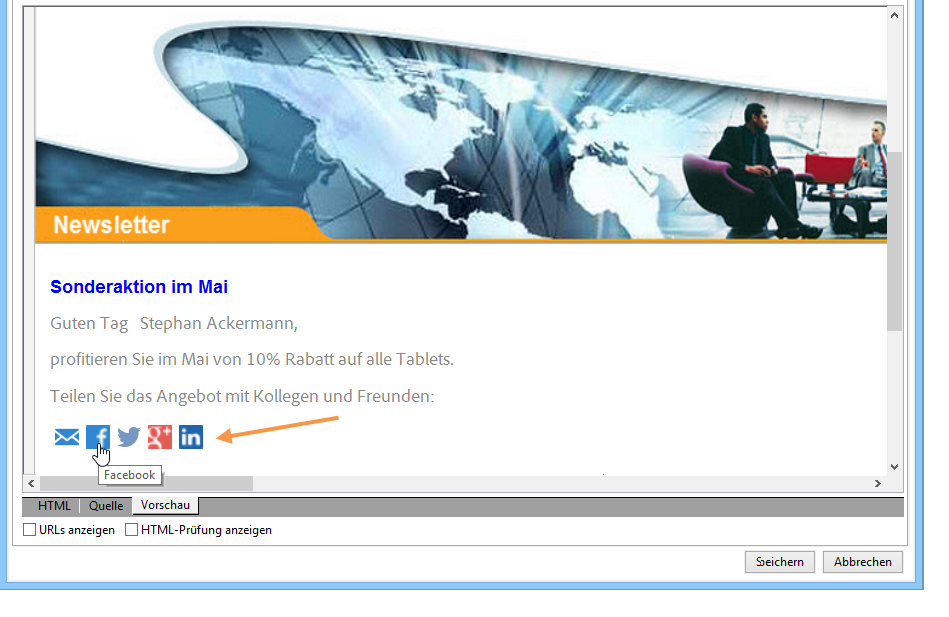
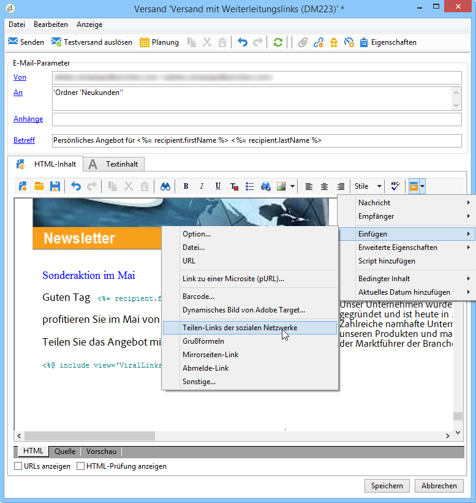
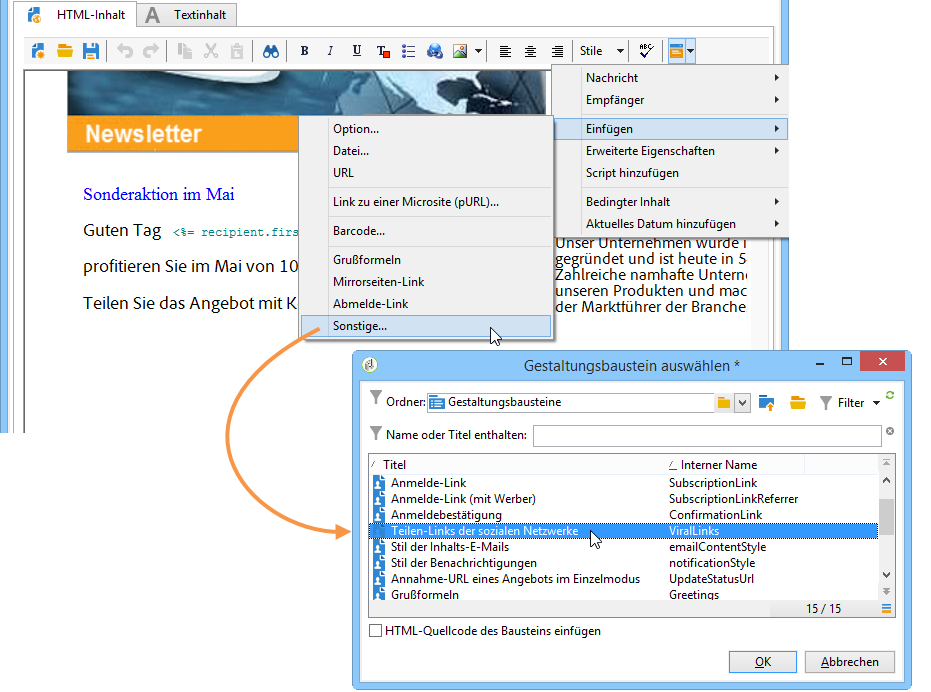
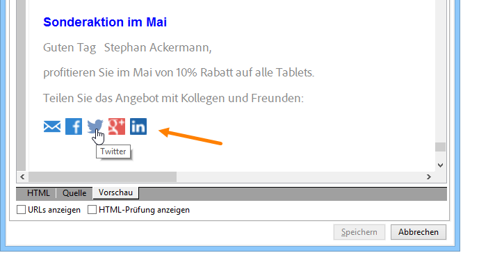
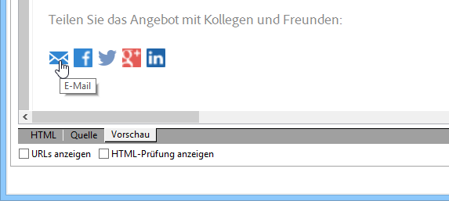
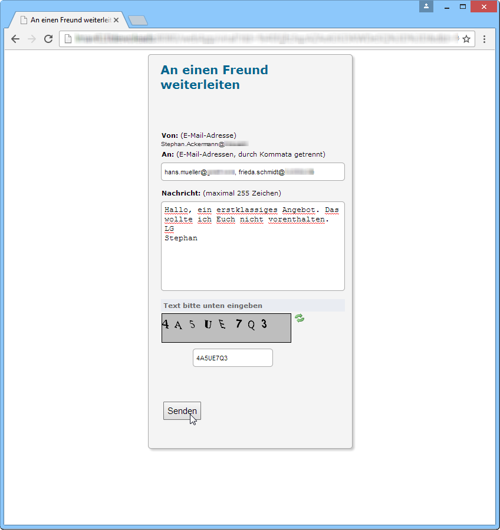
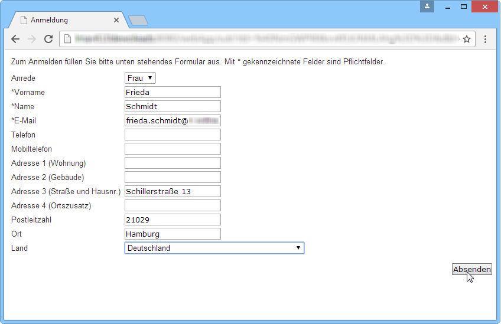
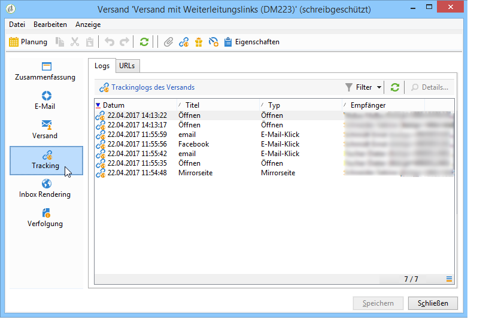
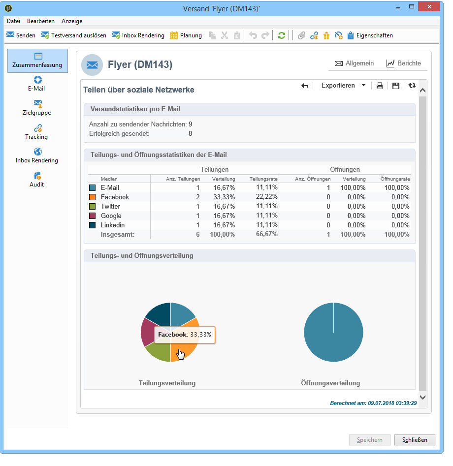

# Virales und Social-Media-Marketing{#viral-and-social-marketing}

Mit Adobe Campaign können Sie Tools zur Förderung des viralen Marketings einrichten.

Damit können Empfängerinnen und Empfänger eines Versands oder Website-Besucherinnen und -Besucher Informationen mit ihrem Netzwerk teilen, indem sie beispielsweise einen Link auf ihrem Facebook- oder X-Profil (früher bekannt als Twitter) hinzufügen oder eine Nachricht an Freundinnen und Freunde senden.

>[!CAUTION]
>
>Damit hinzugefügte Links ordnungsgemäß funktionieren, muss die entsprechende Mirrorseite verfügbar sein. Fügen Sie dazu den Link zur Mirrorseite in den Versand ein.

## Soziale Netzwerke: Teilen von Links {#social-networks--sharing-a-link}

Um den Versandempfängern die Möglichkeit zu geben, den Inhalt der Nachrichten zu teilen, müssen Sie den entsprechenden Gestaltungsbaustein einfügen.

>[!NOTE]
>
>Standardmäßig wird dieser Link nicht in der Blockliste angeboten. Sie können darauf zugreifen, indem Sie auf **[!UICONTROL Sonstige…]** klicken und den **[!UICONTROL Link zur Freigabe in sozialen Netzwerken]** auswählen.

Der nachfolgende Screenshot zeigt das Ergebnis der Bausteineinfügung.

Wenn der Empfänger auf das Symbol eines der angezeigten sozialen Netzwerke klickt, wird er automatisch zu seinem Konto weitergeleitet und kann den Nachrichteninhalt über einen Link teilen. Auf diese Weise können die Mitglieder ihres Netzwerks auf die Kommunikation zugreifen.

>[!NOTE]
>
>Dieser Gestaltungsbaustein enthält alle Links (zum Senden von Nachrichten und zum Teilen mit allen sozialen Netzwerken). Es kann an Ihre Bedürfnisse angepasst werden. Die Konfiguration ist jedoch erfahrenen Benutzern vorbehalten. Auf den Baustein kann im Knoten **[!UICONTROL Ressourcen > Kampagnenverwaltung > Gestaltungsbausteine]** zugegriffen werden.

## Weiterleiten von Nachrichten {#viral-marketing--forward-to-a-friend}

Ein viraler Dienst ermöglicht die Ausführung von Aktionen vom Typ „Empfehlung“: Diese Aktionen ermöglichen es Ihnen, eine Nachricht an einen Freund weiterzuleiten. Das Profil des/der Schiedsrichter(s) wird vorübergehend in der Datenbank (in einer dedizierten Tabelle) gespeichert. Weitergeleitete Nachrichten enthalten einen Link, über den der Schiedsrichter abonnieren kann: Wenn sie dies tun, werden sie der Adobe Campaign-Datenbank hinzugefügt.

Gehen Sie zur Ermöglichung der Weiterleitung wie bei der Einfügung des Teilen-Links der sozialen Netzwerke vor.

Folgende Schritte sind dazu nötig:

1. Fügen Sie den Gestaltungsbaustein **[!UICONTROL Teilen-Links der sozialen Netzwerke]** in den Nachrichten-Textkörper ein.
1. Durch Klick auf das **[!UICONTROL E-Mail]**-Symbol kann der Empfänger die Nachricht an seine Kontakte weiterleiten.

   

   Ein Formular ermöglicht ihm nun, die E-Mail-Adressen seiner Kontakte anzugeben.

   

   Der Klick auf die Schaltfläche **[!UICONTROL Senden]** löst den Versand der Nachricht aus.

   >[!NOTE]
   >
   >Der Inhalt der Mitteilung kann Ihren Bedürfnissen angepasst werden. Er beruht auf der Vorlage **[!UICONTROL Weiterleitung der ursprünglichen Nachricht]** und ist im Knoten **[!UICONTROL Administration > Kampagnenverwaltung > Vorlagen technischer Sendungen]** zugänglich.
   >
   >Sie können außerdem das Weiterleitungsformular Ihren Wünschen entsprechend ändern. Dies geschieht über die Webanwendung **Teilen-Formular**, auf die Sie im Knoten **[!UICONTROL Ressourcen > Online > Webanwendungen]** zugreifen können.

1. In der weitergeleiteten Nachricht ermöglicht ein Link dem Schiedsrichter, sein Profil in der Datenbank zu speichern. Hierfür wird ein Anmeldeformular bereitgestellt.

   

   >[!NOTE]
   >
   >Auch hier haben Sie die Möglichkeit, die Konfigurationen anzupassen. Begeben Sie sich hierzu in den Knoten **[!UICONTROL Ressourcen > Online > Webanwendungen]** und wählen Sie **Empfängeranmeldung** aus.
   >
   >Weitere Informationen zu Webanwendungen finden Sie in [diesem Abschnitt](../../web/using/about-web-applications.md).

   Eine automatische Nachricht bestätigt die Registrierung des Kontakts, seine Daten werden jedoch erst in der Datenbank gespeichert, wenn er den in der Bestätigung enthaltenen Link aktiviert. Die Bestätigungsnachricht wird unter Verwendung der Vorlage **[!UICONTROL Anmeldebestätigung]** erstellt, die im Knoten **[!UICONTROL Administration > Kampagnenverwaltung > Vorlagen technischer Sendungen]** zugänglich ist.

   Der geworbene Kontakt wird nun im **Empfänger**-Ordner der Datenbank gespeichert. Standardmäßig wurde er außerdem automatisch für den Informationsdienst **Newsletter** angemeldet.

## Teilen in sozialen Netzwerken tracken {#tracking-social-network-sharing}

Die Freigabe und der Zugriff auf freigegebene Informationen werden verfolgt. Diese von Adobe Campaign erfassten Informationen sind an zwei Stellen verfügbar:

* im **[!UICONTROL Tracking]**-Tab des Versands (oder des Empfängerprofils):

  

* im Bericht **[!UICONTROL Teilen über soziale Netzwerke]**:

  
