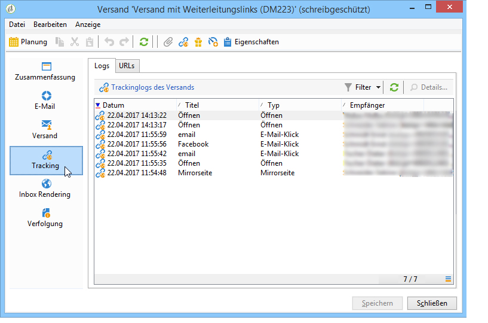

# Virale Marketingstrategien{#viral-and-social-marketing}

## Über virale Marketingstrategien {#about-viral-marketing}

Adobe Campaign bietet Features, die virale Marketingstrategien ermöglichen.

Sie können Empfängern Ihrer Sendungen und Webseitenbesuchern gestatten, Informationen mit ihrem Netzwerk zu teilen, sie beispielsweise als Link auf ihrem Facebook- oder Twitter-Profil zu veröffentlichen oder an Freunde weiterzuleiten.

>[!CAUTION]
>
>Damit diese Links korrekt funktionieren, muss die der Nachricht entsprechende Mirrorseite verfügbar sein. Der Versand muss demzufolge einen Link auf die Mirrorseite enthalten.

## Teilen von Links {#social-networks--sharing-a-link}

Um den Versandempfängern die Möglichkeit zu geben, den Inhalt der Nachrichten zu teilen, müssen Sie den entsprechenden Gestaltungsbaustein einfügen.

>[!NOTE]
>
>Standardmäßig wird dieser Link nicht in der Blockliste angezeigt. Sie können darauf zugreifen, indem Sie auf **[!UICONTROL Other...]** und den **[!UICONTROL Social network sharing links]** Block auswählen.

Der nachfolgende Screenshot zeigt das Ergebnis der Bausteineinfügung.

Wenn ein Empfänger auf das Symbol eines der vorgeschlagenen Netzwerke klickt, wird er automatisch zu seinem Konto weitergeleitet, um den Link zum Inhalt der Nachricht teilen zu können. Auf diese Weise können die Mitglieder seines Netzwerkes auf die Nachricht zugreifen.

>[!NOTE]
>
>Dieser Personalisierungsblock enthält alle Links (zum Senden und Freigeben von Nachrichten an alle sozialen Netzwerke). Es kann an Ihre Bedürfnisse angepasst werden. Die Konfiguration ist jedoch für fortgeschrittene Benutzer reserviert. Um den passenden Personalisierungsblock zu bearbeiten, gehen Sie zum **[!UICONTROL Resources > Campaign management > Personalization blocks]** Knoten der Adobe Campaign-Struktur.

## Weiterleiten von Nachrichten {#viral-marketing--forward-to-a-friend}

Sie haben die Möglichkeit, Ihre Kontakte zu Fürsprechern Ihrer Marke zu machen, indem Sie die Weiterleitung der Nachrichten gestatten. Die Profile der auf diese Weise geworbenen Kontakte werden vorrübergehend in einer hierfür vorgesehenen Tabelle der Datenbank gespeichert. Die weitergeleitete Nachricht enthält einen Link, der es dem Geworbenen ermöglicht, sich zu registrieren. Daraufhin wird er als Empfänger in der Adobe-Campaign-Datenbank gespeichert.

Gehen Sie zur Ermöglichung der Weiterleitung wie bei der Einfügung des Teilen-Links der sozialen Netzwerke vor.

Folgende Schritte sind dazu nötig:

1. Fügen Sie den **[!UICONTROL Social network sharing links]** Personalisierungsblock in den Text der ursprünglichen Nachricht ein.
1. Durch Klick auf das **[!UICONTROL Email]**-Symbol kann der Empfänger die Nachricht an seine Kontakte weiterleiten.

   

   Ein Formular ermöglicht ihm nun, die E-Mail-Adressen seiner Kontakte anzugeben.

   

   The message is sent to them when the main recipient clicks the **[!UICONTROL Next]** button.

   >[!NOTE]
   >
   >Der Inhalt dieser Nachricht kann an Ihre Bedürfnisse angepasst werden. Er wird basierend auf der **[!UICONTROL Transfer of original message]** Vorlage erstellt, die im **[!UICONTROL Administration > Campaign management > Technical delivery templates]** Knoten gespeichert wird.
   >
   >It is also possible to change the message forward form made available to the referrer To do this, you need to change the **Viral form** Web application stored in the **[!UICONTROL Resources > Online > Web applications]** node.

1. Ein Link innerhalb der weitergeleiteten Nachricht erlaubt es dem geworbenen Kontakt, sich in der Datenbank zu registrieren. Dies geschieht über ein Formular.

   

   >[!NOTE]
   >
   >Diese Konfiguration kann angepasst werden. Dazu müssen Sie die Webanwendung für das **Abonnement** des Empfängers ändern, die im **[!UICONTROL Resources > Online > Web applications]** Knoten gespeichert ist.
   >
   >Weitere Informationen zu Webanwendungen finden Sie in [diesem Abschnitt](../../web/using/about-web-applications.md).

   Nach der Validierung wird eine Bestätigungsmeldung gesendet: sie werden erst dann endgültig registriert, wenn sie den Link in der Bestätigungsmeldung aktivieren. Diese Meldung wird basierend auf der **[!UICONTROL Registration confirmation]** Vorlage erstellt, die im **[!UICONTROL Administration > Campaign management > Technical delivery templates]** Knoten gespeichert wird.

   Der geworbene Kontakt wird nun im **Empfänger**-Ordner der Datenbank gespeichert. Standardmäßig wurde er außerdem automatisch für den Informationsdienst **Newsletter** angemeldet.

## Teilen in sozialen Netzwerken tracken {#tracking-social-network-sharing}

Jede Weiterleitung und jeder Zugriff auf die geteilten Informationen wird auf Versandniveau getrackt. Es gibt zwei Möglichkeiten, auf die in Adobe Campaign gespeicherten Trackinginformationen zuzugreifen:

* im **[!UICONTROL Tracking]**-Tab des Versands (oder des Empfängerprofils):

   

* in einem eigenen **[!UICONTROL Sharing to social networks]** Bericht:

   

